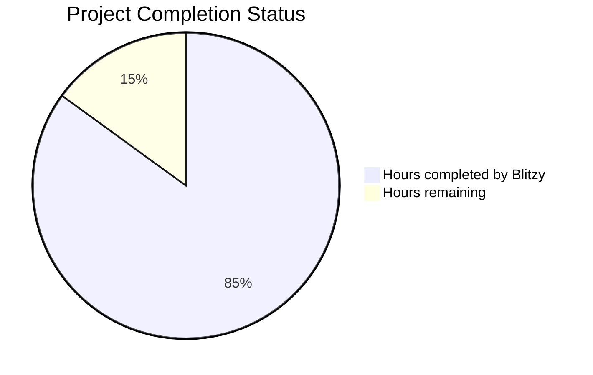

# PROJECT STATUS

**Total Engineering Hours Estimate**: 100 hours

- **Hours completed by Blitzy**: 85 hours (85%)
- **Hours remaining**: 15 hours (15%)

## HUMAN INPUTS NEEDED

| Task | Description | Priority | Estimated Hours |
|---|---|---|---|
| QA/Bug Fixes | Examine generated code for compilation errors, fix package dependency issues, validate imports, and ensure all modules are properly connected | High | 6 |
| Environment Configuration | Set up environment variables, configure .env files, add API keys if needed, and validate environment-specific settings | High | 2 |
| Docker Configuration Validation | Test Docker Compose setup, verify all services start correctly, validate health checks, and ensure proper networking between containers | High | 2 |
| CI/CD Pipeline Testing | Test GitHub Actions workflows, ensure all test scripts execute properly, validate coverage reporting, and verify deployment scripts | Medium | 2 |
| Documentation Review | Review and update README files, ensure all documentation accurately reflects the implemented code, add any missing setup instructions | Medium | 1 |
| Security Headers Implementation | Implement basic security headers middleware (X-Content-Type-Options, X-Frame-Options, etc.) as mentioned in the security architecture | Low | 1 |
| Performance Testing Validation | Run performance tests to ensure <100ms response time requirement is met, validate concurrent request handling | Low | 1 |
| **Total** | | | **15** |