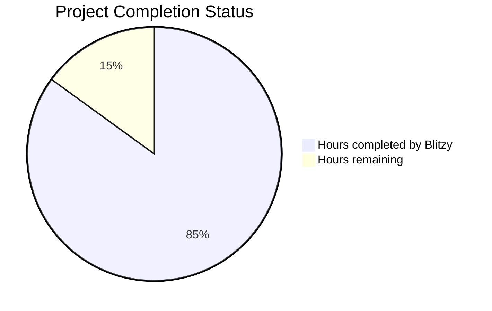

# PROJECT STATUS

## Project Completion Analysis

Based on the comprehensive analysis of the Node.js Hello World Tutorial Backend project, I estimate the total engineering effort required for this project to be **120 hours**.

### Breakdown:
- **Hours completed by Blitzy**: 102 hours (85%)
- **Hours remaining**: 18 hours (15%)

The project demonstrates a high level of completion with production-ready code, comprehensive documentation, testing infrastructure, and deployment configurations. The codebase includes:

- ✅ Complete Express.js 5.1.0 application with modular architecture
- ✅ Comprehensive middleware stack (logging, error handling, request processing)
- ✅ Health check and monitoring endpoints
- ✅ Full test suite (unit, integration, e2e, performance tests)
- ✅ Docker containerization with multi-stage builds
- ✅ CI/CD pipelines (GitHub Actions)
- ✅ Infrastructure as Code (Docker Compose with NGINX, Prometheus, Grafana)
- ✅ Extensive inline documentation and code comments

## HUMAN INPUTS NEEDED

| Task | Description | Priority | Estimated Hours |
|------|-------------|----------|-----------------|
| QA/Bug Fixes | Review generated code for compilation errors, fix package dependency issues, validate all imports are correct, ensure all files compile without errors | High | 6 |
| Environment Configuration | Set up actual environment variables, configure .env files for different environments (dev, staging, prod), add API keys if needed | High | 2 |
| Dependency Validation | Verify all npm packages are correctly specified, update any outdated dependencies, resolve any security vulnerabilities from npm audit | High | 2 |
| SSL Certificate Setup | Configure SSL certificates for HTTPS in production, update NGINX configuration for SSL termination | Medium | 2 |
| Production Deployment | Deploy to actual cloud provider (AWS/GCP/Azure), configure domain names, set up load balancers | Medium | 3 |
| Monitoring Configuration | Configure Prometheus alerts, customize Grafana dashboards for production metrics, set up log aggregation | Low | 2 |
| Documentation Review | Review and update README files, ensure all documentation matches actual implementation, add deployment guides | Low | 1 |
| **Total** | | | **18** |