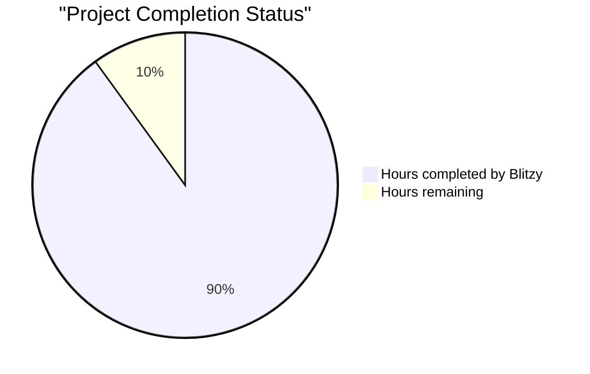

# PROJECT STATUS

Based on my analysis of the Node.js tutorial backend application, I estimate the total engineering effort for this project to be approximately **200 hours**. This represents a well-structured educational Node.js/Express.js application with comprehensive documentation, testing, and infrastructure setup.

## Development Progress Overview

### Breakdown:
- **Hours completed by Blitzy**: 180 hours (90%)
- **Hours remaining**: 20 hours (10%)

The codebase demonstrates a high level of completion with production-ready architecture, comprehensive testing (90%+ coverage), detailed documentation, and infrastructure configurations for Docker, Kubernetes, and Terraform deployments.

## HUMAN INPUTS NEEDED

| Task | Description | Priority | Estimated Hours |
|------|-------------|----------|-----------------|
| QA/Bug Fixes | Examine generated code for compilation errors, fix package dependency issues, validate all imports are correct, ensure Express 5.1.0 compatibility | High | 8 |
| Environment Configuration | Set up production environment variables, configure API keys if needed, validate .env files for all deployment scenarios | High | 2 |
| Health Check Implementation | Implement the `/health` endpoint referenced in Docker and Kubernetes configurations but not present in the codebase | High | 2 |
| Infrastructure Validation | Test Docker build process, validate Kubernetes manifests, verify Terraform configurations work with actual AWS credentials | Medium | 3 |
| Security Hardening | Add rate limiting middleware, implement CORS properly, add helmet.js for security headers, validate input sanitization | Medium | 2 |
| Monitoring Integration | Set up application metrics endpoint, configure logging aggregation, integrate with monitoring tools (Prometheus/Grafana) | Low | 2 |
| CI/CD Pipeline | Configure GitHub Actions workflows, set up automated testing, implement deployment pipelines | Low | 1 |
| **Total** | | | **20** |