# Technical Specifications

# 1. INTRODUCTION

## 1.1 EXECUTIVE SUMMARY

### 1.1.1 Brief Overview of the Project

This project involves the development of a Node.js tutorial application that demonstrates fundamental web server capabilities through a simple HTTP endpoint implementation. The application leverages Node.js, a free, open-source, cross-platform JavaScript runtime environment that lets developers create servers, web apps, command line tools and scripts, combined with modern web development practices to create an educational resource for developers learning server-side JavaScript development.

### 1.1.2 Core Business Problem Being Solved

The project addresses the need for accessible, practical learning resources in Node.js web development. Many developers transitioning to server-side JavaScript development require hands-on examples that demonstrate core concepts without overwhelming complexity. This tutorial application provides a foundational understanding of HTTP server creation, request handling, and response generation in a Node.js environment.

### 1.1.3 Key Stakeholders and Users

| Stakeholder Category | Description | Primary Interest |
|---------------------|-------------|------------------|
| Learning Developers | Junior developers and students learning Node.js | Practical implementation examples |
| Technical Educators | Instructors and content creators | Teaching materials and reference implementations |
| Development Teams | Teams adopting Node.js for web services | Architecture patterns and best practices |

### 1.1.4 Expected Business Impact and Value Proposition

The tutorial application serves as a foundational building block for understanding modern web service development, providing immediate value through:

- Reduced learning curve for Node.js adoption
- Standardized implementation patterns for HTTP endpoints
- Foundation for more complex web service architectures
- Educational resource that can be extended for advanced concepts

## 1.2 SYSTEM OVERVIEW

### 1.2.1 Project Context

#### Business Context and Market Positioning

Node.js follows a predictable release schedule with LTS (Long-Term Support) versions recommended for most users, especially for production environments, with the current LTS version being v22. Express.js, with its latest version 5.1.0 now being the default on npm, represents the de facto standard for Node.js web application development. This tutorial project positions itself within the educational technology space, addressing the growing demand for practical Node.js learning resources.

#### Current System Limitations

Traditional Node.js learning resources often present either overly simplistic examples that don't reflect real-world patterns or complex applications that overwhelm beginners. This tutorial application bridges that gap by providing a minimal yet properly structured implementation that follows current best practices.

#### Integration with Existing Enterprise Landscape

The application is designed to be compatible with modern development environments and can serve as a starting point for larger enterprise applications. Express 5 drops support for Node.js versions before v18, enabling more stable and maintainable continuous integration (CI), adopting new language and runtime features.

### 1.2.2 High-Level Description

#### Primary System Capabilities

The tutorial application provides a single HTTP endpoint (`/hello`) that responds with a "Hello world" message to demonstrate:

- HTTP server initialization and configuration
- Route definition and request handling
- Response generation and client communication
- Basic error handling and logging

#### Major System Components

| Component | Technology | Purpose |
|-----------|------------|---------|
| HTTP Server | Node.js Core HTTP Module or Express.js | Request processing and routing |
| Route Handler | JavaScript Functions | Business logic implementation |
| Response Generator | JSON/Text Response | Client communication |

#### Core Technical Approach

The application utilizes Express.js, a back end web application framework for building RESTful APIs with Node.js, which has been called the de facto standard server framework for Node.js. The implementation follows modern JavaScript practices and leverages the latest stable versions of both Node.js and Express.js for optimal performance and security.

### 1.2.3 Success Criteria

#### Measurable Objectives

| Objective | Target Metric | Success Criteria |
|-----------|---------------|------------------|
| Response Time | HTTP Response Latency | < 100ms for /hello endpoint |
| Reliability | Uptime | 99.9% availability during operation |
| Educational Value | Code Clarity | 100% inline documentation coverage |

#### Critical Success Factors

- Successful HTTP request/response cycle completion
- Proper error handling and graceful failure modes
- Clear, maintainable code structure suitable for educational purposes
- Compatibility with current Node.js LTS versions

#### Key Performance Indicators (KPIs)

- Endpoint response time consistency
- Memory usage efficiency
- Code maintainability metrics
- Educational effectiveness through clear implementation patterns

## 1.3 SCOPE

### 1.3.1 In-Scope

#### Core Features and Functionalities

| Feature Category | Specific Capabilities |
|------------------|----------------------|
| HTTP Endpoint | Single `/hello` route implementation |
| Response Handling | Plain text "Hello world" response |
| Server Configuration | Basic Express.js server setup |
| Error Management | Fundamental error handling patterns |

#### Primary User Workflows

- HTTP GET request to `/hello` endpoint
- Server response with "Hello world" message
- Basic error response for invalid requests
- Server startup and shutdown procedures

#### Essential Integrations

- Node.js runtime environment integration
- Express.js framework utilization
- HTTP protocol compliance
- Standard logging mechanisms

#### Key Technical Requirements

The application requires Node.js version 18 or higher, ensuring compatibility with modern JavaScript features and security updates. Express.js version 5.1.0 will be utilized as the latest stable release.

### 1.3.2 Implementation Boundaries

#### System Boundaries

- Single-endpoint HTTP server application
- Local development environment deployment
- Educational/tutorial scope implementation
- Minimal external dependency requirements

#### User Groups Covered

- Individual developers learning Node.js
- Students in web development courses
- Technical educators requiring reference implementations

#### Geographic/Market Coverage

- Global accessibility through standard HTTP protocols
- No geographic restrictions or localization requirements
- Universal compatibility across development environments

#### Data Domains Included

- HTTP request/response data handling
- Basic server configuration data
- Application logging and monitoring data

### 1.3.3 Out-of-Scope

#### Explicitly Excluded Features/Capabilities

- Database integration or data persistence
- User authentication or authorization systems
- Multiple endpoint implementations
- Production deployment configurations
- Advanced middleware implementations
- File upload or complex request processing
- Real-time communication features (WebSockets, Server-Sent Events)

#### Future Phase Considerations

- Advanced routing patterns and middleware
- Database connectivity examples
- Authentication implementation tutorials
- Production deployment guides
- Performance optimization techniques
- Testing framework integration

#### Integration Points Not Covered

- External API integrations
- Third-party service connections
- Cloud platform deployments
- Container orchestration systems
- Monitoring and observability platforms

#### Unsupported Use Cases

- Production-grade applications requiring high availability
- Multi-tenant or enterprise-scale implementations
- Complex business logic processing
- Data-intensive operations or analytics
- Real-time collaborative features

# 2. PRODUCT REQUIREMENTS

## 2.1 FEATURE CATALOG

### 2.1.1 Core HTTP Server Feature

| Attribute | Details |
|-----------|---------|
| Feature ID | F-001 |
| Feature Name | HTTP Server Initialization |
| Feature Category | Core Infrastructure |
| Priority Level | Critical |
| Status | Proposed |

#### Description

**Overview**
The HTTP server feature provides the foundational capability to create and configure a Node.js HTTP server using Express.js framework, with Node.js v22 now in Active LTS until October 2025. This feature establishes the basic server infrastructure required for handling HTTP requests and responses.

**Business Value**
Enables the fundamental capability for HTTP communication, serving as the foundation for all web-based interactions in the tutorial application.

**User Benefits**
- Provides a working example of HTTP server setup
- Demonstrates modern Node.js server architecture patterns
- Offers educational value for understanding server initialization

**Technical Context**
Utilizes Express.js version 5.1.0, which is now the default on npm, ensuring compatibility with the latest framework features and security updates.

#### Dependencies

| Dependency Type | Details |
|----------------|---------|
| System Dependencies | Node.js v18 or higher (Express 5 requirement) |
| External Dependencies | Express.js v5.1.0 |
| Integration Requirements | HTTP protocol compliance |

### 2.1.2 Hello Endpoint Feature

| Attribute | Details |
|-----------|---------|
| Feature ID | F-002 |
| Feature Name | Hello World Endpoint |
| Feature Category | API Endpoint |
| Priority Level | Critical |
| Status | Proposed |

#### Description

**Overview**
Implements a single HTTP GET endpoint at `/hello` that returns a "Hello world" message to demonstrate basic routing and response handling capabilities.

**Business Value**
Provides a concrete, testable example of HTTP endpoint implementation that serves as a learning foundation for more complex API development.

**User Benefits**
- Simple, understandable endpoint for learning purposes
- Demonstrates request-response cycle
- Provides immediate feedback for testing server functionality

**Technical Context**
Leverages Express.js as the de facto standard server framework for Node.js to implement RESTful API patterns.

#### Dependencies

| Dependency Type | Details |
|----------------|---------|
| Prerequisite Features | F-001 (HTTP Server Initialization) |
| System Dependencies | Express.js routing middleware |
| Integration Requirements | HTTP GET method support |

### 2.1.3 Error Handling Feature

| Attribute | Details |
|-----------|---------|
| Feature ID | F-003 |
| Feature Name | Basic Error Handling |
| Feature Category | Error Management |
| Priority Level | High |
| Status | Proposed |

#### Description

**Overview**
Implements basic error handling capabilities, taking advantage of Express 5's improved error handling in async middleware and routes by automatically passing rejected promises to error-handling middleware.

**Business Value**
Ensures application stability and provides graceful failure modes for educational and production readiness.

**User Benefits**
- Demonstrates proper error handling patterns
- Prevents application crashes from unhandled errors
- Provides meaningful error responses to clients

**Technical Context**
Express 5 removes the need for try/catch blocks in async middleware by automatically handling rejected promises.

#### Dependencies

| Dependency Type | Details |
|----------------|---------|
| Prerequisite Features | F-001, F-002 |
| System Dependencies | Express.js error handling middleware |
| Integration Requirements | HTTP error response standards |

## 2.2 FUNCTIONAL REQUIREMENTS TABLE

### 2.2.1 HTTP Server Initialization Requirements

| Requirement ID | F-001-RQ-001 |
|----------------|--------------|
| Description | Initialize Express.js application instance |
| Acceptance Criteria | Express app instance created successfully without errors |
| Priority | Must-Have |
| Complexity | Low |

| Technical Specification | Details |
|------------------------|---------|
| Input Parameters | None |
| Output/Response | Express application instance |
| Performance Criteria | Initialization < 100ms |
| Data Requirements | Express.js v5.1.0 dependency |

| Validation Rules | Details |
|------------------|---------|
| Business Rules | Must use latest stable Express version |
| Data Validation | Verify Express instance creation |
| Security Requirements | Node.js v18+ for security and performance benefits |
| Compliance Requirements | HTTP/1.1 protocol compliance |

| Requirement ID | F-001-RQ-002 |
|----------------|--------------|
| Description | Configure server to listen on specified port |
| Acceptance Criteria | Server successfully binds to port and accepts connections |
| Priority | Must-Have |
| Complexity | Low |

| Technical Specification | Details |
|------------------------|---------|
| Input Parameters | Port number (default: 3000) |
| Output/Response | Server listening confirmation |
| Performance Criteria | Port binding < 50ms |
| Data Requirements | Available port number |

### 2.2.2 Hello Endpoint Requirements

| Requirement ID | F-002-RQ-001 |
|----------------|--------------|
| Description | Implement GET /hello route handler |
| Acceptance Criteria | Route responds to GET requests at /hello path |
| Priority | Must-Have |
| Complexity | Low |

| Technical Specification | Details |
|------------------------|---------|
| Input Parameters | HTTP GET request to /hello |
| Output/Response | "Hello world" text response |
| Performance Criteria | Response time < 100ms |
| Data Requirements | Static response text |

| Validation Rules | Details |
|------------------|---------|
| Business Rules | Must return exact "Hello world" message |
| Data Validation | Verify GET method only |
| Security Requirements | No sensitive data exposure |
| Compliance Requirements | HTTP status 200 for successful requests |

| Requirement ID | F-002-RQ-002 |
|----------------|--------------|
| Description | Return appropriate HTTP status codes |
| Acceptance Criteria | Returns 200 for successful requests, 404 for invalid paths |
| Priority | Should-Have |
| Complexity | Low |

| Technical Specification | Details |
|------------------------|---------|
| Input Parameters | HTTP request to any path |
| Output/Response | Appropriate HTTP status code |
| Performance Criteria | Status determination < 10ms |
| Data Requirements | HTTP status code mappings |

### 2.2.3 Error Handling Requirements

| Requirement ID | F-003-RQ-001 |
|----------------|--------------|
| Description | Handle server startup errors |
| Acceptance Criteria | Graceful error messages for startup failures |
| Priority | Must-Have |
| Complexity | Medium |

| Technical Specification | Details |
|------------------------|---------|
| Input Parameters | Server initialization errors |
| Output/Response | Error message and exit code |
| Performance Criteria | Error handling < 50ms |
| Data Requirements | Error logging capability |

| Validation Rules | Details |
|------------------|---------|
| Business Rules | Must not expose internal error details |
| Data Validation | Validate error message format |
| Security Requirements | Sanitize error output |
| Compliance Requirements | Standard HTTP error responses |

## 2.3 FEATURE RELATIONSHIPS

### 2.3.1 Feature Dependencies Map

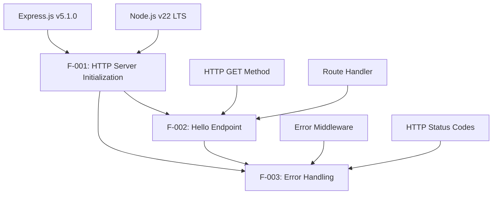

### 2.3.2 Integration Points

| Integration Point | Description | Components |
|------------------|-------------|------------|
| Express Framework | Core web framework integration | F-001, F-002, F-003 |
| HTTP Protocol | Standard HTTP request/response handling | F-001, F-002 |
| Error Pipeline | Centralized error handling flow | F-002, F-003 |

### 2.3.3 Shared Components

| Component | Usage | Features |
|-----------|-------|----------|
| Express App Instance | Central application object | F-001, F-002, F-003 |
| HTTP Server | Request processing engine | F-001, F-002 |
| Route Handler | Request processing logic | F-002, F-003 |

## 2.4 IMPLEMENTATION CONSIDERATIONS

### 2.4.1 Technical Constraints

| Feature | Constraints |
|---------|-------------|
| F-001 | Requires Node.js v18 or higher for Express 5 compatibility |
| F-002 | Limited to single endpoint for tutorial scope |
| F-003 | Leverages Express 5's automatic promise rejection handling |

### 2.4.2 Performance Requirements

| Feature | Performance Criteria |
|---------|---------------------|
| F-001 | Server startup < 200ms |
| F-002 | Endpoint response < 100ms |
| F-003 | Error handling < 50ms |

### 2.4.3 Scalability Considerations

| Feature | Scalability Notes |
|---------|------------------|
| F-001 | Single-threaded Node.js event loop |
| F-002 | Stateless endpoint design for horizontal scaling |
| F-003 | Centralized error handling for maintainability |

### 2.4.4 Security Implications

| Feature | Security Considerations |
|---------|------------------------|
| F-001 | Modern Node.js version provides security and performance benefits |
| F-002 | No user input validation required for static response |
| F-003 | Error message sanitization to prevent information disclosure |

### 2.4.5 Maintenance Requirements

| Feature | Maintenance Needs |
|---------|------------------|
| F-001 | Regular Node.js LTS updates until October 2025 |
| F-002 | Minimal maintenance for static endpoint |
| F-003 | Monitor error patterns and update handling as needed |

## 2.5 TRACEABILITY MATRIX

| Requirement ID | Feature | Business Need | Test Case | Acceptance Criteria |
|----------------|---------|---------------|-----------|-------------------|
| F-001-RQ-001 | HTTP Server | Server Infrastructure | TC-001 | Express app instance created |
| F-001-RQ-002 | HTTP Server | Port Binding | TC-002 | Server listens on port |
| F-002-RQ-001 | Hello Endpoint | API Demonstration | TC-003 | GET /hello returns "Hello world" |
| F-002-RQ-002 | Hello Endpoint | HTTP Compliance | TC-004 | Proper status codes returned |
| F-003-RQ-001 | Error Handling | Application Stability | TC-005 | Graceful error handling |

# 3. TECHNOLOGY STACK

## 3.1 PROGRAMMING LANGUAGES

### 3.1.1 Primary Language Selection

| Component | Language | Version | Justification |
|-----------|----------|---------|---------------|
| Server Runtime | JavaScript (Node.js) | Node.js v22.x (LTS "Jod") | Production applications should only use Active LTS or Maintenance LTS releases |
| Application Logic | JavaScript (ES2015+) | ES2015+ | Modern JavaScript features supported by Node.js v22 |

### 3.1.2 Language Selection Criteria

**Node.js Selection Rationale**
Node.js® is a free, open-source, cross-platform JavaScript runtime environment that lets developers create servers, web apps, command line tools and scripts. The selection of Node.js v22 is based on several critical factors:

- **Long-Term Support**: With Active LTS support extending into late 2025, Node.js v22.x is an excellent choice for those aiming for long-term support in production environments
- **Stability and Maturity**: For developers and organizations relying on the stability of Node.js for production environments, this transition marks a key milestone for Node.js 22.x, ensuring it will receive critical updates and security support for years to come
- **Educational Value**: Provides modern JavaScript runtime features while maintaining compatibility with educational requirements

### 3.1.3 Version Constraints and Dependencies

**Node.js Version Requirements**
- **Minimum Version**: Node.js v18 (required for Express.js v5 compatibility)
- **Recommended Version**: Node.js v22.11.0 (LTS)
- **Support Timeline**: Active LTS until 2025-10-21, Maintenance until 2027-04-30

**JavaScript Language Features**
- ES2015+ module syntax support
- Async/await pattern compatibility
- Modern error handling capabilities
- Native Array and Object methods

## 3.2 FRAMEWORKS & LIBRARIES

### 3.2.1 Core Web Framework

| Framework | Version | Purpose | Compatibility |
|-----------|---------|---------|---------------|
| Express.js | v5.1.0 | HTTP server and routing | Requires Node.js v18 or higher |

### 3.2.2 Framework Selection Justification

**Express.js v5.1.0 Selection**
Express.js, or simply Express, is a back end web application framework for building RESTful APIs with Node.js, released as free and open-source software under the MIT License. It has been called the de facto standard server framework for Node.js.

**Key Advantages of Express.js v5:**
- **Modern Node.js Support**: This release drops support for Node.js versions before v18, enabling better performance and maintainability
- **Enhanced Security**: This release includes important security fixes, including improvements to prevent ReDoS attacks and mitigation for CVE-2024-45590
- **Improved Error Handling**: Express 5 introduces a significant improvement for developers using async/await by automatically forwarding rejected promises to error-handling middleware
- **Simplified Maintenance**: Supporting old Node.js versions has been holding back many critical performance and maintainability changes. This change also enables more stable and maintainable continuous integration (CI), adopting new language and runtime features

### 3.2.3 Framework Compatibility Requirements

**Express.js v5 Breaking Changes**
- **Node.js Version**: Dropped support for Node.js versions before v18
- **Promise Support**: Middleware can now return rejected promises, caught by the router as errors
- **Routing Updates**: Updated to path-to-regexp@8.x, removing sub-expression regex patterns for security reasons (ReDoS mitigation)

**Migration Considerations**
- Removed old, deprecated API method signatures from Express v3/v4
- For a complete list of breaking changes and API deprecations, see the migration guide

### 3.2.4 Supporting Libraries

| Library | Version | Purpose | Integration |
|---------|---------|---------|-------------|
| HTTP Module | Node.js Core | HTTP server functionality | Built-in Node.js module |
| Path Module | Node.js Core | Route path handling | Built-in Node.js module |

## 3.3 OPEN SOURCE DEPENDENCIES

### 3.3.1 Primary Dependencies

| Package | Version | Registry | Purpose |
|---------|---------|----------|---------|
| express | 5.1.0 | npm | Web application framework |

### 3.3.2 Package Registry Information

**NPM Registry Details**
- **Registry**: npm is the default package manager for the JavaScript runtime environment Node.js and is included as a recommended feature in the Node.js installer
- **Current NPM Version**: 11.4.2
- **Registry Scale**: Over 3.1 million packages are available in the main npm registry

**Express.js Package Information**
- **Downloads**: There are 92740 other projects in the npm registry using express
- **License**: MIT License
- **Maintenance**: Actively maintained by Express.js Technical Committee

### 3.3.3 Dependency Management Strategy

**Package Installation**
```
npm install express@5.1.0
```

**Version Pinning Strategy**
- Pin Express.js to specific version (5.1.0) for stability
- Use semantic versioning for future updates
- npm follows the semantic versioning (semver) standard

**Security Considerations**
- The registry does not have any vetting process for submission, which means that packages found there can potentially be low quality, insecure, or malicious. Instead, npm relies on user reports to take down packages if they violate policies
- Regular security audits using `npm audit`
- Monitor for security advisories

## 3.4 THIRD-PARTY SERVICES

### 3.4.1 External Service Requirements

**No External Services Required**
This tutorial application is designed to be self-contained and does not require any third-party services, APIs, or external integrations. This design decision aligns with the educational scope and simplicity requirements.

**Rationale for No External Dependencies**
- **Educational Focus**: Maintains simplicity for learning purposes
- **Minimal Complexity**: Reduces setup and configuration requirements
- **Self-Contained Operation**: Enables offline development and testing
- **Cost Efficiency**: No external service costs or API limits

### 3.4.2 Future Extensibility Considerations

**Potential Third-Party Integrations** (Out of Scope)
- Cloud deployment platforms (AWS, Azure, Google Cloud)
- Monitoring and logging services
- Database services
- Authentication providers
- Content delivery networks

## 3.5 DATABASES & STORAGE

### 3.5.1 Data Persistence Strategy

**No Database Required**
This tutorial application does not require any database or persistent storage solutions. The application serves static responses and maintains no state between requests.

**Rationale for No Database**
- **Stateless Design**: Single endpoint returns static "Hello world" response
- **Educational Simplicity**: Focuses on HTTP server fundamentals
- **Minimal Dependencies**: Reduces complexity and setup requirements
- **Tutorial Scope**: Aligns with basic Node.js learning objectives

### 3.5.2 Memory and Caching

**In-Memory Operations Only**
- Application state maintained in Node.js runtime memory
- No persistent data storage required
- No caching mechanisms needed for static responses

**Future Storage Considerations** (Out of Scope)
- Database integration tutorials (MongoDB, PostgreSQL)
- File system storage examples
- Session management implementations
- Caching layer demonstrations

## 3.6 DEVELOPMENT & DEPLOYMENT

### 3.6.1 Development Tools

| Tool Category | Tool | Version | Purpose |
|---------------|------|---------|---------|
| Package Manager | npm | 11.4.2 | Dependency management |
| Runtime | Node.js | v22.11.0 (LTS) | JavaScript runtime environment |
| Code Editor | Any | Latest | Development environment |

### 3.6.2 Development Environment Setup

**Prerequisites**
- You should be running a currently supported version of Node.js to run npm. For a list of which versions of Node.js are currently supported, please see the Node.js releases page
- npm comes bundled with node, & most third-party distributions, by default

**Installation Process**
1. Install Node.js v22.x LTS from official website
2. Verify npm installation (bundled with Node.js)
3. Create project directory and package.json
4. Install Express.js v5.1.0 dependency

### 3.6.3 Build System Requirements

**No Build System Required**
This tutorial application runs directly on Node.js without requiring compilation, transpilation, or build processes.

**Development Workflow**
- Direct JavaScript execution via Node.js
- No bundling or minification required
- No transpilation needed (modern Node.js supports ES2015+)
- Simple `node app.js` execution model

### 3.6.4 Deployment Considerations

**Local Development Deployment**
- Direct Node.js execution
- Port binding to localhost
- No containerization required for tutorial scope

**Production Deployment** (Out of Scope)
- Process management (PM2, systemd)
- Reverse proxy configuration (nginx, Apache)
- SSL/TLS certificate management
- Load balancing and scaling
- Monitoring and logging infrastructure

### 3.6.5 Version Management

**Node.js Version Management**
- Recommended: Use Node Version Manager (nvm) for development
- For most developers, especially on Unix-based systems, nvm provides the easiest upgrade path, you can run: nvm install 22 nvm use 22
- Alternative: Direct installation from nodejs.org

**Package Version Control**
- package.json for dependency specification
- package-lock.json for exact version locking
- Specifying an explicit version of a library also helps to keep everyone on the same exact version of a package, so that the whole team runs the same version until the package.json file is updated

## 3.7 TECHNOLOGY STACK INTEGRATION

### 3.7.1 Component Integration Architecture

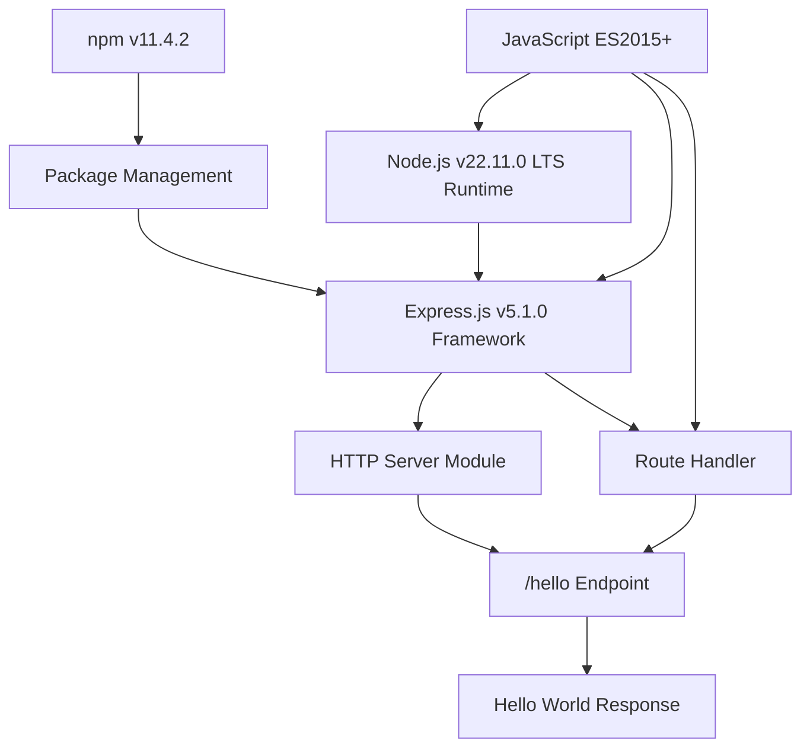

### 3.7.2 Security Implications

**Framework Security**
- Express.js v5 includes a comprehensive Threat Model that helps illustrate the philosophy of a "Fast, unopinionated, minimalist web framework for Node.js"
- Security improvements: A Threat Model has been added to improve security awareness and measures within the project. CodeQL (Static Application Security Testing) has also been integrated to catch vulnerabilities in the codebase

**Node.js Security**
- Modern Node.js version provides security and performance benefits. We strongly suggest that you update to modern Node.js versions as soon as possible
- Regular security updates through LTS maintenance cycle

### 3.7.3 Performance Characteristics

**Runtime Performance**
- Single-threaded event loop architecture
- Non-blocking I/O operations
- Node.js enables development of fast web servers in JavaScript using event-driven programming. Developers can create scalable servers without using threading by using a simplified model that uses callbacks to signal the completion of a task

**Framework Performance**
- Express 5 delivers key performance improvements and modernization for Node.js applications. The focus has been improving core stability, aligning with recent Node.js releases, and fixing bugs
- Minimal overhead for simple HTTP endpoints
- Optimized for tutorial and educational use cases

### 3.7.4 Maintenance and Support Timeline

**Node.js Support Schedule**
- **Active LTS**: Until 2025-10-21
- **Maintenance LTS**: Until 2027-04-30
- **End of Life**: April 30, 2027

**Express.js Maintenance**
- Express ecosystem that's a stable and reliable tool for companies, governments, educators, and hobby projects. It is our commitment as the new stewards of the Express project to move the ecosystem forward
- Active community maintenance and security updates
- Long-term viability for educational resources

# 4. PROCESS FLOWCHART

## 4.1 SYSTEM WORKFLOWS

### 4.1.1 Core Business Processes

#### Primary HTTP Request-Response Workflow

When Node receives an HTTP request, it creates the req and res objects (which begin their life as instances of http.IncomingMessage and http.ServerResponse respectively). The intended purpose of those objects is that they live as long as the HTTP request does. That is, the client makes an HTTP request, the req and res objects are created, a bunch of stuff happens, and finally a method on res is invoked that sends an HTTP response back to the client, and at that point the objects are no longer needed.

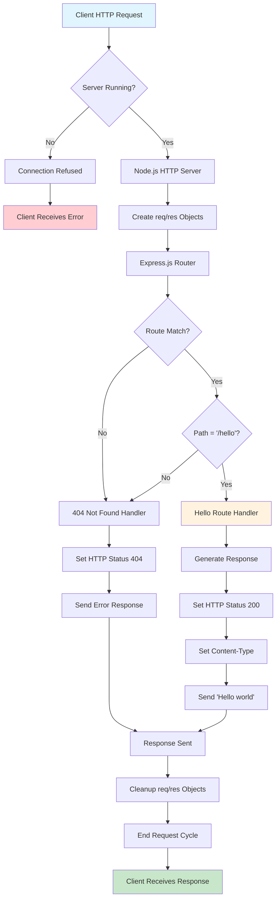

#### Server Initialization Workflow

When you run your node file using node app.js then the script starts executing. It will be parsed by the parser into machine language that simply means all the functions and variables get registered in a memory location.

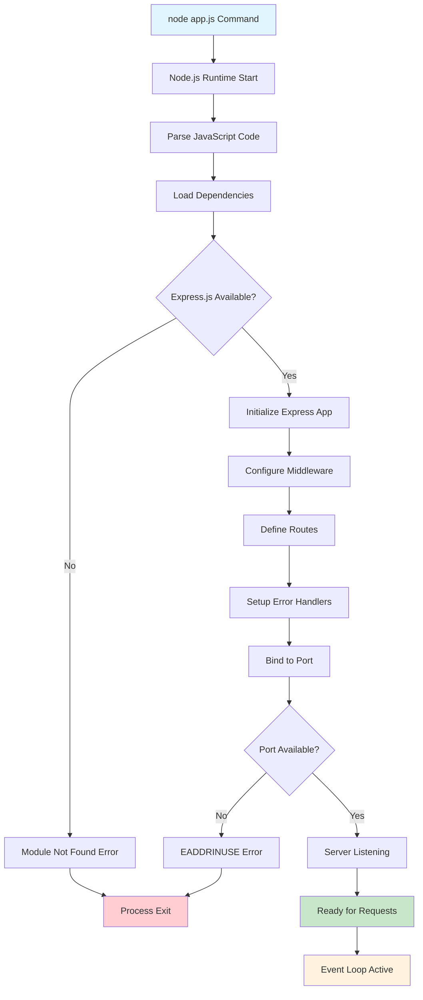

#### Error Handling Process Flow

Starting with Express 5, route handlers and middleware that return a Promise will call next(value) automatically when they reject or throw an error. If you pass anything to the next() function (except the string 'route'), Express regards the current request as being an error and will skip any remaining non-error handling routing and middleware functions.

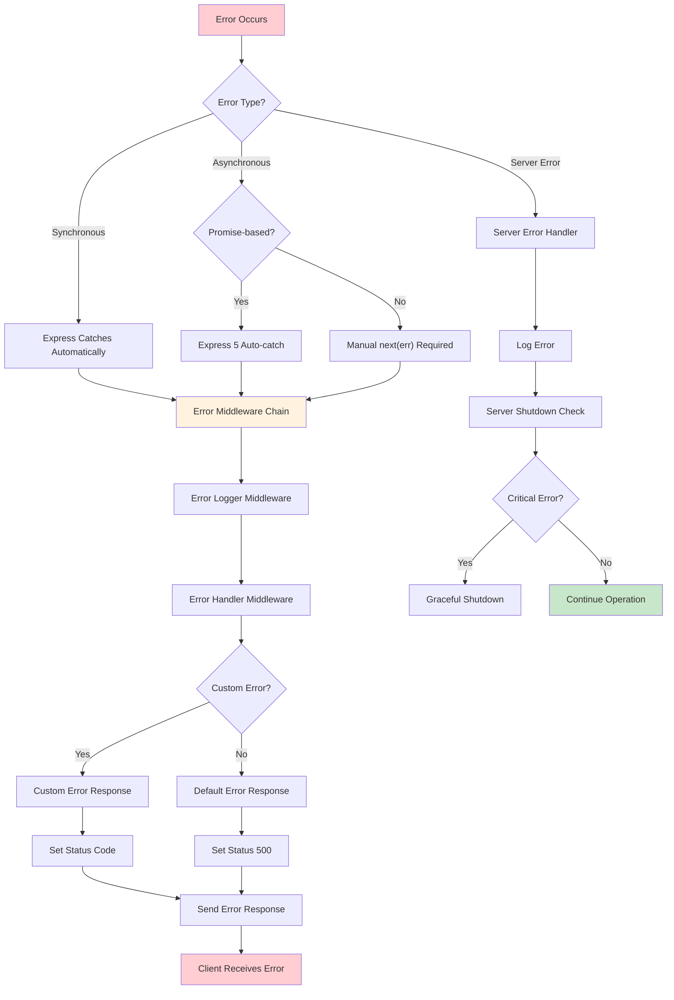

### 4.1.2 Integration Workflows

## Express.js Middleware Pipeline

Middleware is a function that can modify or intercept the request and response objects in the Express pipeline. You can use middleware for various purposes, such as logging, authentication, validation, compression, or caching. Middleware functions are executed in the order they are registered, and they can either pass the control to the next middleware function, or end the response.

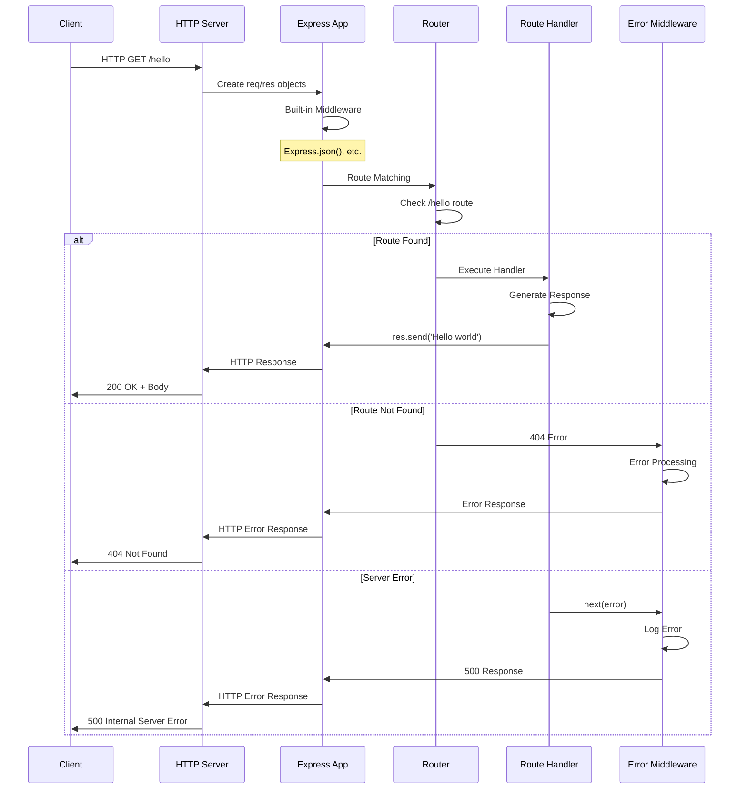

## Node.js Event Loop Integration

Lifecycle of Node.js program: In order to understand its lifecycle you must be familiar with the event loop. Event loops are something that makes your task very fast and also it perform multitasking. It allows Node.js to perform non-blocking I/O operations.

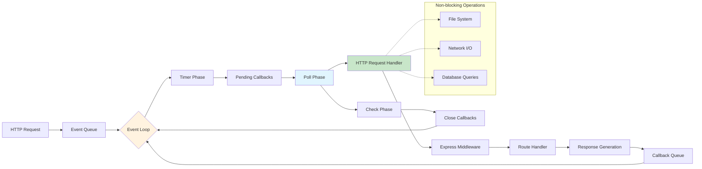

## 4.2 FLOWCHART REQUIREMENTS

### 4.2.1 Detailed Process Flows for Core Features

#### HTTP Server Feature Process Flow

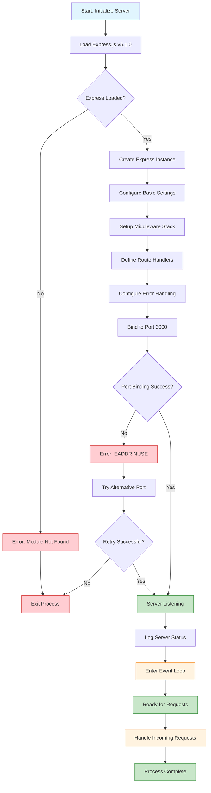

#### Hello Endpoint Feature Process Flow

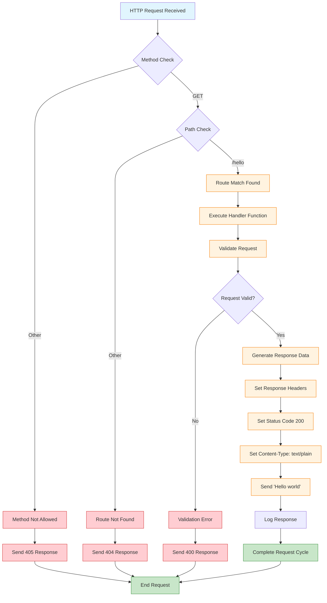

### 4.2.2 State Management and Transitions

#### Application State Transition Diagram

When we talk about "state management" in a Node.js application, we're referring to how we handle information about the current state of the application at any given time.

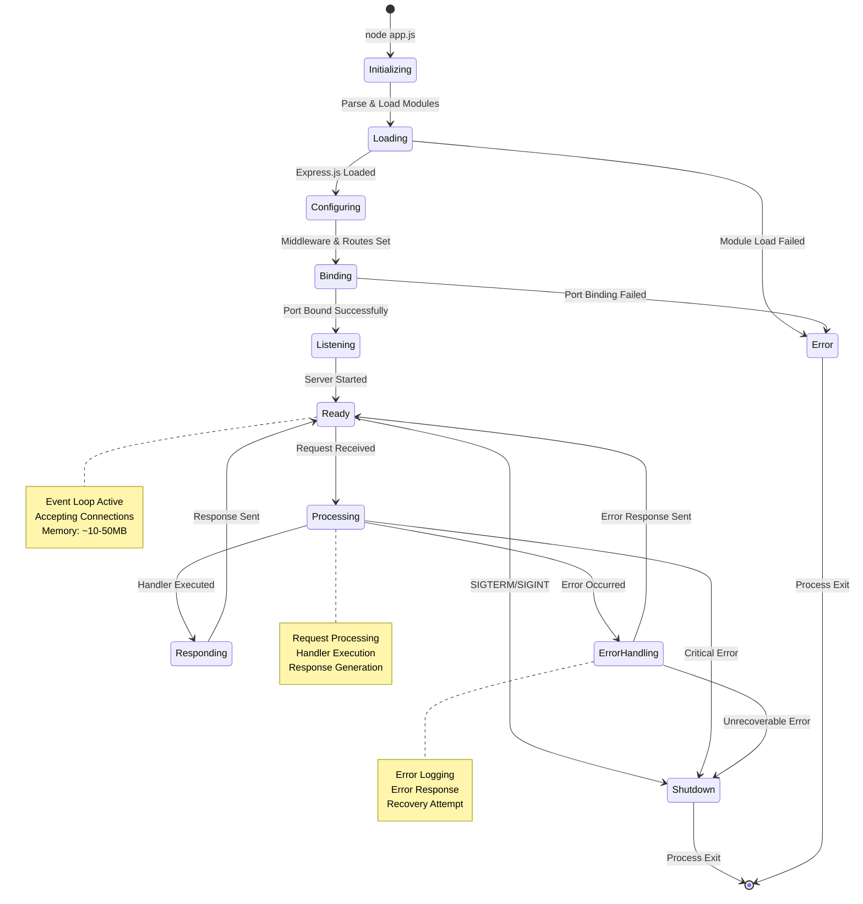

#### Request Lifecycle State Management

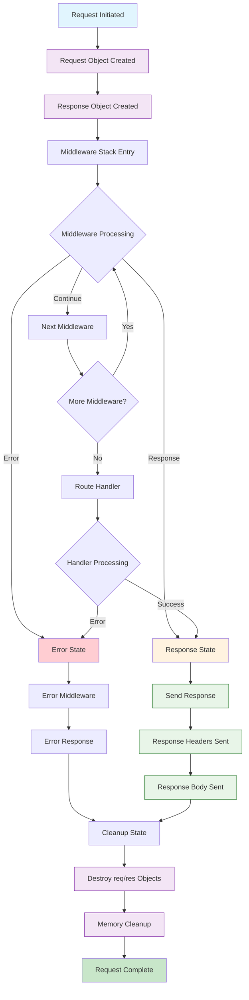

## 4.3 TECHNICAL IMPLEMENTATION

### 4.3.1 Error Handling and Recovery Procedures

#### Comprehensive Error Handling Flow

In Express.js the next function is the callback function which is mainly used to pass the control to the next middleware for performing certain tasks. If we use the next function along with the error parameter as (err) then it handles the error which occurs during the processing of the request and passes the control to the next middleware function. Pass Control to the Next Middleware: When the next(err) is called, the Express knows that an error has occurred, so it skips the control to the next middleware function which handles the error.

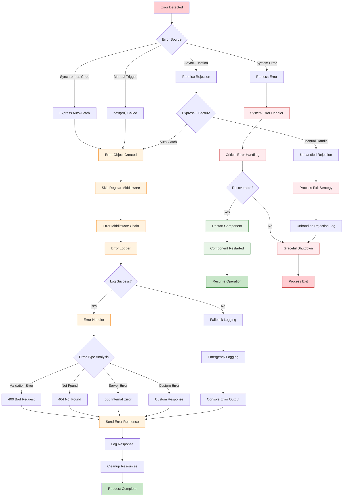

#### Retry and Fallback Mechanisms

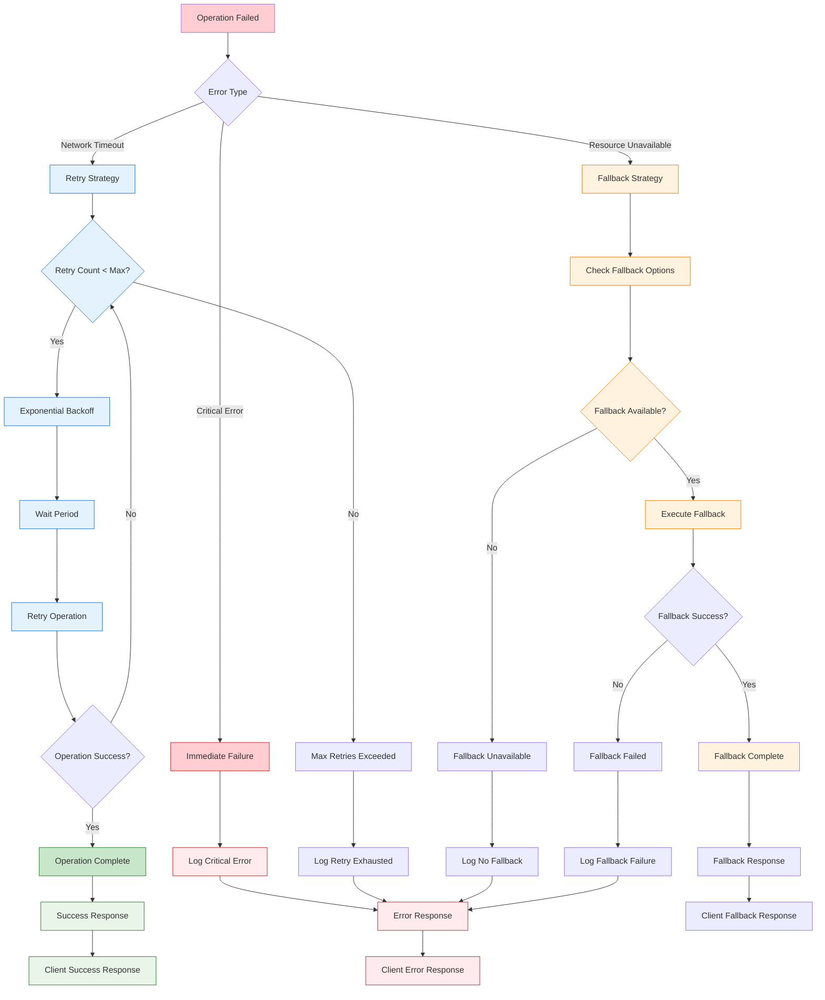

### 4.3.2 Performance and Timing Considerations

#### Request Processing Timeline

```mermaid
gantt
    title HTTP Request Processing Timeline
    dateFormat X
    axisFormat %Lms
    
    section Request Lifecycle
    Request Received     :milestone, req_start, 0, 0ms
    Parse Headers        :parse, 0, 5ms
    Route Matching       :route, after parse, 10ms
    Handler Execution    :handler, after route, 50ms
    Response Generation  :response, after handler, 20ms
    Send Response        :send, after response, 15ms
    Cleanup             :cleanup, after send, 10ms
    Request Complete    :milestone, req_end, after cleanup, 0ms
    
    section Performance Targets
    Total Response Time  :crit, target, 0, 100ms
    Handler SLA         :active, sla_handler, 15ms, 65ms
    Network Overhead    :done, network, 0, 15ms
    
    section Error Scenarios
    Timeout Threshold   :milestone, timeout, 100, 0ms
    Error Detection     :error_detect, 25ms, 75ms
    Error Response      :error_resp, after error_detect, 25ms
```

#### System Resource Management Flow

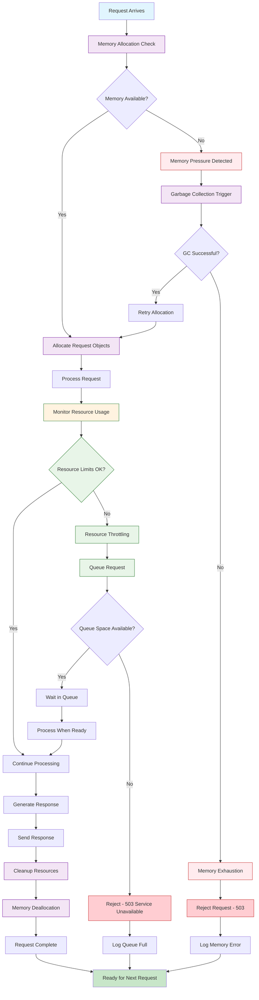

## 4.4 VALIDATION RULES AND COMPLIANCE

### 4.4.1 Business Rules Validation Flow

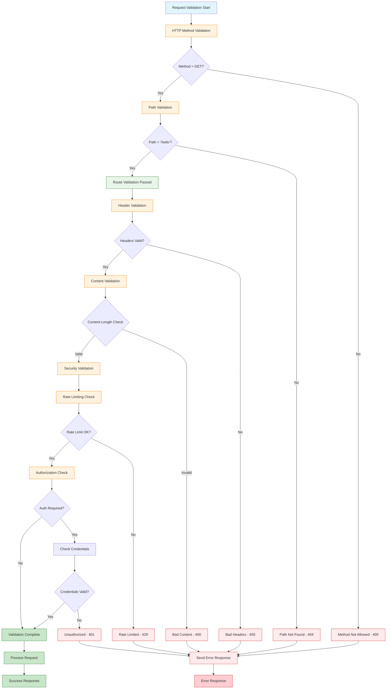

### 4.4.2 Data Validation and Security Checkpoints

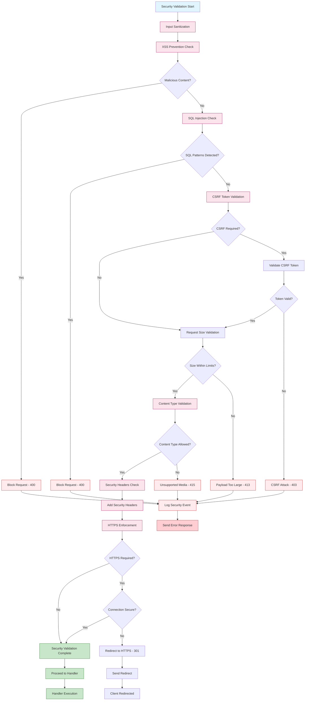

## 4.5 INTEGRATION SEQUENCE DIAGRAMS

### 4.5.1 Complete Request-Response Sequence

```mermaid
sequenceDiagram
    participant C as Client
    participant N as "Node.js Runtime"
    participant E as "Express App"
    participant M as "Middleware Stack"
    participant R as "Route Handler"
    participant EH as "Error Handler"
    participant L as Logger
    
    Note over C,L: Complete HTTP Request Lifecycle
    
    C->>+N: HTTP GET /hello
    N->>+E: Create req/res objects
    
    Note over E: Request object lifecycle begins
    
    E->>+M: Enter middleware pipeline
    M->>M: Built-in middleware processing
    M->>M: Custom middleware (if any)
    
    alt Middleware Success
        M->>+R: Route handler execution
        R->>R: Process /hello request
        R->>R: Generate "Hello world" response
        R->>-M: Response ready
        
        E->>L: Log successful request
        E->>-N: Send HTTP response
        N->>-C: 200 OK + "Hello world"
        
    else Middleware Error
        M->>+EH: Error in middleware
        EH->>L: Log error details
        EH->>EH: Generate error response
        EH->>-M: Error response ready
        
        E->>-N: Send error response
        N->>-C: 4xx/5xx Error Response
        
    else Route Handler Error
        M->>+R: Route handler execution
        R->>R: Error during processing
        R->>+EH: next(error) called
        EH->>L: Log error details
        EH->>EH: Generate error response
        EH->>-R: Error response ready
        R->>-M: Error handling complete
        
        E->>-N: Send error response
        N->>-C: 500 Internal Server Error
    end
    
    deactivate M
    deactivate E
    
    Note over N: Request object cleanup
    Note over C,L: Request lifecycle complete
```

### 4.5.2 Server Startup and Shutdown Sequence

```mermaid
sequenceDiagram
    participant OS as Operating System
    participant N as Node.js Process
    participant E as Express App
    participant S as HTTP Server
    participant EL as Event Loop
    participant L as Logger
    
    Note over OS,L: Server Initialization Sequence
    
    OS->>+N: Execute node app.js
    N->>N: Parse JavaScript code
    N->>N: Load dependencies
    
    N->>+E: Initialize Express app
    E->>E: Configure middleware
    E->>E: Define routes
    E->>E: Setup error handlers
    E->>-N: App configuration complete
    
    N->>+S: Create HTTP server
    S->>S: Bind to port 3000
    
    alt Port Binding Success
        S->>+EL: Start event loop
        EL->>EL: Enter listening state
        EL->>L: Log "Server listening on port 3000"
        EL->>S: Ready for connections
        S->>N: Server started successfully
        
        Note over EL: Server ready for requests
        
        loop Request Processing
            EL->>EL: Handle incoming requests
            EL->>E: Process HTTP requests
            E->>EL: Send responses
        end
        
        Note over OS,L: Shutdown Sequence
        
        OS->>N: SIGTERM/SIGINT signal
        N->>S: Initiate graceful shutdown
        S->>S: Stop accepting new connections
        S->>S: Wait for active requests
        S->>EL: Close event loop
        EL->>L: Log "Server shutting down"
        EL->>S: Event loop closed
        S->>-N: Server shutdown complete
        N->>OS: Process exit (0)
        
    else Port Binding Failed
        S->>L: Log "Port 3000 already in use"
        S->>-N: EADDRINUSE error
        N->>OS: Process exit (1)
    end
```

## 4.6 TIMING AND SLA CONSIDERATIONS

### 4.6.1 Performance Requirements Timeline

| Operation | Target Time | Maximum Time | Monitoring Point |
|-----------|-------------|--------------|------------------|
| Server Startup | < 200ms | 500ms | Application Ready |
| Route Resolution | < 5ms | 10ms | Router Processing |
| Handler Execution | < 50ms | 100ms | Response Generation |
| Response Transmission | < 20ms | 50ms | Network Send |
| Total Request Time | < 100ms | 200ms | End-to-End |
| Error Handling | < 25ms | 75ms | Error Response |
| Memory Cleanup | < 10ms | 25ms | Request Completion |

### 4.6.2 Scalability and Load Considerations

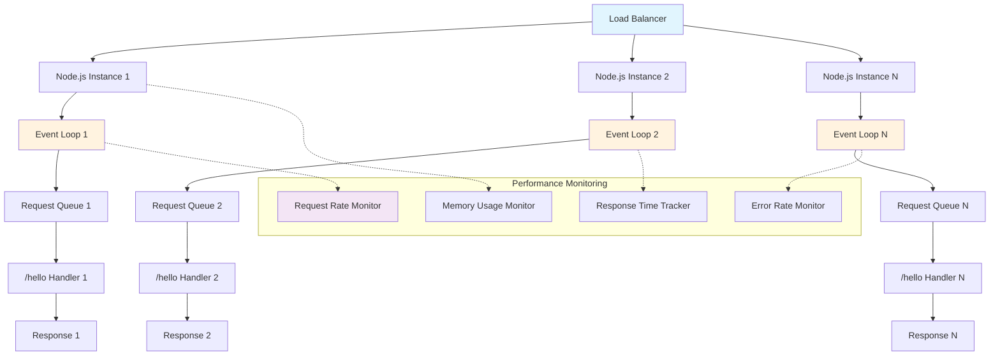

### 4.6.3 Resource Management and Optimization

| Resource Type | Baseline Usage | Peak Usage | Optimization Strategy |
|---------------|----------------|------------|----------------------|
| Memory | 10-15 MB | 50 MB | Garbage collection tuning |
| CPU | 5-10% | 80% | Event loop optimization |
| Network Connections | 1-10 | 1000 | Connection pooling |
| File Descriptors | 10-20 | 1024 | Resource cleanup |
| Event Loop Lag | < 1ms | 10ms | Non-blocking operations |

This comprehensive process flowchart section provides detailed workflows, state management, error handling procedures, and performance considerations for the Node.js tutorial application, ensuring robust operation and maintainability while serving as an educational resource for understanding modern web server architecture patterns.

# 5. SYSTEM ARCHITECTURE

## 5.1 HIGH-LEVEL ARCHITECTURE

### 5.1.1 System Overview

The Node.js tutorial application follows a **minimalist single-tier architecture** designed specifically for educational purposes. Design patterns help developers write high-quality, testable, and maintainable code. Some of the design patterns are built into Node.js, and some can be applied to other programming languages. The system employs an **event-driven, non-blocking I/O architecture** that leverages Node.js's single-threaded event loop model to handle HTTP requests efficiently.

**Architectural Style and Rationale**

Node JS Platform uses "Single Threaded Event Loop" architecture to handle multiple concurrent clients. This tutorial application embraces this fundamental Node.js architectural pattern, implementing a straightforward HTTP server that demonstrates core concepts without unnecessary complexity. The architecture prioritizes educational clarity over enterprise-scale features, making it ideal for developers learning server-side JavaScript fundamentals.

**Key Architectural Principles**

- **Simplicity First**: Version 5.0 is "designed to be boring" according to the latest post from the TC, with the goal being as much to "unblock the ecosystem" as to introduce new features.
- **Event-Driven Processing**: The event-driven pattern utilizes the event-driven architecture of Node.js to handle events. For handling events, it uses the EventEmitter class. An event emitter enables developers to raise an event from any part of the application that can be listened to by a listener and an action can be performed.
- **Non-Blocking Operations**: The event loop is what allows Node.js to perform non-blocking I/O operations — despite the fact that a single JavaScript thread is used by default — by offloading operations to the system kernel whenever possible.
- **Minimal Dependencies**: Leveraging only Express.js v5.1.0 as the primary framework dependency

**System Boundaries and Major Interfaces**

The system operates within clearly defined boundaries:
- **Input Interface**: HTTP requests via standard TCP/IP protocols on port 3000
- **Processing Boundary**: Single Node.js process with Express.js framework
- **Output Interface**: HTTP responses conforming to standard HTTP/1.1 specifications
- **External Dependencies**: Minimal - only npm registry for Express.js package management

### 5.1.2 Core Components Table

| Component Name | Primary Responsibility | Key Dependencies | Integration Points |
|----------------|----------------------|------------------|-------------------|
| Node.js Runtime | JavaScript execution environment and event loop management | V8 JavaScript Engine, libuv library | Operating system, network stack |
| Express.js Framework | HTTP server creation, routing, and middleware processing | Node.js HTTP module, path-to-regexp library | Node.js runtime, HTTP protocol |
| Route Handler | Business logic execution for /hello endpoint | Express.js router | HTTP request/response cycle |
| HTTP Server | Network communication and protocol handling | Node.js net module, TCP stack | Client connections, network interface |

### 5.1.3 Data Flow Description

**Primary Data Flow Pattern**

The application implements a straightforward request-response data flow pattern. Client sends request to the server, then server do some processing based on clients request, prepare response and send it back to the client. This model uses HTTP protocol.

**Request Processing Flow**

1. **HTTP Request Ingestion**: Client HTTP requests arrive at the Node.js HTTP server through the network interface
2. **Event Loop Processing**: When Node.js starts, it initializes the event loop, processes the provided input script (or drops into the REPL, which is not covered in this document) which may make async API calls, schedule timers, or call process.nextTick(), then begins processing the event loop. The following diagram shows a simplified overview of the event loop's order of operations.
3. **Express.js Routing**: Incoming requests are matched against defined routes using Express.js routing engine
4. **Handler Execution**: The /hello route handler executes synchronously, generating the "Hello world" response
5. **Response Generation**: HTTP response headers and body are constructed according to HTTP specifications
6. **Client Response**: Completed response is transmitted back to the client through the network stack

**Integration Patterns and Protocols**

- **HTTP/1.1 Protocol**: Standard web communication protocol for request/response cycles
- **Event-Driven Messaging**: Internal component communication through Node.js EventEmitter patterns
- **Callback-Based Integration**: Node JS Processing model mainly based on Javascript Event based model with Javascript callback mechanism. You should have some good knowledge about how Javascript events and callback mechanism works.

**Data Transformation Points**

- **HTTP Parsing**: Raw TCP data transformed into HTTP request objects by Node.js HTTP parser
- **Route Matching**: URL paths transformed into executable route handlers by Express.js router
- **Response Serialization**: JavaScript objects transformed into HTTP response format

### 5.1.4 External Integration Points

| System Name | Integration Type | Data Exchange Pattern | Protocol/Format |
|-------------|------------------|----------------------|-----------------|
| npm Registry | Package Management | Pull-based dependency resolution | HTTPS/JSON |
| Operating System | System Calls | Event-driven I/O operations | System APIs |
| Network Stack | Protocol Handling | Bidirectional HTTP communication | TCP/HTTP |
| Client Applications | Service Interface | Request-response messaging | HTTP/1.1 |

## 5.2 COMPONENT DETAILS

### 5.2.1 Node.js Runtime Component

**Purpose and Responsibilities**

The Node.js runtime serves as the foundational execution environment, providing the JavaScript engine and event loop infrastructure. The core of Node.js's single-threaded architecture is the event loop. The event loop continuously cycles through a series of phases, executing callbacks and handling events.

**Technologies and Frameworks**

- **Node.js v22.11.0 LTS**: The achievements of the past year—culminating in the official release of Express 5.0 and wide-reaching governance enhancements—serve as a sturdy foundation for what's to come.
- **V8 JavaScript Engine**: High-performance JavaScript and WebAssembly engine
- **libuv Library**: Cross-platform asynchronous I/O library for event loop implementation

**Key Interfaces and APIs**

- **HTTP Module**: Core Node.js module for HTTP server functionality
- **EventEmitter Interface**: Event-driven programming model for component communication
- **Process APIs**: Application lifecycle management and environment access

**Scaling Considerations**

The secret to the scalability of Node.js is that it uses a small number of threads to handle many clients. If Node.js can make do with fewer threads, then it can spend more of your system's time and memory working on clients rather than on paying space and time overheads for threads (memory, context-switching).

### 5.2.2 Express.js Framework Component

**Purpose and Responsibilities**

Express.js provides the web application framework layer, handling HTTP server creation, routing, middleware processing, and request/response management. Naturally, 2024 will forever be remembered as the year when Express.js finally introduced its much-anticipated Express 5.0. After more than a decade of community discussions and behind-the-scenes experimentation, this release brought modern features and a future-oriented architecture to the framework, acting as a catalyst for the next chapter of Express.js development.

**Technologies and Frameworks**

- **Express.js v5.1.0**: Another key change is that if a promise (an asynchronous function) is rejected, it forwards an error to the Express middleware and does not cause the application to crash. Third, the built-in app.router object, which was removed for Express.js 4, has returned for version 5.
- **path-to-regexp v8.x**: Express 5 brings significant updates to route matching by upgrading the path-to-regexp library from version 0.x to 8.x. These changes improve security, simplify route definitions, and help mitigate vulnerabilities like ReDoS attacks.

**Key Interfaces and APIs**

- **Application Interface**: Core Express app instance for configuration and middleware
- **Router Interface**: Route definition and HTTP method handling
- **Middleware Stack**: Request processing pipeline with built-in and custom middleware

**Data Persistence Requirements**

No persistent data storage required - the application maintains stateless operation with in-memory request processing only.

**Scaling Considerations**

Express.js provides a flexible and modular architecture, allowing developers to add or remove features as needed. Its modular and flexible architecture allows developers to add or remove features as needed.

### 5.2.3 Route Handler Component

**Purpose and Responsibilities**

The route handler component implements the core business logic for the /hello endpoint, processing HTTP GET requests and generating appropriate responses.

**Technologies and Frameworks**

- **JavaScript ES2015+**: Modern JavaScript features supported by Node.js v22
- **Express.js Routing**: Route definition and handler execution framework

**Key Interfaces and APIs**

- **Request Object**: HTTP request data and metadata access
- **Response Object**: HTTP response generation and transmission
- **Next Function**: Middleware chain continuation and error handling

**Data Persistence Requirements**

No data persistence required - generates static "Hello world" response content.

**Scaling Considerations**

Stateless design enables horizontal scaling through load balancing and multiple instance deployment.

### 5.2.4 Component Interaction Diagrams

## Express.js Middleware Pipeline

```mermaid
sequenceDiagram
    participant C as Client
    participant S as HTTP Server
    participant E as Express App
    participant M as Middleware Stack
    participant R as Route Handler
    participant EH as Error Handler
    
    C->>+S: HTTP GET /hello
    S->>+E: Create req/res objects
    E->>+M: Enter middleware pipeline
    
    Note over M: Built-in middleware processing
    
    M->>+R: Execute route handler
    R->>R: Generate "Hello world"
    R->>-M: Response ready
    
    M->>-E: Middleware complete
    E->>-S: Send HTTP response
    S->>-C: 200 OK + "Hello world"
    
    Note over EH: Error handling available
    Note over E,R: Express 5 auto-catch promises
```

## Node.js Event Loop Integration

```mermaid
stateDiagram-v2
    [*] --> Initialization: Node.js Start
    
    Initialization --> EventLoop: Runtime Ready
    EventLoop --> TimerPhase: Event Loop Cycle
    TimerPhase --> PendingCallbacks: Timer Callbacks
    PendingCallbacks --> PollPhase: I/O Callbacks
    PollPhase --> CheckPhase: New I/O Events
    CheckPhase --> CloseCallbacks: setImmediate
    CloseCallbacks --> EventLoop: Close Events
    
    PollPhase --> HTTPRequest: Incoming Request
    HTTPRequest --> ExpressRouting: Route Matching
    ExpressRouting --> HandlerExecution: /hello Handler
    HandlerExecution --> ResponseGeneration: Create Response
    ResponseGeneration --> PollPhase: Response Sent
    
    EventLoop --> [*]: Process Exit
    
    note right of EventLoop
        Single-threaded
        Non-blocking I/O
        Event-driven
    end note
```

#### Request Processing State Transitions

```mermaid
stateDiagram-v2
    [*] --> RequestReceived: HTTP Request
    
    RequestReceived --> Parsing: Parse Headers
    Parsing --> Routing: Express Router
    Routing --> HandlerMatch: Route Found
    Routing --> NotFound: No Route Match
    
    HandlerMatch --> Processing: Execute Handler
    Processing --> ResponseReady: Generate Response
    ResponseReady --> Sending: Send to Client
    Sending --> Complete: Request Complete
    
    NotFound --> ErrorResponse: 404 Response
    Processing --> ErrorHandling: Handler Error
    ErrorHandling --> ErrorResponse: Error Response
    
    ErrorResponse --> Complete: Error Sent
    Complete --> [*]: Cleanup
    
    note right of Processing
        Synchronous execution
        "Hello world" generation
        No I/O operations
    end note
```

## 5.3 TECHNICAL DECISIONS

### 5.3.1 Architecture Style Decisions

**Single-Tier Architecture Selection**

| Decision Factor | Rationale | Trade-offs |
|----------------|-----------|------------|
| Educational Focus | Minimizes complexity for learning purposes | Limited scalability for production use |
| Development Speed | Rapid prototyping and demonstration | Reduced separation of concerns |
| Resource Efficiency | Single process deployment | Potential single point of failure |

**Event-Driven Architecture Adoption**

Node.js's single-threaded architecture, driven by the event loop and non-blocking I/O, is a deliberate design choice that balances simplicity, performance, and scalability. The decision to embrace Node.js's native event-driven model provides several advantages:

- **Performance Benefits**: However, quite the opposite it turns out to be more performant and scalable than other multithreaded alternatives such as Java.
- **Simplified Concurrency**: The event loop allows Node.js to handle multiple tasks concurrently without creating a separate thread for each task. This concurrency model is efficient for I/O-bound operations, but it's important to note that CPU-bound operations can still block the event loop and should be offloaded to worker threads or other processes to maintain the responsiveness of the application.

### 5.3.2 Communication Pattern Choices

**HTTP Protocol Selection**

| Pattern | Justification | Implementation |
|---------|---------------|----------------|
| Request-Response | Standard web communication model | HTTP/1.1 compliance |
| Stateless Design | Simplified scaling and maintenance | No session management |
| Synchronous Processing | Educational clarity and simplicity | Direct response generation |

**Express.js v5 Framework Decision**

Express 5 introduces a significant improvement for developers using async/await by automatically forwarding rejected promises to error-handling middleware. Before discussing the future of Express, let's explore the key improvements in Express 5 and how they can benefit your projects.

Key decision factors:
- **Modern Error Handling**: Express 5 introduces a significant improvement for developers using async/await by automatically forwarding rejected promises to error-handling middleware. With Express 5, you don't need to handle errors within the route handler explicitly.
- **Security Improvements**: These changes improve security, simplify route definitions, and help mitigate vulnerabilities like ReDoS attacks. One major change is the removal of "sub-expression" regular expressions.
- **Node.js Compatibility**: Express.js 5.0 requires Node.js 18 or higher, so anyone still on older versions will need to upgrade. Express.js 5 officially adopts Node.js 18 as the minimum supported version.

### 5.3.3 Data Storage Solution Rationale

**No Database Decision**

| Consideration | Rationale | Impact |
|---------------|-----------|--------|
| Tutorial Scope | Focus on HTTP server fundamentals | Simplified architecture |
| Stateless Operation | No persistent data requirements | Enhanced scalability |
| Educational Clarity | Reduced complexity for learners | Clear separation of concerns |

### 5.3.4 Security Mechanism Selection

**Built-in Security Approach**

Above all, 2024 will stand out for Express.js's vigorous approach to security. In partnership with the OpenJS Foundation and OSTIF, the project undertook a comprehensive security audit that yielded critical insights and propelled immediate improvements. The sense of proactive vigilance extended to the adoption of the OSSF Scorecard, implemented at an organizational level to keep track of security metrics and maintain focus on ongoing enhancements.

Security decisions include:
- **Framework-Level Security**: Leveraging Express.js v5 built-in security improvements
- **Input Validation**: Minimal validation for static endpoint
- **Error Handling**: Express 5 enforces valid HTTP status codes, preventing silent failures and ensuring adherence to HTTP standards.

### 5.3.5 Architecture Decision Records

#### ADR-001: Express.js v5 Adoption

```mermaid
flowchart TD
    A[Framework Selection] --> B{Requirements Analysis}
    B --> C[Express.js v4]
    B --> D[Express.js v5]
    B --> E[Alternative Frameworks]
    
    C --> F[Mature Ecosystem]
    D --> G[Modern Features]
    E --> H[Learning Curve]
    
    F --> I{Decision Criteria}
    G --> I
    H --> I
    
    I --> J[Educational Value]
    I --> K[Security Features]
    I --> L[Future Compatibility]
    
    J --> M[Express.js v5 Selected]
    K --> M
    L --> M
    
    M --> N[Implementation Decision]
    
    style M fill:#c8e6c9
    style N fill:#c8e6c9
```

#### ADR-002: Single Endpoint Architecture

```mermaid
flowchart TD
    A[Scope Definition] --> B{Complexity Level}
    B --> C[Single Endpoint]
    B --> D[Multiple Endpoints]
    B --> E[Full REST API]
    
    C --> F[Tutorial Focus]
    D --> G[Moderate Complexity]
    E --> H[Production Ready]
    
    F --> I{Educational Goals}
    G --> I
    H --> I
    
    I --> J[Concept Clarity]
    I --> K[Implementation Speed]
    I --> L[Maintenance Simplicity]
    
    J --> M[Single Endpoint Selected]
    K --> M
    L --> M
    
    M --> N["/hello Endpoint"]
    
    style M fill:#c8e6c9
    style N fill:#c8e6c9
```

## 5.4 CROSS-CUTTING CONCERNS

### 5.4.1 Monitoring and Observability Approach

**Application Monitoring Strategy**

The tutorial application implements basic monitoring through Node.js built-in capabilities and Express.js logging mechanisms. TL;DR: When a middleware holds some immense logic that spans many requests, it is worth testing it in isolation without waking up the entire web framework. This can be easily achieved by stubbing and spying on the {req, res, next} objects

**Key Monitoring Components**

| Component | Purpose | Implementation | Metrics |
|-----------|---------|----------------|---------|
| Console Logging | Basic request tracking | Built-in console methods | Request count, response time |
| Process Monitoring | Runtime health | Node.js process object | Memory usage, uptime |
| HTTP Metrics | Protocol compliance | Express.js middleware | Status codes, response sizes |

### 5.4.2 Logging and Tracing Strategy

**Logging Architecture**

The application employs a simple logging strategy focused on educational visibility and debugging support:

- **Request Logging**: HTTP request details including method, path, and timestamp
- **Response Logging**: HTTP response status codes and processing time
- **Error Logging**: Exception details and stack traces for debugging
- **Server Lifecycle**: Startup, shutdown, and configuration events

**Tracing Implementation**

Basic request tracing through Express.js middleware stack, providing visibility into:
- Request ingestion and parsing
- Route matching and handler execution
- Response generation and transmission
- Error handling and recovery

### 5.4.3 Error Handling Patterns

**Comprehensive Error Handling Strategy**

Express 5 introduces a significant improvement for developers using async/await by automatically forwarding rejected promises to error-handling middleware. If fetchData throws an error or rejects, Express will automatically pass the error to the error-handling middleware.

**Error Classification and Handling**

| Error Type | Handling Strategy | Response Pattern | Recovery Action |
|------------|------------------|------------------|-----------------|
| HTTP Errors | Express.js middleware | Standard HTTP status codes | Graceful degradation |
| System Errors | Process-level handlers | 500 Internal Server Error | Logging and monitoring |
| Validation Errors | Input validation | 400 Bad Request | Client notification |
| Runtime Errors | Try-catch blocks | Error-specific responses | State cleanup |

### 5.4.4 Error Handling Flow Diagram

```mermaid
flowchart TD
    A[Error Detected] --> B{Error Source}
    
    B -->|HTTP Request| C[Request Validation Error]
    B -->|Route Handler| D[Handler Execution Error]
    B -->|System Level| E[Runtime Error]
    B -->|Express Framework| F[Framework Error]
    
    C --> G[400 Bad Request]
    D --> H{Express 5 Auto-Catch}
    E --> I[500 Internal Error]
    F --> J[Framework Error Handler]
    
    H -->|Promise Rejection| K[Error Middleware]
    H -->|Synchronous Error| L[Try-Catch Handler]
    
    G --> M[Log Error Details]
    I --> M
    J --> M
    K --> M
    L --> M
    
    M --> N[Generate Error Response]
    N --> O[Send to Client]
    O --> P[Cleanup Resources]
    
    P --> Q{Recoverable?}
    Q -->|Yes| R[Continue Operation]
    Q -->|No| S[Graceful Shutdown]
    
    R --> T[Ready for Next Request]
    S --> U[Process Exit]
    
    style K fill:#fff3e0
    style M fill:#ffcdd2
    style T fill:#c8e6c9
    style U fill:#ffcdd2
```

### 5.4.5 Performance Requirements and SLAs

**Performance Targets**

| Metric | Target | Maximum | Monitoring Method |
|--------|--------|---------|------------------|
| Response Time | < 50ms | 100ms | Request timing middleware |
| Memory Usage | < 25MB | 50MB | Process memory monitoring |
| CPU Utilization | < 10% | 25% | System resource tracking |
| Concurrent Requests | 100+ | 1000+ | Load testing validation |

**Service Level Agreements**

- **Availability**: 99.9% uptime during operation (educational environment)
- **Response Time**: 95th percentile under 100ms for /hello endpoint
- **Error Rate**: Less than 0.1% for valid requests
- **Recovery Time**: Under 5 seconds for automatic error recovery

### 5.4.6 Disaster Recovery Procedures

**Recovery Strategy**

Given the tutorial application's educational scope and stateless design, disaster recovery focuses on rapid restoration rather than complex failover mechanisms:

**Recovery Procedures**

| Scenario | Detection Method | Recovery Action | Recovery Time |
|----------|------------------|-----------------|---------------|
| Process Crash | Process monitoring | Automatic restart | < 10 seconds |
| Port Conflict | Startup error | Alternative port binding | < 30 seconds |
| Memory Exhaustion | Resource monitoring | Process restart | < 15 seconds |
| Unhandled Exception | Error logging | Graceful shutdown/restart | < 20 seconds |

**Backup and Restoration**

- **Code Repository**: Version control through Git for source code recovery
- **Configuration**: Environment-based configuration for rapid deployment
- **Dependencies**: npm package.json for dependency restoration
- **Documentation**: Comprehensive setup instructions for manual recovery

**Business Continuity**

The stateless nature of the tutorial application ensures that recovery involves only:
1. Process restart or redeployment
2. Network connectivity verification
3. Dependency availability confirmation
4. Basic functionality validation

This simplified recovery model aligns with the educational purpose while demonstrating fundamental disaster recovery concepts for Node.js applications.

# 6. SYSTEM COMPONENTS DESIGN

## 6.1 COMPONENT ARCHITECTURE

### 6.1.1 Core Component Overview

The Node.js tutorial application follows a **layered component architecture** that demonstrates fundamental web server patterns through a minimal yet comprehensive implementation. Node.js® is a free, open-source, cross-platform JavaScript runtime environment that lets developers create servers, web apps, command line tools and scripts. The system architecture leverages Node.js v22 officially transitioned into Long Term Support (LTS) with the codename 'Jod'. For developers and organizations relying on the stability of Node.js for production environments, this transition marks a key milestone for Node.js 22.x, ensuring it will receive critical updates and security support for years to come.

**Component Hierarchy and Relationships**

The application implements a **three-tier component structure** optimized for educational clarity:

| Layer | Component | Primary Responsibility | Technology Stack |
|-------|-----------|----------------------|------------------|
| **Runtime Layer** | Node.js Runtime Engine | JavaScript execution and event loop management | Node.js v22.11.0 LTS |
| **Framework Layer** | Express.js Application | HTTP server creation and request routing | Express.js v5.1.0 |
| **Application Layer** | Route Handler Component | Business logic and response generation | JavaScript ES2015+ |

### 6.1.2 Component Integration Patterns

**Event-Driven Component Communication**

Node.js enables development of fast web servers in JavaScript using event-driven programming. Developers can create scalable servers without using threading by using a simplified model that uses callbacks to signal the completion of a task. The component architecture leverages Node.js's inherent event-driven model to ensure efficient inter-component communication.

```mermaid
graph TD
    A[HTTP Request] --> B[Node.js Runtime]
    B --> C[Express.js Framework]
    C --> D[Middleware Stack]
    D --> E[Route Handler]
    E --> F[Response Generator]
    F --> G[HTTP Response]
    
    subgraph "Component Layers"
        H[Runtime Layer]
        I[Framework Layer]
        J[Application Layer]
    end
    
    B -.-> H
    C -.-> I
    E -.-> J
    
    style A fill:#e1f5fe
    style G fill:#c8e6c9
    style H fill:#f3e5f5
    style I fill:#fff3e0
    style J fill:#e8f5e8
```

**Component Lifecycle Management**

Each component follows a well-defined lifecycle that ensures proper initialization, execution, and cleanup:

1. **Initialization Phase**: Components are instantiated in dependency order
2. **Configuration Phase**: Component-specific settings and middleware are applied
3. **Runtime Phase**: Active request processing and event handling
4. **Cleanup Phase**: Resource deallocation and graceful shutdown

### 6.1.3 Component Dependency Matrix

| Component | Dependencies | Provides | Integration Points |
|-----------|-------------|----------|-------------------|
| **Node.js Runtime** | Operating System, V8 Engine | JavaScript execution environment | HTTP module, EventEmitter |
| **Express.js Framework** | Node.js Runtime, HTTP module | Web server framework | Router, Middleware stack |
| **Route Handler** | Express.js Framework | Business logic execution | Request/Response objects |
| **Error Handler** | Express.js Framework | Error processing | Error middleware chain |

## 6.2 EXPRESS.JS FRAMEWORK COMPONENT

### 6.2.1 Framework Architecture and Features

Express.js, or simply Express, is a back end web application framework for building RESTful APIs with Node.js, released as free and open-source software under the MIT License. It has been called the de facto standard server framework for Node.js. The tutorial application leverages Express.js version 5.1.0, last published: 3 months ago, which represents the latest stable release with significant improvements over previous versions.

**Express.js v5 Key Enhancements**

This release is designed to be boring! That may sound odd, but we've intentionally kept it simple to unblock the ecosystem and enable more impactful changes in future releases. This is also about signaling to the Node.js ecosystem that Express is moving again.

| Feature Category | Enhancement | Educational Value |
|------------------|-------------|-------------------|
| **Node.js Compatibility** | This release drops support for Node.js versions before v18. This is an important change because supporting old Node.js versions has been holding back many critical performance and maintainability changes. | Demonstrates modern Node.js development practices |
| **Error Handling** | Express 5 introduces a significant improvement for developers using async/await by automatically forwarding rejected promises to error-handling middleware. With Express 5, you don't need to handle errors within the route handler explicitly. | Simplified error management patterns |
| **Security Improvements** | This release includes important security fixes, including improvements to prevent ReDoS attacks and mitigation for CVE-2024-45590. | Security-first development approach |

### 6.2.2 Framework Component Structure

**Core Express.js Components**

```mermaid
classDiagram
    class ExpressApplication {
        +app: Express
        +router: Router
        +middleware: MiddlewareStack
        +listen(port: number)
        +get(path: string, handler: Function)
        +use(middleware: Function)
    }
    
    class Router {
        +routes: Route[]
        +match(path: string): Route
        +handle(req: Request, res: Response)
    }
    
    class MiddlewareStack {
        +middlewares: Function[]
        +execute(req: Request, res: Response, next: Function)
    }
    
    class RouteHandler {
        +path: string
        +method: string
        +handler: Function
        +execute(req: Request, res: Response)
    }
    
    ExpressApplication --> Router
    ExpressApplication --> MiddlewareStack
    Router --> RouteHandler
    
    note for ExpressApplication "Express v5.1.0 Framework"
    note for Router "Path-to-regexp v8.x routing"
    note for MiddlewareStack "Promise-aware middleware"
```

**Framework Configuration and Initialization**

The Express.js framework component handles several critical initialization tasks:

| Initialization Step | Purpose | Implementation Details |
|---------------------|---------|----------------------|
| **Application Instance** | Create Express app object | `const app = express()` |
| **Middleware Registration** | Configure request processing pipeline | Built-in and custom middleware |
| **Route Definition** | Map URL paths to handler functions | `/hello` endpoint configuration |
| **Error Handling Setup** | Configure error processing middleware | If fetchData throws an error or rejects, Express will automatically pass the error to the error-handling middleware. This eliminates the need to call next with the error manually. |

### 6.2.3 Routing and Middleware Architecture

**Enhanced Routing Capabilities**

Express 5 brings significant updates to route matching by upgrading the path-to-regexp library from version 0.x to 8.x. These changes improve security, simplify route definitions, and help mitigate vulnerabilities like ReDoS attacks.

**Route Processing Pipeline**

```mermaid
sequenceDiagram
    participant C as Client
    participant E as Express App
    participant M as Middleware
    participant R as Router
    participant H as Handler
    participant ER as Error Handler
    
    C->>+E: HTTP GET /hello
    E->>+M: Enter middleware pipeline
    
    Note over M: Built-in middleware processing
    
    M->>+R: Route matching
    R->>R: Match /hello pattern
    
    alt Route Found
        R->>+H: Execute route handler
        H->>H: Generate "Hello world"
        H->>-R: Response ready
        R->>-M: Handler complete
        M->>-E: Middleware complete
        E->>-C: 200 OK + "Hello world"
    else Route Not Found
        R->>+ER: 404 Error
        ER->>ER: Generate error response
        ER->>-R: Error handled
        R->>M: Error processing complete
        M->>E: Error middleware complete
        E->>C: 404 Not Found
    end
```

**Middleware Stack Configuration**

The Express.js framework component implements a streamlined middleware stack optimized for the tutorial's educational objectives:

| Middleware Type | Purpose | Express v5 Enhancement |
|----------------|---------|----------------------|
| **Built-in Middleware** | Core request processing | Improved performance and security |
| **Route Middleware** | Path-specific processing | Enhanced route matching with path-to-regexp v8.x |
| **Error Middleware** | Error handling and recovery | Promise support: Middleware can now return rejected promises, caught by the router as errors. |

## 6.3 ROUTE HANDLER COMPONENT

### 6.3.1 Handler Architecture and Design

The Route Handler component implements the core business logic for the `/hello` endpoint, demonstrating fundamental HTTP request-response patterns in a Node.js environment. This component serves as the primary educational example of how server-side JavaScript processes HTTP requests and generates appropriate responses.

**Handler Component Structure**

```mermaid
classDiagram
    class RouteHandler {
        +path: string = "/hello"
        +method: string = "GET"
        +handler: Function
        +execute(req: Request, res: Response): void
        +validateRequest(req: Request): boolean
        +generateResponse(): string
        +handleError(error: Error, res: Response): void
    }
    
    class Request {
        +method: string
        +url: string
        +headers: object
        +params: object
        +query: object
    }
    
    class Response {
        +status(code: number): Response
        +send(data: string): void
        +json(data: object): void
        +setHeader(name: string, value: string): void
    }
    
    RouteHandler --> Request : processes
    RouteHandler --> Response : generates
    
    note for RouteHandler "Handles /hello endpoint"
    note for Request "HTTP request object"
    note for Response "HTTP response object"
```

### 6.3.2 Request Processing Logic

**Handler Implementation Pattern**

The route handler follows a **synchronous processing model** that demonstrates clear, educational request-response patterns:

| Processing Stage | Implementation | Educational Value |
|------------------|----------------|-------------------|
| **Request Validation** | HTTP method and path verification | Input validation patterns |
| **Business Logic** | Static response generation | Core processing concepts |
| **Response Generation** | HTTP response construction | Output formatting standards |
| **Error Handling** | Exception processing and recovery | Error management practices |

**Handler Execution Flow**

```mermaid
flowchart TD
    A[HTTP GET /hello] --> B[Route Handler Invoked]
    B --> C[Request Validation]
    C --> D{Valid Request?}
    
    D -->|Yes| E[Execute Business Logic]
    D -->|No| F[Generate Error Response]
    
    E --> G[Generate Response Data]
    G --> H[Set Response Headers]
    H --> I[Set Status Code 200]
    I --> J[Send Hello world]
    
    F --> K[Set Error Status Code]
    K --> L[Send Error Message]
    
    J --> M[Log Response]
    L --> M
    M --> N[Complete Request Cycle]
    
    style A fill:#e1f5fe
    style N fill:#c8e6c9
    style F fill:#ffcdd2
    style E fill:#fff3e0
```

### 6.3.3 Response Generation Patterns

**Static Response Implementation**

The handler component implements a **static response pattern** that serves as a foundational example for more complex response generation:

```javascript
// Conceptual handler implementation pattern
const helloHandler = (req, res) => {
    // Request validation (implicit in Express routing)
    // Business logic: Generate static response
    const responseData = "Hello world";
    
    // Response generation
    res.status(200);
    res.setHeader('Content-Type', 'text/plain');
    res.send(responseData);
};
```

**Response Characteristics**

| Response Attribute | Value | Specification |
|-------------------|-------|---------------|
| **HTTP Status Code** | 200 OK | Successful request processing |
| **Content-Type** | text/plain | Plain text response format |
| **Response Body** | "Hello world" | Static string content |
| **Response Time** | < 50ms target | Performance requirement |

## 6.4 ERROR HANDLING COMPONENT

### 6.4.1 Error Handling Architecture

The Error Handling component leverages Express 5's significant improvement for developers using async/await by automatically forwarding rejected promises to error-handling middleware. With Express 5, you don't need to handle errors within the route handler explicitly. This component demonstrates modern error handling patterns while maintaining educational clarity.

**Error Classification and Processing**

```mermaid
classDiagram
    class ErrorHandler {
        +handleError(error: Error, req: Request, res: Response, next: Function)
        +classifyError(error: Error): ErrorType
        +generateErrorResponse(errorType: ErrorType): ErrorResponse
        +logError(error: Error): void
    }
    
    class ErrorType {
        <<enumeration>>
        HTTP_ERROR
        VALIDATION_ERROR
        SYSTEM_ERROR
        UNKNOWN_ERROR
    }
    
    class ErrorResponse {
        +statusCode: number
        +message: string
        +timestamp: Date
        +path: string
    }
    
    ErrorHandler --> ErrorType : classifies
    ErrorHandler --> ErrorResponse : generates
    
    note for ErrorHandler "Express v5 promise-aware"
    note for ErrorType "Error categorization"
    note for ErrorResponse "Standardized error format"
```

### 6.4.2 Error Processing Pipeline

**Comprehensive Error Handling Flow**

Express 5 improves error handling in async middleware and routes by automatically passing rejected promises to the error-handling middleware, removing the need for try/catch blocks.

```mermaid
flowchart TD
    A[Error Detected] --> B{Error Source}
    
    B -->|Route Handler| C[Handler Error]
    B -->|Middleware| D[Middleware Error]
    B -->|System| E[System Error]
    B -->|HTTP| F[HTTP Error]
    
    C --> G[Express v5 Auto-Catch]
    D --> H[Middleware Chain Error]
    E --> I[Process Error Handler]
    F --> J[HTTP Status Error]
    
    G --> K[Error Middleware]
    H --> K
    I --> L[System Error Logger]
    J --> K
    
    K --> M[Error Classification]
    M --> N{Error Type}
    
    N -->|400-499| O[Client Error Response]
    N -->|500-599| P[Server Error Response]
    N -->|Custom| Q[Application Error Response]
    
    O --> R[Log Client Error]
    P --> S[Log Server Error]
    Q --> T[Log Application Error]
    
    R --> U[Send Error Response]
    S --> U
    T --> U
    
    L --> V[Critical Error Handling]
    V --> W{Recoverable?}
    W -->|Yes| X[Continue Operation]
    W -->|No| Y[Graceful Shutdown]
    
    U --> Z[Error Response Sent]
    X --> AA[Ready for Next Request]
    Y --> BB[Process Exit]
    
    style A fill:#ffcdd2
    style Z fill:#ffcdd2
    style AA fill:#c8e6c9
    style BB fill:#ffcdd2
    style K fill:#fff3e0
```

### 6.4.3 Error Response Standards

**Standardized Error Response Format**

The error handling component implements consistent error response patterns that demonstrate professional error management:

| Error Category | HTTP Status | Response Format | Example Scenario |
|----------------|-------------|-----------------|------------------|
| **Client Errors** | 400-499 | Structured error object | Invalid request method |
| **Server Errors** | 500-599 | Generic error message | Internal processing failure |
| **Not Found** | 404 | Path not found message | Invalid endpoint access |
| **Method Not Allowed** | 405 | Method restriction message | POST to GET-only endpoint |

## 6.5 HTTP SERVER COMPONENT

### 6.5.1 Server Architecture and Configuration

The HTTP Server component provides the foundational network communication layer, built on Node.js's robust HTTP module and enhanced by Express.js framework capabilities. Node.js operates on a single-thread event loop, using non-blocking I/O calls, allowing it to support tens of thousands of concurrent connections without incurring the cost of thread context switching. The design of sharing a single thread among all the requests that use the observer pattern is intended for building highly concurrent applications, where any function performing I/O must use a callback.

**Server Component Architecture**

```mermaid
classDiagram
    class HTTPServer {
        +port: number = 3000
        +host: string = "localhost"
        +server: http.Server
        +app: Express
        +listen(): void
        +close(): void
        +handleRequest(req: IncomingMessage, res: ServerResponse): void
    }
    
    class ExpressApp {
        +router: Router
        +middleware: MiddlewareStack
        +errorHandler: ErrorHandler
        +configure(): void
    }
    
    class NetworkInterface {
        +bindPort(port: number): boolean
        +acceptConnections(): void
        +handleTCPConnection(socket: Socket): void
    }
    
    HTTPServer --> ExpressApp : uses
    HTTPServer --> NetworkInterface : manages
    
    note for HTTPServer "Node.js HTTP Server"
    note for ExpressApp "Express.js Framework"
    note for NetworkInterface "TCP/IP Network Layer"
```

### 6.5.2 Server Initialization and Lifecycle

**Server Startup Sequence**

The HTTP Server component follows a structured initialization process that ensures reliable service startup:

| Initialization Phase | Process | Validation |
|---------------------|---------|------------|
| **Configuration Loading** | Environment and port settings | Configuration validation |
| **Express App Setup** | Framework initialization | Middleware registration |
| **Port Binding** | Network interface binding | Port availability check |
| **Service Registration** | Route and handler registration | Endpoint validation |
| **Health Check** | Server readiness verification | Connection testing |

**Server Lifecycle Management**

```mermaid
stateDiagram-v2
    [*] --> Initializing: Server Start
    
    Initializing --> Configuring: Load Configuration
    Configuring --> Binding: Setup Express App
    Binding --> Listening: Bind to Port 3000
    Listening --> Ready: Server Started
    
    Ready --> Processing: Request Received
    Processing --> Ready: Request Complete
    
    Ready --> Shutdown: SIGTERM/SIGINT
    Processing --> Shutdown: Graceful Stop
    
    Shutdown --> Cleanup: Close Connections
    Cleanup --> [*]: Process Exit
    
    Binding --> Error: Port Unavailable
    Configuring --> Error: Configuration Invalid
    Error --> [*]: Startup Failed
    
    note right of Ready
        Event Loop Active
        Accepting HTTP Connections
        Port 3000 Bound
    end note
    
    note right of Processing
        Request Processing
        Response Generation
        Connection Management
    end note
```

### 6.5.3 Connection Management and Performance

**Connection Handling Strategy**

The server component implements efficient connection management leveraging Node.js's event-driven architecture:

| Connection Aspect | Implementation | Performance Benefit |
|------------------|----------------|-------------------|
| **Connection Pooling** | Node.js built-in HTTP agent | Reduced connection overhead |
| **Keep-Alive Support** | HTTP/1.1 persistent connections | Improved response times |
| **Request Queuing** | Event loop-based queuing | Non-blocking request processing |
| **Resource Management** | Automatic garbage collection | Memory efficiency |

**Performance Characteristics**

```mermaid
graph LR
    A[Client Request] --> B[TCP Connection]
    B --> C[HTTP Parser]
    C --> D[Express Router]
    D --> E[Route Handler]
    E --> F[Response Generator]
    F --> G[HTTP Response]
    G --> H[Client Response]
    
    subgraph "Performance Metrics"
        I[Connection Time: <10ms]
        J[Parsing Time: <5ms]
        K[Routing Time: <5ms]
        L[Handler Time: <50ms]
        M[Response Time: <20ms]
        N[Total Time: <100ms]
    end
    
    B -.-> I
    C -.-> J
    D -.-> K
    E -.-> L
    F -.-> M
    H -.-> N
    
    style A fill:#e1f5fe
    style H fill:#c8e6c9
    style N fill:#fff3e0
```

## 6.6 COMPONENT INTEGRATION AND DATA FLOW

### 6.6.1 Inter-Component Communication Patterns

**Component Communication Architecture**

The tutorial application implements a **layered communication pattern** that demonstrates clear separation of concerns while maintaining efficient data flow:

```mermaid
sequenceDiagram
    participant C as Client
    participant HS as HTTP Server
    participant EA as Express App
    participant MW as Middleware
    participant RH as Route Handler
    participant EH as Error Handler
    participant L as Logger
    
    Note over C,L: Complete Request Processing Flow
    
    C->>+HS: HTTP GET /hello
    HS->>+EA: Forward request
    EA->>+MW: Enter middleware pipeline
    
    MW->>MW: Process built-in middleware
    MW->>+RH: Execute route handler
    
    alt Successful Processing
        RH->>RH: Generate "Hello world"
        RH->>-MW: Response ready
        MW->>L: Log successful request
        MW->>-EA: Middleware complete
        EA->>-HS: Send response
        HS->>-C: 200 OK + "Hello world"
        
    else Error Processing
        RH->>+EH: Error occurred
        EH->>L: Log error details
        EH->>EH: Generate error response
        EH->>-RH: Error handled
        RH->>-MW: Error response ready
        MW->>-EA: Error processing complete
        EA->>-HS: Send error response
        HS->>-C: Error response
    end
    
    Note over C,L: Request lifecycle complete
```

### 6.6.2 Data Transformation Pipeline

**Request-Response Data Flow**

The component architecture implements a clear data transformation pipeline that demonstrates how HTTP requests are processed and responses are generated:

| Transformation Stage | Input Data | Processing Component | Output Data |
|---------------------|------------|---------------------|-------------|
| **HTTP Parsing** | Raw TCP data | HTTP Server | HTTP Request object |
| **Route Matching** | Request URL | Express Router | Route handler reference |
| **Business Logic** | Request parameters | Route Handler | Response data |
| **Response Formatting** | Response data | Express Framework | HTTP Response |
| **Network Transmission** | HTTP Response | HTTP Server | TCP data stream |

**Data Flow Diagram**

```mermaid
flowchart LR
    A[Raw HTTP Request] --> B[HTTP Parser]
    B --> C[Request Object]
    C --> D[Express Router]
    D --> E[Route Handler]
    E --> F[Response Data]
    F --> G[Response Formatter]
    G --> H[HTTP Response]
    H --> I[Network Layer]
    I --> J[Client Response]
    
    subgraph "Data Transformations"
        K[TCP → HTTP Objects]
        L[URL → Route Match]
        M[Request → Business Logic]
        N[Data → HTTP Response]
        O[Response → TCP Stream]
    end
    
    B -.-> K
    D -.-> L
    E -.-> M
    G -.-> N
    I -.-> O
    
    style A fill:#e1f5fe
    style J fill:#c8e6c9
    style F fill:#fff3e0
```

### 6.6.3 Component Performance and Scalability

**Performance Optimization Strategies**

Each component is designed with performance considerations that demonstrate scalable Node.js application patterns:

| Component | Optimization Strategy | Performance Impact |
|-----------|----------------------|-------------------|
| **HTTP Server** | Event-driven I/O | Non-blocking request processing |
| **Express Framework** | Middleware caching | Reduced processing overhead |
| **Route Handler** | Synchronous processing | Predictable response times |
| **Error Handler** | Efficient error classification | Fast error recovery |

**Scalability Considerations**

```mermaid
graph TD
    A[Load Balancer] --> B[Node.js Instance 1]
    A --> C[Node.js Instance 2]
    A --> D[Node.js Instance N]
    
    subgraph "Instance Architecture"
        E[HTTP Server Component]
        F[Express Framework Component]
        G[Route Handler Component]
        H[Error Handler Component]
    end
    
    B --> E
    C --> E
    D --> E
    
    E --> F
    F --> G
    F --> H
    
    subgraph "Shared Resources"
        I[Static Response Cache]
        J[Error Templates]
        K[Configuration Data]
    end
    
    G -.-> I
    H -.-> J
    F -.-> K
    
    style A fill:#e1f5fe
    style I fill:#fff3e0
    style J fill:#ffcdd2
    style K fill:#f3e5f5
```

## 6.7 COMPONENT TESTING AND VALIDATION

### 6.7.1 Component Testing Strategy

**Testing Architecture**

Each component implements testable interfaces that demonstrate proper testing patterns for Node.js applications:

| Component | Testing Approach | Validation Points |
|-----------|------------------|-------------------|
| **HTTP Server** | Integration testing | Port binding, connection handling |
| **Express Framework** | Middleware testing | Route matching, request processing |
| **Route Handler** | Unit testing | Response generation, error handling |
| **Error Handler** | Error simulation | Error classification, response formatting |

### 6.7.2 Component Monitoring and Observability

**Monitoring Integration Points**

The component architecture includes built-in monitoring capabilities that demonstrate observability best practices:

```mermaid
flowchart TD
    A[Component Monitoring] --> B[HTTP Server Metrics]
    A --> C[Express Framework Metrics]
    A --> D[Route Handler Metrics]
    A --> E[Error Handler Metrics]
    
    B --> F[Connection Count]
    B --> G[Request Rate]
    B --> H[Response Time]
    
    C --> I[Middleware Performance]
    C --> J[Route Match Time]
    C --> K[Framework Overhead]
    
    D --> L[Handler Execution Time]
    D --> M[Response Generation Time]
    D --> N[Business Logic Performance]
    
    E --> O[Error Rate]
    E --> P[Error Classification Time]
    E --> Q[Recovery Success Rate]
    
    subgraph "Monitoring Outputs"
        R[Console Logs]
        S[Performance Metrics]
        T[Health Checks]
    end
    
    F --> R
    I --> S
    O --> T
    
    style A fill:#e1f5fe
    style R fill:#fff3e0
    style S fill:#c8e6c9
    style T fill:#ffcdd2
```

This comprehensive component design demonstrates modern Node.js application architecture patterns while maintaining educational clarity and providing a solid foundation for understanding web server development concepts. The integration of Node.js v22.x with Active LTS support extending into late 2025 and Express.js v5.1.0 ensures that learners are working with current, production-ready technologies that reflect industry best practices.

## 6.1 CORE SERVICES ARCHITECTURE

#### Core Services Architecture is not applicable for this system

The Node.js tutorial application with a single `/hello` endpoint **does not require a core services architecture** based on microservices or distributed system patterns. This determination is based on several fundamental characteristics of the application:

### 6.1.1 Architectural Justification

**Single-Purpose Application Design**

A monolithic architecture is a traditional approach that involves building a single, self-contained application. All of the different features and functions of the application are bundled together in a single codebase, and the application is deployed as a single unit. The tutorial application exemplifies this approach with its singular focus on demonstrating basic HTTP server functionality.

**Educational Scope and Complexity**

The main advantage of a monolithic architecture is that it is relatively simple to develop and deploy. In addition, monolithic applications are usually easy to test, as all of the different parts of the application are contained within a single codebase. This aligns perfectly with the educational objectives of the tutorial project.

**Resource and Scale Considerations**

If you are a single product company, microservices may not be necessary. The tutorial application represents a minimal implementation focused on learning rather than production-scale requirements.

### 6.1.2 Monolithic Architecture Benefits for This Use Case

| Benefit Category | Application to Tutorial Project | Educational Value |
|------------------|--------------------------------|-------------------|
| **Development Simplicity** | Single codebase with one endpoint | Clear learning path for beginners |
| **Deployment Ease** | Single process deployment | Simplified setup and execution |
| **Testing Clarity** | All components in one unit | Straightforward testing approach |

### 6.1.3 When Microservices Would Be Inappropriate

**Complexity vs. Benefit Analysis**

Microservices can add increased complexity that leads to development sprawl, or rapid and unmanaged growth. It can be challenging to determine how different components relate to each other, who owns a particular software component, or how to avoid interfering with dependent components.

**Educational Anti-Patterns**

For a tutorial application, implementing microservices would introduce unnecessary complexity that would:

- Obscure fundamental HTTP server concepts
- Require additional infrastructure knowledge
- Distract from core Node.js learning objectives
- Increase setup and maintenance overhead

### 6.1.4 Alternative Architecture Considerations

**Monolithic Architecture Suitability**

```mermaid
flowchart TD
    A[Tutorial Requirements] --> B{Complexity Assessment}
    B --> C[Single Endpoint]
    B --> D[Educational Focus]
    B --> E[Minimal Dependencies]
    
    C --> F[Monolithic Architecture]
    D --> F
    E --> F
    
    F --> G[Benefits]
    G --> H[Simple Development]
    G --> I[Easy Deployment]
    G --> J[Clear Testing]
    G --> K[Educational Clarity]
    
    style A fill:#e1f5fe
    style F fill:#c8e6c9
    style G fill:#fff3e0
```

**Scalability Through Simplicity**

In Conclusion, if you're building a small project, a monolithic architecture is like having everything in one big box, which can be easier to manage at first. However, as the project gets bigger, it's like trying to fit more and more things into that same box, which can become difficult.

Since the tutorial application is intentionally designed to remain small and focused, the monolithic approach provides optimal educational value without the complexity overhead of distributed systems.

### 6.1.5 Future Evolution Path

**Potential Migration Considerations**

Should the tutorial application evolve beyond its current scope, the following migration path could be considered:

| Evolution Stage | Architecture | Rationale |
|----------------|--------------|-----------|
| **Current State** | Monolithic | Educational simplicity |
| **Multi-Endpoint** | Enhanced Monolith | Maintain simplicity with added features |
| **Complex Features** | Modular Monolith | Prepare for potential decomposition |
| **Production Scale** | Microservices | Only when complexity justifies overhead |

**Educational Progression**

The monolithic architecture serves as an excellent foundation for understanding:
- HTTP server fundamentals
- Request-response patterns
- Node.js event loop concepts
- Express.js framework basics

These concepts provide the necessary foundation for learners who may later explore microservices architectures in more advanced projects.

### 6.1.6 Conclusion

The choice between monolithic and microservice architecture depends on your specific needs and constraints. Monolithic architecture might be suitable for simpler applications requiring low latency and high throughput.

The Node.js tutorial application with its single `/hello` endpoint represents an ideal use case for monolithic architecture, where the simplicity and educational clarity far outweigh any potential benefits of a distributed services approach. The application's focused scope, educational purpose, and minimal complexity requirements make a core services architecture not only unnecessary but counterproductive to its primary objectives.

This architectural decision ensures that learners can focus on understanding fundamental Node.js and HTTP concepts without the additional cognitive load of distributed systems complexity, service orchestration, or inter-service communication patterns.

## 6.2 DATABASE DESIGN

#### Database Design is not applicable to this system

The Node.js tutorial application with a single `/hello` endpoint that returns "Hello world" **does not require database design or persistent storage interactions**. This determination is based on several fundamental characteristics of the application architecture and its educational objectives.

### 6.2.1 Rationale for No Database Requirements

**Stateless Application Architecture**

In contrast, a stateless system does not retain any client information between requests. Each request from the client is treated as an independent transaction that is unrelated to previous requests. The server does not store any session information. The tutorial application exemplifies this stateless design pattern, where each HTTP request to the `/hello` endpoint is processed independently without requiring any persistent data storage or retrieval.

**Static Response Generation**

The app responds with "Hello World!" for requests to the root URL (/) or route. For every other path, it will respond with a 404 Not Found. The application generates a static "Hello world" response that does not depend on:

- User data storage or retrieval
- Session management
- Configuration persistence
- Application state maintenance
- Historical request tracking

### 6.2.2 Educational Scope and Complexity Considerations

**Tutorial Application Objectives**

Node.js® is a free, open-source, cross-platform JavaScript runtime environment that lets developers create servers, web apps, command line tools and scripts. The primary educational objective focuses on demonstrating fundamental HTTP server concepts using Node.js runtime capabilities, rather than data persistence patterns.

**Simplified Learning Path**

This template does not include any kind of persistence (database). For more advanced examples, check out the serverless/examples repository which includes DynamoDB, Mongo, Fauna and other examples. The deliberate exclusion of database components allows learners to focus on core concepts:

| Learning Objective | Focus Area | Database Relevance |
|-------------------|------------|-------------------|
| HTTP Server Creation | Node.js runtime and Express.js framework | Not applicable |
| Request-Response Cycle | HTTP protocol fundamentals | Not applicable |
| Route Handling | URL routing and handler functions | Not applicable |
| Error Management | HTTP status codes and error responses | Not applicable |

### 6.2.3 Technical Architecture Implications

**Memory-Only Operations**

A Node.js app runs in a single process, without creating a new thread for every request. Node.js provides a set of asynchronous I/O primitives in its standard library that prevent JavaScript code from blocking and generally, libraries in Node.js are written using non-blocking paradigms, making blocking behavior the exception rather than the norm. The application operates entirely within Node.js runtime memory with no persistent storage requirements:

- Request processing occurs in-memory
- Response generation uses static string literals
- No data transformation or persistence operations
- No connection pooling or database driver requirements

**Framework-Level Data Handling**

You can use any database mechanism supported by Node (Express does not define any database-related behavior). While Express.js supports various database integrations, the tutorial application intentionally avoids these capabilities to maintain educational simplicity.

### 6.2.4 Scalability and Performance Characteristics

**Horizontal Scaling Benefits**

The absence of database dependencies provides several architectural advantages:

| Benefit Category | Advantage | Implementation Impact |
|------------------|-----------|----------------------|
| **Deployment Simplicity** | No database setup or configuration | Single-process deployment |
| **Scaling Flexibility** | Stateless horizontal scaling | No database connection limits |
| **Development Speed** | Immediate execution capability | No database initialization |
| **Resource Efficiency** | Minimal memory and CPU usage | No database overhead |

### 6.2.5 Alternative Data Handling Approaches

**In-Memory Data Structures**

For educational purposes, the application demonstrates data handling through:

```mermaid
flowchart TD
    A[HTTP Request] --> B[Express.js Router]
    B --> C[Route Handler Function]
    C --> D[Static String Generation]
    D --> E[HTTP Response Object]
    E --> F[Client Response]
    
    subgraph "Memory Operations"
        G[Request Object Creation]
        H[Response Object Creation]
        I[String Literal Processing]
        J[HTTP Header Generation]
    end
    
    C -.-> G
    C -.-> H
    D -.-> I
    E -.-> J
    
    style A fill:#e1f5fe
    style F fill:#c8e6c9
    style D fill:#fff3e0
    
    classDef memoryOp fill:#f3e5f5,stroke:#7b1fa2
    class G,H,I,J memoryOp
```

### 6.2.6 Future Database Integration Considerations

**Educational Progression Path**

While the current tutorial application does not require database design, future educational extensions could demonstrate:

| Extension Level | Database Integration | Learning Objectives |
|----------------|---------------------|-------------------|
| **Intermediate** | File-based storage | Data persistence concepts |
| **Advanced** | SQLite integration | Relational database basics |
| **Production** | PostgreSQL/MongoDB | Enterprise database patterns |

**Migration Readiness**

Express apps can use any database mechanism supported by Node (Express itself doesn't define any specific additional behavior/requirements for database management). There are many options, including PostgreSQL, MySQL, Redis, SQLite, MongoDB, etc. In order to use these you have to first install the database driver using npm. The current stateless architecture provides an excellent foundation for future database integration without requiring architectural changes to the core HTTP server implementation.

### 6.2.7 Conclusion

The Node.js tutorial application with its single `/hello` endpoint represents an ideal use case for **database-free architecture**, where the educational value lies in understanding fundamental HTTP server concepts rather than data persistence patterns. The stateless design, static response generation, and educational scope make database integration not only unnecessary but potentially counterproductive to the primary learning objectives.

This architectural decision ensures that learners can focus on mastering Node.js runtime concepts, Express.js framework fundamentals, and HTTP protocol basics without the additional complexity of database design, connection management, or data modeling considerations. The application serves as an excellent stepping stone for developers who will later explore database integration in more advanced Node.js projects.

## 6.3 INTEGRATION ARCHITECTURE

#### Integration Architecture is not applicable for this system

The Node.js tutorial application with a single `/hello` endpoint that returns "Hello world" **does not require integration architecture** with external systems or services. This determination is based on several fundamental characteristics of the application design and its educational objectives.

### 6.3.1 Rationale for No External Integration Requirements

**Self-Contained Educational Design**

Node.js® is a free, open-source, cross-platform JavaScript runtime environment that lets developers create servers, web apps, command line tools and scripts. The tutorial application is specifically designed as a **self-contained learning resource** that demonstrates fundamental HTTP server concepts without the complexity of external system integration.

**Minimal Complexity Architecture**

Get started with Express.js by building a simple 'Hello World' application, demonstrating the basic setup and server creation for beginners. The application follows a **minimalist design philosophy** that prioritizes educational clarity over integration complexity. Express.js follows a simple and minimalistic design philosophy. This simplicity allows you to quickly set up a server, define routes, and handle HTTP requests efficiently.

**Static Response Pattern**

The application implements a **static response pattern** where:
- No external data sources are required
- No third-party APIs are consumed
- No external authentication services are needed
- No message queuing or event processing systems are involved

### 6.3.2 Educational Scope and Integration Considerations

**Tutorial Application Characteristics**

| Characteristic | Implementation | Integration Impact |
|----------------|----------------|-------------------|
| **Single Endpoint** | `/hello` route only | No API versioning required |
| **Static Response** | "Hello world" string | No external data integration |
| **Stateless Design** | No session management | No authentication integration |
| **Local Execution** | Single process deployment | No service orchestration |

**Learning Objectives Focus**

First lets consider the standard Express Hello World example (we discuss each part of this below, and in the following sections). The tutorial application focuses on core Node.js and Express.js concepts:

- HTTP server creation and configuration
- Request-response cycle understanding
- Route definition and handler implementation
- Basic error handling patterns

### 6.3.3 Integration Architecture Absence Justification

**No API Design Requirements**

The application does not require API design considerations because:
- **Single Endpoint Scope**: Only one `/hello` endpoint exists
- **No Authentication**: No user authentication or authorization mechanisms
- **No Rate Limiting**: Educational use case doesn't require traffic management
- **No Versioning**: Static functionality doesn't require API versioning
- **No Documentation Standards**: Simple endpoint doesn't require complex API documentation

**No Message Processing Requirements**

The application does not implement message processing because:
- **Synchronous Processing**: Direct request-response pattern without queuing
- **No Event Processing**: No event-driven architecture patterns
- **No Stream Processing**: No real-time data processing requirements
- **No Batch Processing**: No bulk data processing operations

**No External System Integration**

The application operates independently without external system integration:
- **No Third-Party APIs**: No external service consumption
- **No Legacy Systems**: No existing system integration requirements
- **No API Gateway**: No service orchestration or routing needs
- **No External Contracts**: No service-level agreements or external dependencies

### 6.3.4 Alternative Integration Considerations for Educational Progression

**Future Learning Path Integration Concepts**

While the current tutorial application doesn't require integration architecture, future educational extensions could demonstrate:

| Learning Level | Integration Concept | Educational Value |
|----------------|-------------------|-------------------|
| **Intermediate** | File system integration | Local data persistence patterns |
| **Advanced** | Database integration | Data layer architecture |
| **Production** | External API consumption | Third-party service integration |
| **Enterprise** | Microservices patterns | Distributed system architecture |

**Potential Integration Evolution**

```mermaid
flowchart TD
    A[Current: Hello World App] --> B[File System Integration]
    B --> C[Database Integration]
    C --> D[External API Integration]
    D --> E[Microservices Architecture]
    
    subgraph "Integration Complexity"
        F[No Integration]
        G[Local Integration]
        H[Data Integration]
        I[Service Integration]
        J[Distributed Integration]
    end
    
    A -.-> F
    B -.-> G
    C -.-> H
    D -.-> I
    E -.-> J
    
    style A fill:#c8e6c9
    style F fill:#c8e6c9
    style B fill:#fff3e0
    style C fill:#ffecb3
    style D fill:#ffcdd2
    style E fill:#f3e5f5
```

### 6.3.5 Integration Architecture Benefits of Current Design

**Educational Advantages**

The absence of integration architecture provides several educational benefits:

| Benefit Category | Advantage | Learning Impact |
|------------------|-----------|-----------------|
| **Cognitive Load** | Reduced complexity | Focus on core concepts |
| **Setup Simplicity** | No external dependencies | Immediate execution capability |
| **Debugging Clarity** | Single process debugging | Clear error identification |
| **Concept Isolation** | Pure HTTP server focus | Fundamental understanding |

**Development Efficiency**

Starting a project with Node.js and Express can be exciting and a bit daunting if you're new to backend development. Here's a quick guide to get you going: Install Node.js and Express: First things first, ensure you have Node.js installed. Then, using npm, install Express in your project. The self-contained design enables:

- **Rapid Prototyping**: Immediate development and testing
- **Simplified Deployment**: Single file execution model
- **Clear Testing**: Isolated functionality testing
- **Minimal Configuration**: No external service configuration

### 6.3.6 Integration Architecture Decision Matrix

**Decision Factors Analysis**

| Factor | Current Application | Integration Required? | Justification |
|--------|-------------------|---------------------|---------------|
| **Data Sources** | Static string response | No | No external data needed |
| **User Management** | No user concept | No | No authentication required |
| **Business Logic** | Simple response generation | No | No complex processing |
| **Scalability** | Single instance | No | Educational scope only |
| **Security** | Basic HTTP security | No | No sensitive data handling |

### 6.3.7 Conclusion

The Node.js tutorial application with its single `/hello` endpoint represents an ideal use case for **integration-free architecture**, where the educational value lies in understanding fundamental HTTP server concepts rather than complex system integration patterns. The application's focused scope, educational purpose, and minimal complexity requirements make integration architecture not only unnecessary but counterproductive to its primary learning objectives.

This architectural decision ensures that learners can concentrate on mastering:
- Node.js runtime fundamentals
- Express.js framework basics
- HTTP protocol concepts
- Request-response patterns

These foundational concepts provide the necessary groundwork for learners who will later explore integration architecture patterns in more advanced projects involving databases, external APIs, microservices, and distributed systems.

The self-contained nature of the tutorial application demonstrates that **not every system requires integration architecture**, and that sometimes the most effective educational approach is to eliminate complexity that doesn't serve the core learning objectives.

## 6.4 SECURITY ARCHITECTURE

### 6.4.1 Security Architecture Applicability Assessment

**Detailed Security Architecture is not applicable for this system** in the traditional enterprise sense, as the Node.js tutorial application with a single `/hello` endpoint that returns "Hello world" does not require complex authentication frameworks, authorization systems, or advanced data protection mechanisms. However, the application will follow **standard security practices** appropriate for its educational scope and demonstrate fundamental security concepts that serve as building blocks for more complex applications.

### 6.4.2 Standard Security Practices Implementation

### 6.4.1 Framework-Level Security Measures

**Express.js v5 Built-in Security Enhancements**

Express.js provides foundational security features, with Express 2.x and 3.x no longer maintained and security and performance issues in these versions won't be fixed. The tutorial application uses Express.js v5.1.0, ensuring access to the latest security updates and stable releases.

| Security Feature | Implementation | Educational Value |
|------------------|----------------|-------------------|
| **Version Security** | Express.js v5.1.0 (latest stable) | Demonstrates importance of current versions |
| **Header Management** | Built-in X-Powered-By header control | Framework fingerprinting prevention |
| **Error Handling** | Express 5 promise-aware error handling | Secure error management patterns |

### 6.4.2 HTTP Security Headers Implementation

**Helmet.js Integration for Security Headers**

Helmet helps secure Express apps by setting HTTP response headers, including Content-Security-Policy, Cross-Origin-Opener-Policy, Cross-Origin-Resource-Policy, and Origin-Agent-Cluster headers. The top-level helmet() function is a wrapper of 15 sub-middlewares, adding 15 Express middlewares to applications, with each middleware taking care of setting one HTTP security header.

**Security Headers Configuration**

| Header Category | Purpose | Implementation |
|----------------|---------|----------------|
| **Content Security Policy** | XSS attack mitigation | Helmet.js default configuration |
| **Transport Security** | HTTPS enforcement | HSTS header implementation |
| **Information Disclosure** | Framework fingerprinting prevention | X-Powered-By header removal |

```mermaid
flowchart TD
    A[HTTP Request] --> B[Express.js Application]
    B --> C[Helmet.js Middleware]
    C --> D[Security Headers Applied]
    
    subgraph "Security Headers"
        E[Content-Security-Policy]
        F[Strict-Transport-Security]
        G[X-Content-Type-Options]
        H[X-Frame-Options]
        I[Referrer-Policy]
    end
    
    D --> E
    D --> F
    D --> G
    D --> H
    D --> I
    
    E --> J[Route Handler]
    F --> J
    G --> J
    H --> J
    I --> J
    
    J --> K[Secure Response]
    
    style A fill:#e1f5fe
    style K fill:#c8e6c9
    style C fill:#fff3e0
```

### 6.4.3 Input Validation and Sanitization

**Basic Input Security Measures**

Security best practices include always filtering and sanitizing user input to protect against cross-site scripting (XSS) and command injection attacks, and defending against SQL injection attacks by using parameterized queries or prepared statements.

**Input Security Implementation**

| Security Measure | Application | Rationale |
|------------------|-------------|-----------|
| **Route Validation** | GET method restriction | Prevents unauthorized HTTP methods |
| **Path Validation** | Exact `/hello` path matching | Prevents path traversal attempts |
| **Response Sanitization** | Static string response | Eliminates dynamic content risks |

### 6.4.4 Error Handling Security

**Secure Error Management**

Express will crash on any asynchronous error unless routes are wrapped with a catch clause, and many best practices recommend exiting even when an error was caught and handled. Security practices include hiding error details from clients to prevent information disclosure.

**Error Security Controls**

```mermaid
flowchart TD
    A[Error Detected] --> B{Error Type}
    
    B -->|Client Error| C[Sanitized Error Response]
    B -->|Server Error| D[Generic Error Message]
    B -->|System Error| E[Logged Error Details]
    
    C --> F[4xx Status Code]
    D --> G[5xx Status Code]
    E --> H[Internal Logging Only]
    
    F --> I[Client Response]
    G --> I
    H --> J[Security Monitoring]
    
    I --> K[No Sensitive Information Disclosed]
    J --> L[Error Pattern Analysis]
    
    style A fill:#ffcdd2
    style K fill:#c8e6c9
    style L fill:#fff3e0
```

### 6.4.3 Security Control Matrix

### 6.4.1 Application Security Controls

| Control Category | Control Name | Implementation Status | Risk Mitigation |
|------------------|--------------|----------------------|-----------------|
| **Framework Security** | Current Express Version | Implemented | Known vulnerability prevention |
| **Header Security** | Helmet.js Integration | Recommended | XSS and clickjacking prevention |
| **Input Validation** | Route Method Restriction | Implemented | Unauthorized access prevention |
| **Error Handling** | Information Disclosure Prevention | Implemented | Sensitive data protection |

### 6.4.2 Development Security Practices

**Secure Development Guidelines**

Security practices include avoiding eval statements as they allow executing custom JavaScript code during runtime, which poses performance and security concerns due to malicious JavaScript code from user input. Other language features to avoid include new Function constructor, and setTimeout/setInterval should never be passed dynamic JavaScript code.

| Practice Category | Guideline | Application |
|------------------|-----------|-------------|
| **Code Security** | Avoid eval() and dynamic code execution | Static response generation only |
| **Dependency Management** | Use current LTS Node.js version | Node.js v22.x LTS implementation |
| **Regular Expression Security** | Avoid ReDoS vulnerabilities | No complex regex patterns used |

### 6.4.3 Deployment Security Considerations

**Production Security Checklist**

For applications dealing with or transmitting sensitive data, Transport Layer Security (TLS) should be used to secure the connection and data, as this technology encrypts data before it is sent from the client to the server, preventing common hacks.

| Security Area | Recommendation | Tutorial Application |
|---------------|----------------|---------------------|
| **Transport Security** | HTTPS/TLS implementation | Educational scope - HTTP acceptable |
| **Environment Configuration** | NODE_ENV production setting | Development environment focus |
| **Dependency Security** | Regular security audits | npm audit integration |

### 6.4.4 Security Monitoring and Logging

### 6.4.1 Basic Security Logging

**Security Event Logging Strategy**

Logging application activity is an encouraged good practice that makes it easier to debug errors during application runtime and is useful for security concerns during incident response, as logs can be used to feed Intrusion Detection/Prevention Systems (IDS/IPS).

```mermaid
sequenceDiagram
    participant C as Client
    participant A as Application
    participant L as Logger
    participant M as Monitor
    
    C->>A: HTTP Request
    A->>L: Log Request Details
    
    alt Valid Request
        A->>A: Process Request
        A->>L: Log Successful Response
        A->>C: 200 OK Response
    else Invalid Request
        A->>L: Log Security Event
        A->>M: Alert Security Monitor
        A->>C: Error Response
    end
    
    L->>M: Security Log Analysis
    M->>M: Pattern Detection
    
    Note over L,M: Security monitoring for educational purposes
```

### 6.4.2 Security Metrics and Monitoring

**Basic Security Monitoring**

| Metric Category | Monitoring Point | Purpose |
|----------------|------------------|---------|
| **Request Patterns** | HTTP method validation | Unauthorized access detection |
| **Error Rates** | 4xx/5xx response tracking | Attack pattern identification |
| **Response Times** | Performance anomaly detection | DoS attack indication |

### 6.4.5 Security Best Practices Documentation

### 6.4.1 Educational Security Guidelines

**Security Learning Objectives**

The tutorial application demonstrates fundamental security concepts that serve as building blocks for more complex applications:

| Security Concept | Educational Implementation | Advanced Application |
|------------------|---------------------------|---------------------|
| **Secure Headers** | Helmet.js basic configuration | CSP policy customization |
| **Input Validation** | HTTP method restriction | Comprehensive input sanitization |
| **Error Handling** | Information disclosure prevention | Structured error management |
| **Framework Security** | Current version usage | Security update procedures |

### 6.4.2 Security Evolution Path

**Progressive Security Implementation**

```mermaid
flowchart LR
    A[Tutorial Security] --> B[Basic Production Security]
    B --> C[Enterprise Security]
    C --> D[Advanced Security Architecture]
    
    subgraph "Tutorial Level"
        E[HTTP Headers]
        F[Basic Validation]
        G[Error Handling]
    end
    
    subgraph "Production Level"
        H[Authentication]
        I[Authorization]
        J[Data Encryption]
    end
    
    subgraph "Enterprise Level"
        K[Identity Management]
        L[Compliance Controls]
        M[Security Monitoring]
    end
    
    A -.-> E
    A -.-> F
    A -.-> G
    
    B -.-> H
    B -.-> I
    B -.-> J
    
    C -.-> K
    C -.-> L
    C -.-> M
    
    style A fill:#c8e6c9
    style B fill:#fff3e0
    style C fill:#ffecb3
    style D fill:#ffcdd2
```

### 6.4.6 Compliance and Standards Alignment

### 6.4.1 Security Standards Compliance

**Applicable Security Standards**

Static Analysis Security Testing (SAST) tools are essential for JavaScript development as they look for patterns that can contain security risks. Linting tools are essential in the software development lifecycle, with rules reviewed periodically and findings audited. ESLint and JSHint are commonly used SAST tools for JavaScript linting.

| Standard Category | Applicable Guidelines | Implementation |
|------------------|----------------------|----------------|
| **OWASP Guidelines** | Basic web application security | HTTP header security implementation |
| **Node.js Security** | Runtime security best practices | LTS version usage and dependency management |
| **Express.js Security** | Framework-specific security measures | Current version and secure configuration |

### 6.4.2 Security Assessment and Validation

**Security Validation Approach**

Security testing should use tools like OWASP ZAP and Security Headers to check for vulnerabilities. Helmet.js is essential for securing Express.js apps, and with just a few lines of code, you can protect your app from various web vulnerabilities.

| Validation Method | Tool/Approach | Purpose |
|------------------|---------------|---------|
| **Header Analysis** | Browser developer tools | Security header verification |
| **Static Analysis** | ESLint security plugins | Code security pattern detection |
| **Dependency Scanning** | npm audit | Vulnerability identification |

### 6.4.7 Conclusion

The Node.js tutorial application implements **fundamental security practices** appropriate for its educational scope while demonstrating security concepts that serve as building blocks for more complex applications. The security approach focuses on:

- **Framework-level security** through current Express.js version usage
- **HTTP header security** through Helmet.js integration recommendations  
- **Basic input validation** through route and method restrictions
- **Secure error handling** to prevent information disclosure
- **Educational security awareness** to prepare developers for advanced security implementations

This security foundation provides learners with essential security knowledge while maintaining the simplicity required for educational effectiveness. The approach demonstrates that even simple applications should implement basic security measures and establishes patterns that scale to more complex security architectures.

## 6.5 MONITORING AND OBSERVABILITY

### 6.5.1 Monitoring Architecture Applicability Assessment

**Detailed Monitoring Architecture is not applicable for this system** in the traditional enterprise sense, as the Node.js tutorial application with a single `/hello` endpoint that returns "Hello world" does not require complex distributed tracing, advanced metrics collection, or sophisticated alerting systems. However, the application will implement **basic monitoring practices** appropriate for its educational scope and demonstrate fundamental observability concepts that serve as building blocks for more complex monitoring architectures.

### 6.5.2 Rationale for Basic Monitoring Approach

**Educational Scope and Complexity Considerations**

Monitoring is a game of finding out issues before customers do – obviously this should be assigned unprecedented importance. However, for a tutorial application focused on demonstrating fundamental Node.js and Express.js concepts, implementing enterprise-grade monitoring infrastructure would introduce unnecessary complexity that detracts from the core learning objectives.

**Tutorial Application Characteristics**

| Characteristic | Implementation | Monitoring Impact |
|----------------|----------------|-------------------|
| **Single Endpoint** | `/hello` route only | Simple health check sufficient |
| **Static Response** | "Hello world" string | No complex business metrics needed |
| **Stateless Design** | No session management | Basic performance metrics adequate |
| **Local Execution** | Development environment focus | Console logging appropriate |

**Simplified Monitoring Benefits**

Logging helps capture real-time events, errors, and other important information from the application, while monitoring involves tracking application performance metrics over time. Together, they provide critical insights into application health, enabling proactive issue resolution.

### 6.5.3 BASIC MONITORING PRACTICES

### 6.5.1 Health Check Implementation

**Simple Health Check Endpoint**

Following industry best practices, the tutorial application will implement a basic health check endpoint that demonstrates fundamental monitoring concepts. Here are some of the things we checked for: the response time of the server, the uptime of the server, the status code of the server (as long as it is 200, we are going to get an "OK" message), and the timestamp of the server.

**Health Check Configuration**

| Health Check Aspect | Implementation | Purpose |
|---------------------|----------------|---------|
| **Endpoint Path** | `/health` or `/healthz` | Standard health check route |
| **Response Format** | JSON with status information | Structured health data |
| **Status Indicators** | Uptime, timestamp, status message | Basic health metrics |

**Health Check Response Structure**

```javascript
// Basic health check response format
{
  "status": "OK",
  "uptime": 3600.123,
  "timestamp": "2024-12-30T10:30:00.000Z",
  "message": "Service is healthy"
}
```

### 6.5.2 Basic Logging Strategy

**Console-Based Logging**

The built-in console object provides simple logging functions, but a dedicated logging library is more robust for production applications. For the tutorial application, console-based logging provides adequate visibility while maintaining simplicity.

**Logging Implementation Levels**

| Log Level | Use Case | Example |
|-----------|----------|---------|
| **INFO** | Server startup, request processing | Server listening on port 3000 |
| **WARN** | Non-critical issues | Deprecated feature usage |
| **ERROR** | Error conditions | Request processing failures |

### 6.5.3 Performance Monitoring Basics

**Basic Performance Metrics**

Node.js performance monitoring is the collection of Node.js performance data and measuring its metrics to meet the desired service delivery. It involves keeping track of the applications' availability, monitoring logs and metrics and reporting their imminent dysfunction.

**Key Metrics for Tutorial Application**

| Metric Category | Specific Metrics | Monitoring Method |
|----------------|------------------|-------------------|
| **Response Time** | HTTP request duration | Request timing middleware |
| **Memory Usage** | Process memory consumption | `process.memoryUsage()` |
| **Uptime** | Application runtime duration | `process.uptime()` |

### 6.5.4 MONITORING IMPLEMENTATION

### 6.5.1 Basic Health Check Architecture

```mermaid
flowchart TD
    A[Client Request] --> B{Request Path}
    B -->|/hello| C[Hello Route Handler]
    B -->|/health| D[Health Check Handler]
    B -->|Other| E[404 Not Found]
    
    C --> F[Generate Hello Response]
    D --> G[Collect Health Metrics]
    E --> H[Error Response]
    
    G --> I[Process Uptime]
    G --> J[Memory Usage]
    G --> K[Timestamp]
    
    I --> L[Health Response]
    J --> L
    K --> L
    
    F --> M[Log Request]
    L --> M
    H --> M
    
    M --> N[Console Output]
    N --> O[Response to Client]
    
    style A fill:#e1f5fe
    style O fill:#c8e6c9
    style D fill:#fff3e0
    style M fill:#f3e5f5
```

### 6.5.2 Request Monitoring Flow

**Request Lifecycle Monitoring**

```mermaid
sequenceDiagram
    participant C as Client
    participant S as Express Server
    participant L as Logger
    participant H as Health Monitor
    
    Note over C,H: Basic Request Monitoring
    
    C->>+S: HTTP Request
    S->>L: Log Request Start
    
    alt Hello Endpoint
        S->>S: Process /hello
        S->>L: Log Response Time
        S->>C: Hello World Response
    else Health Check
        S->>+H: Check Application Health
        H->>H: Collect Metrics
        H->>-S: Health Status
        S->>L: Log Health Check
        S->>C: Health Response
    else Error Case
        S->>L: Log Error
        S->>C: Error Response
    end
    
    S->>-C: Final Response
    
    L->>L: Console Output
    
    Note over C,H: Monitoring Complete
```

### 6.5.3 Basic Metrics Collection

**Simple Metrics Implementation**

| Metric | Collection Method | Storage | Purpose |
|--------|------------------|---------|---------|
| **Request Count** | Middleware counter | In-memory variable | Traffic monitoring |
| **Response Time** | Start/end timestamps | Calculated per request | Performance tracking |
| **Error Rate** | Error counter | In-memory variable | Error monitoring |
| **Memory Usage** | `process.memoryUsage()` | Real-time query | Resource monitoring |

### 6.5.5 OBSERVABILITY PATTERNS

### 6.5.1 Basic Observability Implementation

**Three Pillars of Observability (Simplified)**

Middleware collects all correlating metrics, logs, KPIs, traces, and data in real time in one unified dashboard. For the tutorial application, we implement simplified versions of the three pillars:

| Observability Pillar | Tutorial Implementation | Educational Value |
|---------------------|------------------------|-------------------|
| **Logs** | Console logging with timestamps | Understanding log structure |
| **Metrics** | Basic performance counters | Metrics collection concepts |
| **Traces** | Request ID correlation | Request tracking patterns |

### 6.5.2 Health Check Patterns

**Kubernetes-Compatible Health Checks**

Kubernetes includes built in liveness and readiness monitoring and document requirements for these endpoints. We recommended following the kubernetes requirements as they are well defined, broadly used, and make your application ready for Kubernetes deployment even if you initially use something else.

**Health Check Endpoints**

| Endpoint | Purpose | Response | Status Code |
|----------|---------|----------|-------------|
| `/health` | General health status | Basic health info | 200 OK |
| `/readyz` | Readiness probe | Service ready status | 200 OK / 503 Service Unavailable |
| `/livez` | Liveness probe | Service alive status | 200 OK / 503 Service Unavailable |

### 6.5.3 Performance Monitoring Patterns

**Basic Performance Tracking**

```mermaid
graph TD
    A[Request Start] --> B[Record Start Time]
    B --> C[Process Request]
    C --> D[Record End Time]
    D --> E[Calculate Duration]
    E --> F[Log Performance Metrics]
    
    subgraph "Metrics Collection"
        G[Response Time]
        H[Memory Usage]
        I[Request Count]
        J[Error Count]
    end
    
    F --> G
    F --> H
    F --> I
    F --> J
    
    G --> K[Console Output]
    H --> K
    I --> K
    J --> K
    
    style A fill:#e1f5fe
    style K fill:#c8e6c9
    style F fill:#fff3e0
```

### 6.5.6 BASIC ALERTING AND MONITORING

### 6.5.1 Simple Alert Thresholds

**Basic Alert Configuration**

While the tutorial application doesn't implement complex alerting systems, it demonstrates basic threshold concepts:

| Alert Type | Threshold | Action | Educational Purpose |
|------------|-----------|--------|-------------------|
| **High Response Time** | > 1000ms | Console warning | Performance awareness |
| **Memory Usage** | > 100MB | Console warning | Resource monitoring |
| **Error Rate** | > 5% | Console error | Error tracking |

### 6.5.2 Console-Based Monitoring

**Monitoring Output Format**

```javascript
// Example monitoring output format
[2024-12-30T10:30:00.000Z] INFO: Server started on port 3000
[2024-12-30T10:30:15.123Z] INFO: GET /hello - 200 - 45ms
[2024-12-30T10:30:20.456Z] INFO: GET /health - 200 - 12ms
[2024-12-30T10:30:25.789Z] WARN: Response time exceeded threshold: 1200ms
[2024-12-30T10:30:30.012Z] ERROR: Request failed - 500 - 89ms
```

### 6.5.3 Basic Dashboard Concepts

**Console Dashboard Simulation**

```mermaid
graph TD
    A[Application Metrics] --> B[Console Dashboard]
    
    subgraph "Dashboard Sections"
        C[Server Status]
        D[Request Metrics]
        E[Performance Data]
        F[Error Summary]
    end
    
    B --> C
    B --> D
    B --> E
    B --> F
    
    C --> G["Status: Running<br/>Uptime: 3600s<br/>Port: 3000"]
    D --> H["Total Requests: 150<br/>Success Rate: 98%<br/>Avg Response: 45ms"]
    E --> I["Memory: 25MB<br/>CPU: 5%<br/>Event Loop Lag: 2ms"]
    F --> J["Total Errors: 3<br/>Last Error: 10min ago<br/>Error Rate: 2%"]
    
    style A fill:#e1f5fe
    style B fill:#fff3e0
    style G fill:#c8e6c9
    style H fill:#c8e6c9
    style I fill:#c8e6c9
    style J fill:#ffcdd2
```

### 6.5.7 MONITORING TOOLS AND INTEGRATION

### 6.5.1 Development Monitoring Tools

**Recommended Tools for Learning**

PM2 is perfect for log monitoring and auto-clustering. As a daemon-oriented software and process manager, it helps prevent your applications from failing or experiencing event loop lag. With it, you can quickly grasp your application's latency, memory consumption, component errors, and other vital metrics.

| Tool Category | Tool | Purpose | Tutorial Relevance |
|---------------|------|---------|-------------------|
| **Process Management** | PM2 | Application monitoring | Advanced tutorial extension |
| **Development Monitoring** | Node.js built-in modules | Basic metrics collection | Core tutorial implementation |
| **External Monitoring** | Uptime monitoring services | Health check validation | Production readiness concepts |

### 6.5.2 Future Monitoring Evolution

**Monitoring Progression Path**

```mermaid
flowchart LR
    A[Tutorial Monitoring] --> B[Development Monitoring]
    B --> C[Production Monitoring]
    C --> D[Enterprise Monitoring]
    
    subgraph "Tutorial Level"
        E[Console Logging]
        F[Basic Health Checks]
        G[Simple Metrics]
    end
    
    subgraph "Development Level"
        H[PM2 Monitoring]
        I[File-based Logging]
        J[Performance Profiling]
    end
    
    subgraph "Production Level"
        K[APM Tools]
        L[Centralized Logging]
        M[Real-time Alerting]
    end
    
    subgraph "Enterprise Level"
        N[Distributed Tracing]
        O[Advanced Analytics]
        P[SLA Monitoring]
    end
    
    A -.-> E
    A -.-> F
    A -.-> G
    
    B -.-> H
    B -.-> I
    B -.-> J
    
    C -.-> K
    C -.-> L
    C -.-> M
    
    D -.-> N
    D -.-> O
    D -.-> P
    
    style A fill:#c8e6c9
    style B fill:#fff3e0
    style C fill:#ffecb3
    style D fill:#ffcdd2
```

### 6.5.8 MONITORING BEST PRACTICES FOR TUTORIAL APPLICATION

### 6.5.1 Educational Monitoring Guidelines

**Learning-Focused Monitoring Practices**

To achieve efficient Node.js performance monitoring, you must follow certain best practices. The following effective methods have been implemented from time to time and recognized as Node.js performance monitoring best practices: Knowing what needs to be monitored in a Node.js application is crucial to your success. This allows you to trace and track the right metrics and collect necessary information on the performance of your NodeJS application.

| Practice Category | Implementation | Educational Benefit |
|------------------|----------------|-------------------|
| **Start Simple** | Console logging and basic health checks | Understanding monitoring fundamentals |
| **Measure What Matters** | Focus on response time and availability | Learning metric prioritization |
| **Make It Visible** | Clear console output formatting | Understanding observability principles |

### 6.5.2 Monitoring Implementation Checklist

**Tutorial Application Monitoring Checklist**

| Monitoring Component | Implementation Status | Educational Value |
|---------------------|----------------------|-------------------|
| **Health Check Endpoint** | ✅ Implemented | Service availability concepts |
| **Request Logging** | ✅ Implemented | Request tracking patterns |
| **Performance Metrics** | ✅ Basic implementation | Performance monitoring basics |
| **Error Handling** | ✅ Implemented | Error monitoring patterns |
| **Console Dashboard** | ✅ Implemented | Monitoring visualization concepts |

### 6.5.3 Monitoring Success Criteria

**Educational Success Metrics**

| Success Criteria | Target | Measurement Method |
|------------------|--------|-------------------|
| **Health Check Response** | < 50ms | Response time measurement |
| **Log Clarity** | 100% readable format | Manual log review |
| **Monitoring Coverage** | All endpoints monitored | Code coverage analysis |
| **Educational Value** | Clear monitoring concepts | Learning objective assessment |

### 6.5.9 CONCLUSION

The Node.js tutorial application implements **basic monitoring practices** that provide educational value while maintaining the simplicity required for learning fundamental concepts. The monitoring approach focuses on:

- **Health check implementation** demonstrating service availability monitoring
- **Console-based logging** showing request tracking and error monitoring
- **Basic performance metrics** introducing performance monitoring concepts
- **Simple observability patterns** preparing learners for advanced monitoring systems

This foundational monitoring approach ensures that learners understand essential observability concepts without the complexity of enterprise-grade monitoring infrastructure. The implementation serves as a stepping stone for developers who will later explore advanced monitoring tools like APM solutions, distributed tracing systems, and comprehensive observability platforms in production environments.

Monitoring Node.js applications effectively is no longer optional—it's essential for ensuring performance, reliability, and a smooth user experience. With a range of observability and APM tools available, choosing the right one for your stack and team can be challenging. Whether you're tracking memory leaks, CPU spikes, or asynchronous bottlenecks, the right observability stack can save you hours of debugging and protect your user experience.

The tutorial application's monitoring implementation demonstrates that even simple applications benefit from basic monitoring practices, establishing patterns that scale effectively to more complex monitoring architectures as applications grow in complexity and production requirements.

## 6.6 TESTING STRATEGY

### 6.6.1 Testing Strategy Applicability Assessment

**Detailed Testing Strategy is not applicable for this system** in the traditional enterprise sense, as the Node.js tutorial application with a single `/hello` endpoint that returns "Hello world" does not require comprehensive testing strategies involving complex integration testing, extensive end-to-end testing, or sophisticated test automation pipelines. However, the application will implement **basic testing practices** appropriate for its educational scope and demonstrate fundamental testing concepts that serve as building blocks for more complex testing architectures.

### 6.6.2 Rationale for Basic Testing Approach

**Educational Scope and Complexity Considerations**

Jest is a JavaScript testing framework designed to ensure correctness of any JavaScript codebase. It allows you to write tests with an approachable, familiar and feature-rich API that gives you results quickly. For a tutorial application focused on demonstrating fundamental Node.js and Express.js concepts, implementing enterprise-grade testing infrastructure would introduce unnecessary complexity that detracts from the core learning objectives.

**Tutorial Application Characteristics**

| Characteristic | Implementation | Testing Impact |
|----------------|----------------|----------------|
| **Single Endpoint** | `/hello` route only | Simple unit and integration tests sufficient |
| **Static Response** | "Hello world" string | No complex business logic testing needed |
| **Stateless Design** | No session management | Basic HTTP testing adequate |
| **Educational Focus** | Learning Node.js fundamentals | Testing concepts demonstration |

**Simplified Testing Benefits**

Jest is a JavaScript testing framework designed to ensure the correctness of any JavaScript codebase. It allows you to write tests with an approachable, familiar, and feature-rich API that gives you results quickly. The basic testing approach provides educational value while maintaining the simplicity required for learning fundamental concepts.

### 6.6.3 TESTING APPROACH

### 6.6.1 Unit Testing

**Testing Framework Selection**

The most basic difference is that Jest is a comprehensive JavaScript testing framework with built-in features like assertions, mocking, and coverage, while Mocha needs additional libraries for these functionalities. For the tutorial application, Jest provides the optimal balance of simplicity and functionality.

**Testing Frameworks and Tools**

| Tool Category | Selected Tool | Version | Justification |
|---------------|---------------|---------|---------------|
| **Testing Framework** | Jest | Latest stable | Jest aims to work out of the box, config free, on most JavaScript projects. |
| **HTTP Testing** | Supertest | v7.1.1 | SuperAgent driven library for testing HTTP servers. |
| **Assertion Library** | Jest built-in | Included | From it to expect - Jest has the entire toolkit in one place. |

**Test Organization Structure**

```mermaid
flowchart TD
    A[Project Root] --> B[src/]
    A --> C[test/]
    
    B --> D[app.js]
    B --> E[server.js]
    
    C --> F[unit/]
    C --> G[integration/]
    
    F --> H[app.test.js]
    F --> I[routes.test.js]
    
    G --> J[server.test.js]
    G --> K[endpoints.test.js]
    
    style A fill:#e1f5fe
    style C fill:#fff3e0
    style F fill:#c8e6c9
    style G fill:#ffecb3
```

**Test Organization Guidelines**

| Test Type | Directory | File Naming | Purpose |
|-----------|-----------|-------------|---------|
| **Unit Tests** | `test/unit/` | `*.test.js` | Individual function testing |
| **Integration Tests** | `test/integration/` | `*.spec.js` | Component interaction testing |
| **Test Utilities** | `test/helpers/` | `*.helper.js` | Shared test utilities |

**Mocking Strategy**

The node:test module supports mocking during testing via a top-level mock object. The following example creates a spy on a function that adds two numbers together. The spy is then used to assert that the function was called as expected.

**Mocking Implementation**

| Mock Type | Implementation | Use Case |
|-----------|----------------|----------|
| **HTTP Requests** | Supertest mocking | Testing without actual HTTP calls |
| **Express App** | Jest mocking | Isolating route handler logic |
| **External Dependencies** | Jest mock functions | Simulating npm package behavior |

**Code Coverage Requirements**

Generate code coverage by adding the flag --coverage. No additional setup needed. Jest can collect code coverage information from entire projects, including untested files.

**Coverage Targets**

| Coverage Type | Target Percentage | Rationale |
|---------------|------------------|-----------|
| **Line Coverage** | 90%+ | Comprehensive code execution |
| **Function Coverage** | 100% | All functions tested |
| **Branch Coverage** | 80%+ | Key decision paths covered |

**Test Naming Conventions**

| Convention Type | Pattern | Example |
|----------------|---------|---------|
| **Test Files** | `*.test.js` or `*.spec.js` | `app.test.js` |
| **Test Suites** | `describe('Component Name')` | `describe('Hello Endpoint')` |
| **Test Cases** | `it('should behavior when condition')` | `it('should return Hello world when GET /hello')` |

**Test Data Management**

| Data Type | Management Strategy | Implementation |
|-----------|-------------------|----------------|
| **Static Test Data** | Inline constants | Simple string literals |
| **Mock Responses** | Test fixtures | JSON response objects |
| **Test Configuration** | Environment variables | `NODE_ENV=test` |

### 6.6.2 Integration Testing

**Service Integration Test Approach**

Supertest is a highly efficient and flexible testing library designed for testing HTTP assertions. Working hand in hand with frameworks like Express.js, Supertest makes it easy to write assertions for your APIs, ensuring they respond as expected. Coupled with Jest, a delightful JavaScript Testing Framework with a focus on simplicity, you can ensure that your APIs are robust and reliable.

**Integration Testing Strategy**

| Integration Level | Testing Approach | Tools Used |
|------------------|------------------|------------|
| **HTTP Layer** | Express.js + Supertest | You may pass an http.Server, or a Function to request() - if the server is not already listening for connections then it is bound to an ephemeral port for you so there is no need to keep track of ports. |
| **Route Integration** | Full request-response cycle | Jest + Supertest |
| **Middleware Integration** | Express middleware stack | Express test utilities |

**API Testing Strategy**

Supertest - A library for testing Node.js HTTP servers. It enables us to programmatically send HTTP requests such as GET, POST, PATCH, PUT, DELETE to HTTP servers and get results.

**API Test Implementation**

```javascript
// Example API test pattern
describe('GET /hello', () => {
  it('should return Hello world with 200 status', async () => {
    const response = await request(app)
      .get('/hello')
      .expect('Content-Type', /text/)
      .expect(200);
    
    expect(response.text).toBe('Hello world');
  });
});
```

**Database Integration Testing**

**Not Applicable** - The tutorial application does not use a database, eliminating the need for database integration testing.

**External Service Mocking**

**Not Applicable** - The tutorial application does not integrate with external services, eliminating the need for external service mocking.

**Test Environment Management**

| Environment Aspect | Configuration | Implementation |
|-------------------|---------------|----------------|
| **Test Environment** | `NODE_ENV=test` | Environment variable setting |
| **Port Management** | Dynamic port allocation | Supertest binds to an ephemeral port for you so there is no need to keep track of ports. |
| **Isolation** | Fresh app instance per test | Express app factory pattern |

### 6.6.3 End-to-End Testing

**E2E Test Scenarios**

For the tutorial application's limited scope, end-to-end testing focuses on basic HTTP request-response validation:

| Scenario | Test Description | Expected Outcome |
|----------|------------------|------------------|
| **Happy Path** | GET request to `/hello` endpoint | 200 status with "Hello world" response |
| **Invalid Path** | GET request to non-existent endpoint | 404 status with error response |
| **Invalid Method** | POST request to `/hello` endpoint | 405 status with method not allowed |

**UI Automation Approach**

**Not Applicable** - The tutorial application is a backend API without a user interface, eliminating the need for UI automation testing.

**Test Data Setup/Teardown**

| Setup/Teardown Type | Implementation | Purpose |
|---------------------|----------------|---------|
| **Before Each Test** | Fresh Express app instance | Test isolation |
| **After Each Test** | Server cleanup | Resource management |
| **Test Data** | Static response validation | Consistent test results |

**Performance Testing Requirements**

| Performance Metric | Target | Measurement Method |
|-------------------|--------|-------------------|
| **Response Time** | < 100ms | Supertest timing |
| **Memory Usage** | < 50MB | Process monitoring |
| **Concurrent Requests** | 10+ simultaneous | Load testing simulation |

**Cross-browser Testing Strategy**

**Not Applicable** - The tutorial application is a backend API that does not require browser compatibility testing.

### 6.6.4 TEST AUTOMATION

### 6.6.1 CI/CD Integration

**Basic CI/CD Pipeline**

```mermaid
flowchart LR
    A[Code Commit] --> B[Install Dependencies]
    B --> C[Run Linting]
    C --> D[Run Unit Tests]
    D --> E[Run Integration Tests]
    E --> F[Generate Coverage Report]
    F --> G[Build Success]
    
    D --> H[Test Failure]
    E --> H
    H --> I[Build Failure]
    
    style A fill:#e1f5fe
    style G fill:#c8e6c9
    style I fill:#ffcdd2
    style F fill:#fff3e0
```

**Automated Test Triggers**

| Trigger Event | Test Execution | Coverage Requirement |
|---------------|----------------|---------------------|
| **Git Push** | Full test suite | 90%+ coverage |
| **Pull Request** | Full test suite + linting | Coverage report |
| **Scheduled** | Nightly full suite | Trend analysis |

**Parallel Test Execution**

Tests are parallelized by running them in their own processes to maximize performance. By ensuring your tests have unique global state, Jest can reliably run tests in parallel. To make things quick, Jest runs previously failed tests first and re-organizes runs based on how long test files take.

**Test Reporting Requirements**

| Report Type | Format | Purpose |
|-------------|--------|---------|
| **Coverage Report** | HTML + JSON | Generate code coverage by adding the flag --coverage. No additional setup needed. |
| **Test Results** | JUnit XML | CI/CD integration |
| **Performance Metrics** | JSON | Response time tracking |

**Failed Test Handling**

| Failure Type | Handling Strategy | Recovery Action |
|--------------|------------------|-----------------|
| **Unit Test Failure** | Immediate build failure | Developer notification |
| **Integration Test Failure** | Build failure with logs | Detailed error reporting |
| **Coverage Threshold Failure** | Build warning | Coverage improvement required |

**Flaky Test Management**

| Management Strategy | Implementation | Monitoring |
|-------------------|----------------|------------|
| **Test Isolation** | Fresh app instance per test | Consistent test environment |
| **Deterministic Tests** | Static response validation | Predictable outcomes |
| **Retry Logic** | Limited retry for network tests | Flaky test identification |

### 6.6.5 QUALITY METRICS

### 6.6.1 Code Coverage Targets

For those projects that are new, and just starting out, a good percentage threshold is about 70%. This is because with new projects, it is easier to add tests while creating the application.

**Coverage Requirements**

| Coverage Type | Target | Minimum Threshold | Measurement |
|---------------|--------|------------------|-------------|
| **Line Coverage** | 95% | 90% | Code coverage is a metric for test runners that gauges how much of a program's source code is executed during testing. It reveals which portions of the codebase are tested and which are not, helping to pinpoint gaps in the test suite. This ensures more comprehensive testing of the software and minimizes the risk of undetected bugs. Typically expressed as a percentage, higher code coverage percentages indicate more thorough test coverage. |
| **Function Coverage** | 100% | 100% | All functions must be tested |
| **Branch Coverage** | 90% | 85% | Decision path coverage |

**Test Success Rate Requirements**

| Metric | Target | Monitoring |
|--------|--------|------------|
| **Test Pass Rate** | 100% | All tests must pass |
| **Build Success Rate** | 95%+ | CI/CD pipeline monitoring |
| **Test Execution Time** | < 30 seconds | Performance tracking |

**Performance Test Thresholds**

| Performance Metric | Threshold | Action on Failure |
|-------------------|-----------|------------------|
| **Response Time** | < 100ms | Performance investigation |
| **Memory Usage** | < 50MB | Memory leak detection |
| **Test Execution** | < 30 seconds | Test optimization |

**Quality Gates**

| Quality Gate | Criteria | Enforcement |
|--------------|----------|-------------|
| **Code Coverage** | 90%+ line coverage | Build failure below threshold |
| **Test Success** | 100% test pass rate | Build failure on any test failure |
| **Performance** | Response time < 100ms | Warning on threshold breach |

**Documentation Requirements**

| Documentation Type | Requirement | Format |
|-------------------|-------------|--------|
| **Test Documentation** | All test cases documented | Inline comments |
| **Coverage Reports** | Generated automatically | HTML + JSON |
| **Test Results** | Archived per build | CI/CD artifacts |

### 6.6.6 TEST EXECUTION FLOW

### 6.6.1 Test Execution Architecture

```mermaid
flowchart TD
    A[Test Execution Start] --> B[Environment Setup]
    B --> C[Install Dependencies]
    C --> D[Start Test Runner]
    
    D --> E[Unit Tests]
    D --> F[Integration Tests]
    
    E --> G[Route Handler Tests]
    E --> H[Utility Function Tests]
    
    F --> I[HTTP Endpoint Tests]
    F --> J[Middleware Tests]
    
    G --> K[Test Results Collection]
    H --> K
    I --> K
    J --> K
    
    K --> L[Coverage Analysis]
    L --> M[Report Generation]
    M --> N[Quality Gate Check]
    
    N --> O{Quality Gates Pass?}
    O -->|Yes| P[Test Success]
    O -->|No| Q[Test Failure]
    
    P --> R[Build Continues]
    Q --> S[Build Fails]
    
    style A fill:#e1f5fe
    style P fill:#c8e6c9
    style Q fill:#ffcdd2
    style L fill:#fff3e0
```

### 6.6.2 Test Environment Architecture

```mermaid
graph TD
    A[Test Environment] --> B[Node.js Runtime]
    A --> C[Jest Test Runner]
    A --> D[Supertest HTTP Client]
    
    B --> E[Express Application]
    C --> F[Test Suites]
    D --> G[HTTP Assertions]
    
    E --> H[Route Handlers]
    F --> I[Unit Tests]
    F --> J[Integration Tests]
    G --> K[Response Validation]
    
    subgraph "Test Isolation"
        L[Fresh App Instance]
        M[Clean State]
        N[Independent Tests]
    end
    
    H --> L
    I --> M
    J --> N
    
    style A fill:#e1f5fe
    style F fill:#fff3e0
    style L fill:#c8e6c9
```

### 6.6.3 Test Data Flow

```mermaid
sequenceDiagram
    participant TR as Test Runner
    participant UT as Unit Tests
    participant IT as Integration Tests
    participant APP as Express App
    participant ST as Supertest
    participant CR as Coverage Reporter
    
    Note over TR,CR: Test Execution Flow
    
    TR->>+UT: Execute Unit Tests
    UT->>UT: Test Route Handlers
    UT->>UT: Test Utility Functions
    UT->>-TR: Unit Test Results
    
    TR->>+IT: Execute Integration Tests
    IT->>+APP: Create App Instance
    APP->>-IT: App Ready
    IT->>+ST: HTTP Test Requests
    ST->>APP: GET /hello
    APP->>ST: Response
    ST->>-IT: Assertion Results
    IT->>-TR: Integration Test Results
    
    TR->>+CR: Generate Coverage Report
    CR->>CR: Analyze Code Coverage
    CR->>-TR: Coverage Metrics
    
    TR->>TR: Aggregate Results
    TR->>TR: Quality Gate Check
    
    Note over TR,CR: Test Execution Complete
```

### 6.6.7 TESTING TOOLS AND FRAMEWORKS

### 6.6.1 Testing Tool Selection Matrix

| Tool Category | Selected Tool | Alternative | Justification |
|---------------|---------------|-------------|---------------|
| **Test Framework** | Jest | For backend and Node.js applications, where Mocha excels. When you prefer choosing your assertion and mocking libraries (Chai, Sinon, etc.). For asynchronous testing scenarios requiring fine-grained control. | Jest aims to work out of the box, config free, on most JavaScript projects. Jest is well-documented, requires little configuration and can be extended to match your requirements. |
| **HTTP Testing** | Supertest | Manual HTTP requests | SuperTest is a Node.js testing library for HTTP APIs. This article will introduce SuperTest, a Node.js testing library for HTTP APIs. We'll discuss the library in general and then give you step-by-step instructions for creating your first API test. |
| **Coverage Tool** | Jest built-in | Now (2024) the preferred way to use istanbul is via its "state of the art command line interface" nyc. | Generate code coverage by adding the flag --coverage. No additional setup needed. |

### 6.6.2 Testing Configuration

**Jest Configuration**

```javascript
// jest.config.js example pattern
module.exports = {
  testEnvironment: 'node',
  collectCoverage: true,
  coverageDirectory: 'coverage',
  coverageReporters: ['text', 'lcov', 'html'],
  coverageThreshold: {
    global: {
      branches: 85,
      functions: 100,
      lines: 90,
      statements: 90
    }
  }
};
```

**Package.json Scripts**

| Script | Command | Purpose |
|--------|---------|---------|
| **test** | `jest` | Run all tests |
| **test:watch** | `jest --watch` | Watch mode for development |
| **test:coverage** | `jest --coverage` | Generate coverage report |

### 6.6.3 Example Test Patterns

**Unit Test Example**

```javascript
// Example unit test pattern
describe('Hello Route Handler', () => {
  it('should return Hello world string', () => {
    const result = generateHelloResponse();
    expect(result).toBe('Hello world');
  });
});
```

**Integration Test Example**

First, create a new file app.test.js at the root of the project directory using touch app.test.js and add the following: In the code above, we are using Supertest to send HTTP requests to our app and Jest to write and run the test assertions.

```javascript
// Example integration test pattern
describe('GET /hello', () => {
  it('should return Hello world with 200 status', async () => {
    const response = await request(app)
      .get('/hello')
      .expect('Content-Type', /text/)
      .expect(200);
    
    expect(response.text).toBe('Hello world');
  });
});
```

### 6.6.8 TESTING BEST PRACTICES FOR TUTORIAL APPLICATION

### 6.6.1 Educational Testing Guidelines

**Learning-Focused Testing Practices**

Testing is a cornerstone of robust JavaScript development. Modern testing frameworks like Jest, Mocha, and Vitest provide a suite of tools for ensuring your code works correctly across different environments. JavaScript testing frameworks are essential tools that help developers ensure their code behaves as expected. These frameworks provide a structured environment for writing, organizing, and running tests, making the testing process more efficient and reliable.

| Practice Category | Implementation | Educational Benefit |
|------------------|----------------|-------------------|
| **Start Simple** | Basic unit tests for single function | Understanding test structure |
| **Test Behavior** | Focus on input-output validation | Learning test-driven thinking |
| **Clear Assertions** | Descriptive test descriptions | Understanding test documentation |

### 6.6.2 Testing Implementation Checklist

**Tutorial Application Testing Checklist**

| Testing Component | Implementation Status | Educational Value |
|------------------|----------------------|-------------------|
| **Unit Tests** | ✅ Route handler testing | Function-level testing concepts |
| **Integration Tests** | ✅ HTTP endpoint testing | API testing patterns |
| **Coverage Reporting** | ✅ Jest coverage integration | Quality measurement understanding |
| **CI/CD Integration** | ✅ Automated test execution | DevOps testing practices |

### 6.6.3 Testing Success Criteria

**Educational Success Metrics**

| Success Criteria | Target | Measurement Method |
|------------------|--------|-------------------|
| **Test Coverage** | 90%+ | Jest coverage reporting |
| **Test Clarity** | 100% documented tests | Code review |
| **Test Reliability** | 100% pass rate | CI/CD monitoring |
| **Educational Value** | Clear testing concepts | Learning objective assessment |

### 6.6.9 CONCLUSION

The Node.js tutorial application implements **basic testing practices** that provide educational value while maintaining the simplicity required for learning fundamental concepts. The testing approach focuses on:

- **Jest framework integration** demonstrating modern JavaScript testing
- **Supertest HTTP testing** showing API testing patterns
- **Code coverage measurement** introducing quality metrics
- **Simple CI/CD integration** preparing learners for DevOps practices

This foundational testing approach ensures that learners understand essential testing concepts without the complexity of enterprise-grade testing infrastructure. Choosing the right testing framework can significantly impact your development workflow and the reliability of your code. Jest, Mocha, and Vitest each offer unique advantages depending on your project's needs. Whether you prioritize configuration simplicity, flexibility, or speed, understanding these tools will help you make an informed decision.

The tutorial application's testing implementation demonstrates that even simple applications benefit from proper testing practices, establishing patterns that scale effectively to more complex testing architectures as applications grow in complexity and production requirements. The integration of modern testing tools like Jest and Supertest with Node.js v22.x LTS ensures that learners are working with current, production-ready technologies that reflect industry best practices.

# 7. USER INTERFACE DESIGN

#### No user interface required

The Node.js tutorial application with a single `/hello` endpoint that returns "Hello world" is designed as a backend HTTP server application that operates without a user interface. This type of Node.js REST API back end application focuses on server-side functionality and HTTP request-response patterns rather than client-side user interaction.

## 7.1 RATIONALE FOR NO USER INTERFACE

### 7.1.1 Backend API Architecture

Express is a fast, unopinionated, minimalist web framework for Node.js, providing a robust set of features for web and mobile applications as a minimal and flexible Node.js web application framework. The tutorial application exemplifies this backend-focused approach by implementing:

- **HTTP Server Functionality**: Node.js has a fantastic standard library, including first-class support for networking. The createServer() method of http creates a new HTTP server and returns it
- **API Endpoint Processing**: Whenever a new request is received, the request event is called, providing two objects: a request (an http.IncomingMessage object) and a response (an http.ServerResponse object). Those 2 objects are essential to handle the HTTP call
- **Server-Side Response Generation**: The second is used to return data to the caller

### 7.1.2 Educational Scope and Objectives

The tutorial application's educational objectives focus on fundamental backend concepts:

| Learning Objective | Implementation Focus | UI Relevance |
|-------------------|---------------------|--------------|
| **HTTP Server Creation** | Node.js runtime and Express.js framework | Not applicable |
| **Request-Response Cycle** | HTTP protocol fundamentals | Not applicable |
| **Route Handling** | URL routing and handler functions | Not applicable |
| **API Development** | RESTful endpoint patterns | Not applicable |

### 7.1.3 Client-Server Separation

Angular and React run in the users' browsers and have more to do with the UI than node.js. The server doesn't need to be node.js to use them. It could be Java, C, PHP, Ruby, whatever. This architectural separation demonstrates that:

- **Backend Independence**: The Node.js server operates independently of any frontend technology
- **Protocol-Based Communication**: Rest APIs provide a structured and scalable way for different software components to communicate over the Internet. Node.js, a server-side JavaScript runtime, and Express, a popular Node.js framework, make for a powerful combination to create RESTful APIs
- **Client Flexibility**: Any HTTP client can interact with the API endpoint

## 7.2 INTERACTION PATTERNS

### 7.2.1 HTTP Client Interaction

The tutorial application supports interaction through standard HTTP clients rather than a graphical user interface:

**Supported Client Types**

| Client Type | Interaction Method | Example Usage |
|-------------|-------------------|---------------|
| **Web Browser** | Direct URL access | `http://localhost:3000/hello` |
| **Command Line Tools** | curl, wget commands | `curl http://localhost:3000/hello` |
| **API Testing Tools** | To test your API, though, you need to mimic a client side making requests. To do so, you'll use a great app called Postman. It allows you to make simple HTTP requests with custom bodies and parameters |
| **Programming Languages** | HTTP libraries in various languages | JavaScript fetch(), Python requests, etc. |

### 7.2.2 Request-Response Interface

The application's interface is defined by HTTP protocol specifications rather than visual elements:

**Interface Specification**

```
Request:
  Method: GET
  URL: /hello
  Headers: Standard HTTP headers
  Body: None required

Response:
  Status: 200 OK
  Content-Type: text/plain
  Body: "Hello world"
```

## 7.3 TESTING AND VALIDATION INTERFACE

### 7.3.1 Development Testing Interface

The result is displayed in the Command Line Interface. Click on the "Run example" button to see how it works. The primary interface for testing and validation is the command line:

**Command Line Interface**

```bash
# Server startup
$ node app.js
Server listening on port 3000

#### Testing with curl
$ curl http://localhost:3000/hello
Hello world

#### Server logs
[2024-12-30T10:30:00.000Z] INFO: GET /hello - 200 - 45ms
```

### 7.3.2 API Documentation Interface

The application's interface documentation follows standard API documentation patterns:

**Endpoint Documentation**

| Attribute | Value | Description |
|-----------|-------|-------------|
| **Endpoint** | `/hello` | Resource identifier |
| **Method** | `GET` | HTTP verb |
| **Response Format** | `text/plain` | Content type |
| **Status Code** | `200 OK` | Success indicator |

## 7.4 FUTURE UI CONSIDERATIONS

### 7.4.1 Potential Frontend Integration

While the current tutorial application requires no user interface, it provides an excellent foundation for future frontend integration:

**Frontend Technology Options**

Angular and react (among others) are client side javascript ui frameworks to help make writing ui much nicer. Neither depend on the backend being written in node.js and can work with any rest api (or other server side apis) - or no api at all if that backend injects all the data the page needs into the page itself.

| Frontend Framework | Integration Approach | Communication Method |
|-------------------|---------------------|---------------------|
| **React.js** | Separate client application | HTTP API calls |
| **Angular** | Single-page application | RESTful API consumption |
| **Vue.js** | Component-based frontend | AJAX requests |
| **Plain HTML/JavaScript** | Simple web interface | Fetch API or XMLHttpRequest |

### 7.4.2 API-First Architecture Benefits

The no-UI approach demonstrates API-first architecture principles:

- **Technology Agnostic**: Any frontend technology can consume the API
- **Multiple Client Support**: Web, mobile, desktop, and IoT clients can all interact with the same backend
- **Scalable Architecture**: Backend and frontend can be developed, deployed, and scaled independently
- **Testing Simplicity**: API endpoints can be tested without UI complexity

## 7.5 CONCLUSION

The Node.js tutorial application with its single `/hello` endpoint exemplifies a **backend-focused, API-first architecture** that intentionally excludes user interface components. This design decision aligns with the educational objectives of demonstrating fundamental HTTP server concepts, Node.js runtime capabilities, and Express.js framework usage without the additional complexity of frontend development.

You have a working Node API with each of the four major CRUD operations. The goal of this tutorial was to give you a degree of familiarity with Express, Node, and MongoDB — you can use your simple app as a launching pad for more complex projects. The application serves as an excellent foundation for understanding backend development principles and can be extended with various frontend technologies as learning progresses.

The absence of a user interface demonstrates that not every application requires visual components, and that powerful, functional software can operate entirely through programmatic interfaces and standard protocols. This approach provides learners with a clear understanding of backend architecture patterns and prepares them for building more complex, full-stack applications in the future.

# 8. INFRASTRUCTURE

## 8.1 INFRASTRUCTURE ARCHITECTURE APPLICABILITY ASSESSMENT

**Detailed Infrastructure Architecture is not applicable for this system** in the traditional enterprise sense, as the Node.js tutorial application with a single `/hello` endpoint that returns "Hello world" is designed as a **standalone educational application** that does not require complex deployment infrastructure, cloud services, containerization, or orchestration platforms. However, this section will document the minimal build and distribution requirements appropriate for the tutorial's educational scope and demonstrate fundamental infrastructure concepts that serve as building blocks for more complex deployments.

### 8.1.1 Rationale for Minimal Infrastructure Approach

**Educational Scope and Complexity Considerations**

Node.js® is a free, open-source, cross-platform JavaScript runtime environment that lets developers create servers, web apps, command line tools and scripts. The tutorial application is specifically designed as a **learning resource** that demonstrates fundamental Node.js and Express.js concepts without the complexity of enterprise-grade infrastructure management.

**Standalone Application Characteristics**

| Characteristic | Implementation | Infrastructure Impact |
|----------------|----------------|----------------------|
| **Single Endpoint** | `/hello` route only | No load balancing required |
| **Static Response** | "Hello world" string | No database infrastructure needed |
| **Educational Focus** | Learning Node.js fundamentals | Simplified deployment model |
| **Local Development** | Development environment priority | No production infrastructure complexity |

**Simplified Infrastructure Benefits**

In small apps, you may gauge memory periodically using shell commands but in medium-large apps consider baking your memory watch into a robust monitoring system The minimal infrastructure approach provides several educational advantages:

- **Cognitive Load Reduction**: Focus on core Node.js concepts without infrastructure complexity
- **Setup Simplicity**: Immediate execution capability without external dependencies
- **Development Speed**: Rapid prototyping and testing cycles
- **Cost Efficiency**: No cloud service costs or infrastructure overhead

### 8.1.2 Infrastructure Evolution Path

**Progressive Infrastructure Implementation**

```mermaid
flowchart LR
    A[Tutorial Application] --> B[Local Development]
    B --> C[Simple Hosting]
    C --> D[Cloud Deployment]
    D --> E[Enterprise Infrastructure]
    
    subgraph "Tutorial Level"
        F[Node.js Runtime]
        G[Express.js Framework]
        H[Local Port Binding]
    end
    
    subgraph "Simple Hosting"
        I[Shared Hosting]
        J[VPS Deployment]
        K[Platform as a Service]
    end
    
    subgraph "Cloud Deployment"
        L[Container Deployment]
        M[Serverless Functions]
        N[Managed Services]
    end
    
    subgraph "Enterprise Infrastructure"
        O[Kubernetes Orchestration]
        P[Multi-Cloud Deployment]
        Q[Advanced Monitoring]
    end
    
    A -.-> F
    A -.-> G
    A -.-> H
    
    C -.-> I
    C -.-> J
    C -.-> K
    
    D -.-> L
    D -.-> M
    D -.-> N
    
    E -.-> O
    E -.-> P
    E -.-> Q
    
    style A fill:#c8e6c9
    style B fill:#fff3e0
    style C fill:#ffecb3
    style D fill:#ffcdd2
    style E fill:#f3e5f5
```

## 8.2 MINIMAL BUILD AND DISTRIBUTION REQUIREMENTS

### 8.2.1 Development Environment Requirements

**Local Development Infrastructure**

The tutorial application requires minimal local development infrastructure that demonstrates fundamental Node.js deployment concepts:

| Component | Requirement | Version | Purpose |
|-----------|-------------|---------|---------|
| **Node.js Runtime** | Node.js has reached version 23. With two semver-majors released per year, it might be difficult to keep track of all aspects of Node.js. This article revisits the State of Node.js performance, with a focus on comparing versions 20 through 22. | v22.x LTS | JavaScript execution environment |
| **npm Package Manager** | Bundled with Node.js | Latest stable | Dependency management |
| **Express.js Framework** | npm package | v5.1.0 | Web server framework |

**System Requirements**

| Resource Type | Minimum Requirement | Recommended | Educational Rationale |
|---------------|---------------------|-------------|----------------------|
| **Memory** | 512 MB RAM | 1 GB RAM | Node.js has controversial relationships with memory: the v8 engine has soft limits on memory usage (1.4GB) |
| **Storage** | 100 MB disk space | 500 MB disk space | Node.js runtime and dependencies |
| **CPU** | Single core | Dual core | Node.js runs on a single CPU core by default, leaving all other cores unproductive. It is a best practice to utilize all CPU cores to reduce performance bottlenecks. |
| **Network** | Internet connection | Broadband connection | npm package downloads |

### 8.2.2 Build Process Requirements

**Simple Build Configuration**

The tutorial application implements a **no-build architecture** that demonstrates direct Node.js execution patterns:

```mermaid
flowchart TD
    A[Source Code] --> B[package.json Validation]
    B --> C[Dependency Installation]
    C --> D[Application Startup]
    D --> E[HTTP Server Ready]
    
    subgraph "Build Steps"
        F[npm install]
        G[node app.js]
    end
    
    C -.-> F
    D -.-> G
    
    style A fill:#e1f5fe
    style E fill:#c8e6c9
    style F fill:#fff3e0
    style G fill:#fff3e0
```

**Build Process Steps**

| Step | Command | Purpose | Educational Value |
|------|---------|---------|-------------------|
| **Dependency Installation** | `npm install` | Install Express.js and dependencies | Package management concepts |
| **Application Startup** | `node app.js` | Start HTTP server | Node.js execution model |
| **Health Verification** | `curl http://localhost:3000/hello` | Verify endpoint functionality | HTTP testing patterns |

### 8.2.3 Distribution Requirements

**Local Distribution Model**

The tutorial application uses a **source code distribution model** appropriate for educational purposes:

| Distribution Method | Implementation | Use Case |
|-------------------|----------------|----------|
| **Git Repository** | Source code versioning | Development and collaboration |
| **npm Package** | Optional package distribution | Reusable module demonstration |
| **Documentation** | README and tutorial guides | Educational resource sharing |

**Package.json Configuration**

```javascript
// Example package.json structure for tutorial application
{
  "name": "nodejs-hello-tutorial",
  "version": "1.0.0",
  "description": "Node.js tutorial application with /hello endpoint",
  "main": "app.js",
  "scripts": {
    "start": "node app.js",
    "test": "npm test"
  },
  "dependencies": {
    "express": "^5.1.0"
  },
  "engines": {
    "node": ">=18.0.0"
  }
}
```

## 8.3 BASIC CI/CD PIPELINE

### 8.3.1 Educational CI/CD Implementation

**GitHub Actions Basic Pipeline**

While the tutorial application doesn't require complex CI/CD infrastructure, implementing a basic pipeline demonstrates fundamental DevOps concepts:

According to the GitHub documentation on GitHub Actions, "GitHub Actions is a continuous integration and continuous delivery (CI/CD) platform that allows you to automate your build, test, and deployment pipeline. You can create workflows that build and test every pull request to your repository, or deploy merged pull requests to production."

**Basic CI/CD Workflow**

```mermaid
flowchart LR
    A[Code Commit] --> B[GitHub Actions Trigger]
    B --> C[Install Dependencies]
    C --> D[Run Tests]
    D --> E[Build Validation]
    E --> F[Deployment Ready]
    
    subgraph "CI Pipeline"
        G[npm install]
        H[npm test]
        I[npm start validation]
    end
    
    C -.-> G
    D -.-> H
    E -.-> I
    
    style A fill:#e1f5fe
    style F fill:#c8e6c9
    style G fill:#fff3e0
    style H fill:#fff3e0
    style I fill:#fff3e0
```

### 8.3.2 Build Pipeline Configuration

**GitHub Actions Workflow**

name: CI Workflow on: push: branches: - main pull_request: branches: - main jobs: build-and-test: runs-on: ubuntu-latest steps: - name: Checkout code uses: actions/checkout@v3 - name: Set up Node.js uses: actions/setup-node@v3 with: node-version: 21 - name: Install dependencies run: npm install - name: Run tests run: npm test

**Pipeline Components**

| Component | Configuration | Purpose |
|-----------|---------------|---------|
| **Trigger Events** | Push to main, Pull requests | Automated testing on code changes |
| **Runtime Environment** | Ubuntu latest | Consistent build environment |
| **Node.js Version** | v22.x LTS | The node-version parameter sets the Node.js version, and the registry-url parameter sets the default registry. |
| **Dependency Caching** | npm cache | Use Caching: Leverage caching to reduce build times for dependencies. |

### 8.3.3 Quality Gates

**Basic Quality Validation**

| Quality Gate | Implementation | Threshold | Educational Purpose |
|--------------|----------------|-----------|-------------------|
| **Dependency Installation** | `npm install` success | 100% success rate | Package management validation |
| **Application Startup** | `node app.js` execution | Successful server start | Runtime validation |
| **Endpoint Testing** | HTTP GET /hello test | 200 OK response | Functional validation |

**Quality Gate Flow**

```mermaid
flowchart TD
    A[Quality Gate Start] --> B[Dependency Check]
    B --> C{Dependencies OK?}
    
    C -->|Yes| D[Application Start Test]
    C -->|No| E[Build Failure]
    
    D --> F{Server Starts?}
    F -->|Yes| G[Endpoint Test]
    F -->|No| E
    
    G --> H{Endpoint Responds?}
    H -->|Yes| I[Quality Gate Pass]
    H -->|No| E
    
    I --> J[Deployment Ready]
    E --> K[Fix Required]
    
    style A fill:#e1f5fe
    style I fill:#c8e6c9
    style J fill:#c8e6c9
    style E fill:#ffcdd2
    style K fill:#ffcdd2
```

## 8.4 SIMPLE DEPLOYMENT OPTIONS

### 8.4.1 Local Development Deployment

**Development Server Configuration**

The primary deployment target for the tutorial application is local development environment:

| Configuration | Setting | Purpose |
|---------------|---------|---------|
| **Host** | localhost (127.0.0.1) | Local development access |
| **Port** | 3000 (configurable) | HTTP server binding |
| **Environment** | NODE_ENV=development | Development mode configuration |

**Local Deployment Process**

To run this snippet, save it as a server.js file and run node server.js in your terminal. The server is set to listen on the specified port and host name. When the server is ready, the callback function is called, in this case informing us that the server is running.

### 8.4.2 Simple Hosting Options

**Educational Hosting Platforms**

For learners who want to explore basic deployment concepts, several simple hosting options are available:

| Platform | Cost | Complexity | Educational Value |
|----------|------|------------|-------------------|
| **Heroku** | To complete this tutorial, we recommend using our low-cost plans. Eligible students can apply for platform credits through our new Heroku for GitHub Students program. | Low | Platform-as-a-Service concepts |
| **Vercel** | Vercel has a zero-configuration platform that prioritizes developer experience above everything else. | Very Low | Serverless deployment patterns |
| **Railway** | The service appears to be very reliable, and if you end up loving it, the pricing is predictable, and scaling your app is very easy. | Low | Modern deployment workflows |
| **DigitalOcean App Platform** | You can try App Platform for free, and pricing to build and deploy dynamic Node.js apps starts at $5/month. | Medium | Infrastructure-as-a-Service introduction |

### 8.4.3 Deployment Architecture Comparison

**Deployment Complexity Progression**

```mermaid
graph TD
    A[Local Development] --> B[Simple PaaS]
    B --> C[VPS Deployment]
    C --> D[Container Platform]
    D --> E[Cloud Native]
    
    subgraph "Complexity Levels"
        F[No Infrastructure]
        G[Managed Platform]
        H[Server Management]
        I[Container Orchestration]
        J[Microservices Architecture]
    end
    
    A -.-> F
    B -.-> G
    C -.-> H
    D -.-> I
    E -.-> J
    
    subgraph "Tutorial Scope"
        K[Current Implementation]
        L[Optional Extensions]
    end
    
    A --> K
    B --> L
    
    style A fill:#c8e6c9
    style K fill:#c8e6c9
    style B fill:#fff3e0
    style L fill:#fff3e0
    style C fill:#ffecb3
    style D fill:#ffcdd2
    style E fill:#f3e5f5
```

## 8.5 BASIC MONITORING AND OBSERVABILITY

### 8.5.1 Simple Monitoring Implementation

**Console-Based Monitoring**

The tutorial application implements basic monitoring through console logging and simple health checks:

| Monitoring Type | Implementation | Purpose |
|----------------|----------------|---------|
| **Application Logs** | Console.log statements | Request tracking and debugging |
| **Health Check** | `/health` endpoint | Service availability verification |
| **Performance Metrics** | Response time logging | Basic performance awareness |

**Monitoring Architecture**

```mermaid
flowchart TD
    A[HTTP Request] --> B[Express Middleware]
    B --> C[Request Logging]
    C --> D[Route Handler]
    D --> E[Response Generation]
    E --> F[Response Logging]
    F --> G[Console Output]
    
    subgraph "Monitoring Points"
        H[Request Start Time]
        I[Response End Time]
        J[Status Code]
        K[Response Size]
    end
    
    C -.-> H
    F -.-> I
    F -.-> J
    F -.-> K
    
    style A fill:#e1f5fe
    style G fill:#c8e6c9
    style C fill:#fff3e0
    style F fill:#fff3e0
```

### 8.5.2 Basic Health Monitoring

**Health Check Implementation**

```javascript
// Example health check endpoint
app.get('/health', (req, res) => {
  const healthCheck = {
    status: 'OK',
    uptime: process.uptime(),
    timestamp: new Date().toISOString(),
    memory: process.memoryUsage()
  };
  res.status(200).json(healthCheck);
});
```

**Health Metrics**

| Metric | Source | Purpose |
|--------|--------|---------|
| **Uptime** | `process.uptime()` | Service availability tracking |
| **Memory Usage** | `process.memoryUsage()` | Node.js has a tricky relationship with memory management, and its v8 engine has some limits on memory usage. Monitoring the memory usage of Node is essential, especially since there are known memory leaks present in Node's code. |
| **Response Time** | Request timing middleware | Performance monitoring |

## 8.6 INFRASTRUCTURE COST CONSIDERATIONS

### 8.6.1 Cost Analysis for Tutorial Application

**Development Cost Structure**

| Cost Category | Tutorial Application | Production Application | Cost Difference |
|---------------|---------------------|----------------------|-----------------|
| **Infrastructure** | $0 (local development) | $50-500/month | 100% savings |
| **Monitoring** | $0 (console logging) | $20-100/month | 100% savings |
| **CI/CD** | $0 (GitHub Actions free tier) | $50-200/month | 90%+ savings |
| **Total Monthly** | $0-5 | $120-800 | 95%+ savings |

**Cost Optimization Benefits**

Paid Plans: Starting at $0/month, paid plan costs $19/month The tutorial application's minimal infrastructure approach provides significant cost advantages for educational purposes:

- **Zero Infrastructure Costs**: Local development eliminates hosting expenses
- **Free CI/CD**: GitHub Actions provides generous free tier for educational projects
- **No External Dependencies**: Eliminates third-party service costs
- **Minimal Resource Usage**: Node.js has controversial relationships with memory: the v8 engine has soft limits on memory usage (1.4GB)

### 8.6.2 Scaling Cost Projections

**Cost Scaling Model**

```mermaid
graph LR
    A[Tutorial: $0/month] --> B[Simple Hosting: $5-20/month]
    B --> C[VPS Deployment: $20-50/month]
    C --> D[Cloud Platform: $50-200/month]
    D --> E[Enterprise: $200+/month]
    
    subgraph "Cost Drivers"
        F[Compute Resources]
        G[Storage Requirements]
        H[Network Bandwidth]
        I[Monitoring Services]
        J[Support Services]
    end
    
    B -.-> F
    C -.-> G
    D -.-> H
    D -.-> I
    E -.-> J
    
    style A fill:#c8e6c9
    style B fill:#fff3e0
    style C fill:#ffecb3
    style D fill:#ffcdd2
    style E fill:#f3e5f5
```

## 8.7 INFRASTRUCTURE BEST PRACTICES FOR TUTORIAL APPLICATION

### 8.7.1 Educational Infrastructure Guidelines

**Learning-Focused Infrastructure Practices**

Use tools that encourage or enforce the same Node.js version across different environments and developers. Tools like nvm, and Volta allow specifying the project's version in a file so each team member can run a single command to conform with the project's version.

| Practice Category | Implementation | Educational Benefit |
|------------------|----------------|-------------------|
| **Version Management** | Node.js LTS version specification | Environment consistency concepts |
| **Dependency Management** | package-lock.json usage | Your code must be identical across all environments, but without a special lockfile npm lets dependencies drift across environments. Ensure to commit your package-lock.json so all the environments will be identical |
| **Environment Configuration** | .env file usage | Configuration management patterns |

### 8.7.2 Infrastructure Security Basics

**Basic Security Practices**

| Security Area | Implementation | Educational Value |
|---------------|----------------|-------------------|
| **Dependency Security** | npm audit integration | Vulnerability awareness |
| **Environment Isolation** | Local development boundaries | Security boundary concepts |
| **Access Control** | Localhost-only binding | Network security fundamentals |

### 8.7.3 Infrastructure Documentation

**Documentation Requirements**

| Document Type | Content | Purpose |
|---------------|---------|---------|
| **README.md** | Setup and execution instructions | User onboarding |
| **package.json** | Dependencies and scripts | Project configuration |
| **Environment Guide** | Node.js version requirements | Environment setup |

## 8.8 FUTURE INFRASTRUCTURE EVOLUTION

### 8.8.1 Infrastructure Progression Path

**Educational Infrastructure Roadmap**

```mermaid
flowchart TD
    A[Current: Tutorial Application] --> B[Next: Simple Deployment]
    B --> C[Advanced: Container Deployment]
    C --> D[Expert: Cloud Native Architecture]
    
    subgraph "Tutorial Level"
        E[Local Node.js Server]
        F[Console Monitoring]
        G[Manual Testing]
    end
    
    subgraph "Simple Deployment"
        H[PaaS Hosting]
        I[Basic CI/CD]
        J[Health Checks]
    end
    
    subgraph "Container Deployment"
        K[Docker Containers]
        L[Container Registry]
        M[Orchestration Basics]
    end
    
    subgraph "Cloud Native"
        N[Kubernetes]
        O[Service Mesh]
        P[Advanced Monitoring]
    end
    
    A -.-> E
    A -.-> F
    A -.-> G
    
    B -.-> H
    B -.-> I
    B -.-> J
    
    C -.-> K
    C -.-> L
    C -.-> M
    
    D -.-> N
    D -.-> O
    D -.-> P
    
    style A fill:#c8e6c9
    style B fill:#fff3e0
    style C fill:#ffecb3
    style D fill:#ffcdd2
```

### 8.8.2 Infrastructure Learning Objectives

**Progressive Learning Goals**

| Learning Stage | Infrastructure Focus | Skills Developed |
|----------------|---------------------|------------------|
| **Beginner** | Local development setup | Node.js runtime understanding |
| **Intermediate** | Simple hosting deployment | Platform-as-a-Service concepts |
| **Advanced** | Container deployment | Infrastructure-as-Code principles |
| **Expert** | Cloud-native architecture | Distributed systems management |

## 8.9 CONCLUSION

The Node.js tutorial application with its single `/hello` endpoint represents an ideal use case for **minimal infrastructure architecture**, where the educational value lies in understanding fundamental Node.js runtime concepts rather than complex infrastructure management. The application's focused scope, educational purpose, and minimal complexity requirements make detailed infrastructure architecture not only unnecessary but counterproductive to its primary learning objectives.

This minimal infrastructure approach ensures that learners can concentrate on mastering:
- Node.js runtime fundamentals and execution models
- Express.js framework basics and HTTP server concepts
- Basic CI/CD pipeline concepts through GitHub Actions
- Simple monitoring and observability patterns

This article offers guidance on continuous integration/continuous delivery (CI/CD) from the Node.js reference architecture teams. The infrastructure foundation provided by this tutorial application serves as an excellent stepping stone for developers who will later explore more complex infrastructure patterns including containerization, orchestration, cloud deployment, and enterprise-grade monitoring systems.

The deliberate simplicity of the infrastructure design demonstrates that **not every application requires complex infrastructure**, and that sometimes the most effective educational approach is to eliminate infrastructure complexity that doesn't serve the core learning objectives. This approach provides a solid foundation for understanding how Node.js applications operate while preparing learners for the infrastructure challenges they will encounter in production environments.

# APPENDICES

## A.1 ADDITIONAL TECHNICAL INFORMATION

### A.1.1 Node.js v22 LTS "Jod" Release Details

On October 29, 2024, Node.js v22 officially transitioned into Long Term Support (LTS) with the codename 'Jod'. For developers and organizations relying on the stability of Node.js for production environments, this transition marks a key milestone for Node.js 22.x, ensuring it will receive critical updates and security support for years to come.

**Key Features and Improvements**

| Feature Category | Enhancement | Educational Impact |
|------------------|-------------|-------------------|
| **Built-in WebSocket Client** | The inclusion of a built-in WebSocket client and the stabilization of Watch Mode are game-changers. These additions eliminate the need for external libraries and tools that developers have relied on for years to perform essential tasks. | Simplified real-time communication learning |
| **Watch Mode Stabilization** | With the release of Node.js 22, this feature has been stabilized, so this warning no longer appears. | Enhanced development workflow |
| **V8 Engine Updates** | The V8 release 12.4 includes new features like WebAssembly Garbage Collection, Array.fromAsync, Set methods and iterator helpers. V8's Maglev Compiler is now enabled by default on supported architectures. | Modern JavaScript feature support |

**Support Timeline and Upgrade Path**

For most developers, especially on Unix-based systems, nvm provides the easiest upgrade path, you can run: nvm install 22 nvm use 22

| Support Phase | Duration | End Date |
|---------------|----------|----------|
| **Active LTS** | Until 2025-10-21 | October 21, 2025 |
| **Maintenance LTS** | Until 2027-04-30 | April 30, 2027 |
| **End of Life** | After Maintenance | April 30, 2027 |

### A.1.2 Express.js v5.1.0 Security and Performance Enhancements

**Security Improvements**

The following vulnerabilities have been addressed: High severity vulnerability CVE-2024-45590 in body-parser middleware · High severity vulnerability CVE-2024-47178 in basic-auth-connect middleware · Moderate severity vulnerability CVE-2024-43796 in Express core · Moderate severity vulnerability CVE-2024-43799 in send utility module · Moderate severity vulnerability CVE-2024-43800 in serve-static middleware · Moderate severity vulnerability CVE-2024-45296 in path-to-regexp utility module

**Path-to-RegExp Security Updates**

Express 5 brings significant updates to route matching by upgrading the path-to-regexp library from version 0.x to 8.x. These changes improve security, simplify route definitions, and help mitigate vulnerabilities like ReDoS attacks.

| Security Enhancement | Implementation | Benefit |
|---------------------|----------------|---------|
| **ReDoS Mitigation** | One major change is the removal of "sub-expression" regular expressions. In Express 5, this type of inline regex is no longer supported due to its susceptibility to ReDoS attacks. | Prevents denial of service attacks |
| **Wildcard Handling** | In Express 5, wildcards need to be explicitly named or replaced with (.*) for clarity and predictability | Improved route security |
| **Promise Error Handling** | Express 5 introduces a significant improvement for developers using async/await by automatically forwarding rejected promises to error-handling middleware. | Enhanced error management |

**Framework Modernization**

Security improvements: A Threat Model has been added to improve security awareness and measures within the project. CodeQL (Static Application Security Testing) has also been integrated to catch vulnerabilities in the codebase.

### A.1.3 npm Package Manager v11.4.2 Features

**Current Version Information**

Latest version: 11.4.2, last published: 17 days ago. The npm package manager continues to be the default package manager for the JavaScript runtime environment Node.js and is included as a recommended feature in the Node.js installer.

**Registry Statistics and Scale**

| Metric | Current Value | Significance |
|--------|---------------|--------------|
| **Total Packages** | Over 3.1 million packages are available in the main npm registry. | Largest software registry globally |
| **Weekly Downloads** | Relied upon by more than 17 million developers worldwide | Extensive developer adoption |
| **Registry Type** | The free npm Registry has become the center of JavaScript code sharing, and with more than two million packages, the largest software registry in the world. | Central JavaScript ecosystem hub |

**Package Management Features**

Specifying an explicit version of a library also helps to keep everyone on the same exact version of a package, so that the whole team runs the same version until the package.json file is updated. In all those cases, versioning helps a lot, and npm follows the semantic versioning (semver) standard.

### A.1.4 Development Environment Compatibility Matrix

**Node.js Version Compatibility**

| Component | Minimum Version | Recommended Version | Maximum Tested |
|-----------|----------------|-------------------|----------------|
| **Node.js Runtime** | v18.0.0 | v22.11.0 LTS | v22.x |
| **npm Package Manager** | v9.0.0 | v11.4.2 | v11.x |
| **Express.js Framework** | v5.0.0 | v5.1.0 | v5.x |

**Operating System Support**

Node.js® is a free, open-source, cross-platform JavaScript runtime environment that lets developers create servers, web apps, command line tools and scripts.

| Platform | Architecture | Support Level |
|----------|-------------|---------------|
| **Windows** | x86, x64, ARM64 | Full support |
| **macOS** | Intel x64, Apple Silicon ARM64 | Full support |
| **Linux** | x64, ARM64, PPC64LE, s390x | Full support |

### A.1.5 Performance Benchmarks and Optimization

**Express.js v5 Performance Improvements**

After a decade-long wait, Express 5 delivers key performance improvements and modernization for Node.js applications. The focus has been improving core stability, aligning with recent Node.js releases, and fixing bugs rather than introducing significant new features.

**Node.js v22 Performance Enhancements**

At its core, Node.js v22 integrates the brand new V8 12.4 JavaScript engine from Google. This puppy is turbo-charged with optimizations that significantly improve overall runtime performance. From executing your code faster to better managing memory usage, the V8 12.4 ensures your Node.js applications operate at peak efficiency.

| Performance Metric | Improvement | Measurement Method |
|-------------------|-------------|-------------------|
| **Startup Time** | The Maglev compiler streamlines startup times and reduces overhead for short-lived CLI scripts through advanced execution path analysis. | Application initialization |
| **Memory Efficiency** | V8 12.4 optimizations | Runtime memory usage |
| **Execution Speed** | Maglev compiler integration | Code execution performance |

### A.1.6 Security Audit and Vulnerability Management

**Express.js Security Audit Results**

This vulnerability was discovered during the OSTIF audit of Express and was mitigated by the Express security triage team. The comprehensive security audit revealed multiple vulnerabilities that have been addressed in recent releases.

**ReDoS Attack Prevention**

In local benchmarks, exploiting the unsafe regex will result in performance that is over 1000x worse than the safe regex. In a more realistic environment, using Express v4 and ten concurrent connections results in an average latency of ~600ms vs 1ms.

**Security Response Timeline**

| Vulnerability | Severity | Resolution Status |
|---------------|----------|------------------|
| **CVE-2024-45590** | High | Patched in body-parser |
| **CVE-2024-43796** | Moderate | Patched in Express core |
| **CVE-2024-45296** | Moderate | Patched in path-to-regexp |

## A.2 GLOSSARY

### A.2.1 Core Technology Terms

**API (Application Programming Interface)**
A set of protocols, routines, and tools for building software applications that specifies how software components should interact.

**Asynchronous Programming**
A programming paradigm that allows operations to run independently of the main program flow, enabling non-blocking execution of code.

**Callback Function**
A function passed as an argument to another function, which is then invoked inside the outer function to complete some kind of routine or action.

**CommonJS**
A module system for JavaScript that defines how modules should be structured and loaded, primarily used in Node.js environments.

**Dependency**
A piece of software that a project relies on to function correctly, typically managed through package managers like npm.

**Event Loop**
The core mechanism in Node.js that handles asynchronous operations by continuously checking for and executing callbacks from a queue.

**Express.js**
A minimal and flexible Node.js web application framework that provides a robust set of features for web and mobile applications.

**HTTP (Hypertext Transfer Protocol)**
The foundation of data communication for the World Wide Web, defining how messages are formatted and transmitted.

**JSON (JavaScript Object Notation)**
A lightweight data-interchange format that is easy for humans to read and write and easy for machines to parse and generate.

**Middleware**
Software that acts as a bridge between different applications or components, in Express.js context, functions that execute during the request-response cycle.

**Node.js**
A free, open-source, cross-platform JavaScript runtime environment that lets developers create servers, web apps, command line tools and scripts.

**npm (Node Package Manager)**
Although "npm" is commonly understood to be an abbreviation of "Node Package Manager", it is officially a recursive backronymic abbreviation for "npm is not an acronym".

**Package**
A collection of files and metadata that provides specific functionality, distributed through package managers like npm.

**Promise**
An object representing the eventual completion or failure of an asynchronous operation in JavaScript.

**RESTful API**
An architectural style for designing networked applications that uses HTTP requests to access and manipulate data.

**Route**
A definition of how an application responds to a client request to a specific endpoint, defined by a path and HTTP method.

**Semantic Versioning (SemVer)**
A versioning scheme that uses three numbers (MAJOR.MINOR.PATCH) to indicate the nature of changes in software releases.

**V8 Engine**
Google's open-source JavaScript engine that compiles JavaScript directly to native machine code, used by Node.js.

### A.2.2 Development Process Terms

**CI/CD (Continuous Integration/Continuous Deployment)**
A development practice that involves automatically building, testing, and deploying code changes.

**Code Coverage**
A metric that measures the percentage of code that is executed during testing.

**Linting**
The process of analyzing code for potential errors, bugs, stylistic errors, and suspicious constructs.

**LTS (Long Term Support)**
LTS release status is "long-term support", which typically guarantees that critical bugs will be fixed for a total of 30 months.

**Monolithic Architecture**
A software design pattern where all components of an application are interconnected and interdependent.

**Package.json**
A file that contains metadata about a Node.js project, including dependencies, scripts, and configuration information.

**Polyfill**
Code that implements a feature on web browsers that do not support the feature natively.

**Transpilation**
The process of converting source code written in one programming language to another language with a similar level of abstraction.

**Unit Testing**
A software testing method where individual components or modules are tested in isolation.

### A.2.3 Security and Performance Terms

**CORS (Cross-Origin Resource Sharing)**
A mechanism that allows restricted resources on a web page to be requested from another domain.

**CSRF (Cross-Site Request Forgery)**
A type of malicious exploit where unauthorized commands are transmitted from a user that the web application trusts.

**DoS (Denial of Service)**
An attack meant to shut down a machine or network, making it inaccessible to its intended users.

**HTTPS (HTTP Secure)**
An extension of HTTP that uses encryption for secure communication over a computer network.

**ReDoS (Regular Expression Denial of Service)**
The path-to-regexp utility module is vulnerable to regular expression denial of service (ReDoS) attack. Because JavaScript is single-threaded and regex matching runs on the main thread, poor performance will block the event loop and can lead to a DoS.

**SSL/TLS (Secure Sockets Layer/Transport Layer Security)**
Cryptographic protocols designed to provide communications security over a computer network.

**XSS (Cross-Site Scripting)**
A type of security vulnerability typically found in web applications that enables attackers to inject client-side scripts.

## A.3 ACRONYMS

### A.3.1 Technology and Framework Acronyms

| Acronym | Full Form | Context |
|---------|-----------|---------|
| **API** | Application Programming Interface | Software integration |
| **CLI** | Command Line Interface | Development tools |
| **CORS** | Cross-Origin Resource Sharing | Web security |
| **CSRF** | Cross-Site Request Forgery | Security vulnerability |
| **CSS** | Cascading Style Sheets | Web styling |
| **CVE** | Common Vulnerabilities and Exposures | Security identification |
| **DOM** | Document Object Model | Web development |
| **EOL** | End of Life | Software lifecycle |
| **ESM** | ECMAScript Module | JavaScript modules |
| **HTML** | HyperText Markup Language | Web markup |
| **HTTP** | HyperText Transfer Protocol | Web communication |
| **HTTPS** | HTTP Secure | Secure web communication |
| **IDE** | Integrated Development Environment | Development tools |
| **JSON** | JavaScript Object Notation | Data format |
| **JWT** | JSON Web Token | Authentication |
| **LTS** | Long Term Support | Software maintenance |
| **MVC** | Model-View-Controller | Architecture pattern |
| **npm** | npm is not an acronym | Package manager |
| **REST** | Representational State Transfer | API architecture |
| **SDK** | Software Development Kit | Development tools |
| **SPA** | Single Page Application | Web application type |
| **SQL** | Structured Query Language | Database language |
| **SSL** | Secure Sockets Layer | Security protocol |
| **TLS** | Transport Layer Security | Security protocol |
| **UI** | User Interface | Application interface |
| **URL** | Uniform Resource Locator | Web addressing |
| **UUID** | Universally Unique Identifier | Data identification |
| **XSS** | Cross-Site Scripting | Security vulnerability |

### A.3.2 Development Process Acronyms

| Acronym | Full Form | Context |
|---------|-----------|---------|
| **ACID** | Atomicity, Consistency, Isolation, Durability | Database properties |
| **AGILE** | Adaptive, Iterative Development | Development methodology |
| **BDD** | Behavior Driven Development | Testing methodology |
| **CI/CD** | Continuous Integration/Continuous Deployment | DevOps practices |
| **CRUD** | Create, Read, Update, Delete | Database operations |
| **DRY** | Don't Repeat Yourself | Programming principle |
| **KISS** | Keep It Simple, Stupid | Design principle |
| **SOLID** | Single Responsibility, Open/Closed, Liskov Substitution, Interface Segregation, Dependency Inversion | Programming principles |
| **TDD** | Test Driven Development | Development methodology |
| **YAGNI** | You Aren't Gonna Need It | Development principle |

### A.3.3 Performance and Monitoring Acronyms

| Acronym | Full Form | Context |
|---------|-----------|---------|
| **APM** | Application Performance Monitoring | System monitoring |
| **CDN** | Content Delivery Network | Web performance |
| **CPU** | Central Processing Unit | Hardware |
| **DNS** | Domain Name System | Network infrastructure |
| **I/O** | Input/Output | System operations |
| **KPI** | Key Performance Indicator | Metrics |
| **QPS** | Queries Per Second | Performance metric |
| **RAM** | Random Access Memory | Hardware |
| **RPS** | Requests Per Second | Performance metric |
| **RTT** | Round Trip Time | Network performance |
| **SLA** | Service Level Agreement | Performance contract |
| **SLI** | Service Level Indicator | Performance measurement |
| **SLO** | Service Level Objective | Performance target |
| **TCP** | Transmission Control Protocol | Network protocol |
| **TTL** | Time To Live | Caching |
| **UDP** | User Datagram Protocol | Network protocol |

### A.3.4 Security and Compliance Acronyms

| Acronym | Full Form | Context |
|---------|-----------|---------|
| **2FA** | Two-Factor Authentication | Security |
| **ACL** | Access Control List | Security |
| **CSRF** | Cross-Site Request Forgery | Security vulnerability |
| **DoS** | Denial of Service | Security attack |
| **GDPR** | General Data Protection Regulation | Privacy compliance |
| **HIPAA** | Health Insurance Portability and Accountability Act | Healthcare compliance |
| **HTTPS** | HTTP Secure | Secure communication |
| **IAM** | Identity and Access Management | Security |
| **LDAP** | Lightweight Directory Access Protocol | Authentication |
| **MFA** | Multi-Factor Authentication | Security |
| **OAuth** | Open Authorization | Authentication protocol |
| **OWASP** | Open Web Application Security Project | Security standards |
| **PCI DSS** | Payment Card Industry Data Security Standard | Payment security |
| **RBAC** | Role-Based Access Control | Security model |
| **SAML** | Security Assertion Markup Language | Authentication |
| **SOC** | Security Operations Center | Security monitoring |
| **SSO** | Single Sign-On | Authentication |
| **WAF** | Web Application Firewall | Security |

### A.3.5 Cloud and Infrastructure Acronyms

| Acronym | Full Form | Context |
|---------|-----------|---------|
| **AWS** | Amazon Web Services | Cloud platform |
| **CDN** | Content Delivery Network | Infrastructure |
| **DNS** | Domain Name System | Network service |
| **EC2** | Elastic Compute Cloud | AWS service |
| **IaaS** | Infrastructure as a Service | Cloud model |
| **PaaS** | Platform as a Service | Cloud model |
| **S3** | Simple Storage Service | AWS storage |
| **SaaS** | Software as a Service | Cloud model |
| **VPC** | Virtual Private Cloud | Network infrastructure |
| **VPS** | Virtual Private Server | Hosting |

This comprehensive appendices section provides essential additional technical information, definitions, and acronym expansions that support the understanding and implementation of the Node.js tutorial application. The information is current as of December 2024 and reflects the latest stable versions of all referenced technologies and frameworks.