# Technical Specifications

## 1. INTRODUCTION

### EXECUTIVE SUMMARY

This technical specification outlines a simple Node.js tutorial project that demonstrates how to create a basic HTTP server with a single endpoint. The project serves as an educational resource for developers new to Node.js, providing a minimal implementation that can be used as a foundation for more complex applications.

| Project Aspect | Description |
| --- | --- |
| Core Purpose | Create an educational Node.js HTTP server example |
| Target Audience | Developers learning Node.js and RESTful API concepts |
| Key Deliverable | Functioning HTTP server with a '/hello' endpoint |
| Value Proposition | Simplified learning path for Node.js server development |

### SYSTEM OVERVIEW

#### Project Context

The Node.js tutorial project addresses the need for straightforward, practical examples in web development education. As an entry point to server-side JavaScript programming, this project demonstrates fundamental concepts without the complexity of full-scale applications.

| Context Element | Description |
| --- | --- |
| Market Positioning | Educational resource for Node.js beginners |
| Current Limitations | N/A (new educational project) |
| Enterprise Integration | Standalone tutorial project |

#### High-Level Description

The system consists of a minimal Node.js HTTP server implementation that responds to client requests on a specific endpoint with a predefined message.

| Component | Description |
| --- | --- |
| HTTP Server | Basic Node.js server listening on a configurable port |
| API Endpoint | Single '/hello' route returning "Hello world" response |
| Technical Approach | Native Node.js HTTP module or Express.js framework |

#### Success Criteria

| Criterion | Measurement |
| --- | --- |
| Functional Server | Server successfully starts and listens for connections |
| Correct Response | '/hello' endpoint returns "Hello world" string |
| Educational Value | Code is well-documented and follows best practices |
| Accessibility | Project can be set up with minimal dependencies |

### SCOPE

#### In-Scope

**Core Features and Functionalities**

| Feature | Description |
| --- | --- |
| HTTP Server | Node.js server implementation |
| Hello Endpoint | GET endpoint at '/hello' path |
| Response Format | Plain text "Hello world" response |
| Documentation | Setup and usage instructions |

**Implementation Boundaries**

| Boundary | Coverage |
| --- | --- |
| System Boundaries | Single server process with HTTP capabilities |
| User Groups | Developers learning Node.js |
| Geographic Coverage | Not applicable (educational project) |
| Data Domains | No persistent data storage |

#### Out-of-Scope

- Authentication and authorization mechanisms
- Database integration
- Multiple endpoints beyond '/hello'
- Error handling beyond basic HTTP responses
- Production deployment configurations
- Performance optimization
- Logging infrastructure
- Testing frameworks and test suites
- Continuous integration/deployment pipelines
- Containerization and orchestration

## 2. PRODUCT REQUIREMENTS

### 2.1 FEATURE CATALOG

#### 2.1.1 HTTP Server Feature

| Metadata | Value |
| --- | --- |
| Feature ID | F-001 |
| Feature Name | HTTP Server |
| Feature Category | Core Infrastructure |
| Priority Level | Critical |
| Status | Approved |

**Description**

| Aspect | Details |
| --- | --- |
| Overview | A basic HTTP server implementation using Node.js that listens for incoming HTTP requests on a configurable port. |
| Business Value | Provides the foundation for the tutorial project, demonstrating Node.js server capabilities. |
| User Benefits | Enables developers to understand how to create and configure a basic HTTP server in Node.js. |
| Technical Context | Uses Node.js built-in HTTP module or Express.js framework to handle HTTP protocol communication. |

**Dependencies**

| Type | Details |
| --- | --- |
| Prerequisite Features | None |
| System Dependencies | Node.js runtime environment |
| External Dependencies | None |
| Integration Requirements | None |

#### 2.1.2 Hello Endpoint Feature

| Metadata | Value |
| --- | --- |
| Feature ID | F-002 |
| Feature Name | Hello Endpoint |
| Feature Category | API Functionality |
| Priority Level | Critical |
| Status | Approved |

**Description**

| Aspect | Details |
| --- | --- |
| Overview | A single HTTP endpoint at path '/hello' that responds with "Hello world" text when accessed via GET request. |
| Business Value | Demonstrates basic routing and response handling in a Node.js HTTP server. |
| User Benefits | Provides a concrete example of endpoint implementation for learning purposes. |
| Technical Context | Implements request routing and response generation for a specific URL path. |

**Dependencies**

| Type | Details |
| --- | --- |
| Prerequisite Features | F-001 (HTTP Server) |
| System Dependencies | None |
| External Dependencies | None |
| Integration Requirements | None |

### 2.2 FUNCTIONAL REQUIREMENTS TABLE

#### 2.2.1 HTTP Server Requirements

| Requirement Details | Description |
| --- | --- |
| Requirement ID | F-001-RQ-001 |
| Description | The system shall implement an HTTP server that listens on a configurable port. |
| Acceptance Criteria | Server successfully starts and accepts HTTP connections on the specified port. |
| Priority | Must-Have |
| Complexity | Low |

| Technical Specifications | Description |
| --- | --- |
| Input Parameters | Port number (default: 3000) |
| Output/Response | Running HTTP server instance |
| Performance Criteria | Server starts within 1 second |
| Data Requirements | None |

| Validation Rules | Description |
| --- | --- |
| Business Rules | None |
| Data Validation | Port number must be a valid integer between 1024-65535 |
| Security Requirements | None |
| Compliance Requirements | None |

#### 2.2.2 Hello Endpoint Requirements

| Requirement Details | Description |
| --- | --- |
| Requirement ID | F-002-RQ-001 |
| Description | The system shall implement a GET endpoint at path '/hello' that returns "Hello world" as plain text. |
| Acceptance Criteria | GET request to '/hello' returns status 200 with "Hello world" text response. |
| Priority | Must-Have |
| Complexity | Low |

| Technical Specifications | Description |
| --- | --- |
| Input Parameters | HTTP GET request to '/hello' path |
| Output/Response | Plain text "Hello world" with HTTP 200 status code |
| Performance Criteria | Response time under 100ms |
| Data Requirements | None |

| Validation Rules | Description |
| --- | --- |
| Business Rules | None |
| Data Validation | None |
| Security Requirements | None |
| Compliance Requirements | None |

### 2.3 FEATURE RELATIONSHIPS

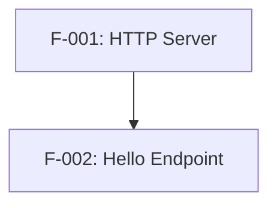
```mermaid
graph TD
    F001[F-001: HTTP Server] --> F002[F-002: Hello Endpoint]
```

The feature relationship is straightforward in this tutorial project:
- The HTTP Server (F-001) is a prerequisite for the Hello Endpoint (F-002)
- The Hello Endpoint depends on the HTTP Server to handle incoming requests

### 2.4 IMPLEMENTATION CONSIDERATIONS

#### 2.4.1 HTTP Server Implementation

| Consideration | Details |
| --- | --- |
| Technical Constraints | Must use Node.js runtime |
| Performance Requirements | None specific for tutorial purposes |
| Scalability Considerations | None for tutorial scope |
| Security Implications | None for tutorial scope |
| Maintenance Requirements | Code should be well-commented for educational purposes |

#### 2.4.2 Hello Endpoint Implementation

| Consideration | Details |
| --- | --- |
| Technical Constraints | Must implement standard HTTP GET method handling |
| Performance Requirements | None specific for tutorial purposes |
| Scalability Considerations | None for tutorial scope |
| Security Implications | None for tutorial scope |
| Maintenance Requirements | Code should demonstrate best practices for route handling |

### 2.5 TRACEABILITY MATRIX

| Requirement ID | Feature ID | Feature Name | Priority |
| --- | --- | --- | --- |
| F-001-RQ-001 | F-001 | HTTP Server | Must-Have |
| F-002-RQ-001 | F-002 | Hello Endpoint | Must-Have |

## 3. TECHNOLOGY STACK

### 3.1 PROGRAMMING LANGUAGES

| Language | Component | Version | Justification |
| --- | --- | --- | --- |
| JavaScript | Server-side | ES6+ | Native language for Node.js runtime, providing asynchronous capabilities ideal for HTTP servers |
| JSON | Configuration | N/A | Industry standard for Node.js configuration files (package.json) |

### 3.2 FRAMEWORKS & LIBRARIES

| Framework/Library | Version | Purpose | Justification |
| --- | --- | --- | --- |
| Node.js | 18.x LTS | Runtime environment | Long-term support version offering stability and modern JavaScript features |
| Express.js (Optional) | 4.18.x | Web framework | Simplifies HTTP server implementation with middleware support and routing capabilities |

**Framework Selection Rationale:**
- **Node.js Core HTTP Module**: Sufficient for minimal implementation, demonstrating Node.js fundamentals without additional dependencies
- **Express.js (Alternative)**: Provides a more structured approach with simplified routing, recommended for developers who will build more complex applications later

### 3.3 OPEN SOURCE DEPENDENCIES

| Dependency | Version | Purpose | Source |
| --- | --- | --- | --- |
| express (Optional) | ^4.18.2 | Web framework | npm registry |
| nodemon (Dev) | ^2.0.22 | Development server | npm registry |

**Dependency Management:**
- Package manager: npm (Node Package Manager)
- Dependency definition: package.json
- Lock file: package-lock.json

### 3.4 DEVELOPMENT & DEPLOYMENT

| Tool/Technology | Version | Purpose | Justification |
| --- | --- | --- | --- |
| npm | 9.x+ | Package management | Native package manager for Node.js ecosystem |
| Git | 2.x+ | Version control | Industry standard for source code management |
| VS Code | Latest | IDE | Optimized for JavaScript/Node.js development with extensive plugin support |
| Postman/cURL | Latest | API testing | Simple tools for testing HTTP endpoints |

**Development Environment:**
- Local development with direct Node.js execution
- No containerization required for tutorial simplicity
- Manual testing via browser or API testing tools

**Deployment Options:**
- Local execution for educational purposes
- Optional deployment to services like Glitch, Replit, or CodeSandbox for sharing

### 3.5 TECHNOLOGY STACK DIAGRAM

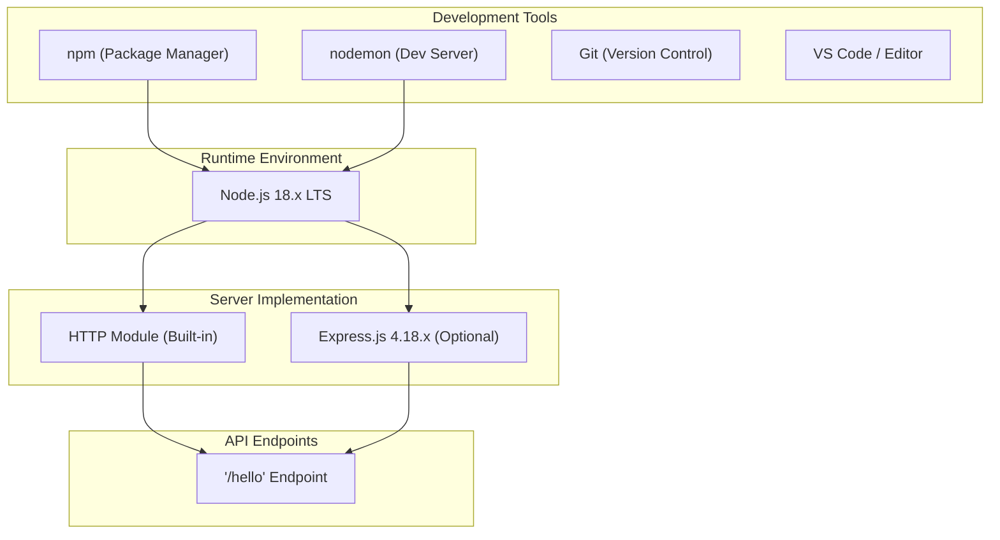
```mermaid
graph TD
    subgraph "Runtime Environment"
        Node["Node.js 18.x LTS"]
    end
    
    subgraph "Server Implementation"
        HTTP["HTTP Module (Built-in)"]
        Express["Express.js 4.18.x (Optional)"]
        Node --> HTTP
        Node --> Express
    end
    
    subgraph "API Endpoints"
        Hello["'/hello' Endpoint"]
        HTTP --> Hello
        Express --> Hello
    end
    
    subgraph "Development Tools"
        NPM["npm (Package Manager)"]
        Nodemon["nodemon (Dev Server)"]
        Git["Git (Version Control)"]
        IDE["VS Code / Editor"]
    end
    
    NPM --> Node
    Nodemon --> Node
```

### 3.6 TECHNOLOGY CONSTRAINTS & CONSIDERATIONS

| Constraint | Impact | Mitigation |
| --- | --- | --- |
| Node.js version compatibility | Syntax and API availability | Target LTS version for maximum compatibility |
| Minimal dependencies | Limited functionality | Focus on core HTTP capabilities sufficient for tutorial |
| No database integration | No data persistence | Out of scope for this tutorial project |
| No authentication | Limited security | Acceptable for educational purposes |

## 4. PROCESS FLOWCHART

### 4.1 SYSTEM WORKFLOWS

#### 4.1.1 Core Business Processes

##### HTTP Server Request-Response Flow

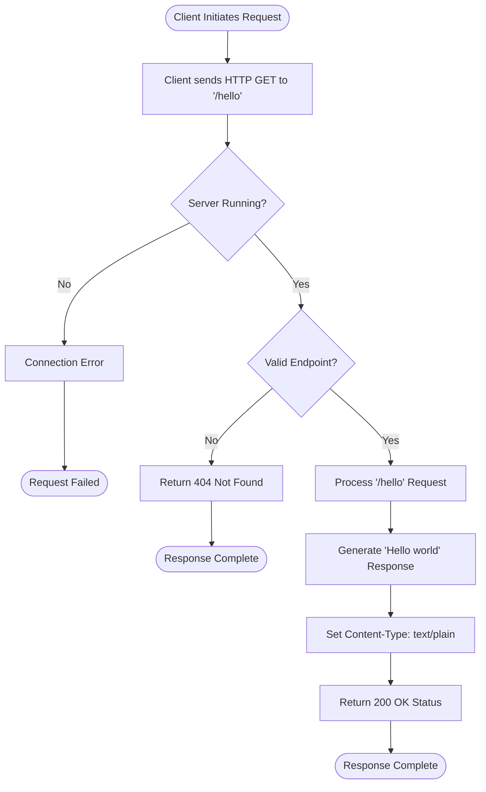
```mermaid
flowchart TD
    Start([Client Initiates Request]) --> A[Client sends HTTP GET to '/hello']
    A --> B{Server Running?}
    B -->|No| C[Connection Error]
    C --> End1([Request Failed])
    B -->|Yes| D{Valid Endpoint?}
    D -->|No| E[Return 404 Not Found]
    E --> End2([Response Complete])
    D -->|Yes| F[Process '/hello' Request]
    F --> G["Generate 'Hello world' Response"]
    G --> H[Set Content-Type: text/plain]
    H --> I[Return 200 OK Status]
    I --> End3([Response Complete])
```

##### User Journey

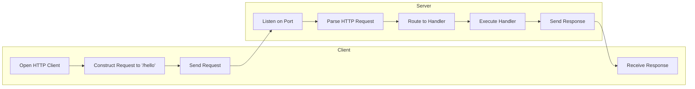
```mermaid
flowchart LR
    subgraph Client
        A1[Open HTTP Client] --> A2[Construct Request to '/hello']
        A2 --> A3[Send Request]
        A6[Receive Response]
    end
    
    subgraph Server
        B1[Listen on Port]
        B2[Parse HTTP Request]
        B3[Route to Handler]
        B4[Execute Handler]
        B5[Send Response]
    end
    
    A3 --> B1
    B1 --> B2
    B2 --> B3
    B3 --> B4
    B4 --> B5
    B5 --> A6
```

#### 4.1.2 Integration Workflows

##### API Request Processing Flow

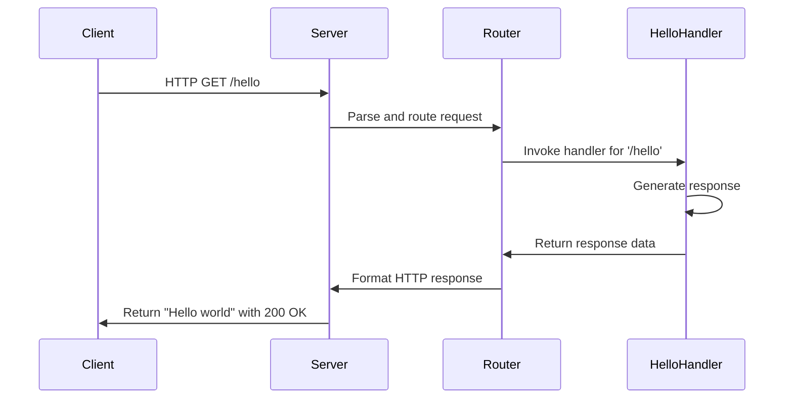
```mermaid
sequenceDiagram
    participant Client
    participant Server
    participant Router
    participant HelloHandler
    
    Client->>Server: HTTP GET /hello
    Server->>Router: Parse and route request
    Router->>HelloHandler: Invoke handler for '/hello'
    HelloHandler->>HelloHandler: Generate response
    HelloHandler->>Router: Return response data
    Router->>Server: Format HTTP response
    Server->>Client: Return "Hello world" with 200 OK
```

##### Error Handling Flow

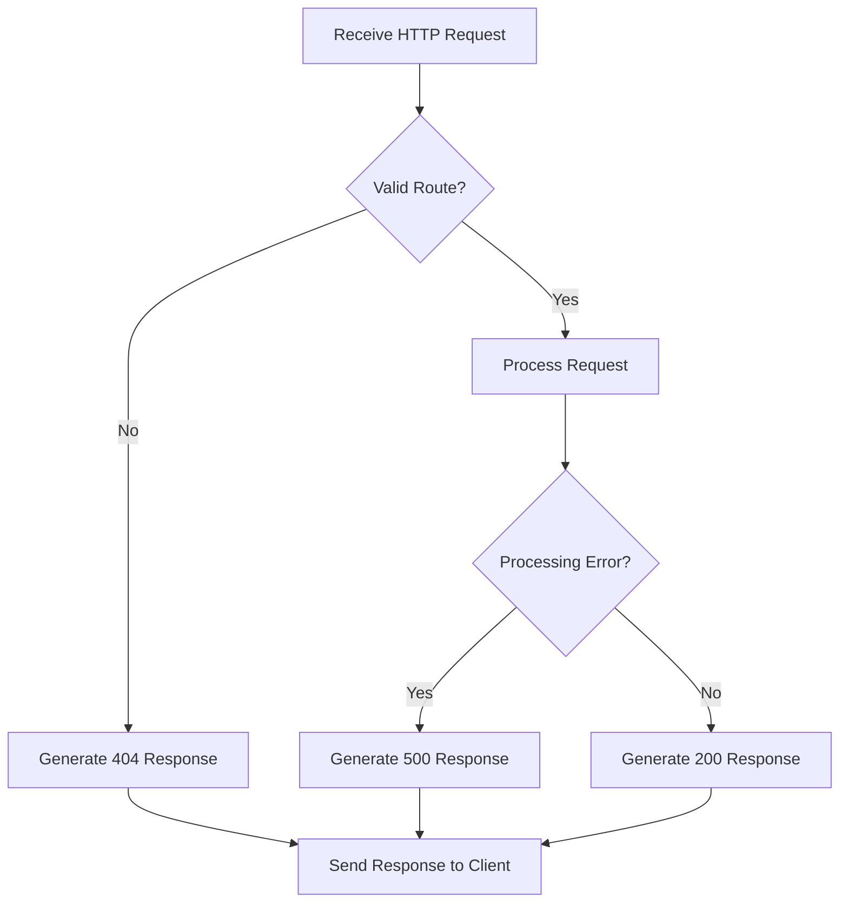
```mermaid
flowchart TD
    A[Receive HTTP Request] --> B{Valid Route?}
    B -->|Yes| C[Process Request]
    B -->|No| D[Generate 404 Response]
    C --> E{Processing Error?}
    E -->|Yes| F[Generate 500 Response]
    E -->|No| G[Generate 200 Response]
    D --> H[Send Response to Client]
    F --> H
    G --> H
```

### 4.2 FLOWCHART REQUIREMENTS

#### 4.2.1 Server Startup Flow

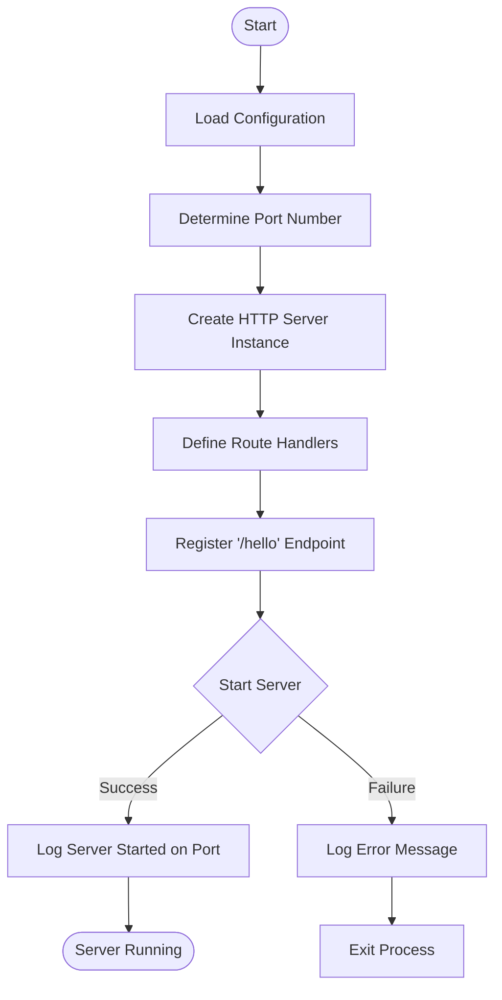
```mermaid
flowchart TD
    A([Start]) --> B[Load Configuration]
    B --> C[Determine Port Number]
    C --> D[Create HTTP Server Instance]
    D --> E[Define Route Handlers]
    E --> F[Register '/hello' Endpoint]
    F --> G{Start Server}
    G -->|Success| H[Log Server Started on Port]
    G -->|Failure| I[Log Error Message]
    I --> J[Exit Process]
    H --> K([Server Running])
```

#### 4.2.2 Request Validation Flow

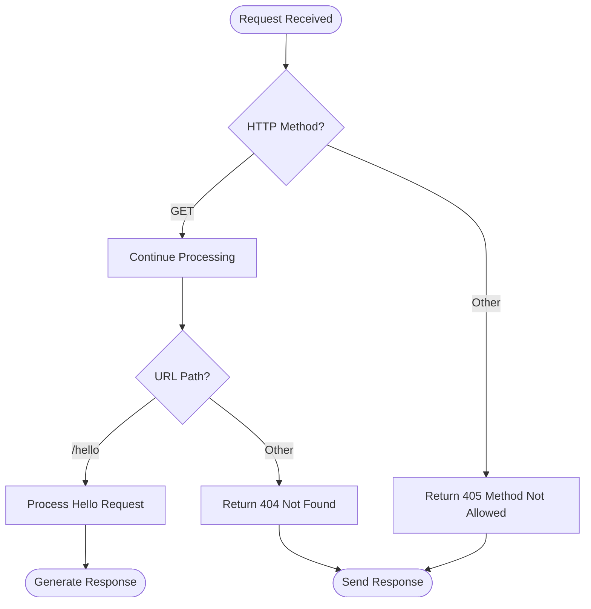
```mermaid
flowchart TD
    A([Request Received]) --> B{HTTP Method?}
    B -->|GET| C[Continue Processing]
    B -->|Other| D[Return 405 Method Not Allowed]
    C --> E{URL Path?}
    E -->|/hello| F[Process Hello Request]
    E -->|Other| G[Return 404 Not Found]
    F --> H([Generate Response])
    D --> I([Send Response])
    G --> I
```

#### 4.2.3 Response Generation Flow

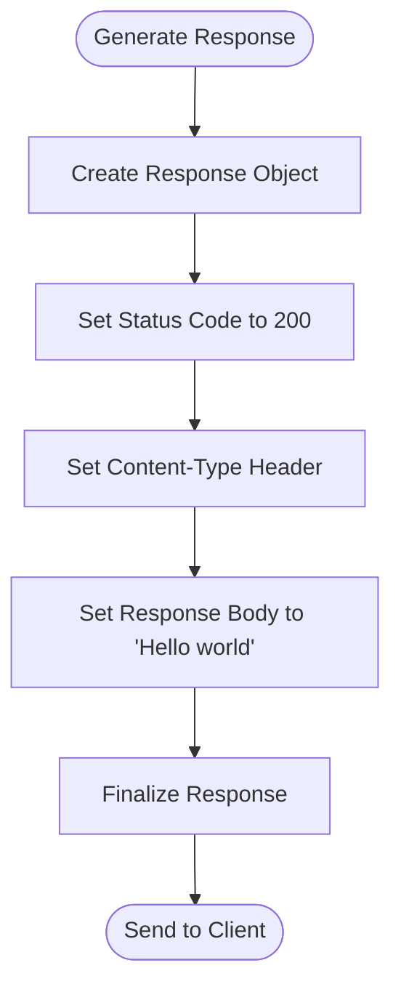
```mermaid
flowchart TD
    A([Generate Response]) --> B[Create Response Object]
    B --> C[Set Status Code to 200]
    C --> D[Set Content-Type Header]
    D --> E["Set Response Body to 'Hello world'"]
    E --> F[Finalize Response]
    F --> G([Send to Client])
```

### 4.3 TECHNICAL IMPLEMENTATION

#### 4.3.1 State Management

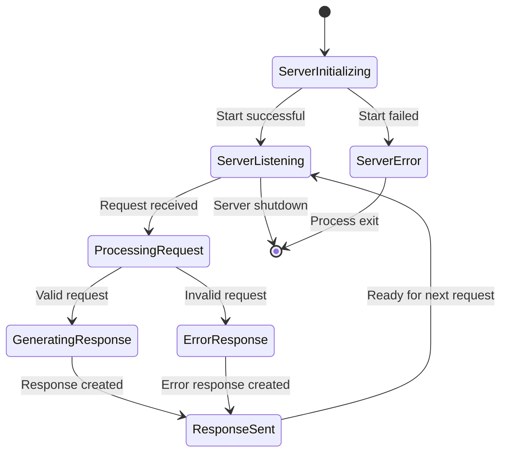
```mermaid
stateDiagram-v2
    [*] --> ServerInitializing
    ServerInitializing --> ServerListening: Start successful
    ServerInitializing --> ServerError: Start failed
    ServerListening --> ProcessingRequest: Request received
    ProcessingRequest --> GeneratingResponse: Valid request
    ProcessingRequest --> ErrorResponse: Invalid request
    GeneratingResponse --> ResponseSent: Response created
    ErrorResponse --> ResponseSent: Error response created
    ResponseSent --> ServerListening: Ready for next request
    ServerListening --> [*]: Server shutdown
    ServerError --> [*]: Process exit
```

#### 4.3.2 Error Handling Flow

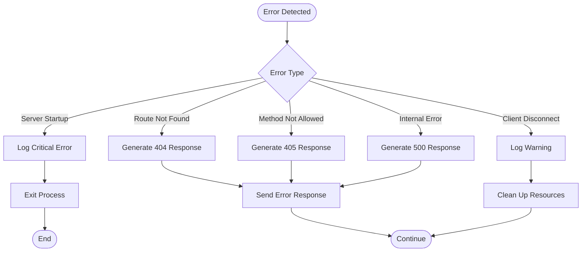
```mermaid
flowchart TD
    A([Error Detected]) --> B{Error Type}
    B -->|Server Startup| C[Log Critical Error]
    B -->|Route Not Found| D[Generate 404 Response]
    B -->|Method Not Allowed| E[Generate 405 Response]
    B -->|Internal Error| F[Generate 500 Response]
    B -->|Client Disconnect| G[Log Warning]
    C --> H[Exit Process]
    D --> I[Send Error Response]
    E --> I
    F --> I
    G --> J[Clean Up Resources]
    I --> K([Continue])
    J --> K
    H --> L([End])
```

### 4.4 REQUIRED DIAGRAMS

#### 4.4.1 High-Level System Workflow

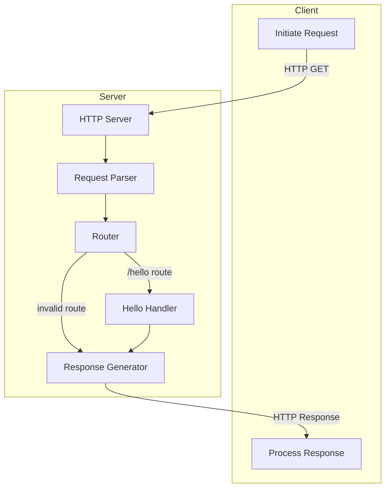
```mermaid
flowchart TD
    subgraph Client
        A1[Initiate Request]
        A4[Process Response]
    end
    
    subgraph Server
        B1[HTTP Server]
        B2[Request Parser]
        B3[Router]
        B4[Hello Handler]
        B5[Response Generator]
    end
    
    A1 -->|HTTP GET| B1
    B1 --> B2
    B2 --> B3
    B3 -->|/hello route| B4
    B3 -->|invalid route| B5
    B4 --> B5
    B5 -->|HTTP Response| A4
```

#### 4.4.2 Detailed Process Flow for Hello Endpoint

```mermaid
flowchart TD
    A([Client Request]) --> B[Parse HTTP Request]
    B --> C{Validate Request}
    C -->|Invalid| D[Generate Error Response]
    C -->|Valid| E[Extract URL Path]
    E --> F{Path = '/hello'?}
    F -->|No| G[Generate 404 Response]
    F -->|Yes| H{Method = GET?}
    H -->|No| I[Generate 405 Response]
    H -->|Yes| J[Create Response Object]
    J --> K[Set Status: 200 OK]
    K --> L[Set Content-Type: text/plain]
    L --> M[Set Body: "Hello world"]
    M --> N[Finalize Response]
    D --> O[Send Response to Client]
    G --> O
    I --> O
    N --> O
    O --> P([End Request])
```

#### 4.4.3 Error Handling Flowchart

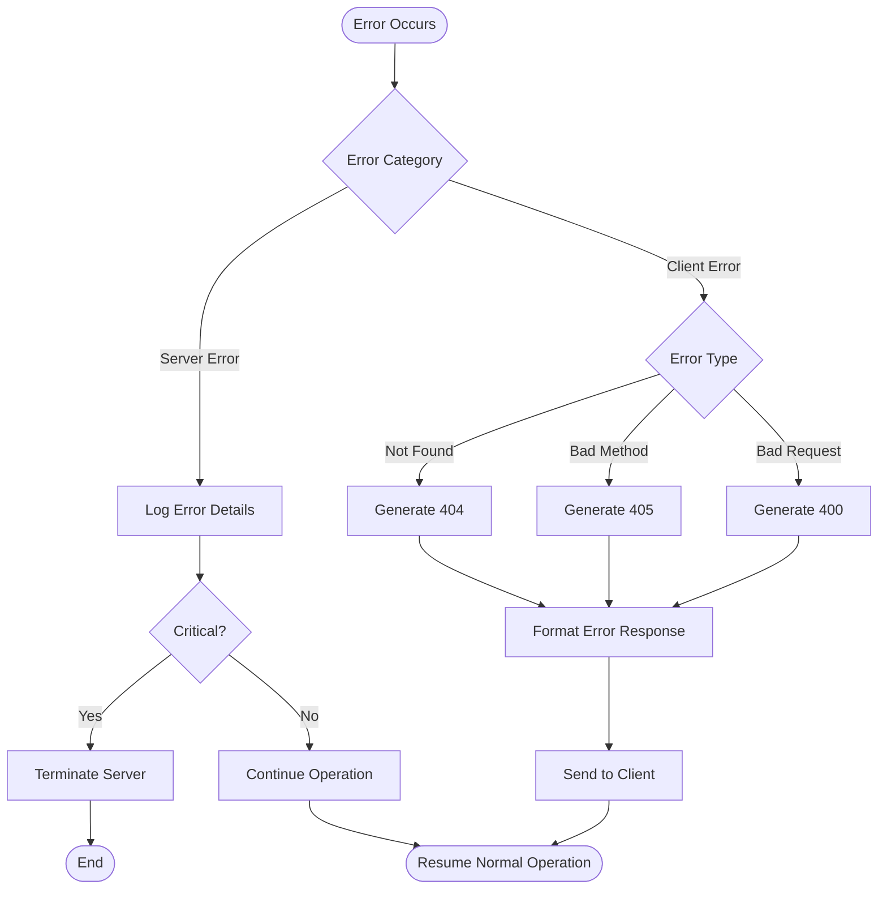
```mermaid
flowchart TD
    A([Error Occurs]) --> B{Error Category}
    
    B -->|Server Error| C[Log Error Details]
    C --> D{Critical?}
    D -->|Yes| E[Terminate Server]
    D -->|No| F[Continue Operation]
    
    B -->|Client Error| G{Error Type}
    G -->|Not Found| H[Generate 404]
    G -->|Bad Method| I[Generate 405]
    G -->|Bad Request| J[Generate 400]
    
    H --> K[Format Error Response]
    I --> K
    J --> K
    
    K --> L[Send to Client]
    F --> M([Resume Normal Operation])
    E --> N([End])
    L --> M
```

#### 4.4.4 Integration Sequence Diagram

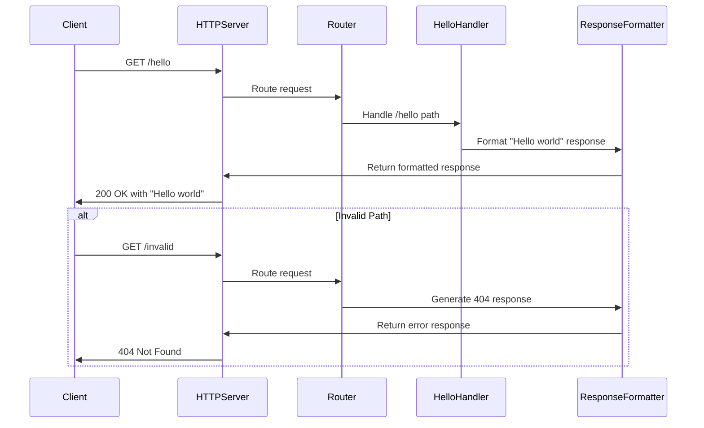
```mermaid
sequenceDiagram
    participant Client
    participant HTTPServer
    participant Router
    participant HelloHandler
    participant ResponseFormatter
    
    Client->>HTTPServer: GET /hello
    HTTPServer->>Router: Route request
    Router->>HelloHandler: Handle /hello path
    HelloHandler->>ResponseFormatter: Format "Hello world" response
    ResponseFormatter->>HTTPServer: Return formatted response
    HTTPServer->>Client: 200 OK with "Hello world"
    
    alt Invalid Path
        Client->>HTTPServer: GET /invalid
        HTTPServer->>Router: Route request
        Router->>ResponseFormatter: Generate 404 response
        ResponseFormatter->>HTTPServer: Return error response
        HTTPServer->>Client: 404 Not Found
    end
```

#### 4.4.5 State Transition Diagram

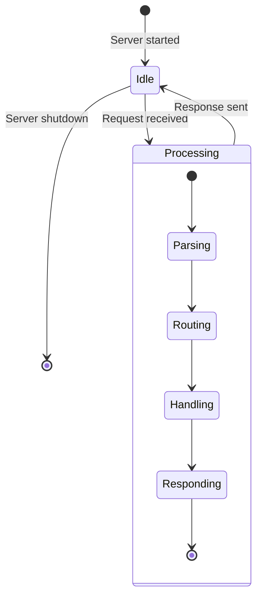
```mermaid
stateDiagram-v2
    [*] --> Idle: Server started
    
    state "Idle" as Idle
    state "Processing" as Processing {
        [*] --> Parsing
        Parsing --> Routing
        Routing --> Handling
        Handling --> Responding
        Responding --> [*]
    }
    
    Idle --> Processing: Request received
    Processing --> Idle: Response sent
    
    Idle --> [*]: Server shutdown
```

## 5. SYSTEM ARCHITECTURE

### 5.1 HIGH-LEVEL ARCHITECTURE

#### 5.1.1 System Overview

The Node.js tutorial project implements a simple client-server architecture following RESTful principles. The system is designed with the following architectural characteristics:

- **Architectural Style**: Monolithic HTTP server using a request-response pattern
- **Key Principles**:
  - Simplicity: Minimal implementation focused on educational value
  - Statelessness: No session state maintained between requests
  - Resource-oriented: Single '/hello' endpoint representing a resource
- **System Boundaries**:
  - Client boundary: Any HTTP client (browser, Postman, curl)
  - Server boundary: Node.js HTTP server process
  - Network boundary: HTTP protocol over TCP/IP

The architecture intentionally avoids unnecessary complexity to serve its educational purpose, demonstrating core Node.js HTTP server capabilities without additional infrastructure components.

#### 5.1.2 Core Components Table

| Component Name | Primary Responsibility | Key Dependencies | Critical Considerations |
| --- | --- | --- | --- |
| HTTP Server | Listen for incoming connections and manage request lifecycle | Node.js runtime | Port configuration, error handling |
| Request Router | Parse incoming requests and direct to appropriate handler | HTTP Server | URL path parsing, HTTP method validation |
| Hello Handler | Process '/hello' requests and generate responses | Request Router | Response format, status code selection |
| Response Formatter | Structure HTTP responses with appropriate headers and body | Hello Handler | Content-type headers, character encoding |

#### 5.1.3 Data Flow Description

The data flow in this system is straightforward and unidirectional:

1. Client initiates an HTTP GET request to the '/hello' endpoint
2. HTTP Server receives the request and passes it to the Request Router
3. Request Router validates the URL path and HTTP method
4. For valid '/hello' GET requests, the Hello Handler is invoked
5. Hello Handler generates the "Hello world" message
6. Response Formatter adds appropriate HTTP headers
7. HTTP Server sends the complete response back to the client

No data persistence is required as the system maintains no state between requests. All processing occurs in-memory within the Node.js process.

#### 5.1.4 External Integration Points

| System Name | Integration Type | Data Exchange Pattern | Protocol/Format |
| --- | --- | --- | --- |
| HTTP Clients | Inbound | Request-Response | HTTP/1.1, Plain Text |

### 5.2 COMPONENT DETAILS

#### 5.2.1 HTTP Server Component

- **Purpose**: Establish an HTTP listener that accepts incoming connections on a configured port
- **Responsibilities**:
  - Initialize server on application startup
  - Listen for incoming TCP connections
  - Parse HTTP protocol messages
  - Route requests to appropriate handlers
  - Send responses back to clients
- **Technologies**:
  - Node.js built-in 'http' module or Express.js framework
- **Key Interfaces**:
  - Server initialization function
  - Request event handler
- **Scaling Considerations**:
  - Single-process design sufficient for tutorial purposes
  - No clustering or load balancing required

#### 5.2.2 Request Router Component

- **Purpose**: Determine which handler should process each incoming request
- **Responsibilities**:
  - Parse URL paths from incoming requests
  - Validate HTTP methods against allowed methods
  - Route valid requests to appropriate handlers
  - Generate error responses for invalid requests
- **Technologies**:
  - Custom routing logic or Express.js router
- **Key Interfaces**:
  - Route registration function
  - Request handling function
- **Scaling Considerations**:
  - Simple in-memory routing table sufficient for single endpoint

#### 5.2.3 Hello Handler Component

- **Purpose**: Process requests to the '/hello' endpoint
- **Responsibilities**:
  - Validate request parameters (if any)
  - Generate "Hello world" response
  - Set appropriate response status code
- **Technologies**:
  - JavaScript function handlers
- **Key Interfaces**:
  - Request handler function
- **Scaling Considerations**:
  - Stateless design requires no special scaling considerations

#### 5.2.4 Response Formatter Component

- **Purpose**: Structure HTTP responses with appropriate headers and body
- **Responsibilities**:
  - Set Content-Type header to 'text/plain'
  - Set HTTP status code (200 for success)
  - Format response body with "Hello world" message
- **Technologies**:
  - Node.js HTTP response methods
- **Key Interfaces**:
  - Response formatting function
- **Scaling Considerations**:
  - No special scaling considerations for simple text responses

#### 5.2.5 Component Interaction Diagram

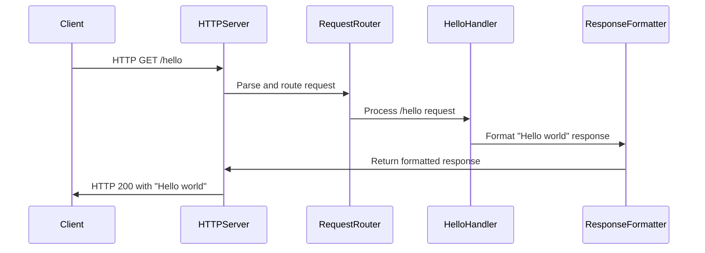
```mermaid
sequenceDiagram
    participant Client
    participant HTTPServer
    participant RequestRouter
    participant HelloHandler
    participant ResponseFormatter

    Client->>HTTPServer: HTTP GET /hello
    HTTPServer->>RequestRouter: Parse and route request
    RequestRouter->>HelloHandler: Process /hello request
    HelloHandler->>ResponseFormatter: Format "Hello world" response
    ResponseFormatter->>HTTPServer: Return formatted response
    HTTPServer->>Client: HTTP 200 with "Hello world"
```

#### 5.2.6 Request Processing State Diagram

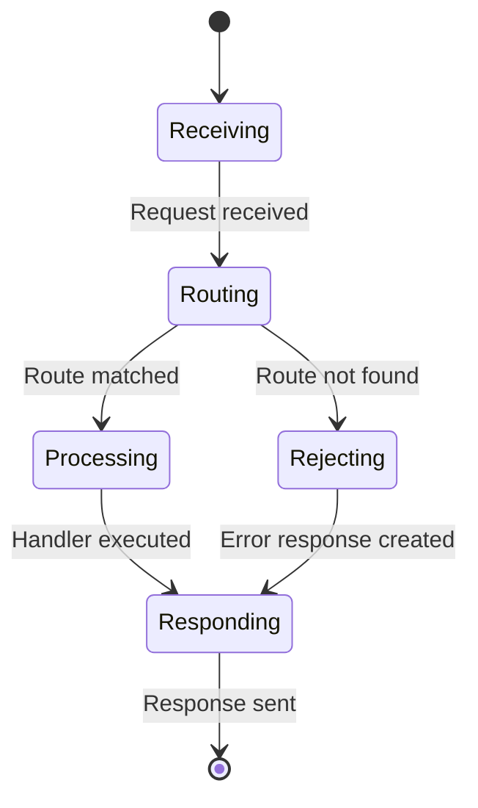
```mermaid
stateDiagram-v2
    [*] --> Receiving
    Receiving --> Routing: Request received
    Routing --> Processing: Route matched
    Routing --> Rejecting: Route not found
    Processing --> Responding: Handler executed
    Rejecting --> Responding: Error response created
    Responding --> [*]: Response sent
```

### 5.3 TECHNICAL DECISIONS

#### 5.3.1 Architecture Style Decisions

| Decision | Options | Selected Approach | Rationale |
| --- | --- | --- | --- |
| Server Implementation | Native HTTP vs Express | Both options supported | Native HTTP demonstrates core Node.js capabilities; Express shows simplified routing |
| Communication Pattern | REST vs WebSockets | REST | Simpler implementation, appropriate for tutorial context |
| Server Architecture | Monolithic vs Microservices | Monolithic | Appropriate scale for single endpoint, reduces complexity |

#### 5.3.2 Communication Pattern Choices

| Pattern | Decision | Rationale |
| --- | --- | --- |
| Request-Response | Adopted | Standard HTTP pattern, simplest to implement and understand |
| Content Format | Plain Text | Simplest format for "Hello world" response, no parsing required |
| Error Handling | Standard HTTP Status Codes | Industry standard approach to error communication |

#### 5.3.3 Architecture Decision Record

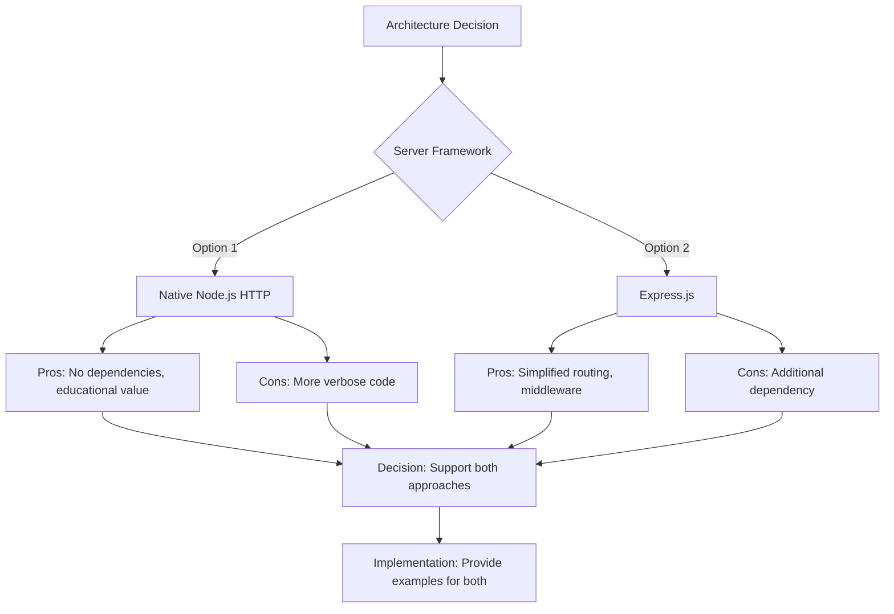
```mermaid
graph TD
    A[Architecture Decision] --> B{Server Framework}
    B -->|Option 1| C[Native Node.js HTTP]
    B -->|Option 2| D[Express.js]
    
    C --> E[Pros: No dependencies, educational value]
    C --> F[Cons: More verbose code]
    
    D --> G[Pros: Simplified routing, middleware]
    D --> H[Cons: Additional dependency]
    
    E --> I[Decision: Support both approaches]
    F --> I
    G --> I
    H --> I
    
    I --> J[Implementation: Provide examples for both]
```

### 5.4 CROSS-CUTTING CONCERNS

#### 5.4.1 Error Handling Patterns

For this tutorial project, a simplified error handling approach is appropriate:

- **HTTP-Level Errors**:
  - 404 Not Found: For requests to non-existent endpoints
  - 405 Method Not Allowed: For non-GET requests to '/hello'
  - 500 Internal Server Error: For unexpected runtime errors

| Error Type | Handling Approach | Response |
| --- | --- | --- |
| Invalid Route | Route matching in RequestRouter | 404 Not Found |
| Invalid Method | Method validation in RequestRouter | 405 Method Not Allowed |
| Runtime Error | Try/catch blocks around handlers | 500 Internal Server Error |

#### 5.4.2 Error Handling Flow

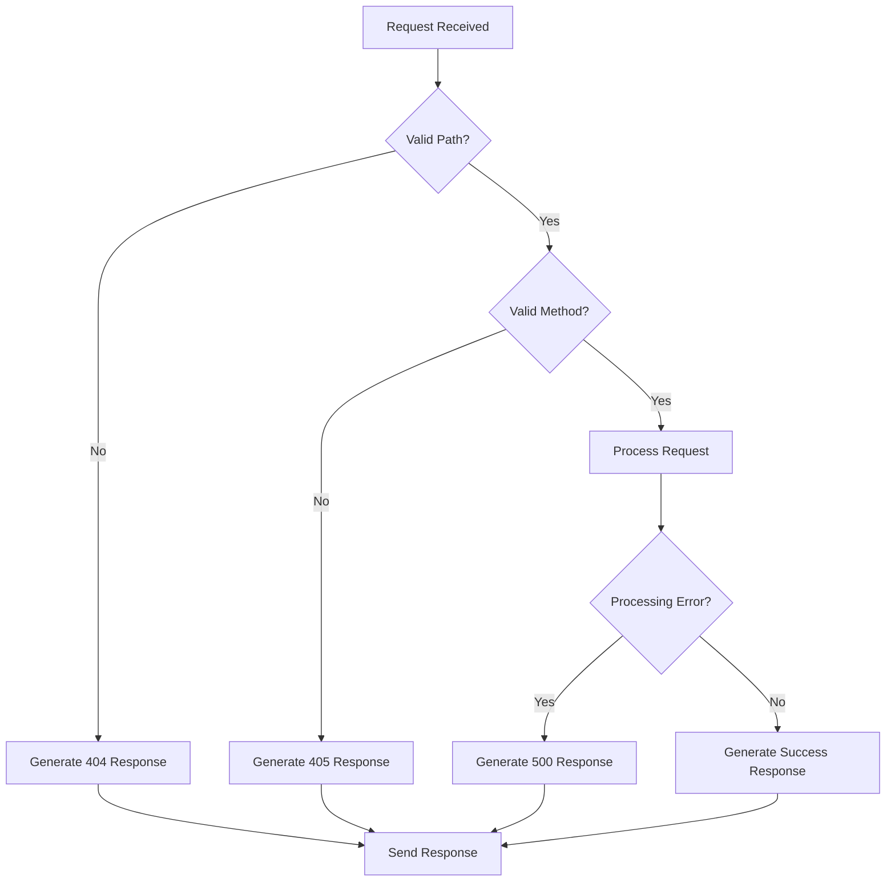
```mermaid
flowchart TD
    A[Request Received] --> B{Valid Path?}
    B -->|Yes| C{Valid Method?}
    B -->|No| D[Generate 404 Response]
    C -->|Yes| E[Process Request]
    C -->|No| F[Generate 405 Response]
    E --> G{Processing Error?}
    G -->|Yes| H[Generate 500 Response]
    G -->|No| I[Generate Success Response]
    D --> J[Send Response]
    F --> J
    H --> J
    I --> J
```

#### 5.4.3 Logging Strategy

For educational purposes, a simple console-based logging approach is sufficient:

- Server startup: Log server initialization and port
- Request logging: Log incoming request method and path
- Error logging: Log error details for troubleshooting

| Log Event | Information Captured | Purpose |
| --- | --- | --- |
| Server Start | Timestamp, Port | Confirm successful initialization |
| Request Received | Timestamp, Method, Path | Track incoming requests |
| Error Occurred | Timestamp, Error Details | Troubleshooting assistance |

#### 5.4.4 Performance Considerations

The simple nature of this tutorial project means performance requirements are minimal:

- **Response Time**: Sub-100ms response time for '/hello' endpoint
- **Throughput**: Single Node.js process can handle hundreds of requests per second
- **Resource Usage**: Minimal memory footprint (<50MB)

No special performance optimizations are required given the educational nature and simplicity of the implementation.

## 6. SYSTEM COMPONENTS DESIGN

### 6.1 HTTP SERVER COMPONENT

#### 6.1.1 Component Overview

The HTTP Server component serves as the foundation of the application, responsible for listening to incoming HTTP requests and directing them to the appropriate handlers.

| Aspect | Description |
| --- | --- |
| Primary Responsibility | Create and manage an HTTP server that listens on a configured port |
| Key Functions | Initialize server, handle connections, parse HTTP requests, send responses |
| Dependencies | Node.js HTTP module or Express.js framework |
| Lifecycle | Initialized at application startup, runs continuously until terminated |

#### 6.1.2 Component Interface

**Public Methods**

| Method | Parameters | Return Value | Description |
| --- | --- | --- | --- |
| `createServer` | `options` (Optional) | Server instance | Creates an HTTP server instance |
| `listen` | `port`, `callback` | Server instance | Starts the server on specified port |
| `close` | `callback` | None | Gracefully shuts down the server |

**Events**

| Event | Parameters | Description |
| --- | --- | --- |
| `request` | `request`, `response` | Emitted when server receives an HTTP request |
| `error` | `error` | Emitted when server encounters an error |
| `listening` | None | Emitted when server starts listening on a port |

#### 6.1.3 Implementation Details

**Native HTTP Implementation**

```mermaid
classDiagram
    class HTTPServer {
        -port: number
        -server: http.Server
        +constructor(port: number)
        +start(): void
        +stop(): void
        -handleRequest(req, res): void
    }
    
    class http.Server {
        +listen(port): Server
        +close(): void
    }
    
    HTTPServer --> http.Server : uses
```

**Express Implementation**

```mermaid
classDiagram
    class ExpressServer {
        -port: number
        -app: Express
        -server: http.Server
        +constructor(port: number)
        +start(): void
        +stop(): void
        +registerRoutes(): void
    }
    
    class Express {
        +get(path, handler): Express
        +use(middleware): Express
        +listen(port): http.Server
    }
    
    ExpressServer --> Express : uses
    Express --> http.Server : creates
```

### 6.2 REQUEST ROUTER COMPONENT

#### 6.2.1 Component Overview

The Request Router component is responsible for analyzing incoming HTTP requests and directing them to the appropriate handler based on the URL path and HTTP method.

| Aspect | Description |
| --- | --- |
| Primary Responsibility | Route incoming requests to the appropriate handler based on URL path |
| Key Functions | Parse URL paths, validate HTTP methods, invoke handlers, handle routing errors |
| Dependencies | HTTP Server component |
| Lifecycle | Initialized with server, processes each incoming request |

#### 6.2.2 Component Interface

**Public Methods**

| Method | Parameters | Return Value | Description |
| --- | --- | --- |--- |
| `registerRoute` | `path`, `method`, `handler` | None | Registers a handler for a specific path and HTTP method |
| `handleRequest` | `request`, `response` | None | Processes an incoming request and routes to appropriate handler |

**Data Structures**

| Structure | Description |
| --- | --- |
| Route Table | In-memory collection mapping URL paths and HTTP methods to handler functions |

#### 6.2.3 Implementation Details

**Native HTTP Router**

```mermaid
classDiagram
    class Router {
        -routes: Map~string, Map~string, Handler~~
        +registerRoute(path, method, handler): void
        +handleRequest(req, res): void
        -matchRoute(path, method): Handler
        -handleNotFound(res): void
        -handleMethodNotAllowed(res): void
    }
    
    class Handler {
        <<interface>>
        +handle(req, res): void
    }
    
    Router --> Handler : invokes
```

**Express Router**

```mermaid
classDiagram
    class ExpressRouter {
        -router: express.Router
        +constructor()
        +registerRoute(path, method, handler): void
        +getRouter(): express.Router
    }
    
    class express.Router {
        +get(path, handler): Router
        +use(middleware): Router
    }
    
    ExpressRouter --> express.Router : configures
```

### 6.3 HELLO HANDLER COMPONENT

#### 6.3.1 Component Overview

The Hello Handler component processes requests to the '/hello' endpoint and generates the appropriate response.

| Aspect | Description |
| --- | --- |
| Primary Responsibility | Process GET requests to the '/hello' endpoint |
| Key Functions | Generate "Hello world" response |
| Dependencies | Request Router component |
| Lifecycle | Invoked per request to '/hello' endpoint |

#### 6.3.2 Component Interface

**Public Methods**

| Method | Parameters | Return Value | Description |
| --- | --- | --- | --- |
| `handle` | `request`, `response` | None | Processes a request to the '/hello' endpoint |

**Response Format**

| Field | Value |
| --- | --- |
| Status Code | 200 OK |
| Content-Type | text/plain |
| Body | "Hello world" |

#### 6.3.3 Implementation Details

**Handler Structure**

```mermaid
classDiagram
    class HelloHandler {
        +handle(req, res): void
        -validateRequest(req): boolean
        -generateResponse(res): void
    }
    
    class RequestValidator {
        +validateMethod(req): boolean
        +validatePath(req): boolean
    }
    
    class ResponseGenerator {
        +sendTextResponse(res, text, statusCode): void
    }
    
    HelloHandler --> RequestValidator : uses
    HelloHandler --> ResponseGenerator : uses
```

### 6.4 RESPONSE FORMATTER COMPONENT

#### 6.4.1 Component Overview

The Response Formatter component is responsible for structuring HTTP responses with appropriate headers and content.

| Aspect | Description |
| --- | --- |
| Primary Responsibility | Format HTTP responses with correct headers and body content |
| Key Functions | Set status codes, set headers, format response body |
| Dependencies | None |
| Lifecycle | Utilized during response generation for each request |

#### 6.4.2 Component Interface

**Public Methods**

| Method | Parameters | Return Value | Description |
| --- | --- | --- | --- |
| `formatTextResponse` | `response`, `text`, `statusCode` | None | Formats a plain text response |
| `formatErrorResponse` | `response`, `statusCode`, `message` | None | Formats an error response |

**Supported Response Types**

| Response Type | Content-Type | Description |
| --- | --- | --- |
| Text Response | text/plain | Plain text responses like "Hello world" |
| Error Response | text/plain | Error messages with appropriate status codes |

#### 6.4.3 Implementation Details

**Formatter Structure**

```mermaid
classDiagram
    class ResponseFormatter {
        +formatTextResponse(res, text, statusCode): void
        +formatErrorResponse(res, statusCode, message): void
        -setCommonHeaders(res): void
    }
    
    class HTTPResponse {
        +writeHead(statusCode, headers): Response
        +end(data): void
    }
    
    ResponseFormatter --> HTTPResponse : formats
```

### 6.5 COMPONENT INTERACTION

#### 6.5.1 Request Processing Sequence

```mermaid
sequenceDiagram
    participant Client
    participant Server as HTTP Server
    participant Router as Request Router
    participant Handler as Hello Handler
    participant Formatter as Response Formatter
    
    Client->>Server: HTTP GET /hello
    activate Server
    Server->>Router: handleRequest(req, res)
    activate Router
    Router->>Router: matchRoute('/hello', 'GET')
    Router->>Handler: handle(req, res)
    activate Handler
    Handler->>Handler: validateRequest(req)
    Handler->>Formatter: formatTextResponse(res, "Hello world", 200)
    activate Formatter
    Formatter->>Formatter: setCommonHeaders(res)
    Formatter-->>Handler: void
    deactivate Formatter
    Handler-->>Router: void
    deactivate Handler
    Router-->>Server: void
    deactivate Router
    Server->>Client: HTTP 200 "Hello world"
    deactivate Server
```

#### 6.5.2 Error Handling Sequence

```mermaid
sequenceDiagram
    participant Client
    participant Server as HTTP Server
    participant Router as Request Router
    participant Formatter as Response Formatter
    
    Client->>Server: HTTP GET /invalid
    activate Server
    Server->>Router: handleRequest(req, res)
    activate Router
    Router->>Router: matchRoute('/invalid', 'GET')
    Router->>Formatter: formatErrorResponse(res, 404, "Not Found")
    activate Formatter
    Formatter->>Formatter: setCommonHeaders(res)
    Formatter-->>Router: void
    deactivate Formatter
    Router-->>Server: void
    deactivate Router
    Server->>Client: HTTP 404 "Not Found"
    deactivate Server
```

### 6.6 COMPONENT DEPENDENCIES

#### 6.6.1 Dependency Graph

```mermaid
graph TD
    A[HTTP Server] --> B[Request Router]
    B --> C[Hello Handler]
    B --> D[Response Formatter]
    C --> D
```

#### 6.6.2 Dependency Table

| Component | Dependencies | Justification |
| --- | --- | --- |
| HTTP Server | Node.js http module or Express.js | Core functionality for HTTP communication |
| Request Router | HTTP Server | Receives requests from server to route |
| Hello Handler | Request Router, Response Formatter | Registered with router, uses formatter for responses |
| Response Formatter | None | Utility component with no dependencies |

### 6.7 CONFIGURATION PARAMETERS

#### 6.7.1 Server Configuration

| Parameter | Default Value | Description | Environment Variable |
| --- | --- | --- | --- |
| Port | 3000 | TCP port for HTTP server to listen on | PORT |
| Host | 0.0.0.0 | Network interface to bind server | HOST |

#### 6.7.2 Route Configuration

| Parameter | Default Value | Description |
| --- | --- | --- |
| Hello Path | /hello | URL path for the hello endpoint |
| Allowed Methods | GET | HTTP methods allowed for hello endpoint |

#### 6.7.3 Response Configuration

| Parameter | Default Value | Description |
| --- | --- | --- |
| Response Format | text/plain | Content-Type for hello response |
| Response Message | "Hello world" | Text returned from hello endpoint |

## 6.1 CORE SERVICES ARCHITECTURE

For this simple Node.js tutorial project with a single '/hello' endpoint, a traditional microservices or distributed architecture is not applicable. The system is intentionally designed as a minimal, monolithic application to serve educational purposes.

### 6.1.1 ARCHITECTURE JUSTIFICATION

| Consideration | Assessment |
| --- | --- |
| System Complexity | Low - single endpoint with static response |
| Scale Requirements | Minimal - educational tutorial project |
| Deployment Context | Local development environment |
| Team Structure | Individual developer learning Node.js |

A complex distributed architecture would introduce unnecessary overhead and complexity that contradicts the educational goals of this project. The simple HTTP server implementation provides the optimal balance of educational value and practical utility.

### 6.1.2 SIMPLIFIED SERVICE ARCHITECTURE

While not implementing a microservices architecture, the project does follow good design principles by separating concerns into logical components:

```mermaid
graph TD
    Client[HTTP Client] -->|HTTP Request| Server[Node.js HTTP Server]
    Server -->|Internal Function Call| Router[Request Router]
    Router -->|Internal Function Call| Handler[Hello Handler]
    Handler -->|Internal Function Call| Formatter[Response Formatter]
    Formatter -->|Formatted Response| Server
    Server -->|HTTP Response| Client
```

### 6.1.3 SCALING CONSIDERATIONS

Although the project doesn't require complex scaling, it's worth noting the inherent scalability options available:

| Scaling Approach | Implementation | When Appropriate |
| --- | --- | --- |
| Process-based | Node.js cluster module | Multiple CPU cores available |
| Horizontal | Load balancer with multiple instances | High traffic requirements |
| Vertical | Increase server resources | Memory/CPU constraints |

For educational purposes, the default single-process implementation is sufficient. If deployed to production, Node.js applications can scale using the cluster module:

```mermaid
graph TD
    Client[HTTP Clients] -->|Requests| LB[Load Balancer]
    LB -->|Route Request| W1[Worker 1]
    LB -->|Route Request| W2[Worker 2]
    LB -->|Route Request| W3[Worker 3]
    
    subgraph "Node.js Cluster"
        Master[Master Process] -->|Fork| W1
        Master -->|Fork| W2
        Master -->|Fork| W3
    end
```

### 6.1.4 RESILIENCE CONSIDERATIONS

For a tutorial application, complex resilience patterns are unnecessary. However, basic error handling should be implemented:

| Error Scenario | Handling Approach |
| --- | --- |
| Invalid Routes | Return 404 Not Found response |
| Server Errors | Try/catch blocks with 500 responses |
| Process Crashes | Proper error logging |

Basic error handling flow:

```mermaid
flowchart TD
    A[Request Received] --> B{Valid Route?}
    B -->|Yes| C[Process Request]
    B -->|No| D[Return 404]
    C --> E{Error During Processing?}
    E -->|Yes| F[Return 500]
    E -->|No| G[Return 200 with Response]
```

### 6.1.5 PERFORMANCE CONSIDERATIONS

Even for a simple application, certain performance practices should be followed:

| Practice | Implementation | Benefit |
| --- | --- |
| Response Caching | Set Cache-Control headers | Reduced server load |
| Error Handling | Proper try/catch blocks | Prevents crashes |
| Async Processing | Non-blocking I/O | Efficient resource usage |

### 6.1.6 FUTURE ARCHITECTURE EVOLUTION

While the current monolithic design is appropriate for the tutorial, the document acknowledges potential evolution paths:

```mermaid
graph TD
    A[Current: Monolithic HTTP Server] --> B[Potential Evolution]
    B --> C[Express.js with Middleware]
    B --> D[API Gateway with Lambda Functions]
    B --> E[Containerized Microservices]
```

As the application grows beyond tutorial scope, architectural decisions would need to be revisited based on new requirements, scale needs, and team structure.

### 6.2 DATABASE DESIGN

Database Design is not applicable to this system. The Node.js tutorial project with a single '/hello' endpoint that returns "Hello world" to HTTP clients does not require any persistent data storage for the following reasons:

1. **Static Response**: The endpoint returns a fixed "Hello world" string that doesn't depend on stored data.

2. **Stateless Operation**: The server processes each request independently without maintaining session state or user data.

3. **No Data Persistence Requirements**: The application doesn't need to store, retrieve, or manipulate any data between requests.

4. **Educational Focus**: As a tutorial project, the focus is on demonstrating basic HTTP server functionality in Node.js rather than database integration.

5. **Minimal Implementation**: The project intentionally maintains simplicity to serve its educational purpose without introducing unnecessary components.

If the project were to evolve beyond its tutorial scope to include features requiring data persistence (such as user management, request logging, or dynamic content), a database design would become relevant. In such cases, options might include:

- **Simple File-Based Storage**: For basic logging or configuration
- **SQLite**: For lightweight relational data without a separate database server
- **MongoDB**: For document-based storage if the application evolved to handle JSON data
- **Redis**: For caching or simple key-value storage if performance optimization became necessary

The current architecture is intentionally designed as a minimal HTTP server implementation without database dependencies, which is appropriate for its educational goals and functional requirements.

### 6.3 INTEGRATION ARCHITECTURE

For this simple Node.js tutorial project with a single '/hello' endpoint, a comprehensive integration architecture is not required. The system is intentionally designed as a minimal, standalone HTTP server that doesn't integrate with external systems or services. However, we can document the basic API design aspects that are relevant to this tutorial project.

#### 6.3.1 API DESIGN

##### Protocol Specifications

| Aspect | Specification |
| --- | --- |
| Protocol | HTTP/1.1 |
| Transport | TCP/IP |
| Data Format | Plain text |
| Endpoint | /hello |

##### HTTP Methods Support

| Method | Support | Description |
| --- | --- |
| GET | Supported | Returns "Hello world" text response |
| POST | Not Supported | Returns 405 Method Not Allowed |
| PUT | Not Supported | Returns 405 Method Not Allowed |
| DELETE | Not Supported | Returns 405 Method Not Allowed |

##### Response Format

| Status Code | Content-Type | Response Body | Scenario |
| --- | --- | --- |
| 200 OK | text/plain | "Hello world" | Successful GET request to /hello |
| 404 Not Found | text/plain | "Not Found" | Request to non-existent path |
| 405 Method Not Allowed | text/plain | "Method Not Allowed" | Non-GET request to /hello |

##### API Flow Diagram

```mermaid
sequenceDiagram
    participant Client as HTTP Client
    participant Server as Node.js Server
    
    Client->>Server: HTTP GET /hello
    Server->>Server: Process request
    Server->>Client: 200 OK "Hello world"
    
    Client->>Server: HTTP GET /unknown
    Server->>Server: Process request
    Server->>Client: 404 Not Found
    
    Client->>Server: HTTP POST /hello
    Server->>Server: Process request
    Server->>Client: 405 Method Not Allowed
```

#### 6.3.2 SIMPLIFIED INTEGRATION CONSIDERATIONS

While this tutorial project doesn't require external integrations, we can document basic considerations for potential future extensions:

##### Authentication & Authorization

Authentication and authorization are not implemented in this tutorial project as they are not required for the simple '/hello' endpoint. The endpoint is publicly accessible without any authentication or authorization requirements.

##### Rate Limiting

Rate limiting is not implemented in this tutorial project. For educational purposes, the server accepts all requests without restrictions. In a production environment, rate limiting would be an important consideration to prevent abuse.

##### API Versioning

API versioning is not implemented in this tutorial project due to its simplicity. For a single endpoint returning static content, versioning is unnecessary. If the API were to evolve, a simple versioning approach could be implemented through URL paths (e.g., /v1/hello).

##### Request-Response Flow

```mermaid
graph TD
    A[Client Request] -->|HTTP GET /hello| B[Node.js Server]
    B -->|Process Request| C{Valid Path?}
    C -->|Yes| D[Generate Response]
    C -->|No| E[Generate 404]
    D -->|"Hello world"| F[HTTP Response]
    E -->|"Not Found"| F
    F --> G[Client Receives Response]
```

#### 6.3.3 FUTURE INTEGRATION POSSIBILITIES

While not implemented in this tutorial project, the following diagram illustrates how this simple server could be extended to integrate with other systems in the future:

```mermaid
graph TD
    Client[HTTP Client] -->|Request| Server[Node.js Server]
    Server -->|Response| Client
    
    subgraph "Potential Future Integrations"
        Server -.->|Logging| LogSystem[Logging Service]
        Server -.->|Metrics| Monitoring[Monitoring System]
        Server -.->|Authentication| AuthService[Auth Service]
        Server -.->|Dynamic Content| Database[Database]
    end
    
    style Potential Future Integrations fill:#f9f9f9,stroke:#999,stroke-width:1px,stroke-dasharray: 5 5
```

This simple Node.js tutorial project is intentionally designed as a standalone application with minimal complexity. It demonstrates the fundamental concepts of creating an HTTP server in Node.js without the overhead of external integrations. As learners progress beyond this tutorial, they can explore more complex integration patterns with external systems and services.

### 6.4 SECURITY ARCHITECTURE

Detailed Security Architecture is not applicable for this system. The Node.js tutorial project with a single '/hello' endpoint that returns a static "Hello world" response has minimal security requirements due to its educational nature, limited functionality, and absence of sensitive data or authentication needs.

#### 6.4.1 SECURITY CONSIDERATIONS

While a comprehensive security architecture is not required, the following standard security practices should be implemented:

| Security Practice | Implementation Approach | Rationale |
| --- | --- | --- |
| Input Validation | Validate HTTP method and path | Prevent unexpected behavior from malformed requests |
| Error Handling | Return appropriate status codes without exposing system details | Avoid information disclosure through error messages |
| HTTP Headers | Set basic security headers | Improve security posture with minimal effort |
| Resource Limitations | Implement basic request size limits | Prevent simple resource exhaustion attacks |

#### 6.4.2 STANDARD HTTP SECURITY HEADERS

The following security headers should be implemented as a baseline security measure:

| Header | Value | Purpose |
| --- | --- | --- |
| X-Content-Type-Options | nosniff | Prevent MIME type sniffing |
| X-Frame-Options | DENY | Prevent clickjacking attacks |
| Content-Security-Policy | default-src 'self' | Mitigate XSS attack vectors |
| Cache-Control | no-store | Prevent sensitive data caching |

#### 6.4.3 SECURITY FLOW

```mermaid
flowchart TD
    A[Client Request] --> B{Valid Method?}
    B -->|Yes| C{Valid Path?}
    B -->|No| D[Return 405 Method Not Allowed]
    C -->|Yes| E[Process Request]
    C -->|No| F[Return 404 Not Found]
    E --> G[Set Security Headers]
    G --> H[Return Response]
    D --> H
    F --> H
```

#### 6.4.4 SECURITY ZONES

```mermaid
graph TD
    subgraph "Public Internet Zone"
        Client[HTTP Client]
    end
    
    subgraph "Application Zone"
        Server[Node.js Server]
        Router[Request Router]
        Handler[Hello Handler]
    end
    
    Client -->|HTTP Request| Server
    Server --> Router
    Router --> Handler
    Handler -->|HTTP Response| Client
```

#### 6.4.5 SECURITY RECOMMENDATIONS FOR PRODUCTION

If this tutorial application were to be deployed to a production environment, the following additional security measures would be recommended:

| Category | Recommendation | Implementation |
| --- | --- | --- |
| Transport Security | Enable HTTPS | Use TLS certificates and redirect HTTP to HTTPS |
| Rate Limiting | Implement request throttling | Limit requests per IP to prevent abuse |
| Logging | Enable security event logging | Log access attempts and error conditions |
| Updates | Keep dependencies updated | Regularly update Node.js and npm packages |

#### 6.4.6 SECURITY CONTROL MATRIX

| Control | Applicable | Implementation | Notes |
| --- | --- | --- | --- |
| Authentication | No | N/A | Public endpoint with no user context |
| Authorization | No | N/A | No protected resources or operations |
| Input Validation | Yes | HTTP method and path validation | Basic protection against invalid requests |
| Output Encoding | Yes | Plain text response | No dynamic content requiring encoding |
| Security Headers | Yes | Standard HTTP security headers | Basic browser protection mechanisms |
| Encryption | Optional | HTTPS in production | Not required for local development |

This simplified security approach is appropriate for an educational tutorial project with minimal risk exposure. As the application evolves or if deployed to production environments, security requirements should be reassessed based on the expanded functionality and threat landscape.

### 6.5 MONITORING AND OBSERVABILITY

#### 6.5.1 MONITORING APPROACH

Detailed Monitoring Architecture is not applicable for this system. The Node.js tutorial project with a single '/hello' endpoint that returns "Hello world" has minimal monitoring requirements due to its educational nature, limited functionality, and simplicity.

However, implementing basic monitoring practices provides educational value and establishes good habits for more complex applications. The following basic monitoring approach is recommended:

| Monitoring Practice | Implementation | Purpose |
| --- | --- | --- |
| Console Logging | Built-in Node.js console methods | Track server startup and requests |
| Basic Health Check | '/health' endpoint | Verify server availability |
| Error Tracking | Try/catch blocks with logging | Capture unexpected errors |
| Process Monitoring | Node.js process events | Detect application crashes |

#### 6.5.2 BASIC OBSERVABILITY IMPLEMENTATION

##### Health Check Endpoint

A simple health check endpoint can be added alongside the '/hello' endpoint:

```mermaid
flowchart TD
    A[Client] -->|GET /health| B[Node.js Server]
    B --> C{Server Healthy?}
    C -->|Yes| D[Return 200 OK]
    C -->|No| E[Return 503 Service Unavailable]
    D --> F[Client]
    E --> F
```

##### Server Startup Logging

```mermaid
flowchart TD
    A[Start Application] --> B[Initialize HTTP Server]
    B --> C{Server Started?}
    C -->|Success| D[Log: Server running on port XXXX]
    C -->|Failure| E[Log: Failed to start server]
    E --> F[Exit Process]
```

#### 6.5.3 SIMPLIFIED METRICS COLLECTION

For educational purposes, the following basic metrics can be tracked:

| Metric | Description | Collection Method | Purpose |
| --- | --- | --- |
| Request Count | Total number of requests received | In-memory counter | Track usage |
| Response Time | Time to process requests | Timer around handler | Performance monitoring |
| Error Count | Number of failed requests | Error handler counter | Reliability tracking |
| Server Uptime | Time since server start | Start timestamp | Stability monitoring |

#### 6.5.4 LOGGING STRATEGY

A simple logging strategy appropriate for this tutorial project:

| Log Level | Usage | Example |
| --- | --- | --- |
| INFO | Server events, requests | "Server started on port 3000" |
| ERROR | Exceptions, failures | "Failed to process request: [error]" |
| DEBUG | Detailed information | "Request received: GET /hello" |

#### 6.5.5 BASIC MONITORING FLOW

```mermaid
graph TD
    subgraph "Node.js Application"
        A[HTTP Server] --> B[Request Handler]
        B --> C[Response Generator]
        
        D[Logger] <-.-> A
        D <-.-> B
        D <-.-> C
        
        E[Metrics Collector] <-.-> A
        E <-.-> B
        E <-.-> C
    end
    
    subgraph "Development Environment"
        F[Console Output]
        G[HTTP Client for Testing]
    end
    
    D --> F
    G --> A
    A --> G
```

#### 6.5.6 DEVELOPMENT MONITORING DASHBOARD

For local development, a simple terminal-based dashboard can be implemented:

```mermaid
graph TD
    subgraph "Terminal Output"
        A[Server Status: Running]
        B[Port: 3000]
        C[Uptime: 00:10:15]
        D[Requests: 24]
        E[Errors: 0]
        F[Avg Response Time: 2ms]
    end
```

#### 6.5.7 PRODUCTION CONSIDERATIONS

If this tutorial application were deployed to a production environment, the following monitoring enhancements would be recommended:

| Category | Recommendation | Implementation |
| --- | --- | --- |
| Structured Logging | JSON-formatted logs | Use Winston or Pino logging libraries |
| Metrics Exposure | Prometheus endpoint | Add /metrics endpoint with basic metrics |
| Health Checks | Enhanced health endpoint | Include dependency checks if added |
| Error Tracking | External error service | Integrate with Sentry or similar service |

#### 6.5.8 RECOMMENDED MONITORING TOOLS FOR LEARNING

While not required for this tutorial project, the following tools provide valuable learning opportunities for more complex applications:

| Tool Category | Examples | Purpose |
| --- | --- | --- |
| Logging Libraries | Winston, Pino | Structured logging with levels |
| Metrics Libraries | Prometheus client, StatsD | Metrics collection and exposure |
| Monitoring Platforms | Grafana, Datadog | Visualization and alerting |
| APM Solutions | New Relic, AppDynamics | Application performance monitoring |

This simplified monitoring approach is appropriate for an educational tutorial project while introducing important concepts that become critical in larger applications. As developers progress beyond this tutorial, they can explore more comprehensive monitoring and observability practices.

## 6.6 TESTING STRATEGY

### 6.6.1 TESTING APPROACH

#### Unit Testing

| Aspect | Description |
| --- | --- |
| Testing Framework | Jest or Mocha with Chai |
| Test Structure | Tests organized by component (server, router, handler) |
| File Organization | `__tests__` directory with files named `[component].test.js` |
| Test Scope | Individual functions and methods in isolation |

**Test Organization Structure**

```
project-root/
├── __tests__/
│   ├── server.test.js
│   ├── router.test.js
│   └── hello-handler.test.js
├── src/
│   ├── server.js
│   ├── router.js
│   └── handlers/
│       └── hello-handler.js
```

**Mocking Strategy**

| Component | Mocking Approach | Tools |
| --- | --- | --- |
| HTTP Server | Mock request/response objects | Jest mock functions |
| External Modules | Module replacement | Jest mock modules |
| HTTP Requests | HTTP interceptors | Nock or Supertest |

**Code Coverage Requirements**

| Component | Coverage Target | Critical Paths |
| --- | --- | --- |
| Server | 90% | Server initialization, request handling |
| Router | 90% | Route matching, error handling |
| Handlers | 95% | Request validation, response generation |

**Test Naming Conventions**

```
describe('Component: Function/Method', () => {
  it('should behave in expected way when condition', () => {
    // Test implementation
  });
});
```

**Example Unit Test Pattern**

```mermaid
graph TD
    A[Setup Test] --> B[Create Mocks]
    B --> C[Execute Function]
    C --> D[Assert Results]
    D --> E[Verify Mock Calls]
```

#### Integration Testing

| Aspect | Description |
| --- | --- |
| Testing Approach | HTTP endpoint testing with live server |
| Testing Tools | Supertest with Jest or Mocha |
| Test Scope | Complete request-response cycle |
| Environment | Isolated test server on random port |

**API Testing Strategy**

| Test Category | Description | Priority |
| --- | --- | --- |
| Happy Path | Verify correct response for valid requests | High |
| Error Handling | Test 404 and 405 responses | Medium |
| Edge Cases | Test unusual request formats | Low |

**Test Environment Management**

```mermaid
graph TD
    A[Setup Test Environment] --> B[Start Server]
    B --> C[Run Test Suite]
    C --> D[Shutdown Server]
    D --> E[Clean Up Resources]
```

#### End-to-End Testing

For this simple Node.js tutorial project with a single endpoint, comprehensive end-to-end testing is not required. Basic HTTP client testing (e.g., using curl or Postman) is sufficient to verify the endpoint functionality.

### 6.6.2 TEST AUTOMATION

| Aspect | Implementation |
| --- | --- |
| Test Command | `npm test` runs all tests |
| Watch Mode | `npm run test:watch` for development |
| Pre-commit Hook | Run linting and unit tests before commit |
| CI Integration | Run tests on pull request and merge to main |

**Test Execution Flow**

```mermaid
flowchart TD
    A[Developer Commits Code] --> B{Pre-commit Hook}
    B -->|Pass| C[Push to Repository]
    B -->|Fail| D[Fix Issues]
    D --> A
    C --> E[CI Pipeline Triggered]
    E --> F[Install Dependencies]
    F --> G[Run Linting]
    G --> H[Run Unit Tests]
    H --> I[Run Integration Tests]
    I --> J{All Tests Pass?}
    J -->|Yes| K[Deploy or Merge]
    J -->|No| L[Notify Developer]
    L --> M[Developer Fixes Issues]
    M --> A
```

**Automated Test Triggers**

| Trigger | Tests Run | Action on Failure |
| --- | --- | --- |
| Pre-commit | Linting, Unit Tests | Block commit |
| Pull Request | All Tests | Block merge |
| Main Branch Merge | All Tests | Notify team |

**Test Reporting Requirements**

| Report Type | Format | Distribution |
| --- | --- | --- |
| Test Results | JUnit XML | CI/CD dashboard |
| Coverage Report | HTML, lcov | CI/CD dashboard |
| Test Summary | Console output | Developer feedback |

### 6.6.3 QUALITY METRICS

| Metric | Target | Enforcement |
| --- | --- | --- |
| Unit Test Coverage | ≥90% | CI pipeline quality gate |
| Integration Test Success | 100% | CI pipeline quality gate |
| Linting Errors | 0 | Pre-commit hook |
| Documentation Coverage | All public APIs | Manual review |

**Quality Gates**

```mermaid
flowchart TD
    A[Code Changes] --> B{Linting}
    B -->|Pass| C{Unit Tests}
    B -->|Fail| Z[Reject]
    C -->|Pass| D{Code Coverage}
    C -->|Fail| Z
    D -->|≥90%| E{Integration Tests}
    D -->|<90%| Z
    E -->|Pass| F[Accept Changes]
    E -->|Fail| Z
```

### 6.6.4 TEST ENVIRONMENT

**Test Environment Architecture**

```mermaid
graph TD
    subgraph "Local Development"
        A[Developer Machine] --> B[Node.js Runtime]
        B --> C[Test Framework]
        C --> D[Application Code]
        C --> E[Test Suite]
    end
    
    subgraph "CI Environment"
        F[CI Runner] --> G[Node.js Container]
        G --> H[Test Framework]
        H --> I[Application Code]
        H --> J[Test Suite]
        H --> K[Coverage Reporter]
    end
```

**Test Data Flow**

```mermaid
flowchart LR
    A[Test Case] --> B[Test Fixtures]
    B --> C[Mock Objects]
    C --> D[System Under Test]
    D --> E[Assertions]
    E --> F[Test Results]
```

### 6.6.5 EXAMPLE TEST CASES

| Component | Test Case | Expected Result |
| --- | --- | --- |
| Server | Server starts on specified port | Server listening event triggered |
| Router | GET request to '/hello' | Routes to hello handler |
| Router | GET request to '/invalid' | Returns 404 response |
| Router | POST request to '/hello' | Returns 405 response |
| Handler | Process valid request | Returns "Hello world" with 200 status |

### 6.6.6 SECURITY TESTING

| Test Type | Description | Implementation |
| --- | --- | --- |
| Headers Check | Verify security headers | Integration test assertions |
| Method Validation | Verify only GET is allowed | Integration test with various methods |
| Error Exposure | Verify errors don't expose details | Integration test with invalid requests |

### 6.6.7 PERFORMANCE TESTING

For this simple Node.js tutorial project, formal performance testing is not required. However, basic response time assertions can be included in integration tests to ensure the endpoint responds within an acceptable timeframe (e.g., <100ms).

### 6.6.8 TESTING TOOLS AND FRAMEWORKS

| Tool/Framework | Purpose | Configuration |
| --- | --- | --- |
| Jest | Test runner and assertion library | `jest.config.js` |
| Supertest | HTTP integration testing | Used within test files |
| Istanbul/nyc | Code coverage reporting | Integrated with Jest |
| ESLint | Code quality checking | `.eslintrc.js` |

### 6.6.9 RESOURCE REQUIREMENTS

| Resource | Specification | Purpose |
| --- | --- | --- |
| Developer Machine | Node.js environment | Local test execution |
| CI Environment | Node.js container | Automated test execution |
| Memory | Minimum 512MB | Test process execution |
| Disk Space | ~100MB | Dependencies and reports |

## 7. USER INTERFACE DESIGN

No user interface required. This Node.js tutorial project implements a simple HTTP server with a single '/hello' endpoint that returns "Hello world" to the calling HTTP client. The project is focused on server-side functionality and is designed to be interacted with via HTTP requests rather than through a graphical user interface.

Clients will interact with the server through HTTP requests using tools such as:
- Web browsers
- Command-line tools like curl or wget
- API testing tools like Postman
- Custom HTTP client applications

The server will respond with plain text "Hello world" content when the '/hello' endpoint is accessed via GET requests.

## 8. INFRASTRUCTURE

### 8.1 DEPLOYMENT ENVIRONMENT

For this Node.js tutorial project with a single '/hello' endpoint, a lightweight deployment approach is appropriate given its educational purpose and minimal resource requirements.

#### 8.1.1 Target Environment Assessment

| Aspect | Specification | Notes |
| --- | --- | --- |
| Environment Type | Local development or basic hosting | Cloud deployment optional but not required |
| Geographic Distribution | Not applicable | Single instance sufficient for tutorial |
| Compute Requirements | Minimal (0.5 vCPU) | Node.js single-threaded process |
| Memory Requirements | Minimal (256MB RAM) | Small memory footprint |
| Storage Requirements | <50MB | Application code and dependencies |
| Network Requirements | Single HTTP port (default: 3000) | Low bandwidth needs |

#### 8.1.2 Environment Management

| Aspect | Approach | Implementation |
| --- | --- | --- |
| Configuration Management | Environment variables | PORT, NODE_ENV variables |
| Local Development | Direct Node.js execution | `node server.js` or `npm start` |
| Version Control | Git repository | Track code changes |
| Package Management | npm | Manage dependencies via package.json |

### 8.2 SIMPLIFIED DEPLOYMENT OPTIONS

For educational purposes, several deployment options are available, ranging from local execution to simple cloud hosting:

```mermaid
flowchart TD
    A[Node.js Tutorial Project] --> B{Deployment Options}
    B --> C[Local Development]
    B --> D[Simple Cloud Hosting]
    B --> E[Container-based]
    
    C --> C1[Direct Node.js Execution]
    C --> C2[nodemon for Development]
    
    D --> D1[Heroku]
    D --> D2[Glitch]
    D --> D3[Replit]
    D --> D4[Vercel]
    
    E --> E1[Docker Container]
    E --> E2[GitHub Codespaces]
```

#### 8.2.1 Local Development Setup

| Requirement | Specification | Purpose |
| --- | --- | --- |
| Node.js | v18.x LTS or newer | Runtime environment |
| npm | v9.x or newer | Package management |
| Git | v2.x or newer | Version control |
| Port | 3000 (configurable) | HTTP server listening port |

#### 8.2.2 Simple Cloud Hosting Options

| Platform | Benefits | Limitations |
| --- | --- | --- |
| Heroku | Free tier, easy deployment | Sleep after inactivity |
| Glitch | In-browser development, sharing | Resource constraints |
| Replit | Educational focus, collaboration | Performance limitations |
| Vercel | Serverless deployment, free tier | Optimized for frontends |

### 8.3 CI/CD PIPELINE

A simple CI/CD pipeline can be implemented for this tutorial project to demonstrate good development practices:

#### 8.3.1 Build Pipeline

| Stage | Tools | Purpose |
| --- | --- | --- |
| Source Control | GitHub/GitLab | Code versioning and collaboration |
| Dependency Installation | npm | Install required packages |
| Linting | ESLint | Code quality verification |
| Testing | Jest/Mocha | Verify functionality |
| Build Verification | npm scripts | Ensure build success |

#### 8.3.2 Deployment Pipeline

```mermaid
flowchart TD
    A[Developer Push] --> B[Run Tests]
    B -->|Success| C[Lint Code]
    C -->|Success| D{Deployment Target}
    
    D --> E[Local]
    D --> F[Cloud Platform]
    D --> G[Container]
    
    E --> H[Direct Node Execution]
    F --> I[Platform-specific Deploy]
    G --> J[Container Build & Deploy]
    
    H --> K[Verify Endpoint]
    I --> K
    J --> K
```

#### 8.3.3 Simple GitHub Actions Workflow

For projects hosted on GitHub, a simple GitHub Actions workflow can automate testing and deployment:

```mermaid
flowchart TD
    A[Push to Repository] --> B[GitHub Actions Triggered]
    B --> C[Install Dependencies]
    C --> D[Run Linting]
    D --> E[Run Tests]
    E -->|Success| F{Branch?}
    F -->|main| G[Deploy to Target]
    F -->|other| H[Skip Deployment]
    G --> I[Verify Deployment]
```

### 8.4 CONTAINERIZATION (OPTIONAL)

While not required for this simple tutorial project, containerization provides a consistent environment and deployment option:

#### 8.4.1 Docker Configuration

| Aspect | Specification | Purpose |
| --- | --- | --- |
| Base Image | node:18-alpine | Lightweight Node.js runtime |
| Exposed Port | 3000 | HTTP server access |
| Working Directory | /app | Application code location |
| Startup Command | node server.js | Start the application |

#### 8.4.2 Sample Dockerfile

```
FROM node:18-alpine
WORKDIR /app
COPY package*.json ./
RUN npm ci --only=production
COPY . .
EXPOSE 3000
CMD ["node", "server.js"]
```

#### 8.4.3 Container Build and Run

| Command | Purpose | Notes |
| --- | --- | --- |
| `docker build -t hello-node .` | Build container image | Tag as hello-node |
| `docker run -p 3000:3000 hello-node` | Run container | Map port 3000 to host |

### 8.5 INFRASTRUCTURE MONITORING

For this tutorial project, a simplified monitoring approach is appropriate:

#### 8.5.1 Basic Monitoring Strategy

| Aspect | Implementation | Purpose |
| --- | --- | --- |
| Application Logs | Console output | Track server activity |
| Health Check | /health endpoint (optional) | Verify server status |
| Process Monitoring | PM2 (optional) | Keep application running |
| Performance | Simple response timing | Educational insights |

#### 8.5.2 PM2 Process Manager (Optional)

PM2 can be used to manage the Node.js process in more production-like environments:

| Feature | Implementation | Benefit |
| --- | --- | --- |
| Process Management | `pm2 start server.js` | Automatic restarts |
| Load Balancing | `pm2 start server.js -i max` | Utilize multiple CPU cores |
| Monitoring | `pm2 monit` | Real-time process monitoring |
| Logs | `pm2 logs` | Centralized log viewing |

### 8.6 RESOURCE SIZING GUIDELINES

| Environment | CPU | Memory | Disk | Network |
| --- | --- | --- | --- |
| Development | 1 vCPU | 512MB | 1GB | Low |
| Basic Production | 1 vCPU | 1GB | 1GB | Low-Medium |
| Scaled Production | 2+ vCPU | 2GB+ | 2GB+ | Medium |

### 8.7 DEPLOYMENT WORKFLOW

```mermaid
graph TD
    subgraph "Development Environment"
        A[Local Development] --> B[Code Changes]
        B --> C[Local Testing]
        C --> D[Commit to Repository]
    end
    
    subgraph "CI/CD Pipeline"
        D --> E[Automated Tests]
        E --> F[Build Process]
        F --> G[Generate Artifact]
    end
    
    subgraph "Deployment Options"
        G --> H[Local Deployment]
        G --> I[Cloud Platform]
        G --> J[Container Deployment]
    end
    
    subgraph "Verification"
        H --> K[Verify Endpoint]
        I --> K
        J --> K
    end
```

### 8.8 INFRASTRUCTURE COST ESTIMATES

| Deployment Option | Monthly Cost Estimate | Notes |
| --- | --- | --- |
| Local Development | $0 | Using existing hardware |
| Heroku Free Tier | $0 | Limited to 550 dyno hours/month |
| Glitch Free Tier | $0 | Limited resources, sleeps after inactivity |
| DigitalOcean Basic Droplet | $5-10 | 1GB RAM, 1 vCPU |
| AWS Elastic Beanstalk | $15-30 | t3.micro instance + load balancer |

### 8.9 MAINTENANCE PROCEDURES

| Procedure | Frequency | Implementation |
| --- | --- | --- |
| Dependency Updates | Monthly | `npm update` or `npm audit fix` |
| Node.js Version Update | As needed | Follow LTS release schedule |
| Log Rotation | Automatic | Use logging service or PM2 |
| Backup | Not critical | Git repository serves as backup |

### 8.10 DISASTER RECOVERY

For this tutorial project, disaster recovery is simplified:

| Scenario | Recovery Approach | Implementation |
| --- | --- | --- |
| Server Failure | Redeploy from source | Deploy from Git repository |
| Process Crash | Automatic restart | Use PM2 or platform features |
| Code Corruption | Revert to previous version | Git rollback |

### 8.11 NETWORK ARCHITECTURE (SIMPLIFIED)

```mermaid
graph TD
    A[HTTP Client] -->|HTTP Request| B[Load Balancer/Proxy]
    B -->|Forward Request| C[Node.js Server]
    C -->|HTTP Response| B
    B -->|Return Response| A
    
    subgraph "Optional Components"
        D[CDN]
        E[API Gateway]
    end
    
    A -.->|Static Content| D
    A -.->|API Request| E
    E -.->|Route Request| C
```

### 8.12 INFRASTRUCTURE SUMMARY

This Node.js tutorial project requires minimal infrastructure due to its educational nature and simple functionality. The recommended approach is to start with local development and then optionally deploy to a simple cloud platform for sharing and demonstration purposes.

The infrastructure requirements intentionally avoid unnecessary complexity to maintain focus on the core educational objectives of demonstrating basic Node.js HTTP server functionality. As learners progress beyond this tutorial, they can explore more sophisticated deployment options and infrastructure configurations.

## APPENDICES

### A. ADDITIONAL TECHNICAL INFORMATION

#### A.1 NODE.JS RUNTIME CONSIDERATIONS

| Consideration | Description | Impact |
| --- | --- | --- |
| Event Loop | Node.js operates on a single-threaded event loop | Affects how asynchronous operations are handled |
| Non-blocking I/O | Asynchronous processing model | Enables efficient handling of concurrent requests |
| CommonJS Modules | Default module system in Node.js | Determines how code is organized and imported |
| ES Modules Support | Alternative to CommonJS (with .mjs extension) | Provides modern JavaScript module syntax |

#### A.2 HTTP SERVER IMPLEMENTATION OPTIONS

| Implementation | Pros | Cons |
| --- | --- | --- |
| Native HTTP Module | No dependencies, educational value | More verbose, manual routing |
| Express.js | Simplified routing, middleware support | Additional dependency |

```mermaid
graph TD
    A["HTTP Server Implementation"] --> B{"Framework Choice"}
    B -->|Option 1| C["Native Node.js HTTP"]
    B -->|Option 2| D["Express.js"]
    
    C --> E["http.createServer()"]
    C --> F["Manual URL parsing"]
    C --> G["Manual response handling"]
    
    D --> H["express()"]
    D --> I["app.get('/hello')"]
    D --> J["res.send()"]
```

#### A.3 PACKAGE.JSON CONFIGURATION

| Section | Purpose | Example |
| --- | --- | --- |
| scripts | Define npm commands | `"start": "node server.js"` |
| dependencies | Production dependencies | `"express": "^4.18.2"` |
| devDependencies | Development tools | `"nodemon": "^2.0.22"` |
| engines | Node.js version requirements | `"node": ">=18.0.0"` |

#### A.4 ENVIRONMENT VARIABLES

| Variable | Purpose | Default |
| --- | --- | --- |
| PORT | HTTP server listening port | 3000 |
| NODE_ENV | Runtime environment | development |
| HOST | Network interface binding | 0.0.0.0 |

### B. GLOSSARY

| Term | Definition |
| --- | --- |
| Endpoint | A specific URL path that can be accessed via HTTP requests |
| Handler | A function that processes HTTP requests for a specific route |
| Middleware | Functions that have access to the request and response objects in Express.js |
| Route | A combination of HTTP method and URL path pattern |
| Server | Software that listens for and responds to network requests |
| Status Code | Numeric HTTP response codes indicating request success or failure |

### C. ACRONYMS

| Acronym | Expansion |
| --- | --- |
| API | Application Programming Interface |
| CI/CD | Continuous Integration/Continuous Deployment |
| HTTP | Hypertext Transfer Protocol |
| JSON | JavaScript Object Notation |
| LTS | Long-Term Support |
| MVC | Model-View-Controller |
| npm | Node Package Manager |
| REST | Representational State Transfer |
| TCP | Transmission Control Protocol |
| URL | Uniform Resource Locator |

### D. IMPLEMENTATION EXAMPLES

#### D.1 NATIVE HTTP IMPLEMENTATION

```mermaid
graph TD
    A[server.js] --> B[Import HTTP module]
    B --> C[Create HTTP server]
    C --> D[Define request handler]
    D --> E[Parse URL path]
    E --> F{Path = '/hello'?}
    F -->|Yes| G[Return 'Hello world']
    F -->|No| H[Return 404]
    G --> I[Set Content-Type header]
    H --> I
    I --> J[Send response]
    C --> K[Listen on configured port]
```

#### D.2 EXPRESS IMPLEMENTATION

```mermaid
graph TD
    A[server.js] --> B[Import Express]
    B --> C[Create Express app]
    C --> D[Define '/hello' route]
    D --> E[Handler returns 'Hello world']
    C --> F[Define error handler]
    C --> G[Listen on configured port]
```

### E. TESTING RESOURCES

| Resource | Purpose | URL |
| --- | --- | --- |
| Postman | API testing tool | https://www.postman.com |
| curl | Command-line HTTP client | https://curl.se |
| Jest | JavaScript testing framework | https://jestjs.io |
| Supertest | HTTP assertion library | https://github.com/visionmedia/supertest |

### F. LEARNING RESOURCES

| Resource Type | Description | Recommended For |
| --- | --- | --- |
| Node.js Documentation | Official guides and API reference | All developers |
| Express.js Documentation | Framework-specific tutorials | Express implementation |
| HTTP Status Codes | Reference for response status codes | Understanding HTTP responses |
| RESTful API Design | Best practices for API endpoints | Further learning |