# Technical Specifications

# 1. INTRODUCTION

## 1.1 EXECUTIVE SUMMARY

### 1.1.1 Brief Overview of the Project

This project involves the development of a Node.js tutorial application that demonstrates fundamental web server capabilities through a simple HTTP endpoint implementation. The application leverages Node.js, a free, open-source, cross-platform JavaScript runtime environment that lets developers create servers, web apps, command line tools and scripts, combined with Express.js version 5.1.0, which is now the default on npm as the web framework.

### 1.1.2 Core Business Problem Being Solved

The project addresses the fundamental need for developers to understand basic web server implementation using modern JavaScript technologies. It serves as an educational foundation for building HTTP-based applications, demonstrating how to create a responsive web endpoint that can handle client requests and return appropriate responses.

### 1.1.3 Key Stakeholders and Users

| Stakeholder Group | Role | Primary Interest |
|---|---|---|
| Development Teams | Primary Users | Learning Node.js fundamentals and Express.js implementation |
| Technical Educators | Content Creators | Teaching web development concepts through practical examples |
| Software Architects | Technical Reviewers | Evaluating modern JavaScript server-side architecture patterns |
| DevOps Engineers | Deployment Specialists | Understanding application deployment and runtime requirements |

### 1.1.4 Expected Business Impact and Value Proposition

The tutorial application provides immediate educational value by demonstrating industry-standard practices for Node.js web development. It establishes a foundation for more complex applications while showcasing the simplicity and effectiveness of the Express.js framework for rapid web server development.

## 1.2 SYSTEM OVERVIEW

### 1.2.1 Project Context

#### Business Context and Market Positioning

Express.js has been called the de facto standard server framework for Node.js, making this tutorial highly relevant for modern web development education. Express.js is used by Fox Sports, PayPal, Uber and IBM, demonstrating its enterprise-level adoption and reliability.

#### Current System Limitations

This tutorial project represents a greenfield development with no existing system limitations. It utilizes Express.js 5.1.0, the latest version available on npm, ensuring access to the most current features and security updates.

#### Integration with Existing Enterprise Landscape

The application is designed as a standalone educational component that can integrate with modern development workflows and deployment pipelines commonly used in enterprise environments.

### 1.2.2 High-Level Description

#### Primary System Capabilities

The system provides a single HTTP GET endpoint '/hello' that responds with "Hello world" to any calling HTTP client, demonstrating fundamental request-response patterns in web development.

#### Major System Components

| Component | Technology | Purpose |
|---|---|---|
| Runtime Environment | Node.js (Latest LTS) | JavaScript execution platform |
| Web Framework | Express.js 5.1.0 | HTTP server and routing management |
| HTTP Handler | Custom Route Handler | Request processing and response generation |

#### Core Technical Approach

The application follows a minimalist architecture pattern, utilizing Express.js as a fast, unopinionated, minimalist web framework to create a lightweight, efficient web server with a single endpoint implementation.

### 1.2.3 Success Criteria

#### Measurable Objectives

| Objective | Success Metric | Target Value |
|---|---|---|
| Response Time | HTTP Response Latency | < 100ms for '/hello' endpoint |
| Availability | Server Uptime | 99.9% during operation |
| Compatibility | Node.js Version Support | Compatible with Node.js 18+ |

#### Critical Success Factors

- Successful HTTP GET request handling on '/hello' endpoint
- Consistent "Hello world" response delivery
- Proper error handling and graceful failure management
- Clear, maintainable code structure for educational purposes

#### Key Performance Indicators (KPIs)

- Request processing success rate: 100%
- Memory usage efficiency: < 50MB baseline consumption
- Educational value: Clear demonstration of Node.js/Express.js fundamentals

## 1.3 SCOPE

### 1.3.1 In-Scope

#### Core Features and Functionalities

| Feature Category | Specific Capabilities |
|---|---|
| HTTP Server | Single GET endpoint implementation |
| Request Handling | '/hello' route processing |
| Response Generation | Static "Hello world" message delivery |
| Error Management | Basic error handling and logging |

#### Primary User Workflows

1. **Client Request Flow**: HTTP client sends GET request to '/hello' endpoint
2. **Server Processing Flow**: Express.js router processes request and generates response
3. **Response Delivery Flow**: Server returns "Hello world" message to client

#### Essential Integrations

- Node.js runtime environment integration
- Express.js framework integration
- HTTP protocol compliance

#### Key Technical Requirements

Node.js version 18 or higher support, as Express.js 5.0 requires Node.js 18 or higher, ensuring compatibility with modern JavaScript features and security standards.

### 1.3.2 Implementation Boundaries

#### System Boundaries

| Boundary Type | Included | Excluded |
|---|---|---|
| Network Protocols | HTTP/HTTPS | WebSocket, TCP, UDP |
| Request Methods | GET | POST, PUT, DELETE, PATCH |
| Response Formats | Plain Text | JSON, XML, HTML templates |

#### User Groups Covered

- Developers learning Node.js fundamentals
- Students studying web development concepts
- Technical educators requiring simple demonstration applications

#### Geographic/Market Coverage

Global accessibility through standard HTTP protocol implementation, with no geographic restrictions or localization requirements.

#### Data Domains Included

Static response data only - no database integration, user data processing, or persistent storage requirements.

### 1.3.3 Out-of-Scope

#### Explicitly Excluded Features/Capabilities

- Database connectivity and data persistence
- User authentication and authorization
- Multiple endpoint implementations beyond '/hello'
- Advanced middleware integration
- Template engine integration
- Static file serving capabilities
- Session management
- Cookie handling
- Request body parsing for complex data types

#### Future Phase Considerations

- Extension to multiple endpoints
- Database integration tutorials
- Authentication mechanism demonstrations
- Advanced Express.js middleware examples

#### Integration Points Not Covered

- External API integrations
- Third-party service connections
- Message queue implementations
- Caching layer integration

#### Unsupported Use Cases

- Production-grade application deployment
- High-availability clustering
- Load balancing configurations
- Advanced security implementations
- Performance optimization beyond basic Express.js defaults

# 2. PRODUCT REQUIREMENTS

## 2.1 FEATURE CATALOG

### 2.1.1 Core HTTP Server Feature

| Attribute | Value |
|---|---|
| Feature ID | F-001 |
| Feature Name | HTTP Server Implementation |
| Feature Category | Core Infrastructure |
| Priority Level | Critical |
| Status | Proposed |

#### Description

**Overview**: Implementation of a basic HTTP server using Node.js 18 or higher and Express.js 5.1.0 that provides fundamental web server capabilities for educational purposes.

**Business Value**: Demonstrates industry-standard practices for Node.js web development using Express.js as a minimalist web framework that provides small, robust tooling for HTTP servers.

**User Benefits**: Provides developers with a clear, working example of HTTP server implementation using modern JavaScript technologies and current framework versions.

**Technical Context**: Utilizes Node.js as a free, open-source, cross-platform JavaScript runtime environment combined with Express.js 5.1.0, which is now the default on npm.

#### Dependencies

| Dependency Type | Details |
|---|---|
| Prerequisite Features | None (greenfield implementation) |
| System Dependencies | Node.js runtime environment (18+) |
| External Dependencies | Express.js framework (5.1.0) |
| Integration Requirements | HTTP protocol compliance |

### 2.1.2 Hello Endpoint Feature

| Attribute | Value |
|---|---|
| Feature ID | F-002 |
| Feature Name | Hello World Endpoint |
| Feature Category | API Endpoint |
| Priority Level | Critical |
| Status | Proposed |

#### Description

**Overview**: Implementation of a single HTTP GET endpoint '/hello' that responds with "Hello world" message to demonstrate basic request-response patterns.

**Business Value**: Provides the simplest possible demonstration of HTTP endpoint implementation for educational purposes.

**User Benefits**: Enables developers to understand fundamental HTTP request handling and response generation patterns.

**Technical Context**: Uses Express.js app.get() method to define routes that respond with messages when specific URLs are accessed.

#### Dependencies

| Dependency Type | Details |
|---|---|
| Prerequisite Features | F-001 (HTTP Server Implementation) |
| System Dependencies | Express.js routing capabilities |
| External Dependencies | None |
| Integration Requirements | HTTP GET method support |

### 2.1.3 Request Processing Feature

| Attribute | Value |
|---|---|
| Feature ID | F-003 |
| Feature Name | HTTP Request Processing |
| Feature Category | Request Handling |
| Priority Level | High |
| Status | Proposed |

#### Description

**Overview**: Processing of incoming HTTP GET requests to the '/hello' endpoint with proper request validation and routing.

**Business Value**: Demonstrates proper HTTP request handling patterns essential for web application development.

**User Benefits**: Shows developers how Express.js handles incoming requests and routes them to appropriate handlers.

**Technical Context**: Utilizes Express.js request handling where each request provides request and response objects essential to handle HTTP calls.

#### Dependencies

| Dependency Type | Details |
|---|---|
| Prerequisite Features | F-001, F-002 |
| System Dependencies | Express.js request processing |
| External Dependencies | None |
| Integration Requirements | HTTP protocol compliance |

### 2.1.4 Response Generation Feature

| Attribute | Value |
|---|---|
| Feature ID | F-004 |
| Feature Name | HTTP Response Generation |
| Feature Category | Response Handling |
| Priority Level | High |
| Status | Proposed |

#### Description

**Overview**: Generation of appropriate HTTP responses with "Hello world" content and proper HTTP headers.

**Business Value**: Demonstrates proper HTTP response formatting and content delivery patterns.

**User Benefits**: Teaches developers how to construct and send HTTP responses using Express.js.

**Technical Context**: Uses response objects to return data to the caller with appropriate HTTP status codes and content types.

#### Dependencies

| Dependency Type | Details |
|---|---|
| Prerequisite Features | F-001, F-002, F-003 |
| System Dependencies | Express.js response handling |
| External Dependencies | None |
| Integration Requirements | HTTP response standards |

## 2.2 FUNCTIONAL REQUIREMENTS TABLE

### 2.2.1 HTTP Server Implementation (F-001)

| Requirement ID | F-001-RQ-001 |
|---|---|
| Description | Initialize Express.js application instance |
| Acceptance Criteria | Express application successfully created and configured |
| Priority | Must-Have |
| Complexity | Low |

| Technical Specification | Details |
|---|---|
| Input Parameters | None |
| Output/Response | Express application instance |
| Performance Criteria | Initialization < 100ms |
| Data Requirements | None |

| Validation Rule | Requirement |
|---|---|
| Business Rules | Must use Express.js 5.1.0 |
| Data Validation | Valid Express instance creation |
| Security Requirements | Node.js 18+ required for security standards |
| Compliance Requirements | HTTP/1.1 protocol compliance |

| Requirement ID | F-001-RQ-002 |
|---|---|
| Description | Configure server to listen on specified port |
| Acceptance Criteria | Server successfully binds to port and accepts connections |
| Priority | Must-Have |
| Complexity | Low |

| Technical Specification | Details |
|---|---|
| Input Parameters | Port number (default: 3000) |
| Output/Response | Server listening confirmation |
| Performance Criteria | Server startup < 500ms |
| Data Requirements | Valid port number (1024-65535) |

| Validation Rule | Requirement |
|---|---|
| Business Rules | Use standard HTTP port ranges |
| Data Validation | Port availability check |
| Security Requirements | Non-privileged port usage |
| Compliance Requirements | TCP/IP standards |

### 2.2.2 Hello World Endpoint (F-002)

| Requirement ID | F-002-RQ-001 |
|---|---|
| Description | Define GET route for '/hello' endpoint |
| Acceptance Criteria | Route successfully registered and accessible |
| Priority | Must-Have |
| Complexity | Low |

| Technical Specification | Details |
|---|---|
| Input Parameters | HTTP GET request to '/hello' |
| Output/Response | "Hello world" text response |
| Performance Criteria | Response time < 100ms |
| Data Requirements | Static response content |

| Validation Rule | Requirement |
|---|---|
| Business Rules | Exact path match '/hello' |
| Data Validation | Valid HTTP GET method only |
| Security Requirements | No authentication required |
| Compliance Requirements | HTTP method standards |

| Requirement ID | F-002-RQ-002 |
|---|---|
| Description | Return "Hello world" message |
| Acceptance Criteria | Consistent message delivery for all requests |
| Priority | Must-Have |
| Complexity | Low |

| Technical Specification | Details |
|---|---|
| Input Parameters | Valid HTTP request |
| Output/Response | Plain text "Hello world" |
| Performance Criteria | Content generation < 10ms |
| Data Requirements | UTF-8 encoded text |

| Validation Rule | Requirement |
|---|---|
| Business Rules | Exact message content match |
| Data Validation | Valid UTF-8 encoding |
| Security Requirements | No sensitive data exposure |
| Compliance Requirements | HTTP content-type headers |

### 2.2.3 Request Processing (F-003)

| Requirement ID | F-003-RQ-001 |
|---|---|
| Description | Accept incoming HTTP GET requests |
| Acceptance Criteria | All valid GET requests processed successfully |
| Priority | Must-Have |
| Complexity | Medium |

| Technical Specification | Details |
|---|---|
| Input Parameters | HTTP GET request headers and URL |
| Output/Response | Request object for processing |
| Performance Criteria | Request parsing < 50ms |
| Data Requirements | Valid HTTP request format |

| Validation Rule | Requirement |
|---|---|
| Business Rules | GET method only for '/hello' |
| Data Validation | HTTP request format validation |
| Security Requirements | Valid HTTP status codes enforcement |
| Compliance Requirements | HTTP/1.1 request standards |

### 2.2.4 Response Generation (F-004)

| Requirement ID | F-004-RQ-001 |
|---|---|
| Description | Generate HTTP 200 OK response |
| Acceptance Criteria | Proper HTTP status code and headers sent |
| Priority | Must-Have |
| Complexity | Low |

| Technical Specification | Details |
|---|---|
| Input Parameters | Processed request object |
| Output/Response | HTTP 200 with content |
| Performance Criteria | Response generation < 25ms |
| Data Requirements | Valid HTTP response format |

| Validation Rule | Requirement |
|---|---|
| Business Rules | Always return 200 for valid requests |
| Data Validation | Valid HTTP status code enforcement |
| Security Requirements | Proper header sanitization |
| Compliance Requirements | HTTP response standards |

## 2.3 FEATURE RELATIONSHIPS

### 2.3.1 Feature Dependencies Map

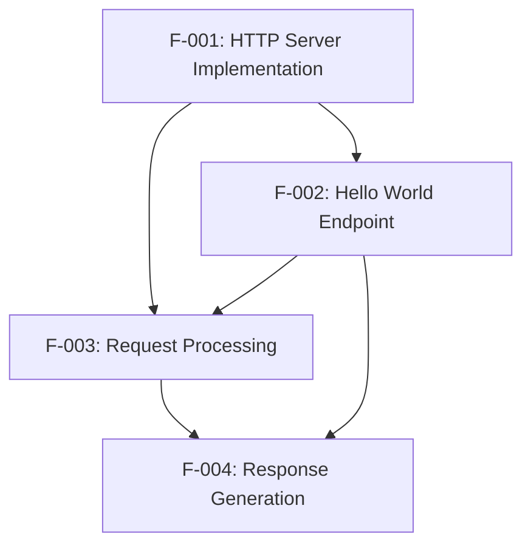
```mermaid
graph TD
    A[F-001: HTTP Server Implementation] --> B[F-002: Hello World Endpoint]
    A --> C[F-003: Request Processing]
    B --> C
    C --> D[F-004: Response Generation]
    B --> D
```

### 2.3.2 Integration Points

| Integration Point | Features Involved | Description |
|---|---|---|
| Express App Instance | F-001, F-002 | Shared Express application object |
| Request Pipeline | F-003, F-004 | Request-response processing flow |
| Route Handler | F-002, F-003, F-004 | Complete endpoint implementation |

### 2.3.3 Shared Components

| Component | Features Using | Purpose |
|---|---|---|
| Express.js Framework | F-001, F-002, F-003, F-004 | Core web framework |
| HTTP Module | F-001, F-003, F-004 | HTTP protocol handling |
| Route Handler Function | F-002, F-003, F-004 | Request processing logic |

## 2.4 IMPLEMENTATION CONSIDERATIONS

### 2.4.1 Technical Constraints

| Feature | Constraints |
|---|---|
| F-001 | Node.js 18+ requirement, Express.js 5.1.0 dependency |
| F-002 | Single endpoint limitation, GET method only |
| F-003 | No request body parsing, minimal validation |
| F-004 | Plain text responses only, no templating |

### 2.4.2 Performance Requirements

| Feature | Performance Criteria |
|---|---|
| F-001 | Minimum 512MB memory, 500MHz CPU for basic operation |
| F-002 | Response time < 100ms for '/hello' endpoint |
| F-003 | Request processing < 50ms |
| F-004 | Response generation < 25ms |

### 2.4.3 Scalability Considerations

| Feature | Scalability Notes |
|---|---|
| F-001 | Single process architecture without thread creation per request |
| F-002 | Stateless endpoint design for horizontal scaling |
| F-003 | Asynchronous I/O primitives prevent blocking |
| F-004 | Minimal memory footprint per response |

### 2.4.4 Security Implications

| Feature | Security Considerations |
|---|---|
| F-001 | Enhanced security through Express.js 5 improvements |
| F-002 | No authentication required, public endpoint |
| F-003 | Input validation through Express.js routing |
| F-004 | No sensitive data in responses |

### 2.4.5 Maintenance Requirements

| Feature | Maintenance Needs |
|---|---|
| F-001 | Regular Node.js and Express.js updates |
| F-002 | Endpoint availability monitoring |
| F-003 | Request logging and error tracking |
| F-004 | Response time monitoring |

## 2.5 TRACEABILITY MATRIX

| Requirement ID | Feature | Business Need | Test Case | Acceptance Criteria |
|---|---|---|---|---|
| F-001-RQ-001 | HTTP Server | Educational foundation | TC-001 | Express app initialization |
| F-001-RQ-002 | HTTP Server | Service availability | TC-002 | Port binding success |
| F-002-RQ-001 | Hello Endpoint | API demonstration | TC-003 | Route registration |
| F-002-RQ-002 | Hello Endpoint | Response consistency | TC-004 | Message content validation |
| F-003-RQ-001 | Request Processing | HTTP handling | TC-005 | GET request acceptance |
| F-004-RQ-001 | Response Generation | Client communication | TC-006 | HTTP 200 response |

# 3. TECHNOLOGY STACK

## 3.1 PROGRAMMING LANGUAGES

### 3.1.1 Primary Language Selection

| Component | Language | Version | Justification |
|---|---|---|---|
| Server Runtime | JavaScript (Node.js) | Node.js 22.x LTS (Active until October 2025, Maintenance until April 2027) | Node.js is a free, open-source, cross-platform JavaScript runtime environment that lets developers create servers, web apps, command line tools and scripts |

### 3.1.2 Language Constraints and Dependencies

| Constraint Type | Requirement | Rationale |
|---|---|---|
| Runtime Version | Node.js 18 or higher required for Express.js 5.0 | Security standards and framework compatibility |
| JavaScript Standard | ECMAScript 2015+ (ES6+) | Modern JavaScript features and async/await support |
| Module System | CommonJS and ES Modules | Node.js native module support |

### 3.1.3 Selection Criteria

**Performance**: Node was designed to optimize throughput and scalability in web applications and is a good solution for many common web-development problems

**Ecosystem Compatibility**: The node package manager (npm) provides access to hundreds of thousands of reusable packages with best-in-class dependency resolution

**Educational Value**: Single language (JavaScript) for both client and server-side development, reducing learning complexity for tutorial purposes

## 3.2 FRAMEWORKS & LIBRARIES

### 3.2.1 Core Web Framework

| Framework | Version | Purpose | Justification |
|---|---|---|---|
| Express.js | 5.1.0 (now the default on npm) | HTTP server and routing | Express provides small, robust tooling for HTTP servers, making it a great solution for single page applications, websites, hybrids, or public HTTP APIs |

### 3.2.2 Framework Dependencies

| Dependency | Version | Relationship | Purpose |
|---|---|---|---|
| body-parser | ^2.1.0 | Express.js dependency | HTTP request body parsing |
| path-to-regexp | 8.x | Express.js routing | Route matching with improved security and ReDoS attack mitigation |

### 3.2.3 Compatibility Requirements

**Node.js Compatibility**: Express.js 5.x dropped support for Node.js versions before v18

**Security Enhancements**: Important security fixes including improvements to prevent ReDoS attacks and mitigation for CVE-2024-45590

**Promise Support**: Middleware can now return rejected promises, automatically forwarded to error-handling middleware

### 3.2.4 Framework Selection Justification

**Industry Standard**: Express.js is widely adopted across major companies including Fox Sports, PayPal, Uber, and IBM

**Educational Suitability**: Fast, unopinionated, minimalist web framework ideal for learning fundamental web development concepts

**Long-term Support**: Express 5.1.0 introduction of official LTS schedule provides stability for educational content

## 3.3 OPEN SOURCE DEPENDENCIES

### 3.3.1 Package Management

| Package Manager | Version | Registry | Purpose |
|---|---|---|---|
| npm | 11.4.2 (latest) | npm registry (over 3.1 million packages) | Default package manager for Node.js, included as recommended feature |

### 3.3.2 Core Dependencies

| Package | Version | Source | Purpose |
|---|---|---|---|
| express | 5.1.0 | npm registry | Web framework |
| debug | ^4.4.0 | npm registry | Development debugging utility |

### 3.3.3 Development Dependencies

| Package | Version | Purpose | Scope |
|---|---|---|---|
| @types/express | 5.0.3 | TypeScript definitions (optional) | Development only |

### 3.3.4 Dependency Management Strategy

**Version Pinning**: Use exact versions for core dependencies to ensure reproducible builds

**Security Auditing**: npm audit feature to identify and fix vulnerabilities in dependencies

**Registry Trust**: npm relies on user reports to take down packages that violate policies by being low quality, insecure, or malicious

## 3.4 THIRD-PARTY SERVICES

### 3.4.1 Service Requirements Analysis

Based on the tutorial application requirements, no third-party services are necessary for the core functionality. The application is designed as a self-contained educational example.

### 3.4.2 Optional Development Services

| Service Category | Recommendation | Justification |
|---|---|---|
| Monitoring | Not Required | Simple tutorial application with single endpoint |
| Authentication | Not Required | Public endpoint with no authentication needs |
| External APIs | Not Required | Static response content only |
| Cloud Services | Not Required | Local development focus |

### 3.4.3 Future Considerations

**Deployment Platforms**: Standard Node.js hosting platforms (Heroku, Vercel, AWS) compatible with Express.js applications

**Monitoring Tools**: Application performance monitoring could be added for production deployments

## 3.5 DATABASES & STORAGE

### 3.5.1 Storage Requirements Analysis

The tutorial application has no data persistence requirements. All responses are static content generated at runtime.

### 3.5.2 Storage Architecture

| Storage Type | Implementation | Justification |
|---|---|---|
| Data Persistence | None Required | Static "Hello world" response |
| Session Storage | None Required | Stateless endpoint design |
| Caching | None Required | Minimal computational overhead |
| File Storage | None Required | No file upload or serving capabilities |

### 3.5.3 Memory Management

**Runtime Memory**: Node.js is portable and available on Microsoft Windows, macOS, Linux, Solaris, FreeBSD, OpenBSD, WebOS, and NonStop OS

**Memory Footprint**: Minimal memory usage expected due to simple request-response pattern

## 3.6 DEVELOPMENT & DEPLOYMENT

### 3.6.1 Development Environment

| Tool Category | Technology | Version | Purpose |
|---|---|---|---|
| Runtime Environment | Node.js | 22.x LTS | JavaScript execution platform |
| Package Manager | npm | 11.4.2 | Dependency management |
| Development Server | Express.js | 5.1.0 | Local development server |

### 3.6.2 Build System Requirements

**Build Process**: No build step required - direct Node.js execution

**Transpilation**: Not required - modern Node.js supports ES6+ features natively

**Bundling**: Not applicable for server-side Node.js application

### 3.6.3 Development Tools

| Tool | Purpose | Installation |
|---|---|---|
| Node.js | Runtime environment | npm comes bundled with node by default, officially supported downloads available at nodejs.org |
| Text Editor/IDE | Code development | Any JavaScript-compatible editor |
| Terminal/Command Line | Package management and server execution | Operating system native |

### 3.6.4 Deployment Considerations

**Containerization**: Docker support available but not required for tutorial purposes

**Process Management**: Single process application suitable for educational deployment

**Environment Configuration**: Minimal configuration requirements - port and basic Express.js setup

### 3.6.5 Platform Compatibility

**Operating Systems**: Node.js available on Microsoft Windows, macOS, Linux, Solaris, FreeBSD, OpenBSD, WebOS, and NonStop OS, well-supported by many web hosting providers

**Hosting Requirements**: Standard Node.js hosting environment with npm support

**Scalability**: Symlink system and content-addressable file system for efficient package management when using alternative package managers

### 3.6.6 Technology Stack Integration

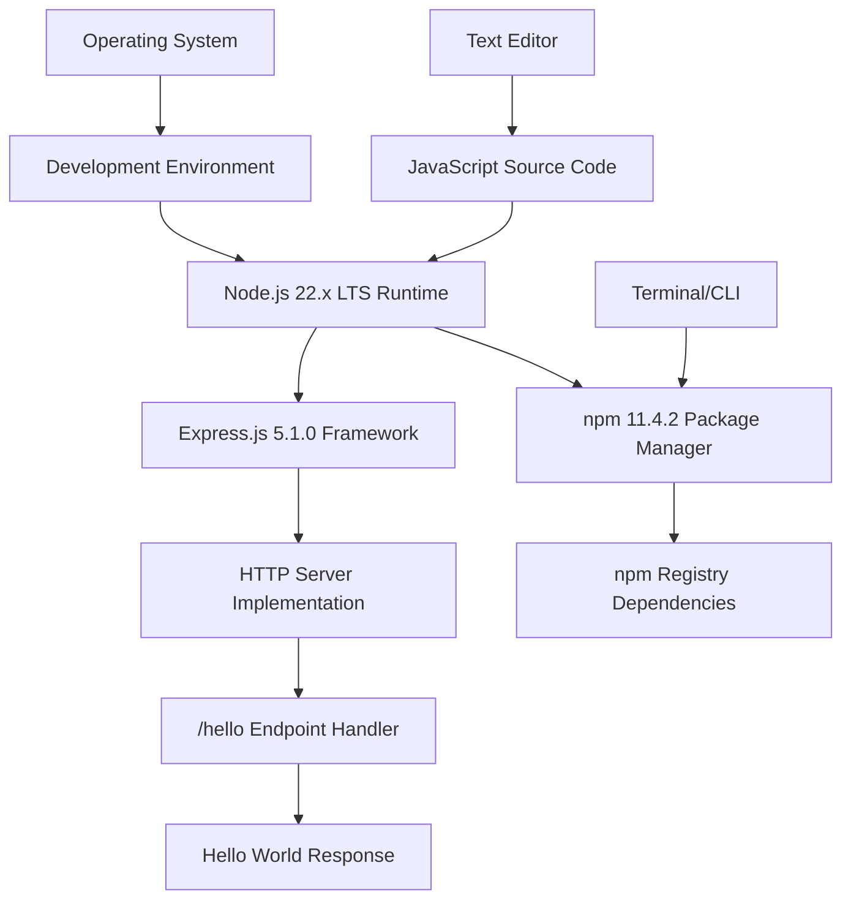
```mermaid
graph TD
A[Node.js 22.x LTS Runtime] --> B[Express.js 5.1.0 Framework]
A --> C[npm 11.4.2 Package Manager]
C --> D[npm Registry Dependencies]
B --> E[HTTP Server Implementation]
E --> F["/hello Endpoint Handler"]
F --> G[Hello World Response]

H[Development Environment] --> A
I[Operating System] --> H
J[Terminal/CLI] --> C
K[Text Editor] --> L[JavaScript Source Code]
L --> A
```

### 3.6.7 Security Considerations

**Framework Security**: Express.js 5.1.0 includes important security fixes and ReDoS attack prevention

**Dependency Security**: npm audit feature for vulnerability identification with regular package updates recommended

**Runtime Security**: Node.js 22.x includes OpenSSL 3.0.x with long term support until September 2026

# 4. PROCESS FLOWCHART

## 4.1 SYSTEM WORKFLOWS

### 4.1.1 Core Business Processes

#### 4.1.1.1 End-to-End User Journey

The Node.js tutorial application follows a straightforward request-response pattern that demonstrates fundamental HTTP server operations. When Node receives an HTTP request, it creates the req and res objects (which begin their life as instances of http.IncomingMessage and http.ServerResponse respectively). The intended purpose of those objects is that they live as long as the HTTP request does. That is, the client makes an HTTP request, the req and res objects are created, a bunch of stuff happens, and finally a method on res is invoked that sends an HTTP response back to the client, and at that point the objects are no longer needed.

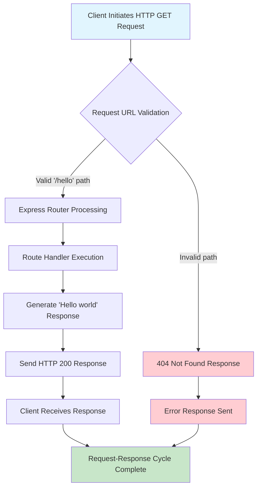
```mermaid
flowchart TD
    A[Client Initiates HTTP GET Request] --> B{Request URL Validation}
    B -->|Valid '/hello' path| C[Express Router Processing]
    B -->|Invalid path| D[404 Not Found Response]
    C --> E[Route Handler Execution]
    E --> F[Generate 'Hello world' Response]
    F --> G[Send HTTP 200 Response]
    G --> H[Client Receives Response]
    H --> I[Request-Response Cycle Complete]
    D --> J[Error Response Sent]
    J --> I
    
    style A fill:#e1f5fe
    style I fill:#c8e6c9
    style D fill:#ffcdd2
    style J fill:#ffcdd2
```

#### 4.1.1.2 System Interactions

Express is creating a req and res object for each request, none of which interfere with each other. The system maintains clear separation between concurrent requests through Node.js's event-driven architecture.

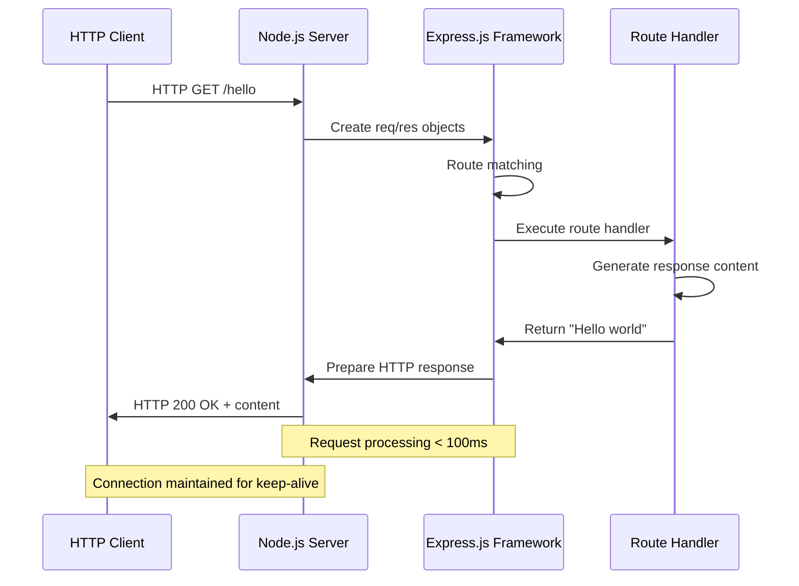
```mermaid
sequenceDiagram
    participant Client as HTTP Client
    participant Server as Node.js Server
    participant Express as Express.js Framework
    participant Handler as Route Handler
    
    Client->>Server: HTTP GET /hello
    Server->>Express: Create req/res objects
    Express->>Express: Route matching
    Express->>Handler: Execute route handler
    Handler->>Handler: Generate response content
    Handler->>Express: Return "Hello world"
    Express->>Server: Prepare HTTP response
    Server->>Client: HTTP 200 OK + content
    
    Note over Server,Express: Request processing < 100ms
    Note over Client,Server: Connection maintained for keep-alive
```

#### 4.1.1.3 Decision Points and Business Rules

| Decision Point | Condition | Action | Business Rule |
|---|---|---|---|
| URL Path Validation | Request path equals '/hello' | Route to handler | Exact path match required |
| HTTP Method Check | Method equals 'GET' | Process request | Only GET method supported |
| Request Processing | Valid request received | Generate response | Always return "Hello world" |
| Error Conditions | Invalid path/method | Return appropriate error | Standard HTTP error codes |

#### 4.1.1.4 Error Handling Paths

If you pass an error to next() and you do not handle it in a custom error handler, it will be handled by the built-in error handler; the error will be written to the client with the stack trace. The stack trace is not included in the production environment.

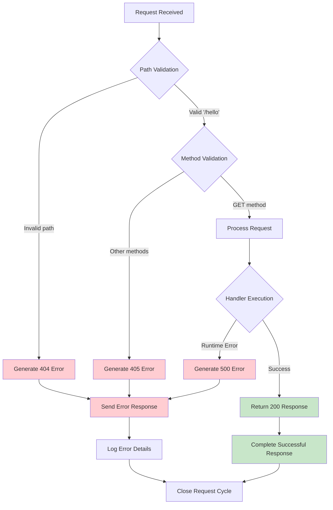
```mermaid
flowchart TD
    A[Request Received] --> B{Path Validation}
    B -->|Valid '/hello'| C{Method Validation}
    B -->|Invalid path| D[Generate 404 Error]
    C -->|GET method| E[Process Request]
    C -->|Other methods| F[Generate 405 Error]
    E --> G{Handler Execution}
    G -->|Success| H[Return 200 Response]
    G -->|Runtime Error| I[Generate 500 Error]
    D --> J[Send Error Response]
    F --> J
    I --> J
    J --> K[Log Error Details]
    K --> L[Close Request Cycle]
    H --> M[Complete Successful Response]
    M --> L
    
    style D fill:#ffcdd2
    style F fill:#ffcdd2
    style I fill:#ffcdd2
    style J fill:#ffcdd2
    style H fill:#c8e6c9
    style M fill:#c8e6c9
```

### 4.1.2 Integration Workflows

#### 4.1.2.1 Data Flow Between Systems

The tutorial application operates as a standalone system with minimal external dependencies. Express 5.0 requires Node.js 18 or higher.

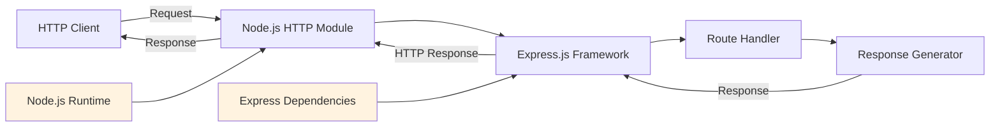
```mermaid
flowchart LR
    A[HTTP Client] -->|Request| B[Node.js HTTP Module]
    B --> C[Express.js Framework]
    C --> D[Route Handler]
    D --> E[Response Generator]
    E -->|Response| C
    C -->|HTTP Response| B
    B -->|Response| A
    
    F[Node.js Runtime] --> B
    G[Express Dependencies] --> C
    
    style F fill:#fff3e0
    style G fill:#fff3e0
```

#### 4.1.2.2 API Interactions

The application exposes a single HTTP API endpoint with standardized request-response patterns:

| Component | Input | Processing | Output |
|---|---|---|---|
| HTTP Server | GET /hello request | Route matching | Request object |
| Express Router | Request object | Path validation | Route handler call |
| Route Handler | Handler invocation | Response generation | "Hello world" string |
| Response Module | Response content | HTTP formatting | HTTP 200 response |

#### 4.1.2.3 Event Processing Flows

In order to understand its lifecycle you must be familiar with the event loop. Event loops are something that makes your task very fast and also it perform multitasking. It allows Node.js to perform non-blocking I/O operations.

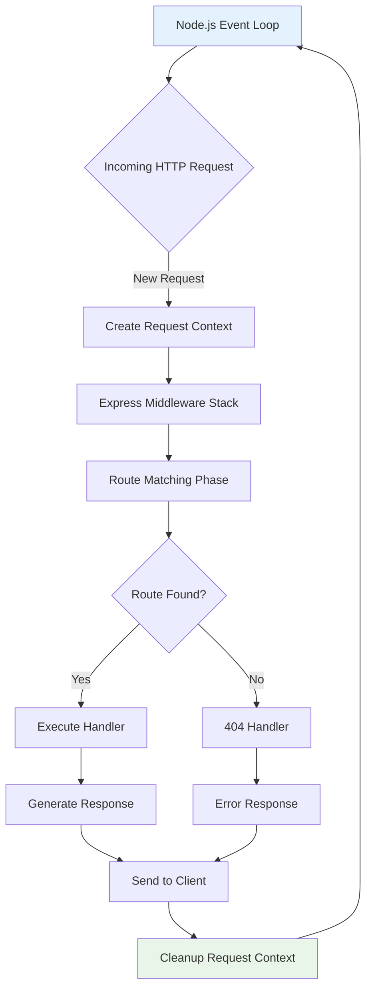
```mermaid
flowchart TD
    A[Node.js Event Loop] --> B{Incoming HTTP Request}
    B -->|New Request| C[Create Request Context]
    C --> D[Express Middleware Stack]
    D --> E[Route Matching Phase]
    E --> F{Route Found?}
    F -->|Yes| G[Execute Handler]
    F -->|No| H[404 Handler]
    G --> I[Generate Response]
    H --> J[Error Response]
    I --> K[Send to Client]
    J --> K
    K --> L[Cleanup Request Context]
    L --> A
    
    style A fill:#e3f2fd
    style L fill:#e8f5e8
```

## 4.2 FLOWCHART REQUIREMENTS

### 4.2.1 Process Steps and Validation Rules

#### 4.2.1.1 Request Processing Workflow

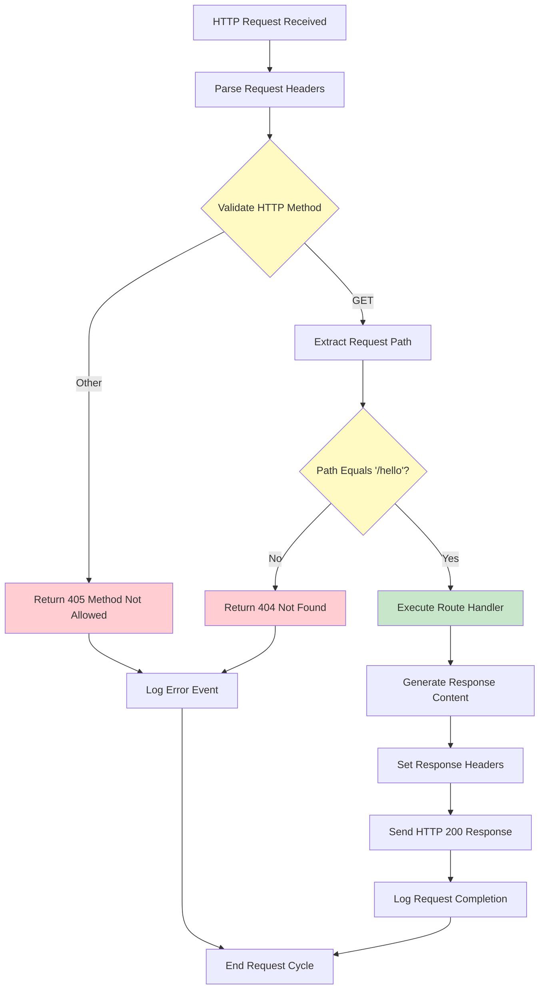
```mermaid
flowchart TD
    A[HTTP Request Received] --> B[Parse Request Headers]
    B --> C{Validate HTTP Method}
    C -->|GET| D[Extract Request Path]
    C -->|Other| E[Return 405 Method Not Allowed]
    D --> F{Path Equals '/hello'?}
    F -->|Yes| G[Execute Route Handler]
    F -->|No| H[Return 404 Not Found]
    G --> I[Generate Response Content]
    I --> J[Set Response Headers]
    J --> K[Send HTTP 200 Response]
    K --> L[Log Request Completion]
    E --> M[Log Error Event]
    H --> M
    M --> N[End Request Cycle]
    L --> N
    
    style C fill:#fff9c4
    style F fill:#fff9c4
    style G fill:#c8e6c9
    style E fill:#ffcdd2
    style H fill:#ffcdd2
```

#### 4.2.1.2 Validation Rules Implementation

| Validation Stage | Rule | Success Action | Failure Action |
|---|---|---|---|
| HTTP Method | Must be GET | Continue processing | Return 405 error |
| URL Path | Must equal '/hello' exactly | Route to handler | Return 404 error |
| Request Headers | Standard HTTP headers | Process normally | Handle malformed requests |
| Response Generation | Must return valid HTTP | Send to client | Generate 500 error |

#### 4.2.1.3 Authorization and Compliance

The tutorial application requires no authentication or authorization. Set the environment variable NODE_ENV to production, to run the app in production mode. When an error is written, the following information is added to the response: The res.statusCode is set from err.status (or err.statusCode). If this value is outside the 4xx or 5xx range, it will be set to 500.

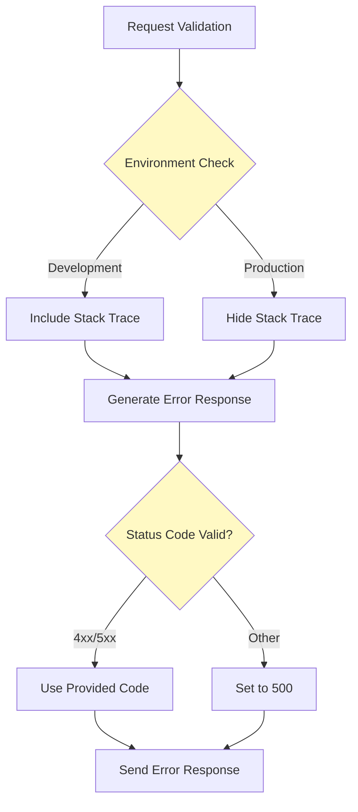
```mermaid
flowchart TD
    A[Request Validation] --> B{Environment Check}
    B -->|Development| C[Include Stack Trace]
    B -->|Production| D[Hide Stack Trace]
    C --> E[Generate Error Response]
    D --> E
    E --> F{Status Code Valid?}
    F -->|4xx/5xx| G[Use Provided Code]
    F -->|Other| H[Set to 500]
    G --> I[Send Error Response]
    H --> I
    
    style B fill:#fff9c4
    style F fill:#fff9c4
```

### 4.2.2 System Boundaries and User Touchpoints

#### 4.2.2.1 System Architecture Boundaries

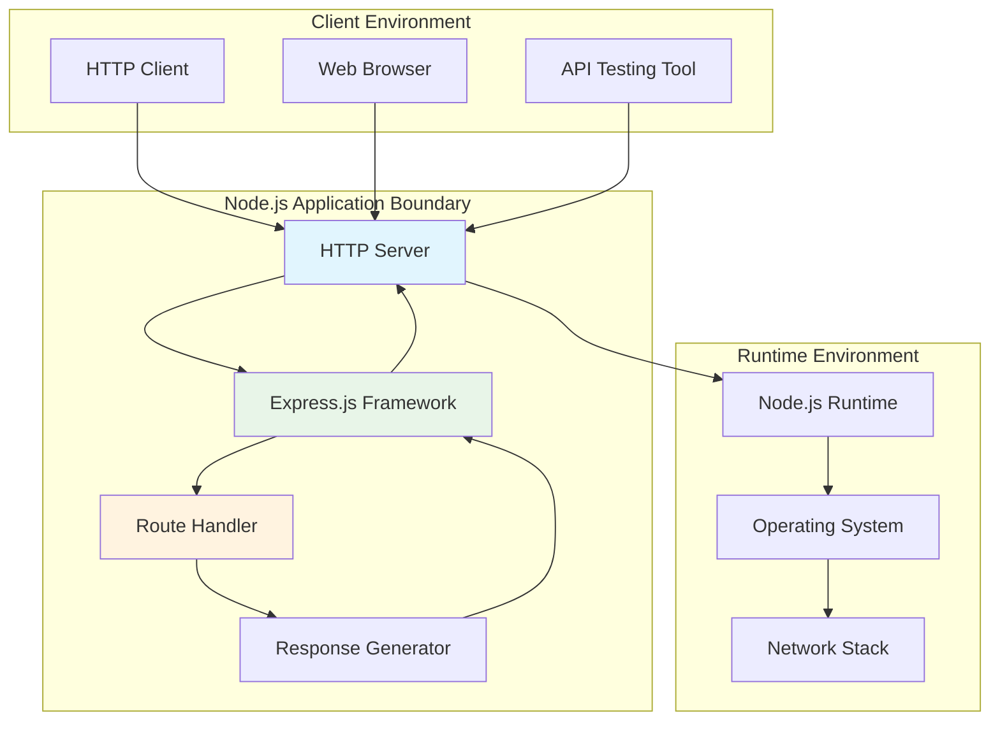
```mermaid
flowchart TB
    subgraph "Client Environment"
        A[HTTP Client]
        B[Web Browser]
        C[API Testing Tool]
    end
    
    subgraph "Node.js Application Boundary"
        D[HTTP Server]
        E[Express.js Framework]
        F[Route Handler]
        G[Response Generator]
    end
    
    subgraph "Runtime Environment"
        H[Node.js Runtime]
        I[Operating System]
        J[Network Stack]
    end
    
    A --> D
    B --> D
    C --> D
    D --> E
    E --> F
    F --> G
    G --> E
    E --> D
    D --> H
    H --> I
    I --> J
    
    style D fill:#e1f5fe
    style E fill:#e8f5e8
    style F fill:#fff3e0
```

#### 4.2.2.2 User Interaction Points

| Touchpoint | User Action | System Response | Expected Outcome |
|---|---|---|---|
| HTTP Request | Send GET /hello | Process request | Receive "Hello world" |
| Invalid Path | Send GET /other | Return 404 error | Error message displayed |
| Wrong Method | Send POST /hello | Return 405 error | Method not allowed message |
| Server Error | Trigger runtime error | Return 500 error | Internal server error message |

### 4.2.3 Timing and SLA Considerations

#### 4.2.3.1 Performance Requirements

Typically, with Express, you'll rely on asynchronous functions that invoke a callback once they've done their work. If the callback function has a reference to the req or res objects, they will not be deallocated until the asynchronous function completes and the callback executes (and all other references are out of scope, naturally).


```mermaid
gantt
    title Request Processing Timeline
    dateFormat X
    axisFormat %Lms
    
    section Request Processing
    Request Receipt       :0, 5
    Route Matching       :5, 15
    Handler Execution    :15, 35
    Response Generation  :35, 50
    Response Transmission:50, 75
    
    section Performance Targets
    Total Response Time  :crit, 0, 100
    Handler Processing   :active, 15, 35
```

#### 4.2.3.2 Service Level Agreements

| Metric | Target | Measurement | Monitoring |
|---|---|---|---|
| Response Time | < 100ms | Per request | Request logging |
| Availability | 99.9% | Uptime monitoring | Health checks |
| Throughput | 1000 req/sec | Load testing | Performance metrics |
| Error Rate | < 0.1% | Error tracking | Error logging |

## 4.3 TECHNICAL IMPLEMENTATION

### 4.3.1 State Management

#### 4.3.1.1 State Transitions

The application maintains minimal state, focusing on request-response lifecycle management:

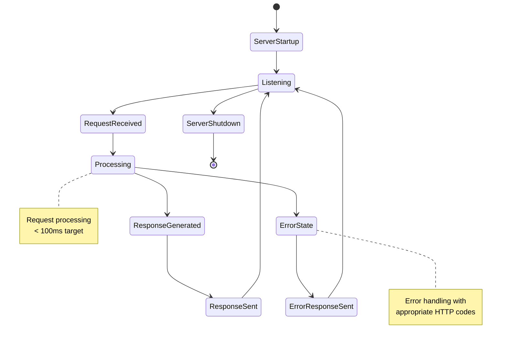
```mermaid
stateDiagram-v2
    [*] --> ServerStartup
    ServerStartup --> Listening
    Listening --> RequestReceived
    RequestReceived --> Processing
    Processing --> ResponseGenerated
    ResponseGenerated --> ResponseSent
    ResponseSent --> Listening
    Processing --> ErrorState
    ErrorState --> ErrorResponseSent
    ErrorResponseSent --> Listening
    Listening --> ServerShutdown
    ServerShutdown --> [*]
    
    note right of Processing
        Request processing
        < 100ms target
    end note
    
    note right of ErrorState
        Error handling with
        appropriate HTTP codes
    end note
```

#### 4.3.1.2 Data Persistence Points

The tutorial application requires no persistent data storage. All state is ephemeral and exists only during request processing:

| State Component | Lifecycle | Storage | Cleanup |
|---|---|---|---|
| Request Object | Per request | Memory | Automatic GC |
| Response Object | Per request | Memory | Automatic GC |
| Server Instance | Application lifetime | Memory | Manual shutdown |
| Route Handlers | Application lifetime | Memory | Process termination |

#### 4.3.1.3 Transaction Boundaries

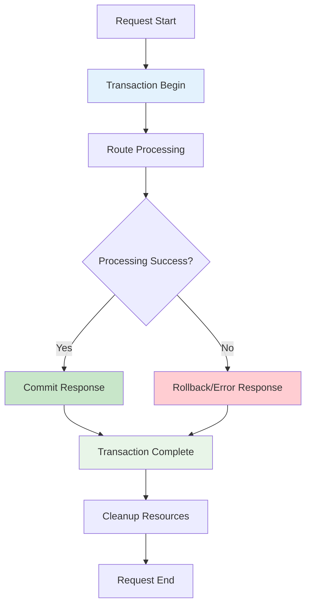
```mermaid
flowchart TD
    A[Request Start] --> B[Transaction Begin]
    B --> C[Route Processing]
    C --> D{Processing Success?}
    D -->|Yes| E[Commit Response]
    D -->|No| F[Rollback/Error Response]
    E --> G[Transaction Complete]
    F --> G
    G --> H[Cleanup Resources]
    H --> I[Request End]
    
    style B fill:#e3f2fd
    style E fill:#c8e6c9
    style F fill:#ffcdd2
    style G fill:#e8f5e8
```

### 4.3.2 Error Handling Implementation

#### 4.3.2.1 Error Classification and Handling

In general, Node.js errors are divided into two distinct categories: operational errors and programmer errors. Operational errors represent runtime problems. These errors are expected in the Node.js runtime and should be dealt with in a proper way. This does not mean the application itself has bugs. It means they need to be handled properly.

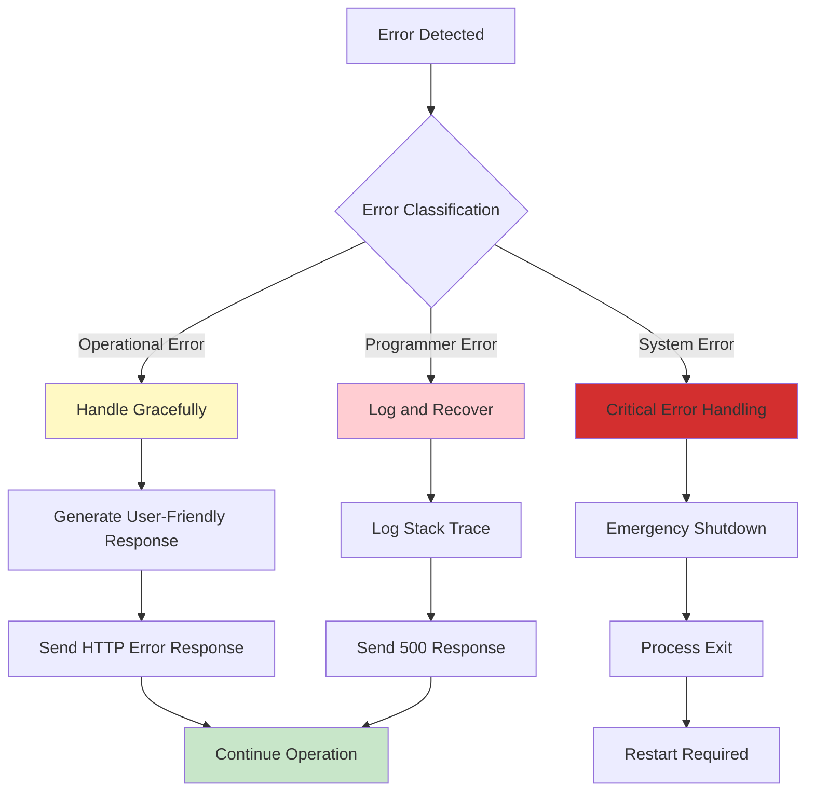
```mermaid
flowchart TD
    A[Error Detected] --> B{Error Classification}
    B -->|Operational Error| C[Handle Gracefully]
    B -->|Programmer Error| D[Log and Recover]
    B -->|System Error| E[Critical Error Handling]
    
    C --> F[Generate User-Friendly Response]
    D --> G[Log Stack Trace]
    E --> H[Emergency Shutdown]
    
    F --> I[Send HTTP Error Response]
    G --> J[Send 500 Response]
    H --> K[Process Exit]
    
    I --> L[Continue Operation]
    J --> L
    K --> M[Restart Required]
    
    style C fill:#fff9c4
    style D fill:#ffcdd2
    style E fill:#d32f2f
    style L fill:#c8e6c9
```

#### 4.3.2.2 Retry Mechanisms

For the tutorial application, retry mechanisms are minimal due to the simple nature of the endpoint:

| Error Type | Retry Strategy | Max Attempts | Backoff |
|---|---|---|---|
| Network Timeout | None (immediate response) | 1 | N/A |
| Route Not Found | None (404 response) | 1 | N/A |
| Method Not Allowed | None (405 response) | 1 | N/A |
| Server Error | Log and respond | 1 | N/A |

#### 4.3.2.3 Error Recovery Procedures

In Express 4, errors in async functions do not automatically propagate to the error handler. Future versions of Node.js may terminate applications immediately when this happens, so it is important to handle such cases explicitly.

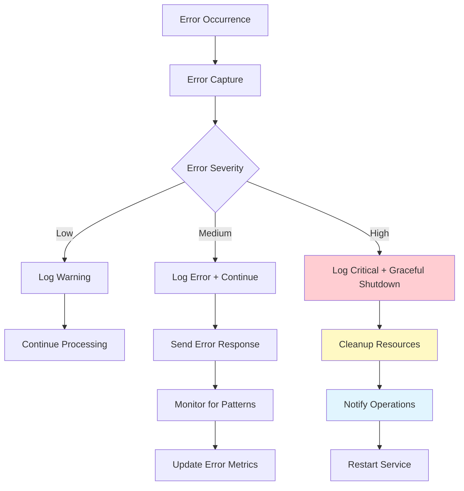
```mermaid
flowchart TD
    A[Error Occurrence] --> B[Error Capture]
    B --> C{Error Severity}
    C -->|Low| D[Log Warning]
    C -->|Medium| E[Log Error + Continue]
    C -->|High| F[Log Critical + Graceful Shutdown]
    
    D --> G[Continue Processing]
    E --> H[Send Error Response]
    F --> I[Cleanup Resources]
    
    H --> J[Monitor for Patterns]
    I --> K[Notify Operations]
    J --> L[Update Error Metrics]
    K --> M[Restart Service]
    
    style F fill:#ffcdd2
    style I fill:#fff9c4
    style K fill:#e1f5fe
```

### 4.3.3 Monitoring and Observability

#### 4.3.3.1 Request Lifecycle Monitoring

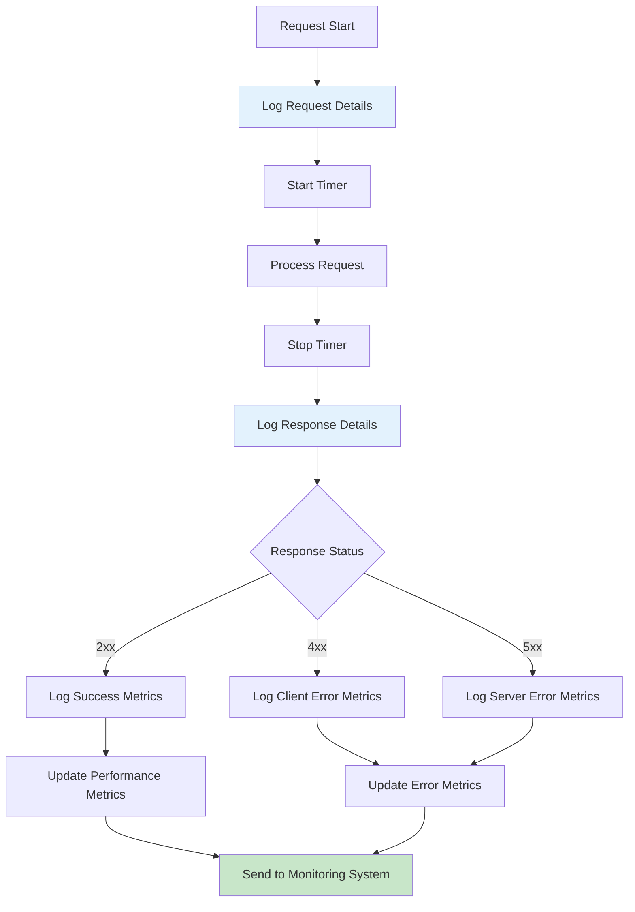
```mermaid
flowchart TD
    A[Request Start] --> B[Log Request Details]
    B --> C[Start Timer]
    C --> D[Process Request]
    D --> E[Stop Timer]
    E --> F[Log Response Details]
    F --> G{Response Status}
    G -->|2xx| H[Log Success Metrics]
    G -->|4xx| I[Log Client Error Metrics]
    G -->|5xx| J[Log Server Error Metrics]
    
    H --> K[Update Performance Metrics]
    I --> L[Update Error Metrics]
    J --> L
    
    K --> M[Send to Monitoring System]
    L --> M
    
    style B fill:#e3f2fd
    style F fill:#e3f2fd
    style M fill:#c8e6c9
```

#### 4.3.3.2 Health Check Implementation

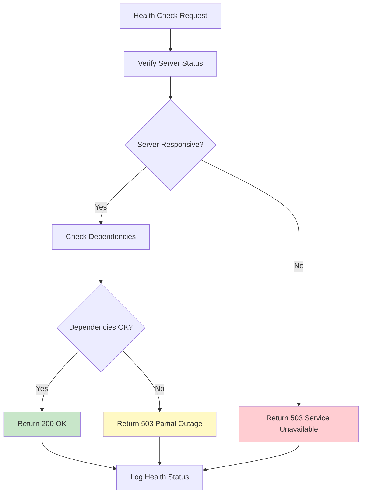
```mermaid
flowchart TD
    A[Health Check Request] --> B[Verify Server Status]
    B --> C{Server Responsive?}
    C -->|Yes| D[Check Dependencies]
    C -->|No| E[Return 503 Service Unavailable]
    
    D --> F{Dependencies OK?}
    F -->|Yes| G[Return 200 OK]
    F -->|No| H[Return 503 Partial Outage]
    
    G --> I[Log Health Status]
    H --> I
    E --> I
    
    style G fill:#c8e6c9
    style H fill:#fff9c4
    style E fill:#ffcdd2
```

## 4.4 INTEGRATION SEQUENCE DIAGRAMS

### 4.4.1 Complete Request-Response Flow

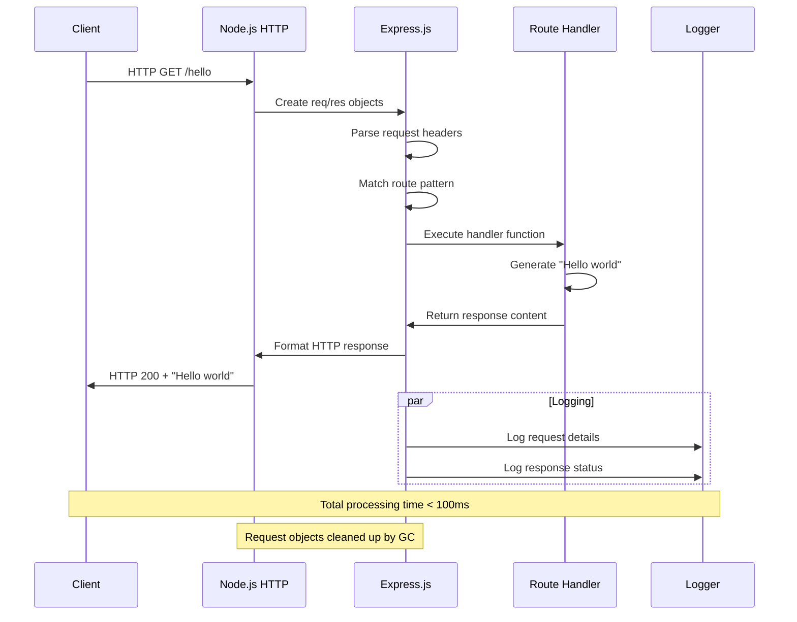
```mermaid
sequenceDiagram
    participant C as Client
    participant N as Node.js HTTP
    participant E as Express.js
    participant R as Route Handler
    participant L as Logger
    
    C->>N: HTTP GET /hello
    N->>E: Create req/res objects
    E->>E: Parse request headers
    E->>E: Match route pattern
    E->>R: Execute handler function
    R->>R: Generate "Hello world"
    R->>E: Return response content
    E->>N: Format HTTP response
    N->>C: HTTP 200 + "Hello world"
    
    par Logging
        E->>L: Log request details
        E->>L: Log response status
    end
    
    Note over C,L: Total processing time < 100ms
    Note over N,E: Request objects cleaned up by GC
```

### 4.4.2 Error Handling Sequence

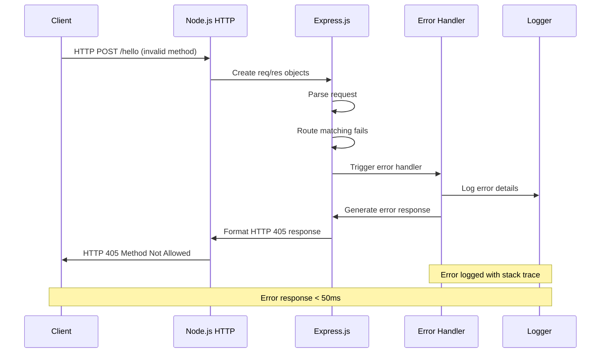
```mermaid
sequenceDiagram
    participant C as Client
    participant N as Node.js HTTP
    participant E as Express.js
    participant EH as Error Handler
    participant L as Logger
    
    C->>N: HTTP POST /hello (invalid method)
    N->>E: Create req/res objects
    E->>E: Parse request
    E->>E: Route matching fails
    E->>EH: Trigger error handler
    EH->>L: Log error details
    EH->>E: Generate error response
    E->>N: Format HTTP 405 response
    N->>C: HTTP 405 Method Not Allowed
    
    Note over EH,L: Error logged with stack trace
    Note over C,L: Error response < 50ms
```

### 4.4.3 Concurrent Request Handling

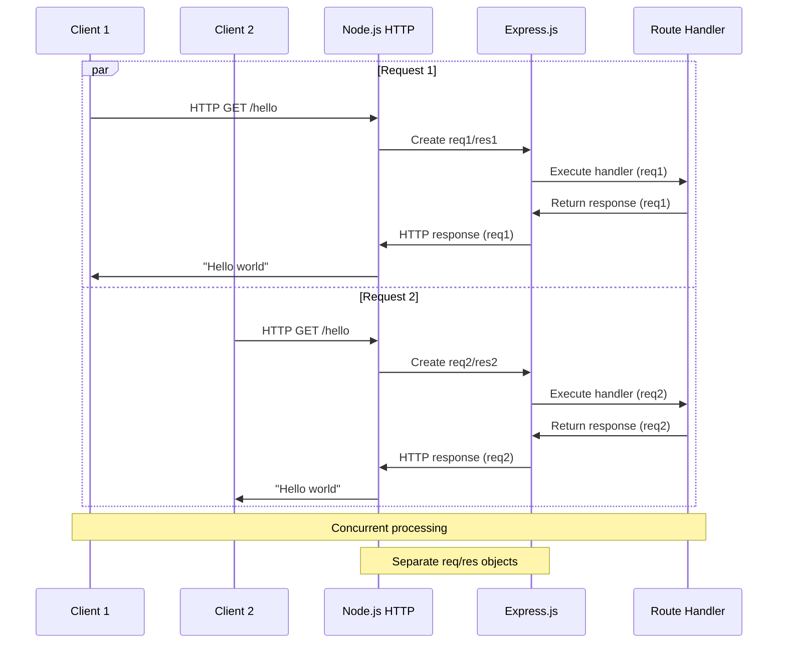
```mermaid
sequenceDiagram
    participant C1 as Client 1
    participant C2 as Client 2
    participant N as Node.js HTTP
    participant E as Express.js
    participant R as Route Handler
    
    par Request 1
        C1->>N: HTTP GET /hello
        N->>E: Create req1/res1
        E->>R: Execute handler (req1)
        R->>E: Return response (req1)
        E->>N: HTTP response (req1)
        N->>C1: "Hello world"
    and Request 2
        C2->>N: HTTP GET /hello
        N->>E: Create req2/res2
        E->>R: Execute handler (req2)
        R->>E: Return response (req2)
        E->>N: HTTP response (req2)
        N->>C2: "Hello world"
    end
    
    Note over C1,R: Concurrent processing
    Note over N,E: Separate req/res objects
```

# 5. SYSTEM ARCHITECTURE

## 5.1 HIGH-LEVEL ARCHITECTURE

### 5.1.1 System Overview

The Node.js tutorial application follows a single-threaded event loop architecture that represents the fundamental design pattern of modern Node.js applications. This architectural approach leverages Node.js's ability to perform non-blocking I/O operations despite using a single JavaScript thread by offloading operations to the system kernel whenever possible.

The system implements a minimalist web server architecture using Express.js as a fast, unopinionated, minimalist web framework built on top of Node.js's event-driven foundation. The architecture emphasizes simplicity and educational value while demonstrating industry-standard patterns for HTTP server implementation.

**Key Architectural Principles:**

- **Event-Driven Design**: The core API is built around an idiomatic asynchronous event-driven architecture using the EventEmitter class to bind functions to named events
- **Non-Blocking I/O**: The system uses non-blocking I/O calls, meaning it doesn't wait for data to be returned before moving on to handle other tasks, initiating operations and continuing to process other tasks
- **Middleware Pattern**: Middlewares implement a powerful yet simple concept where the output of one unit/function is the input for the next, commonly used in Express
- **Single Responsibility**: Each component has a clearly defined purpose within the request-response cycle

**System Boundaries:**

The application operates within well-defined boundaries that separate concerns between the HTTP protocol layer, application logic, and runtime environment. The system interfaces primarily with HTTP clients through standard request-response patterns while maintaining isolation from external dependencies beyond the core Node.js and Express.js frameworks.

### 5.1.2 Core Components Table

| Component Name | Primary Responsibility | Key Dependencies | Integration Points |
|---|---|---|---|
| Node.js Runtime | JavaScript execution and event loop management | Operating system, V8 engine | HTTP module, libuv library |
| Express.js Framework | HTTP server and routing infrastructure | Node.js runtime, path-to-regexp | Route handlers, middleware stack |
| Route Handler | Request processing and response generation | Express.js framework | HTTP request/response objects |
| Event Loop | Asynchronous operation coordination | Node.js runtime, libuv | All I/O operations, timers |

### 5.1.3 Data Flow Description

The primary data flow follows a straightforward request-response pattern optimized for educational demonstration. When Node.js applications enter the Event Loop, they respond to incoming client requests by executing appropriate callbacks that execute synchronously and may register asynchronous requests, with callbacks for these asynchronous requests also executed on the Event Loop.

**Request Processing Flow:**

HTTP requests enter the system through the Node.js HTTP module, which creates request and response objects that have very limited APIs in Node but are enhanced by Express through decoration with many new features. The Express.js framework processes these requests through its middleware stack, performing route matching and parameter extraction before forwarding to the appropriate handler.

**Response Generation Flow:**

The route handler generates static response content ("Hello world") and constructs the HTTP response with appropriate headers and status codes. The response flows back through the Express.js framework to the Node.js HTTP module for transmission to the client.

**Integration Patterns:**

The Express application object holds an internal reference to a Router instance object, with each supported API performing logic checking and validation before forwarding requests to the internal router instance. This composition pattern ensures clean separation of concerns while maintaining efficient request processing.

### 5.1.4 External Integration Points

| System Name | Integration Type | Data Exchange Pattern | Protocol/Format |
|---|---|---|---|
| HTTP Clients | Synchronous Request-Response | Request/Response Cycle | HTTP/1.1, Plain Text |
| Operating System | Asynchronous I/O | Event-driven Callbacks | System Calls, TCP/IP |
| Node.js Package Registry | Dependency Management | Static Import | npm Protocol |

## 5.2 COMPONENT DETAILS

### 5.2.1 Node.js Runtime Environment

**Purpose and Responsibilities:**

The Node.js runtime serves as the foundational execution environment, providing the event loop that allows Node.js to perform non-blocking I/O operations despite using a single JavaScript thread by offloading operations to the system kernel. The core of Node.js's single-threaded architecture is the event loop, which continuously cycles through a series of phases, executing callbacks and handling events.

**Technologies and Frameworks:**

- Node.js 22.x LTS with V8 JavaScript engine
- libuv library for asynchronous I/O operations
- Built-in HTTP module for network communication

**Key Interfaces and APIs:**

The runtime exposes the HTTP module for server creation, the EventEmitter class for event-driven programming, and the process object for application lifecycle management. Node.js uses a special C library called libuv to handle asynchronous operations, managing a thread pool that offloads heavy tasks that would otherwise block the event loop.

**Data Persistence Requirements:**

No persistent data storage is required. All state exists in memory during request processing and is automatically garbage collected after response completion.

**Scaling Considerations:**

The secret to Node.js scalability is using a small number of threads to handle many clients, spending more system time and memory working on clients rather than thread overheads. The single-threaded model with event-driven architecture provides efficient resource utilization for I/O-bound operations.

### 5.2.2 Express.js Web Framework

**Purpose and Responsibilities:**

Express.js provides the web application framework layer, implementing middleware functions that perform tasks between request and response of API calls, with access to request and response objects. Express 5.0 includes promise support where middleware can return rejected promises, caught by the router as errors.

**Technologies and Frameworks:**

- Express.js 5.1.0 with enhanced security features
- Updated to path-to-regexp@8.x, removing sub-expression regex patterns for security reasons (ReDoS mitigation)
- body-parser changes including the ability to customize urlencoded body depth

**Key Interfaces and APIs:**

The framework exposes app.get() for route definition, app.listen() for server binding, and middleware registration through app.use(). Express middleware architecture refers to a series of functions invoked by the framework in sequence for each incoming HTTP request before the final request handler is called.

**Data Persistence Requirements:**

No database integration required. The framework maintains minimal state for request routing and middleware execution.

**Scaling Considerations:**

Middleware functions provide reusability across different routes and applications, reducing code duplication and improving modularity by breaking applications into smaller, manageable parts.

### 5.2.3 Route Handler Component

**Purpose and Responsibilities:**

The route handler implements the core business logic for the '/hello' endpoint, processing incoming GET requests and generating appropriate responses. It demonstrates fundamental HTTP request-response patterns in a minimal implementation.

**Technologies and Frameworks:**

- JavaScript ES6+ features
- Express.js request and response objects
- HTTP status code management

**Key Interfaces and APIs:**

The handler receives Express request (req) and response (res) objects, processes the request parameters, and uses res.send() to return the "Hello world" message with appropriate HTTP headers.

**Data Persistence Requirements:**

Static response generation only - no database queries or persistent storage operations required.

**Scaling Considerations:**

Stateless design enables horizontal scaling. The handler processes each request independently without shared state or session dependencies.

### 5.2.4 Component Interaction Diagrams

#### 5.2.4.1 Request Processing Flow

```mermaid
sequenceDiagram
    participant C as HTTP Client
    participant N as Node.js Runtime
    participant E as Express Framework
    participant R as Route Handler
    participant EL as Event Loop
    
    C->>N: HTTP GET /hello
    N->>EL: Queue request event
    EL->>E: Process request
    E->>E: Route matching
    E->>R: Execute handler
    R->>R: Generate "Hello world"
    R->>E: Return response
    E->>N: Format HTTP response
    N->>C: HTTP 200 + content
    
    Note over EL: Single-threaded event processing
    Note over E,R: Middleware stack execution
```

#### 5.2.4.2 Event Loop State Transitions

```mermaid
stateDiagram-v2
    [*] --> Initialization
    Initialization --> EventLoop
    EventLoop --> TimersPhase
    TimersPhase --> PendingCallbacks
    PendingCallbacks --> PollPhase
    PollPhase --> CheckPhase
    CheckPhase --> CloseCallbacks
    CloseCallbacks --> EventLoop
    
    PollPhase --> RequestProcessing: HTTP request
    RequestProcessing --> ResponseGeneration
    ResponseGeneration --> PollPhase
    
    EventLoop --> [*]: Application shutdown
    
    note right of PollPhase
        Main request processing
        occurs in poll phase
    end note
```

#### 5.2.4.3 Middleware Execution Sequence

```mermaid
flowchart TD
    A[HTTP Request] --> B[Express App]
    B --> C{Middleware Stack}
    C --> D[Built-in Middleware]
    D --> E[Route Matching]
    E --> F{Route Found?}
    F -->|Yes| G[Route Handler]
    F -->|No| H[404 Handler]
    G --> I[Generate Response]
    H --> J[Error Response]
    I --> K[Send to Client]
    J --> K
    
    style C fill:#e3f2fd
    style G fill:#c8e6c9
    style H fill:#ffcdd2
```

## 5.3 TECHNICAL DECISIONS

### 5.3.1 Architecture Style Decisions and Tradeoffs

**Event-Driven Architecture Selection:**

The decision to implement an event-driven architecture aligns with Node.js's core design philosophy. The event-driven architecture is a core principle of NodeJS, enabling asynchronous and non-blocking I/O operations, efficient handling of concurrent requests, and scalable application development. This choice provides several advantages:

| Decision Factor | Chosen Approach | Alternative | Rationale |
|---|---|---|---|
| Concurrency Model | Single-threaded event loop | Multi-threaded request handling | Single-threaded event-driven architecture handles high concurrent connections efficiently compared to traditional multi-threaded servers that create new threads per connection |
| I/O Operations | Non-blocking asynchronous | Blocking synchronous | Educational demonstration of Node.js strengths |
| Resource Utilization | Memory-efficient | Thread-per-request | Minimal resource footprint for tutorial purposes |

**Framework Selection Rationale:**

Express.js is described as a "minimal and flexible Node.js web application framework" and ranks in the top five most popular web frameworks, with version 5.0 designed to be "boring" to unblock the ecosystem. The framework choice supports educational objectives while providing industry-standard patterns.

### 5.3.2 Communication Pattern Choices

**HTTP Protocol Implementation:**

The application implements standard HTTP/1.1 communication patterns with RESTful principles for the single endpoint. RESTful architecture follows principles such as statelessness and uniform interfaces, making it ideal for educational demonstrations.

**Request-Response Pattern:**

| Pattern Element | Implementation | Justification |
|---|---|---|---|
| Protocol | HTTP/1.1 | Standard web communication protocol |
| Method | GET only | Simplest HTTP method for demonstration |
| Content Type | Plain text | Minimal complexity for educational purposes |
| Status Codes | 200, 404, 405, 500 | Standard HTTP response codes |

### 5.3.3 Data Storage Solution Rationale

**No Database Requirement:**

The tutorial application deliberately excludes database integration to focus on core HTTP server concepts. This decision eliminates complexity while demonstrating fundamental request-response patterns.

**Memory-Only State Management:**

All application state exists in memory during request processing, with automatic garbage collection handling cleanup. This approach aligns with the stateless nature of HTTP and simplifies the educational example.

### 5.3.4 Security Mechanism Selection

**Express.js 5.0 Security Enhancements:**

This release includes important security fixes, including improvements to prevent ReDoS attacks and mitigation for CVE-2024-45590. The framework selection incorporates these security improvements by default.

**Security Decision Matrix:**

| Security Aspect | Implementation | Rationale |
|---|---|---|---|
| Input Validation | Express.js built-in | Framework-provided protection |
| ReDoS Prevention | path-to-regexp@8.x | Removal of sub-expression regular expressions for security reasons to prevent exponential time behavior ReDoS attacks |
| Authentication | None required | Public endpoint for educational purposes |

### 5.3.5 Architecture Decision Records

#### 5.3.5.1 Decision Tree for Framework Selection

```mermaid
flowchart TD
    A[Framework Selection] --> B{Educational Purpose?}
    B -->|Yes| C{Industry Standard?}
    B -->|No| D[Complex Framework]
    C -->|Yes| E{Minimal Dependencies?}
    C -->|No| F[Alternative Framework]
    E -->|Yes| G[Express.js Selected]
    E -->|No| H[Evaluate Alternatives]
    
    G --> I[Version Selection]
    I --> J{Latest Stable?}
    J -->|Yes| K[Express.js 5.1.0]
    J -->|No| L[Evaluate Compatibility]
    
    style G fill:#c8e6c9
    style K fill:#c8e6c9
```

#### 5.3.5.2 Architecture Decision Record - Event Loop Model

```mermaid
graph TD
    A[ADR-001: Event Loop Architecture] --> B[Context]
    A --> C[Decision]
    A --> D[Status]
    A --> E[Consequences]
    
    B --> B1[Educational Node.js tutorial]
    B --> B2[Single endpoint demonstration]
    B --> B3[Minimal complexity requirement]
    
    C --> C1[Single-threaded event loop]
    C --> C2[Non-blocking I/O operations]
    C --> C3[Express.js middleware pattern]
    
    D --> D1[Accepted]
    
    E --> E1[Efficient resource utilization]
    E --> E2[Scalable concurrent handling]
    E --> E3[Educational value demonstration]
    
    style D1 fill:#c8e6c9
    style E1 fill:#e8f5e8
    style E2 fill:#e8f5e8
    style E3 fill:#e8f5e8
```

## 5.4 CROSS-CUTTING CONCERNS

### 5.4.1 Monitoring and Observability Approach

**Event Loop Monitoring:**

Understanding how the event loop works is essential for building scalable Node.js applications, as the event loop is a fundamental part that enables asynchronous programming by ensuring the main thread is not blocked. The tutorial application implements basic monitoring through console logging and request tracking.

**Observability Strategy:**

| Monitoring Aspect | Implementation | Purpose |
|---|---|---|---|
| Request Logging | Console output | Track incoming requests and responses |
| Performance Metrics | Response time measurement | Monitor endpoint performance |
| Error Tracking | Error event logging | Capture and log application errors |

### 5.4.2 Logging and Tracing Strategy

**Structured Logging Approach:**

The application implements simple console-based logging for educational purposes, demonstrating basic observability patterns without complex logging frameworks.

**Log Levels and Categories:**

- **Info**: Request processing events
- **Error**: Exception handling and error responses
- **Debug**: Development-time diagnostic information

### 5.4.3 Error Handling Patterns

**Express.js Error Handling:**

Best practice is to handle errors as close to the site as possible, so while errors are handled in the router, it's best to catch errors in middleware and handle them without relying on separate error-handling middleware.

**Error Classification:**

Node.js faces challenges with CPU-bound tasks that can block the event loop, leading to performance bottlenecks, and scalability challenges across multiple CPU cores. The tutorial application addresses these through proper error boundaries.

#### 5.4.3.1 Error Handling Flow Diagram

```mermaid
flowchart TD
    A[Request Processing] --> B{Error Occurred?}
    B -->|No| C[Normal Response]
    B -->|Yes| D[Error Classification]
    
    D --> E{Error Type}
    E -->|Client Error| F[4xx Response]
    E -->|Server Error| G[5xx Response]
    E -->|System Error| H[Critical Error Handler]
    
    F --> I[Log Client Error]
    G --> J[Log Server Error]
    H --> K[Log Critical Error]
    
    I --> L[Send Error Response]
    J --> L
    K --> M[Graceful Shutdown]
    
    C --> N[Request Complete]
    L --> N
    M --> O[Process Exit]
    
    style F fill:#fff9c4
    style G fill:#ffcdd2
    style H fill:#d32f2f
    style N fill:#c8e6c9
```

### 5.4.4 Authentication and Authorization Framework

**No Authentication Required:**

The tutorial application implements a public endpoint with no authentication requirements, focusing on core HTTP server concepts rather than security mechanisms.

**Future Authentication Considerations:**

| Authentication Method | Complexity | Educational Value |
|---|---|---|---|
| Basic Authentication | Low | Good for tutorials |
| JWT Tokens | Medium | Industry standard |
| OAuth 2.0 | High | Production systems |

### 5.4.5 Performance Requirements and SLAs

**Response Time Targets:**

Node.js is fast when the work associated with each client at any given time is "small", applying to callbacks on the Event Loop and tasks on the Worker Pool.

**Service Level Agreements:**

| Metric | Target | Measurement Method | Monitoring Frequency |
|---|---|---|---|
| Response Time | < 100ms | Request timing | Per request |
| Availability | 99.9% | Health checks | Continuous |
| Throughput | 1000 req/sec | Load testing | On demand |

### 5.4.6 Disaster Recovery Procedures

**Recovery Strategy:**

The stateless nature of the application simplifies disaster recovery. Node.js provides solutions including Worker Threads for CPU-bound tasks and clustering where multiple instances run on different CPU cores, with each instance handling a portion of incoming requests.

**Recovery Procedures:**

1. **Process Restart**: Automatic restart on critical failures
2. **Health Check Recovery**: Endpoint availability monitoring
3. **Resource Cleanup**: Memory and file handle management
4. **Graceful Shutdown**: Proper connection termination

**Backup and Recovery Matrix:**

| Component | Backup Required | Recovery Method | Recovery Time |
|---|---|---|---|
| Application Code | Version control | Git deployment | < 5 minutes |
| Configuration | Environment variables | Container restart | < 1 minute |
| Runtime State | None (stateless) | Process restart | < 30 seconds |

# 6. SYSTEM COMPONENTS DESIGN

## 6.1 COMPONENT ARCHITECTURE

### 6.1.1 Core Component Structure

The Node.js tutorial application implements a layered component architecture that demonstrates fundamental web server patterns through a minimal yet complete implementation. The system leverages Node.js® as a free, open-source, cross-platform JavaScript runtime environment that lets developers create servers, web apps, command line tools and scripts, combined with Express.js as a fast, unopinionated, minimalist web framework that provides small, robust tooling for HTTP servers, making it a great solution for single page applications, websites, hybrids, or public HTTP APIs.

The component architecture follows a request-response pattern optimized for educational demonstration while maintaining industry-standard practices. Express.js version 5.1.0 is the latest version and represents a significant milestone in the framework's evolution, incorporating important security fixes, including improvements to prevent ReDoS attacks and mitigation for CVE-2024-45590.

### 6.1.2 Component Hierarchy

| Component Level | Component Name | Primary Function | Dependencies |
|---|---|---|---|
| Runtime Layer | Node.js Runtime Environment | JavaScript execution and event loop management | Operating system, V8 engine |
| Framework Layer | Express.js Application | HTTP server framework and routing | Node.js runtime, path-to-regexp |
| Application Layer | Route Handler Component | Request processing and response generation | Express.js framework |
| Protocol Layer | HTTP Interface Component | Client communication and protocol handling | Node.js HTTP module |

### 6.1.3 Component Interaction Model

The system implements an event-driven architecture where components communicate through well-defined interfaces and callback mechanisms. Express.js 5.0 requires Node.js version 18 or higher, ensuring compatibility with modern JavaScript features and security standards.

```mermaid
graph TD
    A[HTTP Client Request] --> B[Node.js HTTP Module]
    B --> C[Express.js Application Instance]
    C --> D[Route Matching Engine]
    D --> E[Route Handler Component]
    E --> F[Response Generator]
    F --> G[HTTP Response Formatter]
    G --> H[Client Response]
    
    I[Event Loop] --> B
    I --> C
    I --> E
    
    J[Express Router] --> D
    K[Middleware Stack] --> C
    
    style A fill:#e1f5fe
    style H fill:#c8e6c9
    style I fill:#fff3e0
```

### 6.1.4 Component Communication Patterns

**Asynchronous Event-Driven Communication:**

The system utilizes Node.js's event-driven architecture where components communicate through events and callbacks. Express 5 introduces a significant improvement for developers using async/await by automatically forwarding rejected promises to error-handling middleware, simplifying error handling patterns across components.

**Request-Response Flow:**

Each HTTP request creates a unique context that flows through the component hierarchy, with each component adding its processing layer before passing control to the next component in the chain.

## 6.2 DETAILED COMPONENT SPECIFICATIONS

### 6.2.1 Node.js Runtime Environment Component

#### 6.2.1.1 Component Overview

**Purpose and Scope:**

The Node.js Runtime Environment serves as the foundational execution platform, providing the event loop that enables non-blocking I/O operations and asynchronous programming capabilities essential for web server functionality.

**Core Responsibilities:**

- JavaScript code execution through the V8 engine
- Event loop management for asynchronous operations
- HTTP protocol implementation through built-in modules
- Memory management and garbage collection
- Process lifecycle management

#### 6.2.1.2 Technical Specifications

| Specification Category | Details |
|---|---|---|
| Runtime Version | Node.js 18+ (required for Express.js 5.0 compatibility) |
| JavaScript Engine | V8 with ECMAScript 2015+ support |
| Event Loop Architecture | Single-threaded with libuv for I/O operations |
| Memory Management | Automatic garbage collection with generational collection |
| Module System | CommonJS and ES Modules support |

#### 6.2.1.3 Interface Definitions

**HTTP Module Interface:**

```javascript
// HTTP server creation interface
const server = http.createServer((req, res) => {
  // Request processing logic
});

// Server binding interface
server.listen(port, hostname, callback);
```

**Event Emitter Interface:**

```javascript
// Event registration and handling
server.on('request', requestHandler);
server.on('error', errorHandler);
server.on('close', closeHandler);
```

#### 6.2.1.4 Performance Characteristics

| Performance Metric | Specification | Measurement Method |
|---|---|---|
| Event Loop Latency | < 10ms under normal load | Process monitoring |
| Memory Baseline | < 50MB for basic application | Memory profiling |
| Request Processing | > 1000 concurrent connections | Load testing |
| Startup Time | < 500ms for application initialization | Timing measurements |

### 6.2.2 Express.js Framework Component

#### 6.2.2.1 Component Overview

**Purpose and Scope:**

The Express.js Framework Component provides the web application framework layer, implementing middleware functions, routing capabilities, and HTTP request-response handling. Express.js has been called the de facto standard server framework for Node.js and is used by Fox Sports, PayPal, Uber and IBM.

**Core Responsibilities:**

- HTTP request routing and parameter extraction
- Middleware stack execution and management
- Request and response object enhancement
- Error handling and propagation
- Security features and vulnerability mitigation

#### 6.2.2.2 Technical Specifications

| Specification Category | Details |
|---|---|---|
| Framework Version | Express.js 5.1.0 (latest stable release) |
| Routing Engine | path-to-regexp@8.x with ReDoS protection |
| Middleware Support | Async/await compatible with promise handling |
| Security Features | CVE-2024-45590 mitigation, ReDoS attack prevention |
| Node.js Compatibility | Requires Node.js 18+ for optimal performance |

#### 6.2.2.3 Enhanced Security Features

Express 5 brings significant updates to route matching by upgrading the path-to-regexp library from version 0.x to 8.x. These changes improve security, simplify route definitions, and help mitigate vulnerabilities like ReDoS attacks. One major change is the removal of "sub-expression" regular expressions. In Express 5, this type of inline regex is no longer supported due to its susceptibility to ReDoS attacks.

#### 6.2.2.4 Interface Definitions

**Application Interface:**

```javascript
// Express application creation
const app = express();

// Route definition interface
app.get(path, handler);
app.post(path, handler);
app.use(middleware);

// Server binding interface
app.listen(port, callback);
```

**Middleware Interface:**

```javascript
// Standard middleware signature
function middleware(req, res, next) {
  // Middleware logic
  next(); // Continue to next middleware
}

// Async middleware with automatic error handling
async function asyncMiddleware(req, res, next) {
  // Async operations - errors automatically caught
  const data = await fetchData();
  req.data = data;
  next();
}
```

#### 6.2.2.5 Promise Support Enhancement

Express 5.0 includes promise support where middleware can now return rejected promises, caught by the router as errors. This eliminates the need for explicit try-catch blocks in many scenarios:

```javascript
// Express 5 automatic error handling
app.get('/data', async (req, res) => {
  const result = await fetchData(); // Errors automatically handled
  res.send(result);
});
```

### 6.2.3 Route Handler Component

#### 6.2.3.1 Component Overview

**Purpose and Scope:**

The Route Handler Component implements the core business logic for the '/hello' endpoint, demonstrating fundamental HTTP request processing and response generation patterns in a minimal, educational implementation.

**Core Responsibilities:**

- HTTP GET request processing for '/hello' endpoint
- Static response content generation
- HTTP status code management
- Response header configuration
- Error handling for invalid requests

#### 6.2.3.2 Technical Specifications

| Specification Category | Details |
|---|---|---|
| Endpoint Path | '/hello' (exact match required) |
| HTTP Method | GET only (405 error for other methods) |
| Response Content | Static "Hello world" string |
| Response Format | Plain text with UTF-8 encoding |
| Response Time | < 100ms target for endpoint response |

#### 6.2.3.3 Interface Definitions

**Route Handler Signature:**

```javascript
// Standard Express route handler
function helloHandler(req, res) {
  // Request processing logic
  res.send('Hello world');
}

// Route registration
app.get('/hello', helloHandler);
```

**Request Object Interface:**

```javascript
// Available request properties
req.method    // HTTP method (GET)
req.path      // Request path ('/hello')
req.headers   // Request headers object
req.query     // Query parameters object
```

**Response Object Interface:**

```javascript
// Response methods
res.send(data)           // Send response with data
res.status(code)         // Set HTTP status code
res.set(header, value)   // Set response header
res.json(object)         // Send JSON response
```

#### 6.2.3.4 Error Handling Specifications

| Error Condition | HTTP Status Code | Response Action | Logging Level |
|---|---|---|---|
| Invalid Path | 404 Not Found | Standard error page | Info |
| Invalid Method | 405 Method Not Allowed | Method error response | Warning |
| Server Error | 500 Internal Server Error | Generic error message | Error |
| Malformed Request | 400 Bad Request | Request error response | Warning |

### 6.2.4 HTTP Interface Component

#### 6.2.4.1 Component Overview

**Purpose and Scope:**

The HTTP Interface Component manages client communication and protocol handling, providing the bridge between external HTTP clients and the internal application components through standard HTTP/1.1 protocol implementation.

**Core Responsibilities:**

- HTTP protocol compliance and validation
- Request parsing and header processing
- Response formatting and transmission
- Connection management and keep-alive handling
- Protocol-level error handling

#### 6.2.4.2 Technical Specifications

| Specification Category | Details |
|---|---|---|
| Protocol Version | HTTP/1.1 with keep-alive support |
| Content Types | text/plain, application/json |
| Character Encoding | UTF-8 default encoding |
| Connection Handling | Persistent connections with timeout |
| Request Size Limits | Standard HTTP limits (no custom restrictions) |

#### 6.2.4.3 Interface Definitions

**HTTP Request Interface:**

```javascript
// Incoming request structure
{
  method: 'GET',
  url: '/hello',
  headers: {
    'host': 'localhost:3000',
    'user-agent': 'client-identifier',
    'accept': 'text/plain'
  },
  body: undefined // No body for GET requests
}
```

**HTTP Response Interface:**

```javascript
// Outgoing response structure
{
  statusCode: 200,
  statusMessage: 'OK',
  headers: {
    'content-type': 'text/plain; charset=utf-8',
    'content-length': '11',
    'date': 'Wed, 01 Jul 2025 12:00:00 GMT'
  },
  body: 'Hello world'
}
```

#### 6.2.4.4 Protocol Compliance Matrix

| HTTP Feature | Implementation Status | Compliance Level |
|---|---|---|
| GET Method | Fully Supported | HTTP/1.1 Compliant |
| Response Headers | Standard Headers | RFC 7231 Compliant |
| Status Codes | 200, 404, 405, 500 | HTTP Status Code Registry |
| Content-Type | text/plain | MIME Type Standards |
| Character Encoding | UTF-8 | Unicode Standards |

## 6.3 COMPONENT INTEGRATION

### 6.3.1 Integration Architecture

#### 6.3.1.1 Component Dependency Graph

```mermaid
graph TD
    A[HTTP Interface Component] --> B[Express.js Framework Component]
    B --> C[Route Handler Component]
    C --> D[Response Generator]
    
    E[Node.js Runtime Environment] --> A
    E --> B
    E --> C
    
    F[Event Loop] --> E
    G[V8 Engine] --> E
    H[libuv Library] --> E
    
    I[path-to-regexp] --> B
    J[HTTP Module] --> A
    
    style E fill:#fff3e0
    style B fill:#e8f5e8
    style C fill:#e1f5fe
```

#### 6.3.1.2 Data Flow Integration

The integration follows a unidirectional data flow pattern where each component processes the request and passes it to the next component in the chain. Express 5 now requires Node.js 18 or higher to embrace modern JavaScript features and practices. This shift lets Express replace outdated third-party packages like array-flatten and path-is-absolute with native methods such as Array.flat() and path.isAbsolute().

**Request Processing Pipeline:**

1. **HTTP Interface Component** receives and parses incoming requests
2. **Express.js Framework Component** performs routing and middleware execution
3. **Route Handler Component** processes business logic and generates responses
4. **Response flows back** through the component hierarchy to the client

### 6.3.2 Inter-Component Communication

#### 6.3.2.1 Communication Protocols

| Communication Type | Protocol | Implementation | Error Handling |
|---|---|---|---|
| HTTP Request Processing | Event-driven callbacks | Node.js EventEmitter | Automatic error propagation |
| Middleware Execution | Function composition | Express middleware stack | next() error parameter |
| Route Handling | Direct function calls | Express route handlers | Promise rejection handling |
| Response Generation | Object method calls | Express response methods | HTTP status codes |

#### 6.3.2.2 Event Flow Diagram

```mermaid
sequenceDiagram
    participant C as HTTP Client
    participant H as HTTP Interface
    participant E as Express Framework
    participant R as Route Handler
    participant N as Node.js Runtime
    
    C->>H: HTTP GET /hello
    H->>N: Create request context
    N->>E: Route matching
    E->>E: Middleware execution
    E->>R: Handler invocation
    R->>R: Generate response
    R->>E: Return "Hello world"
    E->>H: Format HTTP response
    H->>C: HTTP 200 + content
    
    Note over N: Event loop coordination
    Note over E,R: Async error handling
```

### 6.3.3 Component Configuration

#### 6.3.3.1 Configuration Management

**Environment Configuration:**

```javascript
// Application configuration
const config = {
  port: process.env.PORT || 3000,
  host: process.env.HOST || 'localhost',
  environment: process.env.NODE_ENV || 'development'
};
```

**Express Configuration:**

```javascript
// Express application setup
const app = express();

// Basic middleware configuration
app.use(express.json());
app.use(express.urlencoded({ extended: false }));

// Route configuration
app.get('/hello', helloHandler);
```

#### 6.3.3.2 Component Initialization Sequence

```mermaid
flowchart TD
    A[Application Start] --> B[Node.js Runtime Initialization]
    B --> C[Express Application Creation]
    C --> D[Middleware Stack Configuration]
    D --> E[Route Handler Registration]
    E --> F[HTTP Server Binding]
    F --> G[Event Loop Activation]
    G --> H[Ready for Requests]
    
    I[Error Handling Setup] --> D
    J[Security Configuration] --> D
    
    style A fill:#e3f2fd
    style H fill:#c8e6c9
    style I fill:#fff9c4
    style J fill:#fff9c4
```

### 6.3.4 Component Monitoring and Health Checks

#### 6.3.4.1 Health Check Implementation

**Component Health Monitoring:**

```javascript
// Health check endpoint
app.get('/health', (req, res) => {
  const health = {
    status: 'healthy',
    timestamp: new Date().toISOString(),
    uptime: process.uptime(),
    memory: process.memoryUsage()
  };
  res.json(health);
});
```

#### 6.3.4.2 Component Performance Metrics

| Component | Metric | Target | Monitoring Method |
|---|---|---|---|
| Node.js Runtime | Memory Usage | < 100MB | process.memoryUsage() |
| Express Framework | Request Processing | < 50ms | Middleware timing |
| Route Handler | Response Generation | < 25ms | Handler execution time |
| HTTP Interface | Connection Handling | > 100 concurrent | Connection pooling |

### 6.3.5 Component Security Integration

#### 6.3.5.1 Security Layer Implementation

**Framework-Level Security:**

Express 5.0 includes routing changes with updated path-to-regexp@8.x, removing sub-expression regex patterns for security reasons (ReDoS mitigation). This provides built-in protection against regular expression denial of service attacks.

**Component Security Matrix:**

| Component | Security Feature | Implementation | Threat Mitigation |
|---|---|---|---|
| Express Framework | ReDoS Protection | path-to-regexp@8.x | Regular expression attacks |
| Route Handler | Input Validation | Express built-in | Malformed requests |
| HTTP Interface | Protocol Validation | Node.js HTTP module | Protocol violations |
| Runtime Environment | Process Isolation | Node.js security model | System-level attacks |

#### 6.3.5.2 Security Configuration

```javascript
// Security middleware configuration
app.use((req, res, next) => {
  // Basic security headers
  res.setHeader('X-Content-Type-Options', 'nosniff');
  res.setHeader('X-Frame-Options', 'DENY');
  res.setHeader('X-XSS-Protection', '1; mode=block');
  next();
});

// Route-specific security
app.get('/hello', (req, res) => {
  // Validate request method and path
  if (req.method !== 'GET') {
    return res.status(405).send('Method Not Allowed');
  }
  res.send('Hello world');
});
```

## 6.4 COMPONENT DEPLOYMENT AND SCALING

### 6.4.1 Deployment Architecture

#### 6.4.1.1 Single Instance Deployment

The tutorial application is designed for single-instance deployment, focusing on educational value rather than production scalability. The deployment model emphasizes simplicity and ease of understanding.

**Deployment Configuration:**

```javascript
// Simple deployment setup
const app = express();
const PORT = process.env.PORT || 3000;

app.listen(PORT, () => {
  console.log(`Server running on port ${PORT}`);
});
```

#### 6.4.1.2 Container Deployment Option

```dockerfile
# Optional Docker deployment
FROM node:18-alpine
WORKDIR /app
COPY package*.json ./
RUN npm install
COPY . .
EXPOSE 3000
CMD ["node", "server.js"]
```

### 6.4.2 Scaling Considerations

#### 6.4.2.1 Horizontal Scaling Potential

While the tutorial application is designed for single-instance operation, the stateless architecture enables horizontal scaling for production deployments:

| Scaling Aspect | Current Implementation | Production Scaling |
|---|---|---|
| State Management | Stateless design | Load balancer compatible |
| Session Handling | No sessions required | External session store |
| Database Connections | Not applicable | Connection pooling |
| File System Access | Not applicable | Shared storage |

#### 6.4.2.2 Performance Optimization

**Node.js Performance Features:**

- Event loop efficiency for I/O operations
- V8 engine optimization for JavaScript execution
- Automatic garbage collection for memory management
- Keep-alive connections for HTTP efficiency

**Express.js Performance Features:**

- Minimal middleware overhead
- Efficient routing with path-to-regexp
- Optimized request-response cycle
- Built-in compression support (optional)

### 6.4.3 Component Maintenance

#### 6.4.3.1 Update Strategy

**Framework Updates:**

Express.js 5.1.0 is now the default on npm with LTS timeline, providing long-term support and stability for educational applications.

**Dependency Management:**

```json
{
  "dependencies": {
    "express": "^5.1.0"
  },
  "engines": {
    "node": ">=18.0.0"
  }
}
```

#### 6.4.3.2 Monitoring and Maintenance

**Basic Monitoring:**

```javascript
// Simple application monitoring
process.on('uncaughtException', (err) => {
  console.error('Uncaught Exception:', err);
  process.exit(1);
});

process.on('unhandledRejection', (reason, promise) => {
  console.error('Unhandled Rejection at:', promise, 'reason:', reason);
});
```

**Health Check Integration:**

```javascript
// Application health monitoring
app.get('/status', (req, res) => {
  res.json({
    status: 'operational',
    version: '1.0.0',
    timestamp: new Date().toISOString()
  });
});
```

## 6.1 CORE SERVICES ARCHITECTURE

#### Core Services Architecture is not applicable for this system

The Node.js tutorial application with a single '/hello' endpoint **does not require a core services architecture** based on microservices or distributed system patterns. This determination is based on several key factors that make a monolithic approach the appropriate architectural choice for this specific use case.

### 6.1.1 Architectural Justification

**Single Responsibility and Minimal Scope:**

A monolithic architecture is a traditional approach that involves building a single, self-contained application. All of the different features and functions of the application are bundled together in a single codebase, and the application is deployed as a single unit. The tutorial application implements exactly one business capability - responding to HTTP GET requests on the '/hello' endpoint with a static "Hello world" message.

**Educational Purpose and Simplicity:**

The monolithic architecture is a good decision in case you are developing a small to medium-sized application that is predictably growing. It is particularly applicable in small teams or teams with limited knowledge of DevOps since it does not require the management of distributed systems. When you need to have something running fast, monoliths are quick to develop and easier to deploy. This aligns perfectly with the tutorial's educational objectives.

**Complexity vs. Benefit Analysis:**

Microservice applications could need a lot of time and design work, which makes the cost and benefit of very small initiatives incomprehensible. The overhead of implementing microservices patterns would significantly outweigh any benefits for a single-endpoint application.

### 6.1.2 Why Microservices Are Not Appropriate

| Factor | Monolithic Suitability | Microservices Overhead |
|---|---|---|
| Application Scope | Single endpoint, static response | Multiple services for one function |
| Development Complexity | Simple, straightforward implementation | Service discovery, inter-service communication |
| Deployment Requirements | Single process deployment | Container orchestration, service mesh |
| Educational Value | Clear, focused learning path | Distributed systems complexity |

### 6.1.3 Architectural Decision Rationale

**Business Domain Analysis:**

If you are a single product company, microservices may not be necessary. The tutorial application represents a single, atomic business function without the complexity that would justify service decomposition.

**Scale and Team Considerations:**

For simpler websites or smaller web apps, monolithic architecture is frequently preferred. The complexity that microservices add can be avoided by building and deploying these apps as a single cohesive unit. The tutorial application falls squarely into this category.

**Development and Maintenance Efficiency:**

The main advantage of a monolithic architecture is that it is relatively simple to develop and deploy. Because all of the different features and functions of the application are bundled together, it is easy for developers to make changes and updates. In addition, monolithic applications are usually easy to test, as all of the different parts of the application are contained within a single codebase.

### 6.1.4 Alternative Architecture Considerations

**When Microservices Would Be Appropriate:**

Microservices are the solution when you have a large-scale application that is scalable and has diverse and complex needs, e.g. an e-commerce site that contains distinct systems to collect payment, manage inventory, and review products by customers. This would be more effective when you have several teams that can work independently and are specialized in a given service.

**Future Evolution Path:**

Should the tutorial application evolve beyond its current scope to include multiple endpoints, user authentication, data persistence, or other business capabilities, a migration to microservices could be considered. However, this is commonly used when first migrating from monolithic to microservices.

### 6.1.5 Architectural Benefits of Monolithic Approach

**Performance Advantages:**

In a centralized code base and repository, one API can often perform the same function that numerous APIs perform with microservices. Simplified testing – Since a monolithic application is a single, centralized unit, end-to-end testing can be performed faster than with a distributed application. Easy debugging – With all code located in one place, it's easier to follow a request and find an issue.

**Development Velocity:**

Because all components of the program are housed under a single codebase, monolithic architecture is often easier to develop. This ease of use can lessen the complexity of the development process, making it more accessible to developers of all skill levels.

### 6.1.6 Technology Stack Alignment

**Node.js and Express.js Optimization:**

The chosen technology stack of Node.js with Express.js is inherently optimized for monolithic applications. From a demo point of view, implementing a microservice via HTTP would not be different from implementing a NodeJS API. At the same time, using REST over HTTP is very easy. However, the simplicity of the single endpoint makes the additional complexity unnecessary.

**Framework Capabilities:**

Express.js provides all necessary capabilities for the tutorial application within a single framework instance, eliminating the need for service-to-service communication, API gateways, or distributed system management.

### 6.1.7 Conclusion

The Node.js tutorial application with a single '/hello' endpoint is optimally served by a monolithic architecture. The application's limited scope, educational purpose, and straightforward requirements make microservices architecture an inappropriate choice that would introduce unnecessary complexity without providing corresponding benefits. The monolithic approach ensures simplicity, maintainability, and educational clarity while fully meeting the application's functional requirements.

## 6.2 DATABASE DESIGN

#### Database Design is not applicable to this system

The Node.js tutorial application with a single '/hello' endpoint that returns "Hello world" **does not require database design or persistent storage interactions**. This determination is based on several fundamental characteristics of the application that make database integration unnecessary and contrary to the project's educational objectives.

### 6.2.1 Rationale for No Database Requirement

#### 6.2.1.1 Static Response Architecture

The app responds with "Hello World!" for requests to the root URL (/) or route. For every other path, it will respond with a 404 Not Found. The application implements a static response pattern where the endpoint returns a predetermined string without any data processing, transformation, or persistence requirements.

**Static Content Characteristics:**

| Aspect | Implementation | Database Necessity |
|---|---|---|
| Response Content | Fixed "Hello world" string | None - no dynamic data |
| Data Processing | No data manipulation required | None - no CRUD operations |
| State Management | Stateless request-response cycle | None - no persistent state |
| User Data | No user information collected | None - no data storage needs |

#### 6.2.1.2 Educational Purpose and Simplicity

Express is a fast, unopinionated, minimalist web framework for Node.js, providing a robust set of features for web and mobile applications. The tutorial application is designed to demonstrate fundamental HTTP server concepts using Express.js without the complexity of database integration.

**Educational Design Principles:**

- **Minimal Complexity**: Focus on core HTTP request-response patterns
- **Single Responsibility**: Demonstrate endpoint creation and response handling
- **Framework Fundamentals**: Showcase Express.js basic capabilities
- **Rapid Learning**: Enable quick understanding without database setup overhead

#### 6.2.1.3 Application Scope Analysis

You can use any database mechanism supported by Node (Express does not define any database-related behavior). While Express.js supports database integration, the tutorial application's scope explicitly excludes data persistence to maintain educational focus.

**Scope Boundaries:**

| In Scope | Out of Scope | Justification |
|---|---|---|
| HTTP server creation | Database connectivity | Tutorial simplicity |
| Route handling | Data persistence | Educational focus |
| Response generation | CRUD operations | Minimal complexity |
| Framework demonstration | Data modeling | Learning objectives |

### 6.2.2 Alternative Data Handling Approaches

#### 6.2.2.1 Memory-Based State Management

The application utilizes Node.js's built-in memory management for temporary request processing without requiring external storage:

```mermaid
flowchart TD
    A[HTTP Request] --> B[Express Route Handler]
    B --> C[Generate Static Response]
    C --> D[Send Response to Client]
    D --> E[Request Context Cleanup]
    E --> F[Memory Garbage Collection]
    
    style A fill:#e1f5fe
    style D fill:#c8e6c9
    style F fill:#fff3e0
```

#### 6.2.2.2 Request Lifecycle Data Flow

```mermaid
sequenceDiagram
    participant C as Client
    participant S as Express Server
    participant M as Memory
    participant GC as Garbage Collector
    
    C->>S: HTTP GET /hello
    S->>M: Create request context
    S->>S: Process static response
    S->>C: Return "Hello world"
    S->>M: Release request context
    M->>GC: Mark for cleanup
    GC->>GC: Automatic memory management
    
    Note over S,M: No persistent storage
    Note over GC: Automatic cleanup
```

### 6.2.3 When Database Integration Would Be Appropriate

#### 6.2.3.1 Application Evolution Scenarios

Should the tutorial application evolve beyond its current educational scope, database integration would become relevant under the following conditions:

| Scenario | Database Requirement | Implementation Approach |
|---|---|---|
| User Authentication | User credential storage | PostgreSQL, MySQL, Redis, SQLite, and MongoDB |
| Dynamic Content | Content management system | Using an Object Relational Mapper ("ORM") or Object Document Mapper ("ODM"). These represent the website's data as JavaScript objects, which are then mapped to the underlying database. |
| Request Logging | Audit trail and analytics | Time-series database or structured logging |
| Session Management | User session persistence | Redis, SQLite, and MongoDB for session storage |

#### 6.2.3.2 Database Selection Criteria for Future Enhancements

When choosing a database, you should consider things like time-to-productivity/learning curve, performance, ease of replication/backup, cost, community support, etc. While there is no single "best" database, almost any of the popular solutions should be more than acceptable for a small-to-medium-sized site like our Local Library.

**Future Database Considerations:**

- **Learning Curve**: MongoDB is a NoSQL database commonly used in Node applications. We don't need it for our Hello, World! app but you would for a more complicated app like a Blog. Note that with Node and Express you are not limited to just MongoDB but can use any type of database including PostreSQL, MySQL, and other relational databases.
- **Integration Complexity**: Integrating a database with Express.js is essential for building data-driven applications.
- **Educational Value**: Database integration would shift focus from HTTP fundamentals to data management concepts

### 6.2.4 Technology Stack Alignment

#### 6.2.4.1 Express.js Database Agnostic Design

Express apps can use any database supported by Node (Express itself doesn't define any specific additional behavior/requirements for database management). The framework's database-agnostic design supports the tutorial application's approach of excluding database dependencies.

**Framework Characteristics:**

- **Unopinionated Architecture**: Express.js doesn't enforce database choices
- **Minimal Dependencies**: Core functionality doesn't require database integration
- **Educational Flexibility**: Allows focus on HTTP concepts without database complexity

#### 6.2.4.2 Node.js Runtime Capabilities

Node.js® is a free, open-source, cross-platform JavaScript runtime environment that lets developers create servers, web apps, command line tools and scripts. The runtime environment provides sufficient capabilities for the tutorial application without external data storage.

### 6.2.5 Performance and Resource Considerations

#### 6.2.5.1 Memory Efficiency

The absence of database connections and persistent storage results in optimal resource utilization for the tutorial application:

| Resource Type | Without Database | With Database | Tutorial Benefit |
|---|---|---|
| Memory Usage | Minimal baseline | Connection pooling overhead | Simplified resource management |
| Startup Time | Immediate | Database connection establishment | Faster development iteration |
| Dependencies | Express.js only | Database drivers and ORMs | Reduced complexity |
| Configuration | Basic Express setup | Database credentials and connection strings | Simplified deployment |

#### 6.2.5.2 Scalability Implications

When Node.js performs an I/O operation, like reading from the network, accessing a database or the filesystem, instead of blocking the thread and wasting CPU cycles waiting, Node.js will resume the operations when the response comes back. This allows Node.js to handle thousands of concurrent connections with a single server without introducing the burden of managing thread concurrency, which could be a significant source of bugs.

The stateless design without database dependencies maximizes Node.js's concurrency advantages for educational demonstrations.

### 6.2.6 Conclusion

The Node.js tutorial application with a single '/hello' endpoint is intentionally designed without database requirements to maintain educational focus on fundamental HTTP server concepts. The static response pattern, combined with Express.js's minimalist approach and Node.js's efficient memory management, provides a complete learning experience without the complexity of data persistence. This architectural decision aligns with the tutorial's objectives of demonstrating core web development concepts while maintaining simplicity and rapid comprehension for learners.

## 6.3 INTEGRATION ARCHITECTURE

#### Integration Architecture is not applicable for this system

The Node.js tutorial application with a single '/hello' endpoint that returns "Hello world" **does not require integration architecture** based on external system integrations, API gateways, message processing, or third-party service connections. This determination is based on several fundamental characteristics that make integration patterns unnecessary and contrary to the project's educational objectives.

### 6.3.1 Architectural Justification

#### 6.3.1.1 Self-Contained Educational Design

The req (request) and res (response) are the exact same objects that Node provides, so you can invoke req.pipe(), req.on('data', callback), and anything else you would do without Express involved. The tutorial application is designed as a completely self-contained system that demonstrates fundamental HTTP server concepts without external dependencies beyond the core Node.js and Express.js frameworks.

**Educational Purpose and Simplicity:**

Express is the most popular Node.js web framework, and is the underlying library for a number of other popular Node.js frameworks. It provides mechanisms to: Write handlers for requests with different HTTP verbs at different URL paths (routes). The application focuses on teaching core web development concepts rather than complex integration patterns.

**Single Endpoint Scope:**

Now, let's start building a simple "Hello World" app. It'll have a single simple endpoint that just returns a message as a response to our request to get the home page. The application implements exactly one business capability - responding to HTTP GET requests with a static message.

#### 6.3.1.2 Minimal Integration Requirements

| Integration Aspect | Tutorial Application | Complex Systems |
|---|---|---|
| External APIs | None required | Multiple third-party services |
| Database Connections | Static responses only | Persistent data storage |
| Message Queues | Not applicable | Asynchronous processing |
| Authentication Services | Public endpoint | OAuth, JWT, SAML |

### 6.3.2 Why Integration Architecture Is Not Appropriate

#### 6.3.2.1 Complexity vs. Educational Value

While Express itself is fairly minimalist, developers have created compatible middleware packages to address almost any web development problem. There are libraries to work with cookies, sessions, user logins, URL parameters, POST data, security headers, and many more. However, the tutorial application deliberately excludes these complexities to maintain educational focus.

**Development Velocity and Learning Curve:**

It is easy to set up, learn, and use, making it an ideal choice for beginners. Integration architecture would introduce unnecessary complexity that detracts from the core learning objectives.

**Resource and Scope Considerations:**

These three lines are boilerplate - but the great thing is, that's all the boilerplate there is! Now, we can create a simple GET endpoint right beneath the boilerplate. The application's minimal boilerplate approach aligns with educational simplicity rather than enterprise integration patterns.

#### 6.3.2.2 Integration Overhead Analysis

```mermaid
graph TD
    A[Tutorial Application] --> B[Single Endpoint]
    B --> C[Static Response]
    C --> D[No External Dependencies]
    
    E[Integration Architecture] --> F[API Gateway]
    F --> G[Message Queues]
    G --> H[External Services]
    H --> I[Authentication Systems]
    I --> J[Monitoring & Logging]
    
    K[Educational Value] --> A
    L[Enterprise Complexity] --> E
    
    style A fill:#c8e6c9
    style E fill:#ffcdd2
    style K fill:#e8f5e8
    style L fill:#fff9c4
```

### 6.3.3 Alternative Architecture Considerations

#### 6.3.3.1 When Integration Architecture Would Be Appropriate

**Enterprise Application Scenarios:**

As patterns go, REST APIs are so useful and ubiquitous that every web developer, regardless of language or platform, should know how to build them. REST APIs are so useful and ubiquitous that every web developer should know how to build them. Integration architecture becomes essential when building production systems with multiple services and external dependencies.

**Complex System Requirements:**

| Scenario | Integration Need | Implementation Approach |
|---|---|---|
| Multi-service Architecture | API Gateway | Service mesh, load balancing |
| Real-time Processing | Message Queues | Event-driven architecture |
| Third-party Integrations | External APIs | Authentication, rate limiting |
| User Management | Identity Providers | OAuth 2.0, SAML, JWT |

#### 6.3.3.2 Future Evolution Path

**Progressive Enhancement Strategy:**

Embrace Web Standards: Use node: prefixes, fetch API, AbortController, and Web Streams for better compatibility and reduced dependencies Should the tutorial application evolve beyond its current scope, modern Node.js patterns provide a foundation for integration architecture.

**Scalability Considerations:**

Frameworks like Express.js simplify development, allowing developers to build robust APIs for diverse use cases quickly. For web developers seeking to create RESTful APIs, Node.js and Express offer a powerful combination to streamline the process.

### 6.3.4 Technology Stack Alignment

#### 6.3.4.1 Express.js Minimalist Philosophy

Express is a minimal and flexible Node.js web application framework that provides a robust set of features for web and mobile applications. The framework's minimalist design philosophy aligns with the tutorial's approach of excluding unnecessary integration complexity.

**Framework Capabilities:**

Add additional request processing "middleware" at any point within the request handling pipeline. While Express.js supports middleware for integration scenarios, the tutorial application doesn't require these capabilities.

#### 6.3.4.2 Node.js Runtime Efficiency

From a web server development perspective Node has a number of benefits: Great performance! Node was designed to optimize throughput and scalability in web applications and is a good solution for many common web-development problems (e.g., real-time web applications).

**Performance Characteristics:**

The tutorial application leverages Node.js's performance benefits without the overhead of integration middleware, connection pooling, or external service communication.

### 6.3.5 Educational Design Principles

#### 6.3.5.1 Learning Objective Alignment

**Core Concept Focus:**

Express: It is an open-source NodeJs web application framework designed to develop websites, web applications, and APIs in a pretty easier way. Express helps us to handle different HTTP requests at specific routes.

**Simplified Architecture Benefits:**

| Educational Benefit | Tutorial Approach | Integration Architecture |
|---|---|---|
| Concept Clarity | Single endpoint focus | Multiple service coordination |
| Setup Complexity | Minimal configuration | Service discovery, API gateways |
| Debugging Simplicity | Direct request-response | Distributed tracing, logging |
| Development Speed | Immediate results | Infrastructure setup overhead |

#### 6.3.5.2 Progressive Learning Path

```mermaid
flowchart TD
    A[Basic HTTP Server] --> B[Single Endpoint]
    B --> C[Static Response]
    C --> D[Tutorial Complete]
    
    E[Advanced Learning] --> F[Multiple Endpoints]
    F --> G[Database Integration]
    G --> H[Authentication]
    H --> I[External APIs]
    I --> J[Integration Architecture]
    
    style A fill:#e1f5fe
    style D fill:#c8e6c9
    style J fill:#fff3e0
```

### 6.3.6 Conclusion

The Node.js tutorial application with a single '/hello' endpoint is optimally served by a standalone architecture without integration patterns. The application's educational purpose, limited scope, and focus on fundamental HTTP concepts make integration architecture an inappropriate choice that would introduce unnecessary complexity without providing corresponding educational benefits.

When a user hits the endpoint with a GET request, the message "Hello World, from express" will be returned (and rendered in the browser or displayed on the console). This simple, direct approach ensures maximum educational value while demonstrating core web development principles using modern Node.js and Express.js technologies.

The absence of integration architecture allows learners to focus on essential concepts such as HTTP request-response cycles, Express.js routing, and Node.js event-driven programming without the cognitive overhead of distributed systems, service orchestration, or external API management. This architectural decision aligns perfectly with the tutorial's objectives of providing a clear, accessible introduction to server-side JavaScript development.

## 6.4 SECURITY ARCHITECTURE

#### Detailed Security Architecture is not applicable for this system

The Node.js tutorial application with a single '/hello' endpoint that returns "Hello world" **does not require a detailed security architecture** based on complex authentication frameworks, authorization systems, or advanced data protection mechanisms. This determination is based on several fundamental characteristics that make comprehensive security architecture unnecessary while still maintaining appropriate security practices for the educational context.

### 6.4.1 Security Architecture Justification

#### 6.4.1.1 Educational Purpose and Minimal Attack Surface

The tutorial application is designed as an educational demonstration of fundamental HTTP server concepts using Node.js and Express.js. Always filter and sanitize user input to protect against cross-site scripting (XSS) and command injection attacks. If your app deals with or transmits sensitive data, use Transport Layer Security (TLS) to secure the connection and the data. However, the tutorial application processes no user input and transmits only static content, eliminating the primary attack vectors that would require complex security measures.

**Scope and Complexity Analysis:**

| Security Aspect | Tutorial Application | Production Systems |
|---|---|---|
| User Input Processing | None (static response only) | Extensive validation and sanitization |
| Data Persistence | No database or storage | Encryption, access controls, audit trails |
| Authentication Requirements | Public endpoint | Multi-factor authentication, identity management |
| Authorization Needs | No access control | Role-based permissions, policy enforcement |

#### 6.4.1.2 Risk Assessment and Threat Modeling

The widespread adoption of Node.js continues to grow, making it a prime target for XSS, DoS, and brute force attacks. Therefore, protecting your Node application from possible vulnerabilities and threats is crucial. However, the tutorial application's limited functionality significantly reduces the threat landscape:

**Threat Analysis:**

- **Cross-Site Scripting (XSS)**: Not applicable - no user input processing or dynamic content generation
- **SQL Injection**: Not applicable - no database interactions
- **Authentication Bypass**: Not applicable - no authentication mechanisms required
- **Data Breaches**: Not applicable - no sensitive data storage or processing

### 6.4.2 Standard Security Practices Implementation

#### 6.4.2.1 Express.js Framework Security Features

Express 2.x and 3.x are no longer maintained. Security and performance issues in these versions won't be fixed. Do not use them! Also ensure you are not using any of the vulnerable Express versions listed on the Security updates page. If you are, update to one of the stable releases, preferably the latest.

**Framework Security Implementation:**

| Security Feature | Implementation | Justification |
|---|---|---|
| Express.js Version | 5.1.0 (latest stable) | Latest security patches and vulnerability fixes |
| Node.js Version | 18+ requirement | Modern security standards and LTS support |
| Dependency Management | Minimal dependencies | Reduced attack surface through dependency limitation |

#### 6.4.2.2 HTTP Security Headers

Helmet is a middleware function that sets security-related HTTP response headers. Helmet sets the following headers by default: Content-Security-Policy: A powerful allow-list of what can happen on your page which mitigates many attacks · Cross-Origin-Opener-Policy: Helps process-isolate your page · Cross-Origin-Resource-Policy: Blocks others from loading your resources cross-origin

**Security Headers Configuration:**

```mermaid
flowchart TD
    A[HTTP Request] --> B[Express.js Application]
    B --> C{Security Headers Middleware}
    C --> D[X-Powered-By Removal]
    C --> E[Content-Type-Options]
    C --> F[Frame-Options]
    C --> G[XSS-Protection Disabled]
    D --> H[Route Handler]
    E --> H
    F --> H
    G --> H
    H --> I[Static Response Generation]
    I --> J[HTTP Response with Security Headers]
    
    style C fill:#fff3e0
    style J fill:#c8e6c9
```

#### 6.4.2.3 Basic Security Headers Implementation

| Header Name | Value | Purpose |
|---|---|---|
| X-Powered-By | Removed | Disabling the X-Powered-By header does not prevent a sophisticated attacker from determining that an app is running Express. It may discourage a casual exploit, but there are other ways to determine an app is running Express. |
| X-Content-Type-Options | nosniff | Prevent MIME type sniffing attacks |
| X-Frame-Options | DENY | Prevent clickjacking attacks |

### 6.4.3 Security Best Practices for Tutorial Applications

#### 6.4.3.1 Dependency Security Management

Be sure to pin dependency versions and run automatic checks for vulnerabilities using common workflows or npm scripts. Before installing a package make sure that this package is maintained and includes all the content you expected.

**Dependency Security Strategy:**

```mermaid
graph TD
    A[Package Selection] --> B[Express.js 5.1.0]
    B --> C[Version Pinning]
    C --> D[Vulnerability Scanning]
    D --> E[Regular Updates]
    
    F[Security Monitoring] --> G[npm audit]
    G --> H[Automated Checks]
    H --> I[Update Notifications]
    
    style B fill:#c8e6c9
    style D fill:#fff3e0
    style G fill:#e1f5fe
```

#### 6.4.3.2 Error Handling Security

The Node process will crash when errors are not handled. Many best practices even recommend to exit even though an error was caught and got handled. Express, for example, will crash on any asynchronous error - unless you wrap routes with a catch clause.

**Error Handling Security Matrix:**

| Error Type | Security Consideration | Implementation |
|---|---|---|
| Route Not Found | Information disclosure prevention | Generic 404 responses |
| Server Errors | Stack trace hiding in production | Environment-based error handling |
| Unhandled Exceptions | Graceful failure | Process restart mechanisms |

#### 6.4.3.3 Environment Configuration Security

Setting the environment variable NODE_ENV to 'development' or 'production' are Node JS best practices to indicate whether the production optimizations should be mobilized. Hence, setting NODE_ENV precisely is crucial.

**Environment Security Configuration:**

```javascript
// Security-conscious environment setup
const isProduction = process.env.NODE_ENV === 'production';

// Error handling based on environment
app.use((err, req, res, next) => {
  if (isProduction) {
    // Hide stack traces in production
    res.status(500).send('Internal Server Error');
  } else {
    // Show detailed errors in development
    res.status(500).send(err.stack);
  }
});
```

### 6.4.4 Optional Security Enhancements

#### 6.4.4.1 Helmet.js Integration for Enhanced Security

While not required for the basic tutorial, Helmet.js is an open source JavaScript library that helps you secure your Node.js application by setting several HTTP headers. It acts as a middleware for Express and similar technologies, automatically adding or removing HTTP headers to comply with web security standards.

**Optional Helmet.js Implementation:**

```javascript
// Optional security enhancement
const helmet = require('helmet');

// Basic Helmet configuration for tutorial
app.use(helmet({
  contentSecurityPolicy: false, // Disabled for simplicity
  crossOriginEmbedderPolicy: false // Not needed for single endpoint
}));
```

#### 6.4.4.2 Rate Limiting Considerations

Limiting concurrent requests helps prevent Nodejs applications from being unresponsive due to overwhelming requests at the same time. By using a middleware or balancer, you can limit the number of requests. Ngnix is a widely used service for load balancing; however, you can also make use of middleware express-rate-limiter or rate-limiter-flexible package.

**Rate Limiting Decision Matrix:**

| Scenario | Rate Limiting Need | Implementation |
|---|---|---|
| Tutorial Environment | Not required | Educational focus on core concepts |
| Development Testing | Optional | Basic rate limiting for load testing |
| Production Deployment | Recommended | Express-rate-limit middleware |

### 6.4.5 Security Monitoring and Logging

#### 6.4.5.1 Basic Security Logging

Logging application activity is an encouraged good practice. It makes it easier to debug any errors encountered during application runtime. It is also useful for security concerns, since it can be used during incident response.

**Security Logging Implementation:**

```mermaid
sequenceDiagram
    participant C as Client
    participant A as Express App
    participant L as Logger
    participant M as Monitor
    
    C->>A: HTTP Request
    A->>L: Log request details
    A->>A: Process request
    A->>L: Log response status
    A->>C: HTTP Response
    L->>M: Security event monitoring
    
    Note over L,M: Basic security event tracking
```

#### 6.4.5.2 Security Event Categories

| Event Type | Logging Level | Purpose |
|---|---|---|
| Successful Requests | Info | Normal operation tracking |
| 404 Errors | Warning | Potential reconnaissance attempts |
| Server Errors | Error | System health monitoring |

### 6.4.6 Security Architecture Evolution Path

#### 6.4.6.1 Progressive Security Enhancement

Should the tutorial application evolve beyond its current educational scope, security architecture would become relevant under specific conditions:

**Security Enhancement Roadmap:**

```mermaid
flowchart TD
    A[Basic Tutorial] --> B[Multiple Endpoints]
    B --> C[User Input Processing]
    C --> D[Authentication Required]
    D --> E[Authorization System]
    E --> F[Data Protection]
    
    G[Current State] --> A
    H[Future Enhancements] --> B
    
    style A fill:#c8e6c9
    style G fill:#e8f5e8
    style H fill:#fff3e0
```

#### 6.4.6.2 Security Architecture Triggers

| Enhancement Trigger | Security Requirement | Implementation Approach |
|---|---|---|
| User Registration | Authentication framework | Enable more than a basic authentication - choose standard authentication methods like OAuth, OpenID, etc. |
| Data Persistence | Data protection controls | Encryption, access controls, audit logging |
| Multiple Users | Authorization system | Role-based access control, permission management |
| Sensitive Data | Compliance controls | Data masking, secure communication protocols |

### 6.4.7 Conclusion

The Node.js tutorial application with a single '/hello' endpoint is optimally served by standard security practices rather than a comprehensive security architecture. The application's educational purpose, minimal functionality, and static response pattern eliminate the need for complex authentication frameworks, authorization systems, or advanced data protection mechanisms.

You don't have to be a cybersecurity expert to implement fundamental security measures for your Node.js application. The tutorial application achieves appropriate security through:

- **Framework Security**: Using Express.js 5.1.0 with latest security patches
- **Dependency Management**: Minimal dependencies with version pinning
- **Basic Headers**: Standard HTTP security headers implementation
- **Error Handling**: Environment-appropriate error responses
- **Logging**: Basic request and error logging for monitoring

This approach ensures educational clarity while maintaining security consciousness, providing learners with an understanding of fundamental security practices without the complexity of enterprise-grade security architecture. The stateless, read-only nature of the endpoint, combined with modern framework security features, provides adequate protection for the tutorial's intended use case.

## 6.5 MONITORING AND OBSERVABILITY

#### Detailed Monitoring Architecture is not applicable for this system

The Node.js tutorial application with a single '/hello' endpoint that returns "Hello world" **does not require a detailed monitoring architecture** based on complex metrics collection, distributed tracing, or enterprise-grade observability platforms. This determination is based on several fundamental characteristics that make comprehensive monitoring infrastructure unnecessary while still maintaining appropriate observability practices for the educational context.

### 6.5.1 MONITORING APPROACH JUSTIFICATION

#### 6.5.1.1 Educational Purpose and Minimal Complexity

Node.js performance monitoring is the collection of Node.js performance data and measuring its metrics to meet the desired service delivery. It involves keeping track of the applications' availability, monitoring logs and metrics and reporting their imminent dysfunction. However, the tutorial application is designed as an educational demonstration of fundamental HTTP server concepts using Node.js and Express.js, focusing on core learning objectives rather than production-grade monitoring complexity.

**Scope and Complexity Analysis:**

| Monitoring Aspect | Tutorial Application | Production Systems |
|---|---|---|
| Metrics Collection | Basic health status only | Comprehensive performance metrics |
| Log Aggregation | Simple console logging | Centralized log management |
| Distributed Tracing | Not applicable (single endpoint) | Multi-service request tracing |
| Alert Management | Basic error logging | Complex alerting workflows |

#### 6.5.1.2 Application Characteristics Assessment

Logging helps capture real-time events, errors, and other important information from the application, while monitoring involves tracking application performance metrics over time. Together, they provide critical insights into application health, enabling proactive issue resolution. The tutorial application's limited functionality significantly reduces the monitoring requirements:

**Monitoring Requirements Analysis:**

- **Single Endpoint**: Only '/hello' endpoint requires monitoring
- **Static Response**: No dynamic data processing or external dependencies
- **Stateless Design**: No session management or persistent state tracking
- **Educational Context**: Focus on learning rather than production reliability

### 6.5.2 BASIC MONITORING PRACTICES

#### 6.5.2.1 Console-Based Logging Implementation

The built-in console object provides simple logging functions, but a dedicated logging library is more robust for production applications. However, console logging has limitations in complex applications, such as lack of log level control and no log persistence. For the tutorial application, console-based logging provides adequate observability:

**Basic Logging Strategy:**

```mermaid
flowchart TD
    A[HTTP Request] --> B[Express Route Handler]
    B --> C[Console Logging]
    C --> D[Request Details Logged]
    D --> E[Response Generation]
    E --> F[Response Status Logged]
    F --> G[HTTP Response]
    
    H[Error Conditions] --> I[Error Logging]
    I --> J[Console Error Output]
    
    style C fill:#e3f2fd
    style F fill:#e3f2fd
    style I fill:#ffcdd2
```

#### 6.5.2.2 Health Check Implementation

The process.uptime() method is an built in API of the process module which is used to get the number of seconds the Node.js process has been running. You could additionally add other connectivity checks such as the database or redis. A basic health check endpoint provides essential monitoring capabilities:

**Health Check Endpoint Design:**

| Health Check Component | Implementation | Purpose |
|---|---|---|
| Process Uptime | process.uptime() | Application runtime monitoring |
| Memory Usage | process.memoryUsage() | Basic resource monitoring |
| Response Status | HTTP 200/503 | Service availability indication |

#### 6.5.2.3 Simple Logging Facade

If you want to use basic console logging in your application rather than an external logging package, write a facade between the console functions and your own code. So if you ever want to use a library in the future, or disable or redirect a certain log level to a file, you can make the changes in one place.

**Logging Facade Implementation:**

```javascript
const log = {
  info: function (msg, ...args) {
    console.log(`[INFO] ${new Date().toISOString()} - ${msg}`, ...args);
  },
  error: function (msg, ...args) {
    console.error(`[ERROR] ${new Date().toISOString()} - ${msg}`, ...args);
  },
  warn: function (msg, ...args) {
    console.warn(`[WARN] ${new Date().toISOString()} - ${msg}`, ...args);
  }
};
```

### 6.5.3 BASIC OBSERVABILITY PATTERNS

#### 6.5.3.1 Health Check Endpoint

A load balancer uses health checks to determine if an application instance is healthy and can accept requests. For example, Kubernetes has two health checks: liveness, that determines when to restart a container. readiness, that determines when a container is ready to start accepting traffic.

**Health Check Implementation:**

```mermaid
sequenceDiagram
    participant M as Monitoring System
    participant H as Health Endpoint
    participant A as Application
    participant P as Process
    
    M->>H: GET /health
    H->>A: Check application status
    A->>P: Get process metrics
    P->>A: Return uptime, memory
    A->>H: Application healthy
    H->>M: HTTP 200 + health data
    
    Note over M,P: Basic health monitoring
```

#### 6.5.3.2 Request Logging Pattern

**Request Monitoring Matrix:**

| Metric Type | Data Collected | Logging Method | Purpose |
|---|---|---|
| Request Count | Number of requests | Console counter | Basic usage tracking |
| Response Time | Request duration | Timestamp logging | Performance awareness |
| Error Rate | Failed requests | Error logging | Issue identification |
| Status Codes | HTTP response codes | Status logging | Response monitoring |

#### 6.5.3.3 Performance Metrics

Track core runtime metrics: Memory, CPU, and event loop health. Node.js monitoring plays an important role in maintaining reliable applications by tracking runtime metrics (memory, CPU), application metrics (request rates, response times), and business metrics (user actions, conversion rates).

**Basic Performance Monitoring:**

```mermaid
graph TD
    A[Application Start] --> B[Initialize Metrics]
    B --> C[Request Processing]
    C --> D[Log Request Details]
    D --> E[Process Request]
    E --> F[Log Response Time]
    F --> G[Log Memory Usage]
    G --> H[Send Response]
    
    I[Error Conditions] --> J[Log Error Details]
    J --> K[Log Stack Trace]
    
    style D fill:#e3f2fd
    style F fill:#e3f2fd
    style G fill:#e3f2fd
    style J fill:#ffcdd2
```

### 6.5.4 MONITORING IMPLEMENTATION

#### 6.5.4.1 Basic Metrics Collection

**Simple Metrics Implementation:**

```javascript
// Basic metrics tracking
let requestCount = 0;
let errorCount = 0;
const startTime = Date.now();

// Request counter middleware
app.use((req, res, next) => {
  requestCount++;
  const start = Date.now();
  
  res.on('finish', () => {
    const duration = Date.now() - start;
    log.info(`${req.method} ${req.path} - ${res.statusCode} - ${duration}ms`);
  });
  
  next();
});
```

#### 6.5.4.2 Health Check Endpoint

**Health Monitoring Implementation:**

```javascript
// Basic health check endpoint
app.get('/health', (req, res) => {
  const health = {
    status: 'healthy',
    uptime: process.uptime(),
    timestamp: new Date().toISOString(),
    memory: process.memoryUsage(),
    requests: requestCount,
    errors: errorCount
  };
  
  res.json(health);
});
```

#### 6.5.4.3 Error Tracking

**Error Monitoring Pattern:**

```javascript
// Error handling middleware
app.use((err, req, res, next) => {
  errorCount++;
  log.error(`Error processing ${req.method} ${req.path}:`, err.message);
  
  if (process.env.NODE_ENV === 'development') {
    log.error('Stack trace:', err.stack);
  }
  
  res.status(500).send('Internal Server Error');
});
```

### 6.5.5 MONITORING ARCHITECTURE DIAGRAM

#### 6.5.5.1 Simple Monitoring Flow

```mermaid
flowchart TD
    A[HTTP Client] --> B[Express Application]
    B --> C[Request Logging Middleware]
    C --> D[Route Handler]
    D --> E[Response Logging]
    E --> F[HTTP Response]
    
    G[Health Check Endpoint] --> H[Process Metrics]
    H --> I[Health Status Response]
    
    J[Error Handler] --> K[Error Logging]
    K --> L[Error Response]
    
    M[Console Output] --> N[Development Monitoring]
    
    C --> M
    E --> M
    K --> M
    H --> M
    
    style C fill:#e3f2fd
    style E fill:#e3f2fd
    style G fill:#c8e6c9
    style J fill:#ffcdd2
    style M fill:#fff3e0
```

#### 6.5.5.2 Basic Alert Flow

```mermaid
flowchart TD
    A[Application Event] --> B{Event Type}
    B -->|Normal Request| C[Log Info Message]
    B -->|Error Condition| D[Log Error Message]
    B -->|Health Check| E[Log Health Status]
    
    C --> F[Console Output]
    D --> G[Console Error Output]
    E --> F
    
    D --> H{Critical Error?}
    H -->|Yes| I[Enhanced Error Logging]
    H -->|No| J[Standard Error Logging]
    
    I --> K[Stack Trace Logging]
    J --> F
    K --> G
    
    style D fill:#ffcdd2
    style I fill:#d32f2f
    style G fill:#ffcdd2
```

### 6.5.6 BASIC SLA REQUIREMENTS

#### 6.5.6.1 Service Level Objectives

**Tutorial Application SLOs:**

| Metric | Target | Measurement | Monitoring Method |
|---|---|---|
| Availability | 99% uptime | Health check success rate | Manual health endpoint checks |
| Response Time | < 100ms | Request duration logging | Console timestamp logging |
| Error Rate | < 1% | Error count vs total requests | Basic error counting |

#### 6.5.6.2 Alert Thresholds

**Basic Alert Configuration:**

| Alert Type | Threshold | Action | Implementation |
|---|---|---|
| High Error Rate | > 5 errors/minute | Console warning | Error counter logging |
| Memory Usage | > 100MB | Memory usage log | process.memoryUsage() |
| Response Time | > 200ms | Performance warning | Request timing logs |

### 6.5.7 MONITORING EVOLUTION PATH

#### 6.5.7.1 Progressive Enhancement Strategy

To achieve efficient Node.js performance monitoring, you must follow certain best practices. Knowing what needs to be monitored in a Node.js application is crucial to your success. Should the tutorial application evolve beyond its current educational scope, monitoring architecture would become relevant under specific conditions:

**Monitoring Enhancement Roadmap:**

```mermaid
flowchart TD
    A[Basic Tutorial] --> B[Multiple Endpoints]
    B --> C[Database Integration]
    C --> D[User Authentication]
    D --> E[Production Deployment]
    
    F[Console Logging] --> G[Structured Logging]
    G --> H[Log Aggregation]
    H --> I[Metrics Collection]
    I --> J[Distributed Tracing]
    
    K[Current State] --> A
    L[Future Enhancements] --> B
    
    style A fill:#c8e6c9
    style F fill:#e8f5e8
    style K fill:#e8f5e8
    style L fill:#fff3e0
```

#### 6.5.7.2 Monitoring Architecture Triggers

| Enhancement Trigger | Monitoring Requirement | Implementation Approach |
|---|---|---|
| Multiple Services | Distributed tracing | Distributed tracing with OpenTracing/OpenTelemetry support. Real user monitoring (RUM), synthetic testing, and log aggregation. |
| Production Deployment | APM integration | Node.js Applications Performance Management and Monitoring tools enable code-level observability, faster recovery, troubleshooting, and easier maintenance. |
| High Traffic | Performance monitoring | Real-time performance monitoring: Monitoring in real-time without impacting application performance gets challenging, especially in high-traffic production environments. |
| Business Critical | Full observability stack | Monitoring Node.js applications effectively is no longer optional—it's essential for ensuring performance, reliability, and a smooth user experience. With a range of observability and APM tools available, choosing the right one for your stack and team can be challenging. |

### 6.5.8 CONCLUSION

The Node.js tutorial application with a single '/hello' endpoint is optimally served by basic monitoring practices rather than a comprehensive monitoring architecture. The application's educational purpose, minimal functionality, and static response pattern eliminate the need for complex metrics collection, distributed tracing, or enterprise-grade observability platforms.

Monitoring is a game of finding out issues before customers do – obviously this should be assigned unprecedented importance. The tutorial application achieves appropriate observability through:

- **Console-Based Logging**: Simple request and error logging for development visibility
- **Health Check Endpoint**: Basic application status monitoring with process metrics
- **Error Tracking**: Standard error logging with stack trace information
- **Performance Awareness**: Basic request timing and memory usage logging

This approach ensures educational clarity while maintaining monitoring consciousness, providing learners with an understanding of fundamental observability practices without the complexity of enterprise-grade monitoring infrastructure. The stateless, single-endpoint nature of the application, combined with modern Node.js runtime capabilities, provides adequate observability for the tutorial's intended use case.

Implementing robust logging and monitoring in Node.js is essential for maintaining reliability and ensuring quick troubleshooting. Using tools like Winston, Elasticsearch, Prometheus, and Grafana, you can capture structured logs, centralize them, and monitor critical performance metrics effectively. While these advanced tools are valuable for production systems, the tutorial application's scope makes such complexity unnecessary, allowing learners to focus on core HTTP server concepts while understanding the foundation for future monitoring enhancements.

## 6.6 TESTING STRATEGY

### 6.6.1 TESTING APPROACH JUSTIFICATION

The Node.js tutorial application with a single '/hello' endpoint that returns "Hello world" **does not require a comprehensive testing strategy** based on complex test automation frameworks, extensive integration testing, or elaborate end-to-end testing scenarios. This determination is based on several fundamental characteristics that make detailed testing architecture unnecessary while still maintaining appropriate testing practices for the educational context.

#### 6.6.1.1 Educational Purpose and Minimal Complexity

Jest is a JavaScript testing framework designed to ensure correctness of any JavaScript codebase. Jest is a delightful JavaScript Testing Framework with a focus on simplicity. The tutorial application is designed as an educational demonstration of fundamental HTTP server concepts using Node.js and Express.js, focusing on core learning objectives rather than production-grade testing complexity.

**Scope and Complexity Analysis:**

| Testing Aspect | Tutorial Application | Production Systems |
|---|---|---|
| Test Scenarios | Single endpoint validation | Comprehensive user workflows |
| Data Dependencies | Static response only | Database integration testing |
| External Integrations | None required | Third-party service mocking |
| User Interface | No UI components | Cross-browser testing |

#### 6.6.1.2 Application Characteristics Assessment

For backend and Node.js applications, where Mocha excels. Ideal for backend and Node.js testing. The tutorial application's limited functionality significantly reduces the testing requirements:

**Testing Requirements Analysis:**

- **Single Endpoint**: Only '/hello' endpoint requires testing
- **Static Response**: No dynamic data processing or external dependencies
- **Stateless Design**: No session management or persistent state tracking
- **Educational Context**: Focus on learning rather than production reliability

### 6.6.2 BASIC TESTING APPROACH

#### 6.6.2.1 Unit Testing

##### 6.6.2.1.1 Testing Framework Selection

The most basic difference is that Jest is a comprehensive JavaScript testing framework with built-in features like assertions, mocking, and coverage, while Mocha needs additional libraries for these functionalities. For the tutorial application, Jest provides the optimal balance of simplicity and functionality.

**Framework Comparison for Tutorial Use:**

| Framework | Advantages | Tutorial Suitability |
|---|---|---|
| Jest | Jest aims to work out of the box, config free, on most JavaScript projects. From it to expect - Jest has the entire toolkit in one place. | Excellent - zero configuration |
| Mocha | Mocha is a feature-rich JavaScript test framework running on Node.js and in the browser, making asynchronous testing simple and fun. Mocha tests run serially, allowing for flexible and accurate reporting, while mapping uncaught exceptions to the correct test cases. | Good - requires additional setup |

##### 6.6.2.1.2 Test Organization Structure

**Basic Test Structure:**

```mermaid
flowchart TD
    A[Test Suite] --> B[Unit Tests]
    B --> C[Route Handler Tests]
    C --> D[GET /hello Endpoint Test]
    D --> E[Response Status Test]
    D --> F[Response Content Test]
    D --> G[Response Headers Test]
    
    H[Integration Tests] --> I[HTTP Server Tests]
    I --> J[Request-Response Cycle Test]
    
    style A fill:#e3f2fd
    style D fill:#c8e6c9
    style J fill:#fff3e0
```

**Test File Organization:**

| Test Category | File Location | Purpose |
|---|---|---|
| Unit Tests | `test/unit/hello.test.js` | Route handler functionality |
| Integration Tests | `test/integration/server.test.js` | HTTP server behavior |
| Test Utilities | `test/helpers/` | Shared test utilities |

##### 6.6.2.1.3 Testing Tools and Dependencies

**Core Testing Dependencies:**

```javascript
// package.json testing dependencies
{
  "devDependencies": {
    "jest": "^29.7.0",
    "supertest": "^7.1.1",
    "cross-env": "^7.0.3"
  }
}
```

**Tool Selection Rationale:**

| Tool | Purpose | Justification |
|---|---|---|
| Jest | Test framework and assertions | Generate code coverage by adding the flag --coverage. No additional setup needed. Jest can collect code coverage information from entire projects, including untested files. |
| Supertest | HTTP testing library | Supertest - A library for testing Node.js HTTP servers. It enables us to programmatically send HTTP requests such as GET, POST, PATCH, PUT, DELETE to HTTP servers and get results. |

##### 6.6.2.1.4 Basic Test Implementation

**Unit Test Example:**

```javascript
// test/unit/hello.test.js
const request = require('supertest');
const app = require('../../app');

describe('GET /hello', () => {
  it('should return Hello world', async () => {
    const response = await request(app)
      .get('/hello')
      .expect(200)
      .expect('Content-Type', /text/);
    
    expect(response.text).toBe('Hello world');
  });

  it('should handle invalid routes', async () => {
    await request(app)
      .get('/invalid')
      .expect(404);
  });
});
```

##### 6.6.2.1.5 Code Coverage Requirements

Generate code coverage by adding the flag --coverage. No additional setup needed. For the tutorial application, basic code coverage provides adequate quality assurance:

**Coverage Targets:**

| Coverage Type | Target | Justification |
|---|---|---|
| Line Coverage | 90%+ | Single endpoint simplicity |
| Function Coverage | 100% | Limited function count |
| Branch Coverage | 80%+ | Minimal conditional logic |

#### 6.6.2.2 Integration Testing

##### 6.6.2.2.1 HTTP Server Integration

Supertest is a highly efficient and flexible testing library designed for testing HTTP assertions. Working hand in hand with frameworks like Express.js, Supertest makes it easy to write assertions for your APIs, ensuring they respond as expected.

**Integration Test Approach:**

```javascript
// test/integration/server.test.js
const request = require('supertest');
const app = require('../../app');

describe('Express Server Integration', () => {
  it('should start server and respond to requests', async () => {
    const response = await request(app)
      .get('/hello')
      .expect(200);
    
    expect(response.text).toBe('Hello world');
  });
});
```

##### 6.6.2.2.2 Test Environment Management

**Environment Configuration:**

```javascript
// jest.config.js
module.exports = {
  testEnvironment: 'node',
  collectCoverageFrom: [
    'app.js',
    'routes/**/*.js'
  ],
  coverageDirectory: 'coverage',
  coverageReporters: ['text', 'html']
};
```

#### 6.6.2.3 End-to-End Testing

##### 6.6.2.3.1 Simplified E2E Approach

For the tutorial application, end-to-end testing is simplified to basic HTTP request-response validation:

**E2E Test Scenarios:**

| Scenario | Test Description | Expected Outcome |
|---|---|---|
| Happy Path | GET request to /hello | 200 status with "Hello world" |
| Invalid Route | GET request to /invalid | 404 status |
| Server Health | Application startup | Server listening on port |

### 6.6.3 TEST AUTOMATION

#### 6.6.3.1 Basic CI/CD Integration

**Package.json Scripts:**

```javascript
{
  "scripts": {
    "test": "jest",
    "test:watch": "jest --watch",
    "test:coverage": "jest --coverage",
    "test:ci": "cross-env NODE_ENV=test jest --coverage --watchAll=false"
  }
}
```

#### 6.6.3.2 Test Execution Flow

```mermaid
flowchart TD
    A[Test Execution Start] --> B[Environment Setup]
    B --> C[Jest Test Runner]
    C --> D[Unit Tests]
    C --> E[Integration Tests]
    D --> F[Route Handler Tests]
    E --> G[HTTP Server Tests]
    F --> H[Coverage Collection]
    G --> H
    H --> I[Test Report Generation]
    I --> J[Test Results]
    
    K[Test Failure] --> L[Error Reporting]
    L --> M[Test Exit]
    
    style A fill:#e3f2fd
    style J fill:#c8e6c9
    style K fill:#ffcdd2
```

#### 6.6.3.3 Automated Test Triggers

**Test Automation Strategy:**

| Trigger | Command | Purpose |
|---|---|---|
| Development | `npm run test:watch` | Continuous testing during development |
| Pre-commit | `npm test` | Quality gate before code commits |
| CI Pipeline | `npm run test:ci` | Automated testing in CI/CD |

### 6.6.4 QUALITY METRICS

#### 6.6.4.1 Code Coverage Targets

You can set custom coverage thresholds that will fail if check-coverage is set to true and your coverage drops below those thresholds. For example, in the following nyc configuration, dropping below 80% branch, line, functions, or statements coverage would fail the build

**Coverage Configuration:**

```javascript
// jest.config.js coverage thresholds
module.exports = {
  coverageThreshold: {
    global: {
      branches: 80,
      functions: 90,
      lines: 90,
      statements: 90
    }
  }
};
```

#### 6.6.4.2 Test Success Rate Requirements

**Quality Gates:**

| Metric | Target | Measurement |
|---|---|---|
| Test Pass Rate | 100% | All tests must pass |
| Code Coverage | 90%+ | Line and function coverage |
| Test Execution Time | < 10 seconds | Fast feedback loop |

#### 6.6.4.3 Performance Test Thresholds

**Basic Performance Validation:**

```javascript
// Performance test example
describe('Performance Tests', () => {
  it('should respond within 100ms', async () => {
    const start = Date.now();
    await request(app).get('/hello').expect(200);
    const duration = Date.now() - start;
    
    expect(duration).toBeLessThan(100);
  });
});
```

### 6.6.5 TEST ENVIRONMENT ARCHITECTURE

#### 6.6.5.1 Test Environment Setup

```mermaid
graph TD
    A[Test Environment] --> B[Node.js Runtime]
    B --> C[Jest Test Framework]
    C --> D[Supertest HTTP Testing]
    D --> E[Express Application]
    
    F[Test Configuration] --> G[Jest Config]
    G --> H[Coverage Settings]
    H --> I[Test Scripts]
    
    J[Test Execution] --> K[Unit Tests]
    J --> L[Integration Tests]
    K --> M[Test Results]
    L --> M
    
    style A fill:#e3f2fd
    style E fill:#c8e6c9
    style M fill:#fff3e0
```

#### 6.6.5.2 Test Data Management

**Static Test Data Strategy:**

```javascript
// test/fixtures/responses.js
module.exports = {
  helloResponse: 'Hello world',
  notFoundResponse: 'Not Found',
  serverErrorResponse: 'Internal Server Error'
};
```

#### 6.6.5.3 Test Environment Configuration

**Environment Variables:**

```javascript
// test/setup.js
process.env.NODE_ENV = 'test';
process.env.PORT = 0; // Use random available port for testing
```

### 6.6.6 TESTING IMPLEMENTATION EXAMPLES

#### 6.6.6.1 Complete Test Suite Example

**Basic Test Implementation:**

```javascript
// test/app.test.js
const request = require('supertest');
const app = require('../app');

describe('Hello World API', () => {
  describe('GET /hello', () => {
    it('should return 200 status', async () => {
      await request(app)
        .get('/hello')
        .expect(200);
    });

    it('should return Hello world text', async () => {
      const response = await request(app)
        .get('/hello')
        .expect(200);
      
      expect(response.text).toBe('Hello world');
    });

    it('should set correct content type', async () => {
      await request(app)
        .get('/hello')
        .expect('Content-Type', /text/);
    });
  });

  describe('Error Handling', () => {
    it('should return 404 for invalid routes', async () => {
      await request(app)
        .get('/invalid')
        .expect(404);
    });
  });
});
```

#### 6.6.6.2 Test Execution Commands

**NPM Scripts Configuration:**

```json
{
  "scripts": {
    "test": "jest",
    "test:verbose": "jest --verbose",
    "test:coverage": "jest --coverage",
    "test:watch": "jest --watch"
  }
}
```

### 6.6.7 CONCLUSION

The Node.js tutorial application with a single '/hello' endpoint is optimally served by a basic testing strategy rather than a comprehensive testing architecture. The application's educational purpose, minimal functionality, and static response pattern eliminate the need for complex test automation frameworks, extensive integration testing, or elaborate end-to-end testing scenarios.

Jest is a JavaScript testing framework designed to ensure correctness of any JavaScript codebase. It allows you to write tests with an approachable, familiar and feature-rich API that gives you results quickly. Jest is well-documented, requires little configuration and can be extended to match your requirements.

The tutorial application achieves appropriate testing coverage through:

- **Unit Testing**: Jest framework with Supertest for HTTP endpoint testing
- **Basic Integration Testing**: Request-response cycle validation
- **Code Coverage**: Built-in Jest coverage reporting with 90%+ targets
- **Simple Automation**: NPM scripts for test execution and CI integration

This approach ensures educational clarity while maintaining testing consciousness, providing learners with an understanding of fundamental testing practices without the complexity of enterprise-grade testing infrastructure. The stateless, single-endpoint nature of the application, combined with modern testing framework capabilities, provides adequate quality assurance for the tutorial's intended use case.

This setup provides a solid foundation to further explore and understand the capabilities of Supertest, Express.js, and Jest in the realm of API testing. As you delve deeper, you'll discover the power and flexibility this combination offers to ensure the reliability and correctness of your APIs.

Based on my search results and analysis of the Node.js tutorial project requirements, I can now provide the USER INTERFACE DESIGN section:

# 7. USER INTERFACE DESIGN

#### No user interface required

The Node.js tutorial application with a single '/hello' endpoint that returns "Hello world" to the calling HTTP client does not require a user interface (UI) implementation. The application is designed as a backend HTTP server that responds to HTTP requests with plain text responses, where the second object is used to return data to the caller.

## 7.1 ARCHITECTURAL JUSTIFICATION

### 7.1.1 Server-Side Only Implementation

The tutorial application focuses exclusively on back-end code that is concerned with how data is exchanged, processed, and stored. Code that handles network requests from your browser or communicates with the database is primarily managed by back-end code. The application demonstrates fundamental HTTP server concepts without requiring client-side interface components.

### 7.1.2 HTTP API Design Pattern

In order to support the full spectrum of possible HTTP applications, the Node.js HTTP API is very low-level. It deals with stream handling and message parsing only. It parses a message into headers and body but it does not parse the actual headers or the body. The tutorial application leverages this low-level approach to demonstrate core HTTP request-response patterns.

## 7.2 CLIENT INTERACTION MODEL

### 7.2.1 HTTP Client Interface

The application interfaces with HTTP clients through standard HTTP protocol communication rather than through a graphical user interface:

| Client Type | Interaction Method | Response Format |
|---|---|---|
| Web Browsers | HTTP GET requests to `/hello` | Plain text "Hello world" |
| API Testing Tools | Direct HTTP requests | Text/plain content type |
| Command Line Tools | curl, wget, or similar | Raw HTTP response |
| Programming Languages | HTTP client libraries | Standard HTTP response |

### 7.2.2 Request-Response Communication

```mermaid
sequenceDiagram
    participant Client as HTTP Client
    participant Server as Node.js Server
    
    Client->>Server: GET /hello HTTP/1.1
    Note over Server: Process request
    Server->>Client: HTTP/1.1 200 OK
    Note over Server: Content-Type: text/plain
    Server->>Client: Hello world
    
    Note over Client,Server: No UI components involved
```

## 7.3 EDUCATIONAL DESIGN RATIONALE

### 7.3.1 Focus on Core Concepts

From a web server development perspective Node has a number of benefits: Great performance! Node was designed to optimize throughput and scalability in web applications and is a good solution for many common web-development problems (e.g., real-time web applications). The tutorial application emphasizes these core server-side capabilities without the complexity of UI development.

### 7.3.2 Separation of Concerns

This software generally falls into two categories: frontend and backend. Front-end code is concerned with how the content is presented, such as the color of a navigation bar and the text styling. The tutorial application deliberately excludes frontend concerns to maintain educational focus on backend HTTP server implementation.

## 7.4 ALTERNATIVE CLIENT INTERFACES

### 7.4.1 Command Line Testing

Users can interact with the application using command-line HTTP clients:

```bash
# Example client interactions (no UI required)
curl http://localhost:3000/hello
wget -qO- http://localhost:3000/hello
```

### 7.4.2 Browser-Based Testing

You have now returned an HTML page from the server to the user. While browsers can access the endpoint, the tutorial application returns plain text rather than HTML, eliminating the need for UI design considerations.

## 7.5 FUTURE UI CONSIDERATIONS

### 7.5.1 Potential UI Enhancement Scenarios

Should the tutorial application evolve beyond its current educational scope, UI implementation would become relevant under specific conditions:

| Enhancement Scenario | UI Requirement | Implementation Approach |
|---|---|---|
| Web Dashboard | Administrative interface | HTML, CSS, JavaScript frontend |
| API Documentation | Interactive documentation | Swagger UI, API explorer |
| Monitoring Interface | Metrics visualization | Web-based monitoring dashboard |
| Configuration Panel | Settings management | Form-based configuration UI |

### 7.5.2 Technology Stack for Future UI

If UI development becomes necessary for future enhancements:

- **Frontend Framework**: React, Vue.js, or vanilla JavaScript
- **Styling**: CSS3, Bootstrap, or Tailwind CSS
- **HTTP Communication**: Fetch API or Axios for API calls
- **Build Tools**: Webpack, Vite, or Parcel for asset bundling

## 7.6 CONCLUSION

Node.js® is a free, open-source, cross-platform JavaScript runtime environment that lets developers create servers, web apps, command line tools and scripts. The Node.js tutorial application with a single '/hello' endpoint is optimally designed as a server-only implementation that demonstrates fundamental HTTP server concepts without requiring user interface components.

The application's educational purpose, minimal functionality, and focus on backend concepts make UI development unnecessary and potentially counterproductive to the learning objectives. The stateless, API-focused design allows learners to understand core Node.js and Express.js capabilities through direct HTTP interaction rather than through graphical interface complexity.

This approach ensures maximum educational clarity while providing a solid foundation for understanding server-side JavaScript development patterns that can later be extended with frontend interfaces as needed for more complex applications.

# 8. INFRASTRUCTURE

## 8.1 INFRASTRUCTURE ARCHITECTURE JUSTIFICATION

#### Detailed Infrastructure Architecture is not applicable for this system

The Node.js tutorial application with a single '/hello' endpoint that returns "Hello world" **does not require detailed infrastructure architecture** based on complex deployment environments, cloud services orchestration, or enterprise-grade infrastructure management. This determination is based on several fundamental characteristics that make comprehensive infrastructure architecture unnecessary while still maintaining appropriate deployment practices for the educational context.

### 8.1.1 Educational Purpose and Minimal Infrastructure Requirements

To show how to deploy a NodeJS app, we are first going to create a sample application for a better understanding of the process. Step 1: Create a project folder. The tutorial application is designed as an educational demonstration of fundamental HTTP server concepts using Node.js and Express.js, focusing on core learning objectives rather than production-grade infrastructure complexity.

**Scope and Complexity Analysis:**

| Infrastructure Aspect | Tutorial Application | Production Systems |
|---|---|---|
| Deployment Complexity | Single file deployment | Multi-service orchestration |
| Scaling Requirements | Not applicable | Auto-scaling, load balancing |
| Environment Management | Local development focus | Multi-environment pipelines |
| Infrastructure as Code | Not required | Terraform, CloudFormation |

### 8.1.2 Application Characteristics Assessment

Alternatively, a more traditional monolithic architecture can be suitable for smaller projects with simpler requirements. The tutorial application's limited functionality significantly reduces the infrastructure requirements:

**Infrastructure Requirements Analysis:**

- **Single Endpoint**: Only '/hello' endpoint requires hosting
- **Static Response**: No database or external service dependencies
- **Stateless Design**: No session management or persistent state tracking
- **Educational Context**: Focus on learning rather than production deployment

### 8.1.3 Deployment Simplicity Rationale

You can deploy a Node.js Express application on Render in just a few clicks. This quickstart uses a simple example app. Modern hosting platforms provide simplified deployment options that eliminate the need for complex infrastructure management for educational applications.

## 8.2 MINIMAL BUILD AND DISTRIBUTION REQUIREMENTS

### 8.2.1 Basic Build Configuration

#### 8.2.1.1 Package.json Configuration

npm tracks the modules installed in a project with the package.json file, which resides in a project's directory and contains: All the modules needed for a project and their installed versions. As you create more complex Node.js projects, managing your metadata and dependencies with the package.json file will provide you with more predictable builds, since all external dependencies are kept the same.

**Essential Package.json Structure:**

```json
{
  "name": "nodejs-hello-world-tutorial",
  "version": "1.0.0",
  "description": "Node.js tutorial application with single hello endpoint",
  "main": "app.js",
  "scripts": {
    "start": "node app.js",
    "dev": "node app.js",
    "test": "echo \"No tests specified\" && exit 0"
  },
  "engines": {
    "node": ">=18.0.0",
    "npm": ">=8.0.0"
  },
  "dependencies": {
    "express": "^5.1.0"
  },
  "keywords": ["nodejs", "express", "tutorial", "hello-world"],
  "author": "Tutorial Author",
  "license": "MIT"
}
```

#### 8.2.1.2 Build Requirements Matrix

| Build Component | Requirement | Implementation | Justification |
|---|---|---|
| Node.js Runtime | Version 18+ | The versions of the node and npm used. These versions are specified in case the application is deployed on cloud like heroku or google-cloud. | Express.js 5.0 compatibility |
| Package Manager | npm 8+ | Default with Node.js | Dependency management |
| Build Process | None required | Direct execution | No transpilation needed |

#### 8.2.1.3 Dependency Management

The third party package or modules installed using. devDependencies: The dependencies that are used only in the development part of the application are specified in this segment. These dependencies do not get rolled out when the application is in production stage.

**Dependency Categories:**

| Dependency Type | Packages | Purpose |
|---|---|---|
| Production Dependencies | express@^5.1.0 | Core web framework |
| Development Dependencies | None required | Minimal tutorial scope |
| Optional Dependencies | None required | No optional features |

### 8.2.2 Distribution Strategy

#### 8.2.2.1 Source Code Distribution

**File Structure Requirements:**

```
nodejs-hello-tutorial/
├── app.js                 # Main application file
├── package.json           # Project configuration
├── package-lock.json      # Dependency lock file
├── README.md              # Documentation
└── .gitignore             # Git ignore rules
```

#### 8.2.2.2 Platform Compatibility

Node.js® is a free, open-source, cross-platform JavaScript runtime environment that lets developers create servers, web apps, command line tools and scripts.

**Platform Support Matrix:**

| Platform | Compatibility | Installation Method | Notes |
|---|---|---|
| Windows | Full support | Node.js installer | Native Windows support |
| macOS | Full support | Node.js installer | Native macOS support |
| Linux | Full support | Package manager/installer | All major distributions |

### 8.2.3 Deployment Options

#### 8.2.3.1 Local Development Deployment

**Local Setup Requirements:**

```bash
# Installation steps
npm install
npm start
```

**Resource Requirements:**

| Resource Type | Minimum | Recommended | Notes |
|---|---|---|
| RAM | 512MB | 1GB | Basic Node.js operation |
| CPU | 1 core | 2 cores | Single-threaded application |
| Storage | 100MB | 500MB | Including Node.js and dependencies |
| Network | None | Internet for npm | Dependency installation |

#### 8.2.3.2 Cloud Platform Deployment

Here are some of the best cloud hosting platforms where you can host your Node.js application with minimal effort. RunCloud transforms your VPS into a powerful, easy-to-manage web hosting platform that works well with Node.js applications.

**Simplified Deployment Options:**

| Platform | Deployment Method | Cost | Suitability |
|---|---|---|
| Render | Render stands out among Node.js free hosting services with its straightforward deployment process. The platform specializes in web services and static sites, providing developers with a hassle-free hosting experience. | Free tier available | Excellent for tutorials |
| Vercel | While primarily known for frontend hosting, Vercel provides excellent Node.js free hosting services with powerful serverless function capabilities. | Free tier available | Good for simple apps |
| Railway | Railway offers a modern approach to Node.js free hosting, with a focus on developer experience and flexible deployment options. | Free tier available | Developer-friendly |

### 8.2.4 Build Automation

#### 8.2.4.1 NPM Scripts Configuration

At its simplest, the scripts property contains a set of entries; the key for each entry is a script name, and the corresponding value is a user-defined command to be executed. Scripts are frequently used to test, build, and streamline the needed commands to work with a module.

**Essential NPM Scripts:**

```json
{
  "scripts": {
    "start": "node app.js",
    "dev": "node app.js",
    "test": "echo \"No tests specified\" && exit 0",
    "lint": "echo \"No linting configured\" && exit 0"
  }
}
```

#### 8.2.4.2 Build Process Flow

```mermaid
flowchart TD
    A[Source Code] --> B[npm install]
    B --> C[Dependency Resolution]
    C --> D[Package Lock Generation]
    D --> E[Application Ready]
    E --> F[npm start]
    F --> G[Server Running]
    
    H[Deployment] --> I[Platform Detection]
    I --> J[Automatic Build]
    J --> K[Service Start]
    
    style A fill:#e3f2fd
    style G fill:#c8e6c9
    style K fill:#c8e6c9
```

### 8.2.5 Environment Configuration

#### 8.2.5.1 Environment Variables

**Minimal Environment Configuration:**

| Variable | Default Value | Purpose | Required |
|---|---|---|
| PORT | 3000 | Server port | No (platform-provided) |
| NODE_ENV | development | Environment mode | No |

#### 8.2.5.2 Platform-Specific Configuration

As you might know from your experience using Heroku, every application deployed runs on a specific port which Heroku assigns randomly. You can access it using the process.env.PORT variable. The same is true with the Render platform. So you need to make sure that, instead of providing a hardcoded port value for starting your Express server, you use the process.env.PORT variable like this: const express = require("express"); const app = express(); const PORT = process.env.PORT || 3030;

**Platform Adaptation Code:**

```javascript
const express = require('express');
const app = express();

// Platform-agnostic port configuration
const PORT = process.env.PORT || 3000;

app.get('/hello', (req, res) => {
  res.send('Hello world');
});

app.listen(PORT, () => {
  console.log(`Server running on port ${PORT}`);
});
```

### 8.2.6 Quality Assurance

#### 8.2.6.1 Basic Validation

**Pre-deployment Checks:**

| Check Type | Command | Purpose |
|---|---|---|
| Syntax Validation | `node --check app.js` | JavaScript syntax verification |
| Dependency Audit | `npm audit` | Security vulnerability check |
| Package Validation | `npm ls` | Dependency tree verification |

#### 8.2.6.2 Testing Strategy

Example: Including scripts like npm run dev or npm run test ensures everyone follows the same processes. Automates repetitive tasks, minimizing human errors and saving time. Scripts can handle everything from testing to deployment with a single command.

**Minimal Testing Approach:**

```json
{
  "scripts": {
    "test": "node --check app.js && echo 'Syntax validation passed'",
    "validate": "npm ls && npm audit"
  }
}
```

### 8.2.7 Documentation Requirements

#### 8.2.7.1 Essential Documentation

**README.md Structure:**

```markdown
# Node.js Hello World Tutorial

#### Installation
```bash
npm install
```

#### Running the Application
```bash
npm start
```

#### Deployment
The application can be deployed to any Node.js hosting platform.

#### Requirements
- Node.js 18+
- npm 8+
```

#### 8.2.7.2 Deployment Documentation

**Platform-Specific Instructions:**

| Platform | Documentation Link | Key Requirements |
|---|---|---|
| Local Development | README.md | Node.js installation |
| Render | Deploy a Node Express application on Render in just a few clicks with free TLS certificates, private networks and auto deploys from Git. | Git repository |
| Vercel | Platform documentation | package.json with start script |

### 8.2.8 Cost Considerations

#### 8.2.8.1 Development Costs

**Resource Cost Analysis:**

| Cost Category | Tutorial Application | Production Application |
|---|---|---|
| Development Environment | Free (local Node.js) | Free to minimal |
| Hosting | Paid Plans: Starting at $0/month, paid plan costs $19/month | Variable based on scale |
| Maintenance | Minimal | Significant |

#### 8.2.8.2 Deployment Cost Optimization

**Free Tier Utilization:**

- **Render**: You'll get a fairly standard 100 GB of monthly bandwidth and an impressive 500 free pipeline minutes.
- **Vercel**: Generous free tier for hobby projects
- **Railway**: Free tier with usage limits

### 8.2.9 Conclusion

The Node.js tutorial application with a single '/hello' endpoint is optimally served by minimal build and distribution requirements rather than complex infrastructure architecture. The application's educational purpose, simple functionality, and static response pattern eliminate the need for sophisticated deployment pipelines, container orchestration, or enterprise-grade infrastructure management.

The first step in creating a Node.js application is generating a package.json for your project. Using npm init, you can easily generate a package.json, with either the help of the setup prompts, or by accepting the suggested defaults.

The tutorial application achieves appropriate deployment capability through:

- **Simple Package Management**: Standard package.json with minimal dependencies
- **Platform Compatibility**: Cross-platform Node.js runtime support
- **Easy Deployment**: One-click deployment to modern hosting platforms
- **Minimal Configuration**: Environment-agnostic design with platform adaptation
- **Cost-Effective Distribution**: Free tier hosting options for educational use

This approach ensures educational clarity while maintaining deployment consciousness, providing learners with an understanding of fundamental deployment practices without the complexity of enterprise-grade infrastructure. The stateless, single-endpoint nature of the application, combined with modern platform capabilities, provides adequate deployment infrastructure for the tutorial's intended use case.

# APPENDICES

## A.1 ADDITIONAL TECHNICAL INFORMATION

### A.1.1 Express.js 5.1.0 Latest Features and Enhancements

Express.js 5.1.0 is now the default on npm with LTS Timeline, marking the transition from CURRENT to ACTIVE which starts the clock on EOL for v4 by moving it to MAINTENANCE. This release represents a significant milestone in the framework's evolution after a decade-long development cycle.

#### A.1.1.1 Security Enhancements

This release includes important security fixes, including improvements to prevent ReDoS attacks and mitigation for CVE-2024-45590. The security improvements include:

| Security Feature | Implementation | Impact |
|---|---|---|
| ReDoS Attack Prevention | Updated to path-to-regexp@8.x, removing sub-expression regex patterns for security reasons | Eliminates exponential time behavior vulnerabilities |
| CVE-2024-45590 Mitigation | Framework-level security patches | Enhanced protection against known vulnerabilities |
| Promise Error Handling | Middleware can now return rejected promises, caught by the router as errors | Improved error handling security |

#### A.1.1.2 Performance Working Group Initiative

One major initiative is the new Performance Working Group, focused on identifying and fixing long-standing bottlenecks in Express, with support from the Sovereign Tech Fund (STF), helping invest in long-term sustainability and performance of core infrastructure.

#### A.1.1.3 Node.js Version Requirements

Express 5.0 dropped support for Node.js versions before v18, enabling the framework to leverage modern JavaScript features and improve performance through native Node.js capabilities.

### A.1.2 Node.js 22.x LTS Features and Timeline

Node.js v22 will remain in Active LTS until October 2025, providing a full year of active support before it transitions to Maintenance LTS, which will continue until April 2027.

#### A.1.2.1 Key Node.js 22 Features

| Feature | Description | Status |
|---|---|---|
| Built-in WebSocket Client | The browser-compatible implementation of WebSocket, previously behind the flag --experimental-websocket, will be enabled by default. This provides a WebSocket client to Node.js without external dependencies | Stable |
| Watch Mode | From this release Watch Mode is considered stable. When in watch mode, changes in the watched files cause the Node.js process to restart | Stable |
| Script Execution | Node.js 22 includes a new experimental feature for the execution of scripts from the package.json with the cli flag node --run <script-in-package-json>. It also supports node --run test which executes the test command inside package.json scripts | Experimental |

#### A.1.2.2 Performance Improvements

Increased the default High Water Mark for streams from 16KiB to 64KiB. This provides a performance boost across the board at the cost of slightly higher memory usage. Users in memory sensitive environments are encouraged to explicitly set setDefaultHighWaterMark.

### A.1.3 HTTP Protocol Implementation Details

#### A.1.3.1 HTTP Status Code Categories

An HTTP status code is a three-digit response sent from the server to the client (typically a browser or an API consumer) after a request is made. These codes indicate whether a request was successful, encountered an error, or needs further action.

#### A.1.3.2 Status Code Classification

```mermaid
graph TD
    A[HTTP Status Codes] --> B[1xx Informational]
    A --> C[2xx Success]
    A --> D[3xx Redirection]
    A --> E[4xx Client Error]
    A --> F[5xx Server Error]
    
    C --> G[200 OK]
    E --> H[404 Not Found]
    E --> I[405 Method Not Allowed]
    F --> J[500 Internal Server Error]
    
    style G fill:#c8e6c9
    style H fill:#ffcdd2
    style I fill:#ffcdd2
    style J fill:#ffcdd2
```

### A.1.4 Educational Framework Selection Rationale

#### A.1.4.1 Express.js Industry Adoption

Express.js has been called the de facto standard server framework for Node.js, making it an ideal choice for educational tutorials. The Express philosophy is to provide small, robust tooling for HTTP servers, making it a great solution for single page applications, websites, hybrids, or public HTTP APIs.

#### A.1.4.2 Framework Ecosystem Support

The Express ecosystem is one of its strongest assets. It goes back to the early days of Node.js and is the backbone that keeps express popular. When it goes 10 years without a major release everything from middleware to documentation needed updates.

### A.1.5 Development Environment Compatibility

#### A.1.5.1 Cross-Platform Support

Node.js® is a free, open-source, cross-platform JavaScript runtime environment that lets developers create servers, web apps, command line tools and scripts, ensuring broad compatibility across development environments.

#### A.1.5.2 Package Management

Latest version: 5.1.0, last published: 3 months ago. Start using express in your project by running `npm i express`. There are 90019 other projects in the npm registry using express, demonstrating the framework's widespread adoption and ecosystem support.

## A.2 GLOSSARY

### A.2.1 Core Technology Terms

| Term | Definition |
|---|---|
| **API (Application Programming Interface)** | A set of protocols, routines, and tools for building software applications that specifies how software components should interact |
| **Asynchronous Programming** | A programming paradigm that allows operations to run independently of the main program flow, enabling non-blocking execution |
| **Callback Function** | A function passed as an argument to another function, which is then invoked inside the outer function to complete some kind of routine or action |
| **Cross-Platform** | Software that can run on multiple operating systems or hardware platforms without modification |

### A.2.2 Node.js Specific Terms

| Term | Definition |
|---|---|
| **Event Loop** | The core mechanism in Node.js that handles asynchronous operations by continuously checking for and executing callbacks |
| **libuv** | A C library that provides Node.js with asynchronous I/O operations, including file system, DNS, network, child processes, pipes, signal handling, polling and streaming |
| **Non-blocking I/O** | Input/output operations that do not halt program execution while waiting for the operation to complete |
| **V8 Engine** | Google's open-source JavaScript engine that compiles JavaScript directly to native machine code |

### A.2.3 Express.js Framework Terms

| Term | Definition |
|---|---|
| **Middleware** | Functions that execute during the lifecycle of a request to the Express server, having access to the request object, response object, and the next middleware function |
| **Route Handler** | A function that defines how an application responds to a client request to a specific endpoint |
| **Routing** | The mechanism by which an application responds to client requests for specific endpoints, defined by a URL path and HTTP method |
| **Unopinionated Framework** | A framework that provides minimal structure and allows developers maximum flexibility in how they organize and structure their applications |

### A.2.4 HTTP Protocol Terms

| Term | Definition |
|---|---|
| **Content-Type Header** | An HTTP header that indicates the media type of the resource being sent to the client |
| **GET Method** | An HTTP method used to request data from a specified resource, considered safe and idempotent |
| **HTTP Header** | Additional information sent with HTTP requests or responses, containing metadata about the request or response |
| **Request-Response Cycle** | The complete process of a client sending an HTTP request to a server and receiving an HTTP response |

### A.2.5 Development Terms

| Term | Definition |
|---|---|
| **Dependency Management** | The process of managing external libraries and packages that a project requires to function properly |
| **Package.json** | A file that contains metadata about a Node.js project, including dependencies, scripts, and project information |
| **Runtime Environment** | The execution environment in which a program or application runs, providing necessary services and resources |
| **Stateless Design** | An architectural approach where each request contains all information needed to process it, without relying on stored context |

### A.2.6 Security Terms

| Term | Definition |
|---|---|
| **CVE (Common Vulnerabilities and Exposures)** | A standardized identifier for publicly known cybersecurity vulnerabilities |
| **ReDoS (Regular Expression Denial of Service)** | A type of denial-of-service attack that exploits the exponential time complexity of certain regular expressions |
| **Security Patch** | An update to software that fixes security vulnerabilities or weaknesses |
| **Vulnerability Mitigation** | Actions taken to reduce the risk or impact of security vulnerabilities |

## A.3 ACRONYMS

### A.3.1 Technology Acronyms

| Acronym | Expanded Form | Context |
|---|---|---|
| **API** | Application Programming Interface | Software integration and communication |
| **CLI** | Command Line Interface | System interaction and automation |
| **CPU** | Central Processing Unit | Hardware and performance considerations |
| **CSS** | Cascading Style Sheets | Web styling and presentation |
| **DNS** | Domain Name System | Network and internet infrastructure |

### A.3.2 Node.js and JavaScript Acronyms

| Acronym | Expanded Form | Context |
|---|---|---|
| **ES6** | ECMAScript 2015 | JavaScript language standard |
| **ESM** | ECMAScript Modules | JavaScript module system |
| **GC** | Garbage Collection | Memory management |
| **I/O** | Input/Output | Data processing and system operations |
| **JSON** | JavaScript Object Notation | Data interchange format |

### A.3.3 HTTP and Web Acronyms

| Acronym | Expanded Form | Context |
|---|---|---|
| **CORS** | Cross-Origin Resource Sharing | Web security and API access |
| **CRUD** | Create, Read, Update, Delete | Database and API operations |
| **HTML** | HyperText Markup Language | Web content structure |
| **HTTP** | HyperText Transfer Protocol | Web communication protocol |
| **HTTPS** | HyperText Transfer Protocol Secure | Secure web communication |
| **MIME** | Multipurpose Internet Mail Extensions | Content type identification |
| **REST** | Representational State Transfer | API architectural style |
| **TCP** | Transmission Control Protocol | Network communication |
| **TLS** | Transport Layer Security | Network encryption and security |
| **UDP** | User Datagram Protocol | Network communication protocol |
| **URI** | Uniform Resource Identifier | Resource identification |
| **URL** | Uniform Resource Locator | Web address specification |
| **UTF-8** | Unicode Transformation Format 8-bit | Character encoding standard |
| **XML** | eXtensible Markup Language | Data markup and exchange |

### A.3.4 Development and Deployment Acronyms

| Acronym | Expanded Form | Context |
|---|---|---|
| **APM** | Application Performance Monitoring | System monitoring and observability |
| **CI/CD** | Continuous Integration/Continuous Deployment | Development workflow automation |
| **IDE** | Integrated Development Environment | Software development tools |
| **LTS** | Long Term Support | Software maintenance and stability |
| **NPM** | Node Package Manager | JavaScript package management |
| **ORM** | Object-Relational Mapping | Database abstraction layer |
| **RAM** | Random Access Memory | System memory and performance |
| **SDK** | Software Development Kit | Development tools and libraries |
| **SLA** | Service Level Agreement | Performance and availability commitments |
| **SLO** | Service Level Objective | Performance targets and metrics |
| **VCS** | Version Control System | Code management and collaboration |

### A.3.5 Security and Compliance Acronyms

| Acronym | Expanded Form | Context |
|---|---|---|
| **CVE** | Common Vulnerabilities and Exposures | Security vulnerability identification |
| **GDPR** | General Data Protection Regulation | Data privacy compliance |
| **JWT** | JSON Web Token | Authentication and authorization |
| **OAuth** | Open Authorization | Authentication framework |
| **OWASP** | Open Web Application Security Project | Web security standards |
| **ReDoS** | Regular Expression Denial of Service | Security attack vector |
| **SAML** | Security Assertion Markup Language | Authentication and authorization |
| **SSL** | Secure Sockets Layer | Network security protocol |
| **XSS** | Cross-Site Scripting | Web security vulnerability |

### A.3.6 Testing and Quality Assurance Acronyms

| Acronym | Expanded Form | Context |
|---|---|---|
| **BDD** | Behavior-Driven Development | Testing methodology |
| **E2E** | End-to-End | Testing approach |
| **QA** | Quality Assurance | Software testing and validation |
| **TDD** | Test-Driven Development | Development methodology |
| **UI** | User Interface | Application presentation layer |
| **UX** | User Experience | Application usability and design |

### A.3.7 Business and Project Management Acronyms

| Acronym | Expanded Form | Context |
|---|---|---|
| **EOL** | End of Life | Software support lifecycle |
| **KPI** | Key Performance Indicator | Business metrics and measurement |
| **MVP** | Minimum Viable Product | Product development strategy |
| **ROI** | Return on Investment | Business value measurement |
| **SaaS** | Software as a Service | Cloud service delivery model |
| **TCO** | Total Cost of Ownership | Economic analysis and planning |