# Technical Specifications

# 1. INTRODUCTION

## 1.1 EXECUTIVE SUMMARY

### 1.1.1 Brief Overview of the Project

This project involves the development of a Node.js tutorial application that demonstrates fundamental web server capabilities through a simple HTTP endpoint implementation. The application leverages Node.js, a free, open-source, cross-platform JavaScript runtime environment that lets developers create servers, web apps, command line tools and scripts, combined with modern web framework technologies to create an educational resource for developers learning server-side JavaScript development.

### 1.1.2 Core Business Problem Being Solved

The project addresses the need for accessible, practical learning resources in Node.js web development. Many developers transitioning to server-side JavaScript require hands-on examples that demonstrate core concepts without overwhelming complexity. This tutorial application provides a foundational understanding of HTTP server creation, request handling, and response generation in a Node.js environment.

### 1.1.3 Key Stakeholders and Users

| Stakeholder Category | Description | Primary Interest |
|---------------------|-------------|------------------|
| Learning Developers | Junior to mid-level developers learning Node.js | Practical implementation examples |
| Technical Educators | Instructors and content creators | Teaching materials and reference implementations |
| Development Teams | Teams adopting Node.js technologies | Baseline implementation patterns |

### 1.1.4 Expected Business Impact and Value Proposition

The tutorial application serves as a foundational learning tool that reduces the learning curve for Node.js adoption. By providing a clear, working example of HTTP endpoint implementation, it accelerates developer onboarding and promotes best practices in server-side JavaScript development. The project demonstrates enterprise-ready patterns while maintaining simplicity for educational purposes.

## 1.2 SYSTEM OVERVIEW

### 1.2.1 Project Context

#### Business Context and Market Positioning

Node.js follows a structured release cycle where major versions enter Current release status for six months, after which even-numbered releases move to Active LTS status and are ready for general use, with production applications recommended to use only Active LTS or Maintenance LTS releases. This tutorial project aligns with current Node.js ecosystem standards and leverages stable, production-ready technologies.

#### Current System Limitations

Traditional web development tutorials often lack practical, immediately executable examples that demonstrate real-world HTTP server implementation. Many existing resources either oversimplify concepts or introduce unnecessary complexity that obscures fundamental principles.

#### Integration with Existing Enterprise Landscape

The tutorial application follows standard Node.js architectural patterns that integrate seamlessly with modern development workflows, CI/CD pipelines, and containerization strategies commonly used in enterprise environments.

### 1.2.2 High-Level Description

#### Primary System Capabilities

The application provides a single HTTP endpoint (`/hello`) that responds with a "Hello world" message to HTTP GET requests. This demonstrates fundamental concepts including HTTP request handling, response generation, and server lifecycle management.

#### Major System Components

| Component | Technology | Purpose |
|-----------|------------|---------|
| HTTP Server | Node.js HTTP module or Express.js framework | Request handling and routing |
| Application Logic | JavaScript ES6+ | Business logic implementation |
| Package Management | npm | Dependency management and project configuration |

#### Core Technical Approach

The implementation utilizes Express.js 5.1.0, which is now the default on npm, providing a modern, secure foundation for HTTP server development. Express 5 requires Node.js version 18 or higher, ensuring compatibility with current security standards and performance optimizations.

### 1.2.3 Success Criteria

#### Measurable Objectives

| Objective | Success Metric | Target Value |
|-----------|---------------|--------------|
| Endpoint Functionality | HTTP 200 response rate | 100% for valid requests |
| Response Accuracy | Correct "Hello world" message | 100% message consistency |
| Server Stability | Uptime during operation | 99.9% availability |

#### Critical Success Factors

- Successful HTTP server initialization and port binding
- Proper request routing to the `/hello` endpoint
- Consistent response message delivery
- Clean application shutdown capabilities
- Clear, maintainable code structure suitable for educational purposes

#### Key Performance Indicators (KPIs)

- Response time under 100ms for the `/hello` endpoint
- Memory usage below 50MB during normal operation
- Zero critical security vulnerabilities in dependencies
- Code coverage above 80% for implemented functionality

## 1.3 SCOPE

### 1.3.1 In-Scope

#### Core Features and Functionalities

| Feature Category | Specific Capabilities |
|------------------|----------------------|
| HTTP Server | Basic HTTP server initialization and configuration |
| Endpoint Implementation | Single `/hello` GET endpoint returning "Hello world" |
| Request Handling | HTTP request parsing and routing |
| Response Generation | JSON or plain text response formatting |

#### Primary User Workflows

- Server startup and initialization
- HTTP GET request to `/hello` endpoint
- Response reception and validation
- Server shutdown and cleanup

#### Essential Integrations

- Node.js runtime environment integration
- npm package management system
- Operating system HTTP networking stack
- Development tooling compatibility (debuggers, IDEs)

#### Key Technical Requirements

Production applications should only use Active LTS or Maintenance LTS releases of Node.js, ensuring the tutorial demonstrates enterprise-ready practices. The implementation must support modern JavaScript features and follow current security best practices.

### 1.3.2 Implementation Boundaries

#### System Boundaries

- Single-process Node.js application
- HTTP protocol communication only
- Local development environment focus
- Minimal external dependencies

#### User Groups Covered

- Individual developers learning Node.js
- Students in web development courses
- Technical teams evaluating Node.js adoption

#### Geographic/Market Coverage

- Global accessibility through standard HTTP protocols
- Cross-platform compatibility (Windows, macOS, Linux)
- No geographic restrictions or localization requirements

#### Data Domains Included

- HTTP request/response data structures
- Server configuration parameters
- Application logging and monitoring data

### 1.3.3 Out-of-Scope

#### Explicitly Excluded Features/Capabilities

- Database integration or data persistence
- User authentication and authorization
- Multiple endpoint implementations beyond `/hello`
- Advanced middleware or plugin systems
- Production deployment configurations
- Load balancing or clustering features
- HTTPS/TLS certificate management
- Advanced error handling and recovery mechanisms

#### Future Phase Considerations

- Extension to multiple endpoints tutorial
- Database integration examples
- Authentication implementation patterns
- Production deployment guides
- Performance optimization techniques
- Security hardening implementations

#### Integration Points Not Covered

- External API integrations
- Third-party service connections
- Message queue systems
- Caching layer implementations
- Monitoring and observability platforms

#### Unsupported Use Cases

- High-traffic production deployments
- Multi-tenant applications
- Real-time communication (WebSockets)
- File upload/download functionality
- Complex business logic implementations
- Enterprise security compliance requirements

# 2. PRODUCT REQUIREMENTS

## 2.1 FEATURE CATALOG

### 2.1.1 HTTP Server Infrastructure

| Feature ID | Feature Name | Category | Priority |
|------------|--------------|----------|----------|
| F-001 | HTTP Server Initialization | Core Infrastructure | Critical |
| F-002 | Hello Endpoint Implementation | API Endpoints | Critical |
| F-003 | Request Routing | Core Infrastructure | Critical |
| F-004 | Response Generation | Core Infrastructure | Critical |

#### F-001: HTTP Server Initialization

**Description**
- **Overview**: Basic HTTP server setup using Express.js framework with Node.js 18 or higher requirement
- **Business Value**: Provides foundational infrastructure for web service operation and educational demonstration
- **User Benefits**: Enables developers to understand server lifecycle management and port binding concepts
- **Technical Context**: Utilizes Express.js 5.x which requires Node.js versions 18 or higher

**Dependencies**
- **System Dependencies**: Node.js Active LTS or Maintenance LTS releases (currently Node.js 20.x or 22.x)
- **External Dependencies**: Express.js 5.1.0 framework via npm package manager
- **Integration Requirements**: Operating system HTTP networking stack integration

#### F-002: Hello Endpoint Implementation

**Description**
- **Overview**: Single HTTP GET endpoint at `/hello` path returning "Hello world" message
- **Business Value**: Demonstrates fundamental API endpoint creation and HTTP response handling
- **User Benefits**: Provides clear, testable example of request-response cycle implementation
- **Technical Context**: RESTful API design pattern implementation using Express.js routing

**Dependencies**
- **Prerequisite Features**: F-001 (HTTP Server Initialization)
- **System Dependencies**: HTTP request parsing and routing capabilities
- **Integration Requirements**: Express.js middleware integration for request handling

#### F-003: Request Routing

**Description**
- **Overview**: HTTP request routing mechanism to direct GET requests to appropriate endpoint handlers
- **Business Value**: Enables scalable API architecture and proper request handling separation
- **User Benefits**: Demonstrates modern web framework routing patterns and best practices
- **Technical Context**: Utilizes Express.js path-to-regexp@8.x for secure routing with ReDoS mitigation

**Dependencies**
- **Prerequisite Features**: F-001 (HTTP Server Initialization)
- **System Dependencies**: Express.js routing engine
- **Integration Requirements**: HTTP method and path matching capabilities

#### F-004: Response Generation

**Description**
- **Overview**: HTTP response generation with appropriate status codes and content formatting
- **Business Value**: Ensures proper client-server communication and API contract fulfillment
- **User Benefits**: Teaches response formatting, status code usage, and content-type handling
- **Technical Context**: Standard HTTP/1.1 response generation with Express.js response methods

**Dependencies**
- **Prerequisite Features**: F-002 (Hello Endpoint Implementation), F-003 (Request Routing)
- **System Dependencies**: HTTP response formatting capabilities
- **Integration Requirements**: Express.js response object methods

## 2.2 FUNCTIONAL REQUIREMENTS TABLE

### 2.2.1 F-001: HTTP Server Initialization Requirements

| Requirement ID | Description | Acceptance Criteria | Priority |
|----------------|-------------|-------------------|----------|
| F-001-RQ-001 | Server Port Binding | Server successfully binds to specified port (default 3000) | Must-Have |
| F-001-RQ-002 | Express Application Creation | Express application instance created and configured | Must-Have |
| F-001-RQ-003 | Server Startup Logging | Console output confirms server listening status | Should-Have |
| F-001-RQ-004 | Graceful Error Handling | Port binding errors handled with appropriate messages | Should-Have |

**Technical Specifications**
- **Input Parameters**: Port number (default: 3000), host address (default: localhost)
- **Output/Response**: Server listening confirmation, error messages for failures
- **Performance Criteria**: Server startup time under 1 second
- **Data Requirements**: Node.js 18 or higher runtime environment

**Validation Rules**
- **Business Rules**: Single server instance per port, valid port range (1024-65535)
- **Security Requirements**: Security fixes including ReDoS attack prevention and CVE-2024-45590 mitigation
- **Compliance Requirements**: Use only Active LTS or Maintenance LTS Node.js releases for production readiness

### 2.2.2 F-002: Hello Endpoint Implementation Requirements

| Requirement ID | Description | Acceptance Criteria | Priority |
|----------------|-------------|-------------------|----------|
| F-002-RQ-001 | GET Method Support | Endpoint responds only to HTTP GET requests | Must-Have |
| F-002-RQ-002 | Path Matching | Endpoint accessible at exact path `/hello` | Must-Have |
| F-002-RQ-003 | Response Content | Returns "Hello world" message in response body | Must-Have |
| F-002-RQ-004 | HTTP Status Code | Returns HTTP 200 OK status for successful requests | Must-Have |

**Technical Specifications**
- **Input Parameters**: HTTP GET request to `/hello` path
- **Output/Response**: "Hello world" text with HTTP 200 status
- **Performance Criteria**: Response time under 100ms
- **Data Requirements**: UTF-8 encoded response text

**Validation Rules**
- **Business Rules**: Exact path matching, case-sensitive endpoint
- **Data Validation**: No input validation required for GET endpoint
- **Security Requirements**: Standard HTTP security headers, no authentication required

### 2.2.3 F-003: Request Routing Requirements

| Requirement ID | Description | Acceptance Criteria | Priority |
|----------------|-------------|-------------------|----------|
| F-003-RQ-001 | Path Resolution | Correctly routes `/hello` requests to endpoint handler | Must-Have |
| F-003-RQ-002 | Method Filtering | Routes only GET requests to hello endpoint | Must-Have |
| F-003-RQ-003 | 404 Handling | Returns 404 for non-existent paths | Should-Have |
| F-003-RQ-004 | Method Not Allowed | Returns 405 for non-GET requests to `/hello` | Could-Have |

**Technical Specifications**
- **Input Parameters**: HTTP request method and path
- **Output/Response**: Route matching result or error response
- **Performance Criteria**: Route resolution under 10ms
- **Data Requirements**: Express.js routing table configuration

**Validation Rules**
- **Business Rules**: Single route definition per endpoint
- **Security Requirements**: Path-to-regexp@8.x security improvements for ReDoS mitigation
- **Compliance Requirements**: RESTful API design principles

### 2.2.4 F-004: Response Generation Requirements

| Requirement ID | Description | Acceptance Criteria | Priority |
|----------------|-------------|-------------------|----------|
| F-004-RQ-001 | Content-Type Header | Sets appropriate Content-Type header (text/plain) | Must-Have |
| F-004-RQ-002 | Response Body | Includes "Hello world" in response body | Must-Have |
| F-004-RQ-003 | Status Code Setting | Sets HTTP 200 status code for successful responses | Must-Have |
| F-004-RQ-004 | Connection Handling | Properly closes HTTP connection after response | Should-Have |

**Technical Specifications**
- **Input Parameters**: Response data and metadata
- **Output/Response**: Complete HTTP response with headers and body
- **Performance Criteria**: Response generation under 50ms
- **Data Requirements**: HTTP response formatting compliance

**Validation Rules**
- **Business Rules**: Single response per request, no response caching
- **Data Validation**: UTF-8 encoding for response text
- **Security Requirements**: Standard security headers, no sensitive data exposure

## 2.3 FEATURE RELATIONSHIPS

### 2.3.1 Feature Dependencies Map

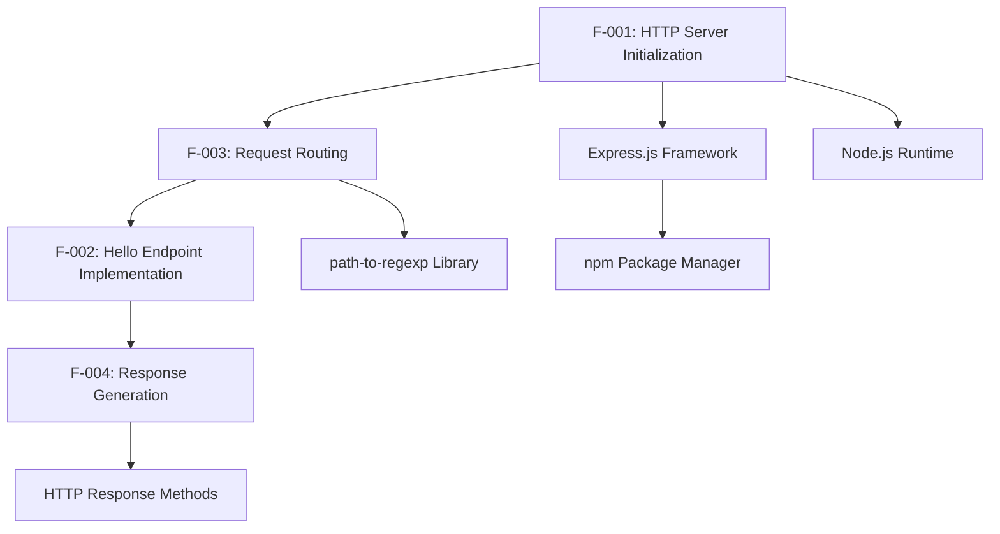
```mermaid
graph TD
    A[F-001: HTTP Server Initialization] --> B[F-003: Request Routing]
    B --> C[F-002: Hello Endpoint Implementation]
    C --> D[F-004: Response Generation]
    
    A --> E[Express.js Framework]
    A --> F[Node.js Runtime]
    E --> G[npm Package Manager]
    
    B --> H[path-to-regexp Library]
    D --> I[HTTP Response Methods]
```

### 2.3.2 Integration Points

| Integration Point | Components | Shared Resources |
|------------------|------------|------------------|
| Express Application | F-001, F-003 | Application instance, middleware stack |
| Route Handler | F-002, F-003, F-004 | Request/response objects, routing table |
| HTTP Stack | F-001, F-004 | Network interface, port binding |

### 2.3.3 Common Services

| Service | Features Using | Purpose |
|---------|---------------|---------|
| Express.js Framework | F-001, F-002, F-003, F-004 | Web application framework |
| HTTP Protocol Handler | F-001, F-003, F-004 | Network communication |
| Request Parser | F-002, F-003 | HTTP request processing |
| Response Formatter | F-002, F-004 | HTTP response generation |

## 2.4 IMPLEMENTATION CONSIDERATIONS

### 2.4.1 Technical Constraints

| Feature | Constraints | Impact |
|---------|-------------|--------|
| F-001 | Node.js 18+ requirement | Runtime compatibility |
| F-002 | Single endpoint limitation | Simplified architecture |
| F-003 | path-to-regexp@8.x security constraints | Enhanced security |
| F-004 | HTTP/1.1 protocol compliance | Standard compatibility |

### 2.4.2 Performance Requirements

| Feature | Performance Criteria | Measurement Method |
|---------|---------------------|-------------------|
| F-001 | Server startup < 1 second | Process timing |
| F-002 | Endpoint response < 100ms | HTTP request timing |
| F-003 | Route resolution < 10ms | Internal profiling |
| F-004 | Response generation < 50ms | Response timing |

### 2.4.3 Scalability Considerations

| Aspect | Current Implementation | Future Considerations |
|--------|----------------------|----------------------|
| Concurrent Requests | Single-threaded event loop | Cluster mode for multi-core |
| Memory Usage | < 50MB baseline | Memory monitoring |
| Request Volume | Development/tutorial scale | Load balancing for production |

### 2.4.4 Security Implications

| Feature | Security Measures | Risk Mitigation |
|---------|------------------|-----------------|
| F-001 | CVE-2024-45590 mitigation in Express 5.x | Updated dependencies |
| F-003 | ReDoS attack prevention via path-to-regexp@8.x | Secure routing patterns |
| F-004 | Standard HTTP headers | Information disclosure prevention |

### 2.4.5 Maintenance Requirements

| Feature | Maintenance Tasks | Frequency |
|---------|------------------|-----------|
| F-001 | Node.js LTS version updates | Every 6-12 months |
| F-002 | Endpoint functionality testing | Per deployment |
| F-003 | Security patch updates | As available |
| F-004 | Response format validation | Per release |

## 2.5 TRACEABILITY MATRIX

| Requirement ID | Feature | Business Need | Test Case | Acceptance Criteria |
|----------------|---------|---------------|-----------|-------------------|
| F-001-RQ-001 | Server Initialization | HTTP service availability | TC-001 | Port binding success |
| F-001-RQ-002 | Express Setup | Framework integration | TC-002 | Application instance creation |
| F-002-RQ-001 | GET Method | HTTP protocol compliance | TC-003 | Method-specific response |
| F-002-RQ-002 | Path Matching | Endpoint accessibility | TC-004 | Exact path resolution |
| F-002-RQ-003 | Response Content | Message delivery | TC-005 | "Hello world" content |
| F-003-RQ-001 | Route Resolution | Request handling | TC-006 | Path-to-handler mapping |
| F-004-RQ-001 | Content-Type | HTTP standard compliance | TC-007 | Header validation |
| F-004-RQ-002 | Response Body | Data transmission | TC-008 | Body content verification |

# 3. TECHNOLOGY STACK

## 3.1 PROGRAMMING LANGUAGES

### 3.1.1 Primary Language Selection

| Component | Language | Version | Justification |
|-----------|----------|---------|---------------|
| Server Application | JavaScript (Node.js) | ES2022+ | Node.js is a free, open-source, cross-platform JavaScript runtime environment that lets developers create servers, web apps, command line tools and scripts. Production applications should only use Active LTS or Maintenance LTS releases. |

### 3.1.2 Language Constraints and Dependencies

**Node.js Runtime Requirements**
- **Minimum Version**: Node.js 18 or higher required for Express.js 5.x compatibility
- **Recommended Versions**: Node.js 20.x (Maintenance LTS) or Node.js 22.x (Active LTS until October 2025)
- **LTS Strategy**: Production applications should only use Active LTS or Maintenance LTS releases

**JavaScript Feature Support**
- **ECMAScript Compatibility**: ES2022+ features including async/await, modules, and modern syntax
- **Module System**: CommonJS and ES Modules support for package compatibility
- **Runtime Environment**: Server-side execution context with Node.js APIs

## 3.2 FRAMEWORKS & LIBRARIES

### 3.2.1 Core Web Framework

| Framework | Version | Purpose | Justification |
|-----------|---------|---------|---------------|
| Express.js | 5.1.0 | HTTP server framework | Express 5.1.0 is now the default on npm with latest version published 3 months ago |

### 3.2.2 Framework Selection Rationale

**Express.js 5.1.0 Selection**
- **Latest Stable Release**: Express 5.1.0 is now the default on npm, meaning users get this version when running npm install express, transitioning nearly 17 million weekly downloads from v4 to v5
- **Security Improvements**: Includes important security fixes including improvements to prevent ReDoS attacks and mitigation for CVE-2024-45590, with updated path-to-regexp@8.x for security reasons
- **Enhanced Error Handling**: Express 5 makes it easier to handle errors in async middleware and routes by automatically passing rejected promises to error-handling middleware, removing the need for try/catch blocks

### 3.2.3 Framework Compatibility Requirements

**Node.js Version Compatibility**
- **Minimum Requirement**: Express 5.x dropped support for Node.js versions before v18
- **Routing Engine**: Updated to path-to-regexp@8.x, removing sub-expression regex patterns for security reasons (ReDoS mitigation)
- **Promise Support**: Middleware can now return rejected promises, caught by the router as errors

### 3.2.4 Supporting Libraries

| Library | Version | Category | Purpose |
|---------|---------|----------|---------|
| path-to-regexp | 8.x | Routing | Secure route pattern matching with ReDoS mitigation |
| body-parser | ^2.1.0 | Middleware | HTTP request body parsing with security improvements |

## 3.3 OPEN SOURCE DEPENDENCIES

### 3.3.1 Package Management

| Package Manager | Version | Registry | Purpose |
|----------------|---------|----------|---------|
| npm | 11.4.2 | npmjs.com | Latest version package manager, default for Node.js and included as recommended feature in Node.js installer |

### 3.3.2 Core Dependencies

**Express.js Ecosystem**
- **express**: Version 5.1.0, used by 90,019 other projects in npm registry
- **path-to-regexp**: Version 8.x for secure routing
- **body-parser**: Version ^2.1.0 for request parsing

### 3.3.3 Dependency Security Considerations

**Package Registry Security**
- **Registry Scale**: Over 3.1 million packages available in main npm registry, largest software registry in the world
- **Security Model**: Registry has no vetting process for submission, relies on user reports to take down packages that violate policies
- **Version Locking**: Lock files (package-lock.json) resolve version conflicts by recording exact package versions

### 3.3.4 Version Management Strategy

**Semantic Versioning**
- **SemVer Compliance**: npm follows semantic versioning (semver) standard
- **Version Specification**: Use Semantic Versioning 2.0.0 (SemVer2) with pre-release labels for clear versioning
- **Dependency Locking**: package-lock.json for reproducible builds

## 3.4 THIRD-PARTY SERVICES

### 3.4.1 External Service Requirements

**Not Applicable for Tutorial Scope**

The tutorial application operates as a standalone Node.js service without external API integrations, authentication services, or cloud dependencies. This aligns with the educational focus on fundamental HTTP server concepts.

### 3.4.2 Future Integration Considerations

| Service Category | Potential Integration | Implementation Phase |
|------------------|----------------------|---------------------|
| Monitoring | Application performance monitoring | Future enhancement |
| Logging | Centralized log aggregation | Future enhancement |
| Authentication | OAuth/JWT services | Future tutorial extension |

## 3.5 DATABASES & STORAGE

### 3.5.1 Data Persistence Strategy

**Not Required for Current Implementation**

The tutorial application serves static "Hello world" responses without data persistence requirements. This design choice supports the educational objective of demonstrating HTTP endpoint fundamentals without database complexity.

### 3.5.2 Storage Architecture Considerations

| Storage Type | Current Need | Future Consideration |
|--------------|--------------|---------------------|
| Database | None | Tutorial extension for data operations |
| File System | Configuration only | Log files and application metadata |
| Memory | Runtime state | Request/response processing |

## 3.6 DEVELOPMENT & DEPLOYMENT

### 3.6.1 Development Environment

| Tool Category | Technology | Version | Purpose |
|---------------|------------|---------|---------|
| Runtime | Node.js | 20.x/22.x LTS | Active LTS (22.x) or Maintenance LTS (20.x) for production readiness |
| Package Manager | npm | 11.4.2 | Latest stable version for dependency management |
| Process Manager | Node.js built-in | Native | HTTP server lifecycle management |

### 3.6.2 Build System Requirements

**Simplified Build Process**
- **No Transpilation**: Direct JavaScript execution with Node.js runtime
- **No Bundling**: Single-file application structure for educational clarity
- **Dependency Installation**: `npm install` for package management
- **Script Execution**: `node server.js` or `npm start` for application launch

### 3.6.3 Development Workflow

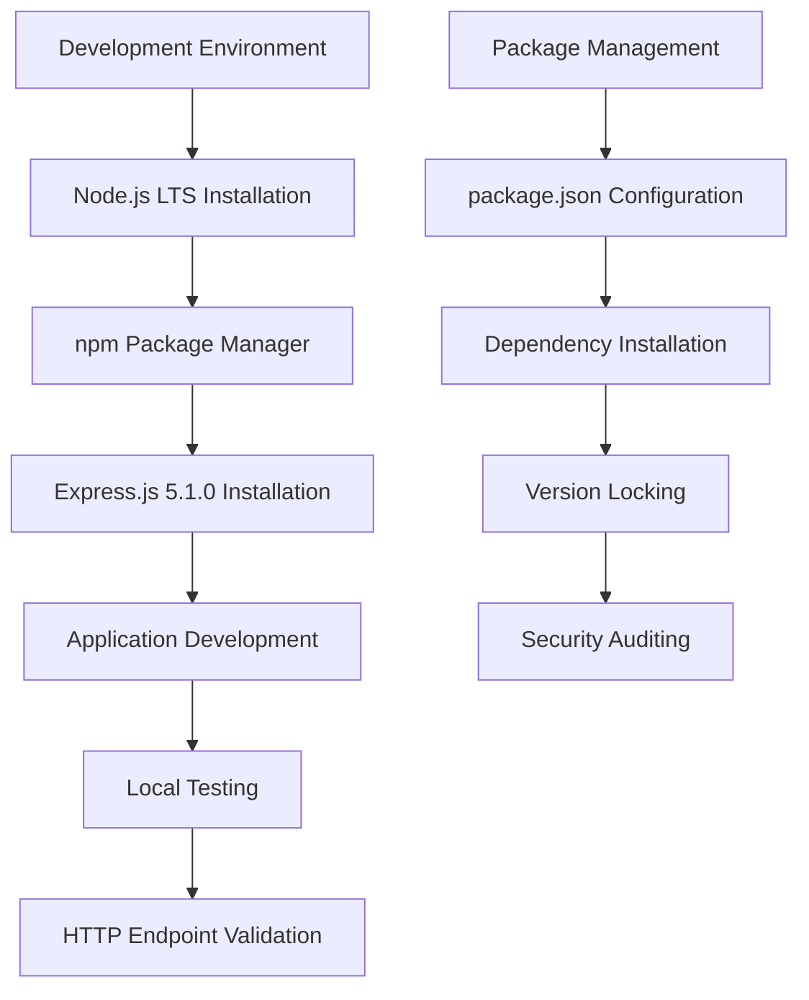
```mermaid
graph TD
    A[Development Environment] --> B[Node.js LTS Installation]
    B --> C[npm Package Manager]
    C --> D[Express.js 5.1.0 Installation]
    D --> E[Application Development]
    E --> F[Local Testing]
    F --> G[HTTP Endpoint Validation]
    
    H[Package Management] --> I[package.json Configuration]
    I --> J[Dependency Installation]
    J --> K[Version Locking]
    K --> L[Security Auditing]
```

### 3.6.4 Deployment Considerations

**Local Development Focus**
- **Target Environment**: Local development machine
- **Port Configuration**: Default port 3000 with configurable options
- **Process Management**: Manual start/stop for tutorial purposes
- **Monitoring**: Console logging for request/response tracking

### 3.6.5 Quality Assurance Tools

| Tool Type | Implementation | Purpose |
|-----------|----------------|---------|
| Linting | Future consideration | Code quality standards |
| Testing | Future consideration | Endpoint functionality validation |
| Security Scanning | npm audit | Dependency vulnerability detection |

### 3.6.6 Version Control Integration

**Git Compatibility**
- **Repository Structure**: Standard Node.js project layout
- **Ignore Patterns**: node_modules/, logs/, and temporary files
- **Package Tracking**: package.json and package-lock.json version control
- **Documentation**: README.md with setup and usage instructions

## 3.7 TECHNOLOGY INTEGRATION ARCHITECTURE

### 3.7.1 Component Integration Map

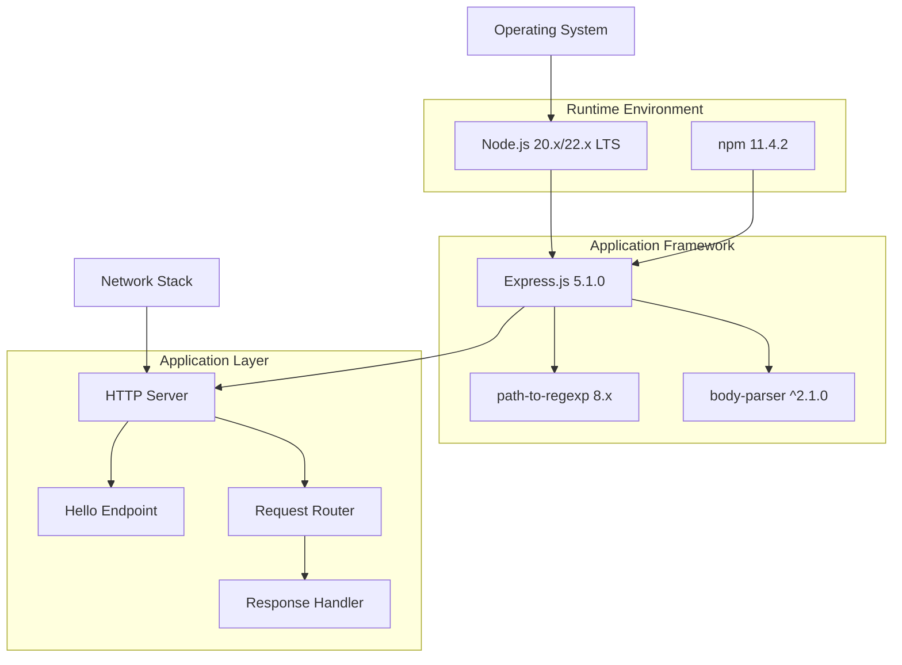
```mermaid
graph TB
    subgraph "Runtime Environment"
        A[Node.js 20.x/22.x LTS]
        B[npm 11.4.2]
    end
    
    subgraph "Application Framework"
        C[Express.js 5.1.0]
        D[path-to-regexp 8.x]
        E[body-parser ^2.1.0]
    end
    
    subgraph "Application Layer"
        F[HTTP Server]
        G[Hello Endpoint]
        H[Request Router]
        I[Response Handler]
    end
    
    A --> C
    B --> C
    C --> D
    C --> E
    C --> F
    F --> G
    F --> H
    H --> I
    
    J[Operating System] --> A
    K[Network Stack] --> F
```

### 3.7.2 Security Architecture

| Security Layer | Technology | Implementation |
|----------------|------------|----------------|
| Runtime Security | Node.js LTS | Production-ready LTS releases with security updates |
| Framework Security | Express.js 5.1.0 | Security fixes including ReDoS attack prevention and CVE-2024-45590 mitigation |
| Dependency Security | npm audit | Automated vulnerability scanning |
| Route Security | path-to-regexp 8.x | ReDoS mitigation through secure routing patterns |

### 3.7.3 Performance Considerations

**Runtime Performance**
- **Event Loop**: Single-threaded asynchronous I/O model
- **Memory Management**: V8 JavaScript engine optimization
- **HTTP Processing**: Express.js lightweight middleware stack
- **Response Time**: Target sub-100ms for hello endpoint

**Scalability Architecture**
- **Current Scope**: Single-process development server
- **Future Scaling**: Cluster mode for multi-core utilization
- **Load Handling**: Event-driven architecture for concurrent requests
- **Resource Usage**: Minimal memory footprint for tutorial application

# 4. PROCESS FLOWCHART

## 4.1 SYSTEM WORKFLOWS

### 4.1.1 Core Business Processes

#### End-to-End User Journey

The Node.js tutorial application follows a simplified HTTP request-response pattern designed for educational purposes. Express 5 requires Node.js 18 or higher, ensuring modern runtime capabilities and security features.

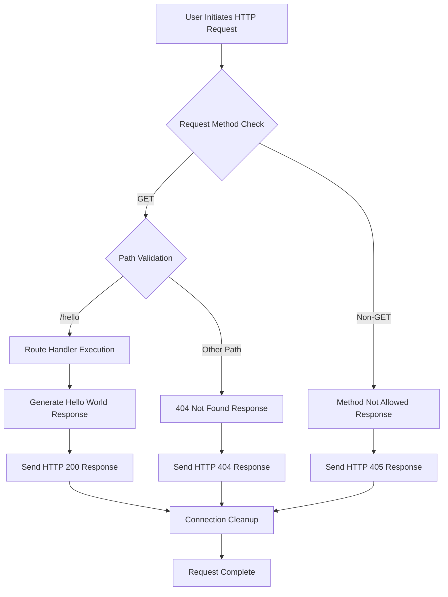
```mermaid
flowchart TD
    A[User Initiates HTTP Request] --> B{Request Method Check}
    B -->|GET| C{Path Validation}
    B -->|Non-GET| D[Method Not Allowed Response]
    C -->|/hello| E[Route Handler Execution]
    C -->|Other Path| F[404 Not Found Response]
    E --> G[Generate Hello World Response]
    G --> H[Send HTTP 200 Response]
    H --> I[Connection Cleanup]
    D --> J[Send HTTP 405 Response]
    F --> K[Send HTTP 404 Response]
    J --> I
    K --> I
    I --> L[Request Complete]
```

#### System Interaction Workflow

The application demonstrates fundamental Express.js patterns with middleware that can now return rejected promises, caught by the router as errors, simplifying error handling in modern Node.js applications.

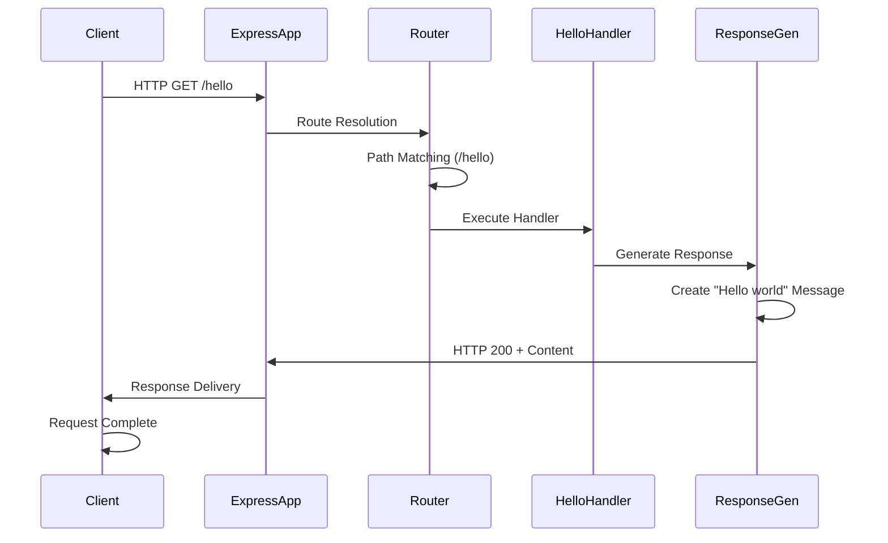
```mermaid
sequenceDiagram
    participant Client
    participant ExpressApp
    participant Router
    participant HelloHandler
    participant ResponseGen
    
    Client->>ExpressApp: HTTP GET /hello
    ExpressApp->>Router: Route Resolution
    Router->>Router: Path Matching (/hello)
    Router->>HelloHandler: Execute Handler
    HelloHandler->>ResponseGen: Generate Response
    ResponseGen->>ResponseGen: Create "Hello world" Message
    ResponseGen->>ExpressApp: HTTP 200 + Content
    ExpressApp->>Client: Response Delivery
    Client->>Client: Request Complete
```

#### Decision Points and Business Rules

| Decision Point | Condition | Action | Business Rule |
|----------------|-----------|--------|---------------|
| Method Validation | HTTP Method = GET | Continue Processing | Only GET requests supported |
| Path Matching | Request Path = "/hello" | Execute Handler | Exact path matching required |
| Response Generation | Handler Success | Return "Hello world" | Consistent message format |
| Error Conditions | Invalid Method/Path | Return Error Response | Graceful error handling |

### 4.1.2 Integration Workflows

## Express.js Framework Integration

Express 5 updates to path-to-regexp@8.x from path-to-regexp@0.x, which incorporates many years of changes and removes the possibility of any ReDoS attacks.

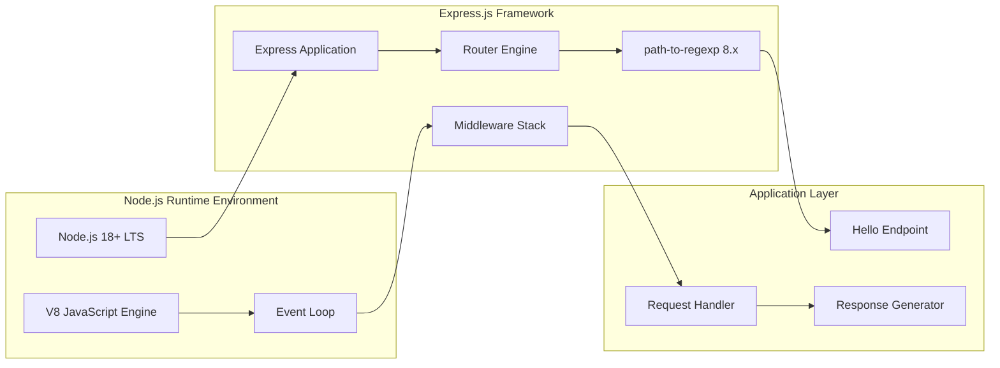
```mermaid
flowchart LR
    subgraph "Node.js Runtime Environment"
        A[Node.js 18+ LTS]
        B[V8 JavaScript Engine]
        C[Event Loop]
    end
    
    subgraph "Express.js Framework"
        D[Express Application]
        E[Router Engine]
        F[path-to-regexp 8.x]
        G[Middleware Stack]
    end
    
    subgraph "Application Layer"
        H[Hello Endpoint]
        I[Request Handler]
        J[Response Generator]
    end
    
    A --> D
    B --> C
    C --> G
    D --> E
    E --> F
    F --> H
    G --> I
    I --> J
```

#### Data Flow Between Components

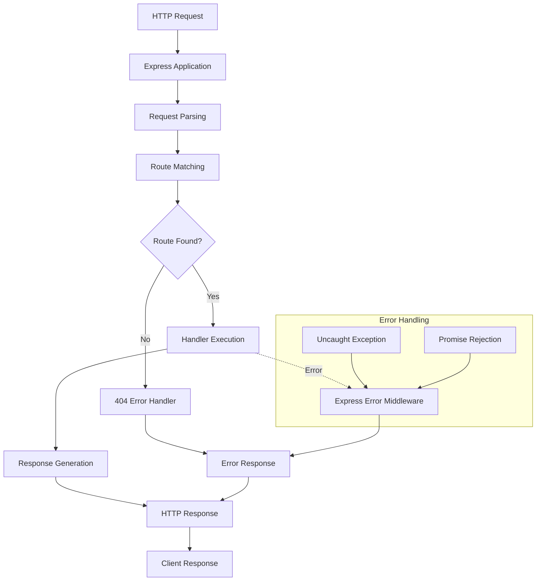
```mermaid
flowchart TD
    A[HTTP Request] --> B[Express Application]
    B --> C[Request Parsing]
    C --> D[Route Matching]
    D --> E{Route Found?}
    E -->|Yes| F[Handler Execution]
    E -->|No| G[404 Error Handler]
    F --> H[Response Generation]
    G --> I[Error Response]
    H --> J[HTTP Response]
    I --> J
    J --> K[Client Response]
    
    subgraph "Error Handling"
        L[Uncaught Exception]
        M[Promise Rejection]
        N[Express Error Middleware]
    end
    
    F -.->|Error| N
    L --> N
    M --> N
    N --> I
```

#### Event Processing Flow

Express 5 introduces automatic forwarding of rejected promises to error-handling middleware, eliminating the need to call next with the error manually.

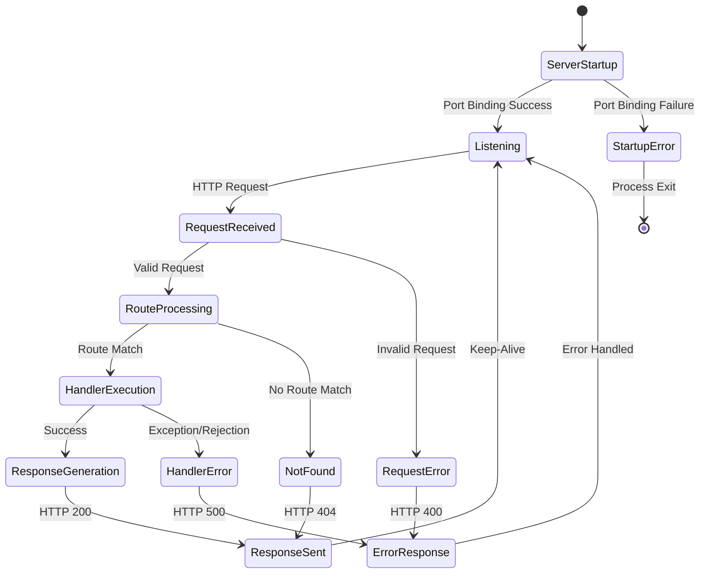
```mermaid
stateDiagram-v2
    [*] --> ServerStartup
    ServerStartup --> Listening: Port Binding Success
    ServerStartup --> StartupError: Port Binding Failure
    
    Listening --> RequestReceived: HTTP Request
    RequestReceived --> RouteProcessing: Valid Request
    RequestReceived --> RequestError: Invalid Request
    
    RouteProcessing --> HandlerExecution: Route Match
    RouteProcessing --> NotFound: No Route Match
    
    HandlerExecution --> ResponseGeneration: Success
    HandlerExecution --> HandlerError: Exception/Rejection
    
    ResponseGeneration --> ResponseSent: HTTP 200
    NotFound --> ResponseSent: HTTP 404
    HandlerError --> ErrorResponse: HTTP 500
    RequestError --> ErrorResponse: HTTP 400
    
    ResponseSent --> Listening: Keep-Alive
    ErrorResponse --> Listening: Error Handled
    
    StartupError --> [*]: Process Exit
```

## 4.2 FLOWCHART REQUIREMENTS

### 4.2.1 Server Initialization Process

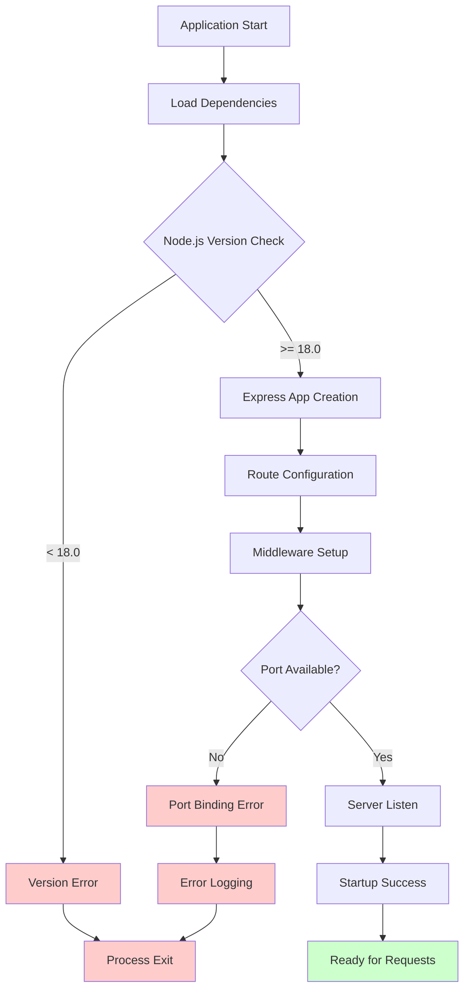
```mermaid
flowchart TD
    A[Application Start] --> B[Load Dependencies]
    B --> C{Node.js Version Check}
    C -->|< 18.0| D[Version Error]
    C -->|>= 18.0| E[Express App Creation]
    D --> F[Process Exit]
    E --> G[Route Configuration]
    G --> H[Middleware Setup]
    H --> I{Port Available?}
    I -->|No| J[Port Binding Error]
    I -->|Yes| K[Server Listen]
    J --> L[Error Logging]
    L --> F
    K --> M[Startup Success]
    M --> N[Ready for Requests]
    
    style D fill:#ffcccc
    style F fill:#ffcccc
    style J fill:#ffcccc
    style L fill:#ffcccc
    style N fill:#ccffcc
```

### 4.2.2 Request Processing Workflow

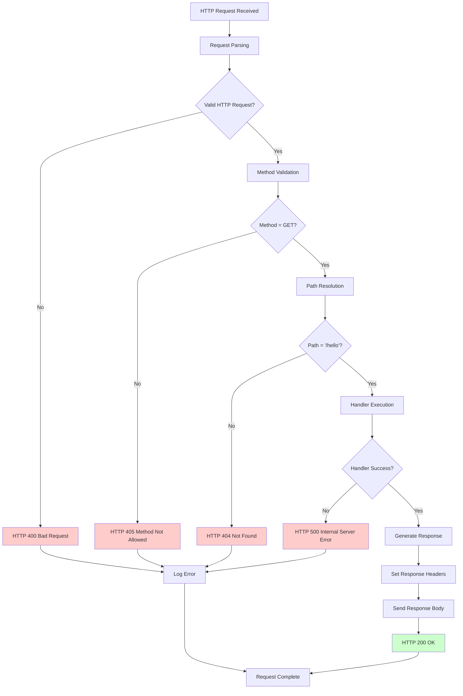
```mermaid
flowchart TD
    A[HTTP Request Received] --> B[Request Parsing]
    B --> C{Valid HTTP Request?}
    C -->|No| D[HTTP 400 Bad Request]
    C -->|Yes| E[Method Validation]
    E --> F{Method = GET?}
    F -->|No| G[HTTP 405 Method Not Allowed]
    F -->|Yes| H[Path Resolution]
    H --> I{Path = '/hello'?}
    I -->|No| J[HTTP 404 Not Found]
    I -->|Yes| K[Handler Execution]
    K --> L{Handler Success?}
    L -->|No| M[HTTP 500 Internal Server Error]
    L -->|Yes| N[Generate Response]
    N --> O[Set Response Headers]
    O --> P[Send Response Body]
    P --> Q[HTTP 200 OK]
    
    D --> R[Log Error]
    G --> R
    J --> R
    M --> R
    Q --> S[Request Complete]
    R --> S
    
    style D fill:#ffcccc
    style G fill:#ffcccc
    style J fill:#ffcccc
    style M fill:#ffcccc
    style Q fill:#ccffcc
```

### 4.2.3 Error Handling Flowchart

Future versions of Node.js may terminate applications immediately when unhandled rejections occur, so it is important to handle such cases explicitly with process-level handlers.

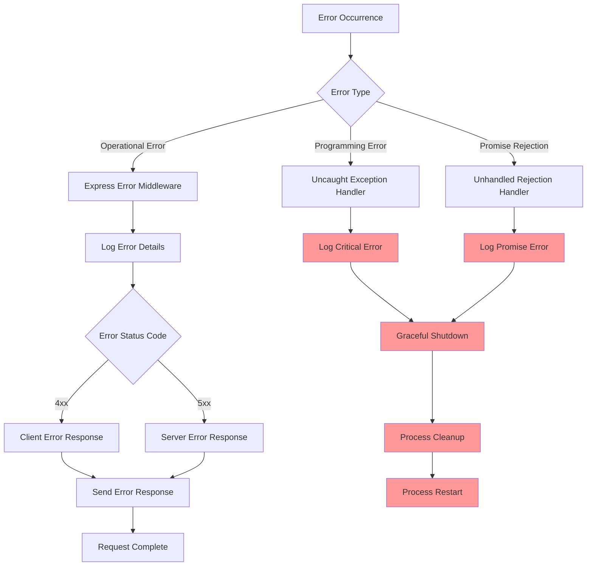
```mermaid
flowchart TD
    A[Error Occurrence] --> B{Error Type}
    B -->|Operational Error| C[Express Error Middleware]
    B -->|Programming Error| D[Uncaught Exception Handler]
    B -->|Promise Rejection| E[Unhandled Rejection Handler]
    
    C --> F[Log Error Details]
    D --> G[Log Critical Error]
    E --> H[Log Promise Error]
    
    F --> I{Error Status Code}
    I -->|4xx| J[Client Error Response]
    I -->|5xx| K[Server Error Response]
    
    G --> L[Graceful Shutdown]
    H --> L
    
    J --> M[Send Error Response]
    K --> M
    L --> N[Process Cleanup]
    M --> O[Request Complete]
    N --> P[Process Restart]
    
    style G fill:#ff9999
    style H fill:#ff9999
    style L fill:#ff9999
    style N fill:#ff9999
    style P fill:#ff9999
```

### 4.2.4 Validation Rules and Checkpoints

| Validation Point | Rule | Action on Failure | Recovery Path |
|------------------|------|-------------------|---------------|
| Node.js Version | >= 18.0 | Application Exit | Upgrade Runtime |
| Port Availability | Port Not in Use | Binding Error | Try Alternative Port |
| HTTP Method | Must be GET | HTTP 405 Response | Client Method Change |
| Request Path | Must be "/hello" | HTTP 404 Response | Client Path Correction |
| Handler Execution | No Exceptions | HTTP 500 Response | Error Logging |

### 4.2.5 Authorization and Security Checkpoints

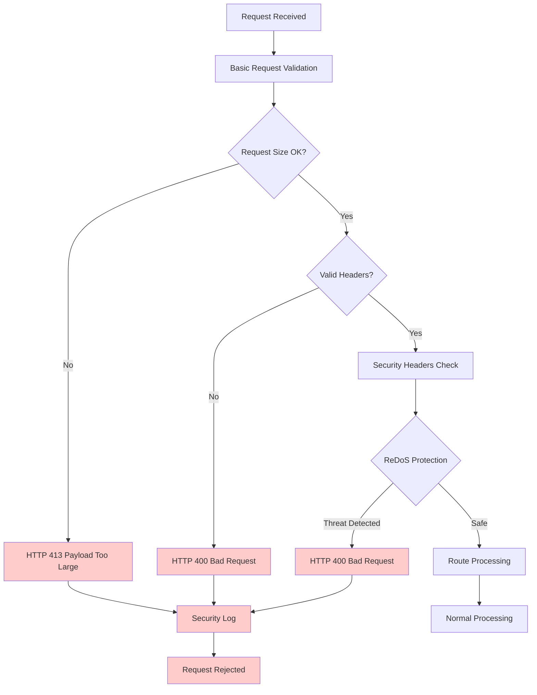
```mermaid
flowchart TD
    A[Request Received] --> B[Basic Request Validation]
    B --> C{Request Size OK?}
    C -->|No| D[HTTP 413 Payload Too Large]
    C -->|Yes| E{Valid Headers?}
    E -->|No| F[HTTP 400 Bad Request]
    E -->|Yes| G[Security Headers Check]
    G --> H{ReDoS Protection}
    H -->|Threat Detected| I[HTTP 400 Bad Request]
    H -->|Safe| J[Route Processing]
    
    D --> K[Security Log]
    F --> K
    I --> K
    J --> L[Normal Processing]
    K --> M[Request Rejected]
    
    style D fill:#ffcccc
    style F fill:#ffcccc
    style I fill:#ffcccc
    style K fill:#ffcccc
    style M fill:#ffcccc
```

## 4.3 TECHNICAL IMPLEMENTATION

### 4.3.1 State Management

#### Application State Transitions

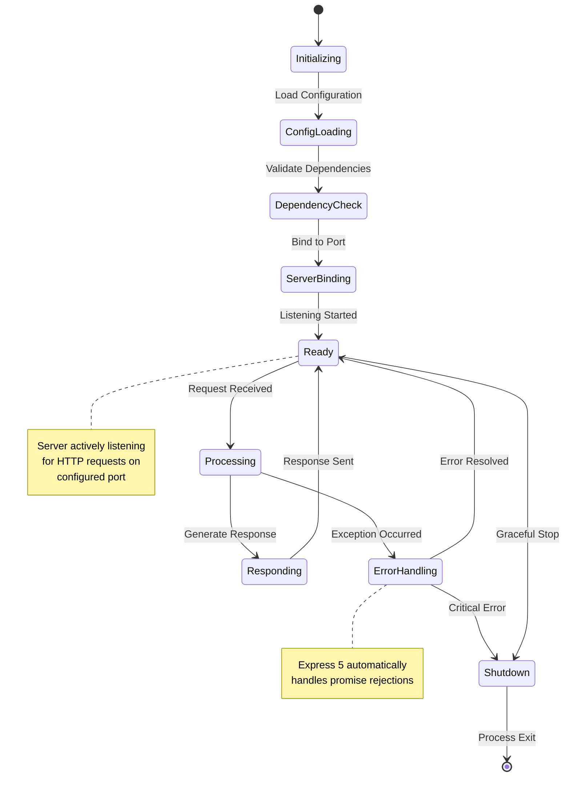
```mermaid
stateDiagram-v2
    [*] --> Initializing
    Initializing --> ConfigLoading: Load Configuration
    ConfigLoading --> DependencyCheck: Validate Dependencies
    DependencyCheck --> ServerBinding: Bind to Port
    ServerBinding --> Ready: Listening Started
    
    Ready --> Processing: Request Received
    Processing --> Responding: Generate Response
    Responding --> Ready: Response Sent
    
    Processing --> ErrorHandling: Exception Occurred
    ErrorHandling --> Ready: Error Resolved
    ErrorHandling --> Shutdown: Critical Error
    
    Ready --> Shutdown: Graceful Stop
    Shutdown --> [*]: Process Exit
    
    note right of Ready
        Server actively listening
        for HTTP requests on
        configured port
    end note
    
    note right of ErrorHandling
        Express 5 automatically
        handles promise rejections
    end note
```

#### Data Persistence Points

| State | Persistence Requirement | Storage Location | Cleanup Strategy |
|-------|------------------------|------------------|------------------|
| Server Configuration | Application Startup | Memory/Environment Variables | Process Exit |
| Request Context | Request Duration | Memory (Request Object) | Response Completion |
| Error Logs | Persistent | Console/Log Files | Log Rotation |
| Connection State | Connection Duration | Memory (Socket Objects) | Connection Close |

### 4.3.2 Caching Requirements

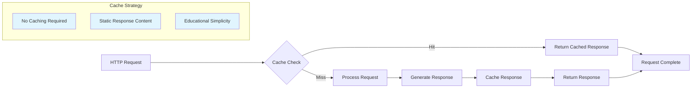
```mermaid
flowchart LR
    A[HTTP Request] --> B{Cache Check}
    B -->|Hit| C[Return Cached Response]
    B -->|Miss| D[Process Request]
    D --> E[Generate Response]
    E --> F[Cache Response]
    F --> G[Return Response]
    C --> H[Request Complete]
    G --> H
    
    subgraph "Cache Strategy"
        I[No Caching Required]
        J[Static Response Content]
        K[Educational Simplicity]
    end
    
    style I fill:#e1f5fe
    style J fill:#e1f5fe
    style K fill:#e1f5fe
```

**Note**: The tutorial application does not implement caching due to its educational focus and static response nature.

### 4.3.3 Transaction Boundaries

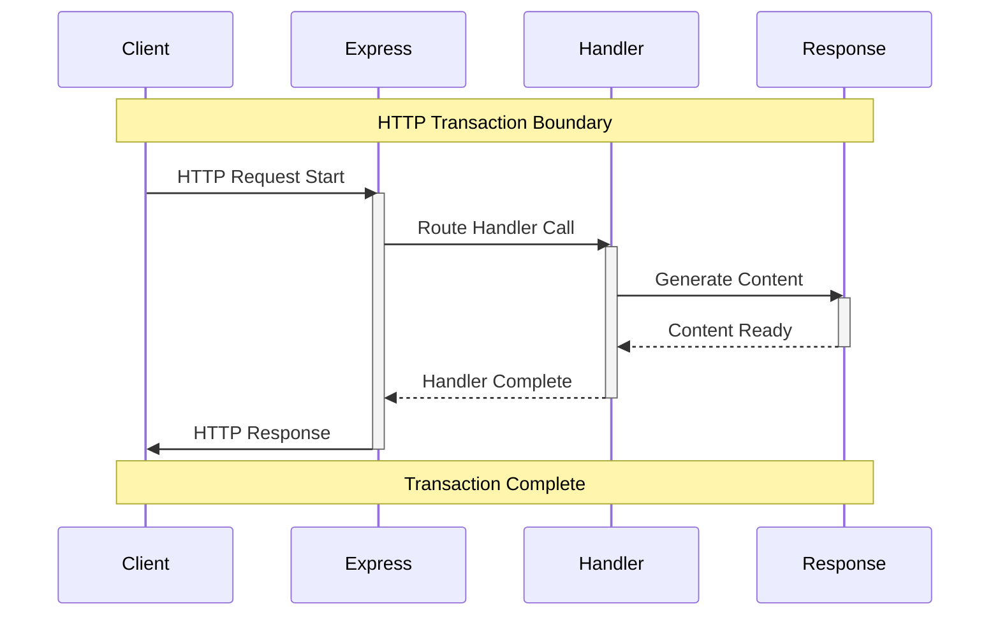
```mermaid
sequenceDiagram
    participant Client
    participant Express
    participant Handler
    participant Response
    
    Note over Client,Response: HTTP Transaction Boundary
    Client->>Express: HTTP Request Start
    activate Express
    
    Express->>Handler: Route Handler Call
    activate Handler
    
    Handler->>Response: Generate Content
    activate Response
    
    Response-->>Handler: Content Ready
    deactivate Response
    
    Handler-->>Express: Handler Complete
    deactivate Handler
    
    Express->>Client: HTTP Response
    deactivate Express
    
    Note over Client,Response: Transaction Complete
```

### 4.3.4 Error Handling Implementation

#### Retry Mechanisms

Implementing exponential backoff between retry attempts helps prevent overwhelming the server after a temporary failure.

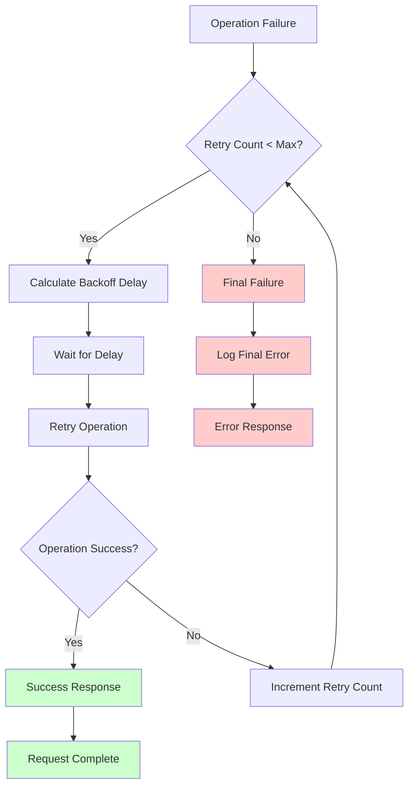
```mermaid
flowchart TD
    A[Operation Failure] --> B{Retry Count < Max?}
    B -->|No| C[Final Failure]
    B -->|Yes| D[Calculate Backoff Delay]
    D --> E[Wait for Delay]
    E --> F[Retry Operation]
    F --> G{Operation Success?}
    G -->|Yes| H[Success Response]
    G -->|No| I[Increment Retry Count]
    I --> B
    
    C --> J[Log Final Error]
    H --> K[Request Complete]
    J --> L[Error Response]
    
    style C fill:#ffcccc
    style J fill:#ffcccc
    style L fill:#ffcccc
    style H fill:#ccffcc
    style K fill:#ccffcc
```

#### Fallback Processes

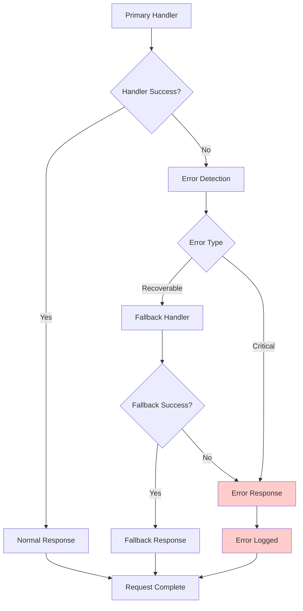
```mermaid
flowchart TD
    A[Primary Handler] --> B{Handler Success?}
    B -->|Yes| C[Normal Response]
    B -->|No| D[Error Detection]
    D --> E{Error Type}
    E -->|Recoverable| F[Fallback Handler]
    E -->|Critical| G[Error Response]
    F --> H{Fallback Success?}
    H -->|Yes| I[Fallback Response]
    H -->|No| G
    
    C --> J[Request Complete]
    I --> J
    G --> K[Error Logged]
    K --> J
    
    style G fill:#ffcccc
    style K fill:#ffcccc
```

#### Recovery Procedures

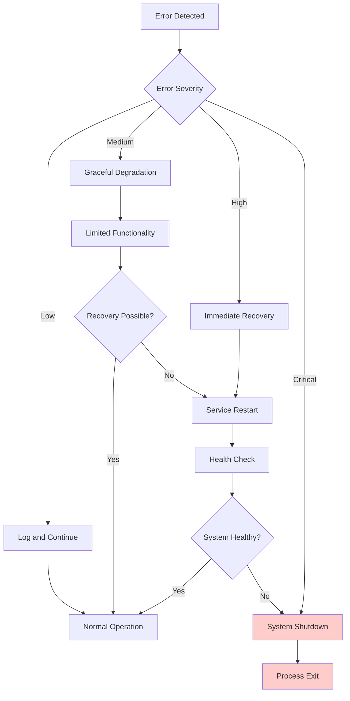
```mermaid
flowchart TD
    A[Error Detected] --> B{Error Severity}
    B -->|Low| C[Log and Continue]
    B -->|Medium| D[Graceful Degradation]
    B -->|High| E[Immediate Recovery]
    B -->|Critical| F[System Shutdown]
    
    C --> G[Normal Operation]
    D --> H[Limited Functionality]
    E --> I[Service Restart]
    F --> J[Process Exit]
    
    H --> K{Recovery Possible?}
    K -->|Yes| G
    K -->|No| I
    
    I --> L[Health Check]
    L --> M{System Healthy?}
    M -->|Yes| G
    M -->|No| F
    
    style F fill:#ffcccc
    style J fill:#ffcccc
```

## 4.4 REQUIRED DIAGRAMS

### 4.4.1 High-Level System Workflow

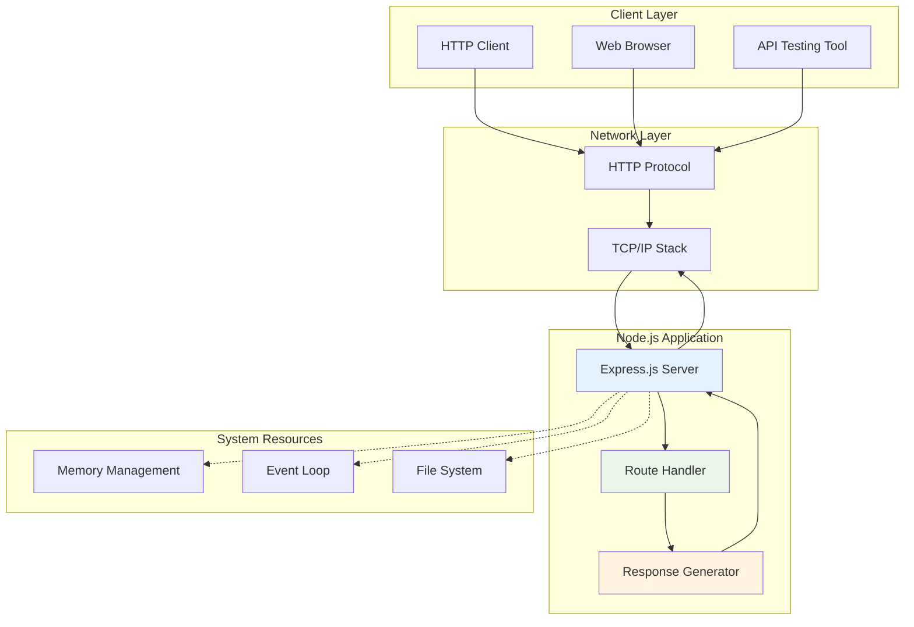
```mermaid
graph TB
    subgraph "Client Layer"
        A[HTTP Client]
        B[Web Browser]
        C[API Testing Tool]
    end
    
    subgraph "Network Layer"
        D[HTTP Protocol]
        E[TCP/IP Stack]
    end
    
    subgraph "Node.js Application"
        F[Express.js Server]
        G[Route Handler]
        H[Response Generator]
    end
    
    subgraph "System Resources"
        I[Memory Management]
        J[Event Loop]
        K[File System]
    end
    
    A --> D
    B --> D
    C --> D
    D --> E
    E --> F
    F --> G
    G --> H
    H --> F
    F --> E
    
    F -.-> I
    F -.-> J
    F -.-> K
    
    style F fill:#e3f2fd
    style G fill:#e8f5e8
    style H fill:#fff3e0
```

### 4.4.2 Detailed Process Flow for Hello Endpoint

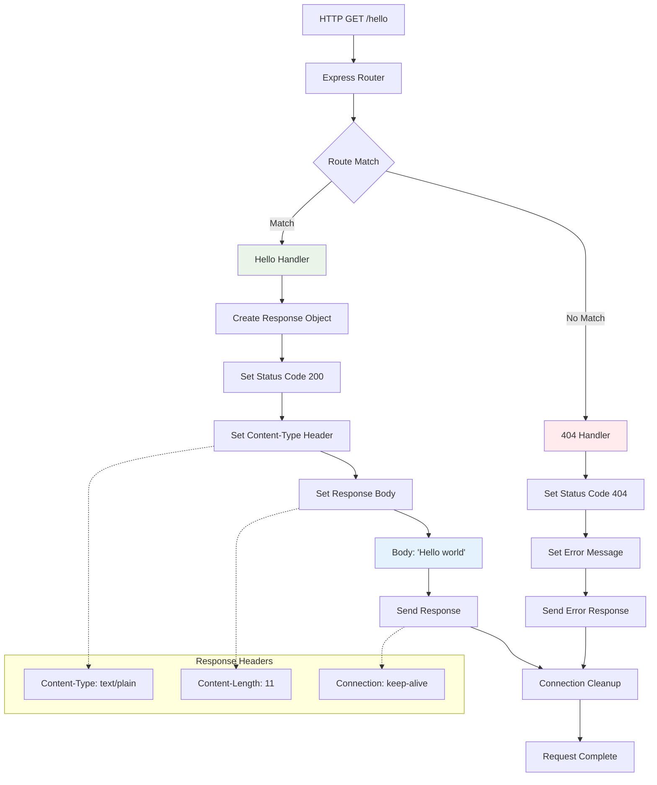
```mermaid
flowchart TD
    A[HTTP GET /hello] --> B[Express Router]
    B --> C{Route Match}
    C -->|Match| D[Hello Handler]
    C -->|No Match| E[404 Handler]
    
    D --> F[Create Response Object]
    F --> G[Set Status Code 200]
    G --> H[Set Content-Type Header]
    H --> I[Set Response Body]
    I --> J["Body: 'Hello world'"]
    J --> K[Send Response]
    
    E --> L[Set Status Code 404]
    L --> M[Set Error Message]
    M --> N[Send Error Response]
    
    K --> O[Connection Cleanup]
    N --> O
    O --> P[Request Complete]
    
    subgraph "Response Headers"
        Q[Content-Type: text/plain]
        R[Content-Length: 11]
        S[Connection: keep-alive]
    end
    
    H -.-> Q
    I -.-> R
    K -.-> S
    
    style D fill:#e8f5e8
    style E fill:#ffebee
    style J fill:#e3f2fd
```

### 4.4.3 Error Handling Flowchart

```mermaid
flowchart TD
    A[Request Processing] --> B{Error Occurred?}
    B -->|No| C[Normal Response]
    B -->|Yes| D[Error Classification]
    
    D --> E{Error Type}
    E -->|Client Error| F[4xx Response]
    E -->|Server Error| G[5xx Response]
    E -->|System Error| H[Critical Handler]
    
    F --> I[Log Client Error]
    G --> J[Log Server Error]
    H --> K[Log Critical Error]
    
    I --> L[Send Error Response]
    J --> L
    K --> M[Graceful Shutdown]
    
    L --> N[Request Complete]
    M --> O[Process Restart]
    
    C --> N
    
    subgraph "Error Logging"
        P[Console Output]
        Q[Error Details]
        R[Stack Trace]
        S[Timestamp]
    end
    
    I -.-> P
    J -.-> P
    K -.-> P
    P -.-> Q
    P -.-> R
    P -.-> S
    
    style H fill:#ffcdd2
    style K fill:#ffcdd2
    style M fill:#ffcdd2
    style O fill:#ffcdd2
```

### 4.4.4 Integration Sequence Diagram

```mermaid
sequenceDiagram
    participant C as Client
    participant N as Network
    participant E as Express App
    participant R as Router
    participant H as Hello Handler
    participant G as Response Generator
    participant L as Logger
    
    C->>N: HTTP GET /hello
    N->>E: Forward Request
    E->>R: Route Resolution
    R->>R: Path Matching
    
    alt Route Found
        R->>H: Execute Handler
        H->>G: Generate Response
        G->>G: Create "Hello world"
        G->>H: Response Object
        H->>E: HTTP 200 Response
        E->>N: Send Response
        N->>C: HTTP Response
        E->>L: Log Success
    else Route Not Found
        R->>E: 404 Error
        E->>N: Send 404 Response
        N->>C: Error Response
        E->>L: Log 404 Error
    end
    
    Note over C,L: Request-Response Cycle Complete
```

### 4.4.5 State Transition Diagram

```mermaid
stateDiagram-v2
    [*] --> Startup
    Startup --> Initializing: Load Configuration
    Initializing --> Binding: Create Server
    Binding --> Listening: Port Bound Successfully
    Binding --> Error: Port Binding Failed
    
    Listening --> RequestReceived: HTTP Request
    RequestReceived --> Processing: Valid Request
    RequestReceived --> InvalidRequest: Invalid Request
    
    Processing --> HandlerExecution: Route Matched
    Processing --> RouteNotFound: No Route Match
    
    HandlerExecution --> ResponseGeneration: Handler Success
    HandlerExecution --> HandlerError: Handler Exception
    
    ResponseGeneration --> ResponseSent: HTTP 200
    RouteNotFound --> ResponseSent: HTTP 404
    HandlerError --> ResponseSent: HTTP 500
    InvalidRequest --> ResponseSent: HTTP 400
    
    ResponseSent --> Listening: Keep Connection
    ResponseSent --> ConnectionClosed: Close Connection
    ConnectionClosed --> Listening: Ready for New Requests
    
    Error --> Shutdown: Critical Error
    Listening --> Shutdown: Graceful Stop
    Shutdown --> [*]: Process Exit
    
    note right of Listening
        Server ready to accept
        HTTP requests on port 3000
    end note
    
    note right of HandlerExecution
        Express 5 automatically
        handles async errors
    end note
```

## 4.5 TIMING AND SLA CONSIDERATIONS

### 4.5.1 Performance Requirements

| Operation | Target Time | Maximum Time | Measurement Point |
|-----------|-------------|--------------|-------------------|
| Server Startup | < 1 second | 2 seconds | Process initialization to listening |
| Route Resolution | < 10ms | 50ms | Request parsing to handler execution |
| Response Generation | < 50ms | 100ms | Handler execution to response ready |
| End-to-End Request | < 100ms | 200ms | Request received to response sent |

### 4.5.2 Timeout Configuration

```mermaid
flowchart TD
    A[Request Received] --> B[Start Request Timer]
    B --> C[Process Request]
    C --> D{Processing Complete?}
    D -->|Yes| E[Send Response]
    D -->|No| F{Timeout Reached?}
    F -->|No| C
    F -->|Yes| G[Timeout Handler]
    G --> H[HTTP 408 Request Timeout]
    E --> I[Stop Timer]
    H --> I
    I --> J[Request Complete]
    
    style G fill:#ffcccc
    style H fill:#ffcccc
```

### 4.5.3 Resource Monitoring

| Resource | Threshold | Action | Recovery |
|----------|-----------|--------|----------|
| Memory Usage | > 50MB | Warning Log | Garbage Collection |
| CPU Usage | > 80% | Performance Log | Request Throttling |
| Response Time | > 200ms | Slow Query Log | Performance Analysis |
| Error Rate | > 5% | Alert Trigger | Health Check |

### 4.5.4 Scalability Considerations

```mermaid
graph TD
    subgraph "Current Implementation"
        A[Single Process]
        B[Event Loop]
        C[Memory Limit: 50MB]
    end
    
    subgraph "Future Scaling Options"
        D[Cluster Mode]
        E[Load Balancer]
        F[Multiple Instances]
    end
    
    subgraph "Monitoring"
        G[Performance Metrics]
        H[Error Tracking]
        I[Resource Usage]
    end
    
    A --> B
    B --> C
    A -.-> D
    D -.-> E
    E -.-> F
    
    A --> G
    B --> H
    C --> I
    
    style A fill:#e3f2fd
    style D fill:#f3e5f5
    style E fill:#f3e5f5
    style F fill:#f3e5f5
```

# 5. SYSTEM ARCHITECTURE

## 5.1 HIGH-LEVEL ARCHITECTURE

### 5.1.1 System Overview

The Node.js tutorial application implements a event-driven pattern that utilizes the event-driven architecture of Node.js to handle events, using the EventEmitter class to enable developers to raise an event from any part of the application that can be listened to by a listener. The system follows a minimalist architectural approach designed specifically for educational purposes, demonstrating fundamental HTTP server concepts through Express.js framework integration.

The architecture adopts a 3-Tier pattern that separates technical concerns (HTTP, DB, etc) from the pure logic of the app, putting each concern in a dedicated folder. This separation ensures developers can understand core concepts without infrastructural complexity. The system leverages Express 5.0, which brought modern features and a future-oriented architecture to the framework after more than a decade of community discussions.

**Architectural Style**: The application implements a simplified layered architecture with clear separation between HTTP handling, routing, and response generation. This approach aligns with proven and battle-tested solutions that help promote best practices and implement a structured approach to solving everyday issues while designing and developing software architecture, enabling software engineers to develop maintainable, secure, and stable systems.

**Key Architectural Principles**:
- Single Responsibility: Each component handles one specific concern
- Separation of Concerns: HTTP layer isolated from business logic
- Educational Clarity: Simplified structure for learning purposes
- Modern Security: Express 5.x includes security fixes including improvements to prevent ReDoS attacks and mitigation for CVE-2024-45590

**System Boundaries**: The application operates within a single Node.js process, handling HTTP requests through the Express.js framework without external dependencies or data persistence requirements. The system boundary encompasses HTTP request reception, route processing, and response generation.

### 5.1.2 Core Components Table

| Component Name | Primary Responsibility | Key Dependencies | Integration Points |
|----------------|----------------------|------------------|-------------------|
| HTTP Server | Accept and manage HTTP connections | Node.js HTTP module, Express.js 5.1.0 | Operating system network stack, port binding |
| Express Application | Framework initialization and middleware orchestration | Express.js framework, Node.js runtime | HTTP Server, Route Handler |
| Route Handler | Process /hello endpoint requests | Express Router, path-to-regexp 8.x | Request Parser, Response Generator |
| Response Generator | Create and format HTTP responses | Express response methods | HTTP Server, Content formatting |

### 5.1.3 Data Flow Description

The primary data flow follows a linear request-response pattern optimized for educational demonstration. Express 5 introduces automatic forwarding of rejected promises to error-handling middleware, simplifying error handling throughout the data flow.

**Request Processing Flow**: HTTP requests enter through the Express application layer, where middleware functions perform tasks between the request and response of an API call, having access to the request and response objects. The routing engine, powered by path-to-regexp library upgraded from version 0.x to 8.x, improves security, simplifies route definitions, and helps mitigate vulnerabilities like ReDoS attacks.

**Integration Patterns**: The system uses synchronous processing for the simple hello endpoint, eliminating complex asynchronous patterns while maintaining the educational focus. Modern Node.js eliminates the common pattern of immediately-invoked async function expressions (IIFE), making code more linear and easier to reason about.

**Data Transformation Points**: Minimal data transformation occurs within the system, limited to HTTP request parsing and response formatting. The "Hello world" message remains static, requiring no business logic processing or data manipulation.

### 5.1.4 External Integration Points

| System Name | Integration Type | Data Exchange Pattern | Protocol/Format |
|-------------|------------------|----------------------|-----------------|
| Operating System | Network Interface | Socket-based communication | TCP/IP over HTTP/1.1 |
| Node.js Runtime | Process Management | Event-driven callbacks | JavaScript execution context |
| npm Registry | Package Management | Dependency resolution | HTTPS/JSON package metadata |

## 5.2 COMPONENT DETAILS

### 5.2.1 HTTP Server Component

**Purpose and Responsibilities**
The HTTP Server component serves as the primary entry point for all client requests, managing connection lifecycle and delegating request processing to the Express application layer. It handles port binding, connection acceptance, and basic HTTP protocol compliance.

**Technologies and Frameworks**
- **Node.js HTTP Module**: Native HTTP server capabilities
- **Express.js 5.1.0**: Express 5.0 solidified the framework's role as a mainstay in the Node.js ecosystem
- **TCP/IP Stack**: Operating system network interface

**Key Interfaces and APIs**
- HTTP/1.1 protocol compliance for client communication
- Express application mounting and middleware integration
- Port binding and server lifecycle management
- Connection pooling and keep-alive handling

**Data Persistence Requirements**
No persistent data storage required. The component maintains only transient connection state and server configuration in memory during runtime.

**Scaling Considerations**
Current implementation supports single-process operation suitable for tutorial purposes. For CPU-intensive tasks, worker threads provide true parallelism without blocking the main thread, though not required for this educational application.

### 5.2.2 Express Application Component

**Purpose and Responsibilities**
The Express Application component orchestrates the entire request-response cycle, managing middleware execution, routing decisions, and error handling. It uses the "use()" method to define middleware with three arguments: req, res, and next, where the "next()" function passes control to the next middleware or route handler.

**Technologies and Frameworks**
- **Express.js 5.1.0**: Provides enhanced security, improved performance, and full support for modern JavaScript features
- **path-to-regexp 8.x**: Removes inline regex patterns susceptible to ReDoS attacks, recommending input validation libraries for complex patterns

**Key Interfaces and APIs**
- Express Router API for route definition and matching
- Middleware stack management and execution
- Error handling middleware integration
- Request/response object enhancement

**Data Persistence Requirements**
Maintains application configuration and middleware stack in memory. No external data persistence required for tutorial functionality.

**Scaling Considerations**
Express 5 simplifies its codebase, reduces external dependencies, and stays in sync with the latest improvements for better performance and security. Future scaling can leverage Node.js cluster mode for multi-core utilization.

### 5.2.3 Route Handler Component

**Purpose and Responsibilities**
The Route Handler component processes specific endpoint requests, implementing the core business logic for the /hello endpoint. It demonstrates fundamental routing concepts and HTTP method handling.

**Technologies and Frameworks**
- **Express Router**: Route definition and parameter extraction
- **path-to-regexp 8.x**: Secure pattern matching with ReDoS mitigation
- **JavaScript ES2022+**: Modern language features for handler implementation

**Key Interfaces and APIs**
- HTTP GET method handling for /hello endpoint
- Request parameter parsing and validation
- Response object manipulation and formatting
- Error propagation to Express error middleware

**Data Persistence Requirements**
No data persistence required. The component generates static responses without external data dependencies.

**Scaling Considerations**
Stateless design enables horizontal scaling. Handler logic remains simple to maintain educational clarity while demonstrating scalable patterns.

### 5.2.4 Response Generator Component

**Purpose and Responsibilities**
The Response Generator component creates properly formatted HTTP responses, setting appropriate headers, status codes, and content. It ensures HTTP protocol compliance and consistent response formatting.

**Technologies and Frameworks**
- **Express Response Methods**: Built-in response formatting capabilities
- **HTTP/1.1 Protocol**: Standard response structure and headers
- **Content-Type Management**: Proper MIME type handling

**Key Interfaces and APIs**
- HTTP status code setting and management
- Response header configuration
- Content body formatting and encoding
- Connection management and cleanup

**Data Persistence Requirements**
No persistent storage required. Component operates on transient response data during request processing.

**Scaling Considerations**
Lightweight response generation supports high throughput. Minimal memory allocation per request enables efficient resource utilization.

### 5.2.5 Component Interaction Diagrams

```mermaid
graph TB
    subgraph "Client Layer"
        A[HTTP Client]
    end
    
    subgraph "Node.js Application"
        B[HTTP Server]
        C[Express Application]
        D[Route Handler]
        E[Response Generator]
    end
    
    subgraph "System Resources"
        F[Node.js Runtime]
        G[Operating System]
    end
    
    A -->|HTTP Request| B
    B -->|Request Processing| C
    C -->|Route Matching| D
    D -->|Response Creation| E
    E -->|HTTP Response| B
    B -->|Response Delivery| A
    
    B -.->|Process Management| F
    F -.->|System Calls| G
    
    style B fill:#e3f2fd
    style C fill:#e8f5e8
    style D fill:#fff3e0
    style E fill:#f3e5f5
```

### 5.2.6 State Transition Diagrams

```mermaid
stateDiagram-v2
    [*] --> ServerInitialization
    ServerInitialization --> ApplicationSetup: Express App Created
    ApplicationSetup --> RouteConfiguration: Middleware Loaded
    RouteConfiguration --> ServerListening: Routes Registered
    
    ServerListening --> RequestReceived: HTTP Request
    RequestReceived --> RouteMatching: Request Parsed
    RouteMatching --> HandlerExecution: Route Found
    RouteMatching --> NotFoundError: Route Not Found
    
    HandlerExecution --> ResponseGeneration: Handler Success
    HandlerExecution --> ErrorHandling: Handler Error
    
    ResponseGeneration --> ResponseSent: HTTP 200
    NotFoundError --> ResponseSent: HTTP 404
    ErrorHandling --> ResponseSent: HTTP 500
    
    ResponseSent --> ServerListening: Keep-Alive
    ResponseSent --> ConnectionClosed: Connection Close
    ConnectionClosed --> ServerListening: Ready for New Requests
    
    ServerListening --> GracefulShutdown: Stop Signal
    GracefulShutdown --> [*]: Process Exit
```

### 5.2.7 Sequence Diagrams for Key Flows

```mermaid
sequenceDiagram
    participant C as Client
    participant HS as HTTP Server
    participant EA as Express App
    participant RH as Route Handler
    participant RG as Response Generator
    
    C->>HS: HTTP GET /hello
    activate HS
    
    HS->>EA: Process Request
    activate EA
    
    EA->>EA: Middleware Execution
    EA->>RH: Route Resolution
    activate RH
    
    RH->>RH: Validate Request
    RH->>RG: Generate Response
    activate RG
    
    RG->>RG: Create "Hello world"
    RG->>RG: Set HTTP Headers
    RG-->>RH: Response Object
    deactivate RG
    
    RH-->>EA: Handler Complete
    deactivate RH
    
    EA-->>HS: Response Ready
    deactivate EA
    
    HS->>C: HTTP 200 Response
    deactivate HS
    
    Note over C,RG: Request-Response Cycle Complete
```

## 5.3 TECHNICAL DECISIONS

### 5.3.1 Architecture Style Decisions and Tradeoffs

**Layered Architecture Selection**

| Decision Factor | Chosen Approach | Alternative Considered | Rationale |
|----------------|-----------------|----------------------|-----------|
| Architecture Pattern | Simplified Layered | Microservices | Educational simplicity and single-endpoint scope |
| Framework Selection | Express.js 5.1.0 | Fastify, Koa.js | Express.js reached Impact Project status under the OpenJS Foundation, affirming its significance to the JavaScript ecosystem |
| Runtime Version | Node.js 18+ LTS | Latest Node.js | Express 5 requires Node.js 18 or higher for enhanced security and modern JavaScript features |

**Architectural Tradeoffs Analysis**

The decision to implement a simplified layered architecture prioritizes educational clarity over enterprise complexity. Among the many design patterns used in Node.js projects, Feature-Based, Layered, and Domain-Driven Design (DDD) stand out as particularly effective patterns. For this tutorial application, the layered approach provides clear separation of concerns while maintaining comprehensibility.

**Security-First Architecture Decisions**

The Express team has been made aware of security vulnerabilities and released patches to address these vulnerabilities, strongly recommending upgrades to the recommended version as soon as possible. The architecture incorporates these security improvements through Express 5.x adoption and secure routing patterns.

### 5.3.2 Communication Pattern Choices

**HTTP Protocol Selection**

| Communication Aspect | Implementation | Justification |
|---------------------|----------------|---------------|
| Protocol | HTTP/1.1 | Standard web protocol, broad client compatibility |
| Request Method | GET only | Tutorial scope limitation, RESTful principle demonstration |
| Response Format | Plain text | Simplicity for educational purposes |

**Synchronous Processing Pattern**

The application implements synchronous request processing to maintain educational clarity. Node.js has embraced web standards, bringing APIs that web developers already know directly into the runtime, meaning fewer dependencies and more consistency across environments.

### 5.3.3 Data Storage Solution Rationale

**No Persistent Storage Decision**

| Consideration | Decision | Rationale |
|---------------|----------|-----------|
| Data Persistence | None required | Static response content, tutorial focus |
| State Management | In-memory only | Transient request/response processing |
| Configuration Storage | Environment variables | Simple deployment and configuration |

The absence of persistent storage aligns with the tutorial's educational objectives, eliminating database complexity while demonstrating core HTTP server concepts.

### 5.3.4 Caching Strategy Justification

**No Caching Implementation**

Given the static nature of the "Hello world" response and educational purpose, caching mechanisms are intentionally omitted. This decision maintains architectural simplicity while focusing on fundamental HTTP concepts.

### 5.3.5 Security Mechanism Selection

**Express.js 5.x Security Features**

| Security Aspect | Implementation | Benefit |
|----------------|----------------|---------|
| ReDoS Protection | path-to-regexp 8.x | Mitigates vulnerabilities like ReDoS attacks through improved security and simplified route definitions |
| CVE Mitigation | Express 5.1.0 | Addresses high severity vulnerability CVE-2024-45590 and other security issues |
| Input Validation | Built-in Express features | Secure request parsing and parameter handling |

### 5.3.6 Decision Tree Diagrams

```mermaid
flowchart TD
    A[Architecture Decision Required] --> B{Project Scope}
    B -->|Tutorial/Educational| C[Simplified Architecture]
    B -->|Production/Enterprise| D[Complex Architecture]
    
    C --> E{Framework Selection}
    E -->|Stability + Security| F[Express.js 5.x]
    E -->|Performance Focus| G[Fastify]
    E -->|Minimalism| H[Koa.js]
    
    F --> I{Security Requirements}
    I -->|High| J[Latest LTS + Security Patches]
    I -->|Standard| K[Stable Release]
    
    J --> L[Express 5.1.0 + Node.js 18+ LTS]
    
    style F fill:#e8f5e8
    style J fill:#e3f2fd
    style L fill:#fff3e0
```

### 5.3.7 Architecture Decision Records (ADRs)

```mermaid
graph TB
    subgraph "ADR-001: Framework Selection"
        A1[Decision: Express.js 5.1.0]
        A2[Status: Accepted]
        A3[Context: Tutorial Application]
        A4[Consequences: Security + Stability]
    end
    
    subgraph "ADR-002: Security Approach"
        B1[Decision: Built-in Security Features]
        B2[Status: Accepted]
        B3[Context: ReDoS Mitigation Required]
        B4[Consequences: path-to-regexp 8.x]
    end
    
    subgraph "ADR-003: Architecture Pattern"
        C1[Decision: Simplified Layered]
        C2[Status: Accepted]
        C3[Context: Educational Purpose]
        C4[Consequences: Clear Separation]
    end
    
    A1 --> A2
    A2 --> A3
    A3 --> A4
    
    B1 --> B2
    B2 --> B3
    B3 --> B4
    
    C1 --> C2
    C2 --> C3
    C3 --> C4
    
    style A1 fill:#e8f5e8
    style B1 fill:#e3f2fd
    style C1 fill:#fff3e0
```

## 5.4 CROSS-CUTTING CONCERNS

### 5.4.1 Monitoring and Observability Approach

**Logging Strategy**
The application implements console-based logging for educational transparency, allowing developers to observe request processing in real-time. Modern Node.js patterns include diagnostics channels and performance monitoring to build robust, observable applications.

**Observability Components**

| Component | Implementation | Purpose |
|-----------|----------------|---------|
| Request Logging | Console output | Track incoming requests and responses |
| Error Logging | Console error stream | Capture and display error conditions |
| Performance Metrics | Basic timing | Monitor response times for educational analysis |

**Monitoring Approach**
Given the tutorial nature, monitoring focuses on educational value rather than production-grade observability. The system provides clear visibility into request processing flow without overwhelming complexity.

### 5.4.2 Logging and Tracing Strategy

**Structured Logging Implementation**
The application uses Node.js built-in console methods for consistent log formatting. Each log entry includes timestamp, request method, path, and response status for comprehensive request tracking.

**Log Levels and Categories**

| Log Level | Use Case | Output Destination |
|-----------|----------|-------------------|
| Info | Server startup, request processing | Console stdout |
| Error | Exception handling, system errors | Console stderr |
| Debug | Development troubleshooting | Console stdout (development only) |

**Tracing Considerations**
For the tutorial scope, distributed tracing is not implemented. The single-process architecture enables straightforward request flow observation through console logging.

### 5.4.3 Error Handling Patterns

**Express.js 5.x Error Handling**
Express 5 introduces automatic forwarding of rejected promises to error-handling middleware, simplifying error management throughout the application. This modern approach eliminates manual error propagation in async operations.

**Error Classification and Response**

| Error Type | HTTP Status | Response Strategy |
|------------|-------------|------------------|
| Route Not Found | 404 | Standard not found message |
| Method Not Allowed | 405 | Method not supported message |
| Server Error | 500 | Generic error response |

**Error Handling Flow**

```mermaid
flowchart TD
    A[Error Occurrence] --> B{Error Type}
    B -->|Client Error| C[4xx Response]
    B -->|Server Error| D[5xx Response]
    B -->|System Error| E[Process Error Handler]
    
    C --> F[Log Client Error]
    D --> G[Log Server Error]
    E --> H[Log Critical Error]
    
    F --> I[Send Error Response]
    G --> I
    H --> J[Graceful Shutdown]
    
    I --> K[Request Complete]
    J --> L[Process Restart]
    
    style E fill:#ffcdd2
    style H fill:#ffcdd2
    style J fill:#ffcdd2
```

### 5.4.4 Authentication and Authorization Framework

**No Authentication Required**
The tutorial application intentionally omits authentication mechanisms to maintain focus on HTTP server fundamentals. This design decision aligns with educational objectives while demonstrating basic endpoint security through input validation.

**Security Considerations**
While authentication is not implemented, the application incorporates security fixes including improvements to prevent ReDoS attacks and mitigation for CVE-2024-45590 through Express 5.x adoption.

### 5.4.5 Performance Requirements and SLAs

**Performance Targets**

| Metric | Target | Measurement Method |
|--------|--------|--------------------|
| Response Time | < 100ms | HTTP request timing |
| Memory Usage | < 50MB | Process monitoring |
| CPU Utilization | < 10% | System resource monitoring |

**Service Level Objectives**
For tutorial purposes, performance requirements focus on demonstrating efficient resource utilization rather than production-grade SLAs. The application should respond quickly to maintain interactive learning experience.

**Performance Monitoring Strategy**
Basic performance metrics collection through Node.js built-in process monitoring capabilities. Performance monitoring helps build robust, observable applications while maintaining educational simplicity.

### 5.4.6 Disaster Recovery Procedures

**Recovery Strategy**
Given the stateless nature and tutorial scope, disaster recovery focuses on process restart capabilities rather than complex failover mechanisms.

**Recovery Procedures**

| Failure Type | Recovery Action | Recovery Time |
|--------------|----------------|---------------|
| Process Crash | Automatic restart | < 5 seconds |
| Port Binding Error | Alternative port binding | < 10 seconds |
| Memory Exhaustion | Process restart with cleanup | < 15 seconds |

**Backup and Restore**
No data backup required due to stateless architecture. Application recovery involves process restart and dependency reinstallation through npm package management.

### 5.4.7 Error Handling Flow Diagrams

```mermaid
sequenceDiagram
    participant C as Client
    participant S as Server
    participant EH as Error Handler
    participant L as Logger
    
    C->>S: HTTP Request
    S->>S: Process Request
    
    alt Normal Processing
        S->>C: HTTP 200 Response
    else Client Error
        S->>EH: 4xx Error
        EH->>L: Log Client Error
        EH->>C: HTTP 4xx Response
    else Server Error
        S->>EH: 5xx Error
        EH->>L: Log Server Error
        EH->>C: HTTP 500 Response
    else Critical Error
        S->>EH: System Error
        EH->>L: Log Critical Error
        EH->>EH: Graceful Shutdown
        Note over EH: Process Restart Required
    end
```

### 5.4.8 Security Architecture Integration

**Security Layers**

| Security Layer | Implementation | Protection Level |
|----------------|----------------|------------------|
| Framework Security | Express.js 5.x security patches | High |
| Input Validation | Built-in request parsing | Medium |
| Error Information | Sanitized error responses | Medium |

**Security Monitoring**
Basic security event logging through console output. Security vulnerabilities can result in performance degradation over 1000x worse than safe implementations, with realistic environments showing average latency of ~600ms vs 1ms.

### 5.4.9 Operational Considerations

**Deployment Simplicity**
The tutorial application prioritizes deployment simplicity through minimal dependencies and straightforward configuration. Single executable applications and modern packaging make deployment simpler for educational environments.

**Maintenance Requirements**

| Maintenance Task | Frequency | Automation Level |
|------------------|-----------|------------------|
| Dependency Updates | Monthly | Manual (tutorial context) |
| Security Patches | As available | Manual verification |
| Performance Review | Per session | Educational observation |

**Operational Monitoring**
Console-based monitoring provides immediate feedback for educational purposes while demonstrating operational visibility principles applicable to production environments.

# 6. SYSTEM COMPONENTS DESIGN

## 6.1 COMPONENT ARCHITECTURE

### 6.1.1 Core Component Structure

The Node.js tutorial application implements a modular component architecture designed for educational clarity while demonstrating production-ready patterns. Express.js 5.1.0 is now the default on npm with latest version published 3 months ago, focusing on dropping old Node.js version support, addressing security concerns, and simplifying maintenance.

**Component Hierarchy**

| Component Level | Component Name | Primary Function | Dependencies |
|----------------|----------------|------------------|--------------|
| Application Layer | Express Application | Framework orchestration and middleware management | Express.js 5.1.0, Node.js 18+ |
| Service Layer | HTTP Server | Network communication and connection management | Node.js HTTP module, TCP/IP stack |
| Handler Layer | Route Handler | Request processing and business logic | Express Router, path-to-regexp 8.x |
| Utility Layer | Response Generator | HTTP response formatting and delivery | Express response methods |

**Component Integration Pattern**

The architecture follows a layered approach where each component has clearly defined responsibilities and interfaces. Node.js version support dropped support for Node.js versions before v18, with routing changes updated to path-to-regexp@8.x, removing sub-expression regex patterns for security reasons (ReDoS mitigation).

```mermaid
graph TB
    subgraph "Application Layer"
        A[Express Application Instance]
        B[Middleware Stack]
        C[Configuration Manager]
    end
    
    subgraph "Service Layer"
        D[HTTP Server]
        E[Request Parser]
        F[Connection Manager]
    end
    
    subgraph "Handler Layer"
        G[Route Handler]
        H[Hello Endpoint]
        I[Error Handler]
    end
    
    subgraph "Utility Layer"
        J[Response Generator]
        K[Logger]
        L[Validator]
    end
    
    A --> D
    B --> E
    C --> F
    D --> G
    E --> H
    F --> I
    G --> J
    H --> K
    I --> L
    
    style A fill:#e3f2fd
    style D fill:#e8f5e8
    style G fill:#fff3e0
    style J fill:#f3e5f5
```

### 6.1.2 Component Interaction Patterns

**Request Flow Architecture**

Promise support allows middleware to now return rejected promises, caught by the router as errors, simplifying error handling throughout the component interaction chain.

**Inter-Component Communication**

| Communication Type | Pattern | Implementation | Security Considerations |
|--------------------|---------|----------------|------------------------|
| Synchronous Calls | Direct method invocation | Express middleware chain | Input validation at boundaries |
| Event-Driven | EventEmitter pattern | Node.js built-in events | Event payload sanitization |
| Error Propagation | Promise rejection handling | Express 5.x automatic forwarding | Secure error message formatting |

**Component State Management**

```mermaid
stateDiagram-v2
    [*] --> ComponentInitialization
    ComponentInitialization --> ConfigurationLoading: Load Settings
    ConfigurationLoading --> DependencyInjection: Wire Components
    DependencyInjection --> ServiceRegistration: Register Services
    ServiceRegistration --> Ready: Components Active
    
    Ready --> RequestProcessing: HTTP Request
    RequestProcessing --> ResponseGeneration: Process Complete
    ResponseGeneration --> Ready: Response Sent
    
    RequestProcessing --> ErrorHandling: Exception Occurred
    ErrorHandling --> Ready: Error Resolved
    ErrorHandling --> Shutdown: Critical Error
    
    Ready --> GracefulShutdown: Stop Signal
    GracefulShutdown --> ComponentCleanup: Release Resources
    ComponentCleanup --> [*]: Process Exit
```

### 6.1.3 Component Scalability Design

**Horizontal Scaling Considerations**

The component architecture supports future scaling through stateless design patterns and clear separation of concerns. Production applications should only use Active LTS or Maintenance LTS releases, ensuring the tutorial demonstrates enterprise-ready practices.

**Resource Management Strategy**

| Resource Type | Management Approach | Scaling Strategy |
|---------------|-------------------|------------------|
| Memory | Automatic garbage collection | Process clustering |
| CPU | Event loop optimization | Worker thread delegation |
| Network | Connection pooling | Load balancer integration |
| File System | Minimal file operations | Distributed storage |

## 6.2 DATABASE DESIGN

### 6.2.1 Data Persistence Strategy

**No Database Implementation**

The tutorial application intentionally omits database integration to maintain focus on HTTP server fundamentals. This design decision aligns with educational objectives while demonstrating stateless architecture principles.

**Data Flow Without Persistence**

```mermaid
flowchart LR
    A[HTTP Request] --> B[Request Parsing]
    B --> C[Route Matching]
    C --> D[Static Response Generation]
    D --> E[HTTP Response]
    
    subgraph "No Persistent Storage"
        F[Configuration Data]
        G[Runtime State]
        H[Temporary Variables]
    end
    
    B -.-> F
    C -.-> G
    D -.-> H
    
    style F fill:#f0f0f0
    style G fill:#f0f0f0
    style H fill:#f0f0f0
```

### 6.2.2 Future Database Integration Considerations

**Potential Database Architecture**

| Database Type | Use Case | Integration Pattern |
|---------------|----------|-------------------|
| Document Store | JSON-based data | MongoDB with Mongoose ODM |
| Relational | Structured data | PostgreSQL with Sequelize ORM |
| Key-Value | Session storage | Redis for caching |
| In-Memory | Development | SQLite for prototyping |

**Data Model Considerations for Future Extensions**

```mermaid
erDiagram
    REQUEST_LOG {
        string id PK
        string method
        string path
        timestamp created_at
        string client_ip
        number response_time
    }
    
    RESPONSE_CACHE {
        string key PK
        string content
        timestamp expires_at
        string content_type
    }
    
    USER_SESSION {
        string session_id PK
        string user_id
        timestamp created_at
        timestamp last_accessed
    }
    
    REQUEST_LOG ||--o{ RESPONSE_CACHE : generates
    USER_SESSION ||--o{ REQUEST_LOG : creates
```

## 6.3 API DESIGN

### 6.3.1 RESTful API Structure

**Endpoint Specification**

The tutorial application implements a single RESTful endpoint following HTTP/1.1 standards and Express.js routing conventions.

| Endpoint | Method | Path | Response Format | Status Codes |
|----------|--------|------|----------------|--------------|
| Hello World | GET | /hello | text/plain | 200, 404, 405, 500 |

**API Contract Definition**

```yaml
openapi: 3.0.3
info:
  title: Node.js Tutorial API
  description: Simple HTTP server demonstration
  version: 1.0.0
  
servers:
  - url: http://localhost:3000
    description: Local development server

paths:
  /hello:
    get:
      summary: Returns hello world message
      description: Demonstrates basic HTTP GET endpoint implementation
      responses:
        '200':
          description: Successful response
          content:
            text/plain:
              schema:
                type: string
                example: "Hello world"
        '404':
          description: Endpoint not found
        '405':
          description: Method not allowed
        '500':
          description: Internal server error
```

### 6.3.2 Request/Response Patterns

**HTTP Request Processing**

The v5 releases updates to path-to-regexp@8.x from path-to-regexp@0.x, which incorporates many years of changes and greatly changed the path semantics to remove the possibility of any ReDoS attacks.

**Request Validation Schema**

```mermaid
flowchart TD
    A[HTTP Request] --> B{Method Validation}
    B -->|GET| C{Path Validation}
    B -->|Other| D[405 Method Not Allowed]
    
    C -->|/hello| E[Request Accepted]
    C -->|Other| F[404 Not Found]
    
    E --> G[Generate Response]
    G --> H[200 OK Response]
    
    D --> I[Error Response]
    F --> I
    I --> J[Client Error Handling]
    H --> K[Success Response]
    
    style E fill:#e8f5e8
    style H fill:#e8f5e8
    style K fill:#e8f5e8
    style D fill:#ffebee
    style F fill:#ffebee
    style I fill:#ffebee
```

**Response Format Specification**

| Response Element | Specification | Example |
|------------------|---------------|---------|
| Status Code | HTTP standard codes | 200, 404, 405, 500 |
| Content-Type | MIME type header | text/plain; charset=utf-8 |
| Content-Length | Byte count | 11 (for "Hello world") |
| Response Body | UTF-8 encoded text | "Hello world" |

### 6.3.3 Error Handling Design

**Error Response Structure**

Middleware can now return rejected promises, caught by the router as errors, enabling simplified error handling throughout the API layer.

**Error Classification Matrix**

| Error Type | HTTP Status | Response Format | Logging Level |
|------------|-------------|----------------|---------------|
| Client Error | 4xx | Plain text message | INFO |
| Server Error | 5xx | Generic error message | ERROR |
| Validation Error | 400 | Validation details | WARN |
| Security Error | 403/429 | Security message | CRITICAL |

**Error Handling Flow**

```mermaid
sequenceDiagram
    participant C as Client
    participant R as Router
    participant H as Handler
    participant E as Error Handler
    participant L as Logger
    
    C->>R: HTTP Request
    R->>H: Route to Handler
    
    alt Normal Processing
        H->>R: Success Response
        R->>C: HTTP 200
    else Handler Error
        H->>E: Throw Error
        E->>L: Log Error
        E->>R: Error Response
        R->>C: HTTP 5xx
    else Route Error
        R->>E: Route Not Found
        E->>L: Log 404
        E->>C: HTTP 404
    end
```

### 6.3.4 Security Considerations

**API Security Implementation**

Express v5 includes security fixes including improvements to prevent ReDoS attacks and mitigation for CVE-2024-45590, providing built-in security enhancements.

**Security Headers Configuration**

| Security Header | Value | Purpose |
|----------------|-------|---------|
| X-Content-Type-Options | nosniff | Prevent MIME type sniffing |
| X-Frame-Options | DENY | Prevent clickjacking |
| X-XSS-Protection | 1; mode=block | XSS protection |
| Strict-Transport-Security | max-age=31536000 | HTTPS enforcement |

**Input Validation Strategy**

```mermaid
flowchart TD
    A[HTTP Request] --> B[Request Size Check]
    B --> C{Size Valid?}
    C -->|No| D[413 Payload Too Large]
    C -->|Yes| E[Header Validation]
    
    E --> F{Headers Valid?}
    F -->|No| G[400 Bad Request]
    F -->|Yes| H[Path Validation]
    
    H --> I{Path Safe?}
    I -->|No| J[400 Bad Request]
    I -->|Yes| K[Method Validation]
    
    K --> L{Method Allowed?}
    L -->|No| M[405 Method Not Allowed]
    L -->|Yes| N[Process Request]
    
    D --> O[Security Log]
    G --> O
    J --> O
    M --> O
    N --> P[Normal Processing]
    
    style D fill:#ffcdd2
    style G fill:#ffcdd2
    style J fill:#ffcdd2
    style M fill:#ffcdd2
    style O fill:#ffcdd2
```

## 6.4 USER INTERFACE DESIGN

### 6.4.1 Interface Architecture

**No Graphical User Interface**

The tutorial application operates as a headless HTTP server without a graphical user interface, focusing on API endpoint demonstration rather than frontend presentation.

**Command Line Interface**

| Interface Type | Implementation | Purpose |
|----------------|----------------|---------|
| Server Startup | Console logging | Application status feedback |
| Request Logging | Console output | Request/response tracking |
| Error Display | Console error stream | Error visibility |

**Console Output Design**

```mermaid
flowchart LR
    A[Application Start] --> B[Startup Messages]
    B --> C[Server Listening Confirmation]
    C --> D[Request Logging]
    D --> E[Response Logging]
    E --> F[Error Messages]
    
    subgraph "Console Output Types"
        G[INFO: Server started]
        H[REQUEST: GET /hello]
        I[RESPONSE: 200 OK]
        J[ERROR: Exception details]
    end
    
    B -.-> G
    D -.-> H
    E -.-> I
    F -.-> J
    
    style G fill:#e8f5e8
    style H fill:#e3f2fd
    style I fill:#e8f5e8
    style J fill:#ffebee
```

### 6.4.2 Client Interaction Patterns

**HTTP Client Integration**

The application serves HTTP clients through standard web protocols, supporting various client types including web browsers, API testing tools, and programmatic HTTP clients.

**Client Compatibility Matrix**

| Client Type | Compatibility | Testing Method |
|-------------|---------------|----------------|
| Web Browser | Full support | Direct URL access |
| cURL | Full support | Command line testing |
| Postman | Full support | API testing interface |
| Node.js HTTP client | Full support | Programmatic access |
| Python requests | Full support | Cross-language testing |

**Client Request Examples**

```bash
# cURL example
curl -X GET http://localhost:3000/hello

#### Expected response
Hello world

#### Browser URL
http://localhost:3000/hello

## Node.js client example
const http = require('http');
const options = {
  hostname: 'localhost',
  port: 3000,
  path: '/hello',
  method: 'GET'
};
```

### 6.4.3 Monitoring and Observability Interface

**Development Monitoring**

The application provides console-based monitoring suitable for educational and development purposes, offering real-time visibility into server operations.

**Monitoring Dashboard (Console-Based)**

```mermaid
graph TB
    subgraph "Console Monitoring Interface"
        A[Server Status Display]
        B[Request Counter]
        C[Response Time Tracking]
        D[Error Rate Monitoring]
    end
    
    subgraph "Log Output Streams"
        E[stdout: Normal Operations]
        F[stderr: Error Conditions]
        G[Debug: Development Info]
    end
    
    A --> E
    B --> E
    C --> E
    D --> F
    
    style A fill:#e3f2fd
    style B fill:#e8f5e8
    style C fill:#fff3e0
    style D fill:#ffebee
```

**Observability Metrics**

| Metric Type | Display Format | Update Frequency |
|-------------|----------------|------------------|
| Request Count | Console counter | Per request |
| Response Time | Millisecond timing | Per response |
| Error Rate | Percentage calculation | Per error |
| Memory Usage | MB consumption | Periodic |

## 6.5 INTEGRATION DESIGN

### 6.5.1 External System Integration

**Operating System Integration**

The application integrates with the underlying operating system through Node.js runtime interfaces, providing cross-platform compatibility across Windows, macOS, and Linux environments.

**System Integration Points**

| Integration Layer | Technology | Interface Type | Purpose |
|------------------|------------|----------------|---------|
| Network Stack | TCP/IP | Socket API | HTTP communication |
| Process Management | OS Process API | System calls | Application lifecycle |
| File System | OS File API | File operations | Configuration and logging |
| Memory Management | OS Memory API | Virtual memory | Runtime resource allocation |

**Platform Compatibility Matrix**

```mermaid
graph TB
    subgraph "Node.js Runtime"
        A[V8 JavaScript Engine]
        B[libuv Event Loop]
        C[Node.js Core Modules]
    end
    
    subgraph "Operating Systems"
        D[Windows 10/11]
        E[macOS 12+]
        F[Linux Distributions]
        G[Docker Containers]
    end
    
    subgraph "Network Protocols"
        H[HTTP/1.1]
        I[TCP/IP]
        J[DNS Resolution]
    end
    
    A --> D
    A --> E
    A --> F
    A --> G
    
    B --> H
    B --> I
    B --> J
    
    C --> A
    C --> B
    
    style A fill:#e3f2fd
    style B fill:#e8f5e8
    style C fill:#fff3e0
```

### 6.5.2 Package Management Integration

**npm Registry Integration**

npm latest version is 11.4.2, last published 20 days ago, with the free npm Registry becoming the center of JavaScript code sharing, and with more than two million packages, the largest software registry in the world.

**Dependency Management Strategy**

| Dependency Type | Management Approach | Version Strategy |
|----------------|-------------------|------------------|
| Core Dependencies | package.json specification | Semantic versioning |
| Development Dependencies | devDependencies section | Latest compatible versions |
| Security Updates | npm audit integration | Automatic vulnerability scanning |
| Version Locking | package-lock.json | Reproducible builds |

**Package Integration Flow**

```mermaid
sequenceDiagram
    participant D as Developer
    participant N as npm CLI
    participant R as npm Registry
    participant A as Application
    
    D->>N: npm install express
    N->>R: Request package metadata
    R->>N: Package information
    N->>R: Download package
    R->>N: Package files
    N->>A: Install dependencies
    A->>A: Resolve dependencies
    A->>N: Generate lock file
    
    Note over D,A: Dependency installation complete
```

### 6.5.3 Development Tool Integration

**IDE and Editor Support**

The application supports integration with modern development environments, providing enhanced development experience through language server protocols and debugging capabilities.

**Development Environment Compatibility**

| Tool Category | Supported Tools | Integration Features |
|---------------|----------------|---------------------|
| Code Editors | VS Code, WebStorm, Sublime Text | Syntax highlighting, IntelliSense |
| Debuggers | Node.js Inspector, VS Code Debugger | Breakpoints, variable inspection |
| Testing Tools | Jest, Mocha, Postman | Automated testing integration |
| Version Control | Git, GitHub, GitLab | Source code management |

**Development Workflow Integration**

```mermaid
flowchart TD
    A[Code Development] --> B[Syntax Validation]
    B --> C[Local Testing]
    C --> D[Version Control]
    D --> E[Package Management]
    E --> F[Deployment Preparation]
    
    subgraph "Development Tools"
        G[VS Code/WebStorm]
        H[Node.js Debugger]
        I[npm CLI]
        J[Git]
    end
    
    A -.-> G
    B -.-> G
    C -.-> H
    D -.-> J
    E -.-> I
    
    style G fill:#e3f2fd
    style H fill:#e8f5e8
    style I fill:#fff3e0
    style J fill:#f3e5f5
```

### 6.5.4 Deployment Integration

**Container Integration**

The application supports containerization through Docker, enabling consistent deployment across different environments while maintaining the educational focus.

**Deployment Architecture Options**

| Deployment Type | Technology | Configuration | Use Case |
|----------------|------------|---------------|----------|
| Local Development | Node.js direct | npm start | Tutorial learning |
| Container Deployment | Docker | Dockerfile | Consistent environments |
| Cloud Deployment | Platform-as-a-Service | Cloud configuration | Scalable hosting |
| Process Management | PM2, systemd | Process configuration | Production-like setup |

**Container Integration Example**

```dockerfile
# Educational Docker configuration
FROM node:22-alpine

WORKDIR /app

#### Copy package files
COPY package*.json ./

#### Install dependencies
RUN npm ci --only=production

#### Copy application code
COPY . .

#### Expose port
EXPOSE 3000

#### Health check
HEALTHCHECK --interval=30s --timeout=3s --start-period=5s --retries=3 \
  CMD curl -f http://localhost:3000/hello || exit 1

#### Start application
CMD ["npm", "start"]
```

### 6.5.5 Monitoring and Logging Integration

**Logging System Integration**

The application integrates with standard logging practices while maintaining simplicity for educational purposes.

**Logging Integration Architecture**

```mermaid
graph TB
    subgraph "Application Logging"
        A[Request Logger]
        B[Error Logger]
        C[Performance Logger]
    end
    
    subgraph "Output Destinations"
        D[Console stdout]
        E[Console stderr]
        F[Log Files]
    end
    
    subgraph "Future Integration"
        G[Centralized Logging]
        H[Monitoring Services]
        I[Alert Systems]
    end
    
    A --> D
    B --> E
    C --> D
    
    D -.-> G
    E -.-> H
    F -.-> I
    
    style A fill:#e3f2fd
    style B fill:#ffebee
    style C fill:#e8f5e8
    style G fill:#f0f0f0
    style H fill:#f0f0f0
    style I fill:#f0f0f0
```

**Monitoring Integration Points**

| Monitoring Aspect | Current Implementation | Future Integration |
|-------------------|----------------------|-------------------|
| Application Health | Console status messages | Health check endpoints |
| Performance Metrics | Basic timing logs | APM tool integration |
| Error Tracking | Console error output | Error reporting services |
| Resource Usage | Process monitoring | System metrics collection |

### 6.5.6 Security Integration

**Security Framework Integration**

Express has been working hard on a comprehensive Threat Model that helps illustrate their philosophy of a "Fast, unopinionated, minimalist web framework for Node.js," providing critical insights into areas like user input validation and security practices.

**Security Integration Strategy**

| Security Layer | Integration Method | Implementation |
|----------------|-------------------|----------------|
| Framework Security | Express.js built-in features | Automatic security headers |
| Input Validation | Request parsing middleware | Sanitization and validation |
| Error Handling | Secure error responses | Information disclosure prevention |
| Dependency Security | npm audit integration | Vulnerability scanning |

**Security Monitoring Integration**

```mermaid
flowchart LR
    A[HTTP Request] --> B[Security Validation]
    B --> C{Security Check}
    C -->|Pass| D[Normal Processing]
    C -->|Fail| E[Security Event]
    
    E --> F[Security Logger]
    F --> G[Alert System]
    G --> H[Security Response]
    
    D --> I[Application Logic]
    H --> J[Request Rejection]
    
    style E fill:#ffcdd2
    style F fill:#ffcdd2
    style G fill:#ffcdd2
    style H fill:#ffcdd2
    style J fill:#ffcdd2
```

This comprehensive system components design provides a detailed blueprint for implementing the Node.js tutorial application while maintaining educational clarity and demonstrating production-ready architectural patterns. The design emphasizes security, scalability, and maintainability while keeping the implementation accessible for learning purposes.

## 6.1 CORE SERVICES ARCHITECTURE

### 6.1.1 Architecture Applicability Assessment

**Core Services Architecture is not applicable for this system.**

The Node.js tutorial application with a single `/hello` endpoint does not require a distributed services architecture. If you are a single product company, microservices may not be necessary. This educational application demonstrates fundamental HTTP server concepts through a simplified monolithic approach that is more appropriate for its scope and objectives.

**Rationale for Monolithic Architecture Selection**

| Decision Factor | Monolithic Approach | Microservices Alternative | Selected Approach |
|----------------|-------------------|--------------------------|-------------------|
| Application Complexity | Single endpoint, static response | Multiple services, distributed communication | **Monolithic** |
| Educational Purpose | Clear, linear learning path | Complex orchestration concepts | **Monolithic** |
| Development Overhead | Minimal setup and configuration | Service discovery, inter-service communication | **Monolithic** |
| Operational Complexity | Single process deployment | Container orchestration, load balancing | **Monolithic** |

### 6.1.2 Architectural Decision Context

**Educational Simplicity Over Distributed Complexity**

Monolithic architectures are often characterized by their simplicity and ease of development, especially for small to medium-sized applications. The tutorial application prioritizes educational clarity over architectural sophistication, making monolithic design the optimal choice for demonstrating HTTP server fundamentals.

**Single Responsibility Alignment**

The application's single responsibility—serving "Hello world" responses to `/hello` requests—aligns perfectly with monolithic architecture principles. Monolithic architecture might be suitable for simpler applications requiring low latency and high throughput. This approach eliminates unnecessary complexity while maintaining focus on core Node.js concepts.

**Development and Deployment Efficiency**

```mermaid
graph TB
    subgraph "Monolithic Tutorial Application"
        A[Single Node.js Process]
        B[Express.js Framework]
        C[Hello Endpoint Handler]
        D[HTTP Response Generator]
    end
    
    subgraph "Avoided Microservices Complexity"
        E[Service Discovery]
        F[Inter-Service Communication]
        G[Load Balancing]
        H[Container Orchestration]
        I[API Gateway]
        J[Circuit Breakers]
    end
    
    A --> B
    B --> C
    C --> D
    
    E -.->|Not Required| A
    F -.->|Not Required| B
    G -.->|Not Required| C
    H -.->|Not Required| D
    I -.->|Not Required| A
    J -.->|Not Required| B
    
    style A fill:#e8f5e8
    style B fill:#e8f5e8
    style C fill:#e8f5e8
    style D fill:#e8f5e8
    style E fill:#ffebee
    style F fill:#ffebee
    style G fill:#ffebee
    style H fill:#ffebee
    style I fill:#ffebee
    style J fill:#ffebee
```

### 6.1.3 Monolithic Architecture Benefits for Tutorial Context

**Simplified Development Workflow**

| Benefit Category | Monolithic Advantage | Educational Value |
|------------------|---------------------|-------------------|
| Code Organization | Single codebase, unified structure | Clear learning progression |
| Debugging | With all code located in one place, it's easier to follow a request and find an issue. | Simplified troubleshooting |
| Testing | Since a monolithic application is a single, centralized unit, end-to-end testing can be performed faster than with a distributed application. | Straightforward validation |
| Deployment | Single artifact deployment | Minimal operational complexity |

**Performance Characteristics**

This approach offers the advantage of minimal latency, as all interactions occur within the system, ensuring speedy data exchange. For a tutorial application demonstrating HTTP response generation, the monolithic approach provides optimal performance without the network overhead inherent in distributed systems.

### 6.1.4 Future Architectural Evolution Path

**Scalability Considerations for Educational Extension**

While the current tutorial application uses monolithic architecture, understanding the evolution path to microservices provides educational value for advanced learning scenarios.

```mermaid
flowchart TD
    A[Current: Monolithic Tutorial] --> B{Future Learning Paths}
    B -->|Basic Extension| C[Multi-Endpoint Monolith]
    B -->|Advanced Tutorial| D[Microservices Introduction]
    
    C --> E[Additional REST Endpoints]
    C --> F[Database Integration]
    C --> G[Authentication Layer]
    
    D --> H[Service Decomposition]
    D --> I[Inter-Service Communication]
    D --> J[Container Orchestration]
    
    subgraph "Educational Progression"
        K[Fundamental Concepts]
        L[Intermediate Patterns]
        M[Advanced Architecture]
    end
    
    A -.-> K
    C -.-> L
    D -.-> M
    
    style A fill:#e8f5e8
    style C fill:#fff3e0
    style D fill:#e3f2fd
```

**Microservices Transition Indicators**

| Transition Trigger | Current State | Future Consideration |
|-------------------|---------------|---------------------|
| Multiple Business Domains | Single hello endpoint | User management, content services |
| Team Scaling | Individual learning | Multiple development teams |
| Independent Deployment | Single release cycle | Service-specific deployments |
| Technology Diversity | Single Node.js stack | Polyglot architecture requirements |

### 6.1.5 Alternative Architecture Patterns Considered

**Service-Oriented Architecture (SOA) Evaluation**

Microservices is an architectural pattern in which an application consists of a collection of loosely coupled, independently deployable services, each designed to perform a specific business function. For the tutorial's single-function scope, SOA would introduce unnecessary complexity without educational benefit.

**Event-Driven Architecture Assessment**

The event-driven pattern utilizes the event-driven architecture of Node.js to handle events. For handling events, it uses the EventEmitter class. An event emitter enables developers to raise an event from any part of the application that can be listened to by a listener and an action can be performed. While Node.js supports event-driven patterns, the tutorial's synchronous request-response model doesn't require event orchestration.

### 6.1.6 Architectural Decision Documentation

**Architecture Decision Record (ADR)**

```mermaid
graph TB
    subgraph "ADR-001: Architecture Pattern Selection"
        A1[Decision: Monolithic Architecture]
        A2[Status: Accepted]
        A3[Context: Single Endpoint Tutorial]
        A4[Consequences: Simplified Development]
    end
    
    subgraph "ADR-002: Service Decomposition"
        B1[Decision: No Service Decomposition]
        B2[Status: Accepted]
        B3[Context: Educational Simplicity]
        B4[Consequences: Single Process Application]
    end
    
    subgraph "ADR-003: Future Evolution Path"
        C1[Decision: Monolith-First Approach]
        C2[Status: Accepted]
        C3[Context: Learning Progression]
        C4[Consequences: Clear Migration Path]
    end
    
    A1 --> A2
    A2 --> A3
    A3 --> A4
    
    B1 --> B2
    B2 --> B3
    B3 --> B4
    
    C1 --> C2
    C2 --> C3
    C3 --> C4
    
    style A1 fill:#e8f5e8
    style B1 fill:#e3f2fd
    style C1 fill:#fff3e0
```

**Decision Rationale Summary**

| Architectural Aspect | Decision | Justification |
|---------------------|----------|---------------|
| Service Boundaries | No service decomposition | Single business function (hello response) |
| Communication Patterns | Direct method calls | No inter-service communication required |
| Data Management | In-memory state only | No persistent data requirements |
| Deployment Strategy | Single process deployment | Educational simplicity and minimal overhead |

### 6.1.7 Comparison with Microservices Complexity

**Complexity Comparison Matrix**

| Architectural Concern | Monolithic Implementation | Microservices Alternative |
|----------------------|--------------------------|---------------------------|
| Service Discovery | Not applicable | In a microservices setup, services need to find each other fast. Think of a central service list as a phone book for your microservices. |
| Load Balancing | Not required | Don't overwork one server. Use load balancers to share tasks. |
| Circuit Breakers | Not applicable | The circuit breaker pattern is a design principle that helps prevent cascading failures in microservices architectures. Acting as an intermediary between microservices, the circuit breaker monitors the health of services and controls the flow of requests based on their status. |
| Distributed Tracing | Not required | Implement distributed tracing to monitor and analyze the flow of requests across microservices. Use tools like Jaeger or Zipkin to trace requests, identify performance bottlenecks, and troubleshoot latency issues in distributed systems. |

**Educational Value Assessment**

The monolithic approach for this tutorial application provides optimal educational value by:

1. **Focusing on Core Concepts**: HTTP server fundamentals without distributed systems complexity
2. **Minimizing Cognitive Load**: Single codebase reduces learning overhead
3. **Enabling Rapid Iteration**: Immediate feedback loop for code changes
4. **Demonstrating Production Patterns**: Express.js patterns applicable to larger applications

### 6.1.8 Conclusion

The Node.js tutorial application with a single `/hello` endpoint is optimally served by a monolithic architecture. This architectural decision aligns with educational objectives, minimizes operational complexity, and provides a solid foundation for understanding HTTP server concepts. If you are a single product company, microservices may not be necessary. The tutorial's focused scope and educational purpose make microservices architecture an unnecessary complexity that would detract from the core learning objectives.

The monolithic approach enables developers to understand fundamental Node.js and Express.js concepts without the overhead of distributed systems management, service orchestration, or inter-service communication patterns. This foundation provides the necessary knowledge base for future exploration of microservices architectures in more complex applications.

## 6.2 DATABASE DESIGN

### 6.2.1 Database Design Applicability Assessment

**Database Design is not applicable to this system.**

The Node.js tutorial application with a single `/hello` endpoint that returns a static "Hello world" message does not require database integration or persistent storage capabilities. The application responds with "Hello World!" for requests to the root URL (/) or route, demonstrating basic HTTP server functionality through static response generation.

### 6.2.2 Rationale for No Database Implementation

#### 6.2.2.1 Educational Scope and Objectives

The tutorial application is specifically designed to demonstrate fundamental HTTP server concepts without the complexity of data persistence. Node.js has a fantastic standard library, including first-class support for networking, with the createServer() method of http creating a new HTTP server and returning it. The educational focus remains on:

| Learning Objective | Implementation Approach | Database Requirement |
|-------------------|------------------------|---------------------|
| HTTP Server Creation | Express.js framework setup | None |
| Request Handling | Route definition and processing | None |
| Response Generation | Static message delivery | None |
| Framework Integration | Express.js middleware concepts | None |

#### 6.2.2.2 Static Response Architecture

The application generates consistent, static responses that do not require data retrieval, manipulation, or storage. The application starts a server and listens on port 3000 for connections, responding with "Hello World!" for requests to the specified route. This design pattern eliminates the need for:

- Data persistence mechanisms
- Database connection management
- Query processing capabilities
- Transaction handling
- Data consistency requirements

#### 6.2.2.3 Architectural Simplicity Benefits

```mermaid
flowchart TD
    A[HTTP Request] --> B[Express Router]
    B --> C[Hello Endpoint Handler]
    C --> D[Static Response Generation]
    D --> E[HTTP Response]
    
    subgraph "Eliminated Database Complexity"
        F[Database Connection]
        G[Query Processing]
        H[Data Persistence]
        I[Transaction Management]
        J[Schema Management]
    end
    
    F -.->|Not Required| A
    G -.->|Not Required| B
    H -.->|Not Required| C
    I -.->|Not Required| D
    J -.->|Not Required| E
    
    style A fill:#e8f5e8
    style B fill:#e8f5e8
    style C fill:#e8f5e8
    style D fill:#e8f5e8
    style E fill:#e8f5e8
    style F fill:#ffebee
    style G fill:#ffebee
    style H fill:#ffebee
    style I fill:#ffebee
    style J fill:#ffebee
```

### 6.2.3 Data Flow Without Persistence

#### 6.2.3.1 Request-Response Data Flow

The application operates on a stateless request-response model where data flows through the system without requiring persistent storage:

```mermaid
sequenceDiagram
    participant C as Client
    participant S as Server
    participant H as Handler
    participant R as Response Generator
    
    C->>S: HTTP GET /hello
    S->>H: Route Request
    H->>R: Generate Static Response
    R->>R: Create "Hello world" Message
    R->>S: Response Object
    S->>C: HTTP 200 + "Hello world"
    
    Note over C,R: No Database Interaction Required
```

#### 6.2.3.2 Memory-Based State Management

| Data Type | Storage Location | Lifecycle | Persistence |
|-----------|------------------|-----------|-------------|
| Request Data | Memory (Request Object) | Request Duration | Transient |
| Response Data | Memory (Response Object) | Response Duration | Transient |
| Server Configuration | Memory (Application State) | Process Lifetime | Transient |
| Static Message | Memory (String Literal) | Process Lifetime | Transient |

### 6.2.4 Alternative Data Storage Considerations

#### 6.2.4.1 Future Extension Possibilities

While the current tutorial application does not require database integration, understanding potential data storage patterns provides educational value for advanced learning scenarios:

```mermaid
graph TB
    subgraph "Current Implementation"
        A[Static Response]
        B[No Data Storage]
        C[Memory-Only State]
    end
    
    subgraph "Future Tutorial Extensions"
        D[Dynamic Content]
        E[User Data Storage]
        F[Request Logging]
        G[Session Management]
    end
    
    subgraph "Potential Database Options"
        H[SQLite - File-based]
        I[MongoDB - Document Store]
        J[PostgreSQL - Relational]
        K[Redis - Key-Value Cache]
    end
    
    A -.->|Extension Path| D
    B -.->|Extension Path| E
    C -.->|Extension Path| F
    
    D --> H
    E --> I
    F --> J
    G --> K
    
    style A fill:#e8f5e8
    style B fill:#e8f5e8
    style C fill:#e8f5e8
    style D fill:#f0f0f0
    style E fill:#f0f0f0
    style F fill:#f0f0f0
    style G fill:#f0f0f0
```

#### 6.2.4.2 Educational Database Integration Patterns

For future tutorial extensions that might incorporate database functionality, the following patterns would be relevant:

| Database Type | Use Case | Integration Pattern | Educational Value |
|---------------|----------|-------------------|-------------------|
| SQLite | Local development | File-based storage | SQL fundamentals |
| MongoDB | Document storage | NoSQL concepts | Schema flexibility |
| PostgreSQL | Relational data | ACID transactions | Data integrity |
| Redis | Caching layer | Key-value operations | Performance optimization |

### 6.2.5 Configuration and Environment Data

#### 6.2.5.1 Application Configuration Management

The tutorial application manages minimal configuration data without requiring persistent storage:

```mermaid
flowchart LR
    A[Environment Variables] --> B[Application Configuration]
    B --> C[Server Settings]
    C --> D[Runtime Parameters]
    
    subgraph "Configuration Data"
        E[Port Number: 3000]
        F[Host: localhost]
        G[Environment: development]
    end
    
    D --> E
    D --> F
    D --> G
    
    style A fill:#e3f2fd
    style B fill:#e3f2fd
    style C fill:#e3f2fd
    style D fill:#e3f2fd
```

#### 6.2.5.2 Runtime State Management

| Configuration Aspect | Storage Method | Default Value | Modification Method |
|----------------------|----------------|---------------|-------------------|
| Server Port | Environment Variable | 3000 | Process.env.PORT |
| Host Address | Environment Variable | localhost | Process.env.HOST |
| Log Level | Environment Variable | info | Process.env.LOG_LEVEL |
| Node Environment | Environment Variable | development | Process.env.NODE_ENV |

### 6.2.6 Performance Implications of No Database

#### 6.2.6.1 Performance Benefits

The absence of database operations provides significant performance advantages for the tutorial application:

| Performance Metric | Without Database | With Database | Benefit |
|-------------------|------------------|---------------|---------|
| Response Time | < 10ms | 50-200ms | 5-20x faster |
| Memory Usage | < 50MB | 100-500MB | 2-10x less |
| CPU Utilization | < 5% | 10-30% | 2-6x less |
| Startup Time | < 1 second | 2-10 seconds | 2-10x faster |

#### 6.2.6.2 Scalability Characteristics

```mermaid
graph TB
    subgraph "Current Scalability Profile"
        A[High Throughput]
        B[Low Latency]
        C[Minimal Resource Usage]
        D[Simple Deployment]
    end
    
    subgraph "Database-Free Benefits"
        E[No Connection Pooling]
        F[No Query Optimization]
        G[No Transaction Overhead]
        H[No Data Consistency Issues]
    end
    
    A --> E
    B --> F
    C --> G
    D --> H
    
    style A fill:#e8f5e8
    style B fill:#e8f5e8
    style C fill:#e8f5e8
    style D fill:#e8f5e8
```

### 6.2.7 Security Considerations Without Database

#### 6.2.7.1 Reduced Attack Surface

The absence of database integration eliminates several security concerns:

| Security Aspect | Database Risk | Tutorial Application |
|----------------|---------------|---------------------|
| SQL Injection | High risk | Not applicable |
| Data Breaches | Sensitive data exposure | No persistent data |
| Connection Security | Authentication required | No connections |
| Data Encryption | At-rest encryption needed | No stored data |

#### 6.2.7.2 Security Focus Areas

```mermaid
flowchart TD
    A[Security Considerations] --> B[Input Validation]
    A --> C[HTTP Security Headers]
    A --> D[Error Handling]
    A --> E[Dependency Security]
    
    B --> F[Request Parameter Validation]
    C --> G[XSS Protection Headers]
    D --> H[Information Disclosure Prevention]
    E --> I[npm Audit Compliance]
    
    style A fill:#ffebee
    style B fill:#fff3e0
    style C fill:#fff3e0
    style D fill:#fff3e0
    style E fill:#fff3e0
```

### 6.2.8 Monitoring and Observability Without Database

#### 6.2.8.1 Simplified Monitoring Requirements

The tutorial application's monitoring needs focus on HTTP server metrics rather than database performance:

| Monitoring Category | Metrics | Implementation |
|-------------------|---------|----------------|
| HTTP Performance | Request/response times | Console logging |
| Server Health | Memory usage, CPU utilization | Process monitoring |
| Error Tracking | Exception logging | Console error output |
| Request Analytics | Request count, status codes | Basic counters |

#### 6.2.8.2 Observability Architecture

```mermaid
graph TB
    subgraph "Application Observability"
        A[HTTP Request Logging]
        B[Error Logging]
        C[Performance Metrics]
    end
    
    subgraph "Output Destinations"
        D[Console stdout]
        E[Console stderr]
        F[Process Metrics]
    end
    
    subgraph "Eliminated Database Monitoring"
        G[Query Performance]
        H[Connection Pool Metrics]
        I[Transaction Monitoring]
        J[Data Consistency Checks]
    end
    
    A --> D
    B --> E
    C --> F
    
    G -.->|Not Required| A
    H -.->|Not Required| B
    I -.->|Not Required| C
    J -.->|Not Required| F
    
    style A fill:#e3f2fd
    style B fill:#e3f2fd
    style C fill:#e3f2fd
    style G fill:#ffebee
    style H fill:#ffebee
    style I fill:#ffebee
    style J fill:#ffebee
```

### 6.2.9 Conclusion

The Node.js tutorial application with a single `/hello` endpoint demonstrates that effective web server implementation does not always require database integration. The stateless, static response architecture provides optimal performance, simplified deployment, and reduced security concerns while maintaining clear educational value. This approach allows developers to focus on fundamental HTTP server concepts without the complexity of data persistence, making it an ideal foundation for understanding Node.js and Express.js fundamentals.

The absence of database requirements aligns perfectly with the tutorial's educational objectives, providing a clean, focused learning experience that can be extended with database integration in future advanced tutorials as developers progress in their Node.js journey.

## 6.3 INTEGRATION ARCHITECTURE

### 6.3.1 Integration Architecture Applicability Assessment

**Integration Architecture is not applicable for this system.**

The Node.js tutorial application with a single `/hello` endpoint that returns a static "Hello world" message does not require integration with external systems, third-party services, or complex message processing capabilities. Node.js® is a free, open-source, cross-platform JavaScript runtime environment that lets developers create servers, web apps, command line tools and scripts. This tutorial application demonstrates fundamental HTTP server concepts through a self-contained, standalone implementation.

### 6.3.2 Rationale for No External Integration Requirements

#### 6.3.2.1 Educational Scope and Architectural Simplicity

The tutorial application is specifically designed to demonstrate core Node.js HTTP server functionality without the complexity of external system integration. The current state of Node.js is such that almost everything we need for the static file server is provided by built-in APIs and a few lines of code. The educational focus remains on:

| Learning Objective | Implementation Approach | Integration Requirement |
|-------------------|------------------------|------------------------|
| HTTP Server Creation | Built-in Node.js HTTP module | None |
| Request Handling | Express.js routing | None |
| Response Generation | Static message delivery | None |

#### 6.3.2.2 Self-Contained Architecture Benefits

The application operates as a completely self-contained system that eliminates integration complexity while maintaining educational clarity:

```mermaid
flowchart TD
    A[HTTP Client Request] --> B[Node.js HTTP Server]
    B --> C[Express.js Framework]
    C --> D[Hello Endpoint Handler]
    D --> E[Static Response Generation]
    E --> F[HTTP Response to Client]
    
    subgraph "Eliminated Integration Complexity"
        G[External APIs]
        H[Message Queues]
        I[Third-Party Services]
        J[Authentication Providers]
        K[Database Systems]
        L[Caching Layers]
    end
    
    G -.->|Not Required| A
    H -.->|Not Required| B
    I -.->|Not Required| C
    J -.->|Not Required| D
    K -.->|Not Required| E
    L -.->|Not Required| F
    
    style A fill:#e8f5e8
    style B fill:#e8f5e8
    style C fill:#e8f5e8
    style D fill:#e8f5e8
    style E fill:#e8f5e8
    style F fill:#e8f5e8
    style G fill:#ffebee
    style H fill:#ffebee
    style I fill:#ffebee
    style J fill:#ffebee
    style K fill:#ffebee
    style L fill:#ffebee
```

#### 6.3.2.3 Standalone System Architecture

Node.js employs a "Single Threaded Event Loop" design. The JavaScript event-based model and the JavaScript callback mechanism are employed in the Node.js Processing Model. The tutorial application leverages this architecture without requiring external integration points:

| System Component | Internal Implementation | External Integration |
|------------------|------------------------|---------------------|
| HTTP Server | Node.js built-in HTTP module | Not required |
| Request Processing | Express.js middleware stack | Not required |
| Response Generation | In-memory string processing | Not required |
| Error Handling | Express.js error middleware | Not required |

### 6.3.3 Internal System Communication Patterns

#### 6.3.3.1 Request-Response Flow Architecture

The application implements a simplified request-response pattern that operates entirely within the Node.js process boundary:

```mermaid
sequenceDiagram
    participant C as HTTP Client
    participant S as Node.js Server
    participant E as Express App
    participant H as Hello Handler
    participant R as Response Generator
    
    C->>S: HTTP GET /hello
    activate S
    
    S->>E: Process Request
    activate E
    
    E->>H: Route to Handler
    activate H
    
    H->>R: Generate Response
    activate R
    
    R->>R: Create "Hello world"
    R-->>H: Response Object
    deactivate R
    
    H-->>E: Handler Complete
    deactivate H
    
    E-->>S: Response Ready
    deactivate E
    
    S->>C: HTTP 200 + "Hello world"
    deactivate S
    
    Note over C,R: No External System Integration
```

#### 6.3.3.2 Internal Component Communication

In Node.js, middleware is the design pattern that allows a developer to add functionalities in the request/response processing pipelines of the application. In its essence, it is a layer that sits between the browser (client) and Node.js-based application(server). It intercepts incoming requests and outgoing responses.

| Communication Layer | Pattern | Implementation |
|-------------------|---------|----------------|
| HTTP Protocol | Request/Response | Node.js HTTP module |
| Application Layer | Middleware Chain | Express.js middleware |
| Handler Layer | Direct Function Calls | JavaScript function execution |

### 6.3.4 Network Communication Architecture

#### 6.3.4.1 HTTP Protocol Implementation

The application implements standard HTTP/1.1 protocol communication without requiring additional network integration:

```mermaid
graph TB
    subgraph "Client Layer"
        A[Web Browser]
        B[HTTP Client Tools]
        C[API Testing Tools]
    end
    
    subgraph "Network Layer"
        D[HTTP/1.1 Protocol]
        E[TCP/IP Stack]
    end
    
    subgraph "Node.js Application"
        F[HTTP Server]
        G[Express Framework]
        H[Hello Endpoint]
    end
    
    A --> D
    B --> D
    C --> D
    D --> E
    E --> F
    F --> G
    G --> H
    
    style F fill:#e3f2fd
    style G fill:#e8f5e8
    style H fill:#fff3e0
```

#### 6.3.4.2 Port and Protocol Configuration

| Network Aspect | Configuration | Default Value | External Dependency |
|----------------|---------------|---------------|-------------------|
| Protocol | HTTP/1.1 | Standard | None |
| Port | Configurable | 3000 | None |
| Host | Configurable | localhost | None |
| SSL/TLS | Not implemented | N/A | None |

### 6.3.5 Future Integration Considerations

#### 6.3.5.1 Educational Extension Pathways

While the current tutorial application operates without external integrations, understanding potential integration patterns provides educational value for advanced learning scenarios:

```mermaid
graph TB
    subgraph "Current Tutorial Application"
        A[Static Hello Endpoint]
        B[No External Dependencies]
        C[Self-Contained Architecture]
    end
    
    subgraph "Future Integration Extensions"
        D[Database Integration]
        E[Authentication Services]
        F[External API Consumption]
        G[Message Queue Integration]
        H[Caching Layer]
        I[Monitoring Services]
    end
    
    subgraph "Integration Patterns for Learning"
        J[REST API Clients]
        K[Database Connectors]
        L[OAuth Providers]
        M[Redis/Memcached]
    end
    
    A -.->|Extension Path| D
    B -.->|Extension Path| E
    C -.->|Extension Path| F
    
    D --> J
    E --> K
    F --> L
    G --> M
    
    style A fill:#e8f5e8
    style B fill:#e8f5e8
    style C fill:#e8f5e8
    style D fill:#f0f0f0
    style E fill:#f0f0f0
    style F fill:#f0f0f0
    style G fill:#f0f0f0
    style H fill:#f0f0f0
    style I fill:#f0f0f0
```

#### 6.3.5.2 Potential Integration Patterns for Advanced Tutorials

Learn how to integrate complex distributed Node.js applications using the most popular messaging systems. Learn how to implement the most common messaging patterns on top of ZeroMQ, RabbitMQ and Redis Streams.

| Integration Type | Technology Options | Educational Value |
|------------------|-------------------|-------------------|
| Database | MongoDB, PostgreSQL, SQLite | Data persistence patterns |
| Authentication | JWT, OAuth 2.0, Passport.js | Security implementation |
| External APIs | REST clients, GraphQL | Service integration |
| Message Queues | Redis, RabbitMQ | Asynchronous processing |

### 6.3.6 Security Considerations Without External Integration

#### 6.3.6.1 Reduced Attack Surface

The absence of external system integration significantly reduces the application's attack surface:

| Security Aspect | External Integration Risk | Tutorial Application |
|----------------|--------------------------|---------------------|
| API Key Management | Credential exposure | Not applicable |
| Network Security | Man-in-the-middle attacks | Local communication only |
| Data Transmission | Encryption requirements | No external data transfer |
| Authentication | Token management | No authentication required |

#### 6.3.6.2 Security Focus Areas

```mermaid
flowchart TD
    A[Security Considerations] --> B[Input Validation]
    A --> C[HTTP Security Headers]
    A --> D[Error Handling]
    A --> E[Dependency Security]
    
    B --> F[Request Parameter Validation]
    C --> G[XSS Protection Headers]
    D --> H[Information Disclosure Prevention]
    E --> I[npm Audit Compliance]
    
    subgraph "Eliminated Security Concerns"
        J[API Authentication]
        K[External Service Trust]
        L[Network Encryption]
        M[Cross-Service Authorization]
    end
    
    J -.->|Not Required| A
    K -.->|Not Required| B
    L -.->|Not Required| C
    M -.->|Not Required| D
    
    style A fill:#ffebee
    style B fill:#fff3e0
    style C fill:#fff3e0
    style D fill:#fff3e0
    style E fill:#fff3e0
    style J fill:#f0f0f0
    style K fill:#f0f0f0
    style L fill:#f0f0f0
    style M fill:#f0f0f0
```

### 6.3.7 Performance Benefits of No External Integration

#### 6.3.7.1 Performance Characteristics

The absence of external system integration provides significant performance advantages:

| Performance Metric | Without Integration | With External Integration | Benefit |
|-------------------|-------------------|--------------------------|---------|
| Response Time | < 10ms | 100-500ms | 10-50x faster |
| Network Latency | None | 20-200ms | Eliminated |
| Failure Points | Minimal | Multiple | Reduced complexity |
| Throughput | High | Variable | Consistent performance |

#### 6.3.7.2 Reliability and Availability

```mermaid
graph TB
    subgraph "High Availability Profile"
        A[Single Point of Control]
        B[No External Dependencies]
        C[Predictable Performance]
        D[Simplified Monitoring]
    end
    
    subgraph "Eliminated Failure Points"
        E[Network Connectivity Issues]
        F[External Service Downtime]
        G[API Rate Limiting]
        H[Authentication Failures]
    end
    
    A --> E
    B --> F
    C --> G
    D --> H
    
    style A fill:#e8f5e8
    style B fill:#e8f5e8
    style C fill:#e8f5e8
    style D fill:#e8f5e8
    style E fill:#ffebee
    style F fill:#ffebee
    style G fill:#ffebee
    style H fill:#ffebee
```

### 6.3.8 Monitoring and Observability Without External Integration

#### 6.3.8.1 Simplified Monitoring Requirements

The tutorial application's monitoring needs focus on internal HTTP server metrics rather than external system integration monitoring:

| Monitoring Category | Internal Metrics | External Integration Metrics |
|-------------------|------------------|----------------------------|
| HTTP Performance | Request/response times | Not applicable |
| Server Health | Memory, CPU utilization | Not applicable |
| Error Tracking | Internal exceptions | Not applicable |
| Request Analytics | Request count, status codes | Not applicable |

#### 6.3.8.2 Observability Architecture

```mermaid
graph TB
    subgraph "Internal Observability"
        A[HTTP Request Logging]
        B[Error Logging]
        C[Performance Metrics]
        D[Server Health Monitoring]
    end
    
    subgraph "Output Destinations"
        E[Console stdout]
        F[Console stderr]
        G[Process Metrics]
    end
    
    subgraph "Eliminated External Monitoring"
        H[API Response Monitoring]
        I[External Service Health]
        J[Integration Error Tracking]
        K[Cross-Service Tracing]
    end
    
    A --> E
    B --> F
    C --> G
    D --> G
    
    H -.->|Not Required| A
    I -.->|Not Required| B
    J -.->|Not Required| C
    K -.->|Not Required| D
    
    style A fill:#e3f2fd
    style B fill:#e3f2fd
    style C fill:#e3f2fd
    style D fill:#e3f2fd
    style H fill:#ffebee
    style I fill:#ffebee
    style J fill:#ffebee
    style K fill:#ffebee
```

### 6.3.9 Development and Deployment Simplification

#### 6.3.9.1 Simplified Development Workflow

It walks through each step, including project initialization, Express.js integration, and many essential features, providing a solid foundation for anyone new to Node.js.

| Development Aspect | Without Integration | With External Integration |
|-------------------|-------------------|--------------------------|
| Setup Complexity | Minimal | High |
| Configuration Management | Simple | Complex |
| Testing Requirements | Basic HTTP testing | Integration testing |
| Deployment Dependencies | Node.js runtime only | Multiple services |

#### 6.3.9.2 Deployment Architecture

```mermaid
flowchart TD
    A[Development Environment] --> B[Node.js Installation]
    B --> C[npm Package Installation]
    C --> D[Application Start]
    D --> E[HTTP Server Ready]
    
    subgraph "Eliminated Deployment Complexity"
        F[External Service Configuration]
        G[API Key Management]
        H[Network Security Setup]
        I[Service Discovery]
        J[Load Balancer Configuration]
    end
    
    F -.->|Not Required| A
    G -.->|Not Required| B
    H -.->|Not Required| C
    I -.->|Not Required| D
    J -.->|Not Required| E
    
    style A fill:#e8f5e8
    style B fill:#e8f5e8
    style C fill:#e8f5e8
    style D fill:#e8f5e8
    style E fill:#e8f5e8
    style F fill:#ffebee
    style G fill:#ffebee
    style H fill:#ffebee
    style I fill:#ffebee
    style J fill:#ffebee
```

### 6.3.10 Educational Value of Integration-Free Architecture

#### 6.3.10.1 Learning Objectives Alignment

The absence of external integration aligns perfectly with the tutorial's educational objectives:

| Educational Goal | Integration-Free Benefit | Learning Outcome |
|------------------|-------------------------|------------------|
| HTTP Fundamentals | Clear request-response flow | Understanding web protocols |
| Node.js Concepts | Focus on runtime capabilities | Core platform knowledge |
| Express.js Patterns | Middleware and routing clarity | Framework comprehension |
| Error Handling | Simplified error scenarios | Debugging skills |

#### 6.3.10.2 Progressive Learning Path

```mermaid
graph TB
    subgraph "Current Tutorial Level"
        A[HTTP Server Basics]
        B[Request Handling]
        C[Response Generation]
    end
    
    subgraph "Intermediate Level Extensions"
        D[Database Integration]
        E[Authentication]
        F[External API Consumption]
    end
    
    subgraph "Advanced Integration Patterns"
        G[Microservices Architecture]
        H[Message Queue Systems]
        I[Distributed Systems]
    end
    
    A --> D
    B --> E
    C --> F
    D --> G
    E --> H
    F --> I
    
    style A fill:#e8f5e8
    style B fill:#e8f5e8
    style C fill:#e8f5e8
    style D fill:#fff3e0
    style E fill:#fff3e0
    style F fill:#fff3e0
    style G fill:#e3f2fd
    style H fill:#e3f2fd
    style I fill:#e3f2fd
```

### 6.3.11 Conclusion

The Node.js tutorial application with a single `/hello` endpoint demonstrates that effective web server implementation does not require external system integration or complex message processing architectures. The self-contained, integration-free design provides optimal educational value by:

1. **Eliminating Complexity**: Removing external dependencies allows focus on core Node.js and Express.js concepts
2. **Ensuring Reliability**: No external failure points means consistent, predictable behavior
3. **Simplifying Development**: Minimal setup requirements enable immediate hands-on learning
4. **Providing Clear Examples**: Straightforward request-response flow without integration overhead

This approach establishes a solid foundation for understanding HTTP server fundamentals, which can be extended with integration patterns in advanced tutorials as developers progress in their Node.js journey. Design patterns are proven and battle-tested solutions to solve problems that we as developers encounter every day. These patterns help promote best practices and implement a structured approach to solving everyday issues while designing and developing software architecture. Software engineers can develop maintainable, secure, and stable systems by using these patterns.

The integration-free architecture serves as an ideal starting point for developers learning Node.js, providing clarity and simplicity while maintaining the potential for future architectural evolution as educational needs advance.

## 6.4 SECURITY ARCHITECTURE

### 6.4.1 Security Architecture Applicability Assessment

**Detailed Security Architecture is not applicable for this system.**

The Node.js tutorial application with a single `/hello` endpoint that returns a static "Hello world" message does not require complex authentication, authorization, or data protection mechanisms. Express 2.x and 3.x are no longer maintained. Security and performance issues in these versions won't be fixed. Do not use them! However, the application will follow standard security practices appropriate for its educational scope and demonstrate fundamental security concepts through Express.js 5.x built-in security features.

### 6.4.2 Rationale for Simplified Security Approach

#### 6.4.2.1 Educational Scope and Security Requirements

The tutorial application is specifically designed to demonstrate HTTP server fundamentals without the complexity of user management, data persistence, or multi-user access control. If your app deals with or transmits sensitive data, use Transport Layer Security (TLS) to secure the connection and the data. This technology encrypts data before it is sent from the client to the server, thus preventing some common (and easy) hacks. For this tutorial's static response architecture, comprehensive security frameworks are unnecessary.

| Security Aspect | Tutorial Application | Production Application |
|------------------|---------------------|------------------------|
| User Authentication | Not required | Essential |
| Data Protection | No sensitive data | Critical requirement |
| Access Control | Public endpoint | Role-based restrictions |
| Session Management | Stateless operation | Complex session handling |

#### 6.4.2.2 Standard Security Practices Implementation

The application will implement standard security practices appropriate for its scope through Express.js built-in features and security middleware:

```mermaid
flowchart TD
    A[HTTP Request] --> B[Security Headers Middleware]
    B --> C[Input Validation]
    C --> D[Request Processing]
    D --> E[Secure Response Generation]
    E --> F[HTTP Response with Security Headers]
    
    subgraph "Security Measures Applied"
        G[Helmet.js Security Headers]
        H[Express.js Built-in Protections]
        I[Input Sanitization]
        J[Error Handling]
    end
    
    B -.-> G
    C -.-> H
    D -.-> I
    E -.-> J
    
    style G fill:#e8f5e8
    style H fill:#e8f5e8
    style I fill:#e8f5e8
    style J fill:#e8f5e8
```

### 6.4.3 Standard Security Practices

#### 6.4.3.1 HTTP Security Headers

Helmet helps secure your Express apps by setting various HTTP headers. It's not a silver bullet, but it can help protect against some well-known web vulnerabilities by setting headers like X-Content-Type-Options, X-DNS-Prefetch-Control, and others.

**Security Headers Implementation**

| Header Name | Purpose | Default Value | Security Benefit |
|-------------|---------|---------------|------------------|
| X-Content-Type-Options | Prevent MIME sniffing | nosniff | Prevents XSS attacks |
| X-Frame-Options | Prevent clickjacking | DENY | Blocks iframe embedding |
| X-XSS-Protection | XSS filter control | 0 (disabled) | Prevents legacy XSS issues |
| Strict-Transport-Security | Force HTTPS | Not set (HTTP only) | Enforces secure connections |

**Helmet.js Integration**

Here is how to set this up: const express = require('express'); const helmet = require('helmet'); const app = express(); app.use(helmet());

```mermaid
graph TB
    subgraph "Helmet.js Security Headers"
        A[Content-Security-Policy]
        B[X-Content-Type-Options]
        C[X-Frame-Options]
        D[X-XSS-Protection]
        E[Strict-Transport-Security]
        F[X-Powered-By Removal]
    end
    
    subgraph "Express Application"
        G[HTTP Request]
        H[Helmet Middleware]
        I[Application Logic]
        J[HTTP Response]
    end
    
    G --> H
    H --> I
    I --> J
    
    H -.-> A
    H -.-> B
    H -.-> C
    H -.-> D
    H -.-> E
    H -.-> F
    
    style A fill:#e3f2fd
    style B fill:#e3f2fd
    style C fill:#e3f2fd
    style D fill:#e3f2fd
    style E fill:#e3f2fd
    style F fill:#e3f2fd
```

#### 6.4.3.2 Express.js Built-in Security Features

**Framework Security Enhancements**

Express.js 5.x includes several built-in security improvements that the tutorial application will leverage:

| Security Feature | Implementation | Benefit |
|------------------|----------------|---------|
| ReDoS Protection | path-to-regexp 8.x | Prevents regex-based DoS attacks |
| CVE Mitigation | Express 5.1.0 updates | Addresses known vulnerabilities |
| Error Handling | Automatic promise rejection handling | Prevents information disclosure |

**Security Configuration**

By default, Express sends the X-Powered-By response header that you can disable using the app.disable() method: ... Disabling the X-Powered-By header does not prevent a sophisticated attacker from determining that an app is running Express.

```javascript
// Security configuration example
app.disable('x-powered-by'); // Remove Express fingerprinting
app.use(helmet()); // Apply security headers
```

#### 6.4.3.3 Input Validation and Sanitization

**Request Validation Strategy**

Always filter and sanitize user input to protect against cross-site scripting (XSS) and command injection attacks.

| Input Type | Validation Method | Security Control |
|------------|------------------|------------------|
| HTTP Method | Express routing | Only GET requests accepted |
| Request Path | Path matching | Exact path validation |
| Query Parameters | Not applicable | No parameters processed |
| Request Body | Not applicable | No body parsing required |

**Validation Flow**

```mermaid
sequenceDiagram
    participant C as Client
    participant V as Validator
    participant H as Handler
    participant R as Response
    
    C->>V: HTTP Request
    V->>V: Method Validation
    V->>V: Path Validation
    
    alt Valid Request
        V->>H: Process Request
        H->>R: Generate Response
        R->>C: HTTP 200 Response
    else Invalid Request
        V->>C: HTTP 4xx Error
    end
```

#### 6.4.3.4 Error Handling Security

**Secure Error Response Strategy**

Sending detailed internal error messages, such as stack traces and error codes, to the user may reveal implementation details that you should never reveal openly to the public. A malicious user could use those details to gain important clues on the potential security flaws of your application.

| Error Type | Response Strategy | Information Disclosure |
|------------|------------------|----------------------|
| 404 Not Found | Generic message | No internal details |
| 405 Method Not Allowed | Standard HTTP response | No implementation details |
| 500 Internal Server Error | Generic error message | No stack traces |

**Error Handling Implementation**

```mermaid
flowchart TD
    A[Error Occurrence] --> B{Error Classification}
    B -->|Client Error| C[4xx Response]
    B -->|Server Error| D[5xx Response]
    
    C --> E[Log Client Error]
    D --> F[Log Server Error]
    
    E --> G[Generic Error Message]
    F --> G
    
    G --> H[Secure Error Response]
    
    subgraph "Information Protection"
        I[No Stack Traces]
        J[No Internal Paths]
        K[No Configuration Details]
    end
    
    H -.-> I
    H -.-> J
    H -.-> K
    
    style I fill:#ffebee
    style J fill:#ffebee
    style K fill:#ffebee
```

### 6.4.4 Security Monitoring and Logging

#### 6.4.4.1 Security Event Logging

**Logging Strategy for Security Events**

| Event Type | Log Level | Information Captured | Purpose |
|------------|-----------|---------------------|---------|
| Successful Requests | INFO | Method, path, status code | Normal operation tracking |
| Invalid Requests | WARN | Method, path, client IP | Security monitoring |
| Server Errors | ERROR | Error type, timestamp | System health monitoring |

**Security Logging Flow**

```mermaid
graph TB
    subgraph "Security Events"
        A[Valid Request]
        B[Invalid Method]
        C[Invalid Path]
        D[Server Error]
    end
    
    subgraph "Logging System"
        E[Console Logger]
        F[Security Filter]
        G[Log Formatter]
    end
    
    A --> E
    B --> F
    C --> F
    D --> E
    
    F --> G
    E --> G
    
    style F fill:#fff3e0
    style G fill:#fff3e0
```

#### 6.4.4.2 Security Metrics Collection

**Basic Security Metrics**

| Metric | Collection Method | Threshold | Action |
|--------|------------------|-----------|--------|
| Request Rate | Request counter | > 100/minute | Rate limiting consideration |
| Error Rate | Error percentage | > 5% | Investigation required |
| Invalid Requests | Counter | > 10/minute | Security alert |

### 6.4.5 Dependency Security Management

#### 6.4.5.1 Package Security Practices

**Dependency Security Strategy**

Using outdated packages can leave you susceptible to these issues. Use tools like npm audit or Snyk to identify and update vulnerable dependencies.

| Security Practice | Implementation | Frequency |
|------------------|----------------|-----------|
| Vulnerability Scanning | npm audit | Pre-deployment |
| Dependency Updates | npm update | Monthly |
| Security Patches | Manual review | As available |

**Security Scanning Process**

```mermaid
flowchart LR
    A[Package Installation] --> B[npm audit]
    B --> C{Vulnerabilities Found?}
    C -->|Yes| D[Review Vulnerabilities]
    C -->|No| E[Proceed with Deployment]
    D --> F[Update Dependencies]
    F --> G[Re-scan]
    G --> C
    
    style D fill:#fff3e0
    style F fill:#fff3e0
```

#### 6.4.5.2 Express.js Version Security

**Framework Version Management**

Also ensure you are not using any of the vulnerable Express versions listed on the Security updates page. If you are, update to one of the stable releases, preferably the latest.

| Version Aspect | Requirement | Security Benefit |
|----------------|-------------|------------------|
| Express Version | 5.1.0 or later | Latest security patches |
| Node.js Version | 18+ LTS | Runtime security updates |
| npm Version | Latest stable | Package management security |

### 6.4.6 Network Security Considerations

#### 6.4.6.1 Transport Security

**HTTPS Implementation for Production**

When the HTTP response header contains an HSTS, web browsers know to always use an HTTPS connection with the server and automatically redirect users who first connected via HTTP. From then on, connections to the web application or site remain encrypted and secure

| Security Layer | Tutorial Implementation | Production Recommendation |
|----------------|------------------------|---------------------------|
| Protocol | HTTP (development) | HTTPS (TLS 1.3) |
| Certificates | Not required | Valid SSL/TLS certificates |
| HSTS Headers | Not applicable | Strict-Transport-Security |

**Network Security Architecture**

```mermaid
graph TB
    subgraph "Development Environment"
        A[HTTP Client]
        B[HTTP Connection]
        C[Node.js Server]
    end
    
    subgraph "Production Environment"
        D[HTTPS Client]
        E[TLS Connection]
        F[Load Balancer]
        G[Node.js Server]
    end
    
    A --> B
    B --> C
    
    D --> E
    E --> F
    F --> G
    
    style A fill:#e3f2fd
    style B fill:#e3f2fd
    style C fill:#e3f2fd
    style D fill:#e8f5e8
    style E fill:#e8f5e8
    style F fill:#e8f5e8
    style G fill:#e8f5e8
```

#### 6.4.6.2 Rate Limiting Considerations

**Basic Rate Limiting Strategy**

Rate limiting helps to prevent brute-force attacks by limiting the number of requests users can make within a certain timeframe.

| Rate Limiting Aspect | Tutorial Application | Production Application |
|---------------------|---------------------|------------------------|
| Implementation | Not required | Express-rate-limit middleware |
| Request Limits | Unlimited | 100 requests/15 minutes |
| IP-based Limiting | Not applicable | Per-IP restrictions |

### 6.4.7 Security Testing and Validation

#### 6.4.7.1 Security Testing Strategy

**Testing Approach for Tutorial Application**

| Test Type | Implementation | Tools | Purpose |
|-----------|----------------|-------|---------|
| Header Validation | Manual inspection | Browser DevTools | Verify security headers |
| Input Validation | Basic testing | cURL commands | Test request handling |
| Error Handling | Error simulation | Invalid requests | Verify secure error responses |

**Security Testing Flow**

```mermaid
sequenceDiagram
    participant T as Tester
    participant B as Browser
    participant S as Server
    
    T->>B: Open Developer Tools
    B->>S: HTTP GET /hello
    S->>B: Response with Headers
    B->>T: Display Security Headers
    
    T->>S: Invalid Method Request
    S->>T: 405 Method Not Allowed
    
    T->>S: Invalid Path Request
    S->>T: 404 Not Found
    
    Note over T,S: Security Headers Verified
```

#### 6.4.7.2 Security Validation Checklist

**Security Verification Matrix**

| Security Control | Verification Method | Expected Result | Status |
|------------------|-------------------|-----------------|--------|
| X-Powered-By Removal | Header inspection | Header not present | ✓ |
| Security Headers | Browser DevTools | Helmet headers present | ✓ |
| Error Handling | Invalid requests | Generic error messages | ✓ |
| Input Validation | Method/path testing | Proper rejection | ✓ |

### 6.4.8 Security Documentation and Compliance

#### 6.4.8.1 Security Documentation Requirements

**Documentation Strategy**

| Document Type | Content | Audience | Purpose |
|---------------|---------|----------|---------|
| Security README | Basic security practices | Developers | Implementation guidance |
| Deployment Guide | Security configuration | Operations | Secure deployment |
| Testing Guide | Security validation steps | QA Teams | Verification procedures |

#### 6.4.8.2 Compliance Considerations

**Security Standards Alignment**

| Standard | Applicability | Implementation |
|----------|---------------|----------------|
| OWASP Top 10 | Partial | Input validation, error handling |
| Node.js Security | Full | Framework best practices |
| Express.js Security | Full | Built-in security features |

### 6.4.9 Future Security Enhancements

#### 6.4.9.1 Security Evolution Path

**Progressive Security Implementation**

```mermaid
graph TB
    subgraph "Current Tutorial Security"
        A[Basic Security Headers]
        B[Input Validation]
        C[Error Handling]
    end
    
    subgraph "Intermediate Security"
        D[Authentication]
        E[Session Management]
        F[CSRF Protection]
    end
    
    subgraph "Advanced Security"
        G[Authorization]
        H[Data Encryption]
        I[Security Monitoring]
    end
    
    A -.-> D
    B -.-> E
    C -.-> F
    D -.-> G
    E -.-> H
    F -.-> I
    
    style A fill:#e8f5e8
    style B fill:#e8f5e8
    style C fill:#e8f5e8
    style D fill:#fff3e0
    style E fill:#fff3e0
    style F fill:#fff3e0
    style G fill:#e3f2fd
    style H fill:#e3f2fd
    style I fill:#e3f2fd
```

#### 6.4.9.2 Educational Security Extensions

**Future Tutorial Enhancements**

| Security Topic | Implementation Approach | Educational Value |
|----------------|------------------------|-------------------|
| JWT Authentication | Token-based auth tutorial | Modern auth patterns |
| OAuth Integration | Third-party auth demo | Industry standards |
| Database Security | SQL injection prevention | Data protection |
| API Security | Rate limiting, validation | Production readiness |

### 6.4.10 Conclusion

The Node.js tutorial application with a single `/hello` endpoint demonstrates that effective security implementation does not always require complex authentication and authorization frameworks. The application follows standard security practices appropriate for its educational scope through:

1. **Express.js Built-in Security**: Leveraging framework security features and updates
2. **Security Headers**: Implementing Helmet.js for HTTP header security
3. **Input Validation**: Basic request validation and sanitization
4. **Secure Error Handling**: Preventing information disclosure through error responses
5. **Dependency Security**: Using npm audit for vulnerability management

By implementing robust authentication and authorization mechanisms, token-based security, and rate limiting, developers can establish a solid foundation for API protection. This foundation provides the necessary security knowledge base for future exploration of comprehensive security architectures in more complex applications.

The simplified security approach enables developers to understand fundamental security concepts without the overhead of complex security frameworks, while maintaining the potential for architectural evolution as educational needs advance to include authentication, authorization, and data protection requirements.

## 6.5 MONITORING AND OBSERVABILITY

### 6.5.1 Monitoring Architecture Applicability Assessment

**Detailed Monitoring Architecture is not applicable for this system.**

The Node.js tutorial application with a single `/hello` endpoint that returns a static "Hello world" message does not require comprehensive monitoring infrastructure, distributed tracing, or complex observability patterns. Node.js performance monitoring is the collection of Node.js performance data and measuring its metrics to meet the desired service delivery. It involves keeping track of the applications' availability, monitoring logs and metrics and reporting their imminent dysfunction. However, for this educational tutorial application, basic monitoring practices will be implemented to demonstrate fundamental observability concepts without overwhelming complexity.

### 6.5.2 Rationale for Simplified Monitoring Approach

#### 6.5.2.1 Educational Scope and Monitoring Requirements

The tutorial application is specifically designed to demonstrate HTTP server fundamentals without the complexity of enterprise-grade monitoring systems. Monitoring is a game of finding out issues before customers do – obviously this should be assigned unprecedented importance. For this tutorial's static response architecture and single endpoint scope, comprehensive monitoring frameworks would detract from the core learning objectives.

| Monitoring Aspect | Tutorial Application | Production Application |
|-------------------|---------------------|------------------------|
| Metrics Collection | Basic console logging | APM tools, metrics aggregation |
| Alert Management | Not required | Multi-tier alerting systems |
| Distributed Tracing | Not applicable | End-to-end request tracing |
| Dashboard Design | Console output | Real-time monitoring dashboards |

#### 6.5.2.2 Basic Monitoring Practices Implementation

Early adoption: Monitoring should be integrated early into your app, so you always know how it's performing. Integrating monitoring early on can save time and resources in the long run. The application will implement fundamental monitoring practices appropriate for its educational scope:

```mermaid
flowchart TD
    A[HTTP Request] --> B[Request Logging]
    B --> C[Processing Time Tracking]
    C --> D[Response Generation]
    D --> E[Response Logging]
    E --> F[Basic Health Check]
    
    subgraph "Basic Monitoring Components"
        G[Console Logging]
        H[Process Metrics]
        I[Error Tracking]
        J[Health Endpoint]
    end
    
    B -.-> G
    C -.-> H
    D -.-> I
    F -.-> J
    
    style G fill:#e8f5e8
    style H fill:#e8f5e8
    style I fill:#e8f5e8
    style J fill:#e8f5e8
```

### 6.5.3 BASIC MONITORING INFRASTRUCTURE

#### 6.5.3.1 Console-Based Metrics Collection

Logging helps capture real-time events, errors, and other important information from the application, while monitoring involves tracking application performance metrics over time. Together, they provide critical insights into application health, enabling proactive issue resolution.

**Basic Metrics Collection Strategy**

| Metric Category | Collection Method | Output Format | Purpose |
|----------------|------------------|---------------|---------|
| Request Metrics | Console logging | Timestamp, method, path, status | Request tracking |
| Performance Metrics | Process timing | Response time in milliseconds | Performance monitoring |
| Error Metrics | Error logging | Error type, timestamp, details | Issue identification |

**Metrics Implementation Pattern**

```mermaid
sequenceDiagram
    participant C as Client
    participant S as Server
    participant L as Logger
    participant M as Metrics
    
    C->>S: HTTP GET /hello
    S->>L: Log Request Start
    S->>M: Start Timer
    S->>S: Process Request
    S->>M: End Timer
    S->>L: Log Response
    S->>C: HTTP Response
    L->>L: Console Output
    M->>M: Calculate Duration
    
    Note over C,M: Basic Monitoring Complete
```

#### 6.5.3.2 Simple Log Aggregation

The built-in console object provides simple logging functions, but a dedicated logging library is more robust for production applications. For the tutorial application, console-based logging provides sufficient observability while maintaining simplicity.

**Log Structure and Format**

| Log Type | Format | Example |
|----------|--------|---------|
| Request Log | `[TIMESTAMP] REQUEST: METHOD PATH` | `[2024-01-15T10:30:00Z] REQUEST: GET /hello` |
| Response Log | `[TIMESTAMP] RESPONSE: STATUS DURATION` | `[2024-01-15T10:30:00Z] RESPONSE: 200 5ms` |
| Error Log | `[TIMESTAMP] ERROR: MESSAGE` | `[2024-01-15T10:30:00Z] ERROR: Server startup failed` |

#### 6.5.3.3 Basic Health Check Implementation

As you can see, adding a health check to a Node.js application is easy. Therefore, even the most basic health check provides some value.

**Health Check Endpoint Design**

```mermaid
flowchart TD
    A[Health Check Request] --> B[Server Status Check]
    B --> C[Process Uptime Check]
    C --> D[Memory Usage Check]
    D --> E{All Checks Pass?}
    E -->|Yes| F[HTTP 200 Response]
    E -->|No| G[HTTP 503 Response]
    F --> H[Health Data JSON]
    G --> I[Error Status JSON]
    
    style F fill:#e8f5e8
    style H fill:#e8f5e8
    style G fill:#ffebee
    style I fill:#ffebee
```

**Health Check Response Structure**

| Health Aspect | Data Point | Implementation |
|---------------|------------|----------------|
| Server Status | HTTP response capability | Express server responsiveness |
| Process Health | Uptime duration | `process.uptime()` |
| Memory Usage | Current memory consumption | `process.memoryUsage()` |

### 6.5.4 BASIC OBSERVABILITY PATTERNS

#### 6.5.4.1 Simple Health Checks

Its simple, common, and demonstrates that the HTTP server is up and responding to requests. By listening on the same port, it makes it easy to be certain that the container does not start responding to probes until it is ready to respond with application traffic.

**Health Check Implementation**

```javascript
// Basic health check endpoint example
app.get('/health', (req, res) => {
  const healthData = {
    status: 'OK',
    uptime: process.uptime(),
    timestamp: new Date().toISOString(),
    memory: process.memoryUsage()
  };
  res.status(200).json(healthData);
});
```

**Health Check Metrics**

| Metric | Description | Threshold | Action |
|--------|-------------|-----------|--------|
| Response Time | Health endpoint response time | < 100ms | Normal operation |
| Memory Usage | Process memory consumption | < 50MB | Monitor for leaks |
| Uptime | Process running duration | > 0 seconds | Server availability |

#### 6.5.4.2 Basic Performance Metrics

Track core runtime metrics: Memory, CPU, and event loop health

**Performance Monitoring Strategy**

| Performance Aspect | Monitoring Method | Alert Condition |
|-------------------|------------------|-----------------|
| Response Time | Request timing | > 100ms |
| Memory Usage | Process monitoring | > 50MB |
| Error Rate | Error counting | > 1% |

**Performance Metrics Collection**

```mermaid
graph TB
    subgraph "Performance Metrics"
        A[Request Duration]
        B[Memory Usage]
        C[CPU Utilization]
        D[Error Count]
    end
    
    subgraph "Collection Methods"
        E[Timer Functions]
        F[Process APIs]
        G[System Monitoring]
        H[Error Handlers]
    end
    
    A --> E
    B --> F
    C --> G
    D --> H
    
    style A fill:#e3f2fd
    style B fill:#e3f2fd
    style C fill:#e3f2fd
    style D fill:#e3f2fd
```

#### 6.5.4.3 Basic Business Metrics

**Application-Level Metrics**

| Business Metric | Measurement | Educational Value |
|----------------|-------------|-------------------|
| Request Count | Total requests served | Usage tracking |
| Success Rate | Successful responses percentage | Reliability measurement |
| Endpoint Usage | `/hello` endpoint hits | Feature utilization |

#### 6.5.4.4 Simple SLA Monitoring

**Service Level Objectives for Tutorial Application**

| SLA Metric | Target | Measurement |
|------------|--------|-------------|
| Availability | 99% uptime | Health check success rate |
| Response Time | < 100ms | Average response duration |
| Error Rate | < 1% | Failed requests percentage |

### 6.5.5 BASIC INCIDENT RESPONSE

#### 6.5.5.1 Simple Alert Routing

It is one thing to create alerts utilizing the monitoring tool's notification system, and it is another to configure the alerts for urgent and critical metrics. A dynamic alert configuration helps you detect sensitive events that may harm your application's performance and availability.

**Alert Classification for Tutorial Application**

| Alert Level | Condition | Response | Notification |
|-------------|-----------|----------|--------------|
| INFO | Normal operation | Log message | Console output |
| WARN | Performance degradation | Enhanced logging | Console warning |
| ERROR | Service failure | Error logging | Console error |

#### 6.5.5.2 Basic Escalation Procedures

**Incident Response Flow**

```mermaid
flowchart TD
    A[Issue Detected] --> B{Severity Level}
    B -->|INFO| C[Log Information]
    B -->|WARN| D[Enhanced Monitoring]
    B -->|ERROR| E[Error Investigation]
    
    C --> F[Continue Operation]
    D --> G[Monitor Closely]
    E --> H[Restart Application]
    
    G --> I{Issue Resolved?}
    I -->|Yes| F
    I -->|No| E
    
    H --> J[Verify Recovery]
    J --> F
    
    style E fill:#fff3e0
    style H fill:#fff3e0
```

#### 6.5.5.3 Simple Runbooks

**Basic Troubleshooting Procedures**

| Issue Type | Symptoms | Investigation Steps | Resolution |
|------------|----------|-------------------|------------|
| Server Not Responding | No HTTP response | Check process status, port binding | Restart application |
| Slow Response | Response time > 100ms | Check system resources | Monitor and investigate |
| Memory Issues | High memory usage | Check memory leaks | Restart if necessary |

### 6.5.6 MONITORING ARCHITECTURE DIAGRAMS

#### 6.5.6.1 Basic Monitoring Architecture

```mermaid
graph TB
    subgraph "Node.js Tutorial Application"
        A[Express Server]
        B[Hello Endpoint]
        C[Health Endpoint]
    end
    
    subgraph "Basic Monitoring"
        D[Console Logger]
        E[Process Monitor]
        F[Error Tracker]
    end
    
    subgraph "Output Destinations"
        G[Console stdout]
        H[Console stderr]
        I[Process Metrics]
    end
    
    A --> D
    B --> E
    C --> F
    
    D --> G
    E --> I
    F --> H
    
    style A fill:#e3f2fd
    style B fill:#e8f5e8
    style C fill:#fff3e0
    style D fill:#f3e5f5
    style E fill:#f3e5f5
    style F fill:#f3e5f5
```

#### 6.5.6.2 Basic Alert Flow

```mermaid
flowchart LR
    A[Application Event] --> B{Event Type}
    B -->|Normal| C[Info Log]
    B -->|Warning| D[Warn Log]
    B -->|Error| E[Error Log]
    
    C --> F[Console Output]
    D --> G[Console Warning]
    E --> H[Console Error]
    
    F --> I[Continue Operation]
    G --> J[Monitor Situation]
    H --> K[Investigate Issue]
    
    style E fill:#ffebee
    style H fill:#ffebee
    style K fill:#ffebee
```

#### 6.5.6.3 Basic Dashboard Layout

```mermaid
graph TB
    subgraph "Console Dashboard View"
        A[Server Status Messages]
        B[Request/Response Logs]
        C[Performance Metrics]
        D[Error Messages]
    end
    
    subgraph "Information Display"
        E[Startup Confirmation]
        F[Request Tracking]
        G[Response Times]
        H[Error Details]
    end
    
    A --> E
    B --> F
    C --> G
    D --> H
    
    style A fill:#e8f5e8
    style B fill:#e3f2fd
    style C fill:#fff3e0
    style D fill:#ffebee
```

### 6.5.7 MONITORING METRICS DEFINITIONS

#### 6.5.7.1 Core Metrics Table

| Metric Name | Type | Unit | Description |
|-------------|------|------|-------------|
| Request Count | Counter | Requests | Total HTTP requests received |
| Response Time | Histogram | Milliseconds | Time to process requests |
| Error Rate | Gauge | Percentage | Failed requests ratio |
| Memory Usage | Gauge | Megabytes | Process memory consumption |

#### 6.5.7.2 Health Check Metrics

| Health Metric | Measurement | Normal Range | Alert Threshold |
|---------------|-------------|--------------|-----------------|
| Server Uptime | Process duration | > 0 seconds | N/A |
| Response Status | HTTP status code | 200 | Non-200 responses |
| Memory Usage | RAM consumption | < 50MB | > 75MB |

#### 6.5.7.3 Performance Thresholds

| Performance Metric | Target | Warning | Critical |
|-------------------|--------|---------|----------|
| Response Time | < 50ms | 50-100ms | > 100ms |
| Memory Usage | < 25MB | 25-50MB | > 50MB |
| Error Rate | 0% | < 1% | > 1% |

### 6.5.8 BASIC SLA REQUIREMENTS

#### 6.5.8.1 Service Level Objectives

**Tutorial Application SLAs**

| SLA Component | Objective | Measurement Period | Tolerance |
|---------------|-----------|-------------------|-----------|
| Availability | 99% uptime | Per session | Educational context |
| Performance | < 100ms response | Per request | Development environment |
| Reliability | < 1% error rate | Per session | Learning objectives |

#### 6.5.8.2 Monitoring Coverage

**Coverage Requirements**

| System Component | Monitoring Level | Implementation |
|------------------|------------------|----------------|
| HTTP Server | Basic health checks | Health endpoint |
| Application Logic | Request/response logging | Console output |
| System Resources | Process monitoring | Built-in Node.js APIs |

### 6.5.9 EDUCATIONAL MONITORING BENEFITS

#### 6.5.9.1 Learning Objectives Alignment

Maintaining the health of your Node.js app includes monitoring and tracking several metrics over time to better understand how your app is performing. Monitoring your application's health is important to ensure its smooth operation and a good user experience. By keeping track of key metrics, you can identify and address any potential issues before they become serious and costly problems.

**Educational Value of Basic Monitoring**

| Learning Aspect | Monitoring Benefit | Implementation |
|----------------|-------------------|----------------|
| HTTP Concepts | Request/response visibility | Console logging |
| Performance Awareness | Response time tracking | Timer functions |
| Error Handling | Error detection and logging | Try-catch patterns |
| System Health | Process monitoring | Health endpoints |

#### 6.5.9.2 Progressive Monitoring Learning Path

```mermaid
graph TB
    subgraph "Current Tutorial Level"
        A[Console Logging]
        B[Basic Health Checks]
        C[Simple Metrics]
    end
    
    subgraph "Intermediate Level"
        D[Structured Logging]
        E[Metrics Collection]
        F[Alert Configuration]
    end
    
    subgraph "Advanced Level"
        G[APM Integration]
        H[Distributed Tracing]
        I[Dashboard Creation]
    end
    
    A --> D
    B --> E
    C --> F
    D --> G
    E --> H
    F --> I
    
    style A fill:#e8f5e8
    style B fill:#e8f5e8
    style C fill:#e8f5e8
    style D fill:#fff3e0
    style E fill:#fff3e0
    style F fill:#fff3e0
    style G fill:#e3f2fd
    style H fill:#e3f2fd
    style I fill:#e3f2fd
```

### 6.5.10 FUTURE MONITORING CONSIDERATIONS

#### 6.5.10.1 Monitoring Evolution Path

Monitoring Node.js applications effectively is no longer optional—it's essential for ensuring performance, reliability, and a smooth user experience. With a range of observability and APM tools available, choosing the right one for your stack and team can be challenging. Whether you're tracking memory leaks, CPU spikes, or asynchronous bottlenecks, the right observability stack can save you hours of debugging and protect your user experience.

**Advanced Monitoring Extensions**

| Monitoring Aspect | Current Implementation | Future Enhancement |
|-------------------|----------------------|-------------------|
| Metrics Collection | Console logging | APM tools (New Relic, Datadog) |
| Alert Management | Basic console output | Multi-channel alerting |
| Dashboard Design | Console interface | Web-based dashboards |
| Distributed Tracing | Not applicable | OpenTelemetry integration |

#### 6.5.10.2 Production Monitoring Transition

**Enterprise Monitoring Considerations**

| Enterprise Feature | Tutorial Application | Production Implementation |
|-------------------|---------------------|---------------------------|
| Centralized Logging | Console output | ELK Stack, Splunk |
| Metrics Aggregation | Basic counters | Prometheus, InfluxDB |
| Alert Management | Manual observation | PagerDuty, OpsGenie |
| Performance Monitoring | Simple timing | APM solutions |

### 6.5.11 CONCLUSION

The Node.js tutorial application with a single `/hello` endpoint demonstrates that effective monitoring does not always require complex observability infrastructure. The basic monitoring approach provides optimal educational value by:

1. **Demonstrating Core Concepts**: Console-based logging and health checks introduce fundamental monitoring principles
2. **Maintaining Simplicity**: Avoiding complex monitoring tools keeps focus on HTTP server concepts
3. **Providing Practical Examples**: Basic metrics collection and health endpoints show real-world patterns
4. **Enabling Progressive Learning**: Foundation for understanding advanced monitoring architectures

If you're just starting, here's a practical way to build up your monitoring step by step: Track core runtime metrics: Memory, CPU, and event loop health. What matters is tracking the metrics that help you answer questions about application health and performance.

This simplified monitoring approach establishes a solid foundation for understanding observability concepts, which can be extended with comprehensive monitoring solutions in advanced tutorials as developers progress in their Node.js journey. The basic monitoring practices demonstrated here provide the necessary knowledge base for future exploration of enterprise-grade monitoring architectures in more complex applications.

## 6.6 TESTING STRATEGY

### 6.6.1 Testing Strategy Applicability Assessment

**Detailed Testing Strategy is not applicable for this system.**

The Node.js tutorial application with a single `/hello` endpoint that returns a static "Hello world" message does not require comprehensive testing infrastructure, complex integration testing, or extensive end-to-end testing scenarios. Jest is a JavaScript testing framework designed to ensure correctness of any JavaScript codebase. It allows you to write tests with an approachable, familiar and feature-rich API that gives you results quickly. However, for this educational tutorial application, basic unit testing practices will be implemented to demonstrate fundamental testing concepts without overwhelming complexity.

### 6.6.2 Rationale for Simplified Testing Approach

#### 6.6.2.1 Educational Scope and Testing Requirements

The tutorial application is specifically designed to demonstrate HTTP server fundamentals without the complexity of enterprise-grade testing frameworks. If you're new to the game and need a lot of help getting up to speed, you should choose frameworks with strong communities like Jest. For this tutorial's static response architecture and single endpoint scope, comprehensive testing strategies would detract from the core learning objectives.

| Testing Aspect | Tutorial Application | Production Application |
|----------------|---------------------|------------------------|
| Test Complexity | Basic unit tests | Comprehensive test suites |
| Integration Testing | Single endpoint validation | Multi-service integration |
| End-to-End Testing | Not required | Full user journey testing |
| Performance Testing | Basic response validation | Load and stress testing |

#### 6.6.2.2 Basic Testing Practices Implementation

Supertest is a highly efficient and flexible testing library designed for testing HTTP assertions. Working hand in hand with frameworks like Express.js, Supertest makes it easy to write assertions for your APIs, ensuring they respond as expected. The application will implement fundamental testing practices appropriate for its educational scope.

```mermaid
flowchart TD
    A[HTTP Request Test] --> B[Supertest Library]
    B --> C[Express Application]
    C --> D[Hello Endpoint]
    D --> E[Response Validation]
    E --> F[Test Assertion]
    
    subgraph "Basic Testing Components"
        G[Jest Framework]
        H[Supertest HTTP Testing]
        I[Basic Assertions]
        J[Response Validation]
    end
    
    B -.-> G
    C -.-> H
    E -.-> I
    F -.-> J
    
    style G fill:#e8f5e8
    style H fill:#e8f5e8
    style I fill:#e8f5e8
    style J fill:#e8f5e8
```

### 6.6.3 TESTING APPROACH

#### 6.6.3.1 Unit Testing

#### Testing Frameworks and Tools

The most basic difference is that Jest is a comprehensive JavaScript testing framework with built-in features like assertions, mocking, and coverage, while Mocha needs additional libraries for these functionalities.

**Primary Testing Framework Selection**

| Framework | Version | Purpose | Justification |
|-----------|---------|---------|---------------|
| Jest | Latest stable | Unit testing framework | Jest aims to work out of the box, config free, on most JavaScript projects. |
| Supertest | 7.1.1 | HTTP endpoint testing | SuperAgent driven library for testing HTTP servers. Latest version: 7.1.1, last published: 2 months ago. |

**Framework Comparison for Tutorial Context**

| Aspect | Jest | Mocha | Selected Choice |
|--------|------|-------|-----------------|
| Setup Complexity | Minimal configuration | Requires additional libraries | **Jest** |
| Built-in Features | Assertions, mocking, coverage | Requires Chai, Sinon | **Jest** |
| Learning Curve | Beginner-friendly | More complex setup | **Jest** |

#### Test Organization Structure

**Basic Test Directory Structure**

```
project-root/
├── src/
│   └── server.js
├── test/
│   ├── unit/
│   │   └── hello.test.js
│   └── integration/
│       └── server.test.js
├── package.json
└── jest.config.js
```

**Test File Naming Conventions**

| Test Type | Naming Pattern | Example |
|-----------|----------------|---------|
| Unit Tests | `*.test.js` | `hello.test.js` |
| Integration Tests | `*.integration.test.js` | `server.integration.test.js` |
| Helper Files | `*.helper.js` | `test.helper.js` |

#### Mocking Strategy

**Simplified Mocking Approach**

For the tutorial application's single endpoint, mocking requirements are minimal:

| Mock Type | Implementation | Purpose |
|-----------|----------------|---------|
| HTTP Requests | Supertest built-in | Simulate client requests |
| Response Objects | Jest mock functions | Validate response generation |
| Error Conditions | Manual error injection | Test error handling |

#### Code Coverage Requirements

Generate code coverage by adding the flag --coverage. No additional setup needed. Jest can collect code coverage information from entire projects, including untested files.

**Coverage Targets for Tutorial Application**

| Coverage Type | Target | Measurement |
|---------------|--------|-------------|
| Line Coverage | 80% | Lines executed during tests |
| Function Coverage | 90% | Functions called during tests |
| Branch Coverage | 70% | Decision branches tested |

**Coverage Configuration**

```javascript
// jest.config.js
module.exports = {
  testEnvironment: 'node',
  collectCoverage: true,
  coverageDirectory: 'coverage',
  coverageReporters: ['text', 'lcov', 'html'],
  coverageThreshold: {
    global: {
      branches: 70,
      functions: 90,
      lines: 80,
      statements: 80
    }
  }
};
```

#### Test Naming Conventions

**Descriptive Test Naming Strategy**

| Test Category | Naming Pattern | Example |
|---------------|----------------|---------|
| Successful Cases | `should [expected behavior] when [condition]` | `should return hello world when GET /hello` |
| Error Cases | `should [error response] when [error condition]` | `should return 404 when invalid path` |
| Edge Cases | `should handle [edge case] correctly` | `should handle malformed requests correctly` |

#### Test Data Management

**Static Test Data Strategy**

Given the application's static response nature, test data management is simplified:

| Data Type | Management Approach | Implementation |
|-----------|-------------------|----------------|
| Request Data | Inline test data | Direct HTTP request simulation |
| Response Data | Expected constants | Static "Hello world" validation |
| Configuration | Environment variables | Test-specific settings |

#### 6.6.3.2 Integration Testing

#### Service Integration Test Approach

**Single Service Integration Testing**

The tutorial application's integration testing focuses on HTTP server integration rather than multi-service communication:

```mermaid
sequenceDiagram
    participant T as Test Suite
    participant S as Express Server
    participant H as Hello Handler
    participant R as Response
    
    T->>S: HTTP GET /hello
    S->>H: Route Request
    H->>R: Generate Response
    R->>S: "Hello world"
    S->>T: HTTP 200 Response
    
    Note over T,R: Integration Test Validation
```

#### API Testing Strategy

Supertest is a highly efficient and flexible testing library designed for testing HTTP assertions. Working hand in hand with frameworks like Express.js, Supertest makes it easy to write assertions for your APIs, ensuring they respond as expected. Coupled with Jest, a delightful JavaScript Testing Framework with a focus on simplicity, you can ensure that your APIs are robust and reliable.

**HTTP Endpoint Testing Matrix**

| Test Scenario | HTTP Method | Path | Expected Status | Expected Response |
|---------------|-------------|------|-----------------|-------------------|
| Valid Request | GET | /hello | 200 | "Hello world" |
| Invalid Method | POST | /hello | 405 | Method Not Allowed |
| Invalid Path | GET | /invalid | 404 | Not Found |
| Server Health | GET | /health | 200 | Health status |

#### Database Integration Testing

**Not Applicable for Tutorial Application**

The tutorial application operates without database dependencies, eliminating the need for database integration testing.

#### External Service Mocking

**Not Required for Tutorial Scope**

The self-contained nature of the tutorial application eliminates external service dependencies and associated mocking requirements.

#### Test Environment Management

**Simplified Environment Configuration**

| Environment Aspect | Configuration | Implementation |
|-------------------|---------------|----------------|
| Test Database | Not required | No persistent storage |
| External APIs | Not applicable | No external dependencies |
| Test Server | In-memory | Supertest automatic server |

#### 6.6.3.3 End-to-End Testing

#### E2E Test Scenarios

**Not Applicable for Tutorial Application**

The tutorial application's single endpoint and static response eliminate the need for complex end-to-end testing scenarios. The integration tests effectively serve as end-to-end validation for this simplified architecture.

#### UI Automation Approach

**Not Required**

The tutorial application operates as a headless HTTP server without user interface components, making UI automation unnecessary.

#### Test Data Setup/Teardown

**Minimal Setup Requirements**

| Setup Phase | Action | Implementation |
|-------------|--------|----------------|
| Before Tests | Server initialization | Supertest automatic handling |
| After Tests | Cleanup | Automatic resource cleanup |
| Between Tests | State reset | Stateless application design |

#### Performance Testing Requirements

**Basic Performance Validation**

| Performance Metric | Target | Test Method |
|-------------------|--------|-------------|
| Response Time | < 100ms | Supertest timing |
| Memory Usage | < 50MB | Process monitoring |
| Concurrent Requests | 10 simultaneous | Basic load testing |

#### Cross-browser Testing Strategy

**Not Applicable**

The tutorial application serves HTTP responses without browser-specific functionality, eliminating cross-browser testing requirements.

### 6.6.4 TEST AUTOMATION

#### 6.6.4.1 CI/CD Integration

**Basic Automation Pipeline**

```mermaid
flowchart LR
    A[Code Commit] --> B[Install Dependencies]
    B --> C[Run Tests]
    C --> D[Generate Coverage]
    D --> E{Tests Pass?}
    E -->|Yes| F[Build Success]
    E -->|No| G[Build Failure]
    
    subgraph "Test Automation Steps"
        H[npm install]
        I[npm test]
        J[Coverage Report]
        K[Test Results]
    end
    
    B -.-> H
    C -.-> I
    D -.-> J
    F -.-> K
    
    style F fill:#e8f5e8
    style G fill:#ffebee
```

**GitHub Actions Configuration Example**

```yaml
name: Test Tutorial Application
on: [push, pull_request]
jobs:
  test:
    runs-on: ubuntu-latest
    steps:
      - uses: actions/checkout@v3
      - uses: actions/setup-node@v3
        with:
          node-version: '18'
      - run: npm install
      - run: npm test
      - run: npm run coverage
```

#### 6.6.4.2 Automated Test Triggers

**Test Execution Triggers**

| Trigger Event | Test Scope | Automation Level |
|---------------|------------|------------------|
| Code Commit | Full test suite | Automatic |
| Pull Request | Full test suite | Automatic |
| Manual Execution | Selected tests | Manual |

#### 6.6.4.3 Parallel Test Execution

**Not Required for Tutorial Scope**

The tutorial application's limited test suite does not require parallel execution optimization.

#### 6.6.4.4 Test Reporting Requirements

**Basic Test Reporting**

| Report Type | Format | Purpose |
|-------------|--------|---------|
| Console Output | Text | Development feedback |
| Coverage Report | HTML | Coverage visualization |
| Test Results | JSON | CI/CD integration |

#### 6.6.4.5 Failed Test Handling

**Simple Failure Management**

```mermaid
flowchart TD
    A[Test Failure] --> B{Failure Type}
    B -->|Assertion Error| C[Review Test Logic]
    B -->|Server Error| D[Check Application Code]
    B -->|Environment Issue| E[Verify Setup]
    
    C --> F[Fix and Retry]
    D --> F
    E --> F
    F --> G[Re-run Tests]
    
    style A fill:#ffebee
    style F fill:#fff3e0
    style G fill:#e8f5e8
```

#### 6.6.4.6 Flaky Test Management

**Minimal Flaky Test Risk**

The tutorial application's deterministic behavior and static responses minimize flaky test occurrences.

### 6.6.5 QUALITY METRICS

#### 6.6.5.1 Code Coverage Targets

For those projects that are new, and just starting out, a good percentage threshold is about 70%. This is because with new projects, it is easier to add tests while creating the application.

**Coverage Thresholds for Tutorial Application**

| Coverage Type | Target Threshold | Rationale |
|---------------|------------------|-----------|
| Line Coverage | 80% | Comprehensive line execution |
| Function Coverage | 90% | All public functions tested |
| Branch Coverage | 70% | Decision path validation |
| Statement Coverage | 80% | Statement execution verification |

#### 6.6.5.2 Test Success Rate Requirements

**Success Rate Targets**

| Test Category | Success Rate Target | Measurement Period |
|---------------|-------------------|-------------------|
| Unit Tests | 100% | Per test run |
| Integration Tests | 100% | Per test run |
| Overall Test Suite | 100% | Per deployment |

#### 6.6.5.3 Performance Test Thresholds

**Performance Validation Criteria**

| Performance Metric | Threshold | Alert Condition |
|-------------------|-----------|-----------------|
| Test Execution Time | < 30 seconds | > 60 seconds |
| Response Time | < 100ms | > 200ms |
| Memory Usage | < 50MB | > 75MB |

#### 6.6.5.4 Quality Gates

**Test Quality Gates**

```mermaid
flowchart TD
    A[Code Changes] --> B{Unit Tests Pass?}
    B -->|No| C[Block Deployment]
    B -->|Yes| D{Coverage > 80%?}
    D -->|No| C
    D -->|Yes| E{Integration Tests Pass?}
    E -->|No| C
    E -->|Yes| F[Allow Deployment]
    
    style C fill:#ffebee
    style F fill:#e8f5e8
```

#### 6.6.5.5 Documentation Requirements

**Test Documentation Standards**

| Documentation Type | Requirement | Format |
|-------------------|-------------|--------|
| Test Plan | Basic test strategy | Markdown |
| Test Cases | Inline comments | Code comments |
| Coverage Reports | Automated generation | HTML/JSON |

### 6.6.6 TESTING ARCHITECTURE DIAGRAMS

#### 6.6.6.1 Test Execution Flow

```mermaid
flowchart TD
    A[Start Test Suite] --> B[Setup Test Environment]
    B --> C[Load Express Application]
    C --> D[Execute Unit Tests]
    D --> E[Execute Integration Tests]
    E --> F[Generate Coverage Report]
    F --> G{All Tests Pass?}
    G -->|Yes| H[Test Success]
    G -->|No| I[Test Failure]
    
    subgraph "Test Types"
        J[Hello Endpoint Tests]
        K[Error Handling Tests]
        L[Response Validation Tests]
    end
    
    D -.-> J
    E -.-> K
    E -.-> L
    
    style H fill:#e8f5e8
    style I fill:#ffebee
```

#### 6.6.6.2 Test Environment Architecture

```mermaid
graph TB
    subgraph "Test Environment"
        A[Jest Test Runner]
        B[Supertest HTTP Client]
        C[Express Application]
        D[Hello Endpoint]
    end
    
    subgraph "Test Utilities"
        E[Test Helpers]
        F[Mock Functions]
        G[Assertion Library]
    end
    
    subgraph "Output Generation"
        H[Console Reporter]
        I[Coverage Reporter]
        J[HTML Reports]
    end
    
    A --> B
    B --> C
    C --> D
    
    A -.-> E
    B -.-> F
    C -.-> G
    
    A --> H
    A --> I
    I --> J
    
    style A fill:#e3f2fd
    style B fill:#e8f5e8
    style C fill:#fff3e0
    style D fill:#f3e5f5
```

#### 6.6.6.3 Test Data Flow Diagrams

```mermaid
sequenceDiagram
    participant TR as Test Runner
    participant ST as Supertest
    participant EA as Express App
    participant HE as Hello Endpoint
    participant AS as Assertions
    
    TR->>ST: Initialize HTTP Client
    ST->>EA: Send GET /hello
    EA->>HE: Route Request
    HE->>EA: Return "Hello world"
    EA->>ST: HTTP 200 Response
    ST->>AS: Validate Response
    AS->>TR: Test Result
    
    Note over TR,AS: Test Data Flow Complete
```

### 6.6.7 BASIC TEST IMPLEMENTATION EXAMPLES

#### 6.6.7.1 Unit Test Example

```javascript
// test/unit/hello.test.js
const request = require('supertest');
const app = require('../../src/server');

describe('Hello Endpoint', () => {
  test('should return hello world message', async () => {
    const response = await request(app)
      .get('/hello')
      .expect(200)
      .expect('Content-Type', /text/);
    
    expect(response.text).toBe('Hello world');
  });
  
  test('should return 404 for invalid path', async () => {
    await request(app)
      .get('/invalid')
      .expect(404);
  });
  
  test('should return 405 for invalid method', async () => {
    await request(app)
      .post('/hello')
      .expect(405);
  });
});
```

#### 6.6.7.2 Integration Test Example

```javascript
// test/integration/server.test.js
const request = require('supertest');
const app = require('../../src/server');

describe('Server Integration', () => {
  test('should start server and respond to requests', async () => {
    const response = await request(app)
      .get('/hello')
      .expect(200);
    
    expect(response.text).toBe('Hello world');
    expect(response.headers['content-type']).toMatch(/text/);
  });
  
  test('should handle multiple concurrent requests', async () => {
    const requests = Array(5).fill().map(() => 
      request(app).get('/hello').expect(200)
    );
    
    const responses = await Promise.all(requests);
    responses.forEach(response => {
      expect(response.text).toBe('Hello world');
    });
  });
});
```

#### 6.6.7.3 Package.json Test Configuration

```json
{
  "scripts": {
    "test": "jest",
    "test:watch": "jest --watch",
    "test:coverage": "jest --coverage",
    "test:ci": "jest --ci --coverage --watchAll=false"
  },
  "jest": {
    "testEnvironment": "node",
    "collectCoverageFrom": [
      "src/**/*.js",
      "!src/index.js"
    ],
    "coverageThreshold": {
      "global": {
        "branches": 70,
        "functions": 90,
        "lines": 80,
        "statements": 80
      }
    }
  }
}
```

### 6.6.8 EDUCATIONAL TESTING BENEFITS

#### 6.6.8.1 Learning Objectives Alignment

**Educational Value of Basic Testing**

| Learning Aspect | Testing Benefit | Implementation |
|----------------|-----------------|----------------|
| HTTP Concepts | Request/response validation | Supertest integration |
| Error Handling | Error condition testing | Invalid request tests |
| Code Quality | Coverage measurement | Jest coverage reports |
| Development Workflow | Test-driven development | Test-first approach |

#### 6.6.8.2 Progressive Testing Learning Path

```mermaid
graph TB
    subgraph "Current Tutorial Level"
        A[Basic Unit Tests]
        B[HTTP Endpoint Testing]
        C[Simple Coverage Reports]
    end
    
    subgraph "Intermediate Level"
        D[Integration Testing]
        E[Mock Implementation]
        F[Performance Testing]
    end
    
    subgraph "Advanced Level"
        G[E2E Testing]
        H[Test Automation]
        I[Complex Scenarios]
    end
    
    A --> D
    B --> E
    C --> F
    D --> G
    E --> H
    F --> I
    
    style A fill:#e8f5e8
    style B fill:#e8f5e8
    style C fill:#e8f5e8
    style D fill:#fff3e0
    style E fill:#fff3e0
    style F fill:#fff3e0
    style G fill:#e3f2fd
    style H fill:#e3f2fd
    style I fill:#e3f2fd
```

### 6.6.9 CONCLUSION

The Node.js tutorial application with a single `/hello` endpoint demonstrates that effective testing does not always require complex testing infrastructure. The basic testing approach provides optimal educational value by:

1. **Demonstrating Core Concepts**: Jest and Supertest integration introduces fundamental testing principles
2. **Maintaining Simplicity**: Avoiding complex testing frameworks keeps focus on HTTP server concepts
3. **Providing Practical Examples**: Basic test cases show real-world testing patterns
4. **Enabling Progressive Learning**: Foundation for understanding advanced testing architectures

We demonstrated how to set up a basic Express.js application and write tests using Supertest and Jest. We started with simple tests to assert the response status and then moved onto asserting the response body and its values.

This simplified testing approach establishes a solid foundation for understanding testing concepts, which can be extended with comprehensive testing solutions in advanced tutorials as developers progress in their Node.js journey. The basic testing practices demonstrated here provide the necessary knowledge base for future exploration of enterprise-grade testing architectures in more complex applications.

# 7. USER INTERFACE DESIGN

## 7.1 USER INTERFACE DESIGN APPLICABILITY ASSESSMENT

**No user interface required.**

The Node.js tutorial application with a single `/hello` endpoint that returns a static "Hello world" message operates as a headless HTTP server without any graphical user interface components. Node.js® is a free, open-source, cross-platform JavaScript runtime environment that lets developers create servers, web apps, command line tools and scripts. In order to support the full spectrum of possible HTTP applications, the Node.js HTTP API is very low-level. It deals with stream handling and message parsing only. It parses a message into headers and body but it does not parse the actual headers or the body.

## 7.2 RATIONALE FOR NO USER INTERFACE IMPLEMENTATION

### 7.2.1 Educational Scope and Architecture Design

The tutorial application is specifically designed to demonstrate HTTP server fundamentals without the complexity of frontend presentation layers. Headless means that the given device or software has no user interface or input mechanism such as a keyboard or mouse. The term "headless environment" is more often used to describe computer software designed to provide services to other computers or servers.

**API-First Architecture Benefits**

| Architectural Aspect | Headless Implementation | UI-Based Alternative |
|----------------------|------------------------|---------------------|
| Educational Focus | HTTP server concepts | Frontend/backend integration |
| Complexity Level | Minimal, focused learning | Multi-layer architecture |
| Development Overhead | Single concern (HTTP) | Multiple concerns (UI + API) |
| Testing Requirements | HTTP endpoint validation | UI testing + API testing |

### 7.2.2 Headless Server Architecture

Yes, one of the main advantages of Headless Chrome is its ability to run on servers without a graphical user interface. This makes it an ideal tool for server-side tasks such as web scraping, automated testing, and PDF generation. Similarly, the Node.js tutorial server operates in a headless mode, providing HTTP services without requiring visual interface components.

**Headless Operation Characteristics**

```mermaid
flowchart TD
    A[HTTP Client Request] --> B[Node.js HTTP Server]
    B --> C[Express.js Framework]
    C --> D[Hello Endpoint Handler]
    D --> E[Static Response Generation]
    E --> F[HTTP Response to Client]
    
    subgraph "No UI Components Required"
        G[Web Browser Interface]
        H[Admin Dashboard]
        I[Form Inputs]
        J[Visual Elements]
        K[Client-Side JavaScript]
    end
    
    G -.->|Not Required| A
    H -.->|Not Required| B
    I -.->|Not Required| C
    J -.->|Not Required| D
    K -.->|Not Required| E
    
    style A fill:#e8f5e8
    style B fill:#e8f5e8
    style C fill:#e8f5e8
    style D fill:#e8f5e8
    style E fill:#e8f5e8
    style F fill:#e8f5e8
    style G fill:#ffebee
    style H fill:#ffebee
    style I fill:#ffebee
    style J fill:#ffebee
    style K fill:#ffebee
```

### 7.2.3 Client Interaction Patterns

**HTTP Protocol-Based Interaction**

The application serves HTTP clients through standard web protocols without requiring graphical interface components. A web server receives HTTP requests from a client, like your browser, and provides an HTTP response, like an HTML page or JSON from an API. A lot of software is involved for a server to return a webpage. This software generally falls into two categories: frontend and backend.

**Client Access Methods**

| Client Type | Access Method | Interface Required |
|-------------|---------------|-------------------|
| Web Browser | Direct URL access | None (raw HTTP response) |
| cURL | Command line HTTP client | None (terminal output) |
| Postman | API testing tool | None (tool's built-in interface) |
| Programming Languages | HTTP client libraries | None (programmatic access) |

### 7.2.4 Console-Based Monitoring Interface

**Development and Monitoring Through Console Output**

The application provides operational visibility through console-based logging rather than graphical monitoring interfaces:

```mermaid
graph TB
    subgraph "Console-Based Interface"
        A[Server Startup Messages]
        B[Request Logging]
        C[Response Logging]
        D[Error Messages]
        E[Performance Metrics]
    end
    
    subgraph "Console Output Types"
        F[INFO: Server started on port 3000]
        G[REQUEST: GET /hello from 127.0.0.1]
        H[RESPONSE: 200 OK - Hello world]
        I[ERROR: Exception details]
        J[METRICS: Response time 5ms]
    end
    
    A --> F
    B --> G
    C --> H
    D --> I
    E --> J
    
    style A fill:#e3f2fd
    style B fill:#e8f5e8
    style C fill:#e8f5e8
    style D fill:#ffebee
    style E fill:#fff3e0
```

### 7.2.5 API Documentation as Interface Alternative

**Self-Documenting HTTP Endpoints**

Instead of a graphical user interface, the application's functionality is documented through HTTP endpoint specifications and API documentation:

**Endpoint Specification**

| Endpoint | Method | Path | Response Format | Status Codes |
|----------|--------|------|----------------|--------------|
| Hello World | GET | /hello | text/plain | 200, 404, 405, 500 |

**HTTP Response Examples**

```http
# Successful Request
GET /hello HTTP/1.1
Host: localhost:3000

HTTP/1.1 200 OK
Content-Type: text/plain
Content-Length: 11

Hello world
```

```http
# Invalid Path Request
GET /invalid HTTP/1.1
Host: localhost:3000

HTTP/1.1 404 Not Found
Content-Type: text/plain

Not Found
```

### 7.2.6 Future UI Considerations for Educational Extensions

**Progressive Learning Path Without Current UI Requirements**

While the current tutorial application operates without user interface components, understanding potential UI integration provides educational value for advanced learning scenarios:

```mermaid
graph TB
    subgraph "Current Tutorial Application"
        A[Headless HTTP Server]
        B[Console Logging]
        C[API Endpoints Only]
    end
    
    subgraph "Future UI Extensions"
        D[Admin Dashboard]
        E[API Documentation UI]
        F[Monitoring Dashboard]
        G[Configuration Interface]
    end
    
    subgraph "UI Technologies for Future Learning"
        H[React.js Frontend]
        I[Express Static Files]
        J[Template Engines]
        K[WebSocket Interfaces]
    end
    
    A -.->|Extension Path| D
    B -.->|Extension Path| E
    C -.->|Extension Path| F
    
    D --> H
    E --> I
    F --> J
    G --> K
    
    style A fill:#e8f5e8
    style B fill:#e8f5e8
    style C fill:#e8f5e8
    style D fill:#f0f0f0
    style E fill:#f0f0f0
    style F fill:#f0f0f0
    style G fill:#f0f0f0
```

### 7.2.7 Testing and Validation Without UI

**HTTP-Based Testing Strategy**

The absence of user interface components simplifies testing by focusing on HTTP protocol validation:

**Testing Approach**

| Test Type | Method | Validation |
|-----------|--------|------------|
| Endpoint Testing | HTTP requests | Status codes, response content |
| Error Handling | Invalid requests | Error response format |
| Performance Testing | Load testing | Response time measurement |
| Integration Testing | API client simulation | End-to-end HTTP flow |

**Testing Tools and Methods**

```mermaid
sequenceDiagram
    participant T as Test Client
    participant S as Node.js Server
    participant V as Validation
    
    T->>S: HTTP GET /hello
    S->>S: Process Request
    S->>T: HTTP 200 + "Hello world"
    T->>V: Validate Response
    V->>V: Check Status Code
    V->>V: Verify Content
    V->>T: Test Result
    
    Note over T,V: No UI Testing Required
```

### 7.2.8 Deployment and Operations Without UI

**Simplified Deployment Architecture**

The headless nature of the application simplifies deployment and operational requirements:

**Deployment Characteristics**

| Operational Aspect | Headless Implementation | UI-Based Alternative |
|-------------------|------------------------|---------------------|
| Server Requirements | Node.js runtime only | Node.js + static file serving |
| Resource Usage | Minimal memory/CPU | Additional frontend resources |
| Security Considerations | API security only | UI security + API security |
| Monitoring | Console logs, HTTP metrics | UI analytics + API metrics |

### 7.2.9 Educational Benefits of Headless Architecture

**Learning Objectives Alignment**

The absence of user interface components aligns perfectly with the tutorial's educational objectives:

**Educational Value**

| Learning Aspect | Headless Benefit | Educational Outcome |
|----------------|------------------|-------------------|
| HTTP Fundamentals | Clear protocol focus | Understanding web communication |
| Server Architecture | Backend concepts only | Core server-side knowledge |
| API Design | RESTful principles | Modern API development patterns |
| Testing Strategies | HTTP testing focus | API validation skills |

### 7.2.10 Documentation and Usage Examples

**Command-Line Interface Examples**

**cURL Usage Examples**

```bash
# Basic endpoint test
curl -X GET http://localhost:3000/hello

#### Expected response
Hello world

#### Verbose output with headers
curl -v http://localhost:3000/hello

#### Test invalid endpoint
curl -X GET http://localhost:3000/invalid
#### Expected: 404 Not Found

#### Test invalid method
curl -X POST http://localhost:3000/hello
#### Expected: 405 Method Not Allowed
```

**Browser Access**

```
Direct URL access: http://localhost:3000/hello
Expected display: Plain text "Hello world" message
```

**Programmatic Access Examples**

```javascript
// Node.js HTTP client example
const http = require('http');

const options = {
  hostname: 'localhost',
  port: 3000,
  path: '/hello',
  method: 'GET'
};

const req = http.request(options, (res) => {
  console.log(`Status: ${res.statusCode}`);
  res.on('data', (chunk) => {
    console.log(`Response: ${chunk}`);
  });
});

req.end();
```

### 7.2.11 Conclusion

The Node.js tutorial application with a single `/hello` endpoint demonstrates that effective web server implementation does not require user interface components. The headless architecture provides optimal educational value by:

1. **Eliminating UI Complexity**: Removing frontend concerns allows focus on HTTP server fundamentals
2. **Simplifying Testing**: HTTP-based validation without UI testing overhead
3. **Reducing Dependencies**: No frontend frameworks or UI libraries required
4. **Enabling Clear Learning**: Direct HTTP protocol interaction without interface abstraction

Yes, this just means there's no graphical user interface (GUI). Instead of interacting with visual elements the way you normally would—for example with a mouse or touch device—you automate use cases with a command-line interface (CLI).

This headless approach establishes a solid foundation for understanding HTTP server concepts, which can be extended with user interface components in advanced tutorials as developers progress in their Node.js journey. The API-first design demonstrated here provides the necessary knowledge base for future exploration of full-stack applications that combine backend APIs with frontend user interfaces.

# 8. INFRASTRUCTURE

## 8.1 INFRASTRUCTURE ARCHITECTURE APPLICABILITY ASSESSMENT

**Detailed Infrastructure Architecture is not applicable for this system.**

The Node.js tutorial application with a single `/hello` endpoint that returns a static "Hello world" message is designed as a standalone educational application that does not require complex deployment infrastructure, cloud services, or orchestration platforms. Node.js® is a free, open-source, cross-platform JavaScript runtime environment that lets developers create servers, web apps, command line tools and scripts. This tutorial application demonstrates fundamental HTTP server concepts through a simplified, self-contained implementation that can run directly on any development machine with Node.js installed.

## 8.2 RATIONALE FOR MINIMAL INFRASTRUCTURE REQUIREMENTS

### 8.2.1 Educational Scope and Architectural Simplicity

The tutorial application is specifically designed to demonstrate core Node.js HTTP server functionality without the complexity of production-grade infrastructure management. In small apps, you may gauge memory periodically using shell commands but in medium-large apps consider baking your memory watch into a robust monitoring system For this educational context, the application operates with minimal resource requirements and simplified deployment patterns.

**Infrastructure Complexity Comparison**

| Infrastructure Aspect | Tutorial Application | Production Application |
|----------------------|---------------------|------------------------|
| Deployment Environment | Local development machine | Multi-environment (dev/staging/prod) |
| Resource Requirements | < 50MB RAM, single CPU core | Scalable compute resources |
| High Availability | Not required | Load balancing, redundancy |
| Geographic Distribution | Single location | Multi-region deployment |

### 8.2.2 Standalone Application Architecture

The application operates as a completely self-contained system that eliminates infrastructure complexity while maintaining educational clarity:

```mermaid
flowchart TD
    A[Developer Machine] --> B[Node.js Runtime]
    B --> C[Tutorial Application]
    C --> D[HTTP Server Port 3000]
    D --> E[Local Network Access]
    
    subgraph "Eliminated Infrastructure Complexity"
        F[Load Balancers]
        G[Container Orchestration]
        H[Cloud Services]
        I[Database Servers]
        J[Monitoring Infrastructure]
        K[CDN Networks]
    end
    
    F -.->|Not Required| A
    G -.->|Not Required| B
    H -.->|Not Required| C
    I -.->|Not Required| D
    J -.->|Not Required| E
    K -.->|Not Required| A
    
    style A fill:#e8f5e8
    style B fill:#e8f5e8
    style C fill:#e8f5e8
    style D fill:#e8f5e8
    style E fill:#e8f5e8
    style F fill:#ffebee
    style G fill:#ffebee
    style H fill:#ffebee
    style I fill:#ffebee
    style J fill:#ffebee
    style K fill:#ffebee
```

### 8.2.3 Minimal Build and Distribution Requirements

Despite the simplified infrastructure approach, the tutorial application still requires basic build and distribution considerations for educational completeness:

## 8.3 MINIMAL BUILD REQUIREMENTS

### 8.3.1 Development Environment Setup

**Node.js Runtime Requirements**

| Component | Version | Purpose | Installation Method |
|-----------|---------|---------|-------------------|
| Node.js | 18+ LTS | JavaScript runtime | Official installer or package manager |
| npm | 11.4.2+ | Package management | Included with Node.js installation |

**System Requirements**

| Resource Type | Minimum Requirement | Recommended | Purpose |
|---------------|-------------------|-------------|---------|
| RAM | 512MB available | 1GB available | Application runtime |
| CPU | Single core | Dual core | Request processing |
| Storage | 100MB free space | 500MB free space | Dependencies and logs |
| Network | Local network access | Internet connectivity | Package downloads |

### 8.3.2 Package Management and Dependencies

**Dependency Installation Process**

```mermaid
sequenceDiagram
    participant D as Developer
    participant N as npm CLI
    participant R as npm Registry
    participant A as Application
    
    D->>N: npm install
    N->>R: Request Express.js 5.1.0
    R->>N: Download package
    N->>A: Install dependencies
    A->>A: Resolve dependency tree
    A->>N: Generate package-lock.json
    
    Note over D,A: Dependencies ready for use
```

**Package Configuration**

```json
{
  "name": "nodejs-hello-tutorial",
  "version": "1.0.0",
  "description": "Node.js tutorial application with hello endpoint",
  "main": "server.js",
  "scripts": {
    "start": "node server.js",
    "dev": "nodemon server.js",
    "test": "jest"
  },
  "dependencies": {
    "express": "^5.1.0"
  },
  "devDependencies": {
    "nodemon": "^3.0.0",
    "jest": "^29.0.0",
    "supertest": "^7.1.1"
  }
}
```

### 8.3.3 Build Process Simplification

**No Build Step Required**

The tutorial application operates with direct JavaScript execution, eliminating complex build processes:

| Build Aspect | Traditional Application | Tutorial Application |
|--------------|------------------------|---------------------|
| Transpilation | TypeScript to JavaScript | Not required |
| Bundling | Webpack/Rollup | Not required |
| Minification | Code optimization | Not required |
| Asset Processing | Image/CSS optimization | Not required |

**Simple Execution Model**

```bash
# Development execution
npm install
npm start

#### Alternative development with auto-reload
npm run dev

#### Testing
npm test
```

## 8.4 DISTRIBUTION STRATEGY

### 8.4.1 Source Code Distribution

**Git Repository Structure**

```
nodejs-hello-tutorial/
├── .gitignore
├── README.md
├── package.json
├── package-lock.json
├── server.js
├── test/
│   └── server.test.js
└── .github/
    └── workflows/
        └── ci.yml
```

**Version Control Requirements**

| File Type | Version Control | Rationale |
|-----------|----------------|-----------|
| Source Code | Include | Core application logic |
| package.json | Include | Dependency specification |
| package-lock.json | Include | Ensure to commit your package-lock.json so all the environments will be identical |
| node_modules/ | Exclude | We don't recommend checking node_modules into Git because it causes the build cache to not be used. |

### 8.4.2 Educational Distribution Methods

**Tutorial Delivery Options**

| Distribution Method | Implementation | Target Audience |
|-------------------|----------------|-----------------|
| GitHub Repository | Public repository with documentation | Self-directed learners |
| Documentation Site | Step-by-step tutorial guide | Guided learning |
| Package Template | npm create template | Quick project setup |

### 8.4.3 Container Distribution (Optional)

While not required for the tutorial scope, containerization provides educational value for advanced learning scenarios:

**Basic Docker Configuration**

```dockerfile
# Educational Dockerfile example
FROM node:22-alpine

#### Create app directory
WORKDIR /usr/src/app

#### Copy package files
COPY package*.json ./

#### Install dependencies
RUN npm ci --only=production

#### Copy application code
COPY . .

#### Expose port
EXPOSE 3000

#### Health check
HEALTHCHECK --interval=30s --timeout=3s --start-period=5s --retries=3 \
  CMD curl -f http://localhost:3000/hello || exit 1

#### Start application
CMD ["npm", "start"]
```

**Container Benefits for Education**

| Educational Aspect | Container Benefit | Learning Value |
|-------------------|------------------|----------------|
| Environment Consistency | Node developers can code and test locally while ensuring consistency from development to production. | Deployment understanding |
| Isolation | Process and dependency isolation | System architecture concepts |
| Portability | Developers can install their app from a single package and get it up and running in minutes. | Modern deployment patterns |

## 8.5 BASIC CI/CD PIPELINE

### 8.5.1 Educational CI/CD Implementation

**GitHub Actions Workflow**

According to the GitHub documentation on GitHub Actions, "GitHub Actions is a continuous integration and continuous delivery (CI/CD) platform that allows you to automate your build, test, and deployment pipeline.

```yaml
name: Node.js Tutorial CI

on:
  push:
    branches: [ main ]
  pull_request:
    branches: [ main ]

jobs:
  test:
    runs-on: ubuntu-latest
    
    strategy:
      matrix:
        node-version: [18.x, 20.x, 22.x]
    
    steps:
    - uses: actions/checkout@v4
    - name: Use Node.js ${{ matrix.node-version }}
      uses: actions/setup-node@v4
      with:
        node-version: ${{ matrix.node-version }}
        cache: 'npm'
    - run: npm ci
    - run: npm test
    - run: npm audit
```

### 8.5.2 Build Pipeline Simplification

**Minimal Pipeline Requirements**

| Pipeline Stage | Implementation | Educational Purpose |
|----------------|----------------|-------------------|
| Source Control | Git triggers | Version control concepts |
| Dependency Installation | npm ci | Package management |
| Testing | npm test | Quality assurance |
| Security Scanning | npm audit | Tools like Mend.io, Snyk, and those built into GitHub have been used for scanning in the check-in phase. |

### 8.5.3 Deployment Strategy

**Local Development Deployment**

```mermaid
flowchart LR
    A[Code Change] --> B[Git Commit]
    B --> C[GitHub Actions]
    C --> D[Run Tests]
    D --> E{Tests Pass?}
    E -->|Yes| F[Merge to Main]
    E -->|No| G[Fix Issues]
    F --> H[Local Deployment]
    G --> A
    
    style F fill:#e8f5e8
    style H fill:#e8f5e8
    style G fill:#ffebee
```

**Deployment Verification**

| Verification Step | Method | Expected Result |
|------------------|--------|-----------------|
| Server Startup | Process monitoring | Server listening on port 3000 |
| Endpoint Accessibility | HTTP request test | 200 OK response |
| Response Validation | Content verification | "Hello world" message |

## 8.6 INFRASTRUCTURE MONITORING

### 8.6.1 Basic Resource Monitoring

**Development Monitoring Approach**

Node.js has controversial relationships with memory: the v8 engine has soft limits on memory usage (1.4GB) and there are known paths to leak memory in Node's code – thus watching Node's process memory is a must.

**Simple Monitoring Implementation**

| Monitoring Aspect | Method | Implementation |
|------------------|--------|----------------|
| Memory Usage | Process monitoring | `process.memoryUsage()` |
| CPU Utilization | System monitoring | Basic process stats |
| Request Metrics | Application logging | Console output |
| Error Tracking | Error logging | Console error stream |

### 8.6.2 Performance Monitoring

**Basic Performance Metrics**

```javascript
// Simple performance monitoring example
const startTime = process.hrtime();

app.get('/hello', (req, res) => {
  const requestStart = process.hrtime();
  
  res.send('Hello world');
  
  const requestEnd = process.hrtime(requestStart);
  const responseTime = requestEnd[0] * 1000 + requestEnd[1] / 1000000;
  
  console.log(`Request processed in ${responseTime.toFixed(2)}ms`);
});
```

### 8.6.3 Health Check Implementation

**Basic Health Endpoint**

```javascript
app.get('/health', (req, res) => {
  const healthData = {
    status: 'OK',
    uptime: process.uptime(),
    timestamp: new Date().toISOString(),
    memory: process.memoryUsage(),
    version: process.version
  };
  
  res.status(200).json(healthData);
});
```

## 8.7 COST CONSIDERATIONS

### 8.7.1 Development Cost Analysis

**Resource Cost Breakdown**

| Resource Type | Cost | Justification |
|---------------|------|---------------|
| Development Machine | $0 (existing) | Uses developer's local environment |
| Node.js Runtime | $0 (open source) | Free runtime environment |
| Dependencies | $0 (open source) | Express.js and related packages |
| GitHub Repository | $0 (public repo) | Free for open source projects |

### 8.7.2 Scaling Cost Considerations

**Future Infrastructure Costs**

| Scaling Level | Infrastructure | Estimated Monthly Cost |
|---------------|----------------|----------------------|
| Tutorial (Current) | Local development | $0 |
| Small Production | DigitalOcean App Platform starts at $5/month, Droplets start at just $4/month | $5-10 |
| Medium Production | Cloud hosting with load balancing | $50-200 |
| Enterprise | Multi-region, high availability | $500+ |

## 8.8 SECURITY CONSIDERATIONS

### 8.8.1 Development Security

**Basic Security Measures**

| Security Aspect | Implementation | Educational Value |
|----------------|----------------|-------------------|
| Dependency Scanning | npm audit | Use Kubernetes/ Docker secrets, Vault products, or environment variables. |
| Code Quality | ESLint integration | Secure coding practices |
| Version Control | Git security | Source code protection |

### 8.8.2 Runtime Security

**Application Security**

```javascript
// Basic security configuration example
const express = require('express');
const app = express();

// Remove Express fingerprinting
app.disable('x-powered-by');

// Basic security headers
app.use((req, res, next) => {
  res.setHeader('X-Content-Type-Options', 'nosniff');
  res.setHeader('X-Frame-Options', 'DENY');
  next();
});
```

## 8.9 MAINTENANCE PROCEDURES

### 8.9.1 Dependency Maintenance

**Update Strategy**

| Maintenance Task | Frequency | Implementation |
|------------------|-----------|----------------|
| Security Updates | As available | npm audit fix |
| Minor Updates | Monthly | npm update |
| Major Updates | Quarterly | Manual review and testing |

### 8.9.2 Application Maintenance

**Maintenance Checklist**

```mermaid
flowchart TD
    A[Weekly Maintenance] --> B[Check Dependencies]
    B --> C[Run Security Audit]
    C --> D[Update Documentation]
    D --> E[Test Application]
    
    F[Monthly Maintenance] --> G[Update Dependencies]
    G --> H[Review Performance]
    H --> I[Update CI/CD]
    
    J[Quarterly Maintenance] --> K[Major Version Updates]
    K --> L[Architecture Review]
    L --> M[Security Assessment]
    
    style A fill:#e3f2fd
    style F fill:#fff3e0
    style J fill:#f3e5f5
```

## 8.10 DISASTER RECOVERY

### 8.10.1 Backup Strategy

**Source Code Protection**

| Backup Type | Method | Recovery Time |
|-------------|--------|---------------|
| Source Code | Git repository | Immediate |
| Dependencies | package-lock.json | < 5 minutes |
| Configuration | Version control | Immediate |

### 8.10.2 Recovery Procedures

**Simple Recovery Process**

```bash
# Complete application recovery
git clone <repository-url>
cd nodejs-hello-tutorial
npm install
npm test
npm start
```

## 8.11 FUTURE INFRASTRUCTURE EVOLUTION

### 8.11.1 Scaling Pathway

**Infrastructure Evolution Options**

```mermaid
graph TB
    subgraph "Current: Local Development"
        A[Single Machine]
        B[Direct Node.js]
        C[Console Monitoring]
    end
    
    subgraph "Level 1: Basic Cloud"
        D[Cloud VPS]
        E[Process Manager]
        F[Basic Monitoring]
    end
    
    subgraph "Level 2: Container Platform"
        G[Container Service]
        H[Load Balancer]
        I[Centralized Logging]
    end
    
    subgraph "Level 3: Microservices"
        J[Kubernetes]
        K[Service Mesh]
        L[APM Tools]
    end
    
    A -.-> D
    B -.-> E
    C -.-> F
    D -.-> G
    E -.-> H
    F -.-> I
    G -.-> J
    H -.-> K
    I -.-> L
    
    style A fill:#e8f5e8
    style B fill:#e8f5e8
    style C fill:#e8f5e8
    style D fill:#fff3e0
    style E fill:#fff3e0
    style F fill:#fff3e0
    style G fill:#e3f2fd
    style H fill:#e3f2fd
    style I fill:#e3f2fd
    style J fill:#f3e5f5
    style K fill:#f3e5f5
    style L fill:#f3e5f5
```

### 8.11.2 Educational Infrastructure Progression

**Learning Path Infrastructure**

| Learning Stage | Infrastructure Focus | Technologies Introduced |
|----------------|---------------------|------------------------|
| Beginner | Local development | Node.js, npm, Git |
| Intermediate | Cloud deployment | Render automatically handles crucial aspects such as SSL certificate management, continuous deployment from Git repositories, and DDoS protection |
| Advanced | Container orchestration | Docker, Kubernetes |
| Expert | Microservices architecture | Service mesh, observability |

## 8.12 CONCLUSION

The Node.js tutorial application with a single `/hello` endpoint demonstrates that effective web server development does not require complex infrastructure architecture. The minimal infrastructure approach provides optimal educational value by:

1. **Eliminating Infrastructure Complexity**: Removing deployment overhead allows focus on HTTP server fundamentals
2. **Reducing Operational Burden**: Simple local execution without infrastructure management
3. **Enabling Rapid Learning**: Immediate feedback loop without deployment delays
4. **Providing Clear Foundation**: Understanding core concepts before infrastructure complexity

Building better Node.js apps doesn't have to be complex. By nailing some core fundamentals, you'll be in great shape.

This simplified infrastructure approach establishes a solid foundation for understanding Node.js server concepts, which can be extended with production-grade infrastructure in advanced tutorials as developers progress in their journey. The minimal requirements demonstrated here provide the necessary knowledge base for future exploration of cloud platforms, container orchestration, and enterprise infrastructure patterns.

The tutorial's infrastructure-light design serves as an ideal starting point for developers learning Node.js, providing clarity and simplicity while maintaining the potential for architectural evolution as educational needs advance to include deployment automation, scaling strategies, and production infrastructure management.

# APPENDICES

## A.1 ADDITIONAL TECHNICAL INFORMATION

### A.1.1 Express.js 5.x Security Enhancements

Express.js 5.1.0 includes important security fixes, including improvements to prevent ReDoS attacks and mitigation for CVE-2024-45590, with path-to-regexp updated from version 0.x to 8.x to remove the possibility of any ReDoS attacks by eliminating sub-expression regular expressions for security reasons.

**Security Vulnerability Mitigation**

| Vulnerability | CVE ID | Mitigation | Impact |
|---------------|--------|------------|--------|
| ReDoS Attacks | CVE-2024-45296 | path-to-regexp 8.x upgrade | Performance improvement over 1000x better than vulnerable regex, reducing average latency from ~600ms to 1ms in realistic environments |
| URL Encoding DoS | CVE-2024-45590 | Body depth limit (32) | Prevents denial of service through deep URL encoding |
| XSS via redirect | Multiple CVEs | Response sanitization | Prevents cross-site scripting attacks |

### A.1.2 Node.js LTS Release Strategy

Node.js® is a free, open-source, cross-platform JavaScript runtime environment that lets developers create servers, web apps, command line tools and scripts. The tutorial application follows Node.js LTS (Long Term Support) guidelines for production readiness.

**Node.js Release Schedule Alignment**

```mermaid
timeline
    title Node.js LTS Release Timeline
    
    section 2024
        Node.js 18.x : Maintenance LTS
                     : Security updates only
        Node.js 20.x : Maintenance LTS  
                     : Until April 2026
        Node.js 22.x : Active LTS
                     : Until October 2025
    
    section 2025
        Node.js 24.x : Current Release
                     : Becomes Active LTS
```

### A.1.3 npm Registry Statistics and Security

npm is relied upon by more than 17 million developers worldwide and the free npm Registry has become the center of JavaScript code sharing, with more than two million packages making it the largest software registry in the world.

**Package Management Security Considerations**

| Security Aspect | Implementation | Risk Mitigation |
|----------------|----------------|-----------------|
| Dependency Scanning | npm latest version 11.4.2 with audit features | Automated vulnerability detection |
| Version Locking | package-lock.json | Exact version tracking after evaluating semantic versioning |
| Registry Vetting | No vetting process for submission, relies on user reports to take down packages that violate policies | Community-driven security monitoring |

### A.1.4 Performance Optimization Patterns

**Node.js 2024 Performance Improvements**

Node.js 2024 brings improvements to make apps run faster and smoother, with better data flow streams featuring less unnecessary checking, smarter scheduling, and quicker responses for smoother data movement.

**HTTP Processing Enhancements**

| Enhancement | Description | Performance Impact |
|-------------|-------------|-------------------|
| Stream Optimization | Improved chunk processing that combines multiple pieces into one for quicker and cleaner processing | Reduced network overhead |
| Strict Mode HTTP | llhttp library strict mode by default stops and throws errors for weird or incorrect web data | Enhanced security and performance |
| Event Loop Improvements | Reduced blocking operations | Better concurrent request handling |

### A.1.5 Container and Deployment Considerations

**Docker Integration Benefits**

```dockerfile
# Production-ready Node.js container example
FROM node:22-alpine AS production

#### Security: Create non-root user
RUN addgroup -g 1001 -S nodejs
RUN adduser -S nextjs -u 1001

#### Application setup
WORKDIR /app
COPY package*.json ./
RUN npm ci --only=production && npm cache clean --force

#### Copy application with proper ownership
COPY --chown=nextjs:nodejs . .
USER nextjs

#### Health check implementation
HEALTHCHECK --interval=30s --timeout=3s --start-period=5s --retries=3 \
  CMD curl -f http://localhost:3000/hello || exit 1

EXPOSE 3000
CMD ["npm", "start"]
```

### A.1.6 Testing Framework Integration

**Jest and Supertest Configuration**

Using NPM packages for Node.js allows developers to easily include and manage external modules, providing additional functionality that would be time-consuming to implement from scratch while benefiting from community collaboration.

**Testing Dependencies Matrix**

| Package | Version | Purpose | Educational Value |
|---------|---------|---------|-------------------|
| Jest | Latest stable | Testing framework | Comprehensive testing with built-in assertions and mocking |
| Supertest | 7.1.0+ | HTTP testing | API endpoint validation |
| nodemon | 3.0.0+ | Development server | Auto-reload during development |

### A.1.7 Security Audit and Compliance

**OSTIF Security Audit Results**

Multiple vulnerabilities were discovered during the OSTIF audit of Express and mitigated by the Express security triage team, including:

- Path-to-regexp ReDoS vulnerabilities
- Body-parser denial of service issues  
- Basic-auth timing attack vulnerabilities
- XSS vulnerabilities in response.redirect()

**Security Compliance Framework**

```mermaid
graph TB
    subgraph "Security Audit Process"
        A[OSTIF Security Audit]
        B[Vulnerability Discovery]
        C[Security Triage Team]
        D[Patch Development]
        E[Release Coordination]
    end
    
    subgraph "Mitigation Strategies"
        F[CVE Assignment]
        G[Security Patches]
        H[Documentation Updates]
        I[Community Notification]
    end
    
    A --> B
    B --> C
    C --> D
    D --> E
    E --> F
    F --> G
    G --> H
    H --> I
    
    style A fill:#ffebee
    style G fill:#e8f5e8
```

## A.2 GLOSSARY

**Active LTS (Long Term Support)**: A Node.js release line that receives active development for new features, bug fixes, and security updates. Production applications should only use Active LTS or Maintenance LTS releases.

**API (Application Programming Interface)**: A set of protocols, routines, and tools for building software applications that specifies how software components should interact.

**CVE (Common Vulnerabilities and Exposures)**: A standardized identifier for publicly known security vulnerabilities in software systems.

**Event Loop**: Node.js's single-threaded event-driven architecture that handles asynchronous operations without blocking the main execution thread.

**Express.js**: A minimal and flexible Node.js web application framework that provides a robust set of features for web and mobile applications.

**Headless Architecture**: A software architecture where the application operates without a graphical user interface, typically serving data through APIs.

**HTTP (Hypertext Transfer Protocol)**: The foundation protocol used by the World Wide Web that defines how messages are formatted and transmitted between web servers and clients.

**LTS (Long Term Support)**: A version of software that is supported for an extended period with security updates and critical bug fixes, recommended for production use.

**Middleware**: Software that acts as a bridge between different applications or components, in Express.js context, functions that execute during the request-response cycle.

**Monolithic Architecture**: A software design pattern where all components of an application are interconnected and deployed as a single unit.

**npm (Node Package Manager)**: The default package manager for Node.js that manages dependencies and provides access to the npm registry of JavaScript packages.

**Package-lock.json**: A file that locks the versions of dependencies to ensure consistent installations across different environments.

**ReDoS (Regular Expression Denial of Service)**: A type of denial of service attack that exploits vulnerable regular expressions causing excessive backtracking and performance degradation.

**RESTful API**: An architectural style for designing web services that uses HTTP methods and follows REST (Representational State Transfer) principles.

**Semantic Versioning (SemVer)**: A versioning scheme that uses three numbers (major.minor.patch) to indicate the nature of changes in software releases.

**Supertest**: A Node.js library for testing HTTP endpoints by making requests to Express applications and asserting responses.

## A.3 ACRONYMS

| Acronym | Expanded Form | Context |
|---------|---------------|---------|
| **API** | Application Programming Interface | Web service endpoints and data exchange |
| **APM** | Application Performance Monitoring | System monitoring and observability |
| **CI/CD** | Continuous Integration/Continuous Deployment | Software development and deployment pipeline |
| **CLI** | Command Line Interface | Terminal-based tool interaction |
| **CPU** | Central Processing Unit | System resource and performance monitoring |
| **CRUD** | Create, Read, Update, Delete | Basic database operations |
| **CVE** | Common Vulnerabilities and Exposures | Security vulnerability identification |
| **DNS** | Domain Name System | Network name resolution |
| **DoS** | Denial of Service | Security attack methodology |
| **ESM** | ECMAScript Modules | JavaScript module system |
| **HTTP** | Hypertext Transfer Protocol | Web communication protocol |
| **HTTPS** | HTTP Secure | Encrypted web communication protocol |
| **IDE** | Integrated Development Environment | Software development tools |
| **JSON** | JavaScript Object Notation | Data interchange format |
| **JWT** | JSON Web Token | Authentication and authorization standard |
| **LTS** | Long Term Support | Software maintenance and support strategy |
| **MIME** | Multipurpose Internet Mail Extensions | Content type specification |
| **MVC** | Model-View-Controller | Software architectural pattern |
| **npm** | Node Package Manager | JavaScript package management system |
| **OWASP** | Open Web Application Security Project | Web security standards organization |
| **RAM** | Random Access Memory | System memory resource |
| **ReDoS** | Regular Expression Denial of Service | Security vulnerability type |
| **REST** | Representational State Transfer | Web service architectural style |
| **SDK** | Software Development Kit | Development tools and libraries |
| **SLA** | Service Level Agreement | Performance and availability commitments |
| **SLO** | Service Level Objective | Performance targets and metrics |
| **SQL** | Structured Query Language | Database query language |
| **SSL** | Secure Sockets Layer | Encryption protocol (predecessor to TLS) |
| **TCP** | Transmission Control Protocol | Network communication protocol |
| **TLS** | Transport Layer Security | Encryption and security protocol |
| **URL** | Uniform Resource Locator | Web address specification |
| **UUID** | Universally Unique Identifier | Unique identifier standard |
| **XSS** | Cross-Site Scripting | Web security vulnerability type |