# Technical Specifications

## 1. INTRODUCTION

### EXECUTIVE SUMMARY

| Aspect | Description |
|--------|-------------|
| Project Overview | A simple Node.js HTTP server application that exposes a single REST endpoint `/hello` which returns "Hello world" to clients |
| Business Problem | Provides a minimal, functional example of a Node.js web service that can serve as a learning tool or starter template |
| Key Stakeholders | Developers learning Node.js, technical trainers, software engineers requiring a baseline implementation |
| Value Proposition | Demonstrates fundamental Node.js web service concepts with minimal complexity, enabling rapid learning and prototyping |

### SYSTEM OVERVIEW

#### Project Context

The Node.js Hello World service operates as a standalone educational tool that demonstrates:
- Basic HTTP server implementation in Node.js
- RESTful endpoint design and implementation
- Modern JavaScript server-side development practices
- Foundational web service architecture

This project serves as an entry point for developers new to Node.js or as a reference implementation for more complex services.

#### High-Level Description

| Component | Description |
|-----------|-------------|
| HTTP Server | Lightweight Node.js server handling incoming HTTP requests |
| REST Endpoint | Single `/hello` endpoint responding with "Hello world" text |
| Configuration | Minimal server configuration for port and host settings |
| Error Handling | Basic error management for server startup and request processing |

The system follows a straightforward technical approach using native Node.js HTTP capabilities or a minimal web framework to demonstrate core concepts without unnecessary complexity.

#### Success Criteria

| Criteria Type | Description |
|---------------|-------------|
| Objectives | - Functional HTTP server accessible via standard web clients<br>- Correct "Hello world" response from `/hello` endpoint<br>- Clear, well-documented implementation |
| Success Factors | - Simplicity and readability of code<br>- Proper error handling<br>- Adherence to Node.js best practices |
| KPIs | - Server response time under 100ms<br>- Successful response rate of 100%<br>- Zero unhandled exceptions |

### SCOPE

#### In-Scope

**Core Features and Functionalities:**
- HTTP server implementation in Node.js
- Single `/hello` endpoint returning "Hello world" text response
- Proper HTTP status codes and headers
- Basic logging of requests
- Server startup and shutdown handling

**Implementation Boundaries:**
- Single-server deployment model
- Local development environment support
- Standard HTTP protocol support
- Plain text response format

#### Out-of-Scope

- Authentication and authorization mechanisms
- Database integration or persistent storage
- Multiple endpoints beyond `/hello`
- Advanced error handling or retry mechanisms
- Production deployment configurations
- Performance optimization beyond basic practices
- Client-side application or interface
- API documentation generation
- Containerization or orchestration
- Automated testing frameworks

## 2. PRODUCT REQUIREMENTS

### 2.1 FEATURE CATALOG

#### Feature: HTTP Server Implementation

| Metadata | Details |
|----------|---------|
| Feature ID | F-001 |
| Feature Name | HTTP Server Implementation |
| Feature Category | Core Infrastructure |
| Priority Level | Critical |
| Status | Approved |

**Description**
- **Overview**: Implementation of a basic HTTP server using Node.js native modules or a minimal web framework
- **Business Value**: Provides the foundation for serving web requests in a lightweight, efficient manner
- **User Benefits**: Enables developers to understand core Node.js server concepts with minimal complexity
- **Technical Context**: Utilizes Node.js HTTP/HTTPS modules or a minimal framework like Express.js

**Dependencies**
- **Prerequisite Features**: None
- **System Dependencies**: Node.js runtime environment
- **External Dependencies**: None
- **Integration Requirements**: None

#### Feature: Hello World Endpoint

| Metadata | Details |
|----------|---------|
| Feature ID | F-002 |
| Feature Name | Hello World Endpoint |
| Feature Category | API Endpoint |
| Priority Level | Critical |
| Status | Approved |

**Description**
- **Overview**: Implementation of a `/hello` REST endpoint that returns "Hello world" text
- **Business Value**: Demonstrates the fundamental capability of responding to HTTP requests
- **User Benefits**: Provides a working example of REST API implementation in Node.js
- **Technical Context**: Handles HTTP GET requests and returns appropriate response with headers

**Dependencies**
- **Prerequisite Features**: F-001 (HTTP Server Implementation)
- **System Dependencies**: None
- **External Dependencies**: None
- **Integration Requirements**: None

#### Feature: Basic Error Handling

| Metadata | Details |
|----------|---------|
| Feature ID | F-003 |
| Feature Name | Basic Error Handling |
| Feature Category | Infrastructure |
| Priority Level | High |
| Status | Approved |

**Description**
- **Overview**: Implementation of basic error handling for server startup and request processing
- **Business Value**: Ensures system stability and provides meaningful feedback when errors occur
- **User Benefits**: Improves debugging experience and system reliability
- **Technical Context**: Implements try/catch blocks and error event listeners

**Dependencies**
- **Prerequisite Features**: F-001 (HTTP Server Implementation)
- **System Dependencies**: None
- **External Dependencies**: None
- **Integration Requirements**: None

### 2.2 FUNCTIONAL REQUIREMENTS TABLE

#### F-001: HTTP Server Implementation

| Requirement Details | Description |
|---------------------|-------------|
| Requirement ID | F-001-RQ-001 |
| Description | The system shall implement an HTTP server using Node.js |
| Acceptance Criteria | Server successfully starts and listens on a specified port |
| Priority | Must-Have |
| Complexity | Low |

| Technical Specifications | Description |
|--------------------------|-------------|
| Input Parameters | Port number, host address (optional) |
| Output/Response | Running HTTP server instance |
| Performance Criteria | Server startup time < 1 second |
| Data Requirements | None |

| Validation Rules | Description |
|------------------|-------------|
| Business Rules | None |
| Data Validation | Valid port number (1-65535) |
| Security Requirements | None |
| Compliance Requirements | None |

#### F-002: Hello World Endpoint

| Requirement Details | Description |
|---------------------|-------------|
| Requirement ID | F-002-RQ-001 |
| Description | The system shall implement a `/hello` endpoint that returns "Hello world" text |
| Acceptance Criteria | GET request to `/hello` returns "Hello world" with 200 OK status |
| Priority | Must-Have |
| Complexity | Low |

| Technical Specifications | Description |
|--------------------------|-------------|
| Input Parameters | HTTP GET request to `/hello` path |
| Output/Response | Plain text "Hello world" with appropriate content-type header |
| Performance Criteria | Response time < 100ms |
| Data Requirements | None |

| Validation Rules | Description |
|------------------|-------------|
| Business Rules | None |
| Data Validation | None |
| Security Requirements | None |
| Compliance Requirements | None |

#### F-003: Basic Error Handling

| Requirement Details | Description |
|---------------------|-------------|
| Requirement ID | F-003-RQ-001 |
| Description | The system shall implement basic error handling for server operations |
| Acceptance Criteria | Server gracefully handles startup errors and invalid requests |
| Priority | Should-Have |
| Complexity | Low |

| Technical Specifications | Description |
|--------------------------|-------------|
| Input Parameters | Error events, exceptions |
| Output/Response | Appropriate error messages and status codes |
| Performance Criteria | No unhandled exceptions |
| Data Requirements | None |

| Validation Rules | Description |
|------------------|-------------|
| Business Rules | None |
| Data Validation | None |
| Security Requirements | No sensitive information in error messages |
| Compliance Requirements | None |

### 2.3 FEATURE RELATIONSHIPS

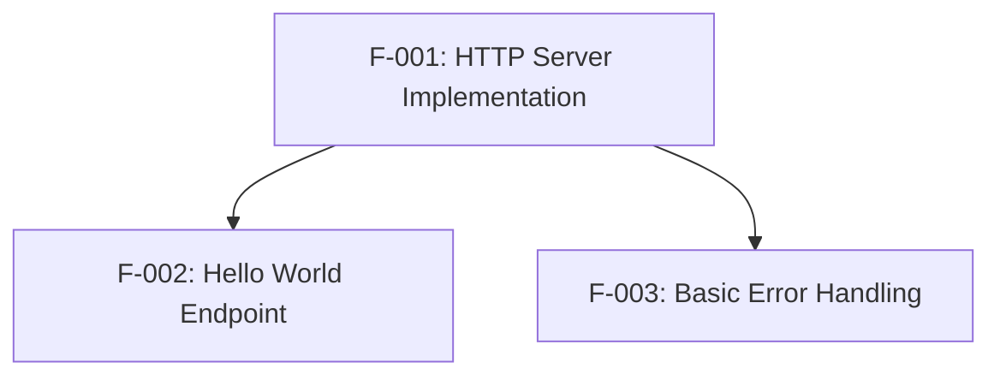
```mermaid
graph TD
    F001[F-001: HTTP Server Implementation]
    F002[F-002: Hello World Endpoint]
    F003[F-003: Basic Error Handling]
    
    F001 --> F002
    F001 --> F003
```

### 2.4 IMPLEMENTATION CONSIDERATIONS

#### F-001: HTTP Server Implementation

| Consideration | Description |
|---------------|-------------|
| Technical Constraints | Use only Node.js standard library or minimal dependencies |
| Performance Requirements | Low memory footprint, quick startup time |
| Scalability Considerations | None for tutorial project |
| Security Implications | None for basic implementation |
| Maintenance Requirements | Simple code structure for easy understanding |

#### F-002: Hello World Endpoint

| Consideration | Description |
|---------------|-------------|
| Technical Constraints | Implement as plain text response |
| Performance Requirements | Fast response time |
| Scalability Considerations | None for tutorial project |
| Security Implications | None for basic implementation |
| Maintenance Requirements | Clear documentation of endpoint behavior |

#### F-003: Basic Error Handling

| Consideration | Description |
|---------------|-------------|
| Technical Constraints | Use standard Node.js error handling patterns |
| Performance Requirements | Minimal overhead for error handling |
| Scalability Considerations | None for tutorial project |
| Security Implications | Ensure no sensitive information in error responses |
| Maintenance Requirements | Clear error messages for debugging |

## 3. TECHNOLOGY STACK

### 3.1 PROGRAMMING LANGUAGES

| Language | Version | Component | Justification |
|----------|---------|-----------|---------------|
| JavaScript | ES2022+ | Server | Industry standard for Node.js development with modern language features |
| Node.js | 18.x LTS | Runtime | Long-term support version offering stability and performance for server applications |

JavaScript is the natural choice for this project as it's the native language of the Node.js platform. Using the latest ECMAScript features supported in Node.js 18.x LTS provides a good balance between modern syntax and stable runtime support.

### 3.2 FRAMEWORKS & LIBRARIES

| Framework/Library | Version | Purpose | Justification |
|-------------------|---------|---------|---------------|
| Node.js HTTP module | Native | Core server | Minimal dependency approach for educational purposes |
| Express.js (optional) | 4.18.x | Web framework | Simplifies routing and middleware if slightly more abstraction is desired |

For this minimal Hello World application, two approaches are viable:

1. **Native HTTP module**: Provides the most educational value by exposing the raw mechanics of HTTP servers in Node.js without abstractions.
2. **Express.js**: Optional lightweight framework that simplifies request handling while still maintaining clarity for educational purposes.

The native HTTP module is recommended as the primary approach to demonstrate fundamental Node.js concepts without additional dependencies.

### 3.3 OPEN SOURCE DEPENDENCIES

| Dependency | Version | Purpose | Source |
|------------|---------|---------|--------|
| None required | - | - | - |

This project intentionally avoids external dependencies to maintain simplicity and focus on core Node.js functionality. If Express.js is selected as an alternative implementation, it would be the only dependency, sourced from npm.

### 3.4 DEVELOPMENT & DEPLOYMENT

| Tool | Version | Purpose | Justification |
|------|---------|---------|---------------|
| npm | 9.x+ | Package management | Standard package manager for Node.js ecosystem |
| nodemon | 2.0.x | Development server | Optional tool for automatic server restarts during development |
| ESLint | 8.x | Code quality | Optional tool for maintaining code quality standards |

Development tools are kept minimal, focusing only on essential components needed for a simple HTTP server implementation. Nodemon and ESLint are optional but recommended for an improved development experience.

#### Development Environment Setup


```mermaid
flowchart LR
    A[Developer Machine] --> B[Node.js 18.x LTS]
    B --> C[npm]
    C --> D[Project Dependencies]
    D --> E[Development Server]
    E --> F[Browser/HTTP Client]
```

#### Deployment Options

| Deployment Option | Complexity | Use Case |
|-------------------|------------|----------|
| Local Node.js | Low | Development and learning |
| Simple hosting | Low | Demonstration purposes |

For this educational project, complex deployment configurations are unnecessary. The application can run directly with Node.js on any system with the runtime installed.

## 4. PROCESS FLOWCHART

### 4.1 SYSTEM WORKFLOWS

#### 4.1.1 Core Business Processes

##### HTTP Request Processing Workflow

```mermaid
flowchart TD
    A[Start: Client Request] -->|HTTP Request| B{Valid Path?}
    B -->|Yes: /hello| C[Process Hello Endpoint]
    B -->|No: Other Path| D[Generate 404 Response]
    C --> E[Generate 200 Response]
    E --> F[Return "Hello world"]
    D --> G[Return "Not Found"]
    F --> H[End: Response Sent]
    G --> H
```

##### Server Lifecycle Workflow

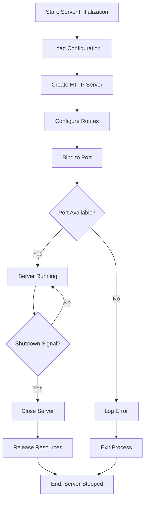
```mermaid
flowchart TD
    A[Start: Server Initialization] --> B[Load Configuration]
    B --> C[Create HTTP Server]
    C --> D[Configure Routes]
    D --> E[Bind to Port]
    E --> F{Port Available?}
    F -->|Yes| G[Server Running]
    F -->|No| H[Log Error]
    H --> I[Exit Process]
    G --> J{Shutdown Signal?}
    J -->|No| G
    J -->|Yes| K[Close Server]
    K --> L[Release Resources]
    L --> M[End: Server Stopped]
    I --> M
```

#### 4.1.2 Integration Workflows

##### Client-Server Interaction Flow

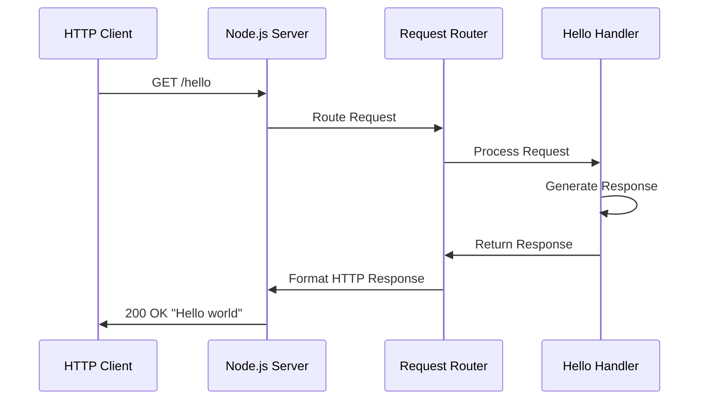
```mermaid
sequenceDiagram
    participant Client as HTTP Client
    participant Server as Node.js Server
    participant Router as Request Router
    participant Handler as Hello Handler
    
    Client->>Server: GET /hello
    Server->>Router: Route Request
    Router->>Handler: Process Request
    Handler->>Handler: Generate Response
    Handler->>Router: Return Response
    Router->>Server: Format HTTP Response
    Server->>Client: 200 OK "Hello world"
```

##### Error Handling Flow

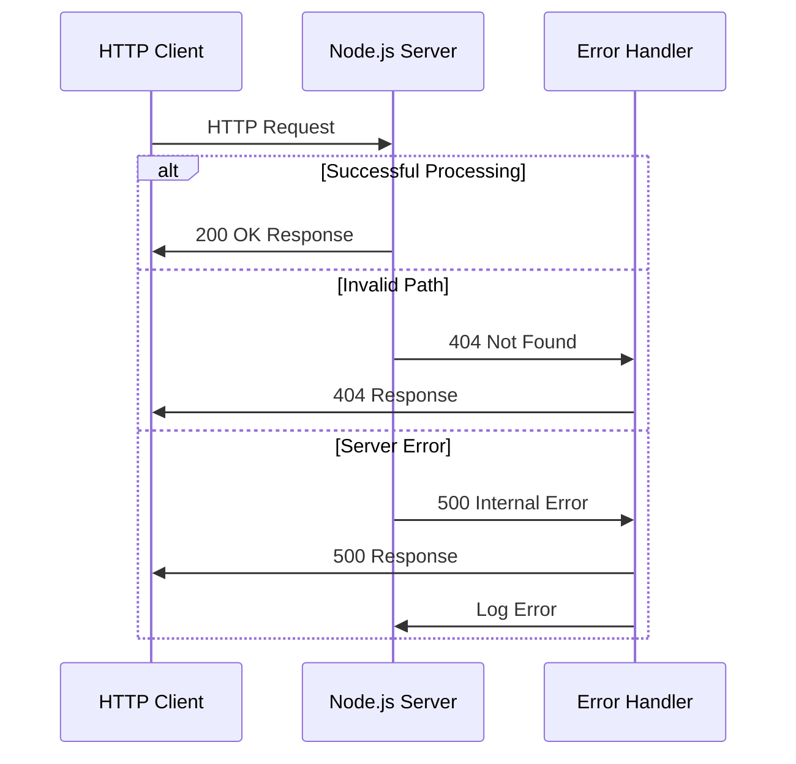
```mermaid
sequenceDiagram
    participant Client as HTTP Client
    participant Server as Node.js Server
    participant ErrorHandler as Error Handler
    
    Client->>Server: HTTP Request
    
    alt Successful Processing
        Server->>Client: 200 OK Response
    else Invalid Path
        Server->>ErrorHandler: 404 Not Found
        ErrorHandler->>Client: 404 Response
    else Server Error
        Server->>ErrorHandler: 500 Internal Error
        ErrorHandler->>Client: 500 Response
        ErrorHandler->>Server: Log Error
    end
```

### 4.2 FLOWCHART REQUIREMENTS

#### 4.2.1 Hello Endpoint Workflow

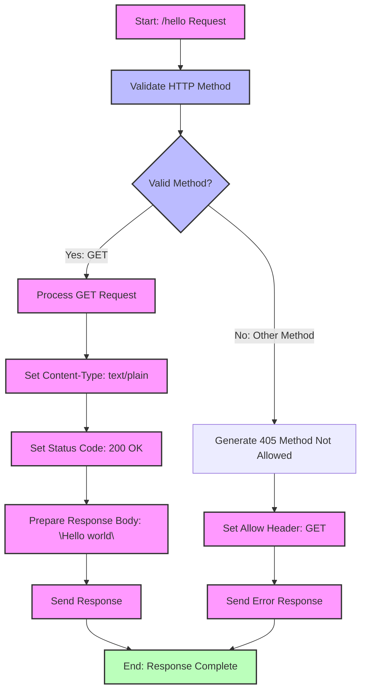
```mermaid
flowchart TD
    A[Start: /hello Request] --> B[Validate HTTP Method]
    B --> C{Valid Method?}
    C -->|Yes: GET| D[Process GET Request]
    C -->|No: Other Method| E[Generate 405 Method Not Allowed]
    D --> F[Set Content-Type: text/plain]
    F --> G[Set Status Code: 200 OK]
    G --> H["Prepare Response Body: \"Hello world\""]
    H --> I[Send Response]
    E --> J[Set Allow Header: GET]
    J --> K[Send Error Response]
    I --> L[End: Response Complete]
    K --> L
    
    classDef process fill:#f9f,stroke:#333,stroke-width:2px;
    classDef decision fill:#bbf,stroke:#333,stroke-width:2px;
    classDef endpoint fill:#bfb,stroke:#333,stroke-width:2px;
    
    class A,D,F,G,H,I,J,K process;
    class B,C decision;
    class L endpoint;
```

#### 4.2.2 Server Startup Workflow

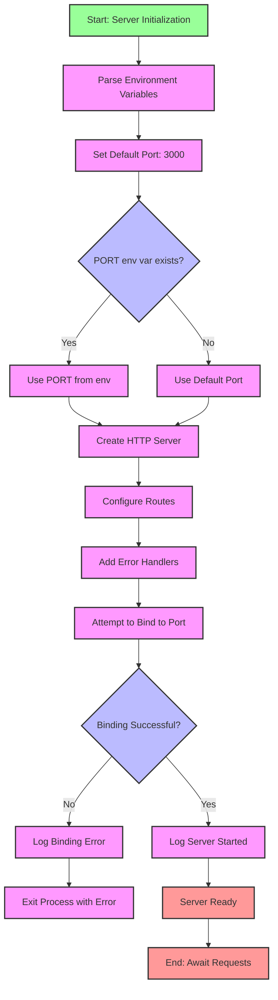
```mermaid
flowchart TD
    A[Start: Server Initialization] --> B[Parse Environment Variables]
    B --> C[Set Default Port: 3000]
    C --> D{PORT env var exists?}
    D -->|Yes| E[Use PORT from env]
    D -->|No| F[Use Default Port]
    E --> G[Create HTTP Server]
    F --> G
    G --> H[Configure Routes]
    H --> I[Add Error Handlers]
    I --> J[Attempt to Bind to Port]
    J --> K{Binding Successful?}
    K -->|Yes| L[Log Server Started]
    K -->|No| M[Log Binding Error]
    M --> N[Exit Process with Error]
    L --> O[Server Ready]
    O --> P[End: Await Requests]
    
    classDef start fill:#9f9,stroke:#333,stroke-width:2px;
    classDef process fill:#f9f,stroke:#333,stroke-width:2px;
    classDef decision fill:#bbf,stroke:#333,stroke-width:2px;
    classDef endState fill:#f99,stroke:#333,stroke-width:2px;
    
    class A start;
    class B,C,E,F,G,H,I,J,L,M,N process;
    class D,K decision;
    class O,P endState;
```

#### 4.2.3 Error Handling Workflow

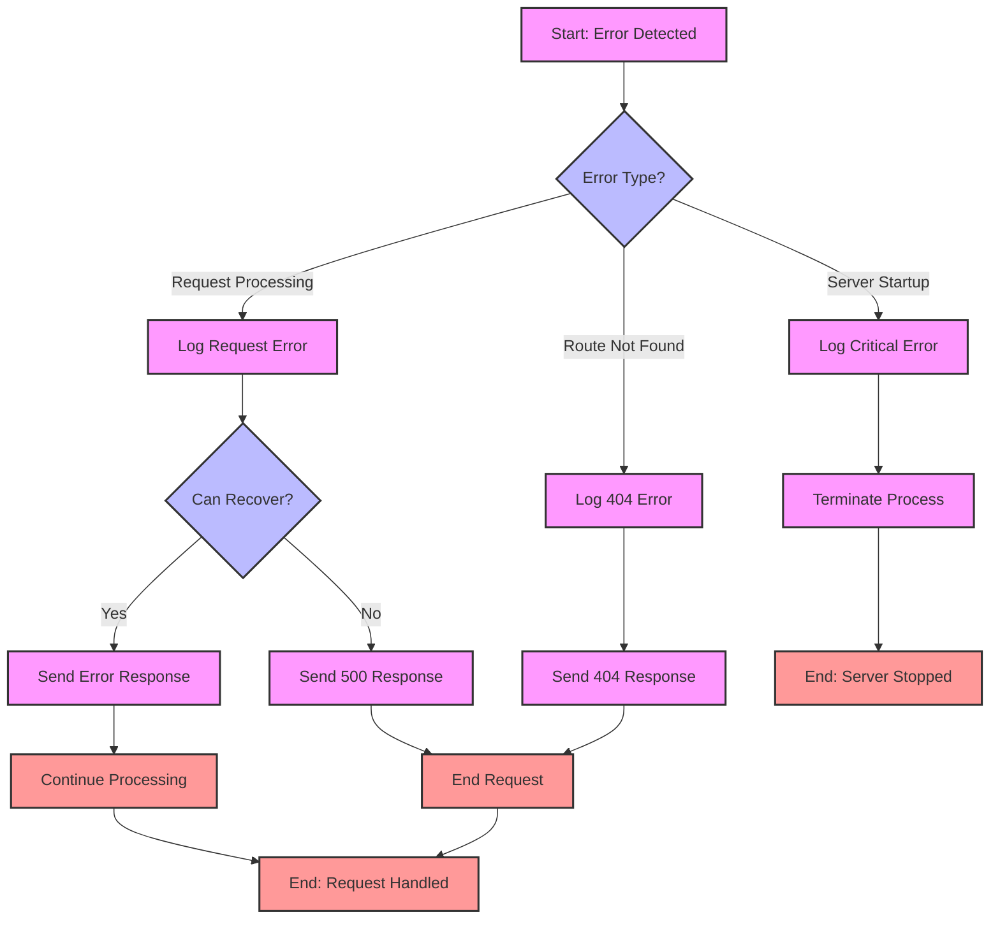
```mermaid
flowchart TD
    A[Start: Error Detected] --> B{Error Type?}
    B -->|Server Startup| C[Log Critical Error]
    B -->|Request Processing| D[Log Request Error]
    B -->|Route Not Found| E[Log 404 Error]
    C --> F[Terminate Process]
    D --> G{Can Recover?}
    G -->|Yes| H[Send Error Response]
    G -->|No| I[Send 500 Response]
    E --> J[Send 404 Response]
    H --> K[Continue Processing]
    I --> L[End Request]
    J --> L
    F --> M[End: Server Stopped]
    K --> N[End: Request Handled]
    L --> N
    
    classDef error fill:#f99,stroke:#333,stroke-width:2px;
    classDef process fill:#f9f,stroke:#333,stroke-width:2px;
    classDef decision fill:#bbf,stroke:#333,stroke-width:2px;
    
    class A,C,D,E,F,H,I,J process;
    class B,G decision;
    class M,N,K,L error;
```

### 4.3 VALIDATION RULES

#### 4.3.1 Request Validation Flow

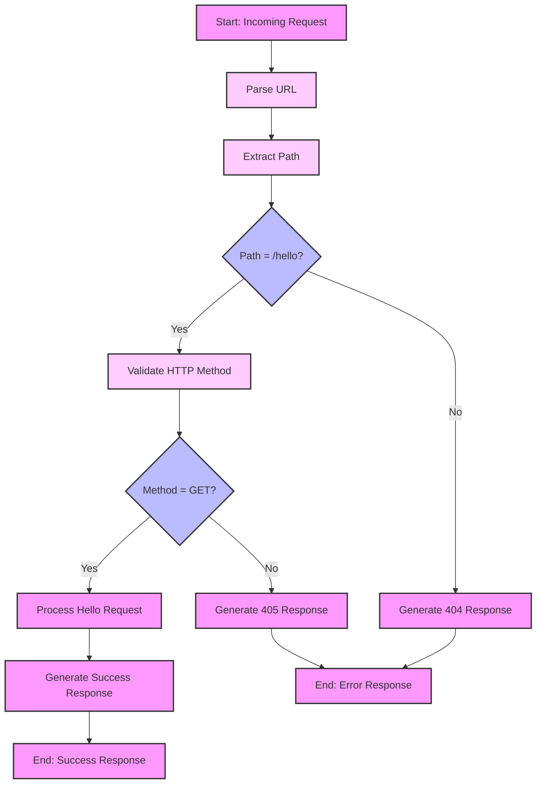
```mermaid
flowchart TD
    A[Start: Incoming Request] --> B[Parse URL]
    B --> C[Extract Path]
    C --> D{Path = /hello?}
    D -->|Yes| E[Validate HTTP Method]
    D -->|No| F[Generate 404 Response]
    E --> G{Method = GET?}
    G -->|Yes| H[Process Hello Request]
    G -->|No| I[Generate 405 Response]
    H --> J[Generate Success Response]
    F --> K[End: Error Response]
    I --> K
    J --> L[End: Success Response]
    
    classDef validation fill:#fcf,stroke:#333,stroke-width:2px;
    classDef process fill:#f9f,stroke:#333,stroke-width:2px;
    classDef decision fill:#bbf,stroke:#333,stroke-width:2px;
    
    class B,C,E validation;
    class A,F,H,I,J process;
    class D,G decision;
    class K,L process;
```

### 4.4 TECHNICAL IMPLEMENTATION

#### 4.4.1 State Management

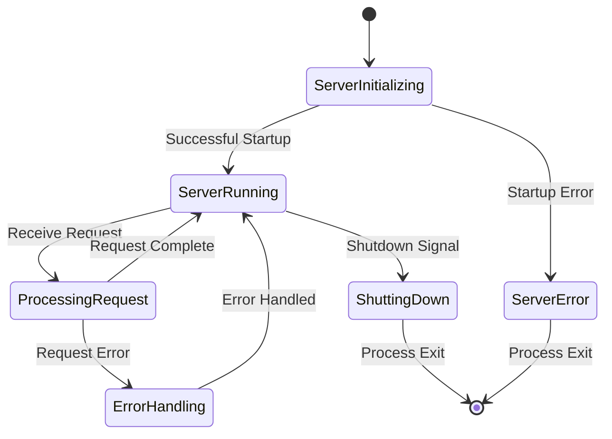
```mermaid
stateDiagram-v2
    [*] --> ServerInitializing
    ServerInitializing --> ServerRunning: Successful Startup
    ServerInitializing --> ServerError: Startup Error
    ServerRunning --> ProcessingRequest: Receive Request
    ProcessingRequest --> ServerRunning: Request Complete
    ProcessingRequest --> ErrorHandling: Request Error
    ErrorHandling --> ServerRunning: Error Handled
    ServerRunning --> ShuttingDown: Shutdown Signal
    ShuttingDown --> [*]: Process Exit
    ServerError --> [*]: Process Exit
```

#### 4.4.2 Error Handling Implementation

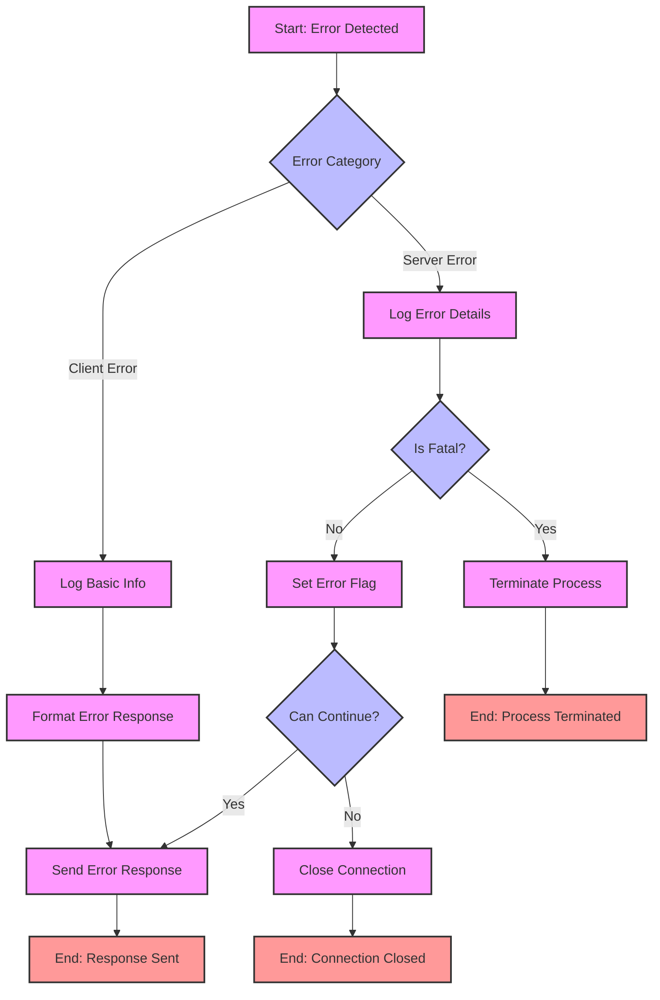
```mermaid
flowchart TD
    A[Start: Error Detected] --> B{Error Category}
    B -->|Server Error| C[Log Error Details]
    B -->|Client Error| D[Log Basic Info]
    C --> E{Is Fatal?}
    E -->|Yes| F[Terminate Process]
    E -->|No| G[Set Error Flag]
    D --> H[Format Error Response]
    G --> I{Can Continue?}
    I -->|Yes| J[Send Error Response]
    I -->|No| K[Close Connection]
    H --> J
    F --> L[End: Process Terminated]
    J --> M[End: Response Sent]
    K --> N[End: Connection Closed]
    
    classDef error fill:#f99,stroke:#333,stroke-width:2px;
    classDef process fill:#f9f,stroke:#333,stroke-width:2px;
    classDef decision fill:#bbf,stroke:#333,stroke-width:2px;
    
    class A,C,D,F,G,H,J,K process;
    class B,E,I decision;
    class L,M,N error;
```

### 4.5 INTEGRATION SEQUENCE DIAGRAMS

#### 4.5.1 Successful Request Sequence

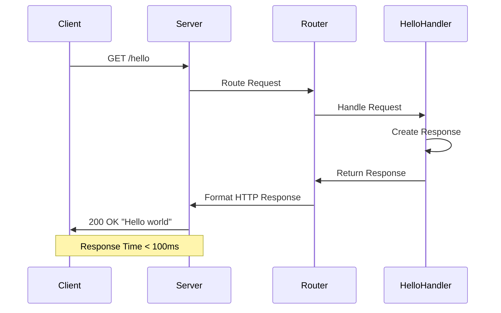
```mermaid
sequenceDiagram
    participant Client
    participant Server
    participant Router
    participant HelloHandler
    
    Client->>Server: GET /hello
    Server->>Router: Route Request
    Router->>HelloHandler: Handle Request
    HelloHandler->>HelloHandler: Create Response
    HelloHandler->>Router: Return Response
    Router->>Server: Format HTTP Response
    Server->>Client: 200 OK "Hello world"
    
    Note over Client,Server: Response Time < 100ms
```

#### 4.5.2 Error Handling Sequence

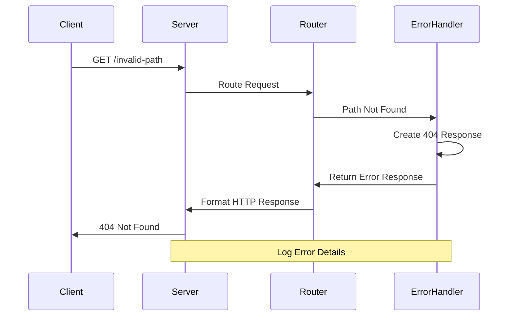
```mermaid
sequenceDiagram
    participant Client
    participant Server
    participant Router
    participant ErrorHandler
    
    Client->>Server: GET /invalid-path
    Server->>Router: Route Request
    Router->>ErrorHandler: Path Not Found
    ErrorHandler->>ErrorHandler: Create 404 Response
    ErrorHandler->>Router: Return Error Response
    Router->>Server: Format HTTP Response
    Server->>Client: 404 Not Found
    
    Note over Server,ErrorHandler: Log Error Details
```

#### 4.5.3 Server Lifecycle Sequence

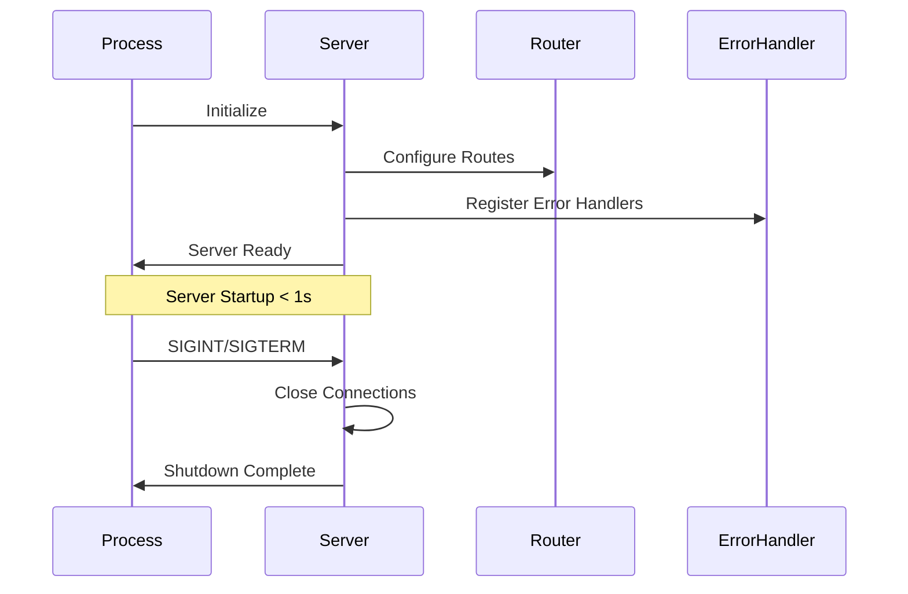
```mermaid
sequenceDiagram
    participant Process
    participant Server
    participant Router
    participant ErrorHandler
    
    Process->>Server: Initialize
    Server->>Router: Configure Routes
    Server->>ErrorHandler: Register Error Handlers
    Server->>Process: Server Ready
    
    Note over Process,Server: Server Startup < 1s
    
    Process->>Server: SIGINT/SIGTERM
    Server->>Server: Close Connections
    Server->>Process: Shutdown Complete
```

## 5. SYSTEM ARCHITECTURE

### 5.1 HIGH-LEVEL ARCHITECTURE

#### 5.1.1 System Overview

The Node.js Hello World service follows a simple, monolithic architecture designed for educational purposes. The architecture employs:

- **Architectural Style**: Lightweight RESTful service using a single-tier architecture
- **Key Principles**:
  - Simplicity: Minimizing components and dependencies to focus on core Node.js concepts
  - Statelessness: Following REST principles with no client state maintained between requests
  - Modularity: Separating concerns between server initialization, request routing, and response handling
- **System Boundaries**: Self-contained Node.js application with a clearly defined HTTP interface
- **Major Interfaces**: Single REST endpoint exposed via HTTP protocol

The architecture intentionally avoids unnecessary complexity, focusing on demonstrating fundamental Node.js HTTP server concepts with clean separation of concerns.

#### 5.1.2 Core Components Table

| Component Name | Primary Responsibility | Key Dependencies | Critical Considerations |
|----------------|------------------------|------------------|-------------------------|
| HTTP Server | Listen for and accept incoming HTTP connections | Node.js HTTP/HTTPS module | Port configuration, error handling |
| Request Router | Direct incoming requests to appropriate handlers based on URL path | HTTP Server | Path matching logic, HTTP method validation |
| Hello Handler | Process requests to `/hello` endpoint and generate responses | Request Router | Response formatting, content type |
| Error Handler | Manage error conditions and generate appropriate error responses | HTTP Server, Request Router | Consistent error formats, logging |

#### 5.1.3 Data Flow Description

The data flow in this system is straightforward and unidirectional:

1. Client sends an HTTP request to the server's listening port
2. HTTP Server component receives the raw request
3. Request Router examines the URL path and HTTP method
4. For `/hello` path with GET method, the Hello Handler is invoked
5. Hello Handler generates a plain text "Hello world" response
6. Response flows back through the HTTP Server to the client
7. For invalid paths or methods, the Error Handler generates appropriate error responses

No data persistence is required, and no data transformation occurs beyond basic HTTP protocol handling. The system maintains no state between requests, adhering to RESTful principles.

#### 5.1.4 External Integration Points

| System Name | Integration Type | Data Exchange Pattern | Protocol/Format |
|-------------|------------------|------------------------|-----------------|
| HTTP Clients | Synchronous API | Request-Response | HTTP/Plain Text |

### 5.2 COMPONENT DETAILS

#### 5.2.1 HTTP Server Component

- **Purpose**: Initialize and manage the HTTP server, listening for incoming connections
- **Responsibilities**:
  - Configure server port and host settings
  - Establish HTTP listener
  - Forward incoming requests to the router
  - Handle server-level errors
- **Technologies**: Node.js native HTTP module
- **Key Interfaces**: 
  - Server initialization function
  - Request event handler
- **Scaling Considerations**: None required for educational purposes

#### 5.2.2 Request Router Component

- **Purpose**: Direct incoming requests to appropriate handler functions
- **Responsibilities**:
  - Parse URL paths from incoming requests
  - Match paths to registered handlers
  - Validate HTTP methods
  - Invoke appropriate handler or error handler
- **Technologies**: Native JavaScript routing logic
- **Key Interfaces**:
  - Route registration function
  - Request handling function
- **Scaling Considerations**: None required for educational purposes

#### 5.2.3 Hello Handler Component

- **Purpose**: Process requests to the `/hello` endpoint
- **Responsibilities**:
  - Validate request parameters (if any)
  - Generate "Hello world" response
  - Set appropriate HTTP headers
- **Technologies**: Native JavaScript
- **Key Interfaces**:
  - Handler function accepting request and response objects
- **Scaling Considerations**: None required for educational purposes

#### 5.2.4 Error Handler Component

- **Purpose**: Manage error conditions and generate appropriate responses
- **Responsibilities**:
  - Handle 404 Not Found errors
  - Handle 405 Method Not Allowed errors
  - Handle unexpected server errors
  - Log error details
- **Technologies**: Native JavaScript error handling
- **Key Interfaces**:
  - Error handling functions for different error types
- **Scaling Considerations**: None required for educational purposes

#### 5.2.5 Component Interaction Diagram

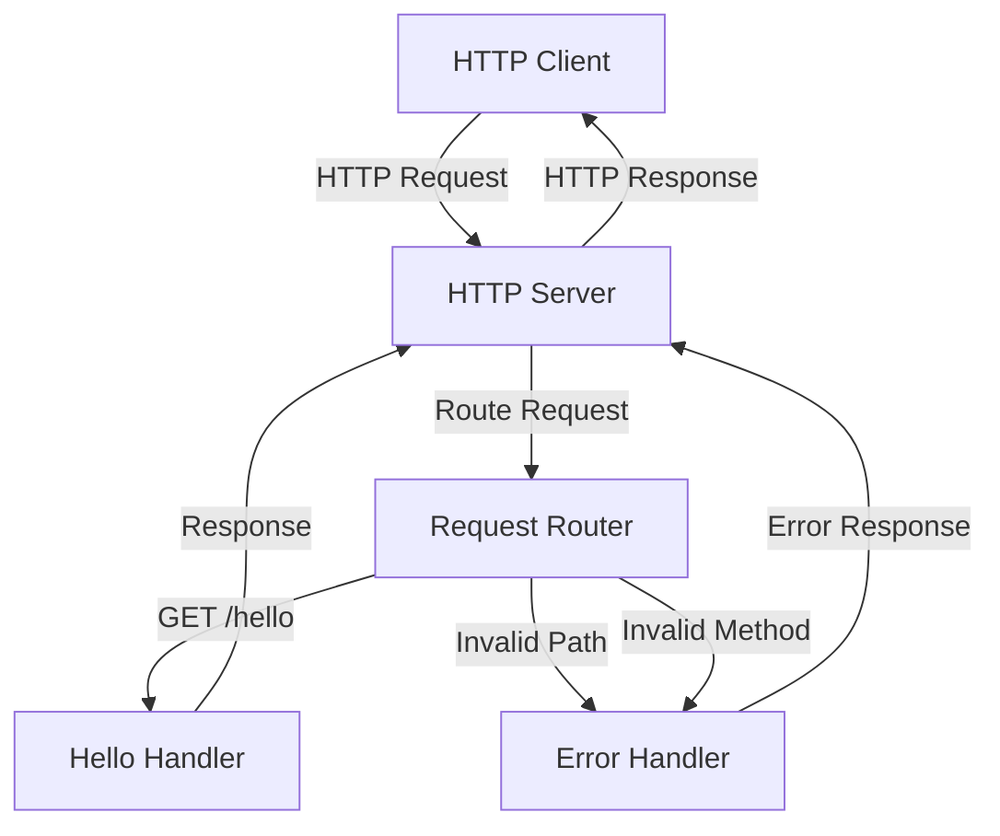
```mermaid
graph TD
    Client[HTTP Client] -->|HTTP Request| Server[HTTP Server]
    Server -->|Route Request| Router[Request Router]
    Router -->|GET /hello| HelloHandler[Hello Handler]
    Router -->|Invalid Path| ErrorHandler[Error Handler]
    Router -->|Invalid Method| ErrorHandler
    HelloHandler -->|Response| Server
    ErrorHandler -->|Error Response| Server
    Server -->|HTTP Response| Client
```

#### 5.2.6 Request Processing Sequence Diagram

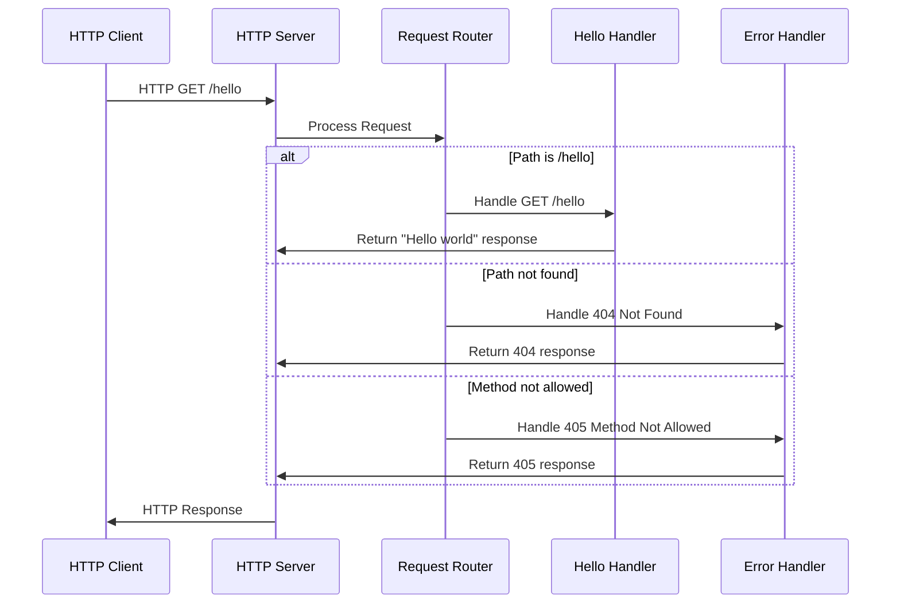
```mermaid
sequenceDiagram
    participant Client as HTTP Client
    participant Server as HTTP Server
    participant Router as Request Router
    participant Handler as Hello Handler
    participant ErrHandler as Error Handler
    
    Client->>Server: HTTP GET /hello
    Server->>Router: Process Request
    
    alt Path is /hello
        Router->>Handler: Handle GET /hello
        Handler->>Server: Return "Hello world" response
    else Path not found
        Router->>ErrHandler: Handle 404 Not Found
        ErrHandler->>Server: Return 404 response
    else Method not allowed
        Router->>ErrHandler: Handle 405 Method Not Allowed
        ErrHandler->>Server: Return 405 response
    end
    
    Server->>Client: HTTP Response
```

### 5.3 TECHNICAL DECISIONS

#### 5.3.1 Architecture Style Decisions

| Decision | Selected Approach | Alternatives Considered | Rationale |
|----------|-------------------|-------------------------|-----------|
| Server Architecture | Single-file monolith | Modular structure, MVC pattern | Simplicity for educational purposes |
| HTTP Implementation | Native Node.js HTTP module | Express.js, Fastify, Koa | Demonstrate core Node.js capabilities without abstractions |
| Response Format | Plain text | JSON, HTML | Simplicity and focus on core concepts |

The architecture intentionally prioritizes simplicity and educational value over production-ready features. A single-file implementation using native Node.js modules provides the clearest demonstration of core concepts without the overhead of learning additional frameworks.

#### 5.3.2 Communication Pattern Decisions

| Decision | Selected Approach | Alternatives Considered | Rationale |
|----------|-------------------|-------------------------|-----------|
| Client-Server Communication | Synchronous HTTP | WebSockets, GraphQL | Standard REST approach for simplicity |
| Error Communication | Standard HTTP status codes | Custom error format | Adherence to HTTP standards |

Synchronous HTTP request-response patterns provide the most straightforward demonstration of web service concepts. This approach follows standard REST principles and HTTP conventions.

#### 5.3.3 Architecture Decision Record: HTTP Implementation

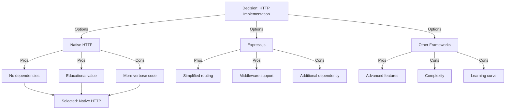
```mermaid
graph TD
    A[Decision: HTTP Implementation] -->|Options| B[Native HTTP]
    A -->|Options| C[Express.js]
    A -->|Options| D[Other Frameworks]
    
    B -->|Pros| E[No dependencies]
    B -->|Pros| F[Educational value]
    B -->|Cons| G[More verbose code]
    
    C -->|Pros| H[Simplified routing]
    C -->|Pros| I[Middleware support]
    C -->|Cons| J[Additional dependency]
    
    D -->|Pros| K[Advanced features]
    D -->|Cons| L[Complexity]
    D -->|Cons| M[Learning curve]
    
    E --> N[Selected: Native HTTP]
    F --> N
    G --> N
```

### 5.4 CROSS-CUTTING CONCERNS

#### 5.4.1 Error Handling Patterns

For this simple application, error handling focuses on three primary scenarios:

1. **Server Startup Errors**: Handled at process level with appropriate logging
2. **Route Not Found (404)**: Handled by the router with standard 404 responses
3. **Method Not Allowed (405)**: Handled by the router with standard 405 responses

The error handling approach prioritizes:
- Clear error messages for educational purposes
- Standard HTTP status codes
- Graceful handling of all error conditions

#### 5.4.2 Error Handling Flow

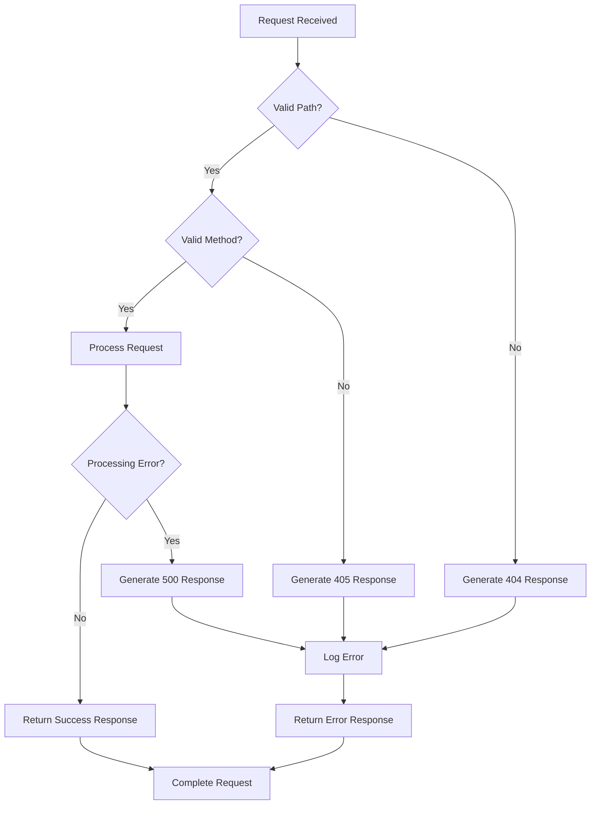
```mermaid
flowchart TD
    A[Request Received] --> B{Valid Path?}
    B -->|Yes| C{Valid Method?}
    B -->|No| D[Generate 404 Response]
    C -->|Yes| E[Process Request]
    C -->|No| F[Generate 405 Response]
    
    E --> G{Processing Error?}
    G -->|No| H[Return Success Response]
    G -->|Yes| I[Generate 500 Response]
    
    D --> J[Log Error]
    F --> J
    I --> J
    
    J --> K[Return Error Response]
    H --> L[Complete Request]
    K --> L
```

#### 5.4.3 Logging Strategy

| Log Type | Content | Purpose | Implementation |
|----------|---------|---------|----------------|
| Access Logs | Request method, path, status code, response time | Request tracking | Console output |
| Error Logs | Error details, stack trace | Debugging | Console error output |
| Startup Logs | Port, host information | Configuration verification | Console output |

For this educational application, logging is kept simple with console output. In a production environment, structured logging with proper log levels would be implemented.

#### 5.4.4 Performance Considerations

While performance is not a primary concern for this educational application, the implementation follows these basic principles:

- Minimal memory footprint
- Quick startup time
- Fast response generation
- No blocking operations

These considerations ensure the application demonstrates good practices even in its simplicity.

## 6. SYSTEM COMPONENTS DESIGN

### 6.1 COMPONENT ARCHITECTURE

#### 6.1.1 Component Diagram

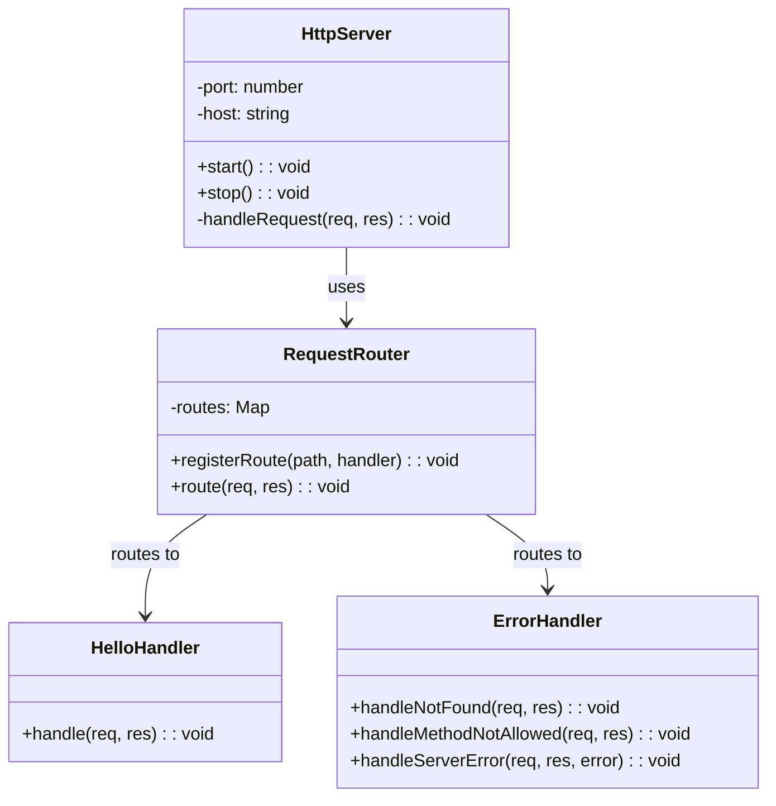
```mermaid
classDiagram
    class HttpServer {
        -port: number
        -host: string
        +start(): void
        +stop(): void
        -handleRequest(req, res): void
    }
    
    class RequestRouter {
        -routes: Map
        +registerRoute(path, handler): void
        +route(req, res): void
    }
    
    class HelloHandler {
        +handle(req, res): void
    }
    
    class ErrorHandler {
        +handleNotFound(req, res): void
        +handleMethodNotAllowed(req, res): void
        +handleServerError(req, res, error): void
    }
    
    HttpServer --> RequestRouter: uses
    RequestRouter --> HelloHandler: routes to
    RequestRouter --> ErrorHandler: routes to
```

#### 6.1.2 Component Responsibilities

| Component | Primary Responsibility | Secondary Responsibilities |
|-----------|------------------------|----------------------------|
| HttpServer | Initialize and manage HTTP server | Handle server lifecycle, process incoming connections |
| RequestRouter | Route requests to appropriate handlers | Validate request paths and methods |
| HelloHandler | Process requests to `/hello` endpoint | Generate "Hello world" responses |
| ErrorHandler | Handle error conditions | Generate appropriate error responses, log errors |

#### 6.1.3 Component Interactions

```mermaid
sequenceDiagram
    participant Client
    participant HttpServer
    participant RequestRouter
    participant HelloHandler
    participant ErrorHandler
    
    Client->>HttpServer: HTTP Request
    HttpServer->>RequestRouter: route(req, res)
    
    alt Path is /hello
        RequestRouter->>HelloHandler: handle(req, res)
        HelloHandler-->>Client: "Hello world" response
    else Path not found
        RequestRouter->>ErrorHandler: handleNotFound(req, res)
        ErrorHandler-->>Client: 404 Not Found response
    else Method not allowed
        RequestRouter->>ErrorHandler: handleMethodNotAllowed(req, res)
        ErrorHandler-->>Client: 405 Method Not Allowed response
    end
```

### 6.2 MODULE DESIGN

#### 6.2.1 Module Structure

| Module | File | Purpose | Dependencies |
|--------|------|---------|--------------|
| Server | server.js | Main entry point, server initialization | http (Node.js core) |
| Router | router.js | Request routing logic | None |
| HelloHandler | handlers/hello.js | `/hello` endpoint handler | None |
| ErrorHandler | handlers/error.js | Error handling functions | None |
| Config | config.js | Configuration settings | None |

#### 6.2.2 Module Interfaces

**Server Module Interface**
```
start(): Promise<void> - Starts the HTTP server
stop(): Promise<void> - Stops the HTTP server
```

**Router Module Interface**
```
registerRoute(path: string, method: string, handler: Function): void - Registers a route handler
route(req: IncomingMessage, res: ServerResponse): void - Routes an incoming request
```

**HelloHandler Module Interface**
```
handle(req: IncomingMessage, res: ServerResponse): void - Handles requests to /hello endpoint
```

**ErrorHandler Module Interface**
```
handleNotFound(req: IncomingMessage, res: ServerResponse): void - Handles 404 errors
handleMethodNotAllowed(req: IncomingMessage, res: ServerResponse): void - Handles 405 errors
handleServerError(req: IncomingMessage, res: ServerResponse, error: Error): void - Handles 500 errors
```

**Config Module Interface**
```
PORT: number - Server port number
HOST: string - Server host address
```

### 6.3 DATA STRUCTURES

#### 6.3.1 Request Object Structure

| Property | Type | Description |
|----------|------|-------------|
| url | string | The URL of the request |
| method | string | The HTTP method (GET, POST, etc.) |
| headers | object | HTTP headers as key-value pairs |

#### 6.3.2 Response Object Structure

| Property/Method | Type | Description |
|-----------------|------|-------------|
| statusCode | number | HTTP status code |
| setHeader() | function | Sets a response header |
| write() | function | Writes response body data |
| end() | function | Ends the response |

#### 6.3.3 Route Definition Structure

| Property | Type | Description |
|----------|------|-------------|
| path | string | URL path to match |
| method | string | HTTP method to match |
| handler | function | Function to handle matching requests |

### 6.4 ALGORITHM DESIGN

#### 6.4.1 Request Routing Algorithm

```mermaid
flowchart TD
    A[Receive HTTP Request] --> B[Parse URL Path]
    B --> C[Normalize Path]
    C --> D{Path Exists in Routes?}
    D -->|Yes| E{Method Allowed?}
    D -->|No| F[Return 404 Not Found]
    E -->|Yes| G[Execute Handler]
    E -->|No| H[Return 405 Method Not Allowed]
    G --> I[Generate Response]
    I --> J[Send Response to Client]
    F --> J
    H --> J
```

#### 6.4.2 Hello Handler Algorithm

```mermaid
flowchart TD
    A[Receive Request] --> B{Is GET Method?}
    B -->|Yes| C[Set Content-Type: text/plain]
    B -->|No| D[Return 405 Method Not Allowed]
    C --> E[Set Status Code: 200 OK]
    E --> F["Write 'Hello world' to Response"]
    F --> G[End Response]
    D --> G
```

#### 6.4.3 Error Handling Algorithm

```mermaid
flowchart TD
    A[Error Detected] --> B{Error Type?}
    B -->|Not Found| C[Set Status Code: 404]
    B -->|Method Not Allowed| D[Set Status Code: 405]
    B -->|Server Error| E[Set Status Code: 500]
    C --> F[Set Content-Type: text/plain]
    D --> F
    E --> F
    F --> G[Write Error Message to Response]
    G --> H[Log Error Details]
    H --> I[End Response]
```

### 6.5 INTERFACE DESIGN

#### 6.5.1 API Endpoints

| Endpoint | Method | Description | Response Format | Status Codes |
|----------|--------|-------------|-----------------|--------------|
| /hello | GET | Returns "Hello world" | text/plain | 200, 405 |
| * | * | Any other path/method | text/plain | 404, 405 |

#### 6.5.2 Response Format Specifications

**Success Response (200 OK)**
```
Content-Type: text/plain
Status: 200 OK
Body: Hello world
```

**Not Found Response (404)**
```
Content-Type: text/plain
Status: 404 Not Found
Body: Not Found
```

**Method Not Allowed Response (405)**
```
Content-Type: text/plain
Status: 405 Method Not Allowed
Allow: GET
Body: Method Not Allowed
```

**Server Error Response (500)**
```
Content-Type: text/plain
Status: 500 Internal Server Error
Body: Internal Server Error
```

### 6.6 ERROR HANDLING DESIGN

#### 6.6.1 Error Types and Responses

| Error Type | HTTP Status | Response Body | Additional Headers |
|------------|-------------|---------------|-------------------|
| Not Found | 404 | Not Found | None |
| Method Not Allowed | 405 | Method Not Allowed | Allow: GET |
| Server Error | 500 | Internal Server Error | None |

#### 6.6.2 Error Logging Strategy

| Error Type | Log Level | Information Logged |
|------------|-----------|-------------------|
| Not Found | INFO | Request path, method, timestamp |
| Method Not Allowed | INFO | Request path, method, timestamp |
| Server Error | ERROR | Error message, stack trace, request details, timestamp |

#### 6.6.3 Error Recovery Mechanisms

For this simple application, error recovery is straightforward:

1. **Request-level errors** (404, 405): Return appropriate status code and continue processing new requests
2. **Server-level errors** (500): Log error, return error response, and continue if possible
3. **Fatal errors**: Log error and exit process (to be restarted by process manager if needed)

### 6.7 CONFIGURATION DESIGN

#### 6.7.1 Configuration Parameters

| Parameter | Default Value | Environment Variable | Description |
|-----------|---------------|----------------------|-------------|
| Port | 3000 | PORT | The port number the server listens on |
| Host | '0.0.0.0' | HOST | The host address the server binds to |

#### 6.7.2 Configuration Loading Process

```mermaid
flowchart TD
    A[Start Configuration] --> B[Load Default Values]
    B --> C{Environment Variables Exist?}
    C -->|Yes| D[Override with Environment Variables]
    C -->|No| E[Use Default Values]
    D --> F[Validate Configuration]
    E --> F
    F --> G{Valid Configuration?}
    G -->|Yes| H[Return Configuration]
    G -->|No| I[Log Error and Use Fallback Values]
    I --> H
```

### 6.1 CORE SERVICES ARCHITECTURE

Core Services Architecture is not applicable for this system in its traditional sense. This Node.js Hello World application is intentionally designed as a simple, monolithic service with a single endpoint rather than a distributed system of microservices. The application consists of a single HTTP server process that handles all requests without dependencies on other services.

#### 6.1.1 Simplified Architecture Justification

| Aspect | Justification |
|--------|---------------|
| Purpose | Educational demonstration of basic Node.js HTTP server concepts |
| Complexity | Intentionally minimal to focus on fundamental concepts |
| Scale | Designed for local development and learning, not production-scale deployment |
| Requirements | Single endpoint with static response requires no distributed architecture |

The application's architecture is deliberately simplified to serve its educational purpose. Introducing microservices, service discovery, or complex resilience patterns would add unnecessary complexity that contradicts the project's goal of demonstrating core Node.js HTTP server functionality.

#### 6.1.2 Single-Service Architecture

```mermaid
graph TD
    Client[HTTP Client] -->|HTTP Request| Server[Node.js HTTP Server]
    Server -->|"GET /hello"| Handler[Hello Handler]
    Handler -->|"Hello world"| Server
    Server -->|HTTP Response| Client
```

#### 6.1.3 Potential Future Considerations

While not currently applicable, the following table outlines how core services architecture concepts might be applied if this application were to evolve into a more complex system:

| Architecture Concept | Future Application |
|----------------------|-------------------|
| Service Boundaries | Separate API, business logic, and data access layers |
| Scaling Strategy | Horizontal scaling behind load balancer for increased traffic |
| Resilience | Health checks and automatic restarts for improved reliability |
| Service Discovery | Service registry for multiple service instances |

#### 6.1.4 Simplified Deployment Model

```mermaid
flowchart TD
    Dev[Developer] -->|Develops| Code[Node.js Application]
    Code -->|Runs on| Runtime[Node.js Runtime]
    Runtime -->|Listens on| Port[Port 3000]
    Port -->|Accessible via| Client[HTTP Client]
```

For this simple application, deployment consists of running the Node.js process on a single machine with direct client access. No complex orchestration, service mesh, or container management is required.

### 6.2 DATABASE DESIGN

Database Design is not applicable to this system. The Node.js Hello World application with a single `/hello` endpoint that returns "Hello world" does not require any persistent data storage for the following reasons:

1. **Stateless Operation**: The application operates in a completely stateless manner, with no need to persist information between requests.

2. **Static Response**: The endpoint returns a fixed, static response ("Hello world") that requires no dynamic data retrieval.

3. **No User Data**: The application does not collect, process, or store any user data that would require database storage.

4. **No Configuration Storage**: All configuration (such as port number) is handled through environment variables or defaults in the application code.

5. **No Logging Database**: While the application may generate logs, these are typically written to standard output or files rather than a database for this simple use case.

6. **No Authentication/Authorization**: The application does not implement any authentication or authorization mechanisms that would require user credentials or session storage.

7. **No Business Logic**: There is no business logic that requires data persistence, retrieval, or manipulation.

If the application were to evolve to include features such as request counting, user tracking, or dynamic content generation, a database component would become necessary. In such cases, appropriate database design considerations including schema design, data management strategies, compliance considerations, and performance optimization would need to be addressed.

For the current requirements, all application functionality can be implemented using in-memory processing with the Node.js runtime environment, without any database or persistent storage dependencies.

## 6.3 INTEGRATION ARCHITECTURE

For this Node.js Hello World application with a single `/hello` endpoint, the integration architecture is intentionally minimal. The system provides a simple HTTP interface for clients to interact with, but does not integrate with external systems or services beyond basic HTTP communication.

### 6.3.1 API DESIGN

#### Protocol Specifications

| Aspect | Specification |
|--------|---------------|
| Protocol | HTTP/1.1 |
| Transport | TCP |
| Format | Plain text |
| Encoding | UTF-8 |

The API uses standard HTTP/1.1 protocol for all communication, providing compatibility with any HTTP client. The single endpoint returns plain text with UTF-8 encoding for maximum simplicity and interoperability.

#### API Endpoints

| Endpoint | Method | Description | Response |
|----------|--------|-------------|----------|
| `/hello` | GET | Returns a greeting message | "Hello world" |

#### Authentication & Authorization

Authentication and authorization mechanisms are intentionally omitted from this application to maintain simplicity. The `/hello` endpoint is publicly accessible without any authentication requirements.

```mermaid
flowchart LR
    Client[HTTP Client] -->|GET /hello| Server[Node.js Server]
    Server -->|"Hello world"| Client
    
    style Client fill:#f9f,stroke:#333,stroke-width:2px
    style Server fill:#bbf,stroke:#333,stroke-width:2px
```

#### API Architecture Diagram

```mermaid
graph TD
subgraph "Node.js Hello World Service"
    Server[HTTP Server] --> Router[Request Router]
    Router --> HelloEndpoint["/hello Endpoint"]
    Router --> ErrorHandler[Error Handler]
end

Client[HTTP Client] -->|HTTP Request| Server
HelloEndpoint -->|"Hello world"| Client
ErrorHandler -->|Error Response| Client
```

#### Error Handling Strategy

| Status Code | Scenario | Response |
|-------------|----------|----------|
| 200 | Successful request to `/hello` | "Hello world" |
| 404 | Request to non-existent path | "Not Found" |
| 405 | Non-GET request to `/hello` | "Method Not Allowed" |
| 500 | Server error | "Internal Server Error" |

The API implements standard HTTP status codes for error conditions, providing clear feedback to clients about request processing status.

### 6.3.2 CLIENT INTEGRATION PATTERNS

#### Request-Response Pattern

```mermaid
sequenceDiagram
    participant Client as HTTP Client
    participant Server as Node.js Server
    
    Client->>Server: GET /hello HTTP/1.1
    Server-->>Client: HTTP/1.1 200 OK<br/>Content-Type: text/plain<br/><br/>Hello world
    
    Note over Client,Server: Simple synchronous request-response pattern
```

#### Integration Flow Diagram

```mermaid
flowchart TD
    A[Client Initiates Request] -->|HTTP GET| B[Server Receives Request]
    B -->|Parse URL| C{Is path /hello?}
    C -->|Yes| D[Generate Hello Response]
    C -->|No| E[Generate 404 Response]
    D -->|Set Headers| F[Return Response]
    E -->|Set Headers| F
    F -->|HTTP Response| G[Client Processes Response]
```

### 6.3.3 INTEGRATION CONSIDERATIONS

#### Cross-Origin Resource Sharing (CORS)

The basic implementation does not include CORS headers. If the service needs to support browser-based clients from different origins, CORS headers should be added:

```mermaid
sequenceDiagram
    participant Browser as Web Browser
    participant Server as Node.js Server
    
    Browser->>Server: OPTIONS /hello
    Server-->>Browser: HTTP/1.1 204 No Content<br/>Access-Control-Allow-Origin: *<br/>Access-Control-Allow-Methods: GET
    
    Browser->>Server: GET /hello
    Server-->>Browser: HTTP/1.1 200 OK<br/>Access-Control-Allow-Origin: *<br/>Content-Type: text/plain<br/><br/>Hello world
```

#### Content Negotiation

The current implementation returns plain text only. For more advanced integration scenarios, content negotiation could be implemented:

| Accept Header | Response Content-Type | Response Format |
|---------------|------------------------|-----------------|
| text/plain | text/plain | Hello world |
| application/json | application/json | {"message": "Hello world"} |
| text/html | text/html | \<html>\<body>Hello world\</body>\</html> |

### 6.3.4 FUTURE INTEGRATION CONSIDERATIONS

While the current implementation is intentionally minimal, the following considerations would apply for future extensions:

#### API Versioning Approach

For future API versioning, URL path versioning is recommended for simplicity:
- `/v1/hello` - Initial version
- `/v2/hello` - Future version with enhanced functionality

#### Documentation Standards

For this simple API, inline code documentation is sufficient. If the API grows more complex, consider:
- OpenAPI/Swagger specification
- API documentation generation tools
- Interactive API documentation

#### Rate Limiting Strategy

For production deployments, a simple token bucket rate limiting strategy could be implemented:
- Per-IP limits (e.g., 60 requests per minute)
- Response headers indicating rate limit status
- 429 Too Many Requests responses when limits are exceeded

### 6.3.5 MESSAGE PROCESSING

Message processing patterns such as event processing, message queues, stream processing, and batch processing are not applicable to this simple HTTP service. The application uses a straightforward request-response pattern without asynchronous messaging or complex data flows.

If the application were to evolve to include features requiring asynchronous processing or integration with other systems, appropriate message processing patterns would need to be designed and implemented.

### 6.3.6 EXTERNAL SYSTEMS

The Node.js Hello World application does not integrate with any external systems or third-party services. It operates as a standalone HTTP server without dependencies on external APIs, databases, or services.

This intentional simplicity makes the application:
- Easy to understand for educational purposes
- Simple to deploy without external dependencies
- Suitable as a starting point for more complex applications

If future requirements necessitate integration with external systems, appropriate integration patterns and service contracts would need to be designed.

### 6.4 SECURITY ARCHITECTURE

Detailed Security Architecture is not applicable for this system. The Node.js Hello World application with a single `/hello` endpoint that returns "Hello world" is intentionally designed as a minimal educational example without user data, authentication requirements, or protected resources.

#### 6.4.1 SECURITY APPROACH

For this simple application, we will follow standard security practices appropriate to its scope:

| Security Area | Approach |
|---------------|----------|
| Server Hardening | Use current Node.js LTS version with security patches |
| Network Security | Bind to specific interfaces when needed |
| Input Validation | Validate HTTP methods and paths |
| Error Handling | Return appropriate status codes without leaking system details |

#### 6.4.2 SECURITY CONSIDERATIONS

```mermaid
flowchart TD
    A[Client Request] --> B{Input Validation}
    B -->|Valid| C[Process Request]
    B -->|Invalid| D[Return Error]
    C --> E[Generate Response]
    D --> F[Log Security Event]
    E --> G[Return Response]
    F --> G
```

#### 6.4.3 STANDARD SECURITY PRACTICES

The following standard security practices will be implemented:

| Practice | Implementation |
|----------|----------------|
| HTTP Headers | Set appropriate security headers |
| Error Handling | Sanitize error messages for external users |
| Logging | Log access attempts without sensitive data |
| Dependencies | Use secure dependencies and keep updated |

##### Security Headers

| Header | Value | Purpose |
|--------|-------|---------|
| X-Content-Type-Options | nosniff | Prevent MIME type sniffing |
| X-Frame-Options | DENY | Prevent clickjacking attacks |
| Content-Security-Policy | default-src 'none' | Restrict resource loading |

##### Dependency Management

```mermaid
flowchart LR
    A[Development] --> B{Dependency Audit}
    B -->|Vulnerabilities Found| C[Update Dependencies]
    B -->|No Issues| D[Proceed with Development]
    C --> B
```

#### 6.4.4 SECURITY ZONES

```mermaid
graph TD
    subgraph "Public Zone"
        Client[HTTP Client]
    end
    
    subgraph "Application Zone"
        Server[Node.js Server]
        Router[Request Router]
        Handler[Hello Handler]
    end
    
    Client -->|HTTP Request| Server
    Server --> Router
    Router --> Handler
    Handler -->|Response| Client
```

#### 6.4.5 FUTURE SECURITY CONSIDERATIONS

If this application were to evolve beyond its educational purpose, the following security enhancements would be recommended:

| Enhancement | Purpose | Implementation Approach |
|-------------|---------|-------------------------|
| Rate Limiting | Prevent abuse | Token bucket algorithm per IP |
| HTTPS | Secure communication | TLS 1.3 with modern ciphers |
| Logging | Security monitoring | Structured logging with timestamps |
| CORS | Browser security | Appropriate origin restrictions |

#### 6.4.6 SECURITY COMPLIANCE

For this minimal application, formal security compliance frameworks are not applicable. However, the implementation will follow these basic security principles:

| Principle | Application |
|-----------|-------------|
| Least Privilege | Run with minimal required permissions |
| Defense in Depth | Validate all inputs regardless of source |
| Secure Defaults | Conservative default configuration |
| Fail Securely | Proper error handling without information leakage |

By following these standard security practices, the application will maintain an appropriate security posture for its educational purpose while demonstrating good security habits for developers.

### 6.5 MONITORING AND OBSERVABILITY

#### 6.5.1 MONITORING APPROACH

While detailed monitoring architecture is not applicable for this simple Node.js Hello World application, basic monitoring practices will be implemented to ensure service health and provide visibility into its operation.

| Monitoring Area | Implementation Approach |
|-----------------|-------------------------|
| Health Checks | Simple endpoint to verify server status |
| Basic Metrics | Request counts, response times, error rates |
| Logging | Standard output logging of requests and errors |
| Alerting | Minimal alerting for server availability |

The monitoring approach is intentionally lightweight to match the educational nature of the application while demonstrating fundamental observability practices.

#### 6.5.2 HEALTH MONITORING

##### Health Check Implementation

```mermaid
flowchart TD
    A[External Monitor] -->|GET /health| B[Node.js Server]
    B -->|Process Request| C{Server Healthy?}
    C -->|Yes| D[Return 200 OK]
    C -->|No| E[Return 503 Service Unavailable]
    D -->|Response| A
    E -->|Response| A
```

##### Health Check Endpoint

| Endpoint | Method | Response Code | Response Body | Purpose |
|----------|--------|---------------|--------------|---------|
| /health | GET | 200 OK | {"status": "up"} | Verify server is running |

#### 6.5.3 BASIC METRICS COLLECTION

##### Core Metrics

| Metric | Description | Collection Method |
|--------|-------------|------------------|
| Request Count | Total number of requests received | In-memory counter |
| Response Time | Time to process requests (ms) | Request-response timing |
| Error Rate | Percentage of requests resulting in errors | Error counter / request count |
| Memory Usage | Node.js process memory consumption | Process monitoring |

##### Metrics Implementation

```mermaid
flowchart LR
    A[HTTP Request] --> B[Request Counter]
    A --> C[Timer Start]
    D[Response Sent] --> E[Timer End]
    E --> F[Calculate Response Time]
    G[Error Detected] --> H[Error Counter]
    
    B --> I[Metrics Collection]
    F --> I
    H --> I
```

#### 6.5.4 LOGGING STRATEGY

##### Log Levels and Content

| Log Level | Events | Information Included |
|-----------|--------|----------------------|
| INFO | Server start/stop, Requests | Timestamp, Method, Path, Status |
| WARN | Slow responses | Timestamp, Method, Path, Response time |
| ERROR | Request failures | Timestamp, Method, Path, Error details |

##### Log Format Example

```
[2023-07-15T14:30:45.123Z] INFO: Server started on port 3000
[2023-07-15T14:31:12.456Z] INFO: GET /hello 200 15ms
[2023-07-15T14:31:25.789Z] ERROR: GET /unknown 404 5ms
```

#### 6.5.5 SIMPLE DASHBOARD LAYOUT

```mermaid
graph TD
    subgraph "Node.js Hello World Dashboard"
        A[Server Status: UP/DOWN]
        B[Request Rate: req/sec]
        C[Average Response Time: ms]
        D[Error Rate: %]
        E[Memory Usage: MB]
        F[CPU Usage: %]
    end
```

#### 6.5.6 BASIC ALERTING

##### Alert Thresholds

| Metric | Warning Threshold | Critical Threshold | Recovery Threshold |
|--------|-------------------|-------------------|-------------------|
| Server Status | N/A | Down for 1 min | Up for 1 min |
| Error Rate | > 5% | > 20% | < 3% for 5 min |
| Response Time | > 200ms | > 500ms | < 100ms for 5 min |
| Memory Usage | > 75% | > 90% | < 70% for 5 min |

##### Alert Flow

```mermaid
flowchart TD
    A[Metric Exceeds Threshold] --> B{Alert Type?}
    B -->|Warning| C[Log Warning]
    B -->|Critical| D[Log Critical Alert]
    D --> E[Notify Developer]
    C --> F[Monitor for Recovery]
    E --> F
    F -->|Recovered| G[Log Recovery]
    G --> H[Clear Alert]
```

#### 6.5.7 INCIDENT RESPONSE

For this simple application, a lightweight incident response process is sufficient:

1. **Detection**: Automated alert or manual observation
2. **Investigation**: Check logs and server status
3. **Resolution**: Restart server or fix code issue
4. **Documentation**: Record incident details for future reference

##### Simple Runbook

| Issue | Detection | Resolution Steps |
|-------|-----------|------------------|
| Server Down | Health check fails | 1. Check server logs<br>2. Restart Node.js process<br>3. Verify health check passes |
| High Error Rate | Error rate alert | 1. Check error logs<br>2. Identify error pattern<br>3. Fix code issue<br>4. Deploy fix |
| Slow Response | Response time alert | 1. Check system resources<br>2. Identify bottleneck<br>3. Optimize code or increase resources |

#### 6.5.8 OBSERVABILITY IMPLEMENTATION

```mermaid
flowchart TD
    A[Node.js Server] -->|Logs| B[Console Output]
    A -->|Metrics| C[In-Memory Metrics]
    
    D[HTTP Client] -->|Request| A
    A -->|Response| D
    
    E[Health Check] -->|GET /health| A
    A -->|Status| E
    
    F[Developer] -->|Views| B
    F -->|Views| C
    F -->|Monitors| E
```

#### 6.5.9 FUTURE OBSERVABILITY CONSIDERATIONS

If this application were to evolve beyond its educational purpose, the following observability enhancements would be recommended:

| Enhancement | Purpose | Implementation Approach |
|-------------|---------|-------------------------|
| Structured Logging | Improved log parsing | JSON-formatted logs with consistent fields |
| Metrics Export | External monitoring | Prometheus endpoint or StatsD integration |
| Distributed Tracing | Request flow visibility | OpenTelemetry integration |
| Log Aggregation | Centralized log management | ELK stack or cloud logging service |
| Advanced Alerting | Proactive issue detection | Alert manager with notification channels |

#### 6.5.10 SLA CONSIDERATIONS

For educational purposes, the following simple SLAs could be defined:

| Service Level Indicator | Target | Measurement Method |
|-------------------------|--------|-------------------|
| Availability | 99.9% | Health check success rate |
| Response Time | < 100ms (p95) | Response time metrics |
| Error Rate | < 1% | Error count / request count |

These SLAs provide a basic framework for understanding service reliability concepts while remaining appropriate for the application's educational nature.

### 6.6 TESTING STRATEGY

#### 6.6.1 TESTING APPROACH

##### Unit Testing

| Aspect | Description |
|--------|-------------|
| Testing Framework | Jest - lightweight JavaScript testing framework with built-in assertion library and mocking capabilities |
| Test Structure | Tests organized in `__tests__` directory mirroring the source code structure |
| File Naming | `*.test.js` suffix for all test files (e.g., `server.test.js`) |
| Mocking Strategy | Jest mock functions for HTTP requests and responses |

**Test Organization Structure**

```
project-root/
├── src/
│   ├── server.js
│   ├── router.js
│   └── handlers/
│       ├── hello.js
│       └── error.js
├── __tests__/
│   ├── server.test.js
│   ├── router.test.js
│   └── handlers/
│       ├── hello.test.js
│       └── error.test.js
```

**Code Coverage Requirements**

| Component | Coverage Target | Critical Paths |
|-----------|-----------------|---------------|
| Hello Handler | 100% | Request handling, response generation |
| Router | 90%+ | Path matching, method validation, error handling |
| Server | 85%+ | Server initialization, request processing |

**Example Unit Test Pattern**

```mermaid
flowchart TD
    A[Setup Test] --> B[Create Mock Request/Response]
    B --> C[Call Handler Function]
    C --> D[Assert Response Status]
    D --> E[Assert Response Headers]
    E --> F[Assert Response Body]
    F --> G[Verify Mocks Called]
```

##### Integration Testing

| Aspect | Description |
|--------|-------------|
| Testing Framework | Supertest with Jest for HTTP endpoint testing |
| Test Structure | Tests in `integration` directory under `__tests__` |
| Test Scope | Full HTTP request/response cycle without mocking server components |
| Environment | In-memory server instance with random available port |

**API Testing Strategy**

| Test Category | Description | Examples |
|--------------|-------------|----------|
| Happy Path | Verify correct responses for valid requests | GET /hello returns "Hello world" with 200 status |
| Error Handling | Verify proper error responses | GET /unknown returns 404, POST /hello returns 405 |
| Edge Cases | Test boundary conditions | Malformed requests, unusual HTTP headers |

**Example Integration Test Flow**

```mermaid
flowchart TD
    A[Start Server] --> B[Send HTTP Request]
    B --> C[Receive Response]
    C --> D[Assert Status Code]
    D --> E[Assert Response Body]
    E --> F[Assert Headers]
    F --> G[Close Server]
```

##### End-to-End Testing

For this simple Node.js Hello World application, comprehensive end-to-end testing is not required. However, basic E2E tests will be implemented to verify the server works correctly in a real environment.

| Aspect | Description |
|--------|-------------|
| Testing Tool | Axios or curl in shell scripts for HTTP requests |
| Test Scenarios | Server startup, endpoint accessibility, response validation |
| Environment | Local development environment with actual server instance |

**E2E Test Scenarios**

| Scenario | Description | Validation |
|----------|-------------|------------|
| Server Startup | Verify server starts successfully | Process runs without errors, port is bound |
| Hello Endpoint | Verify /hello endpoint returns correct response | Status 200, body contains "Hello world" |
| Not Found | Verify non-existent paths return 404 | Status 404, appropriate error message |

#### 6.6.2 TEST AUTOMATION

| Aspect | Implementation |
|--------|----------------|
| CI/CD Integration | GitHub Actions or similar CI service |
| Test Triggers | On pull request, on push to main branch |
| Test Reporting | Jest built-in reporter with JUnit XML output for CI integration |
| Failed Test Handling | Fail CI pipeline, provide detailed error reports |

**Automated Test Execution Flow**

```mermaid
flowchart TD
    A[Code Push] --> B[CI Pipeline Triggered]
    B --> C[Install Dependencies]
    C --> D[Lint Code]
    D --> E[Run Unit Tests]
    E --> F[Run Integration Tests]
    F --> G{All Tests Pass?}
    G -->|Yes| H[Generate Coverage Report]
    G -->|No| I[Fail Build]
    H --> J[Deploy if on Main Branch]
    I --> K[Notify Developer]
```

**Test Environment Setup**

```mermaid
flowchart LR
    A[CI Environment] --> B[Node.js Runtime]
    B --> C[Install Dependencies]
    C --> D[Run Tests]
    D --> E[Generate Reports]
```

#### 6.6.3 QUALITY METRICS

| Metric | Target | Enforcement |
|--------|--------|------------|
| Overall Code Coverage | ≥ 85% | CI quality gate |
| Critical Path Coverage | 100% | CI quality gate |
| Test Success Rate | 100% | Required for merge |
| Response Time | < 50ms in tests | Performance assertion |

**Code Coverage Requirements**

| Component | Line Coverage | Branch Coverage | Function Coverage |
|-----------|--------------|-----------------|-------------------|
| Hello Handler | 100% | 100% | 100% |
| Router | 90% | 85% | 100% |
| Server | 85% | 80% | 90% |
| Overall | 85% | 80% | 90% |

**Quality Gates**

```mermaid
flowchart TD
    A[Pull Request] --> B{Linting Passes?}
    B -->|Yes| C{Unit Tests Pass?}
    B -->|No| D[Reject: Fix Linting]
    C -->|Yes| E{Integration Tests Pass?}
    C -->|No| F[Reject: Fix Unit Tests]
    E -->|Yes| G{Coverage Meets Targets?}
    E -->|No| H[Reject: Fix Integration Tests]
    G -->|Yes| I[Approve for Merge]
    G -->|No| J[Reject: Improve Coverage]
```

#### 6.6.4 TEST DATA MANAGEMENT

For this simple application, test data management is minimal:

| Data Type | Management Approach |
|-----------|---------------------|
| HTTP Requests | Defined inline in test files |
| Expected Responses | Defined as constants in test files |
| Server Configuration | Environment variables set in test setup |

**Test Data Flow**

```mermaid
flowchart LR
    A[Test File] --> B[Test Setup]
    B --> C[Mock Request Data]
    C --> D[Execute Test]
    D --> E[Compare with Expected Response]
```

#### 6.6.5 SECURITY TESTING

| Test Type | Implementation | Focus Areas |
|-----------|----------------|------------|
| Headers Security | Verify secure HTTP headers | X-Content-Type-Options, X-Frame-Options |
| Error Leakage | Verify errors don't expose system details | Error message sanitization |
| Input Validation | Test with malformed requests | Path validation, method validation |

#### 6.6.6 PERFORMANCE TESTING

For this simple application, extensive performance testing is not required. Basic performance validation will be included in the test suite:

| Test Type | Tool | Metrics |
|-----------|------|---------|
| Response Time | Jest timing assertions | < 50ms average response time |
| Load Testing | Artillery (lightweight) | Handle 100 req/sec with < 100ms response time |

**Performance Test Flow**

```mermaid
flowchart TD
    A[Start Server] --> B[Warm Up Period]
    B --> C[Execute Load Test]
    C --> D[Collect Metrics]
    D --> E[Compare Against Thresholds]
    E --> F[Generate Report]
```

#### 6.6.7 TEST RESOURCES

| Resource | Specification | Purpose |
|----------|---------------|---------|
| CI Environment | Node.js 18.x LTS | Test execution environment |
| Memory | 512MB minimum | Test process requirements |
| Disk Space | 1GB minimum | Code, dependencies, and reports |
| Network | Isolated network | Integration test execution |

#### 6.6.8 EXAMPLE TEST CASES

**Unit Test Examples**

| Component | Test Case | Assertion |
|-----------|-----------|-----------|
| Hello Handler | Handle GET request | Returns 200 status and "Hello world" body |
| Hello Handler | Handle non-GET request | Returns 405 status and appropriate headers |
| Router | Route to existing path | Calls correct handler function |
| Router | Route to non-existent path | Returns 404 status and error message |
| Server | Server initialization | Binds to specified port and host |

**Integration Test Examples**

| Endpoint | Test Case | Expected Result |
|----------|-----------|-----------------|
| GET /hello | Valid request | 200 OK, "Hello world" body, correct content-type |
| POST /hello | Invalid method | 405 Method Not Allowed, Allow header with GET |
| GET /unknown | Non-existent path | 404 Not Found, appropriate error message |
| GET /hello with headers | Accept header | Correct content-type in response |

#### 6.6.9 TEST DOCUMENTATION

| Documentation | Content | Format |
|---------------|---------|--------|
| Test Plan | Test approach, scope, and strategy | Markdown |
| Test Cases | Detailed test scenarios and steps | Jest describe/it blocks |
| Coverage Reports | Code coverage metrics and trends | HTML and JSON |
| Test Results | Test execution outcomes and failures | CI system reports |

## 7. USER INTERFACE DESIGN

No user interface required. This project is a simple Node.js HTTP server application that exposes a single REST endpoint `/hello` which returns "Hello world" to clients. It is designed to be accessed programmatically via HTTP requests and does not include a graphical user interface component.

The application will be interacted with through:
- HTTP clients (browsers, curl, Postman, etc.)
- API calls from other applications
- Command line interfaces

All interaction with the application will be through its HTTP API endpoint rather than through a dedicated user interface.

## 8. INFRASTRUCTURE

### 8.1 DEPLOYMENT ENVIRONMENT

#### 8.1.1 Target Environment Assessment

For this simple Node.js Hello World application, a lightweight deployment approach is appropriate given its educational purpose and minimal resource requirements.

| Environment Aspect | Specification | Justification |
|-------------------|---------------|---------------|
| Environment Type | Local or basic cloud | Educational purpose with minimal requirements |
| Geographic Distribution | Single region | No high availability requirements for tutorial |
| Compliance Requirements | None specific | No sensitive data or regulatory concerns |

**Resource Requirements**

| Resource Type | Minimum | Recommended | Notes |
|--------------|---------|-------------|-------|
| Compute | 1 vCPU | 2 vCPU | Minimal CPU requirements |
| Memory | 256MB | 512MB | Low memory footprint |
| Storage | 1GB | 5GB | For code, logs, and Node.js runtime |
| Network | 10 Mbps | 100 Mbps | Minimal bandwidth needs |

#### 8.1.2 Environment Management

For this educational application, a simplified environment management approach is recommended:

| Management Aspect | Approach | Implementation |
|-------------------|----------|----------------|
| Configuration Management | Environment variables | PORT, HOST, NODE_ENV variables |
| Environment Promotion | Manual promotion | Dev → Prod for simplicity |
| Backup Strategy | Source control | Code maintained in Git repository |

**Environment Configuration**

```mermaid
flowchart TD
    A[Development] -->|Manual Promotion| B[Production]
    
    subgraph "Development Environment"
    A --> C[Local Node.js]
    end
    
    subgraph "Production Environment"
    B --> D[Basic Hosting]
    end
```

### 8.2 CLOUD SERVICES

For this simple Node.js Hello World application, comprehensive cloud services are not required. However, the application can be deployed to cloud platforms for educational purposes or to demonstrate cloud deployment concepts.

#### 8.2.1 Cloud Provider Options

| Provider | Service Type | Advantages | Considerations |
|----------|--------------|------------|----------------|
| Heroku | PaaS | Free tier, simple deployment | Limited resources on free tier |
| Vercel | Serverless | Free tier, Git integration | Optimized for frontend apps |
| AWS | Lambda + API Gateway | Serverless, pay-per-use | More complex setup |
| DigitalOcean | App Platform | Simple pricing, developer-friendly | Paid service |

#### 8.2.2 Minimal Cloud Configuration

For educational deployments, a simple Platform-as-a-Service (PaaS) approach is recommended:

| Configuration Item | Value | Purpose |
|-------------------|-------|---------|
| Instance Type | Shared/Free tier | Educational deployment |
| Region | Closest to users | Minimize latency |
| Auto-scaling | Not required | Static workload |
| Monitoring | Basic metrics | Educational visibility |

### 8.3 CONTAINERIZATION

While not strictly necessary for this simple application, containerization provides educational value and deployment consistency.

#### 8.3.1 Container Strategy

| Aspect | Approach | Justification |
|--------|----------|---------------|
| Container Platform | Docker | Industry standard, wide support |
| Base Image | node:18-alpine | Lightweight, security-focused |
| Image Versioning | Semantic versioning | Clear upgrade path |

#### 8.3.2 Dockerfile Example

```
FROM node:18-alpine
WORKDIR /app
COPY package*.json ./
RUN npm ci --only=production
COPY . .
EXPOSE 3000
CMD ["node", "server.js"]
```

#### 8.3.3 Container Build Process

```mermaid
flowchart TD
    A[Source Code] --> B[Install Dependencies]
    B --> C[Build Application]
    C --> D[Create Docker Image]
    D --> E[Tag Image]
    E --> F[Push to Registry]
```

### 8.4 ORCHESTRATION

Detailed orchestration is not applicable for this simple Node.js Hello World application. The application's minimal resource requirements and educational purpose do not justify the complexity of container orchestration platforms like Kubernetes.

For educational purposes, the application can be run:
- Directly on a development machine
- As a standalone Docker container
- On a simple PaaS platform

If orchestration concepts need to be demonstrated, a minimal Docker Compose setup could be used:

```yaml
version: '3'
services:
  hello-world:
    build: .
    ports:
      - "3000:3000"
    environment:
      - PORT=3000
      - NODE_ENV=production
```

### 8.5 CI/CD PIPELINE

#### 8.5.1 Build Pipeline

A lightweight CI/CD approach is appropriate for this educational application:

| Pipeline Stage | Tools | Purpose |
|----------------|-------|---------|
| Source Control | GitHub/GitLab | Version control and collaboration |
| Continuous Integration | GitHub Actions/GitLab CI | Automated testing and building |
| Artifact Storage | GitHub Packages/DockerHub | Store container images |

**Build Pipeline Workflow**

```mermaid
flowchart TD
    A[Code Push] --> B[Lint Code]
    B --> C[Run Tests]
    C --> D[Build Application]
    D --> E{Tests Pass?}
    E -->|Yes| F[Build Docker Image]
    E -->|No| G[Fail Build]
    F --> H[Push to Registry]
```

#### 8.5.2 Deployment Pipeline

| Deployment Aspect | Approach | Implementation |
|-------------------|----------|----------------|
| Deployment Strategy | Simple deployment | Direct update for educational app |
| Environment Promotion | Manual approval | Dev → Prod with verification |
| Rollback Procedure | Version rollback | Revert to previous image tag |

**Deployment Workflow**

```mermaid
flowchart TD
    A[Successful Build] --> B[Deploy to Development]
    B --> C[Run Integration Tests]
    C --> D{Tests Pass?}
    D -->|Yes| E[Manual Approval]
    D -->|No| F[Fix Issues]
    E --> G[Deploy to Production]
    G --> H[Health Check]
    H --> I{Healthy?}
    I -->|Yes| J[Deployment Complete]
    I -->|No| K[Rollback Deployment]
```

### 8.6 INFRASTRUCTURE MONITORING

For this simple application, a basic monitoring approach is sufficient:

| Monitoring Aspect | Tools | Metrics |
|-------------------|-------|---------|
| Application Health | Health endpoint | Uptime, response time |
| Resource Monitoring | Host metrics | CPU, memory, disk usage |
| Log Management | Console logs | Error rates, request patterns |

**Monitoring Architecture**

```mermaid
flowchart TD
    A[Node.js Application] --> B[Health Endpoint]
    A --> C[Console Logs]
    
    D[Monitoring Service] --> B
    E[Log Aggregator] --> C
    
    D --> F[Alerts]
    E --> G[Log Analysis]
```

### 8.7 INFRASTRUCTURE COST ESTIMATES

| Environment | Monthly Cost Range | Resources | Notes |
|-------------|-------------------|-----------|-------|
| Development | $0 | Local machine | Developer workstation |
| Basic Cloud | $0-5 | Free tier PaaS | Heroku, Vercel, etc. |
| Standard Cloud | $10-20 | Small VM instance | DigitalOcean, AWS Lightsail |
| Containerized | $20-40 | Container service | AWS ECS, Azure Container Apps |

### 8.8 DEPLOYMENT INSTRUCTIONS

#### 8.8.1 Local Deployment

1. Clone repository
2. Install Node.js 18.x LTS
3. Run `npm install`
4. Start server with `npm start`
5. Access at http://localhost:3000/hello

#### 8.8.2 Docker Deployment

1. Build image: `docker build -t hello-node:latest .`
2. Run container: `docker run -p 3000:3000 hello-node:latest`
3. Access at http://localhost:3000/hello

#### 8.8.3 Cloud Deployment (Heroku Example)

1. Create Heroku account
2. Install Heroku CLI
3. Login: `heroku login`
4. Create app: `heroku create`
5. Deploy: `git push heroku main`
6. Access at https://[app-name].herokuapp.com/hello

### 8.9 INFRASTRUCTURE ARCHITECTURE DIAGRAM

```mermaid
graph TD
    subgraph "Client Layer"
        A[HTTP Client]
    end
    
    subgraph "Application Layer"
        B[Node.js Server]
        C[Hello Endpoint]
    end
    
    subgraph "Infrastructure Layer"
        D[Host Environment]
        E[Node.js Runtime]
    end
    
    A -->|HTTP Request| B
    B -->|Route Request| C
    C -->|Response| A
    B -->|Runs on| E
    E -->|Deployed to| D
```

### 8.10 MAINTENANCE PROCEDURES

| Procedure | Frequency | Steps |
|-----------|-----------|-------|
| Dependency Updates | Monthly | Check for updates, test, deploy |
| Node.js Runtime Updates | Quarterly | Test with new LTS version, update |
| Security Scanning | Monthly | Run npm audit, address vulnerabilities |
| Log Review | Weekly | Check for errors and unusual patterns |

### 8.11 DISASTER RECOVERY

For this simple application, disaster recovery consists primarily of maintaining the source code in version control and having a repeatable deployment process:

| Recovery Scenario | Recovery Procedure | Recovery Time Objective |
|-------------------|-------------------|-------------------------|
| Application Failure | Restart Node.js process | < 5 minutes |
| Host Failure | Redeploy to new host | < 30 minutes |
| Code Corruption | Restore from Git repository | < 15 minutes |

```mermaid
flowchart TD
    A[Detect Failure] --> B{Failure Type?}
    B -->|Application| C[Restart Process]
    B -->|Host| D[Provision New Host]
    B -->|Code| E[Restore from Git]
    
    C --> F[Verify Health]
    D --> G[Deploy Application]
    E --> H[Rebuild Application]
    
    G --> F
    H --> F
    
    F --> I[Resume Service]
```

## APPENDICES

### A. ADDITIONAL TECHNICAL INFORMATION

#### A.1 Node.js Version Compatibility

| Node.js Version | Compatibility | Notes |
|-----------------|---------------|-------|
| Node.js 18.x LTS | Fully Compatible | Recommended version |
| Node.js 16.x LTS | Compatible | Minimum supported version |
| Node.js 20.x LTS | Compatible | Future-proof option |
| Node.js < 16.x | Not Recommended | Missing modern features |

#### A.2 HTTP Status Codes Used

| Status Code | Description | Usage in Application |
|-------------|-------------|---------------------|
| 200 OK | Request succeeded | Successful response from `/hello` endpoint |
| 404 Not Found | Resource not found | Response for non-existent paths |
| 405 Method Not Allowed | Method not supported | Non-GET requests to `/hello` |
| 500 Internal Server Error | Server error | Unexpected application errors |

#### A.3 Content Type Headers

| Content Type | Usage | Example |
|--------------|-------|---------|
| text/plain | Primary response format | "Hello world" response |
| application/json | Optional format | {"message": "Hello world"} |
| text/html | Optional format | \<html>\<body>Hello world\</body>\</html> |

#### A.4 Environment Variables

| Variable | Default | Purpose | Example |
|----------|---------|---------|---------|
| PORT | 3000 | Server listening port | PORT=8080 |
| HOST | 0.0.0.0 | Server binding address | HOST=127.0.0.1 |
| NODE_ENV | development | Runtime environment | NODE_ENV=production |

```mermaid
flowchart TD
    A[Environment Variables] --> B[Application Configuration]
    B --> C[Server Initialization]
    C --> D[HTTP Server]
```

### B. GLOSSARY

| Term | Definition |
|------|------------|
| Endpoint | A specific URL path that an API exposes to provide access to a resource |
| REST | Representational State Transfer, an architectural style for designing networked applications |
| HTTP | Hypertext Transfer Protocol, the foundation of data communication on the web |
| Node.js | A JavaScript runtime built on Chrome's V8 JavaScript engine for server-side execution |
| Middleware | Software that acts as a bridge between an operating system or database and applications |
| Handler | A function that processes a specific type of request in a web application |
| Router | Component that determines which handler should process a given request based on its path |
| Status Code | A standard code in HTTP responses to indicate the request's result |

### C. ACRONYMS

| Acronym | Expanded Form |
|---------|---------------|
| API | Application Programming Interface |
| CI/CD | Continuous Integration/Continuous Deployment |
| CORS | Cross-Origin Resource Sharing |
| HTTP | Hypertext Transfer Protocol |
| HTTPS | Hypertext Transfer Protocol Secure |
| JSON | JavaScript Object Notation |
| LTS | Long-Term Support |
| MVC | Model-View-Controller |
| REST | Representational State Transfer |
| SLA | Service Level Agreement |
| TLS | Transport Layer Security |
| URL | Uniform Resource Locator |

### D. IMPLEMENTATION EXAMPLES

#### D.1 Native HTTP Module Implementation

```mermaid
flowchart TD
    A[server.js] --> B[http.createServer]
    B --> C[Request Listener]
    C --> D{URL Path?}
    D -->|/hello| E[Hello Handler]
    D -->|Other| F[404 Handler]
    E --> G[Return "Hello world"]
    F --> H[Return "Not Found"]
```

#### D.2 Express.js Implementation

```mermaid
flowchart TD
    A[server.js] --> B[Express App]
    B --> C[Route Configuration]
    C --> D[GET /hello Route]
    C --> E[404 Handler]
    D --> F[Hello Handler]
    F --> G[Return "Hello world"]
    E --> H[Return "Not Found"]
```

#### D.3 Request Processing Flow

```mermaid
sequenceDiagram
    participant Client
    participant Server
    participant Router
    participant HelloHandler
    
    Client->>Server: GET /hello
    Server->>Router: Process URL
    Router->>HelloHandler: Handle request
    HelloHandler->>Server: Return "Hello world"
    Server->>Client: 200 OK "Hello world"
```

### E. REFERENCE MATERIALS

| Resource | Description | URL |
|----------|-------------|-----|
| Node.js Documentation | Official Node.js documentation | https://nodejs.org/docs |
| HTTP Module Docs | Node.js HTTP module reference | https://nodejs.org/api/http.html |
| Express.js Guide | Express framework documentation | https://expressjs.com/en/guide/routing.html |
| HTTP Status Codes | Complete reference of HTTP status codes | https://developer.mozilla.org/en-US/docs/Web/HTTP/Status |