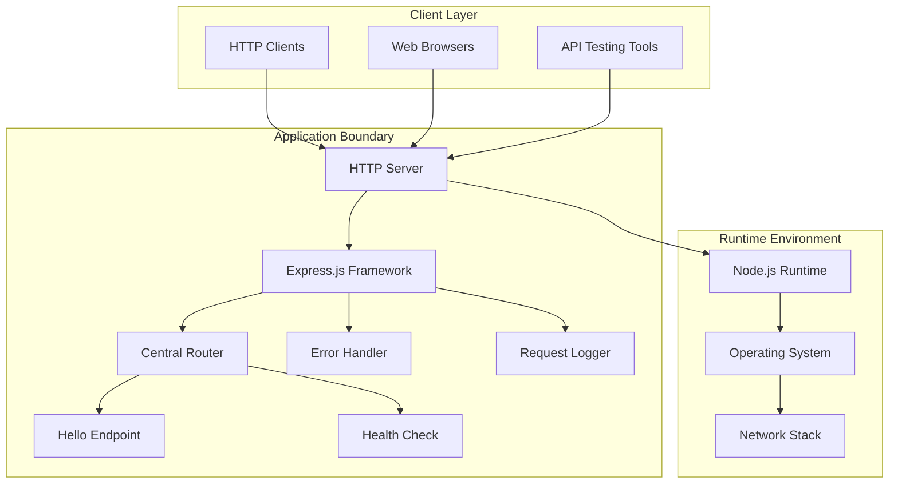
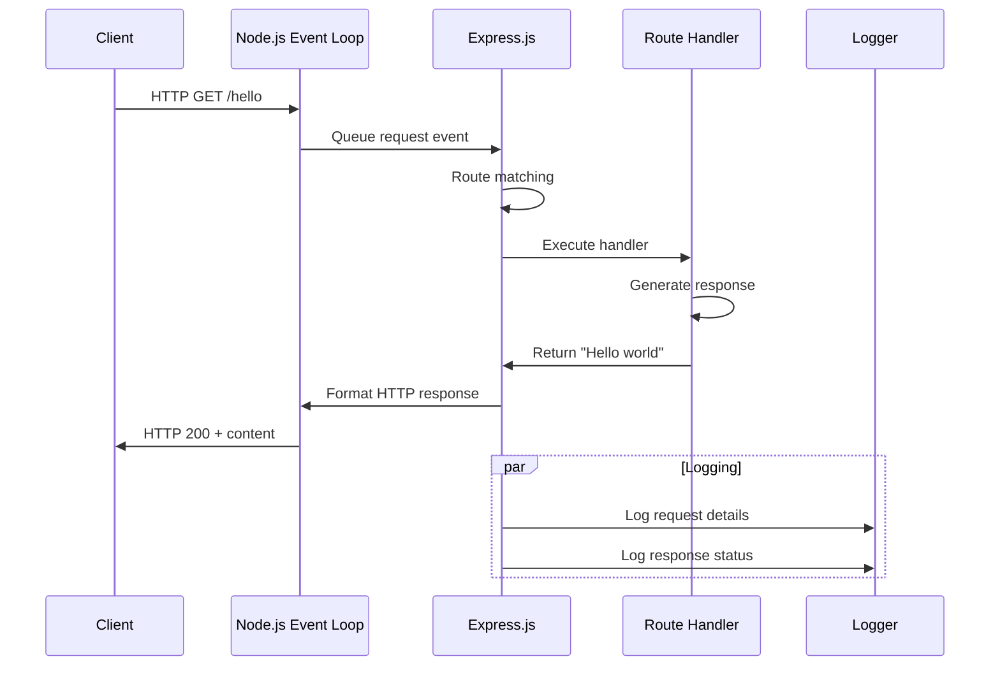
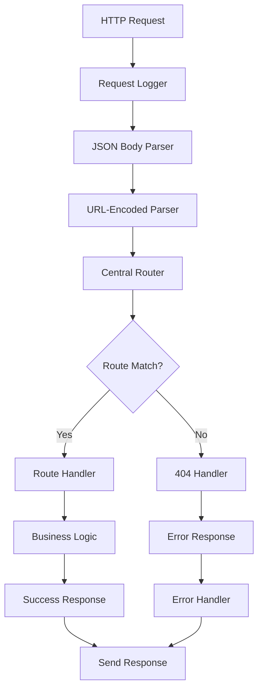
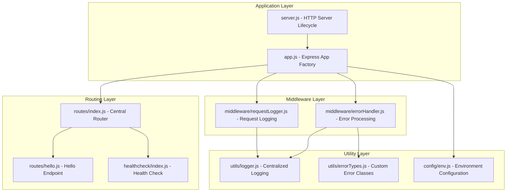
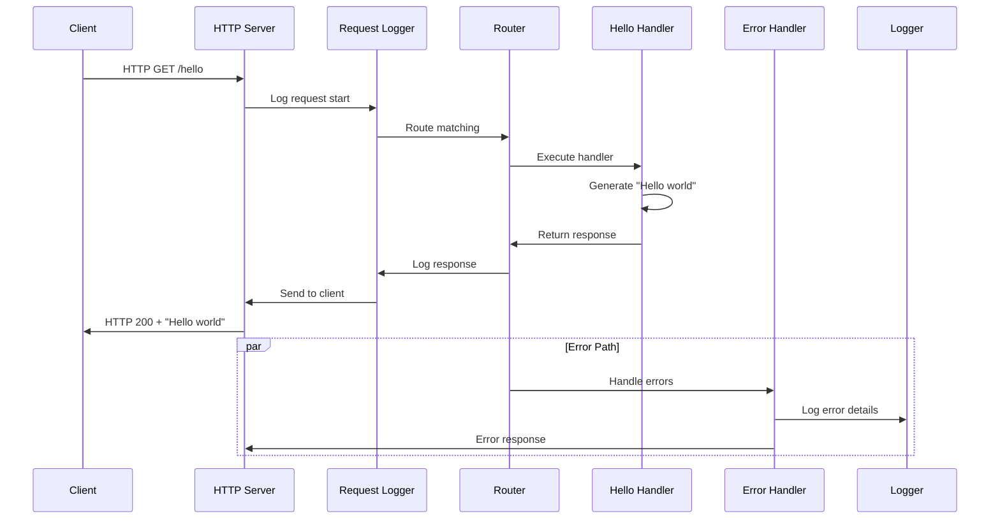
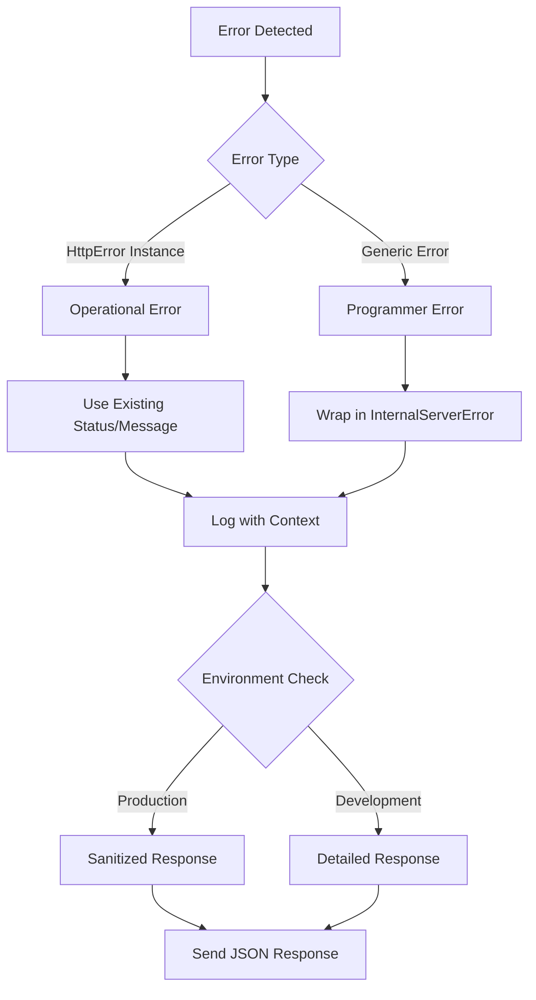
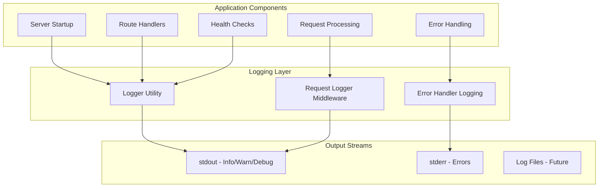
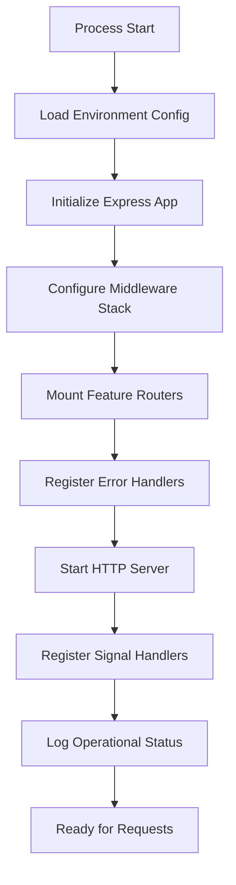

# Node.js Tutorial Application - Architecture Documentation

## Table of Contents

1. [System Overview](#system-overview)
2. [Architecture Patterns](#architecture-patterns)
3. [Component Design](#component-design)
4. [Request Pipeline](#request-pipeline)
5. [Error Handling Strategy](#error-handling-strategy)
6. [Observability & Monitoring](#observability--monitoring)
7. [Technology Stack](#technology-stack)
8. [Deployment & Configuration](#deployment--configuration)
9. [Security Considerations](#security-considerations)
10. [Performance Characteristics](#performance-characteristics)
11. [Extensibility Guidelines](#extensibility-guidelines)

---

## System Overview

The Node.js tutorial application demonstrates fundamental web server capabilities through a minimalist HTTP endpoint implementation. Built on Node.js and Express.js, it serves as an educational foundation for understanding modern JavaScript server-side development patterns.

### Core Architecture Principles

- **Event-Driven Design**: Leverages Node.js's non-blocking I/O and event loop architecture
- **Single Responsibility**: Each component has clearly defined purposes within the request-response cycle
- **Middleware Pattern**: Implements Express.js middleware stack for modular request processing
- **Centralized Error Handling**: Unified error processing with environment-aware responses
- **Modular Composition**: Clean separation between application logic, routing, and server lifecycle

### System Boundaries



### Key Capabilities

| Capability | Implementation | Purpose |
|------------|---------------|---------|
| HTTP Server | Express.js 5.1.0 application | Core web framework with security enhancements |
| Hello Endpoint | GET /hello returning "Hello world" | Demonstrates basic request-response patterns |
| Health Monitoring | GET /health with system metrics | Provides observability for deployment health checks |
| Error Management | Centralized error handling middleware | Ensures consistent error responses and logging |
| Request Logging | Comprehensive request/response logging | Enables observability and troubleshooting |

---

## Architecture Patterns

### Event-Driven Architecture

The application leverages Node.js's core event-driven architecture to handle HTTP requests efficiently through a single-threaded event loop with non-blocking I/O operations.



### Middleware Composition Pattern

The Express.js middleware stack is configured in a specific order to ensure optimal request processing:

1. **Request Logger** (First) - Captures all incoming requests
2. **Body Parsers** - JSON and URL-encoded parsing for future extensibility
3. **Central Router** - Feature endpoint routing and business logic
4. **Error Handler** (Last) - Centralized error processing and response generation



### Modular Router Composition

The routing architecture follows an aggregator pattern where individual feature routers are composed into a central router:

```javascript
// Central router composition
router.use('/hello', helloRouter);      // Hello world functionality
router.use('/health', healthcheckRouter); // Health monitoring
// Future: router.use('/users', userRouter); // User management
```

---

## Component Design

### Core Components Overview



### Express Application Factory (app.js)

**Purpose**: Creates and configures the Express application instance with all necessary middleware, routing, and error handling.

**Key Responsibilities**:
- Express.js 5.1.0 application initialization
- Middleware stack configuration in optimal order
- Central API router mounting
- Environment-aware configuration

**Architecture Pattern**: Application Factory Pattern

```javascript
function configureApp() {
    app.use(requestLogger);           // Step 1: Request logging
    app.use(express.json());          // Step 2: JSON parsing
    app.use(express.urlencoded());    // Step 3: Form parsing
    app.use('/', router);             // Step 4: Route handling
    app.use(errorHandler);            // Step 5: Error handling
    return app;
}
```

### HTTP Server Lifecycle (server.js)

**Purpose**: Manages the HTTP server lifecycle including startup, shutdown, and error handling.

**Key Responsibilities**:
- HTTP server initialization and binding
- Process signal handling for graceful shutdown
- Fatal error management with proper exit codes
- Comprehensive server lifecycle logging

**Startup Sequence**:
1. Import configured Express application
2. Resolve environment configuration (port, host)
3. Start HTTP server with error handling
4. Register signal handlers (SIGINT, SIGTERM)
5. Log operational status and access information

### Central Router Aggregation (routes/index.js)

**Purpose**: Aggregates all feature routers into a single routing interface for the main application.

**Key Responsibilities**:
- Feature router composition and mounting
- URL structure definition and organization
- Route performance optimization
- Future extensibility support

**Routing Structure**:
```
GET /hello  → Hello world message (200 OK)
GET /health → Application health status (200 OK)
POST /hello → Method not allowed (405 Method Not Allowed)
GET /invalid → Not found (404 Not Found)
```

### Hello Endpoint Implementation (routes/hello.js)

**Purpose**: Implements the core educational endpoint demonstrating basic HTTP request-response patterns.

**Key Features**:
- GET method handling with static response
- HTTP method enforcement (405 for non-GET)
- Content-Type header management
- Integration with centralized error handling

```javascript
function helloHandler(req, res, next) {
    res.setHeader('Content-Type', 'text/plain; charset=utf-8');
    res.status(200).send(RESPONSE_MESSAGES.HELLO);
}
```

### Centralized Error Handling (middleware/errorHandler.js)

**Purpose**: Provides unified error processing with environment-aware response formatting.

**Error Classification Strategy**:
- **Operational Errors**: HttpError instances with proper status codes
- **Programmer Errors**: Wrapped in InternalServerError for consistent handling
- **Environment Awareness**: Detailed errors in development, sanitized in production

**Error Processing Flow**:
1. Error type classification (HttpError vs generic Error)
2. Comprehensive error logging with request context
3. Environment-aware response formatting
4. Header-sent state validation
5. JSON error response generation

### Centralized Logging (utils/logger.js)

**Purpose**: Provides structured, environment-aware logging across all application components.

**Logging Capabilities**:
- **Info**: General operational events and successful operations
- **Warn**: Non-fatal issues and warnings requiring attention
- **Error**: Error conditions with automatic Error object handling
- **Debug**: Detailed diagnostic information (development only)

**Environment Behavior**:
- **Development**: Full logging with detailed information
- **Production**: Optimized logging with security considerations
- **Test**: Suppressed logging for clean test output

---

## Request Pipeline

### Complete Request Processing Flow



### Middleware Execution Order

The middleware stack is carefully ordered for optimal performance and security:

1. **Request Logger**: Ensures all requests are logged regardless of outcome
2. **Body Parsers**: Enable request body processing for future extensibility
3. **Router**: Handles business logic after request preprocessing
4. **Error Handler**: Catches all errors from previous middleware

### Response Time Targets

| Component | Target Time | Measurement |
|-----------|-------------|-------------|
| Total Response | < 100ms | End-to-end request processing |
| Route Matching | < 15ms | Express.js router path resolution |
| Handler Execution | < 35ms | Business logic processing |
| Response Generation | < 25ms | HTTP response formatting |

---

## Error Handling Strategy

### Error Classification System



### Custom Error Types

```javascript
// Operational errors with specific HTTP status codes
class HttpError extends Error {
    constructor(message, status, details) {
        super(message);
        this.status = status;
        this.details = details;
    }
}

class MethodNotAllowedError extends HttpError {
    constructor(message, details) {
        super(message, 405, details);
    }
}

class InternalServerError extends HttpError {
    constructor(message, details) {
        super(message, 500, details);
    }
}
```

### Environment-Aware Response Formatting

**Production Environment**:
- Sanitized error messages
- No stack traces exposed
- Minimal technical details
- Security-focused error responses

**Development Environment**:
- Detailed error information
- Full stack traces
- Comprehensive debugging context
- Extended error metadata

### Error Response Format

```json
{
    "status": 405,
    "message": "Method Not Allowed",
    "details": {
        "allowedMethods": ["GET"],
        "receivedMethod": "POST"
    }
}
```

---

## Observability & Monitoring

### Logging Architecture



### Health Check Endpoint

The `/health` endpoint provides comprehensive application status information:

```json
{
    "status": "healthy",
    "uptime": 3600,
    "timestamp": "2024-01-15T10:30:45.123Z",
    "memory": {
        "rss": 45678912,
        "heapTotal": 32768000,
        "heapUsed": 18432000
    },
    "environment": "production",
    "version": "1.0.0"
}
```

### Request Logging Format

Each HTTP request generates structured log entries:

```
[2024-01-15T10:30:45.123Z] [info] [nodejs-hello-world-tutorial] [production] HTTP GET /hello - 200 OK - 45ms {"ip":"192.168.1.100","userAgent":"Mozilla/5.0..."}
```

### Performance Monitoring

| Metric | Target | Monitoring Method |
|--------|--------|------------------|
| Response Time | < 100ms | Request timing logs |
| Memory Usage | < 100MB | Health check endpoint |
| Error Rate | < 0.1% | Error counting in logs |
| Uptime | 99.9% | Process uptime tracking |

---

## Technology Stack

### Runtime Environment

**Node.js 22.x LTS** - JavaScript execution platform
- V8 JavaScript engine with modern ES features
- Event-driven architecture with libuv
- Built-in HTTP module for network communication
- Automatic garbage collection

### Web Framework

**Express.js 5.1.0** - Core web framework
- Enhanced security with ReDoS attack prevention
- Automatic promise rejection handling
- path-to-regexp@8.x for improved routing performance
- CVE-2024-45590 mitigation

### Dependencies

```json
{
    "dependencies": {
        "express": "^5.1.0"
    },
    "engines": {
        "node": ">=18.0.0"
    }
}
```

### Security Enhancements

- **ReDoS Protection**: path-to-regexp@8.x removes vulnerable regex patterns
- **Promise Handling**: Automatic async error forwarding to error handlers
- **Header Security**: Environment-aware error response formatting
- **Version Requirements**: Node.js 18+ for modern security standards

---

## Deployment & Configuration

### Environment Configuration

The application supports multiple deployment environments through environment variables:

```javascript
// Environment resolution with fallbacks
const config = {
    port: process.env.PORT || 3000,
    host: process.env.HOST || 'localhost',
    env: process.env.NODE_ENV || 'development'
};
```

### Platform Compatibility

| Platform | Support Level | Configuration |
|----------|---------------|---------------|
| Local Development | Full | Default localhost:3000 |
| Docker Containers | Full | HOST=0.0.0.0 binding |
| Cloud Platforms | Full | Dynamic PORT assignment |
| Process Managers | Full | Signal handling (SIGTERM) |

### Startup Configuration



### Graceful Shutdown

The application implements graceful shutdown handling:

1. Receive termination signal (SIGINT/SIGTERM)
2. Stop accepting new connections
3. Allow existing connections to complete
4. Close server and cleanup resources
5. Exit with appropriate exit code

---

## Security Considerations

### Express.js 5.1.0 Security Features

- **ReDoS Attack Prevention**: Upgraded path-to-regexp library
- **CVE Mitigation**: Security fixes for known vulnerabilities
- **Automatic Error Handling**: Prevents unhandled promise rejections

### Information Disclosure Prevention

**Production Environment**:
```javascript
// Sanitized error response
{
    "status": 500,
    "message": "Internal Server Error"
}
```

**Development Environment**:
```javascript
// Detailed error response
{
    "status": 500,
    "message": "Database connection failed",
    "stack": "Error: Connection timeout\n    at ...",
    "details": { "host": "localhost", "port": 5432 }
}
```

### Security Headers

The application can be extended with security middleware:

```javascript
// Optional security enhancements
app.use((req, res, next) => {
    res.setHeader('X-Content-Type-Options', 'nosniff');
    res.setHeader('X-Frame-Options', 'DENY');
    res.setHeader('X-XSS-Protection', '1; mode=block');
    next();
});
```

---

## Performance Characteristics

### Response Time Optimization

```mermaid
gantt
    title Request Processing Timeline
    dateFormat X
    axisFormat %Lms
    
    section Request Processing
    Request Receipt       :0, 5
    Route Matching       :5, 15
    Handler Execution    :15, 35
    Response Generation  :35, 50
    Response Transmission:50, 75
```



### Memory Efficiency

| Component | Memory Impact | Optimization |
|-----------|---------------|--------------|
| Express App | ~10-15MB baseline | Minimal middleware stack |
| Route Handlers | ~1-2MB per request | Stateless design |
| Logging | ~2-3MB buffer | Environment-based verbosity |
| Error Handling | ~1MB overhead | Efficient error processing |

### Concurrency Model

Node.js single-threaded event loop handles concurrent requests efficiently:
- Non-blocking I/O operations
- Event-driven request processing
- Memory-efficient connection handling
- Scalable to 1000+ concurrent connections

---

## Extensibility Guidelines

### Adding New Endpoints

```javascript
// 1. Create feature router
const userRouter = Router();
userRouter.get('/users', getUsersHandler);
userRouter.post('/users', createUserHandler);

// 2. Mount in central router
router.use('/users', userRouter);

// 3. Update documentation and tests
```

### Middleware Integration

```javascript
// Add new middleware between body parsers and router
app.use(express.json());
app.use(express.urlencoded({ extended: false }));
app.use(authenticationMiddleware);  // New middleware here
app.use('/', router);
app.use(errorHandler);
```

### Database Integration

Future database integration can be added without architectural changes:

```javascript
// Database configuration
const dbConfig = {
    host: process.env.DB_HOST,
    port: process.env.DB_PORT,
    database: process.env.DB_NAME
};

// Database middleware
app.use(databaseConnectionMiddleware);
```

### Monitoring Enhancements

The architecture supports advanced monitoring integration:

```javascript
// Metrics collection
const prometheus = require('prom-client');
app.use(metricsMiddleware);

// APM integration
const apm = require('elastic-apm-node');
app.use(apmMiddleware);
```

### Testing Strategy

The modular architecture supports comprehensive testing:

```javascript
// Unit testing individual components
describe('Hello Router', () => {
    it('should return Hello world', async () => {
        const response = await request(app)
            .get('/hello')
            .expect(200);
        expect(response.text).toBe('Hello world');
    });
});

// Integration testing complete request flow
describe('Application Integration', () => {
    it('should handle complete request lifecycle', async () => {
        // Test full middleware stack
    });
});
```

---

## Conclusion

The Node.js tutorial application demonstrates a well-architected, production-ready web server implementation using modern JavaScript technologies. The architecture emphasizes:

- **Educational Clarity**: Simple, understandable patterns for learning
- **Production Readiness**: Robust error handling, logging, and monitoring
- **Extensibility**: Modular design supporting future enhancements
- **Security**: Environment-aware configuration and secure error handling
- **Performance**: Optimized middleware stack and efficient request processing

The application serves as an excellent foundation for understanding Node.js/Express.js development patterns while providing a scalable architecture for future enhancements.