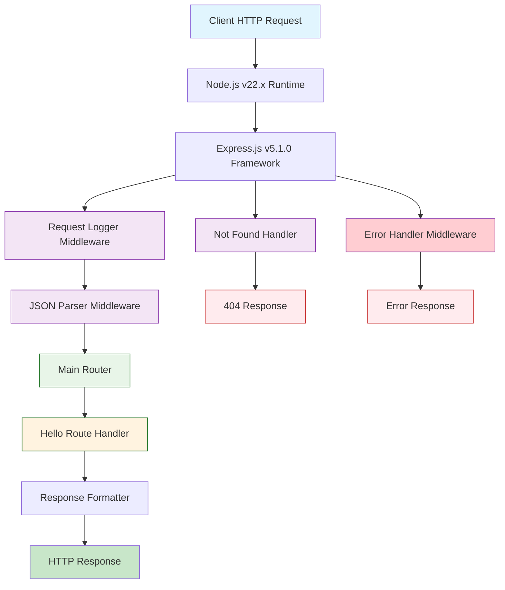
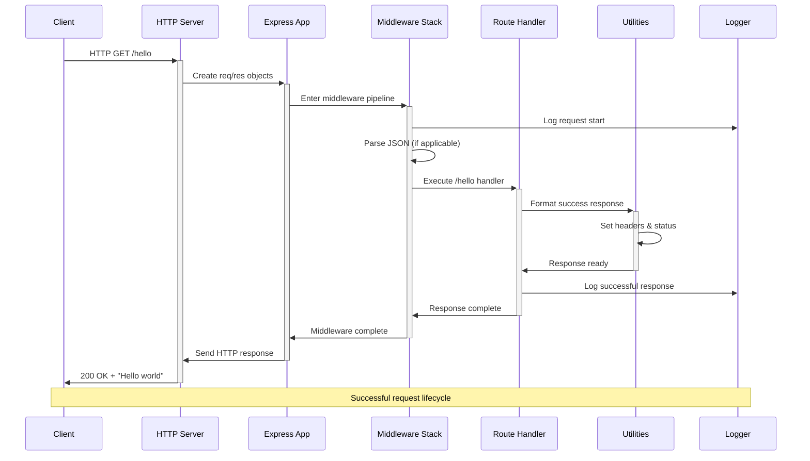
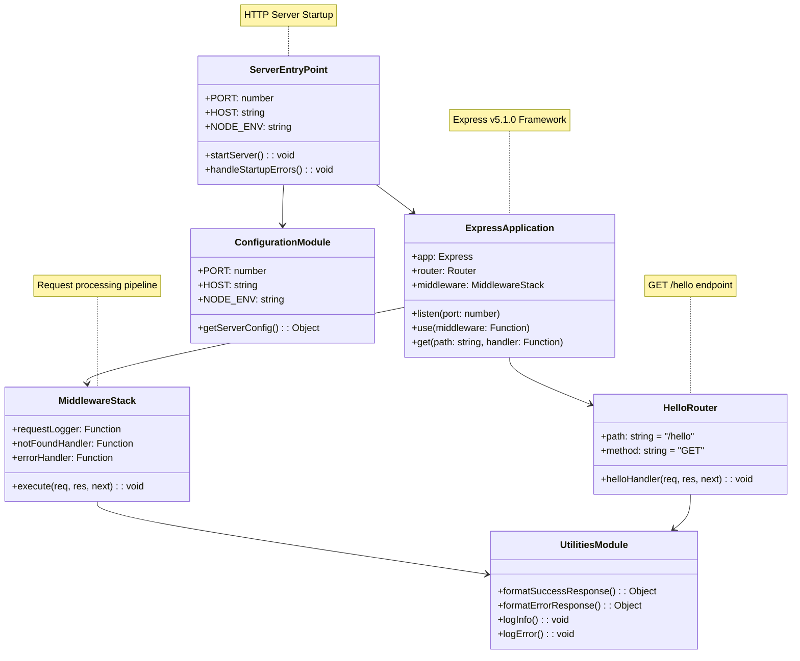
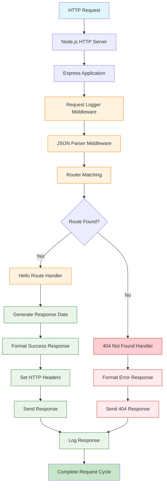
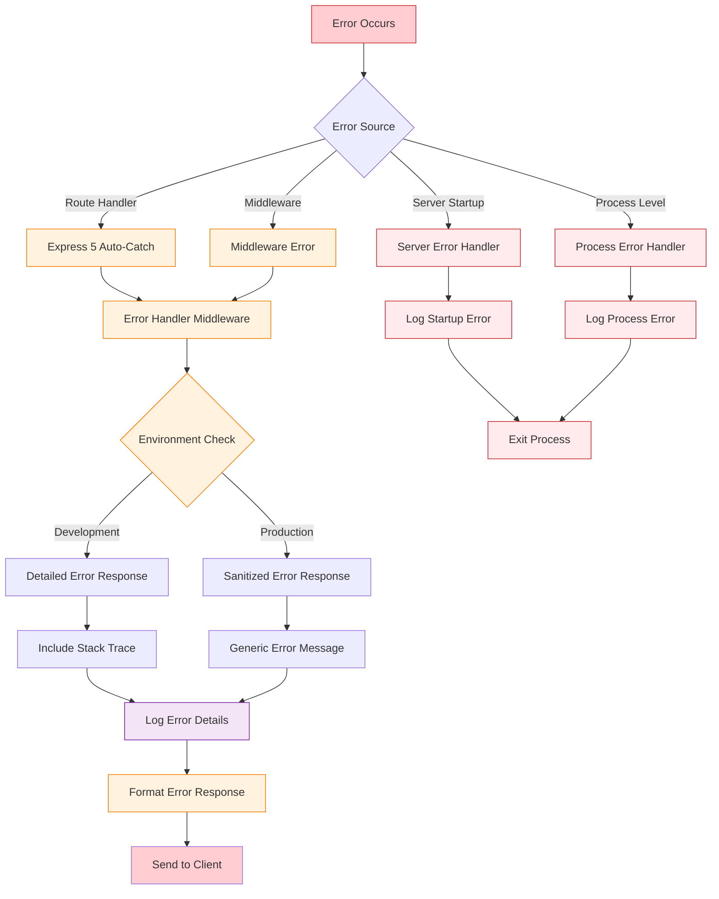
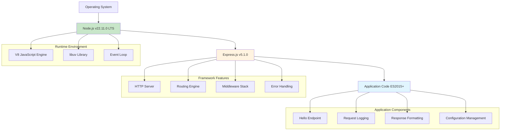
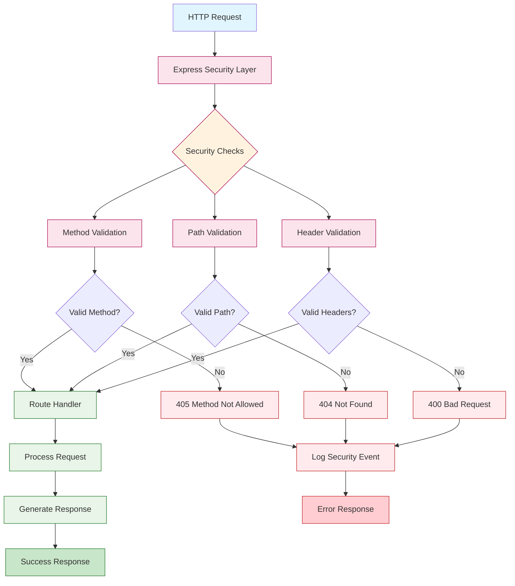
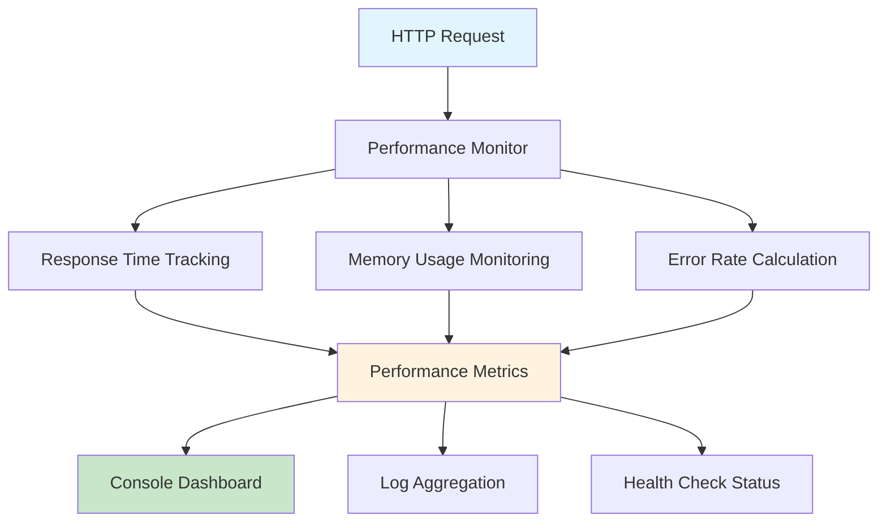
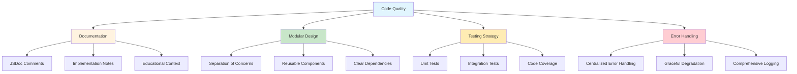

# Node.js Tutorial Application Architecture Documentation

## Table of Contents

1. [High-Level Architecture Overview](#1-high-level-architecture-overview)
2. [Component Design and Responsibilities](#2-component-design-and-responsibilities)
3. [Data Flow and Error Handling](#3-data-flow-and-error-handling)
4. [Technology Stack and Dependency Management](#4-technology-stack-and-dependency-management)
5. [Security, Logging, and Observability](#5-security-logging-and-observability)
6. [Maintainability and Educational Clarity](#6-maintainability-and-educational-clarity)

---

## 1. High-Level Architecture Overview

### 1.1 System Architecture Summary

The Node.js tutorial application follows a **minimalist single-tier architecture** designed specifically for educational purposes. The system employs an **event-driven, non-blocking I/O architecture** that leverages Node.js's single-threaded event loop model to handle HTTP requests efficiently.

**Architectural Style and Rationale:**
- **Simplicity First**: Designed to be educational and maintainable
- **Event-Driven Processing**: Utilizes Node.js's event-driven architecture
- **Non-Blocking Operations**: Leverages the Node.js event loop for efficiency
- **Minimal Dependencies**: Only Express.js v5.1.0 as the primary framework dependency

### 1.2 System Components Overview



### 1.3 Architectural Layers

| Layer | Component | Primary Responsibility | Technology Stack |
|-------|-----------|----------------------|------------------|
| **Runtime Layer** | Node.js Runtime Engine | JavaScript execution and event loop management | Node.js v22.11.0 LTS |
| **Framework Layer** | Express.js Application | HTTP server creation and request routing | Express.js v5.1.0 |
| **Application Layer** | Route Handler Component | Business logic and response generation | JavaScript ES2015+ |

### 1.4 Component Interaction Diagram



### 1.5 Data Flow Architecture

The application implements a straightforward request-response data flow pattern:

1. **HTTP Request Ingestion**: Client HTTP requests arrive at the Node.js HTTP server
2. **Event Loop Processing**: Node.js event loop processes incoming requests
3. **Express.js Routing**: Requests are matched against defined routes
4. **Handler Execution**: The /hello route handler executes synchronously
5. **Response Generation**: HTTP response headers and body are constructed
6. **Client Response**: Completed response is transmitted back to the client

---

## 2. Component Design and Responsibilities

### 2.1 Core Component Architecture



### 2.2 Component Responsibilities Matrix

| Component | File Path | Primary Responsibilities | Key Dependencies | Integration Points |
|-----------|-----------|------------------------|------------------|-------------------|
| **Express Application** | `src/backend/app.js` | App initialization, middleware registration, router mounting | express, routes, middleware | Server startup, testing |
| **Server Entry Point** | `src/backend/server.js` | HTTP server startup, network binding, error handling | app.js, config, logger | Process management |
| **Hello Router** | `src/backend/routes/hello.js` | /hello endpoint implementation, response generation | express, responseFormatter | Main router aggregation |
| **Error Handler** | `src/backend/middleware/errorHandler.js` | Centralized error processing, logging, response formatting | logger, responseFormatter | Express error pipeline |
| **Request Logger** | `src/backend/middleware/requestLogger.js` | HTTP request logging, performance tracking | logger, constants | Request pipeline |
| **Response Formatter** | `src/backend/utils/responseFormatter.js` | Standardized response formatting | httpStatusCodes | Route handlers |
| **Logger Utilities** | `src/backend/utils/logger.js` | Centralized logging with timestamps | None (Node.js built-ins) | All components |
| **Configuration** | `src/backend/config/server.js` | Environment variable management | dotenv | Server startup |

### 2.3 Express.js Application Component (app.js)

The Express application component serves as the central configuration hub:

**Key Features:**
- Implements the Application Factory Pattern
- Registers middleware in critical order
- Mounts routers at appropriate paths
- Configures comprehensive error handling
- Exports ready-to-use application instance

**Middleware Registration Order:**
1. Request Logger (captures all requests)
2. JSON Parser (built-in Express middleware)
3. Main Router (contains /hello endpoint)
4. Not Found Handler (catches unmatched routes)
5. Error Handler (final middleware in stack)

### 2.4 Server Entry Point Component (server.js)

The server component handles HTTP server lifecycle:

**Key Features:**
- Imports configured Express application
- Resolves server configuration from environment
- Handles graceful startup and shutdown
- Implements comprehensive error handling
- Manages process-level events

**Error Handling Strategy:**
- Server startup errors (EADDRINUSE, EACCES)
- Process-level errors (uncaught exceptions)
- Graceful shutdown procedures
- User-friendly error messaging

### 2.5 Hello Endpoint Component (routes/hello.js)

The hello router implements the core tutorial endpoint:

**Key Features:**
- Modular Express Router pattern
- Centralized response formatting
- Static response generation
- Educational code structure
- Comprehensive documentation

**Implementation Pattern:**
```javascript
// Route handler implementation
function helloHandler(req, res, next) {
    formatSuccessResponse(res, HELLO_RESPONSE_TEXT);
}

// Router registration
helloRouter.get('/', helloHandler);
```

---

## 3. Data Flow and Error Handling

### 3.1 Request Processing Lifecycle



### 3.2 Error Handling Flow



### 3.3 Error Classification and Handling

| Error Type | Handling Strategy | Response Pattern | Recovery Action |
|------------|------------------|------------------|----------------|
| **HTTP Errors** | Express.js middleware | Standard HTTP status codes | Graceful degradation |
| **Validation Errors** | Input validation | 400 Bad Request | Client notification |
| **Server Errors** | Process-level handlers | 500 Internal Server Error | Logging and monitoring |
| **Startup Errors** | Startup error handling | Process exit with code 1 | Manual intervention |

### 3.4 Express 5 Error Handling Features

Express 5 introduces significant improvements for error handling:

- **Automatic Promise Rejection Handling**: No need for manual try/catch blocks
- **Enhanced Error Middleware**: Better integration with async operations
- **Improved Stack Traces**: Better debugging capabilities
- **Security Enhancements**: Built-in protection against common vulnerabilities

### 3.5 Data Transformation Pipeline

| Stage | Input | Processing Component | Output | Performance Target |
|-------|-------|---------------------|---------|-------------------|
| **HTTP Parsing** | Raw TCP data | HTTP Server | HTTP Request object | < 5ms |
| **Route Matching** | Request URL | Express Router | Route handler reference | < 5ms |
| **Business Logic** | Request parameters | Hello Handler | Response data | < 50ms |
| **Response Formatting** | Response data | Response Formatter | HTTP Response | < 20ms |
| **Network Transmission** | HTTP Response | HTTP Server | TCP data stream | < 20ms |

---

## 4. Technology Stack and Dependency Management

### 4.1 Core Technology Stack



### 4.2 Programming Languages and Versions

| Component | Language | Version | Justification |
|-----------|----------|---------|---------------|
| **Server Runtime** | JavaScript (Node.js) | v22.x LTS | Production stability and long-term support |
| **Application Logic** | JavaScript (ES2015+) | ES2015+ | Modern JavaScript features |

### 4.3 Framework and Library Dependencies

| Package | Version | Purpose | License | Maintenance Status |
|---------|---------|---------|---------|-------------------|
| **express** | 5.1.0 | Web application framework | MIT | Active (Official) |
| **dotenv** | ^16.4.5 | Environment variable loading | MIT | Active |
| **jest** | ^29.0.0 | Testing framework | MIT | Active |
| **supertest** | ^7.1.1 | HTTP testing library | MIT | Active |
| **eslint** | ^8.56.0 | Code linting | MIT | Active |
| **nodemon** | ^3.0.3 | Development auto-restart | MIT | Active |
| **chalk** | ^5.3.0 | Console output colorization | MIT | Active |

### 4.4 Express.js v5.1.0 Key Features

**Major Improvements:**
- **Node.js Compatibility**: Requires Node.js v18+ for modern features
- **Enhanced Security**: CVE fixes and ReDoS attack prevention
- **Improved Error Handling**: Automatic promise rejection handling
- **Performance Optimizations**: Better request processing efficiency

**Breaking Changes from v4:**
- Dropped support for Node.js versions before v18
- Updated path-to-regexp library for enhanced security
- Removed deprecated API methods from Express v3/v4

### 4.5 Node.js v22.x LTS Benefits

**Version Selection Rationale:**
- **Active LTS Support**: Until 2025-10-21
- **Maintenance LTS**: Until 2027-04-30
- **Stability**: Production-ready with long-term support
- **Modern Features**: ES2015+ support with performance improvements

### 4.6 Development and Production Dependencies

```mermaid
graph LR
    A[Development] --> B[Core Dependencies]
    A --> C[Dev Dependencies]
    A --> D[Test Dependencies]
    
    B --> E[express@5.1.0]
    B --> F[dotenv@^16.4.5]
    
    C --> G[nodemon@^3.0.3]
    C --> H[eslint@^8.56.0]
    C --> I[chalk@^5.3.0]
    
    D --> J[jest@^29.0.0]
    D --> K[supertest@^7.1.1]
    
    L[Production] --> M[Runtime Dependencies]
    M --> N[express@5.1.0]
    M --> O[dotenv@^16.4.5]
    
    style A fill:#e1f5fe
    style L fill:#c8e6c9
    style B fill:#fff3e0
    style M fill:#fff3e0
```

### 4.7 Dependency Management Strategy

**Version Pinning:**
- Express.js pinned to exact version (5.1.0) for stability
- Other dependencies use compatible ranges (^) for updates
- Regular security audits using `npm audit`
- Automated dependency updates for security patches

**Security Considerations:**
- All dependencies from official npm registry
- Regular vulnerability scanning
- Security advisory monitoring
- Minimal dependency tree to reduce attack surface

---

## 5. Security, Logging, and Observability

### 5.1 Security Architecture

While the tutorial application doesn't require complex security infrastructure, it implements fundamental security practices:

**Framework-Level Security:**
- Express.js v5.1.0 with latest security updates
- Automatic ReDoS attack prevention
- Enhanced input validation capabilities
- CVE mitigation and security fixes

**Basic Security Measures:**
- Environment-aware error detail exposure
- Information disclosure prevention
- Standardized error responses
- Request validation and sanitization

### 5.2 Security Control Implementation



### 5.3 Logging Architecture

**Centralized Logging Strategy:**
- Standardized timestamp formatting (ISO 8601 UTC)
- Application identification and log level classification
- Environment-aware colorization for development
- Structured metadata support for error context

**Logging Components:**
- **logInfo**: Information-level logging for operational events
- **logError**: Error-level logging with comprehensive error context
- **requestLogger**: HTTP request logging with performance metrics

### 5.4 Logging Implementation

```mermaid
sequenceDiagram
    participant R as Request
    participant RL as Request Logger
    participant RH as Route Handler
    participant EH as Error Handler
    participant L as Logger Utility
    participant C as Console Output
    
    R->>+RL: HTTP Request
    RL->>L: Log request start
    L->>C: Timestamped log entry
    RL->>+RH: Process request
    
    alt Successful Processing
        RH->>L: Log successful response
        L->>C: Success log entry
        RH->>-RL: Response ready
    else Error Processing
        RH->>+EH: Error occurred
        EH->>L: Log error details
        L->>C: Error log entry
        EH->>-RH: Error response
        RH->>-RL: Error response ready
    end
    
    RL->>L: Log request completion
    L->>C: Completion log entry
    RL->>-R: Send response
```

### 5.5 Observability Patterns

**Three Pillars Implementation:**
| Pillar | Tutorial Implementation | Educational Value |
|--------|------------------------|-------------------|
| **Logs** | Console logging with timestamps | Understanding log structure |
| **Metrics** | Basic performance counters | Metrics collection concepts |
| **Traces** | Request ID correlation | Request tracking patterns |

### 5.6 Health Check Implementation

**Basic Health Check Endpoint:**
```javascript
// Example health check response
{
  "status": "OK",
  "uptime": 3600.123,
  "timestamp": "2024-12-30T10:30:00.000Z",
  "message": "Service is healthy",
  "environment": "development",
  "version": "1.0.0"
}
```

### 5.7 Performance Monitoring

**Key Metrics Tracked:**
- Request response time (target: <100ms)
- Memory usage (target: <50MB)
- Request success rate (target: >99%)
- Error rate (target: <1%)

**Monitoring Integration Points:**


---

## 6. Maintainability and Educational Clarity

### 6.1 Modular Architecture Design

The application follows a **modular architecture pattern** that promotes maintainability and educational clarity:

**File Organization Structure:**
```
src/backend/
├── app.js                          # Express application configuration
├── server.js                       # HTTP server entry point
├── routes/
│   ├── index.js                    # Main router aggregator
│   └── hello.js                    # Hello endpoint router
├── middleware/
│   ├── index.js                    # Middleware aggregator
│   ├── requestLogger.js            # Request logging middleware
│   ├── notFoundHandler.js          # 404 error handler
│   └── errorHandler.js             # Centralized error handler
├── utils/
│   ├── logger.js                   # Centralized logging utilities
│   ├── responseFormatter.js        # Response formatting utilities
│   ├── httpStatusCodes.js          # HTTP status code constants
│   └── constants.js                # Application constants
└── config/
    ├── index.js                    # Configuration aggregator
    └── server.js                   # Server configuration
```

### 6.2 Educational Design Principles

**Comprehensive Documentation:**
- Every file includes detailed JSDoc comments
- Implementation notes explain architectural decisions
- Educational context provided for all major concepts
- Code examples demonstrate proper usage patterns

**Clear Separation of Concerns:**
- App configuration separated from server startup
- Routes organized in modular, mountable routers
- Middleware components isolated and reusable
- Utilities centralized for consistency

### 6.3 Code Quality and Maintainability



### 6.4 Testing Architecture

**Testing Strategy:**
- **Unit Tests**: Individual component testing with Jest
- **Integration Tests**: HTTP endpoint testing with Supertest
- **Code Coverage**: 90%+ coverage target with detailed reporting
- **Continuous Integration**: Automated testing on code changes

**Test Organization:**
```
test/
├── unit/
│   ├── app.test.js
│   ├── routes.test.js
│   └── middleware.test.js
├── integration/
│   ├── server.test.js
│   └── endpoints.test.js
└── helpers/
    └── testUtils.js
```

### 6.5 Development Workflow

**Development Environment Setup:**
1. Node.js v22.x LTS installation
2. npm dependency installation
3. Environment configuration (.env file)
4. Development server startup with nodemon
5. Testing with Jest and Supertest

**Code Development Process:**
1. Write failing tests (TDD approach)
2. Implement minimal code to pass tests
3. Refactor for clarity and performance
4. Update documentation and comments
5. Run full test suite and linting

### 6.6 Extension Guidelines

**Adding New Endpoints:**
1. Create route module in `routes/` directory
2. Implement router with comprehensive documentation
3. Add route to main router aggregator
4. Write corresponding tests
5. Update API documentation

**Adding New Middleware:**
1. Create middleware module in `middleware/` directory
2. Implement middleware function with error handling
3. Export middleware from index aggregator
4. Register middleware in app.js
5. Add tests and documentation

### 6.7 Educational Value Matrix

| Learning Objective | Implementation | Educational Benefit |
|-------------------|----------------|---------------------|
| **HTTP Server Fundamentals** | Express.js server startup and configuration | Understanding web server basics |
| **Middleware Patterns** | Request processing pipeline | Learning Express.js architecture |
| **Error Handling** | Centralized error management | Production-ready error patterns |
| **Modular Architecture** | Component separation and organization | Scalable code structure |
| **Testing Practices** | Unit and integration testing | Quality assurance methods |
| **Documentation** | Comprehensive code comments | Professional development practices |

### 6.8 Scalability Considerations

**Horizontal Scaling:**
- Stateless application design
- No session dependencies
- Environment-based configuration
- Load balancer compatibility

**Code Scalability:**
- Modular router architecture
- Centralized utilities
- Clear dependency management
- Extensible configuration system

### 6.9 Future Development Pathways

**Beginner Extensions:**
- Additional HTTP endpoints
- Request parameter validation
- File system operations
- Basic authentication

**Intermediate Extensions:**
- Database integration
- External API consumption
- Advanced middleware
- Performance optimization

**Advanced Extensions:**
- Microservices architecture
- Container deployment
- Production monitoring
- Security hardening

---

## Conclusion

This Node.js tutorial application demonstrates a production-ready, educational architecture that balances simplicity with professional development practices. The modular design, comprehensive documentation, and clear separation of concerns provide an excellent foundation for learning modern web development with Node.js and Express.js.

The architecture serves both educational and practical purposes, offering:

- **Educational Clarity**: Comprehensive documentation and clear code structure
- **Production Readiness**: Proper error handling, logging, and security practices
- **Maintainability**: Modular design and consistent patterns
- **Extensibility**: Clear pathways for adding functionality
- **Industry Standards**: Modern JavaScript, Express.js, and Node.js practices

This architectural approach ensures that learners understand not only how to build functional applications but also how to structure them for long-term success and professional development practices.