# Node.js Tutorial Application Architecture Documentation

## Table of Contents

1. [System Architecture Overview](#system-architecture-overview)
2. [Component Design](#component-design)
3. [Request Processing Pipeline](#request-processing-pipeline)
4. [Error Handling Architecture](#error-handling-architecture)
5. [Observability and Monitoring](#observability-and-monitoring)
6. [Deployment and Configuration](#deployment-and-configuration)
7. [Security Architecture](#security-architecture)
8. [Technology Stack Integration](#technology-stack-integration)
9. [Extensibility and Future Enhancements](#extensibility-and-future-enhancements)

---

## System Architecture Overview

### High-Level Architecture

The Node.js tutorial application implements a **single-threaded, event-driven, stateless architecture** using Node.js 22.x LTS and Express.js 5.1.0. This architecture represents the fundamental design pattern of modern Node.js applications, leveraging Node.js's ability to perform non-blocking I/O operations despite using a single JavaScript thread.

#### Core Architectural Principles

- **Event-Driven Design**: Built around Node.js's idiomatic asynchronous event-driven architecture using the EventEmitter pattern
- **Non-Blocking I/O**: Utilizes non-blocking I/O calls for efficient resource utilization and high concurrency
- **Middleware Pattern**: Implements Express.js middleware pattern where output of one unit becomes input for the next
- **Single Responsibility**: Each component has a clearly defined purpose within the request-response cycle
- **Stateless Operation**: No persistent state between requests, enabling horizontal scaling

#### System Components Overview

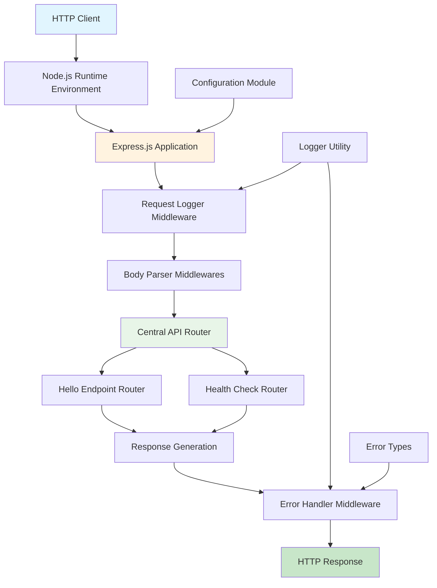

#### Request-Response Lifecycle

The primary data flow follows a straightforward request-response pattern optimized for educational demonstration:

1. **HTTP Request Reception**: Node.js HTTP module receives incoming requests
2. **Express.js Processing**: Request objects enhanced with Express.js middleware capabilities
3. **Middleware Pipeline**: Sequential processing through logging, parsing, and routing
4. **Route Handler Execution**: Business logic execution for endpoint-specific functionality
5. **Response Generation**: Static response content creation with appropriate headers
6. **Error Handling**: Centralized error processing for consistent error responses
7. **HTTP Response Transmission**: Final response delivery to client

---

## Component Design

### Core Components Architecture

The application follows a **layered component architecture** that demonstrates fundamental web server patterns through a minimal yet complete implementation.

#### Component Hierarchy

| Layer | Component | Primary Function | Key Dependencies |
|-------|-----------|------------------|------------------|
| **Runtime Layer** | Node.js Runtime | JavaScript execution and event loop management | Operating system, V8 engine |
| **Framework Layer** | Express.js Application | HTTP server framework and routing | Node.js runtime, path-to-regexp |
| **Application Layer** | Route Handlers | Request processing and response generation | Express.js framework |
| **Middleware Layer** | Request Processing | Cross-cutting concerns (logging, parsing, errors) | Express.js middleware pattern |
| **Utility Layer** | Support Services | Configuration, logging, error types | Node.js built-ins |

### Detailed Component Specifications

#### 1. Express Application Module (`src/backend/app.js`)

**Purpose**: Central Express application configuration and middleware orchestration

**Key Responsibilities**:
- Express.js 5.1.0 application instance initialization with security enhancements
- Middleware stack configuration in optimal execution order
- Central API router mounting for modular route management
- Environment-aware configuration for development and production

**Architecture Patterns**:
```javascript
// Middleware execution order (critical for proper functionality)
app.use(requestLogger);           // 1. Request/response logging (first)
app.use(express.json());          // 2. JSON body parsing (future extensibility)
app.use(express.urlencoded());    // 3. URL-encoded parsing (future extensibility)
app.use('/', router);             // 4. Central API router mounting
app.use(errorHandler);            // 5. Centralized error handling (last)
```

**Integration Points**:
- Imports from `middleware/index.js` for centralized middleware management
- Imports from `routes/index.js` for aggregated routing
- Imports from `config/env.js` for environment-aware setup

#### 2. Server Module (`src/backend/server.js`)

**Purpose**: HTTP server lifecycle management and process-level event handling

**Key Responsibilities**:
- HTTP server initialization with validated environment configuration
- Comprehensive startup, shutdown, and error event logging
- Fatal error handling for server binding failures (EADDRINUSE, EACCES)
- Graceful shutdown handling for SIGINT and SIGTERM signals
- Platform-agnostic server binding for local and cloud deployments

**Server Lifecycle Management**:
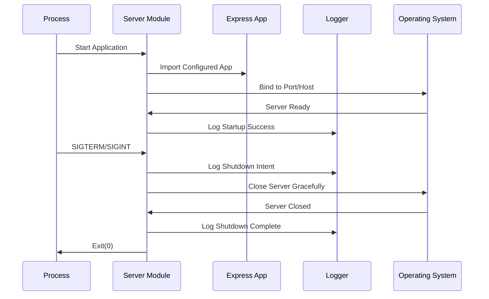

#### 3. Hello Endpoint Router (`src/backend/routes/hello.js`)

**Purpose**: Implementation of the core `/hello` endpoint functionality

**Key Responsibilities**:
- GET method support with static "Hello world" response
- HTTP method enforcement with 405 Method Not Allowed errors
- Proper Content-Type headers (text/plain; charset=utf-8)
- Integration with centralized error handling
- Response time optimization (< 100ms target)

**Route Configuration Pattern**:
```javascript
// Route definitions with method enforcement
router.get('/hello', helloHandler);        // Primary functionality
router.all('/hello', methodNotAllowedHandler); // Method enforcement
```

#### 4. Central API Router (`src/backend/routes/index.js`)

**Purpose**: Modular router aggregation and mounting strategy

**Key Responsibilities**:
- Feature router composition (hello, healthcheck)
- Centralized route organization for maintainability
- Scalable architecture for future endpoint additions
- Clean URL structure without prefixes

#### 5. Error Handler Middleware (`src/backend/middleware/errorHandler.js`)

**Purpose**: Centralized error processing with security-conscious response formatting

**Key Responsibilities**:
- Operational vs. programmer error distinction using HttpError hierarchy
- Environment-aware error response formatting (development vs. production)
- Structured error logging using centralized Logger utility
- Security-focused responses preventing information leakage

**Error Processing Flow**:
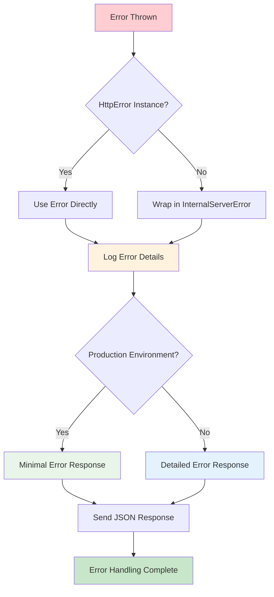

#### 6. Logger Utility (`src/backend/utils/logger.js`)

**Purpose**: Environment-aware structured logging with consistent formatting

**Key Responsibilities**:
- Static logging methods (info, warn, error, debug)
- Environment-aware log output (suppressed in test, debug only in dev)
- ISO8601 timestamping and application metadata
- Structured logging with JSON metadata serialization
- Error object stack trace extraction

**Logging Architecture**:
```javascript
// Log format structure
[timestamp] [level] [app-name] [environment] message {metadata}

// Example output
[2024-01-01T12:00:00.000Z] [info] [nodejs-hello-world-tutorial] [development] Server started {"port":3000}
```

#### 7. Configuration Management (`src/backend/config/`)

**Purpose**: Environment variable resolution and application configuration aggregation

**Components**:
- `env.js`: Environment variable resolution with validation
- `constants.js`: Application constants and response messages
- `index.js`: Configuration aggregation pattern

---

## Request Processing Pipeline

### Middleware Execution Order

The middleware stack is configured to maximize observability, maintainability, and error handling:

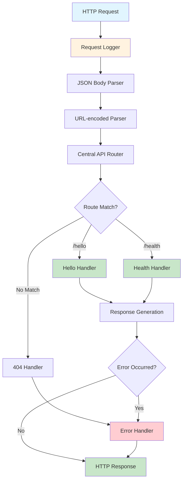

### Request Processing Details

#### 1. Request Logging Phase
- **Middleware**: `requestLogger` from `middleware/requestLogger.js`
- **Execution**: First middleware to ensure comprehensive request coverage
- **Functionality**: Captures request method, URL, user agent, timestamp
- **Output**: Structured log entry for observability

#### 2. Body Parsing Phase
- **Middlewares**: `express.json()` and `express.urlencoded({ extended: false })`
- **Purpose**: Future extensibility for POST/PUT/PATCH endpoints
- **Current Usage**: Not utilized by `/hello` GET endpoint
- **Security**: Basic parsing without nested objects for security

#### 3. Routing Phase
- **Component**: Central API router from `routes/index.js`
- **Pattern**: Feature router aggregation and mounting
- **Route Resolution**: Express.js path-to-regexp 8.x with ReDoS protection
- **Method Enforcement**: 405 errors for unsupported methods

#### 4. Handler Execution Phase
- **Hello Endpoint**: Static response generation with proper headers
- **Health Endpoint**: Process metrics and status information
- **Response Time**: < 100ms target for `/hello` endpoint
- **Error Propagation**: Automatic error forwarding to centralized handler

#### 5. Error Handling Phase
- **Middleware**: `errorHandler` (final middleware in chain)
- **Error Types**: HttpError instances vs. unexpected system errors
- **Response Format**: Environment-aware (detailed dev, minimal production)
- **Logging**: Comprehensive error context for troubleshooting

### Performance Characteristics

| Phase | Target Time | Responsibility | Optimization |
|-------|-------------|----------------|--------------|
| Request Logging | < 5ms | Request metadata capture | Minimal processing overhead |
| Body Parsing | < 10ms | Request body processing | Not used for current endpoints |
| Routing | < 15ms | Route matching and dispatch | Efficient path-to-regexp engine |
| Handler Execution | < 25ms | Business logic processing | Static response generation |
| Error Handling | < 10ms | Error formatting and logging | Conditional processing |
| **Total Pipeline** | **< 100ms** | **Complete request cycle** | **Stateless, non-blocking design** |

---

## Error Handling Architecture

### Centralized Error Management Strategy

The application implements a **centralized error handling approach** that distinguishes between operational errors (expected) and programmer errors (unexpected), ensuring appropriate handling for each scenario.

#### Error Class Hierarchy

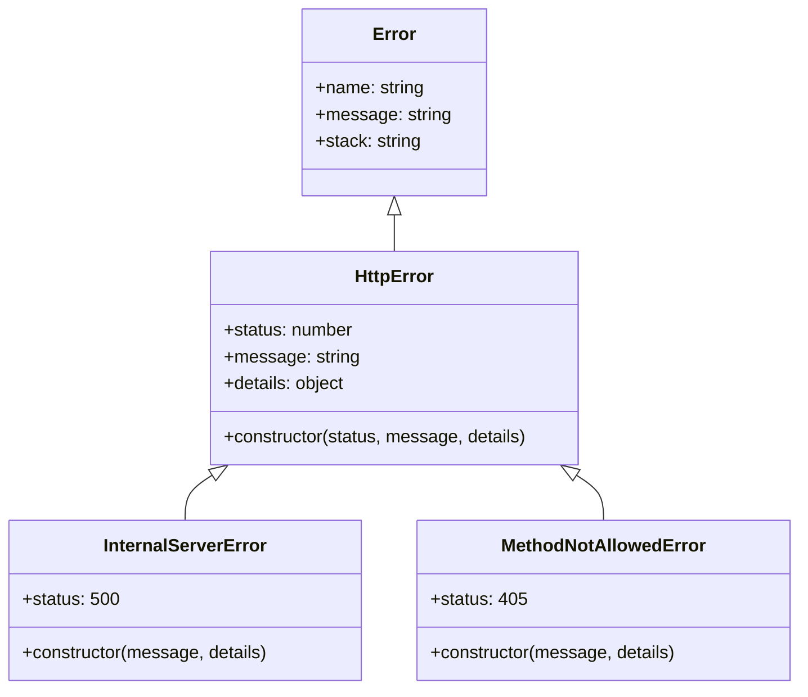

#### Error Handling Flow

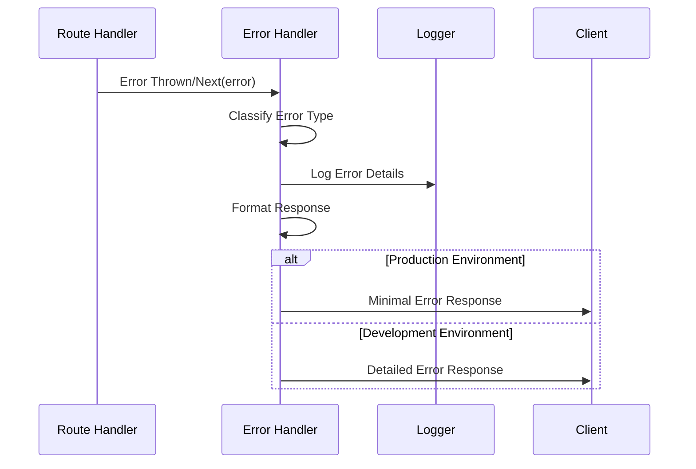

### Error Response Formats

#### Production Environment
```json
{
  "status": 405,
  "message": "Method Not Allowed"
}
```

#### Development Environment
```json
{
  "status": 405,
  "message": "Method Not Allowed",
  "details": {
    "method": "POST",
    "endpoint": "/hello",
    "allowedMethods": ["GET"]
  },
  "stack": "MethodNotAllowedError: Method Not Allowed\n    at ..."
}
```

### Error Categories and Handling

| Error Type | HTTP Status | Example Scenario | Handling Strategy |
|------------|-------------|------------------|-------------------|
| **Client Errors** | 4xx | Invalid route, wrong method | Log as warning, return specific error |
| **Server Errors** | 5xx | Unexpected exceptions | Log as error, return generic message |
| **Validation Errors** | 400 | Malformed request | Log details, return validation feedback |
| **Not Found** | 404 | Unknown endpoint | Log info, return standard 404 |
| **Method Not Allowed** | 405 | Wrong HTTP method | Log warning, return method guidance |

---

## Observability and Monitoring

### Logging Strategy

The application implements **structured, environment-aware logging** using a centralized Logger utility that provides consistent formatting and appropriate verbosity for each environment.

#### Log Levels and Usage

```mermaid
graph TD
    A[Logger.info] --> B[General Application Events]
    A --> C[Server Startup/Shutdown]
    A --> D[Request Processing]
    
    E[Logger.warn] --> F[Deprecated Usage]
    E --> G[Performance Issues]
    E --> H[Client Errors 4xx]
    
    I[Logger.error] --> J[Server Errors 5xx]
    I --> K[Fatal System Errors]
    I --> L[Exception Handling]
    
    M[Logger.debug] --> N[Development Diagnostics]
    M --> O[Detailed Request Context]
    M --> P[Performance Metrics]
    
    style A fill:#e3f2fd
    style E fill:#fff9c4
    style I fill:#ffcdd2
    style M fill:#e8f5e8
```

#### Environment-Aware Behavior

| Environment | Info/Warn | Error | Debug | Output Format |
|-------------|-----------|-------|-------|---------------|
| **Development** | Full logging | Full with stack traces | Enabled | Verbose with metadata |
| **Production** | Essential only | Errors without traces | Disabled | Minimal structured |
| **Test** | Suppressed | Suppressed | Disabled | No output |

### Health Check Implementation

#### Basic Health Endpoint (`/health`)

```javascript
// Health check response format
{
  "status": "healthy",
  "uptime": 123.456,
  "timestamp": "2024-01-01T12:00:00.000Z",
  "memory": {
    "rss": 25165824,
    "heapTotal": 16384000,
    "heapUsed": 12345678,
    "external": 1024000
  },
  "environment": "development",
  "version": "1.0.0"
}
```

#### Health Check Architecture

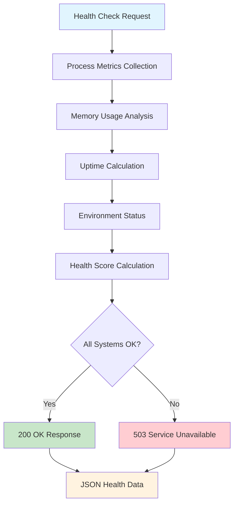

### Request/Response Monitoring

#### Request Logging Middleware

**Captured Metrics**:
- Request method and URL
- Response status code and time
- User agent and basic client info
- Processing duration
- Memory usage snapshots

**Log Format Example**:
```
[2024-01-01T12:00:00.000Z] [info] [nodejs-hello-world-tutorial] [development] GET /hello - 200 - 23ms {"userAgent":"curl/7.68.0","contentLength":11}
```

#### Performance Metrics

| Metric | Target | Measurement | Alerting Threshold |
|--------|--------|-------------|-------------------|
| **Response Time** | < 100ms | Per-request timing | > 200ms |
| **Memory Usage** | < 100MB | Process monitoring | > 150MB |
| **Error Rate** | < 1% | Error count ratio | > 5% |
| **Uptime** | > 99% | Process uptime | < 95% |

---

## Deployment and Configuration

### Environment Configuration Management

The application uses a **centralized configuration pattern** that aggregates environment variables and provides validated configuration objects.

#### Configuration Architecture

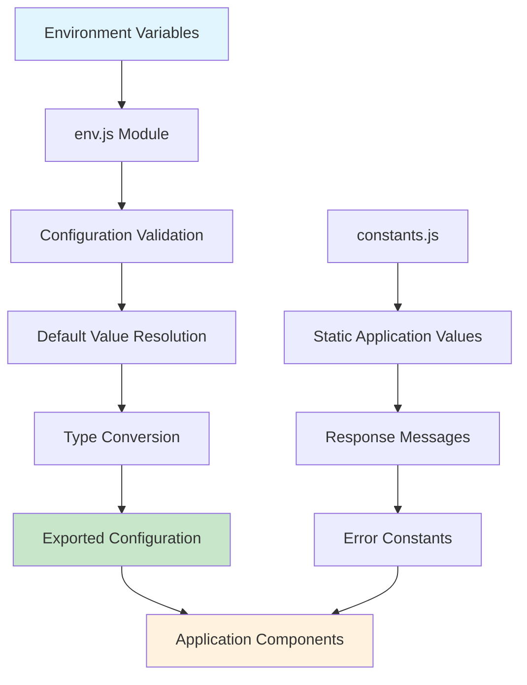

#### Configuration Schema

```javascript
// Environment configuration structure
{
  env: process.env.NODE_ENV || 'development',
  port: parseInt(process.env.PORT) || 3000,
  host: process.env.HOST || 'localhost',
  logLevel: process.env.LOG_LEVEL || 'info'
}

// Application constants
{
  APP_NAME: 'nodejs-hello-world-tutorial',
  RESPONSE_MESSAGES: {
    HELLO: 'Hello world',
    METHOD_NOT_ALLOWED: 'Method Not Allowed',
    INTERNAL_SERVER_ERROR: 'Internal Server Error'
  }
}
```

### Server Startup Process

#### Initialization Sequence

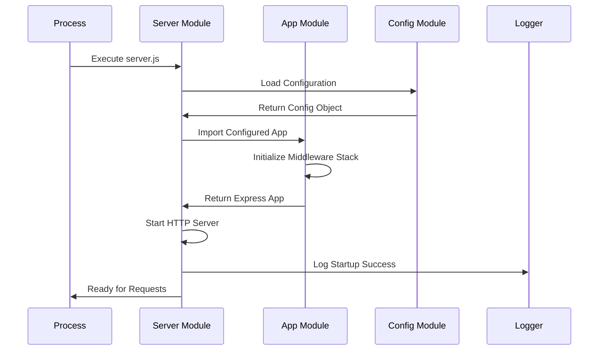

#### Startup Validation

| Component | Validation | Failure Action |
|-----------|------------|----------------|
| **Environment** | NODE_ENV validation | Default to 'development' |
| **Port Binding** | Port availability check | Exit with error code 1 |
| **Configuration** | Required values present | Exit with error code 1 |
| **Dependencies** | Module import success | Exit with error code 1 |

### Graceful Shutdown Implementation

#### Signal Handling

```javascript
// Process signal handling pattern
process.on('SIGINT', handleShutdown);   // Ctrl+C
process.on('SIGTERM', handleShutdown);  // Process manager
process.on('SIGHUP', handleShutdown);   // Terminal disconnect

function handleShutdown(signal) {
  Logger.info(`Received ${signal}, initiating graceful shutdown`);
  server.close((err) => {
    Logger.info('Server closed gracefully');
    process.exit(err ? 1 : 0);
  });
}
```

#### Shutdown Sequence

1. **Signal Reception**: SIGINT, SIGTERM, or SIGHUP received
2. **Shutdown Initiation**: Log shutdown intent and stop accepting new connections
3. **Request Completion**: Allow in-flight requests to complete (10s timeout)
4. **Resource Cleanup**: Close server, database connections, file handles
5. **Process Exit**: Clean exit with appropriate code (0 success, 1 error)

---

## Security Architecture

### Framework-Level Security

The application leverages **Express.js 5.1.0 security enhancements** and follows security best practices appropriate for the educational scope.

#### Express.js 5.1.0 Security Features

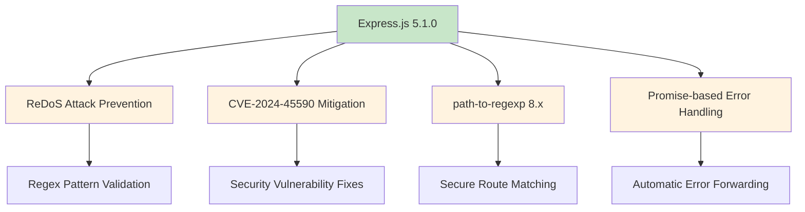

#### Security Headers Implementation

| Header | Value | Purpose |
|--------|-------|---------|
| **X-Powered-By** | Removed | Prevent framework fingerprinting |
| **X-Content-Type-Options** | nosniff | Prevent MIME sniffing attacks |
| **X-Frame-Options** | DENY | Prevent clickjacking attacks |

### Error Security

#### Information Disclosure Prevention

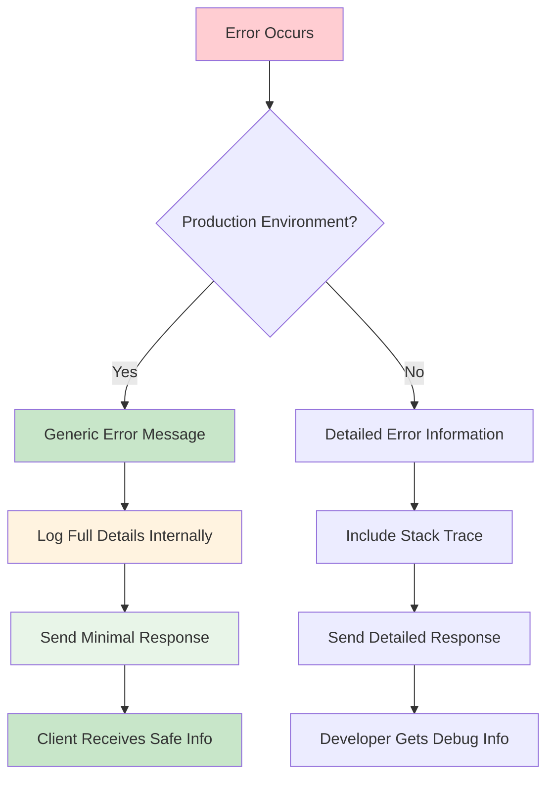

#### Security Response Examples

**Production Error Response**:
```json
{
  "status": 500,
  "message": "Internal Server Error"
}
```

**Development Error Response**:
```json
{
  "status": 500,
  "message": "Database connection timeout",
  "details": {
    "timeout": 5000,
    "host": "localhost"
  },
  "stack": "Error: Database connection timeout\n    at ..."
}
```

---

## Technology Stack Integration

### Framework Integration Architecture

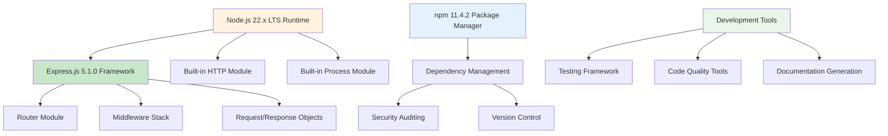

### Dependency Management

#### Core Dependencies

```json
{
  "dependencies": {
    "express": "5.1.0"
  },
  "devDependencies": {
    "jest": "^29.7.0",
    "supertest": "^7.1.1"
  },
  "engines": {
    "node": ">=18.0.0",
    "npm": ">=8.0.0"
  }
}
```

#### Security and Maintenance

| Aspect | Implementation | Frequency |
|--------|----------------|-----------|
| **Vulnerability Scanning** | `npm audit` | Pre-deployment |
| **Dependency Updates** | Manual review process | Monthly |
| **Version Pinning** | Exact versions for production | As needed |
| **Security Advisories** | GitHub/npm security alerts | Continuous |

---

## Extensibility and Future Enhancements

### Architecture Extensibility Points

The current architecture is designed for **future extensibility** while maintaining educational simplicity:

#### Extensibility Matrix

| Enhancement Area | Current State | Extension Point | Implementation Path |
|------------------|---------------|-----------------|-------------------|
| **Additional Endpoints** | Single `/hello` endpoint | Router aggregation pattern | Add feature routers to `routes/index.js` |
| **Database Integration** | Stateless responses | Configuration module | Add database config and connection pooling |
| **Authentication** | Public endpoints | Middleware pipeline | Insert auth middleware before routing |
| **External APIs** | No external calls | Service layer | Create services directory with API clients |
| **Real-time Features** | HTTP only | WebSocket upgrade | Add Socket.io or native WebSocket support |

#### Migration Pathways

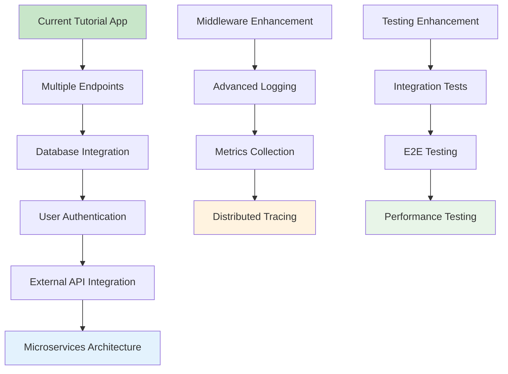

### Scaling Considerations

#### Horizontal Scaling Readiness

The application's **stateless design** enables horizontal scaling:

- **Load Balancer Compatibility**: No session affinity required
- **Container Support**: Docker-ready with environment configuration
- **Cloud Platform Support**: Compatible with Heroku, AWS, Google Cloud
- **Database Scaling**: Ready for external database integration

#### Performance Optimization Paths

| Optimization | Current Baseline | Enhancement Target | Implementation |
|--------------|------------------|-------------------|----------------|
| **Response Time** | < 100ms | < 50ms | Response caching, optimization |
| **Memory Usage** | < 50MB | < 30MB | Memory profiling, garbage collection tuning |
| **Throughput** | 1000 req/sec | 5000 req/sec | Clustering, load balancing |
| **Concurrency** | Event loop limited | Multi-process | Node.js cluster module |

---

## Conclusion

This architectural documentation provides a comprehensive overview of the Node.js tutorial application's design, implementation patterns, and extensibility considerations. The application successfully demonstrates **modern Node.js/Express.js best practices** while maintaining educational simplicity and production-ready patterns.

### Key Architectural Achievements

1. **Educational Clarity**: Simple, understandable architecture for learning
2. **Production Readiness**: Industry-standard patterns and security practices  
3. **Extensibility**: Modular design supporting future enhancements
4. **Observability**: Comprehensive logging and monitoring capabilities
5. **Security**: Framework-level protections and secure error handling
6. **Performance**: Optimized request pipeline with target response times
7. **Maintainability**: Clear separation of concerns and modular organization

The architecture serves as both an educational tool for understanding Node.js web development and a foundation for building more complex applications using the established patterns and practices documented herein.